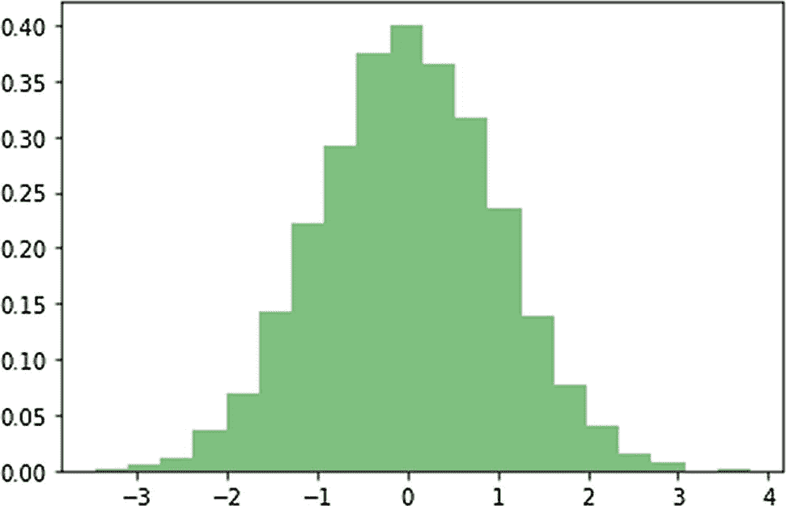

# 七、直方图、等高线和流图

在前一章中，您学习了许多用线条、条形图和散点图创建可视化效果的方法。

在本章中，我们将继续探索 Matplotlib 的各种可视化。您将学习如何创建直方图和等高线。您还将学习如何用流图绘制矢量。

## 直方图

在学习如何创建各种类型的直方图之前，您需要了解它们是什么。首先，你需要知道什么是频率表。假设您有一组具有不同值的成员。您可以创建一个表，该表在一列中包含不同的值范围。每个存储桶必须至少有一个值。然后，您可以计算落入该存储桶的成员数量，并根据存储桶记录这些数量。让我们看一个简单的例子。请为此创建一个新笔记本，如下所示:

```py
%matplotlib inline
import numpy as np
import matplotlib.pyplot as plt

```

现在，让我们手动创建一个数据集，并将存储桶的数量定义为该集的基数(不同元素的数量)。

```py
x = [1, 3, 5, 1, 2, 4, 4, 2, 5, 4, 3, 1, 2]
n_bins = 5

```

您可以使用以下代码显示输出:

```py
plt.hist(x, bins=n_bins)
plt.show()

```

图 [7-1](#Fig1) 显示了输出。


图 7-1

简单直方图

正态(或高斯)分布是一种连续概率分布。通常是钟形曲线。让我们用正态分布曲线创建一个直方图。为了创建数据，我们将使用一个 NumPy 例程。让我们画一个正态分布的随机数据直方图如下:

```py
np.random.seed(31415)
n_points = 10000
n_bins = 15
x = np.random.randn(n_points)
plt.hist(x, bins=n_bins)
plt.show()

```

图 [7-2](#Fig2) 显示了输出。


图 7-2

随机数据的简单直方图

一维数据的直方图是一个 2D 图(如图 [7-2](#Fig2) )。当您想要创建 2D 数据的直方图时，您必须创建一个 3D 图形，其中数据变量位于 x 轴和 y 轴上，直方图位于 z 轴上。换句话说，您可以使用 2D 坐标来显示这个 3D 可视化，并从顶部(俯视图)查看直方图。这些条可以用颜色编码来表示它们的大小。

```py
y = np.random.randn(n_points)
plt.hist2d(x, y, bins=50)
plt.show()

```

图 [7-3](#Fig3) 显示了输出。


图 7-3

2D 数据的简单直方图

您可以通过设置透明度和颜色来自定义直方图，如下所示:

```py
plt.hist(x, 20, density=True,
         histtype='stepfilled',
         facecolor='g', alpha=0.5)
plt.show()

```

图 [7-4](#Fig4) 显示了输出。



图 7-4

定制直方图

您也可以只显示直方图的轮廓，如下所示:

```py
plt.hist(x, 20, density=True,
         histtype='step')
plt.show()

```

图 [7-5](#Fig5) 显示了输出。


图 7-5

仅带有轮廓的自定义直方图

## 轮廓

轮廓代表物体的轮廓。轮廓是突出物体形状的连续(在许多情况下是闭合的)线条。等高线在制图学领域很有用，制图学就是制作地图。在地图上，等高线连接等高的点。因此，等高线上的所有点都在相同的高度(从海平面开始)。在我们使用等高线的其他应用中，同一等高线上的所有点具有相同的值(或量值)。

让我们画一个简单的轮廓。我们将通过创建如下圆形轮廓来创建和可视化我们自己的数据:

```py
x = np.arange(-3, 3, 0.005)
y = np.arange(-3, 3, 0.005)
X, Y = np.meshgrid(x, y)
Z = (X**2 + Y**2)
out = plt.contour(X, Y, Z)
plt.clabel(out, inline=True,
           fontsize=10)
plt.show()

```

图 [7-6](#Fig6) 显示了输出。


图 7-6

简单标记轮廓

您还可以向输出中添加一个颜色条，如下所示:

```py
out = plt.contour(X, Y, Z)
plt.clabel(out, inline=True,
           fontsize=10)
plt.colorbar(out)
plt.show()

```

图 [7-7](#Fig7) 显示了输出。


图 7-7

带有颜色条的简单标注轮廓

您也可以按如下方式设置轮廓的颜色:

```py
out = plt.contour(X, Y, Z,
                  colors='g')
plt.clabel(out, inline=True,
           fontsize=10)
plt.show()

```

图 [7-8](#Fig8) 显示了输出。


图 7-8

带有自定义颜色的简单标注轮廓

您也可以有一个填充的轮廓。这些样式用于高亮显示等高线可视化中的各个区域。让我们如下可视化填充轮廓:

```py
plt.contourf(X, Y, Z,
             hatches=['-', '/', '\\', '//'],
             cmap='cool',
             alpha=0.75)
plt.show()

```

图 [7-9](#Fig9) 显示了输出。


图 7-9

填充轮廓

## 用流图可视化矢量

到目前为止，我们已经可视化了标量实体，它们具有量值。到目前为止，您所学的所有可视化对于标量来说都是非常好的。相反，向量是有大小和方向的实体。例如，力有大小和方向。一个具体的例子是磁力场。您可以用流图可视化矢量。让我们创建自己的数据集来对此进行可视化。我们将用`X`和`Y`创建一个网格。然后我们将创建`U`和`V`来显示数量级。

```py
Y, X = np.mgrid[-5:5:200j, -5:5:300j]
U = X**2 + Y**2
V = X + Y

```

您可以创建一个简单的流图，如下所示:

```py
plt.streamplot(X, Y, U, V)
plt.show()

```

图 [7-10](#Fig10) 显示了输出。


图 7-10

简单流图

您也可以拥有如下可变密度的流图:

```py
plt.streamplot(X, Y, U, V,
               density=[0.5, 0.75])
plt.show()

```

图 [7-11](#Fig11) 显示了输出。


图 7-11

可变密度的流图

您也可以按如下方式将颜色分配给流图:

```py
plt.streamplot(X, Y, U, V, color=V,
           linewidth=1, cmap='cool')
plt.show()

```

图 [7-12](#Fig12) 显示了输出。


图 7-12

可变颜色的流图

您也可以创建具有可变线宽的流图，如下所示:

```py
plt.streamplot(X, Y, U, V,
               density=0.6,
               color='k',
               linewidth=X)
plt.show()

```

图 [7-13](#Fig13) 显示了输出。


图 7-13

可变线宽的流图

您也可以使用箭图进行向量可视化，如下所示:

```py
X = np.arange(-5, 5, 0.5)
Y = np.arange(-10, 10, 1)
U, V = np.meshgrid(X, Y)
plt.quiver(X, Y, U, V)
plt.show()

```

图 [7-14](#Fig14) 显示了输出。


图 7-14

用颤动图可视化矢量场

## 摘要

在本章中，您学习了直方图、等值线和流图。

在下一章，你将学习如何可视化图像和音频。您还将学习图像的插值方法。