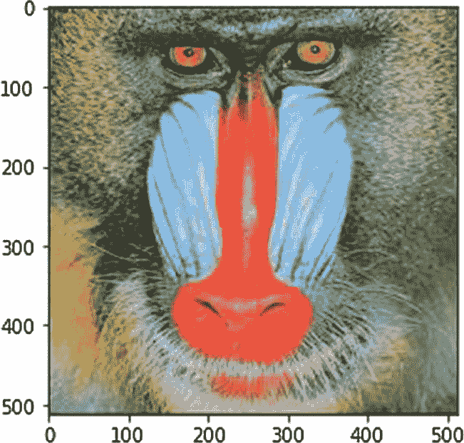

# 八、图像和音频可视化

在前一章中，您学习了如何用直方图、等值线和流图创建可视化效果。

在本章中，您将学习如何使用 Matplotlib 处理和可视化图像和音频。具体来说，您将了解本章中的以下主题:

*   可视化图像

*   插值方法

*   音频可视化

*   音频处理

读完这一章，我们将能够用 Matplotlib 可视化图像和音频。

## 可视化图像

你可以用 Matplotlib 读取数字图像，它支持许多图像格式，尽管你必须安装一个名为 *pillow* 的库。如下图所示安装枕头:

```py
!pip3 install pillow

```

我建议您为本章创建一个新的笔记本。使用以下语句导入库:

```py
%matplotlib inline
import numpy as np
import matplotlib.pyplot as plt

```

您可以使用 Windows 上的功能`imread()`读取数字图像，如下所示:

```py
img1 = plt.imread("D:/Dataset/4.2.03.tiff")

```

Linux 和 Mac 的代码类似，如下所示:

```py
img1 = plt.imread("~/Dataset/4.2.03.tiff")

```

现在让我们看看变量的内容，如下所示:

```py
print(img1)

```

输出如下所示:

```py
array([[[164, 150,  71],
        [ 63,  57,  31],
        [ 75,  43,  10],
        ...,
        [  5,   8,   5],
        [  2,   5,   0],
        [  4,   5,   2]]], dtype=uint8)

```

为了节省空间，我删除了输出的中间部分，但这毕竟是一个数组。我们可以用下面的代码来确认这一点:

```py
type(img1)

```

输出如下所示:

```py
numpy.ndarray

```

要了解有关图像的更多信息，可以检查存储图像数据的 Ndarray 的属性。彩色图像存储为 3D 矩阵，该矩阵的每个维度都用于可视化颜色通道的强度。彩色图像以红、绿、蓝(RGB)格式读取和存储。因为灰度图像中没有颜色，所以只有一个平面(2D 矩阵)存储灰度值的强度。

您可以使用例程`imshow()`将任何 n 数组显示为图像，如下所示:

```py
plt.imshow(img1)
plt.show()

```

图 [8-1](#Fig1) 显示了输出。



图 8-1

*可视化图像*

这是一幅彩色图像。Matplotlib 库自动检测图像是否有多个通道，并将其显示为彩色图像。然而，当我们显示灰度图像时，它会出错一点。

```py
img2 = plt.imread("D:/Dataset/5.1.11.tiff")
plt.imshow(img2)
plt.show()

```

图 [8-2](#Fig2) 显示了输出。


图 8-2

可视化灰度图像

图像数据解释正确，但颜色似乎有些问题。对于灰度图像，Matplotlib 使用默认颜色映射，因此您必须按如下方式手动指定颜色映射:

```py
plt.imshow(img2, cmap = 'gray')
plt.show()

```

图 [8-3](#Fig3) 显示了输出。


图 8-3

用正确的颜色映射可视化灰度图像

颜色映射是定义可视化颜色的值矩阵。让我们为图像尝试另一种颜色映射，如下所示:

```py
plt.imshow(img2, cmap = 'cool')
plt.show()

```

图 [8-4](#Fig4) 显示了输出。


图 8-4

*可视化一张* *灰度图像* *与一张* *冷色图*

您可以使用以下语句在当前版本的 Matplotlib 中显示颜色映射列表:

```py
plt.colormaps()

```

输出如下所示:

```py
['Accent',
 'Accent_r',
  .........
 'twilight_r',
 'twilight_shifted',
 'twilight_shifted_r',
 'viridis',
 'viridis_r',
 'winter',
 'winter_r']

```

我已经删除了输出的一大部分，以便适合这本书。您可以使用这些彩色地图中的任何一种来满足您的可视化需求。作为练习，尝试一些带有灰度图像的彩色地图。

### 图像掩蔽

您可以使用圆形遮罩图像区域，如下所示:

```py
import matplotlib.patches as patches
fig, ax = plt.subplots()
im = ax.imshow(img1)
patch = patches.Circle((245, 200),
                       radius=200,
                       transform=ax.transData)
im.set_clip_path(patch)

ax.axis('off')
plt.show()

```

在这个代码示例中，我们用例程`Circle()`在 XY 坐标 245，200 处创建一个圆。半径为 200 像素。此外，我们正在使用例程`set_clip_path()`裁剪带有圆圈的图像，并显示它。图 [8-5](#Fig5) 显示了输出。


图 8-5

用圆形剪裁图像

## 插值方法

您可以将简单的 NumPy Ndarray 显示为图像，如下所示:

```py
img3 = [[1, 2, 3, 4],
       [5, 6, 7, 8],
       [9, 10, 11, 12],
       [13, 14, 15, 16]]
plt.imshow(img3)
plt.show()

```

图 [8-6](#Fig6) 显示了输出。


图 8-6

numpy ndarray 作为映像

该图像没有使用可视化的插值方法。我们可以演示如下插值方法:

```py
methods = ['none', 'antialiased', 'nearest', 'bilinear',
           'bicubic', 'spline16', 'spline36', 'hanning',
           'hamming', 'hermite', 'kaiser', 'quadric',
           'catrom', 'gaussian', 'bessel', 'mitchell',
           'sinc', 'lanczos', 'blackman']

fig, axs = plt.subplots(nrows=4, ncols=6, figsize=(9, 6),
                        subplot_kw={'xticks': [], 'yticks': []})

for ax, interp_method in zip(axs.flat, methods):
    ax.imshow(img3, interpolation=interp_method, cmap='hot')
    ax.set_title(str(interp_method))

plt.tight_layout()
plt.show()

```

在这个代码示例中，我们只是用 Matplotlib 中所有可用的插值方法显示了相同的 Ndarray。图 [8-7](#Fig7) 显示了输出。


图 8-7

插值方法演示

## 音频可视化

可以使用 Matplotlib 来可视化音频。您只需要 SciPy 库来读取音频文件并将数据存储到 Ndarray 中。让我们安装它，如下所示:

```py
!pip3 install scipy

```

让我们导入所有需要的库，如下所示:

```py
%matplotlib inline
import matplotlib.pyplot as plt
from scipy.io import wavfile

```

现在让我们来读一个音频文件。我正在读取一个 WAV 文件，如下所示:

```py
samplerate, data = wavfile.read('sample.wav')

```

让我们看看音乐的采样率，如下所示:

```py
print(samplerate)

```

输出如下所示:

```py
44100

```

这是一个常见的采样速率(44.1 kHz)。你可以在 [`https://www.izotope.com/en/learn/digital-audio-basics-sample-rate-and-bit-depth.html`](https://www.izotope.com/en/learn/digital-audio-basics-sample-rate-and-bit-depth.html) 阅读一篇关于音频采样率的资料性文章。

您还可以按如下方式显示数据:

```py
print(data)

```

数据如下:

```py
[[-204   23]
 [-233   32]
 [-191   34]
 ...
 [ 646  676]
 [ 679  707]
 [ 623  650]]

```

您可以按如下方式检查音频的属性:

```py
print(type(data))
print(data.shape)
print(data.ndim)
print(data.dtype)
print(data.size)
print(data.nbytes)

```

输出如下所示:

```py
<class 'numpy.ndarray'>
(2601617, 2)
2
int16
5203234
10406468

```

如您所见，音频数据被检索并存储在 NumPy 中。它存储在 2D 矩阵中。假设音频数据有 N 个数据点(也称为*采样点*);那么 NumPy 数组的大小就是 N×2。如你所见，音频有两个声道，左声道和右声道。因此，每个通道存储在一个单独的大小为 N 的数组中，因此我们有 N×2。这就是所谓的*立体声音频*。在本例中，我们有 2，601，617 个点(样本)。每个点或样本用一对 16 位(2 字节)的整数表示。因此，每个样本需要四个字节。因此，我们可以通过将样本大小乘以 4 来计算存储音频数据所需的总原始内存。当我们可视化音频时，我们显示样本的两个声道的值。让我们将前 2000 个数据点形象化如下:

```py
plt.plot(data[:2000])
plt.show()

```

图 [8-8](#Fig8) 显示了输出。


图 8-8

音频文件的可视化

您可以按如下方式检查音频样本的数量:

```py
samples = data.shape[0]
print(samples)

```

输出如下所示:

```py
2601617

```

您可以创建不同的数据可视化，如下所示:

```py
plt.plot(data[:10*samplerate])
plt.show()

```

图 [8-9](#Fig9) 显示了输出。


图 8-9

音频文件的可视化

让我们将两个通道的数据分开，如下所示:

```py
channel1 = data[:, 0]
channel2 = data[:, 1]
print(channel1, channel2)

```

输出如下所示:

```py
[-204 -233 -191 ...  646  679  623] [ 23  32  34 ... 676 707 650]

```

让我们将数据可视化如下:

```py
plt.subplot(2, 1, 1)
plt.plot(channel1[:10*samplerate])
plt.subplot(2, 1, 2)
plt.plot(channel2[:10*samplerate], c='g')
plt.show()

```

图 [8-10](#Fig10) 显示了输出。


图 8-10

两个音频通道的可视化

## 音频处理

傅立叶变换将时域中表示为波的数据转换到频域中。因此，当您计算傅里叶变换并将其可视化时，您看到的是频域中的表示。

快速傅立叶变换(FFT)是计算波形数据的傅立叶变换的有效方法。FFT 减少了计算量，这就是它速度快的原因；这就是为什么它被称为快速傅立叶变换。让我们计算音频信号的快速傅立叶变换，如下所示:

```py
import scipy.fftpack
datafft = scipy.fftpack.fft(data)
fftabs = abs(datafft)
print(fftabs)

```

输出如下所示:

```py
[[ 181\.  227.]
 [ 201\.  265.]
 [ 157\.  225.]
 ...
 [1322\.   30.]
 [1386\.   28.]
 [1273\.   27.]]

```

让我们计算频率并绘制图表如下:

```py
freqs = scipy.fftpack.fftfreq( samples, 1/samplerate )
plt.plot(freqs, fftabs)
plt.show()

```

图 [8-11](#Fig11) 显示了输出。


图 8-11

FFT 可视化

## 摘要

在本章中，您学习了如何为图像和音频创建可视化效果。

在下一章，你将学习如何可视化饼图和极坐标图。