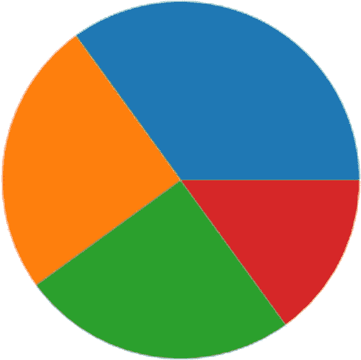
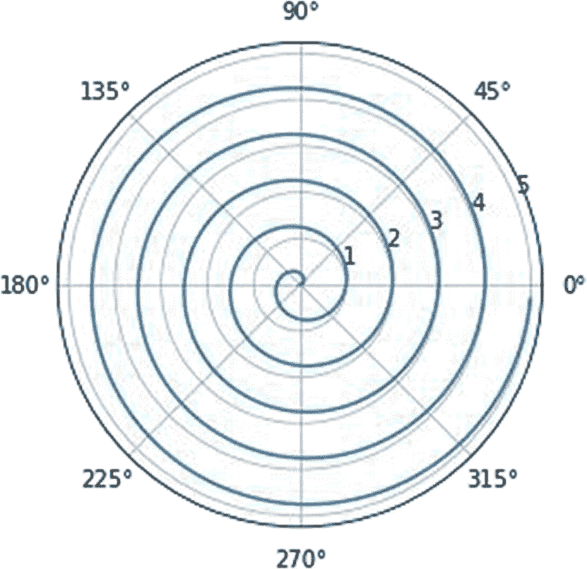

# 九、饼图和极坐标图

在前一章中，您学习了如何使用 Matplotlib 和 SciPy 可视化和处理图像和音频。

在本章中，你将学习如何用 Matplotlib 创建饼图和极坐标图。

## 饼图

让我们先学习饼图的基础知识。顾名思义，饼图是一个根据数据放射状划分的圆。想象一个苹果派或者一个切成片的比萨饼。饼状图很符合这种描述；然而，与通常对称划分的比萨饼或馅饼不同，饼图不一定是径向对称的。这完全取决于要可视化的数据。

让我们开始吧。我建议为这个练习创建一个新的笔记本。

```py
%matplotlib inline
import matplotlib.pyplot as plt
import numpy as np

```

让我们创建要可视化的数据，如下所示:

```py
data = np.array([35, 25, 25, 15])

```

让我们用一个简单的饼图来直观显示数据，如下所示:

```py
plt.pie(data)
plt.show()

```

图 [9-1](#Fig1) 显示了输出。



图 9-1

简单的饼图

让我们添加如下标签:

```py
mylabels = ['A', 'B', 'C', 'D']
plt.pie(data,
        labels = mylabels)
plt.show()

```

图 [9-2](#Fig2) 显示了输出。


图 9-2

带标签的简单饼图

您甚至可以将饼图的各个部分分开一点，如下所示:

```py
explode = [0.0, 0.05, 0.1, 0.15]
plt.pie(data,
        labels = mylabels,
        explode = explode)
plt.show()

```

输出将按照`explode`参数中的值将饼图的各个部分分开。图 [9-3](#Fig3) 显示输出。


图 9-3

带有标签和展开图的简单饼图

您也可以启用阴影，如下所示:

```py
plt.pie(data,
        labels = mylabels,
        explode = explode,
        shadow = True)
plt.show()

```

图 [9-4](#Fig4) 显示了输出。


图 9-4

带阴影的简单饼图

您还可以向输出中添加图例，如下所示:

```py
plt.pie(data,
        labels = mylabels,
        explode = explode,
        shadow = True)
plt.legend()
plt.show()

```

图 [9-5](#Fig5) 显示了输出。


图 9-5

带有图例的简单饼图

您可以为图例添加标题，如下所示:

```py
plt.pie(data,
        labels = mylabels,
        explode = explode,
        shadow = True)
plt.legend(title='Data :')
plt.show()

```

图 [9-6](#Fig6) 显示了输出。


图 9-6

带有图例和图例标题的简单饼图

您刚刚学习了如何创建极坐标图。

## 极坐标图

您还可以创建饼图形状的极坐标图。然而，与笛卡尔(X-Y)坐标系的一个根本区别是，在极坐标图中，坐标系是径向排列的，因此您需要从原点的角度(θ)和距离( *r* 是半径)来可视化一个点或一组点。让我们创建一个数据集，如下所示:

```py
N = 20
theta = np.linspace(0.0, 2 * np.pi, N)
r = 10 * np.random.rand(N)

```

这组点可以被可视化如下:

```py
plt.subplot(projection='polar')
plt.bar(theta, r, bottom=0.0,
       color=['r', 'g', 'b'], alpha=0.2)
plt.show()

```

图 [9-7](#Fig7) 显示了输出。


图 9-7

简单的极坐标图

你可以看到这创建了一个可视化的条形图，如图 [9-7](#Fig7) 所示。YouTube 上有一些有用的视频教程，您可以从中了解更多关于在极坐标系统中创建可视化效果的信息。

```py
https://www.youtube.com/watch?v=mDT_DG_A0JA
https://www.youtube.com/watch?v=GMcRqtm4mNo
https://www.youtube.com/watch?v=VmQ1isayjJI

```

让我们创建一个简单的图表。让我们为它创建数据集，如下所示:

```py
r = np.arange(0, 5, 0.2)
theta = 2 * np.pi * r
plt.subplot(projection='polar')
plt.plot(theta, r)
plt.show()

```

这在极坐标图上创建了简单的线性可视化。由于这是一个极坐标图，你会看到一个螺旋状的结构，如图 [9-8](#Fig8) 所示。


图 9-8

极图上的简单线性可视化

这不是一个完美的螺旋，因为连续点之间的距离是 0.2。如果你减少距离，那么你会得到一个完美的螺旋。让我们将数据调整如下:

```py
r = np.arange(0, 5, 0.01)
theta = 2 * np.pi * r
plt.subplot(projection='polar')
plt.plot(theta, r)
plt.show()

```

这就形成了一个完美的螺旋，如图 [9-9](#Fig9) 所示。



图 9-9

螺旋形视觉效果

让我们来看几个极坐标图上的散点图示例。首先，准备如下所示的数据:

```py
N = 150
r = np.random.rand(N)
theta = 2 * np.pi * np.random.rand(N)
size = r * 100

```

您可以这样想象:

```py
plt.subplot(projection='polar')
plt.scatter(theta, r, c=theta,
            s=size, cmap='hsv',
            alpha=0.5)
plt.show()

```

图 [9-10](#Fig10) 显示了输出。


图 9-10

散点图

您也可以通过设置开始和结束角度来显示可视化的一部分，如下所示:

```py
fig = plt.figure()
ax = fig.add_subplot(projection='polar')
c = ax.scatter(theta, r, c=theta,
               s=size, cmap='hsv',
               alpha=0.5)
ax.set_thetamin(0)
ax.set_thetamax(90)
plt.show()

```

输出仅显示整个极线图的一部分，如图 [9-11](#Fig11) 所示。


图 9-11

局部散点图

作为练习，您可能想要创建部分螺旋和条形图。

## 摘要

在这一章中，详细学习了如何创建饼图和极坐标图。

在下一章中，你将学习如何创建更多的可视化，即使用例程`pColor()`、`pColormesh()`和`colorbar()`。