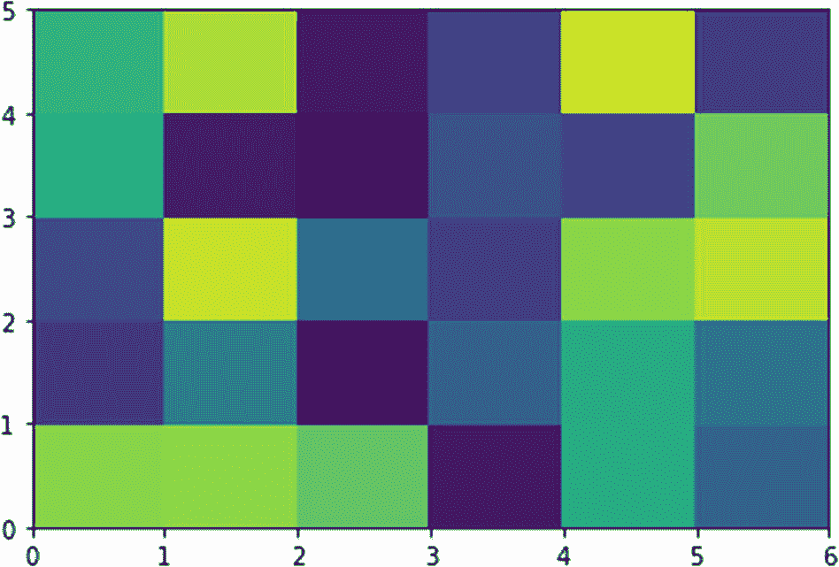
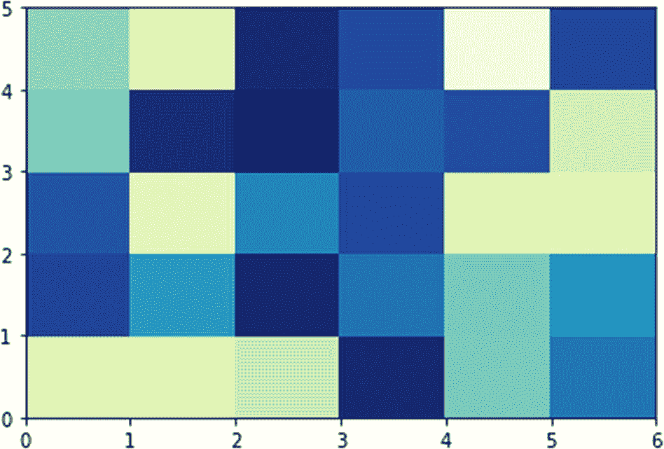
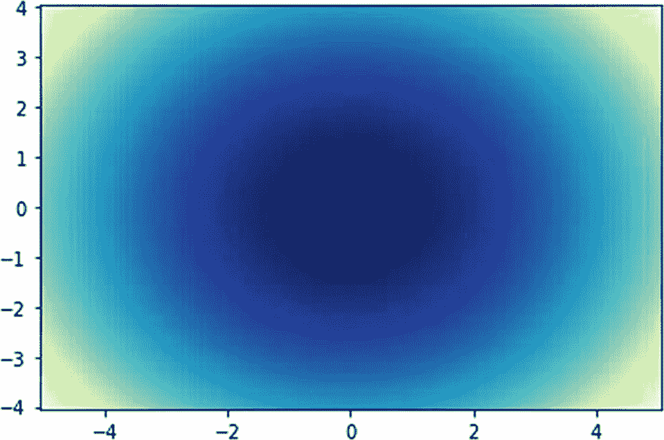
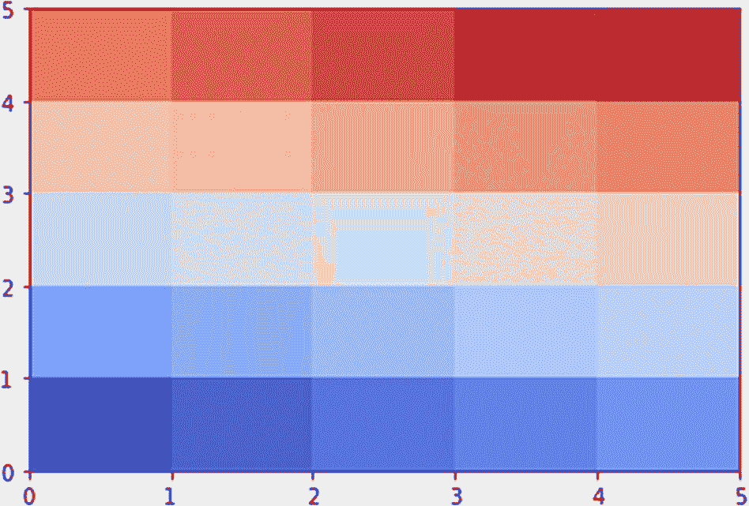
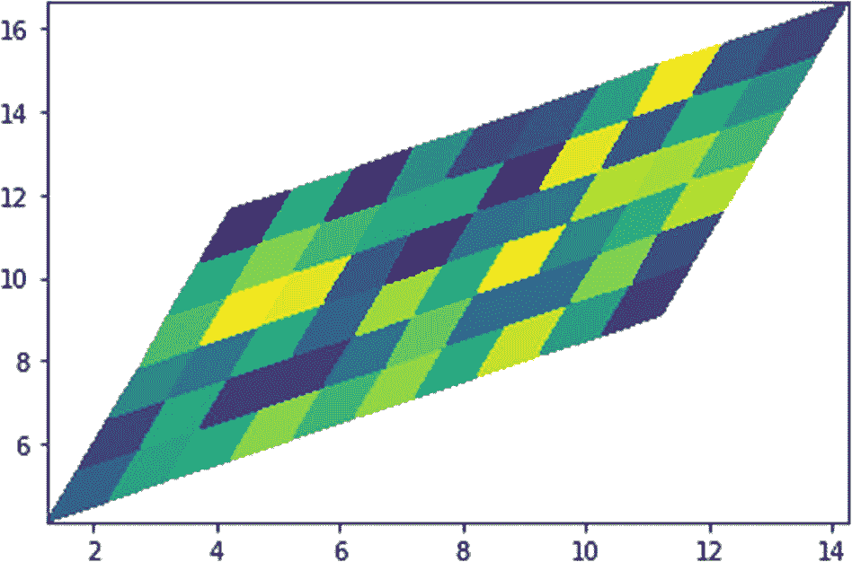
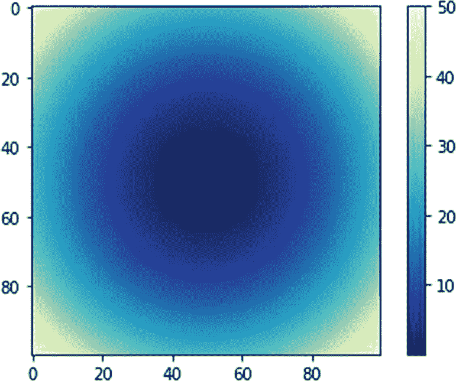
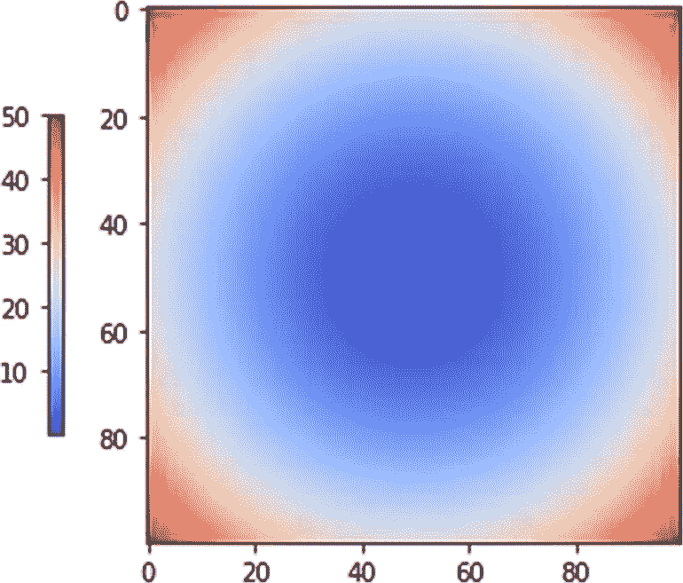
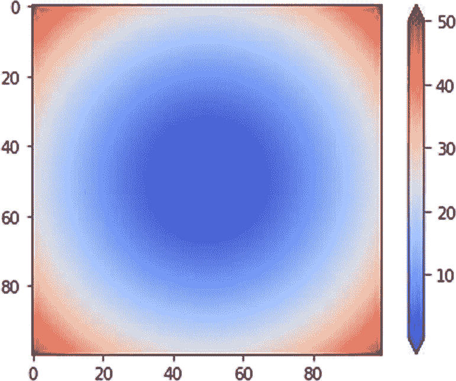

# 十、使用颜色

在前一章中，你学习了如何用 Matplotlib 可视化饼图和极坐标图。

在这一章中，你将学习如何使用颜色。以下是您将在本章中学习使用的例程:

*   `pcolor()`

*   `pcolormesh()`

*   `colorbar()`

读完这一章，我们将能够在 Matplotlib 中使用颜色。

## pcolor（）

例程`pcolor()`创建一个带有矩形(非正方形)网格的伪彩色图。伪彩色是指物体或图像呈现的颜色不同于记录时的颜色。让我们为本章创建一个新笔记本，如下所示:

```py
%matplotlib inline
import matplotlib.pyplot as plt
import numpy as np

```

让我们创建一个非正方形矩阵，并使用例程`pcolor()`将其可视化，如下所示:

```py
data = np.random.rand(5, 6)
plt.pcolor(data)
plt.show()

```

图 10-1 显示了输出。



图 10-1

pcolor()的简单演示

您也可以使用自定义颜色映射，如下所示:

```py
plt.pcolor(data, cmap='YlGnBu_r')
plt.show()

```

图 10-2 显示了输出。



图 10-2

一个简单的 pcolor()演示，带有彩色地图

让我们现在尝试添加阴影。让我们创建一个新的数据集，如下所示:

```py
N = 100
X, Y = np.meshgrid(np.linspace(-5, 5, N),
                   np.linspace(-4, 4, N))
Z = (X**2 + Y**2)

```

您可以将其形象化如下:

```py
plt.pcolor(X, Y, Z,
           cmap='YlGnBu_r',
           shading='auto')
plt.show()

```

图 10-3 显示了输出。


图 10-3

明暗法

您也可以使用`nearest`作为着色方法来创建可视化。在这种阴影技术中，每个网格点都有一种居中的颜色，它在相邻网格中心之间延伸。在这种阴影技术中，每个网格点都有一种居中的颜色，它在相邻网格中心之间延伸。示例如下:

```py
plt.pcolor(X, Y, Z,
           cmap='YlGnBu_r',
           shading='nearest')
plt.show()

```

图 10-4 显示了输出。



图 10-4

最近阴影

## pcolormesh()

例程`polormesh()`的行为方式与`pcolor()`相同；但是，它可以更快地渲染大型数据集。让我们创建一个用于图 10-4 的相同数据集的可视化，但是使用了`polormesh()`。代码如下:

```py
plt.pcolormesh(X, Y, Z,
               cmap='YlGnBu_r',
               shading='auto')
plt.show()

```

让我们看一个带有阴影和颜色贴图的示例，如下所示:

```py
nrows = ncols = 5
x = np.arange(ncols + 1)
y = np.arange(nrows + 1)
z = np.arange(nrows * ncols).reshape(nrows, ncols)
plt.pcolormesh(x, y, z,
               shading='flat',
               cmap='coolwarm')
plt.show()

```

图 10-5 显示了输出。



图 10-5

将 pcolormesh()与阴影和颜色贴图一起使用

使用不同的参数运行以下示例:

```py
plt.pcolormesh(x, y, z,
               shading='auto',
               cmap='cool')
plt.show()

```

您还可以对数据集应用简单的几何变换，如下所示:

```py
z = np.random.rand(6, 10)
x = np.arange(0, 10, 1)
y = np.arange(4, 10, 1)
T = 0.5
X, Y = np.meshgrid(x, y)
X = X + T * Y
Y = Y + T * X
plt.pcolormesh(X, Y, Z,
               shading='auto')
plt.show()

```

图 10-6 显示了输出。



图 10-6

使用 polormesh()进行简单的转换

## colorbar()

您还可以添加与可视化中数据点的数量相关的颜色条。例行程序`colorbar()`起了作用。以下是代码:

```py
N = 100
X, Y = np.meshgrid(np.linspace(-5, 5, N),
                   np.linspace(-5, 5, N))
Z = (X**2 + Y**2)
img = plt.imshow(Z, cmap='YlGnBu_r')
plt.colorbar(img)
plt.show()

```

图 10-7 显示了输出。



图 10-7

简单颜色条

您可以缩小颜色栏并按如下方式更改其位置:

```py
img = plt.imshow(Z, cmap='coolwarm')
plt.colorbar(img, location='left', shrink=0.6)
plt.show()

```

图 10-8 显示了输出。



图 10-8

收缩的颜色条

您也可以按如下方式扩展颜色栏:

```py
img = plt.imshow(Z, cmap='coolwarm')
plt.colorbar(img, extend='both')
plt.show()

```

图 10-9 显示了输出。



图 10-9

扩展颜色条

## 摘要

在本章中，您学习了如何使用颜色。在下一章，你将学习如何创建三维可视化。