# 十一、Matplotlib 中的 3D 可视化

在前一章中，你学习了如何在 Matplotlib 中使用颜色。

在本章中，您将学习如何使用 3D 可视化效果。以下是您将在本章中了解的主题:

*   绘制 3D 线、散点图和等高线

*   使用线框、曲面和样本数据

*   绘制条形图

*   绘制颤图和茎图

*   使用 3D 体积

线框、表面和 3D 轮廓用于显示体积数据。条形图用于显示分类数据。颤动图用于可视化矢量。阅读完本章后，你将能够在 Matplotlib 中使用所有这些 3D 可视化。

## 做好准备

我建议您为本章中的所有示例创建一个新笔记本。要做好准备，您需要安装一个额外的库，如下所示:

```py
!pip3 install PyQt5

```

Qt 是一个跨平台的 GUI 库。PyQt5 是 Qt 的 Python 绑定。一旦安装了库，您可以使用以下神奇的命令来强制 Jupyter Notebook 在单独的 QT 窗口中显示可视化效果:

```py
%matplotlib qt

```

因此，当你创建可视化时，你也能够与它们互动。让我们学习基础知识。首先，我们导入所有需要的库，如下所示:

```py
import numpy as np
import matplotlib.pyplot as plt
from mpl_toolkits import mplot3d

```

然后我们创建一个图形对象，如下所示:

```py
fig = plt.figure()

```

然后我们创建一个 3D 轴，如下所示:

```py
ax = plt.axes(projection='3d')

```

在此之后，您必须添加可视化代码。但是，对于此示例，您将使用以下行为空图形和轴创建可视化:

```py
plt.show()

```

图 [11-1](#Fig1) 显示了输出。

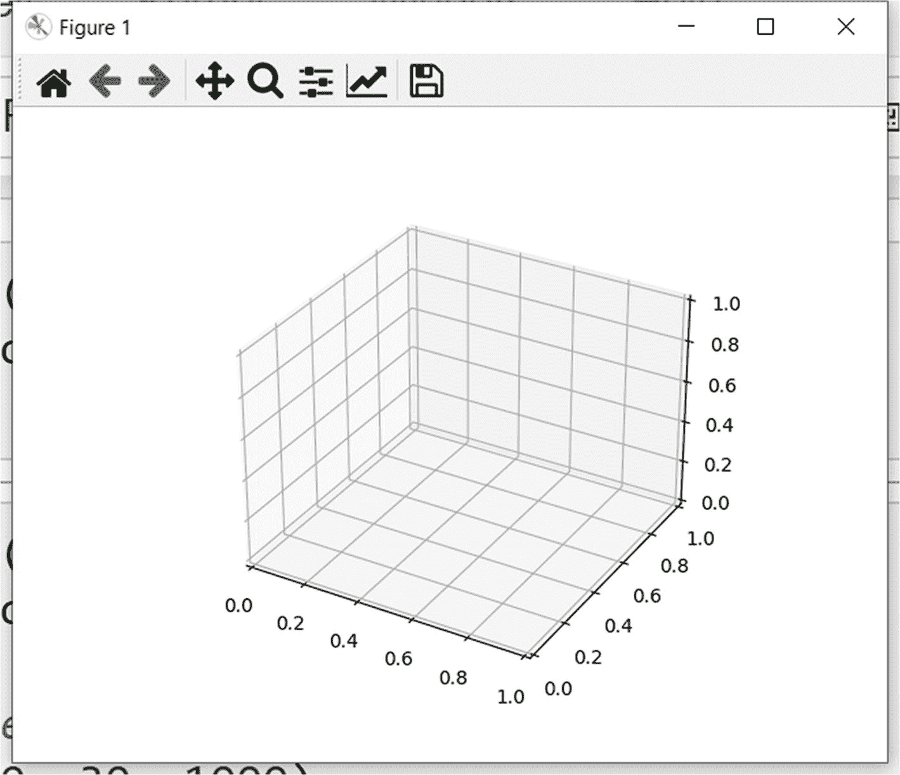

图 11-1

一个空的交互式三维可视化

您可以使用鼠标与该可视化交互并更改其方向。在继续之前，花时间探索所有的交互可能性。

## 绘制 3D 线

让我们画一条 3D 线。让我们创建一个图形和轴，如下所示:

```py
fig = plt.figure()
ax = plt.axes(projection='3d')

```

让我们按如下方式创建 3D 数据:

```py
z = np.linspace(0, 30, 1000)
x = np.sin(z)
y = np.cos(z)

```

您可以按如下方式创建 3D 图:

```py
ax.plot3D(x, y, z, 'red')
plt.show()

```

图 [11-2](#Fig2) 显示了输出。

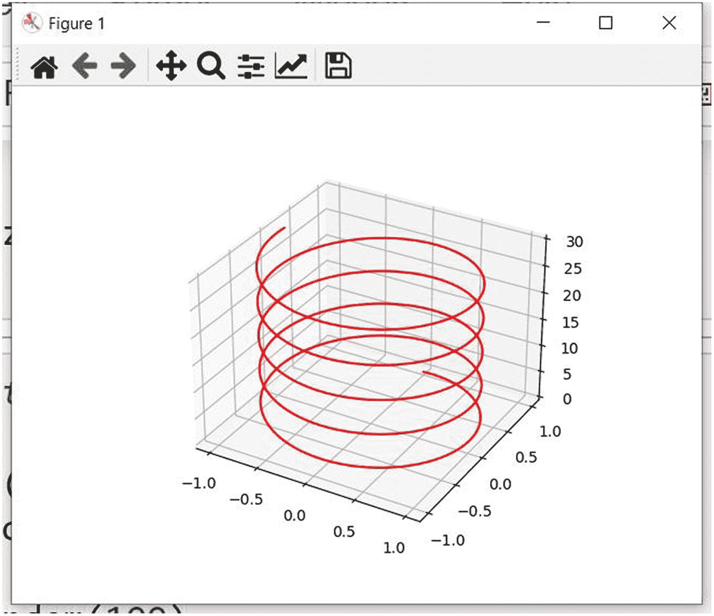

图 11-2

三维线性图

## 三维散点图

您可以创建随机点并用 3D 散点图显示它们，如下所示。让我们先创建一个图形和轴，如下所示:

```py
fig = plt.figure()
ax = plt.axes(projection='3d')

```

您可以按如下方式创建随机数据点:

```py
y = np.random.random(100)
x = np.random.random(100)
z = np.random.random(100)

```

这些点可以用散点图可视化，如下所示:

```py
ax.scatter3D(x, y, z,  cmap='cool');
plt.show()

```

图 [11-3](#Fig3) 显示了输出。

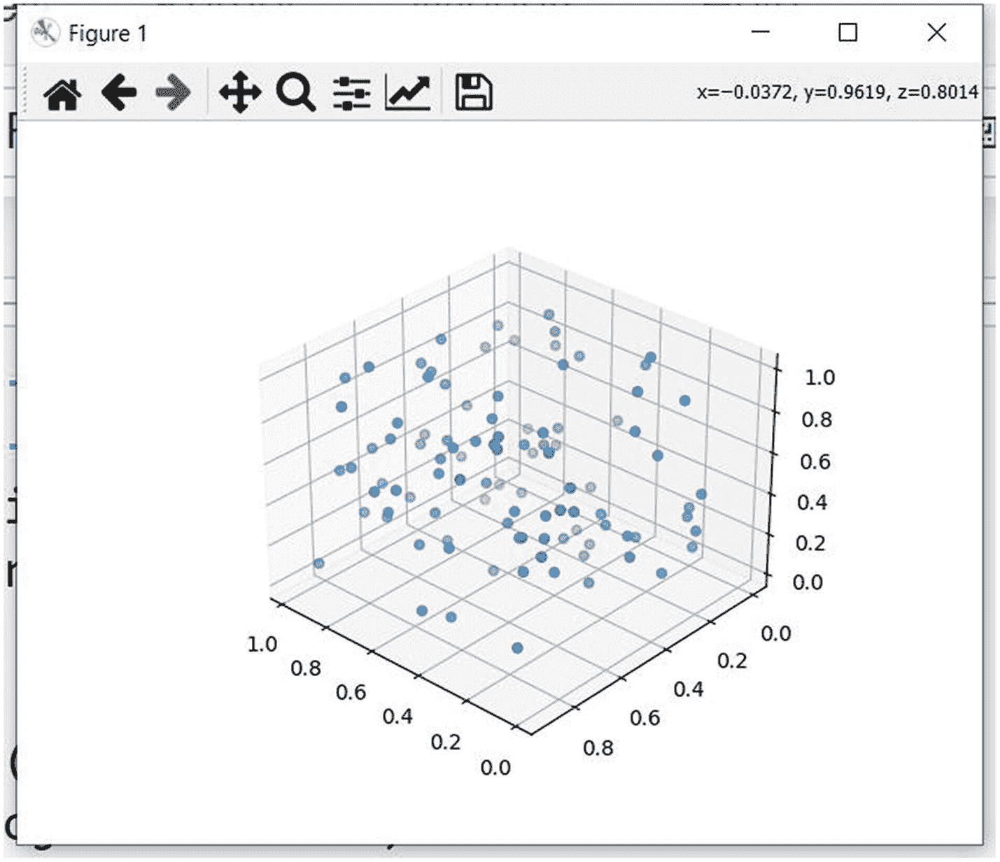

图 11-3

三维散点图

## 三维轮廓

您可以使用功能`contour()`和`contour3D()`创建 3D 轮廓。让我们创建一些可视化的数据。

```py
x = np.linspace(-10, 10, 30)
y = np.linspace(-10, 10, 30)
X, Y = np.meshgrid(x, y)
Z = np.sin(np.sqrt(X ** 2 + Y ** 2))

```

您可以按如下方式创建轮廓:

```py
fig = plt.figure()
ax = fig.add_subplot(projection='3d')
ax.contour(X, Y, Z, 50, cmap='coolwarm')
plt.show()

```

图 [11-4](#Fig4) 显示了输出。

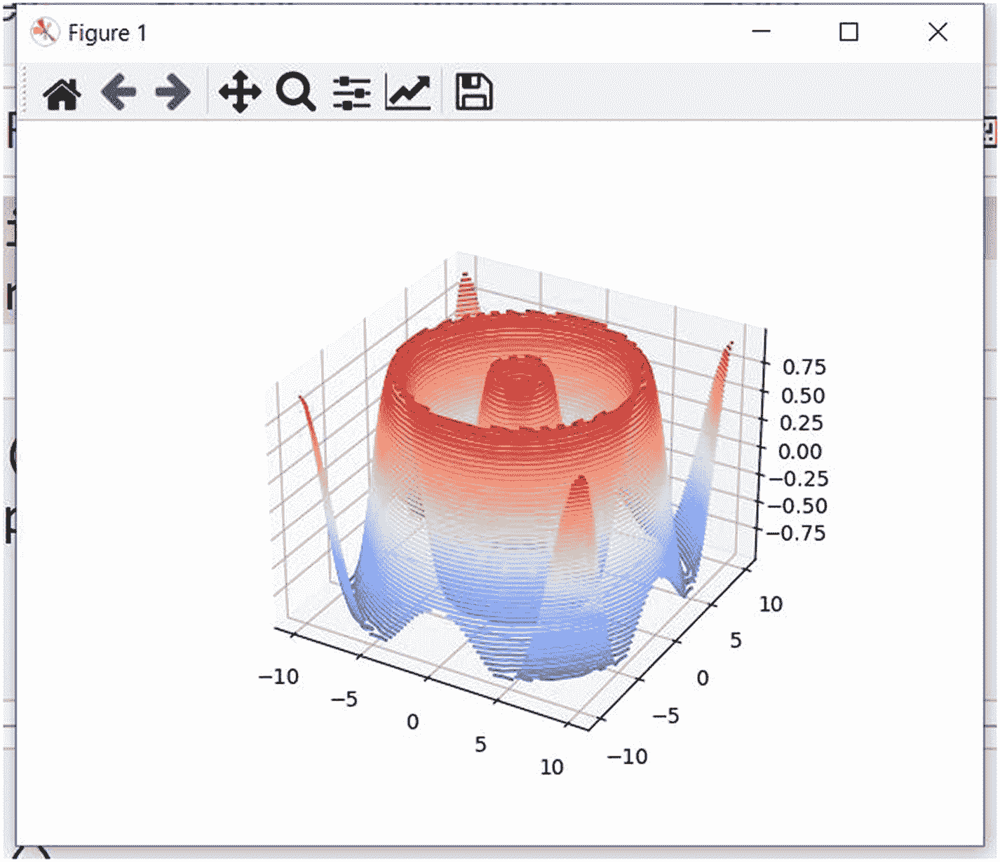

图 11-4

3D 等高线图

您可以使用以下代码获得类似的输出，如图 [11-4](#Fig4) 所示:

```py
fig = plt.figure()
ax = plt.axes(projection='3d')
ax.contour3D(X, Y, Z, 40,
             cmap='coolwarm')
plt.show()

```

您也可以使用功能`contourf()`创建填充轮廓，如下所示:

```py
fig = plt.figure()
ax = fig.add_subplot(projection='3d')
ax.contourf(X, Y, Z, 50, cmap='coolwarm')
plt.show()

```

## 线框、曲面和样本数据

您可以绘制同一数据集的线框，如下所示:

```py
fig = plt.figure()
ax = plt.axes(projection='3d')
ax.plot_wireframe(X, Y, Z, color='Green')
ax.set_title('wireframe')
plt.show()

```

图 [11-5](#Fig5) 显示了输出。

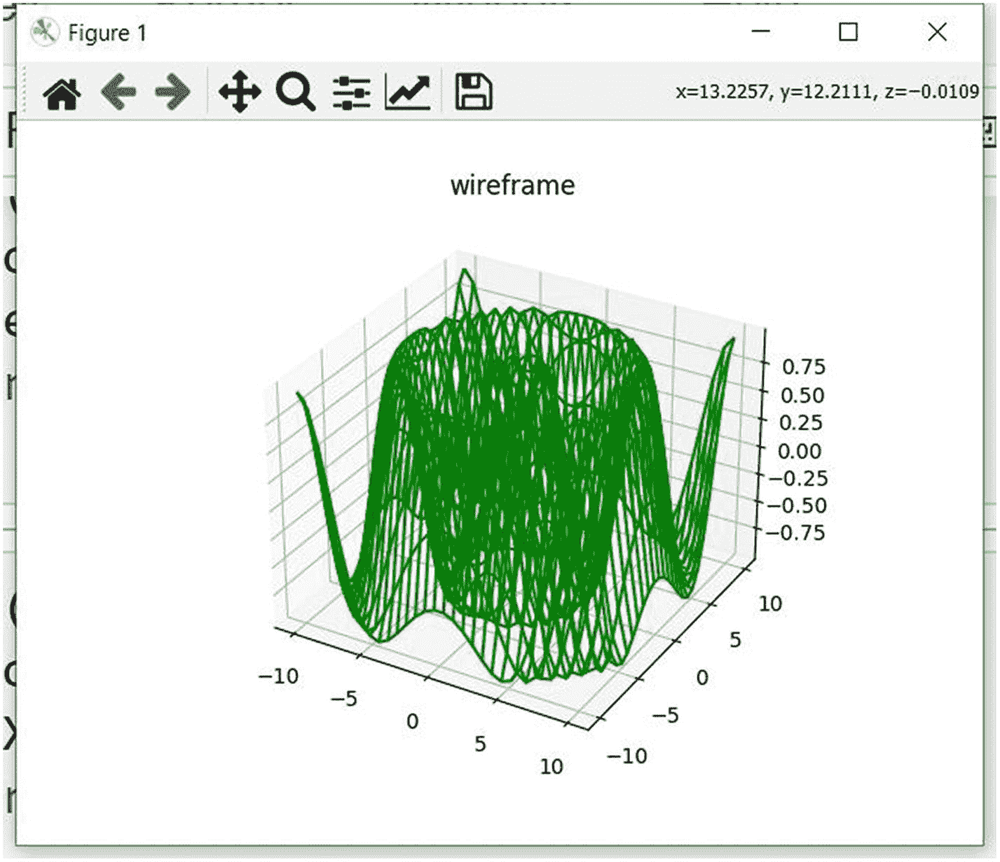

图 11-5

3D 线框

相同的数据可以可视化为 3D 表面，如下所示:

```py
fig = plt.figure()
ax = plt.axes(projection='3d')
ax.plot_surface(X, Y, Z, color='Blue')
ax.set_title('Surface Plot')
plt.show()

```

图 [11-6](#Fig6) 显示了输出。

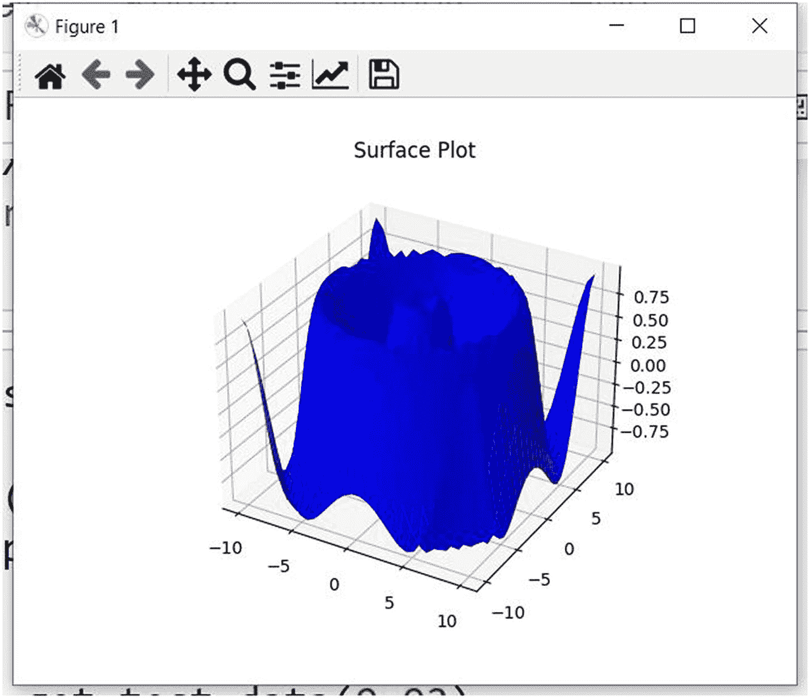

图 11-6

三维表面

您还可以使用 Matplotlib 库附带的示例数据来演示可视化效果。函数`get_test_data()`可以如下获取采样数据:

```py
from mpl_toolkits.mplot3d import axes3d
fig = plt.figure()
ax = fig.add_subplot(projection='3d')
X, Y, Z = axes3d.get_test_data(0.02)
ax.plot_wireframe(X, Y, Z,
                  rstride=10,
                  cstride=10)
plt.show()

```

图 [11-7](#Fig7) 显示了输出。

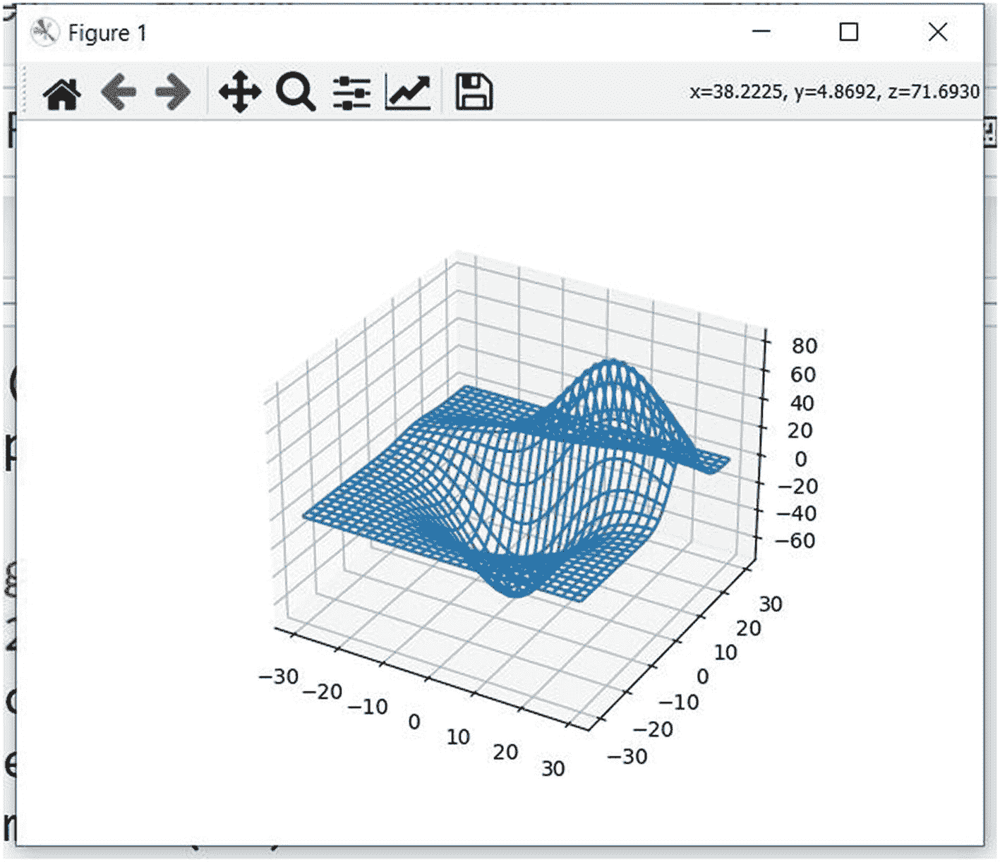

图 11-7

可视化测试数据

作为练习，尝试使用测试数据创建一个表面和轮廓。

## 条形图

您可以在三维轴中显示 2D 条形图。让我们创建一个图形和轴，如下所示:

```py
fig = plt.figure()
ax = fig.add_subplot(projection='3d')

```

让我们定义条形的颜色。

```py
colors = ['r', 'g', 'b', 'c', 'm', 'y','k']
yticks = [0, 1, 2, 3, 4, 5, 6]

```

现在，让我们通过以下循环使用定义的颜色创建条形图:

```py
for c, k in zip(colors, yticks):
    x = np.arange(25)
    y = np.random.rand(25)
    ax.bar(x, y, zs=k, zdir='y',
           color=c, alpha=0.8)
plt.show()

```

图 [11-8](#Fig8) 显示了输出。

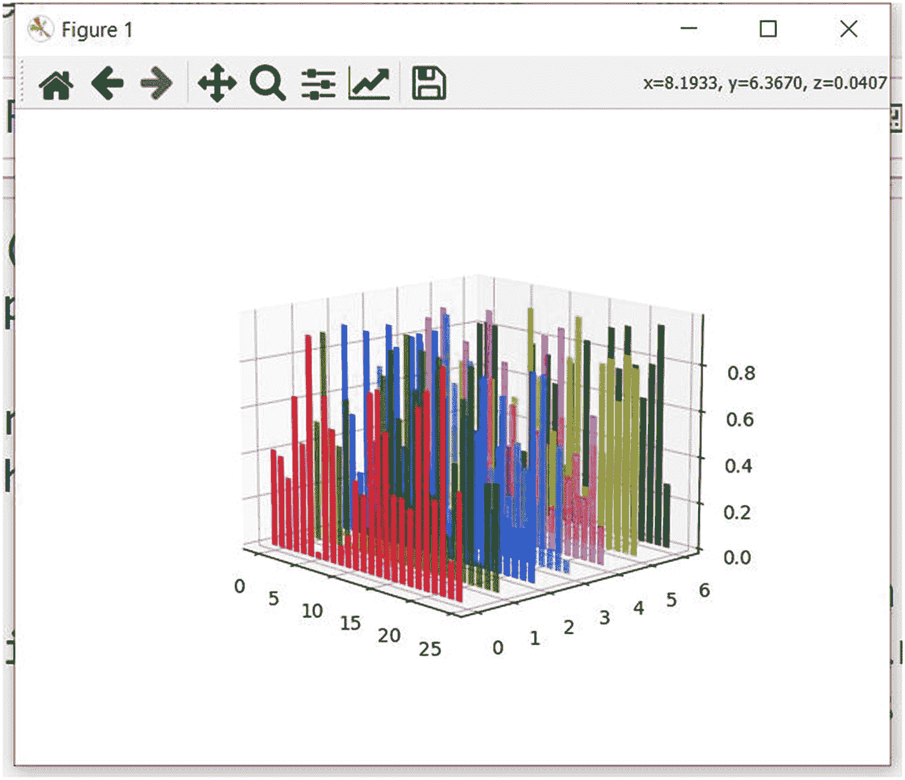

图 11-8

在 3D 坐标中可视化 2D 条形图

你也可以用 Matplotlib 创建一个 3D 条形图。让我们首先创建数据，如下所示:

```py
fig = plt.figure()
ax = fig.add_subplot(projection='3d')

x = np.arange(10) * np.arange(10)
y = np.arange(10) * np.arange(10)
x, y = np.meshgrid(x, y)
x, y = x.ravel(), y.ravel()
top = x + y
bottom = np.zeros_like(top)
width = depth = 5

```

然后，您可以将它显示为三维条形图，如下所示:

```py
ax.bar3d(x, y, bottom, width,
         depth, top,
         shade=True,
         color='g')
plt.show()

```

图 [11-9](#Fig9) 显示了输出。

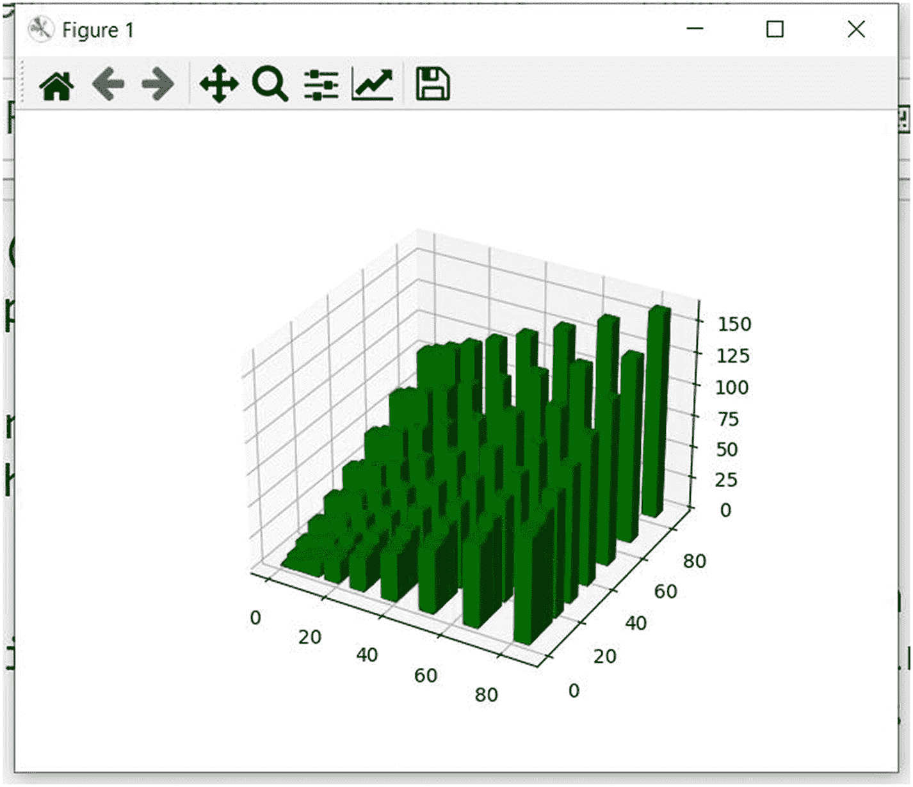

图 11-9

可视化三维条形图

## 颤图和茎图

颤动图用于表示方向实体(例如，向量)。让我们定义数据，如下所示:

```py
fig = plt.figure()
ax = fig.add_subplot(projection='3d')
x = y = z = np.arange(-0.1, 1, 0.2)
X, Y, Z = np.meshgrid(x, y, z)
u = np.cos(np.pi * X) * np.sin(np.pi * Y) * np.sin(np.pi * Z)
v = -np.sin(np.pi * X) * np.cos(np.pi * Y) * np.sin(np.pi * Z)
w = np.sin(np.pi * X) * np.sin(np.pi * Y) * np.cos(np.pi * Z)

```

最后，您可以将数据可视化，如下所示:

```py
ax.quiver(X, Y, Z, u, v, w,
          length=0.1,
          normalize=True)
plt.show()

```

图 [11-10](#Fig10) 显示了输出。

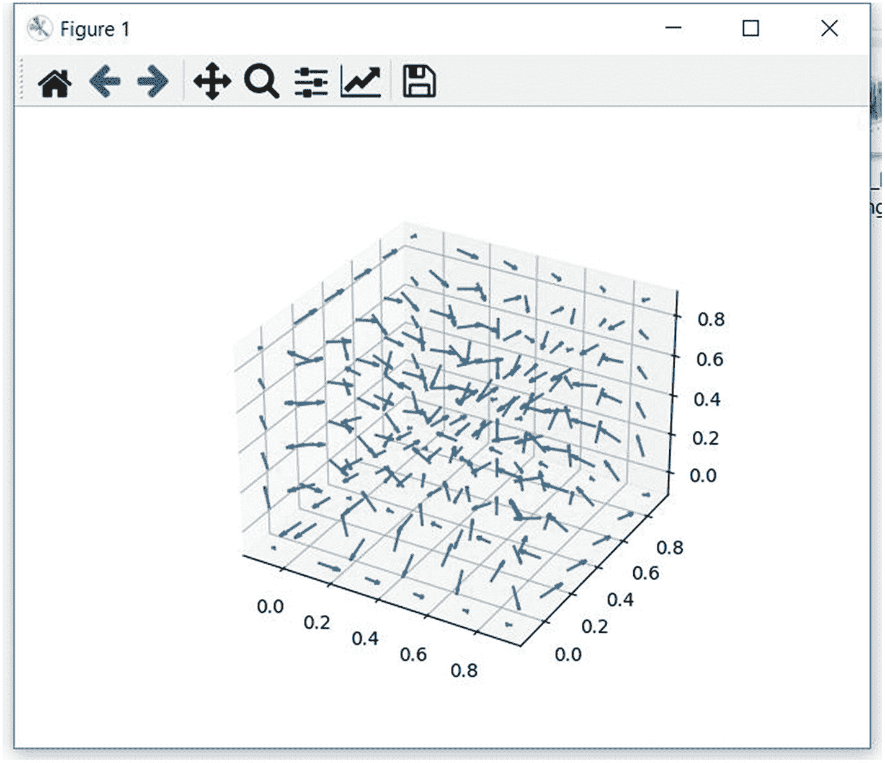

图 11-10

颤动图

您也可以在可视化中绘制垂直线的位置创建 stem 图。让我们使用三角函数来定义数据，如下所示:

```py
fig = plt.figure()
ax = fig.add_subplot(projection='3d')
theta = np.linspace(0, 2 * np.pi)
x = np.sin(theta)
y = np.cos(theta)
z = np.cos(theta)

```

您可以将 stem 图可视化如下:

```py
ax.stem(x, y, z)
plt.show()

```

图 [11-11](#Fig11) 显示了输出。

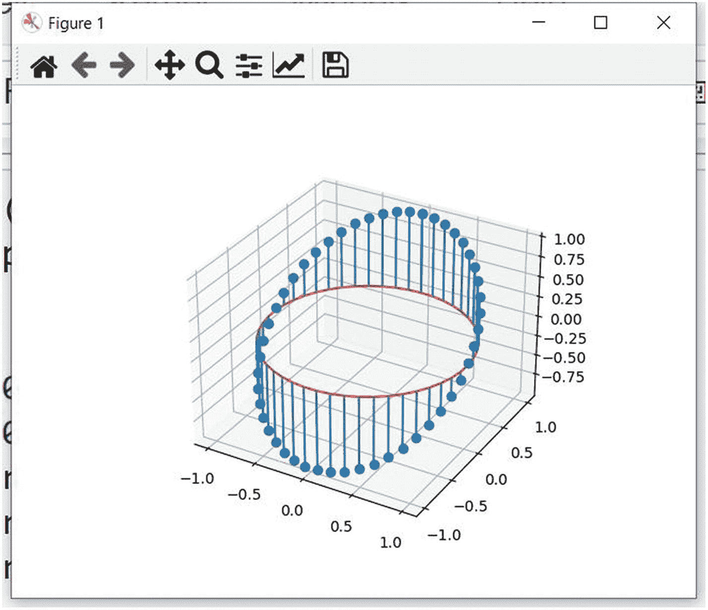

图 11-11

茎图

## 3D 体积

可以将 3D 体积数据显示为封闭的曲面。让我们创建如下数据:

```py
fig = plt.figure()
ax = fig.add_subplot(projection='3d')
u = np.linspace(0, 2 * np.pi, 100)
v = np.linspace(0, np.pi, 100)
x = 10 * np.outer(np.cos(u), np.sin(v))
y = 10 * np.outer(np.sin(u), np.sin(v))
z = 10 * np.outer(np.ones(np.size(u)), np.cos(v))

```

您可以将此数据显示为球体，如下所示:

```py
ax.plot_surface(x, y, z)
plt.show()

```

图 [11-12](#Fig12) 显示了输出。

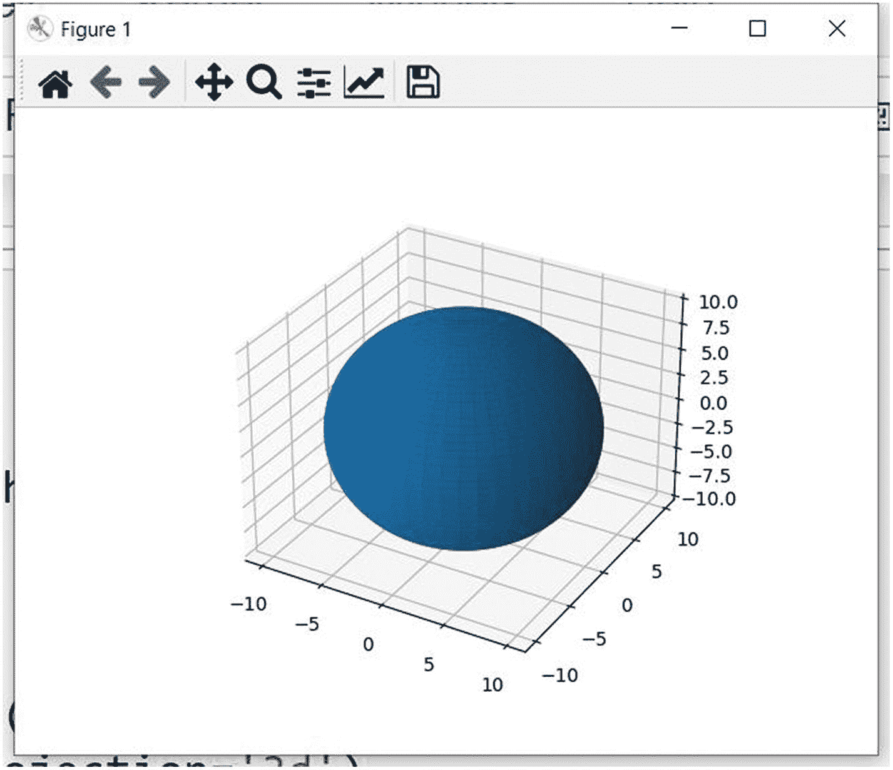

图 11-12

作为体积的曲面图

您也可以使用功能`voxels()`来可视化体积，如下所示:

```py
ma = np.random.randint(1, 3, size=(3, 3, 3))
fig = plt.figure()
ax = plt.axes(projection='3d')
ax.voxels(ma, edgecolor='k')
plt.show()

```

图 [11-13](#Fig13) 显示了输出。

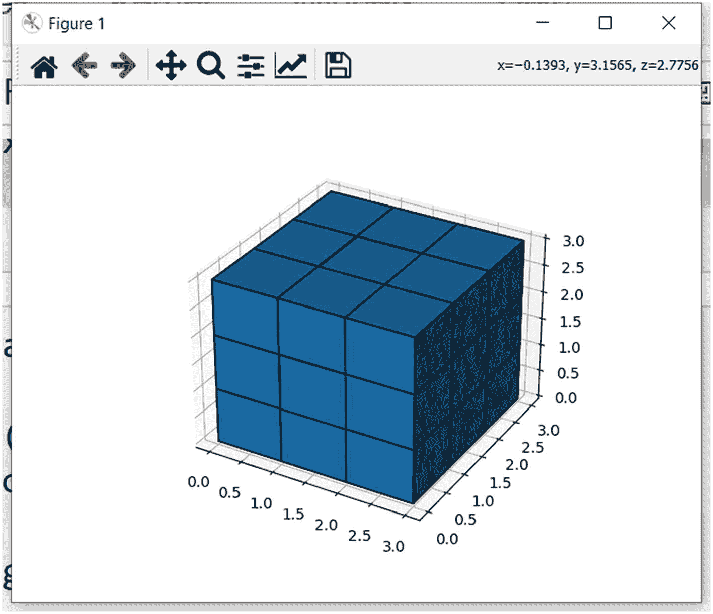

图 11-13

三维体积图

## 摘要

在本章中，您学习了如何使用 3D 可视化效果。线框、表面和 3D 轮廓用于显示体积数据。条形图用于显示分类数据。颤动图用于可视化矢量。

在下一章，你将学习如何创建动画。