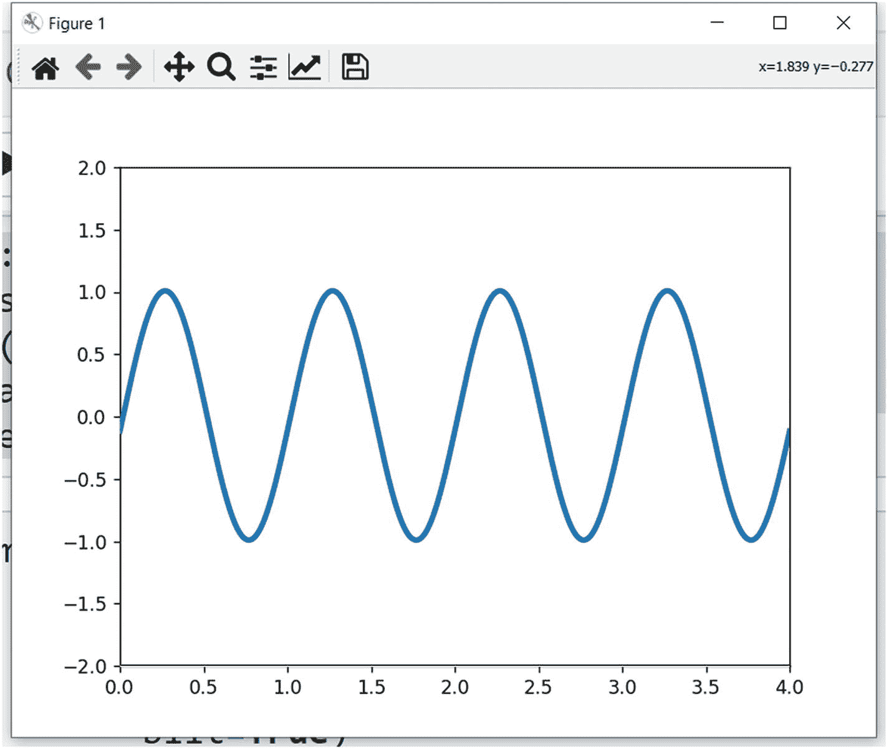
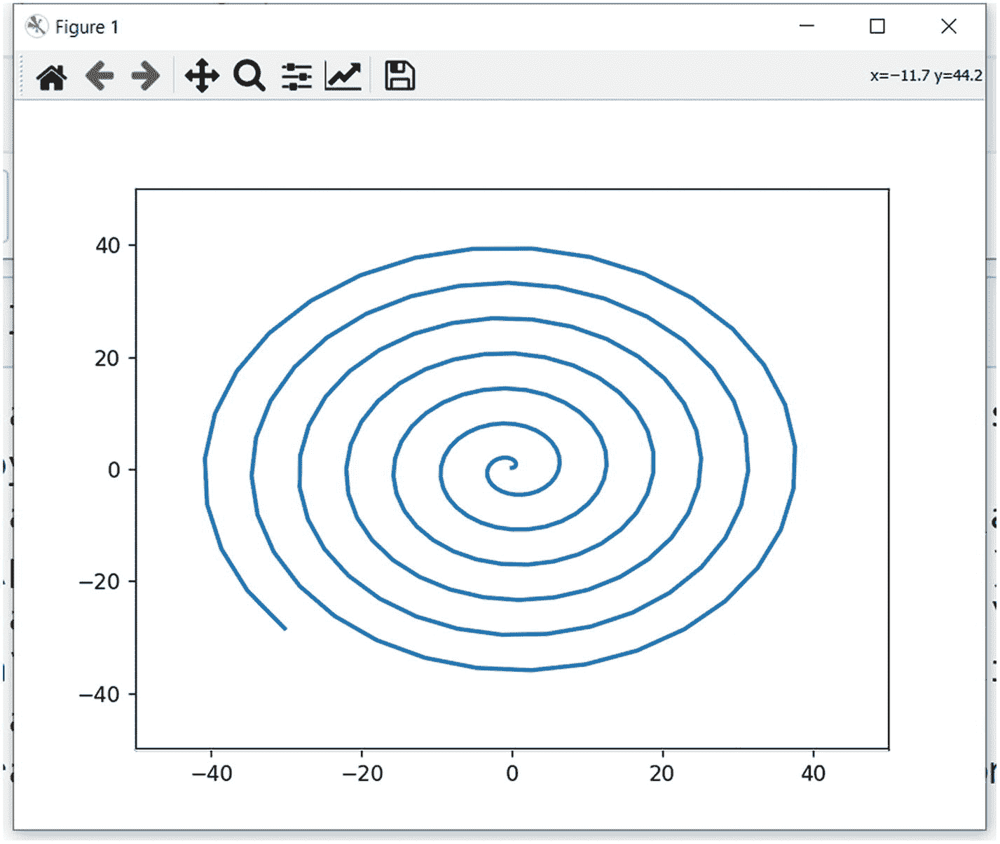
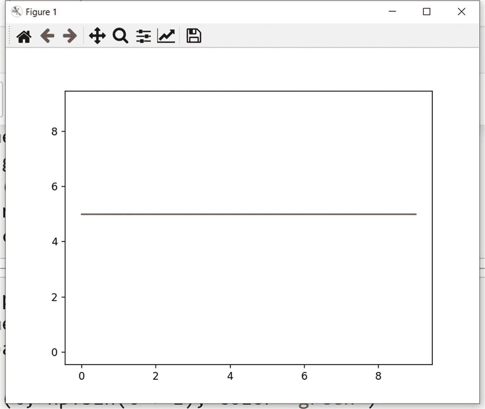
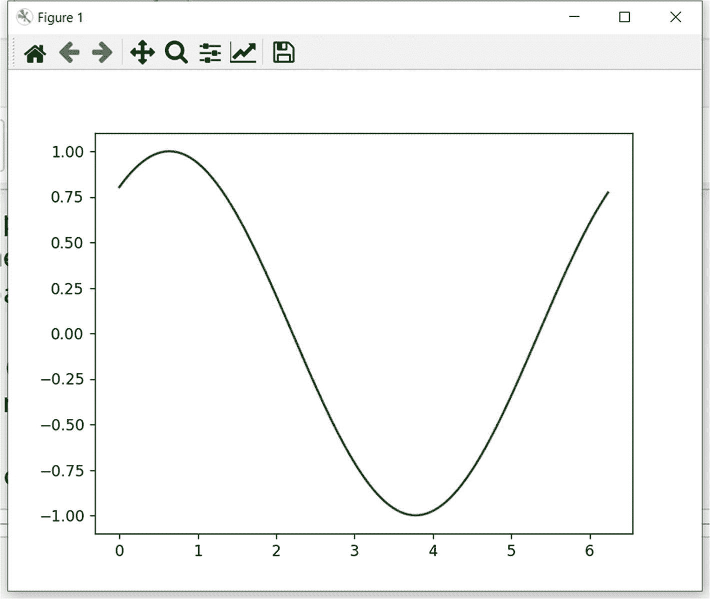
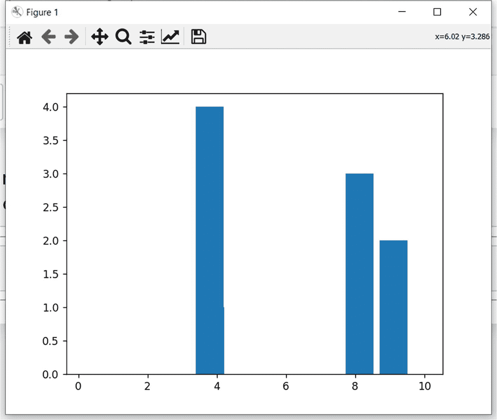

# 十二、Matplotlib 动画

在前一章中，您学习了如何在 Matplotlib 中使用 3D 可视化。

在这一章中，你将学习如何使用动画。以下是您将在本章中学习的主题:

*   动画基础

*   赛璐珞图书馆

读完这一章，你将能够在 Matplotlib 和另一个有用的库中使用动画。

## 动画基础

在本节中，您将学习如何使用 Matplotlib 创建动画。首先，让我们为本章创建一个新笔记本。然后导入以下库:

```py
%matplotlib qt
import numpy as np
from matplotlib import pyplot as plt
from matplotlib.animation import FuncAnimation

```

让我们定义对象，换句话说，图形、轴和绘图，如下所示:

```py
fig = plt.figure()
ax = plt.axes(xlim=(0, 4), ylim=(-2, 2))
line, = ax.plot([], [], lw=3)

```

让我们定义函数`init()`，它将初始化动画并为动画设置数据，如下所示:

```py
def init():
    line.set_data([], [])
    return line,

```

让我们定义一个动画函数，如下所示:

```py
def animate(i):
    x = np.linspace(0, 4, 1000)
    y = np.sin(2 * np.pi * (x - 0.01 * i))
    line.set_data(x, y)
    return line,

```

该函数接受帧数作为参数(在本例中是名为`i`的变量),并为动画渲染帧。

现在我们已经定义了组件，让我们使用函数调用`FuncAnimation()`创建一个动画对象。它接受创建的函数作为参数。它还接受帧数和间隔作为参数。参数`blit`的自变量是`True`。这意味着只重画已经改变的部分。

```py
anim = FuncAnimation(fig, animate,
                     init_func=init,
                     frames=1000,
                     interval=10,
                     blit=True)

```

您也可以将动画保存为 GIF 格式，如下所示:

```py
anim.save('sine_wave.gif', writer='pillow')

```

图 [12-1](#Fig1) 显示了输出。



图 12-1

将正弦波可视化

您可以与动画互动，并用鼠标更改方向。在继续下一步之前，探索所有的交互可能性。

您可以创建渐进式螺旋，如下所示:

```py
fig = plt.figure()
ax = plt.axes(xlim=(-50, 50), ylim=(-50, 50))
line, = ax.plot([], [], lw=2)
def init():
    line.set_data([], [])
    return line,
xdata, ydata = [], []
def animate(i):
      t = 0.2*i
      x = t*np.cos(t)
      y = t*np.sin(t)
      xdata.append(x)
      ydata.append(y)
      line.set_data(xdata, ydata)
      return line,
anim = FuncAnimation(fig, animate,
                               init_func=init,
                               frames=3000,
                               interval=5,
                               blit=True)

```

图 [12-2](#Fig2) 显示了输出。



图 12-2

可视化螺旋动画

## 赛璐珞图书馆

你可以使用另一个简单的叫做赛璐珞的库来制作动画。让我们按如下方式安装它:

```py
!pip3 install celluloid

```

您可以按如下方式导入它:

```py
from celluloid import Camera

```

让我们创建一个人物和照相机对象，如下所示:

```py
fig = plt.figure()
camera = Camera(fig)

```

让我们创建一个动画的帧，并用名为`camera.snap()`的函数将它们保存在内存中，如下所示:

```py
for i in range(10):
    plt.plot([i] * 10)
    camera.snap()

```

让我们创建如下动画:

```py
animation = camera.animate()

```

图 [12-3](#Fig3) 显示了输出。



图 12-3

使用赛璐珞库的动画

您也可以创建正弦波，如下所示:

```py
fig, axes = plt.subplots()
camera = Camera(fig)
t = np.linspace(0, 2 * np.pi, 128, endpoint=False)
for i in t:
    plt.plot(t, np.sin(t + i), color='green')
    camera.snap()
animation = camera.animate()

```

图 [12-4](#Fig4) 显示了输出。



图 12-4

用赛璐珞库制作正弦波动画

条形图的另一个示例如下:

```py
fig, axes = plt.subplots()
camera = Camera(fig)
y = np.arange(5)
for i in y:
    plt.bar( np.random.rand(5)*10 , y)
    camera.snap()
animation = camera.animate()

```

图 [12-5](#Fig5) 显示了输出。



图 12-5

带赛璐珞库的条形图动画

## 摘要

在本章中，您学习了如何使用动画。

在下一章，你将学习如何用 Matplotlib 做更多的事情。