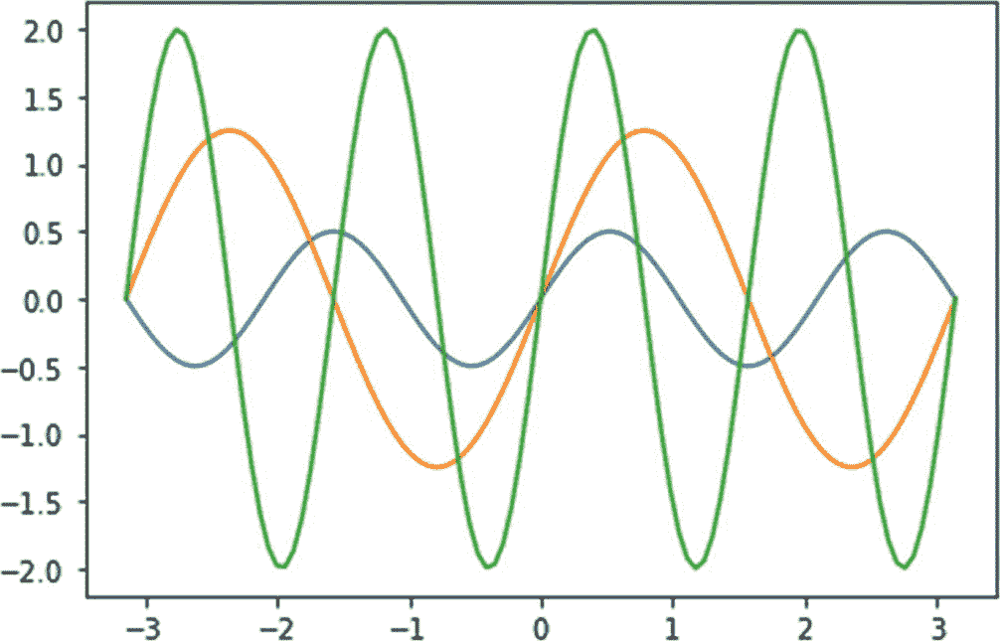

# 十三、使用 Matplotlib 实现更多可视化

在上一章中，您学习了如何在 Matplotlib 中处理动画。

在这一章中，你将学习更多使用 Matplotlib 的技巧。这一章是你到目前为止所获得的所有知识的顶点。这一章有一系列使用 Matplotlib 的技巧，我在前面的章节中没有提到。具体来说，以下是您将在本章中学习的主题:

*   将功能可视化为图像和轮廓

*   使用 3D 晕影

*   装饰散点图

*   使用时间图和信号

*   使用填充图、阶跃图和六边形图

*   使用 XKCD 样式

阅读完本章后，你将能够在 Matplotlib 中创建各种新的可视化。

## 将功能可视化为图像和轮廓

让我们想象一个数字函数。导入所有需要的库，如下所示:

```py
%matplotlib inline
import numpy as np
import matplotlib.pyplot as plt

```

让我们将函数定义如下:

```py
def f(x, y):
    return (x ** 3 + y ** 2)

```

让我们将其形象化，如下所示:

```py
n = 10
x = np.linspace(-3, 3, 8 * n)
y = np.linspace(-3, 3, 6 * n)
X, Y = np.meshgrid(x, y)
Z = f( X, Y )
plt.imshow(Z, interpolation='nearest',
          cmap = 'cool', origin='lower')
plt.axis('off')
plt.show()

```

图 13-1 显示了输出。


图 13-1

将功能可视化为图像

你也可以把这个函数想象成一个轮廓。

```py
n = 256
x = np.linspace(-3, 3, n)
y = np.linspace(-3, 3, n)
X, Y = np.meshgrid(x, y)
plt.contourf(X, Y, f(X, Y), 8,
            alpha = 0.75, cmap='hot')
C = plt.contour(X, Y, f(X, Y), 8,
               colors='black')
plt.clabel(C, inline=1, fontsize=10)
plt.axis('off')
plt.show()

```

图 13-2 显示了输出。


图 13-2

将函数可视化为轮廓

## 3D 缩图

您可以按如下方式创建三维晕影可视化:

```py
%matplotlib qt
fig = plt.figure()
ax = plt.axes(projection='3d')
X = np.arange(-4, 4, 0.25)
Y = np.arange(-4, 4, 0.25)
X, Y = np.meshgrid(X, Y)
R = np.sqrt(X ** 2 + Y ** 2)
Z = np.sin(R)
ax.plot_surface(X, Y, Z, rstride=1,
               cstride=1, cmap='hot')
ax.contourf(X, Y, Z, zdir='z',
           offset=-2, cmap='hot')
ax.set_zlim(-2, 2)
plt.axis('off')
ax.set_zticks(())
plt.show()

```

图 13-3 显示了输出。


图 13-3

可视化 3D 晕影

## 装饰散点图

您可以使用 Matplotlib 创建装饰散点图。您需要将颜色和大小作为参数传递。这里有一个例子:

```py
%matplotlib inline
n = 1024
X = np.random.normal(0, 1, n)
Y = np.random.normal(0, 1, n)
color = np.arctan2(Y, X)
plt.scatter(X, Y, s=75, c=color, alpha=0.5)
plt.xlim(-1.5, 1.5)
plt.ylim(-1.5, 1.5)
plt.axis('off')
plt.show()

```

图 13-4 显示了输出。


图 13-4

可视化装饰散点图

## 时间图和信号

您可以将时间图和信号可视化如下:

```py
N = 100
x = np.arange(N) # timestamps
y1 = np.random.randn(N)
y2 = np.random.randn(N)
y3 = np.random.randn(N)
y4 = np.random.randn(N)

plt.subplot(2, 1, 1)
plt.plot(x, y1)
plt.plot(x, y2, ':')
plt.grid()
plt.xlabel('Time')
plt.ylabel('y1 and y2')
plt.axis('tight')
plt.subplot(2, 1, 2)
plt.plot(x, y3)
plt.plot(x, y4, 'r')
plt.grid()
plt.xlabel('Time')
plt.ylabel('y3 and y4')
plt.axis('tight')
plt.show()

```

图 13-5 显示了输出。


图 13-5

可视化时间图和信号

也可以将两个信号相乘。在下面的代码示例中，我们使用同一个 x 轴来显示所有三个图表。

```py
f = 1
t = np.arange( 0.0, 4.0, 0.01)
s1 = np.sin(2 *np.pi * f * t)
s2 = np.exp(-t)
s3 = s1 * s2
f = plt.figure()
plt.subplots_adjust(hspace=0.001)
ax1 = plt.subplot( 311 )
ax1.plot(t, s1)
plt.yticks(np.arange(-0.9, 1.0, 0.4))
plt.ylim(-1, 1)
ax2 = plt.subplot(312, sharex=ax1)
ax2.plot(t, s2)
plt.yticks(np.arange(0.1, 1.0, 0.2))
plt.ylim(0, 1)
ax3 = plt.subplot(313, sharex = ax1)
ax3.plot(t, s3)
plt.yticks(np.arange(-0.9, 1.0, 0.4))
plt.ylim(-1, 1)
xticklabels = ax1.get_xticklabels() + ax2.get_xticklabels()
plt.setp(xticklabels, visible=False)
plt.show()

```

图 13-6 显示了输出。


图 13-6

乘法信号

## 填充图

您可以按如下方式填充地块边界内的空白空间:

```py
N = 1000
x = np.linspace(0, 1, N)
y = np.sin(4 * np.pi * x) + np.exp(-5 * x)
plt.fill(x, y, 'g', alpha = 0.8)
plt.grid(True)
plt.show()

```

图 13-7 显示了输出。


图 13-7

填充图

## 阶梯图

我们先来可视化一些正弦波。

```py
N = 100
x = np.linspace(-np.pi, np.pi, N)
y1 = 0.5 * np.sin(3*x)
y2 = 1.25 * np.sin(2*x)
y3 = 2 * np.sin(4*x)
plt.plot(x, y1, x, y2, x, y3)
plt.show()

```

图 13-8 显示了输出。



图 13-8

正弦曲线

您可以将它们显示为阶跃图，如下所示:

```py
plt.step(x, y1)
plt.step(x, y2)
plt.step(x, y3)
plt.show()

```

图 13-9 显示了输出。


图 13-9

带阶梯图的正弦曲线

## 赫克宾斯

您可以将数据显示为六边形，如下所示:

```py
x, y = np.random.normal(size=(2, 10000))
plt.hexbin(x, y,
           gridsize=20,
           cmap='cool')
plt.colorbar()
plt.show()

```

图 13-10 显示了输出。


图 13-10

Hexbin 可视化

## xcd 风格

您可以在 XKCD 样式中可视化地块。XKCD 是一部流行的网络漫画。 [`https://xkcd.com`](https://xkcd.com) 是网络漫画的主页。

```py
y = np.random.randn(1000)
plt.xkcd()
plt.hist(y)
plt.show()

```

图 13-11 显示了输出。


图 13-11

XKCD 直方图

另一个例子如下:

```py
y = np.random.randn(1000)
plt.xkcd()
plt.hist(y, bins = 30,
         range=[-3.5, 3.5],
         facecolor='r',
         alpha=0.6,
         edgecolor='k')
plt.grid()
plt.show()

```

图 13-12 显示了输出。


图 13-12

另一个 XKCD 直方图

您也可以用同样的方式显示 2D 直方图，如下所示:

```py
data = np.random.randn(1000, 1000)
plt.xkcd()
plt.hist2d(data[0], data[1])
plt.show()

```

图 13-13 显示了输出。


图 13-13

第三个 XKCD 直方图

## 摘要

在本章中，您学习了如何使用 Matplotlib 处理一些额外的可视化技术。

在下一章中，你将熟悉一个名为 Pandas 的数据科学库。