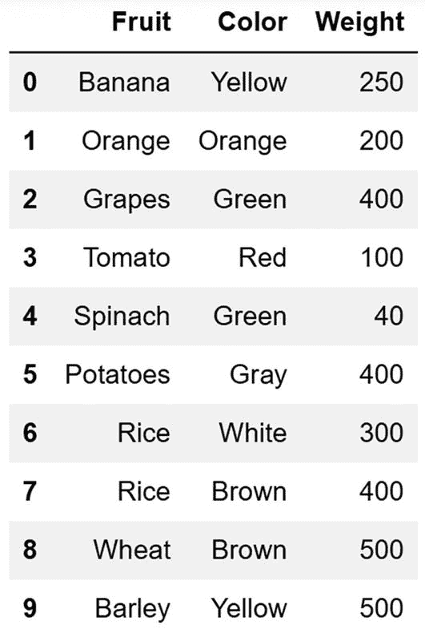
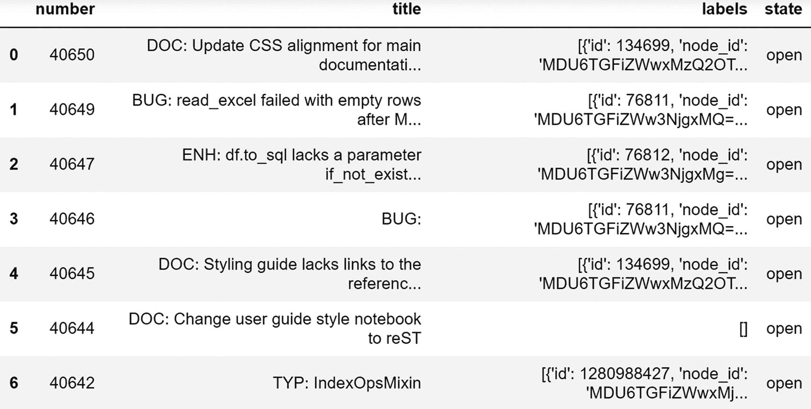
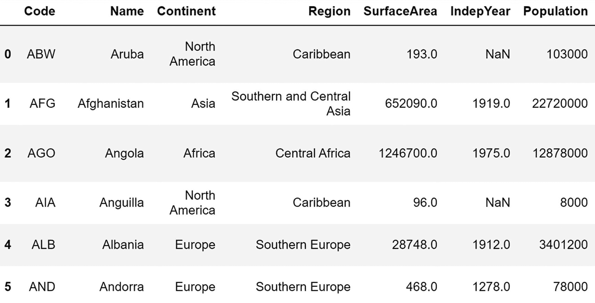

# 十五、数据采集

在前一章中，您学习了使用两个 Pandas 数据结构的基础知识，即 series 和 dataframe。

这一章着重于使用你到目前为止学习过的所有库(NumPy、Matplotlib 和 Pandas)用 Python 获取数据。以下是您将在本章中了解的主题:

*   处理纯文本文件

*   用 Python 处理 CSV 文件

*   使用 Python 和 Excel

*   用 NumPy 读写文件

*   用 NumPy 从 CSV 文件中读取数据

*   使用 Matplotlib CBook

*   从 CSV 文件中读取数据

*   从 Excel 文件中读取数据

*   从 JSON 文件中读取数据

*   从 Pickle 文件中读取数据

*   从网上读取数据

*   从关系数据库中读取数据

*   从剪贴板读取数据

读完这一章后，你将可以轻松地从各种文件格式中读取数据并保存它。

## 纯文本文件处理

让我们学习如何从一个纯文本文件中读取数据，以及将数据写入到一个纯文本文件中。Python 自带读写纯文本文件的功能。我们有四种打开文件的模式，如下所示:

*   `w`:写

*   `r`:阅读

*   `a`:追加

*   `r+`:读写模式

您可以按如下方式使用它们(一次一个):

```py
f = open('testfile.txt', 'w')
print(f)

```

这段代码以写模式打开`testfile.txt`文件。如果文件不存在，那么 Python 会在磁盘上的当前位置创建这个文件。如果文件已经存在，它会覆盖文件的内容。前面的代码打印 file 对象，如下所示:

```py
<_io.TextIOWrapper name='testfile.txt' mode='w' encoding='cp1252'>

```

让我们向文件中写入一些数据。在这种情况下，数据由多字符字符串组成。

```py
f.write('This is a test string.\n')
f.write('This is the middle line.\n')
f.write('This is the last line.')

```

您可以按如下方式关闭文件对象(也称为*文件句柄*):

```py
f.close()

```

您知道再次以写模式打开文件会覆盖其数据。因此，这一次，让我们以追加模式打开同一个文件，如下所示:

```py
f = open('testfile.txt', 'a')
f.write('\nThis is the appended line.')
f.close()

```

我们在文件中写入一行，然后关闭文件。让我们读取数据并将其打印如下:

```py
f = open('testfile.txt', 'r')
print(f.read())
f.close()

```

输出如下所示:

```py
This is a test string.
This is the middle line.
This is the last line.
This is the appended line

```

您可以检索列表中的行(文件中的每一行都对应于列表中的一个元素)，如下所示:

```py
f = open('testfile.txt', 'r')
print(f.readlines())
f.close()

```

输出如下所示:

```py
['This is a test string.\n', 'This is the middle line.\n', 'This is the last line.\n', 'This is the appended line.']

```

您也可以按如下方式逐行检索文件中的数据:

```py
f = open('testfile.txt', 'r')
for line in f:
    print(line)
f.close()

```

输出如下所示:

```py
This is a test string.

This is the middle line.

This is the last line.

This is the appended line.

```

## 用 Python 处理 CSV 文件

让我们了解一些关于逗号分隔文件(CSV)格式的事情。CSV 文件以纯文本格式存储数据，数据项或者是固定长度，或者由逗号(`,`)、竖线(`|`)或冒号(`:`)等分隔符分隔。最常见的 CSV 格式使用逗号作为分隔符，很多时候第一行用于存储列名。

在本节中，您将学习如何用 Python 3 处理 CSV 文件。Python 3 附带了一个内置库来处理 CSV 文件。您不需要安装任何东西。您可以按如下方式导入库:

```py
import csv

```

您可以在读取模式下以纯文本文件的形式打开该文件，如下所示:

```py
file = open('test.csv', 'r')
print(file)

```

打开文件后，可以将文件句柄传递给例程`csv.reader()`,如下所示:

```py
csvfile = csv.reader(file, delimiter=',')
print(csvfile)

```

这将打印对象的值，如下所示:

```py
<_csv.reader object at 0x0590AC68>

```

您可以按如下方式逐行检索数据:

```py
for row in csvfile:
    print(row)

```

这会产生以下输出:

```py
['Banana', 'Yellow', '250']
['Orange', 'Orange', '200']
['Grapes', 'Green', '400']
['Tomato', 'Red', '100']
['Spinach', 'Green', '40']
['Potatoes', 'Gray', '400']
['Rice', 'White', '300']
['Rice', 'Brown', '400']
['Wheat', 'Brown', '500']
['Barley', 'Yellow', '500']

```

您可以单独显示元素，如下所示:

```py
for row in csvfile:
    for element in row:
        print(element)

```

输出如下所示:

```py
Banana
Yellow
250
Orange
Orange
200
Grapes
Green
400
Tomato
Red
100
Spinach
Green
40
Potatoes
Gray
400
Rice
White
300
Rice
Brown
400
Wheat
Brown
500
Barley
Yellow
500

```

让我们关闭文件句柄，如下所示:

```py
file.close()

```

## Python 和 Excel

让我们看看如何从 Excel 中读取数据。为此你需要一个外部库。以下代码安装我们将在本节中使用的库:

```py
!pip3 install openpyxl

```

您可以按如下方式导入它:

```py
import openpyxl

```

您可以按如下方式打开 Excel 文件:

```py
wb = openpyxl.load_workbook('test.xlsx')
print(wb)
print(type(wb))

```

输出如下所示:

```py
<openpyxl.workbook.workbook.Workbook object at 0x0E87F7D8>
<class 'openpyxl.workbook.workbook.Workbook'>

```

您可以按如下方式检索所有工作表的名称:

```py
print(wb.sheetnames)

```

输出如下所示:

```py
['Sheet1', 'Sheet2', 'Sheet3']

```

您可以按如下方式选择图纸:

```py
currSheet = wb['Sheet1']
print(currSheet)
print(type(currSheet))

```

输出如下所示:

```py
<Worksheet "Sheet1">
<class 'openpyxl.worksheet.worksheet.Worksheet'>

```

同样，下面的代码具有相同的效果:

```py
currSheet = wb[wb.sheetnames[0]]
print(currSheet)
print(type(currSheet))

```

您可以打印当前工作表的名称，如下所示:

```py
print(currSheet.title)

```

输出如下所示:

```py
Sheet1

```

您可以按如下方式打印单元格的值:

```py
var1 = currSheet['A1']
print(var1.value)

```

输出如下所示:

```py
Food Item

```

进行相同活动的另一种方法如下:

```py
print(currSheet['B1'].value)

```

您可以用另一种方式来完成，如下所示:

```py
var2 = currSheet.cell(row=2, column=2)
print(var2.value)

```

行数和列数可以如下获得:

```py
print(currSheet.max_row)
print(currSheet.max_column)

```

输出如下所示:

```py
11
3

```

让我们打印电子表格中的所有数据，如下所示:

```py
for i in range(currSheet.max_row):
    print('---Beginning of Row---')
    for j in range(currSheet.max_column):
        var = currSheet.cell(row=i+1, column=j+1)
        print(var.value)
    print('---End of Row---')

```

输出很长，所以我在这里截断了它。请运行代码亲自查看。

## 用 NumPy 读写文件

让我们看看如何用 NumPy 读写文件。让我们用 NumPy 创建一个数据集，如下所示:

```py
import numpy as np
x = np.arange(100)
print(x)

```

输出如下所示:

```py
[ 0  1  2  3  4  5  6  7  8  9 10 11 12 13 14 15 16 17 18 19 20 21 22 23
 24 25 26 27 28 29 30 31 32 33 34 35 36 37 38 39 40 41 42 43 44 45 46 47
 48 49 50 51 52 53 54 55 56 57 58 59 60 61 62 63 64 65 66 67 68 69 70 71
 72 73 74 75 76 77 78 79 80 81 82 83 84 85 86 87 88 89 90 91 92 93 94 95
 96 97 98 99]

```

您可以将其保存到一个文件(NumPy 数据格式)，如下所示:

```py
np.save('test.npy', x)

```

您可以将数据从文件加载到变量中，如下所示:

```py
data = np.load('test.npy')
print(data)

```

输出如下所示:

```py
[ 0  1  2  3  4  5  6  7  8  9 10 11 12 13 14 15 16 17 18 19 20 21 22 23
 24 25 26 27 28 29 30 31 32 33 34 35 36 37 38 39 40 41 42 43 44 45 46 47
 48 49 50 51 52 53 54 55 56 57 58 59 60 61 62 63 64 65 66 67 68 69 70 71
 72 73 74 75 76 77 78 79 80 81 82 83 84 85 86 87 88 89 90 91 92 93 94 95
 96 97 98 99]

```

## 用 NumPy 从 CSV 文件中读取数据

CSV 文件也可以用 NumPy 读取，如下所示:

```py
import numpy as np
# Reads only numeric data
data = np.loadtxt('data.csv', delimiter=',')
print(data)

```

输出如下所示:

```py
[[  0\.   1\.  18\.   2.]
 [  1\.   6\.   1\.   3.]
 [  2\.   3\. 154\.   0.]
 [  4\. 978\.   3\.   6.]
 [  5\.   2\.  41\.  45.]
 [  6\.  67\.   2\.   3.]
 [  7\.   5\.  67\.   2.]]

```

您也可以跳过行和列，如下所示:

```py
data = np.loadtxt('data.csv', delimiter=',',
                 skiprows=3, usecols=[1, 3])
print(data)

```

输出如下所示:

```py
[[978\.   6.]
 [  2\.  45.]
 [ 67\.   3.]
 [  5\.   2.]]

```

## Matplotlib CBook

您可以读取以 Matplotlib 的 CBook 格式存储的数据。Matplotlib 附带了一些这种格式的示例文件。让我们看看如何读取数据:

```py
import matplotlib.cbook as cbook
datafile = cbook.get_sample_data('aapl.npz')
r = np.load(datafile)
print(r.files)

```

这将打印数据文件的名称，如下所示:

```py
['price_data']

```

让我们从该数据文件中读取数据:

```py
print(r['price_data'])

```

这显示了苹果股价数据如下:

```py
[('1984-09-07',  26.5 ,  26.87,  26.25,  26.5 ,  2981600,   3.02)
 ('1984-09-10',  26.5 ,  26.62,  25.87,  26.37,  2346400,   3.01)
 ('1984-09-11',  26.62,  27.37,  26.62,  26.87,  5444000,   3.07) ...
 ('2008-10-10',  85.7 , 100\.  ,  85\.  ,  96.8 , 79260700,  96.8 )
 ('2008-10-13', 104.55, 110.53, 101.02, 110.26, 54967000, 110.26)
 ('2008-10-14', 116.26, 116.4 , 103.14, 104.08, 70749800, 104.08)]

```

## 从 CSV 读取数据

如前所述，CSV 文件包含用逗号分隔的值。您可以使用 Pandas 中的多功能功能`read_csv()`来读取网络上或本地/网络磁盘上的 CSV 文件。以下是我们将在本演示中使用的 CSV 文件的内容:

```py
rank,discipline,phd,service,sex,salary
Prof,B,56,49,Male,186960
Prof,A,12,6,Male,93000
Prof,A,23,20,Male,110515
Prof,A,40,31,Male,131205
Prof,B,20,18,Male,104800
Prof,A,20,20,Male,122400
AssocProf,A,20,17,Male,81285

```

第一行是标题行。大多数 CSV 文件都有一个标题行，尽管这不是必需的。如您所见，这些值由逗号分隔。这是 CSV 文件的常见格式。根据系统和应用程序的不同，您可以使用各种分隔符，如空格、分号(；)，或者是管道(|)。此外，CSV 文件可以使用固定数量的字符在列中存储数据。在本例中，如前所述，我们使用最常见的 CSV 格式存储数据。

让我们学习如何用 Pandas 从这样的文件中读取数据。为本章创建新笔记本。

按如下方式导入 Pandas 库:

```py
import pandas as pd

```

让我们阅读一个位于 Web 上的 CSV 文件，如下所示:

```py
df1 = pd.read_csv("http://rcs.bu.edu/examples/python/data_analysis/Salaries.csv")
print(df1)

```

您还可以读取存储在本地磁盘上的 CSV，如下所示:

```py
df2 = pd.read_csv("Salaries.csv")
print(df2)

```

您也可以将数据帧的数据转储到磁盘位置的 CSV 文件中，如下所示:

```py
df2.to_csv('output.csv', index=True, header=False)

```

该代码将在磁盘的当前目录下创建一个 CSV 文件。

## 从 Excel 文件中读取数据

要将 Excel 文件中的数据读入 Pandas dataframe，您需要一个外部包的支持。让我们安装一个包，如下所示:

```py
!pip3 install xlrd

```

现在我们来读取存储在磁盘上的 Excel 文件，如下:

```py
excel_file = 'test.xlsx'
df1 = pd.read_excel(excel_file)

```

在这里(在前面的例子中也是如此)，文件存储在与笔记本文件相同的目录中。如果需要读取任何其他位置的文件，必须指定该文件的完整路径。前面的代码在执行时会将 Excel 文件的内容加载到 Pandas 数据帧中。您可以使用下面一行代码来查看内容:

```py
print(df1)

```

图 [15-1](#Fig1) 显示了输出。



图 15-1

Excel 表格中的数据

## 从 JSON 读取数据

您可以将 JSON 字符串的数据读入 dataframe，如下所示。首先创建一个 JSON 字符串。

```py
obj = """
{"name": "Ashwin",
"places_lived": ["Nashik", "Hyderabad", "Bangalore"],
"pet": null,
"siblings": [{"name": "Scott", "age": 30, "pets": ["Zeus", "Zuko"]},
{"name": "Katie", "age": 38,
"pets": ["Sixes", "Stache", "Cisco"]}]
}
"""

```

您可以按如下方式打印该字符串:

```py
print(obj)

```

您还可以检查变量的类型(它是 JSON 格式的字符串)，如下所示:

```py
print(type(obj))

```

您可以将这个 JSON 格式的字符串转换成字典，如下所示:

```py
import json
result = json.loads(obj)
print(result)

```

让我们检查新创建的变量的数据类型，如下所示:

```py
print(type(result))

```

这将产生以下结果:

```py
<class 'dict'>

```

让我们将数据加载到数据帧中，如下所示:

```py
df1 = pd.DataFrame(result['siblings'], columns=['name', 'age'])
print(df1)

```

输出如下所示:

```py
    name  age
0  Scott   30
1  Katie   38

```

您还可以从 JSON 文件中读取数据，如下所示:

```py
df2 = pd.read_json('example_2.json')
print(df2)

```

这就是将 JSON 数据读入数据帧的方法。

## 从 Pickle 文件中读取数据

在 Python 编程中，Pickle 用于序列化和反序列化 Python 对象。您可以将 Pandas 数据帧存储到磁盘上的 Pickle 文件中，如下所示:

```py
data = [1, 2, 3, 4, 5]
df1 = pd.DataFrame(data)
print(df1)
df1.to_pickle('mypickle')

```

您可以从存储在磁盘上的 Pickle 文件中读取数据，如下所示:

```py
df2 = pd.read_pickle('mypickle')
print(df2)

```

## 从网上读取数据

让我们从网上读取数据。为此，您将需要几个库。您可以按如下方式安装它们:

```py
!pip3 install lxml html5lib BeautifulSoup4

```

您可以阅读位于 Web 上的 HTML 文件，如下所示:

```py
df1 = pd.read_html('https://www.google.com/')

```

让我们按如下方式获取对象和数据的详细信息:

```py
print(df1)
len(df1)
type(df1)
df1[0].head()

```

您还可以解析检索到的 HTML 文本，并从标记中获取重要信息，如下所示:

```py
from lxml import objectify
from io import StringIO

```

下面是一个 HTML 标记字符串和解析它的方法，如下所示:

```py
tag = '<a href="http://www.google.com/">Google</a>'
root = objectify.parse(StringIO(tag)).getroot()

```

您按如下方式检索该对象的根和文本:

```py
print(root)
root.get('href')
print(root.text)

```

这将产生以下输出:

```py
Google
Google

```

### 与 Web API 交互

让我们学习与 web API 交互，以检索数据并将其存储到 Pandas 数据帧中。按如下方式安装必要的库:

```py
!pip3 install requests

```

让我们按如下方式导入库:

```py
import requests

```

让我们创建如下 URL 字符串:

```py
url='https://api.github.com/repos/pandas-dev/pandas/issues'

```

您可以使用以编程方式发出的 HTTP GET 请求从 URL 获取数据，如下所示:

```py
resp = requests.get(url)

```

您可以检查响应代码及其数据类型，如下所示:

```py
print(resp)
print(type(resp))

```

输出如下所示:

```py
<Response [200]>
<class 'requests.models.Response'>

```

HTTP 响应代码 200 代表检索信息成功。您可以按如下方式检索实际信息:

```py
data = resp.json()
print(type(data))

```

这将是一个列表，如下所示:

```py
<class 'list'>

```

您可以将其转换为数据帧，如下所示:

```py
output = pd.DataFrame(data, columns=['number', 'title', 'labels', 'state'])
print(output)

```

图 [15-2](#Fig2) 显示了输出。



图 15-2

HTTPS 的数据得到了回应

这就是你如何处理网上的数据。

## 从关系数据库表中读取数据

您可以读取存储在关系数据库(如 MySQL 或 MariaDB)的表中的数据。您可以通过以下网址了解有关安装和使用的更多信息:

```py
https://www.mysql.com/
https://mariadb.org/

```

您必须安装外部库，如下所示:

```py
!pip3 install pymysql

```

然后，您需要将库导入笔记本，如下所示:

```py
import pymysql

```

您可以连接到 MySQL 或 MariaDB 数据库实例，如下所示:

```py
db = pymysql.connect(host="localhost", user="root",
                     password="test123", database="world")

```

然后您可以将一个`SELECT`查询的输出读入一个数据帧，如下所示:

```py
df1 = pd.read_sql('select * from country', db)
print(df1)

```

这产生了如图 [15-3](#Fig3) 所示的输出。



图 15-3

MySQL/MariaDB 表中的数据

## 从剪贴板读取数据

您可以读取存储在剪贴板上的数据。剪贴板是计算机主内存(RAM)中的一个临时且未命名的缓冲区，一些操作系统为程序内部和程序之间的数据短期存储和传输提供该缓冲区。例如，无论何时从文件中复制文本数据，它都会存储在操作系统的剪贴板上。

通过选择下列数据并按下键盘上的 Ctrl+C 按钮，将这些数据复制到计算机的剪贴板中。

```py
  A B C
x 1 2 a
y 2 3 b
z 3 4 c

```

您可以使用以下代码将其加载到 Pandas 数据帧中:

```py
df = pd.read_clipboard()

```

您还可以通过编程方式将数据复制到剪贴板上，如下所示:

```py
import numpy as np
df = pd.DataFrame(np.random.randn(5, 3))
df.to_clipboard()

```

您可以通过以编程方式将剪贴板读入 dataframe(如前所述)来查看这些数据，也可以使用 Ctrl+V 命令将其粘贴到文本编辑器中，如 Notepad(在 Windows 上)或 Leafpad 或 gedit(在 Linux 上)。

## 摘要

在本章中，您学习了如何从多种文件格式中读取数据，以及如何将数据加载到 Python 变量中。

在下一章中，您将学习如何使用 Matplotlib 可视化 Pandas 数据。