# 十六、使用 Pandas 和 Matplotlib 可视化数据

在前一章中，您学习了如何使用 NumPy、Pandas 和 Matplotlib 将各种文件格式存储的数据读入 Python 变量。

现在，您应该可以轻松处理数据了。在本章中，你将练习编写与数据科学领域另一个重要而实用的方面相关的程序:数据集可视化。这一章包含了许多简短的代码片段来演示如何创建数据集的可视化。因此，让我们通过本章中的以下主题继续我们的数据科学之旅:

*   简单的绘图

*   条形图

*   直方图

*   箱线图

*   面积图

*   散点图

*   六边形箱线图

*   饼图

在本章之后，你将能够用 Pandas 和 Matplotlib 创建令人印象深刻的数据集可视化。

## 简单的绘图

让我们直接进入数据可视化的实践示例。你将首先学习如何可视化简单的绘图。我建议您为本章中的代码示例创建一个新笔记本。

让我们从导入所有必需库的神奇命令开始，如下所示:

```py
%matplotlib inline
import matplotlib.pyplot as plt
import pandas as pd
import numpy as np

```

让我们使用例程`cumsum()`创建一些数据，如下所示:

```py
df1 = pd.DataFrame(np.random.randn(100, 2), columns=['B', 'C']).cumsum()
df1['A'] = pd.Series(list(range(100)))
print(df1)

```

结果数据集将有三列，如下所示:

```py
           B         C   A
0  -0.684779 -0.655677   0
1  -0.699163 -1.868611   1
2  -0.315527 -3.513103   2
3  -0.504069 -4.175940   3
4   0.998419 -4.385832   4
..       ...       ...  ..
95  1.149399 -1.445029  95
96  2.035029 -1.886731  96
97  0.938699  0.188980  97
98  2.449148  0.335828  98
99  2.204369 -1.304379  99

[100 rows x 3 columns]

```

让我们使用例程`plot()`来可视化这些数据。dataframe 对象使用的`plot()`例程默认调用 Pyplot 的`plot()`。这里有一个例子:

```py
plt.figure()
df1.plot(x='A', y='B')
plt.show()

```

这段代码是不言自明的。我们传递包含列名的字符串作为 x 轴和 y 轴的参数。它产生如图 [16-1](#Fig1) 所示的输出。

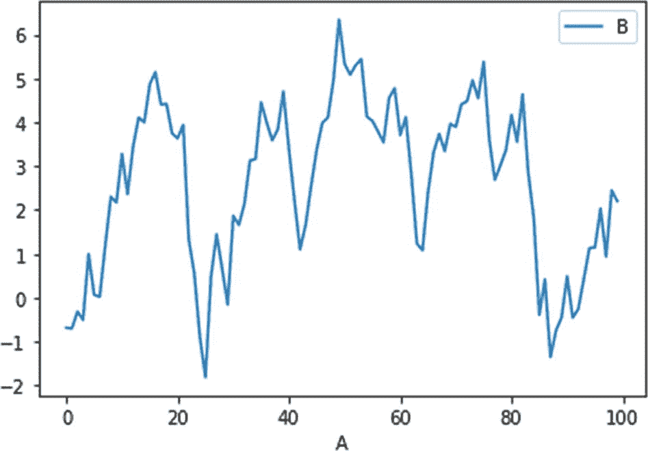

图 16-1

想象一个简单的绘图

您也可以在可视化中使用其他列，如下所示:

```py
plt.figure()
df1.plot(x='A', y='C')
plt.show()

```

运行这个例子来看看结果。这就是如何使用不同的列组合来可视化数据。

## 条形图

让我们使用相同的数据集创建一个简单的条形图。让我们从该数据帧中选取一条记录，如下所示:

```py
print(df1.iloc[4])

```

以下是输出:

```py
B    0.998419
C   -4.385832
A    4.000000
Name: 4, dtype: float64

```

让我们使用例程`bar()`用这些数据画一个简单的条形图。以下是相关的代码片段:

```py
plt.figure()
df1.iloc[4].plot.bar()
plt.axhline(0, color='k')
plt.show()

```

在这个代码示例中，我们使用`axhline()`绘制一条对应于 x 轴的水平线。图 [16-2](#Fig2) 显示输出。

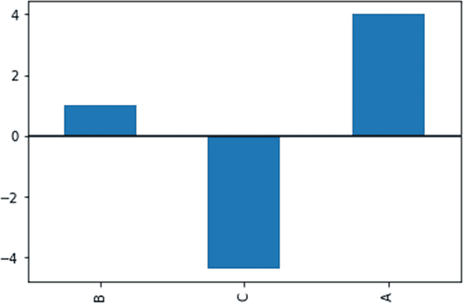

图 16-2

可视化简单的条形图

让我们讨论一个更复杂的条形图的例子。让我们创建一个新的数据集，如下所示:

```py
df2 = pd.DataFrame(np.random.rand(10, 4), columns=['a', 'b', 'c', 'd'])
print(df2)

```

输出如下所示:

```py
          a         b         c         d
0  0.352173  0.127452  0.637665  0.734944
1  0.375190  0.931818  0.769403  0.927441
2  0.830744  0.942059  0.781032  0.557774
3  0.977058  0.594992  0.557016  0.862058
4  0.960796  0.329448  0.493713  0.971139
5  0.364460  0.516401  0.432365  0.587528
6  0.292020  0.500945  0.889294  0.211502
7  0.770808  0.519468  0.279582  0.419549
8  0.982924  0.458197  0.938682  0.123614
9  0.578290  0.186395  0.901216  0.099061

```

在前面的例子中，我们只可视化了一行。现在，让我们将整个数据集可视化如下:

```py
plt.figure()
df2.plot.bar()
plt.show()

```

这将为每一行创建一个条形图。图表将按行分组，如图 [16-3](#Fig3) 所示。

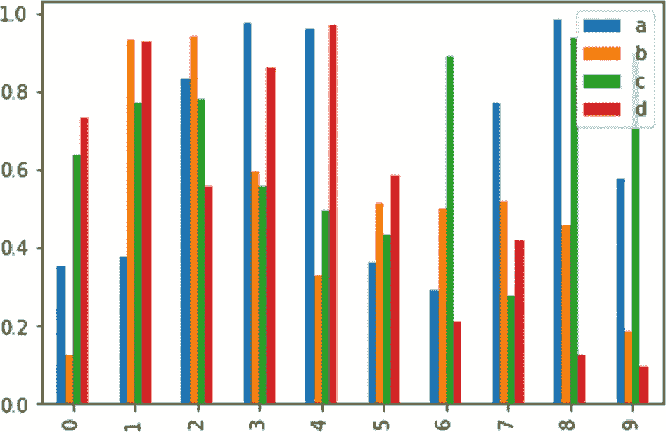

图 16-3

可视化更复杂的条形图

可以看到，x 轴表示指数，y 轴表示幅度。这是一个未堆叠的垂直条形图。您可以通过传递一个简单的参数来创建它的堆叠变体，如下所示:

```py
plt.figure()
df2.plot.bar(stacked=True)
plt.show()

```

图 [16-4](#Fig4) 显示了输出。

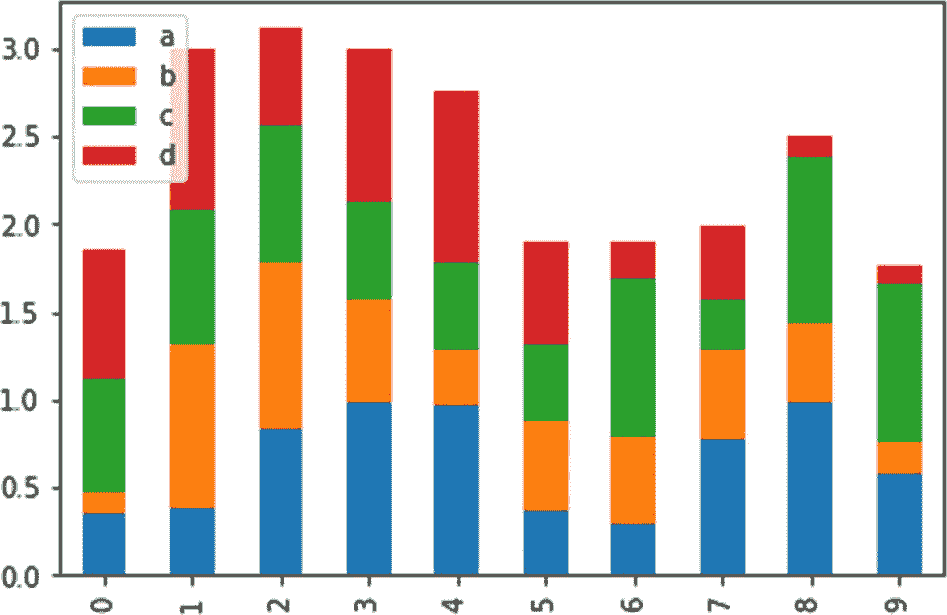

图 16-4

可视化垂直堆叠条形图

您甚至可以创建水平堆叠和非堆叠条形图。让我们用例程`barh()`创建一个水平堆叠条形图，如下所示:

```py
plt.figure()
df2.plot.barh(stacked=True)
plt.show()

```

图 [16-5](#Fig5) 显示了输出。

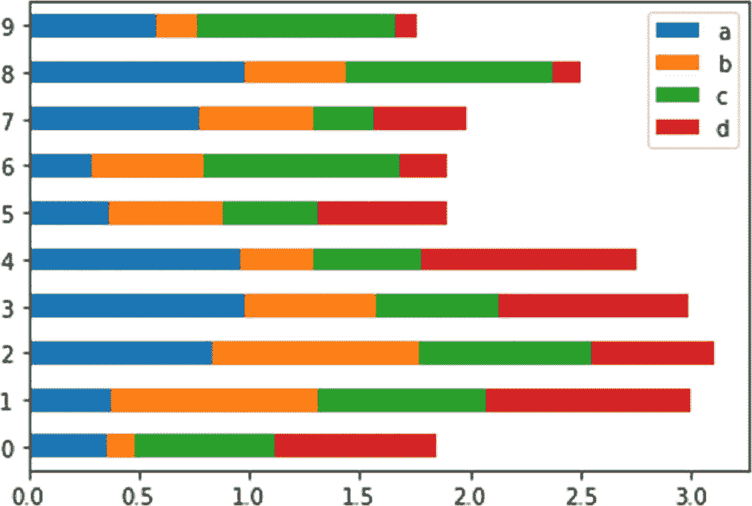

图 16-5

可视化水平堆叠条形图

让我们通过省略参数为非堆叠水平条形图编写一段代码，如下所示:

```py
plt.figure()
df2.plot.barh()
plt.show()

```

图 [16-6](#Fig6) 显示了输出。

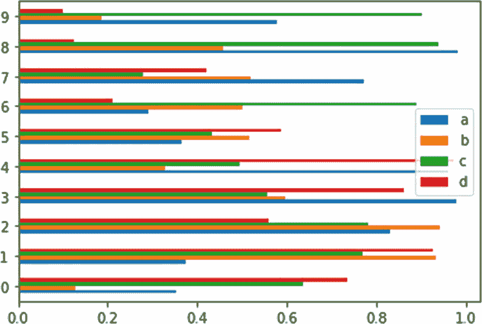

图 16-6

可视化水平未堆叠条形图

您刚刚学习了如何创建各种类型的条形图。

## 直方图

直方图是数字数据频率分布的直观表示。它首先被卡尔·皮尔逊使用。

我们首先将数据分成不同的桶或箱。箱子的大小取决于要求。对于整数数据集，可以有最小的容器大小，即 1。然后，对于每个库，您可以列出该库下的元素的出现次数。然后，您可以将该表显示为条形图。

你可以用 Pandas 和 Matplotlib 绘制给定数据集的直方图。让我们创建一个数据集，如下所示:

```py
df4 = pd.DataFrame({'a': np.random.randn(1000) + 1,
                    'b': np.random.randn(1000),
                    'c': np.random.randn(1000) - 1},
                   columns=['a', 'b', 'c'])
print(df4)

```

生成的数据集如下:

```py
            a         b         c
0    1.454474 -0.517940 -0.772909
1    1.886328  0.868393  0.109613
2    0.041313 -1.959168 -0.713575
3    0.650075  0.457937 -0.501023
4    1.684392 -0.072837  1.821190
..        ...       ...       ...
995  0.800481 -1.209032 -0.249132
996  0.490104  0.253966 -1.185503
997  2.304285  0.082134 -1.068881
998  1.249055  0.040750 -0.488890
999 -1.216627  0.444629 -1.198375

[1000 rows x 3 columns]

```

让我们使用例程`hist()`将该数据集可视化为直方图，如下所示:

```py
plt.figure();
df4.plot.hist(alpha=0.7)
plt.show()

```

图 [16-7](#Fig7) 显示了输出。

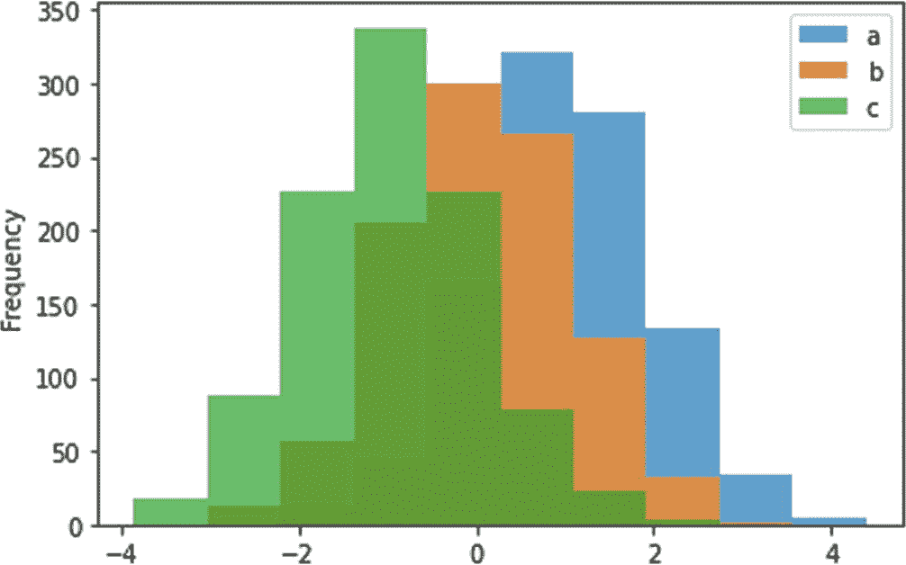

图 16-7

将数据集可视化为直方图

传递给 routine 的参数决定了输出的不透明度(或 alpha 透明度)。在上一个示例中，您必须使其透明，因为直方图未堆叠。让我们创建一个堆叠直方图，桶的大小为 20，如下所示:

```py
plt.figure();
df4.plot.hist(stacked=True, bins=20)
plt.show()

```

图 [16-8](#Fig8) 显示了输出。

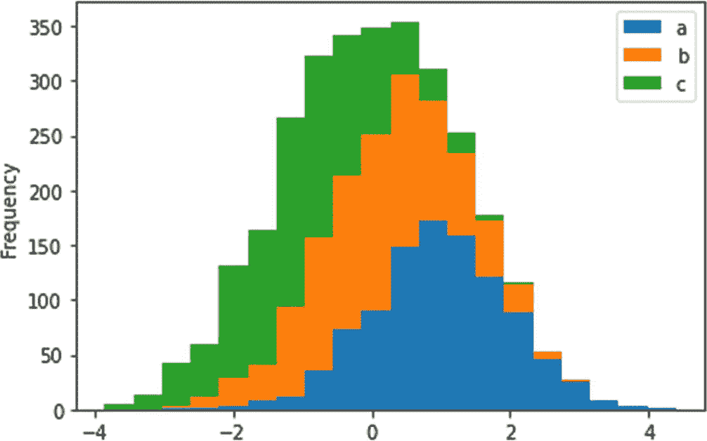

图 16-8

将同一数据集可视化为非堆叠直方图

让我们创建一个单列的水平累积直方图，如下所示:

```py
plt.figure();
df4['a'].plot.hist(orientation='horizontal', cumulative=True)
plt.show()

```

图 [16-9](#Fig9) 显示了输出。

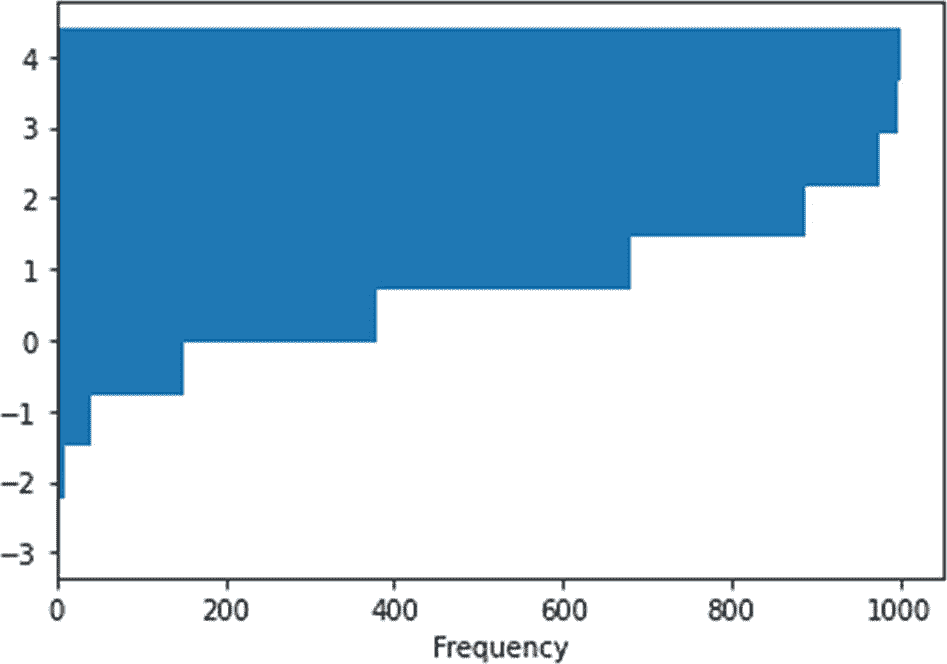

图 16-9

水平累积直方图

相同直方图的垂直版本可创建如下:

```py
plt.figure();
df4['a'].plot.hist(orientation='vertical', cumulative=True)
plt.show()

```

图 [16-10](#Fig10) 显示了输出。

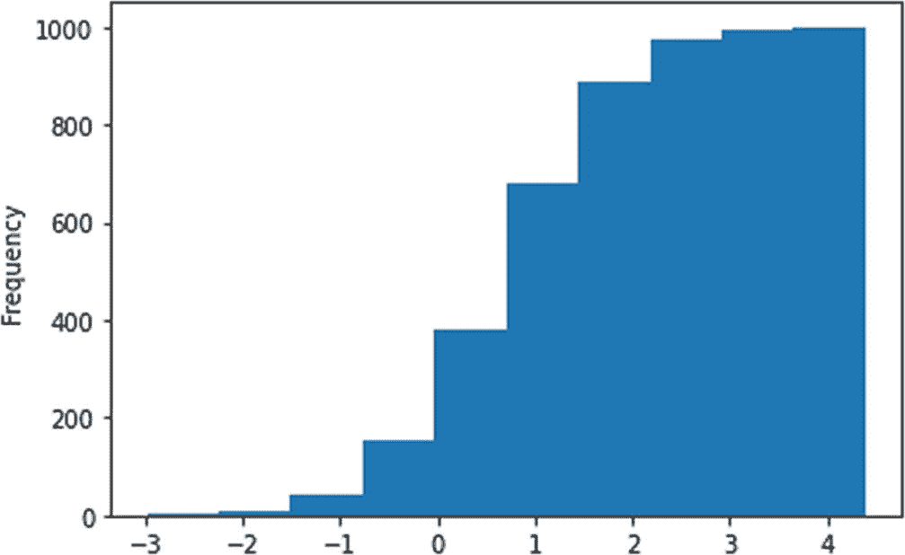

图 16-10

垂直累积直方图

接下来让我们尝试一种奇特的直方图。例程`diff()`计算前一行和当前行之间的数值差。

```py
print(df4.diff())

```

对于所有列，输出将在第一行填充 NaN(因为在第一行之前没有行)。输出如下所示:

```py
            a         b         c
0         NaN       NaN       NaN
1    0.431854  1.386333  0.882522
2   -1.845015 -2.827562 -0.823188
3    0.608762  2.417105  0.212552
4    1.034317 -0.530774  2.322213
..        ...       ...       ...
995  0.411207 -2.847858  0.325067
996 -0.310378  1.462998 -0.936370
997  1.814182 -0.171832  0.116622
998 -1.055230 -0.041384  0.579991
999 -2.465682  0.403880 -0.709485

[1000 rows x 3 columns]

```

让我们来可视化这个数据集，如下所示:

```py
plt.figure()
df4.diff().hist(color='k', alpha=0.5, bins=50)
plt.show()

```

图 [16-11](#Fig11) 显示了输出。

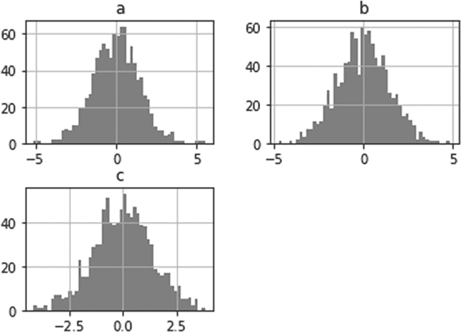

图 16-11

列方向直方图

您刚刚学习了如何将数据集可视化为直方图。

## 箱线图

您也可以用盒状图来可视化数据。箱线图(也拼写为*箱线图*)通过四分位数显示数字数据组。让我们创建一个数据集，如下所示:

```py
df = pd.DataFrame(np.random.rand(10, 5),
                  columns=['A', 'B', 'C', 'D', 'E'])
print(df)

```

生成的数据集如下:

```py
          A         B         C         D         E
0  0.684284  0.033906  0.099369  0.684024  0.533463
1  0.614305  0.645413  0.871788  0.561767  0.149080
2  0.226480  0.440091  0.096022  0.076962  0.674901
3  0.541253  0.409599  0.487924  0.649260  0.582250
4  0.436995  0.142239  0.781428  0.634987  0.825146
5  0.804633  0.874081  0.018661  0.306459  0.008134
6  0.228287  0.418942  0.157755  0.561070  0.740077
7  0.699860  0.230533  0.240369  0.108759  0.843307
8  0.530943  0.374583  0.650235  0.370809  0.595791
9  0.213455  0.221367  0.035203  0.887068  0.593629

```

您可以按如下方式绘制箱形图:

```py
plt.figure()
df.plot.box()
plt.show()

```

这将把数据集显示为箱形图，如图 [16-12](#Fig12) 所示。

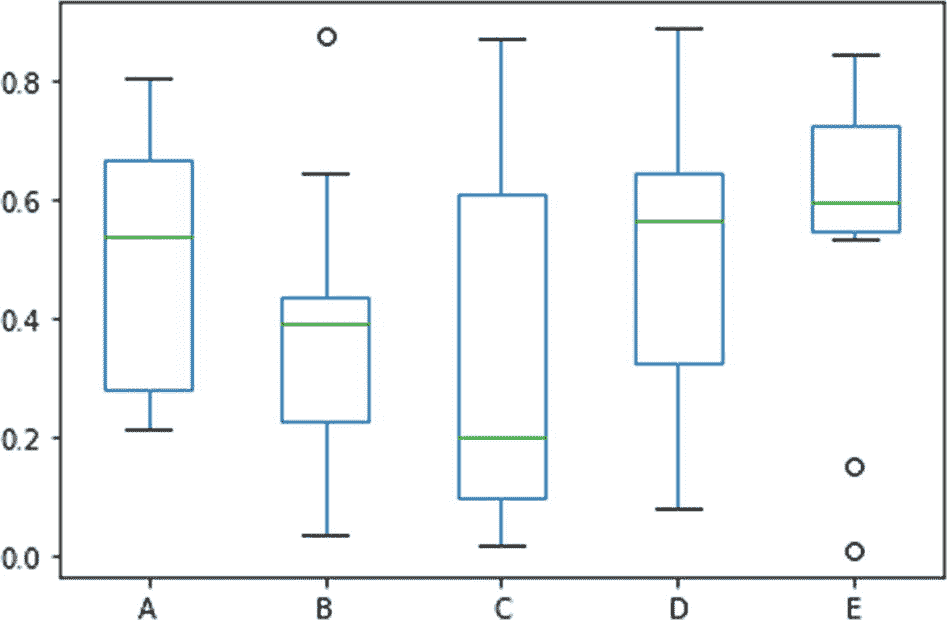

图 16-12

垂直箱线图

此处显示的颜色是默认值。你可以改变他们。首先，您需要创建一个字典，如下所示:

```py
color = dict(boxes='DarkGreen',
             whiskers='DarkOrange',
             medians='DarkBlue',
             caps='Gray')
print(color)

```

以下是输出:

```py
{'boxes': 'DarkGreen', 'whiskers': 'DarkOrange', 'medians': 'DarkBlue', 'caps': 'Gray'}

```

最后，您将这个字典作为参数传递给绘制盒状图的例程，如下所示:

```py
plt.figure()
df.plot.box(color=color, sym='r+')
plt.show()

```

图 [16-13](#Fig13) 显示了输出。

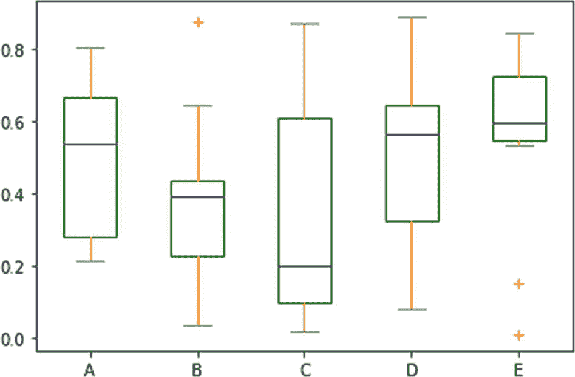

图 16-13

带有自定义颜色的垂直方框图

以下示例创建了一个水平方框图可视化:

```py
plt.figure()
df.plot.box(vert=False, positions=[1, 2, 3, 4 , 5])
plt.show()

```

图 [16-14](#Fig14) 显示了输出。

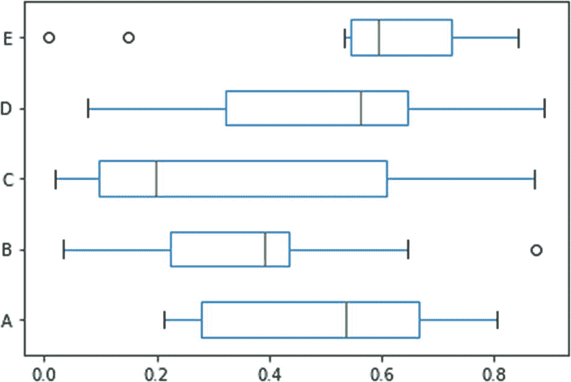

图 16-14

水平箱形图

让我们看看另一个例程，`boxplot()`，它也创建了方框图。为此，让我们创建另一个数据集，如下所示:

```py
df = pd.DataFrame(np.random.rand(10, 5))
print(df)

```

输出数据集如下所示:

```py
          0         1         2         3         4
0  0.936845  0.365561  0.890503  0.264896  0.937254
1  0.931661  0.226297  0.887385  0.036719  0.941609
2  0.127896  0.291034  0.161724  0.952966  0.925534
3  0.938686  0.336536  0.934843  0.806043  0.104054
4  0.743787  0.600116  0.989178  0.002870  0.453338
5  0.256692  0.773945  0.165381  0.809204  0.162431
6  0.822131  0.486780  0.453981  0.612403  0.614633
7  0.062387  0.958844  0.247515  0.573431  0.194665
8  0.453193  0.152337  0.062436  0.865115  0.220440
9  0.832040  0.237582  0.837805  0.423779  0.119027

```

您可以按如下方式绘制箱形图:

```py
plt.figure()
bp = df.boxplot()
plt.show()

```

图 [16-15](#Fig15) 显示了输出。

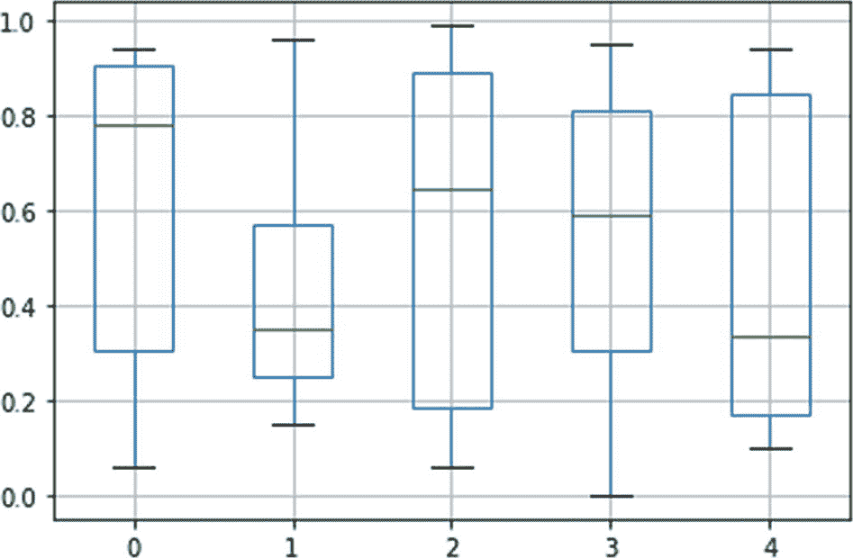

图 16-15

方框图在起作用

例程`boxplot()`的主要优点是您可以在单个输出中拥有列级可视化。让我们创建一个适当的数据集，如下所示:

```py
df = pd.DataFrame(np.random.rand(10, 2), columns=['Col1', 'Col2'] )
df['X'] = pd.Series(['A', 'A', 'A', 'A', 'A', 'B', 'B', 'B', 'B', 'B'])
print(df)

```

输出数据集如下所示:

```py
       Col1      Col2  X
0  0.469416  0.341874  A
1  0.176359  0.921808  A
2  0.135188  0.149354  A
3  0.475295  0.360012  A
4  0.566289  0.142729  A
5  0.408705  0.571466  B
6  0.233820  0.470200  B
7  0.679833  0.633349  B
8  0.183652  0.559745  B
9  0.192431  0.726981  B

```

让我们按如下方式创建列级可视化:

```py
plt.figure();
bp = df.boxplot(by='X')
plt.show()

```

默认情况下，输出会有一个解释数据如何分组的标题，如图 [16-16](#Fig16) 所示。

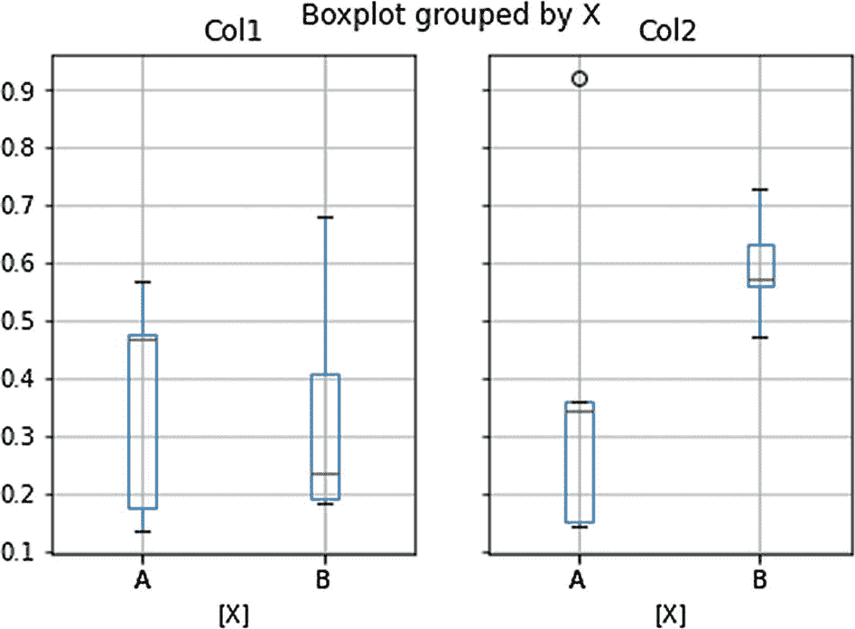

图 16-16

带组的盒状图

让我们看一个稍微复杂一点的例子。以下是新数据集的代码:

```py
df = pd.DataFrame(np.random.rand(10,3), columns=['Col1', 'Col2', 'Col3'])
df['X'] = pd.Series(['A','A','A','A','A','B','B','B','B','B'])
df['Y'] = pd.Series(['A','B','A','B','A','B','A','B','A','B'])
print(df)

```

这段代码创建了以下数据集:

```py
       Col1      Col2      Col3  X  Y
0  0.542771  0.175804  0.017646  A
1  0.247552  0.503725  0.569475  A  B
2  0.593635  0.842846  0.755377  A
3  0.210409  0.235510  0.633318  A  B
4  0.268419  0.170563  0.478912  A
5  0.526251  0.258278  0.549876  B
6  0.311182  0.212787  0.966183  B  A
7  0.100687  0.432545  0.586907  B
8  0.416833  0.879384  0.635664  B  A
9  0.249280  0.558648  0.661523  B

```

您可以在多个列的组中创建盒图(这意味着分组标准将有多个列)。

```py
plt.figure();
bp = df.boxplot(column=['Col1','Col2'], by=['X','Y'])
plt.show()

```

图 [16-17](#Fig17) 显示了输出。

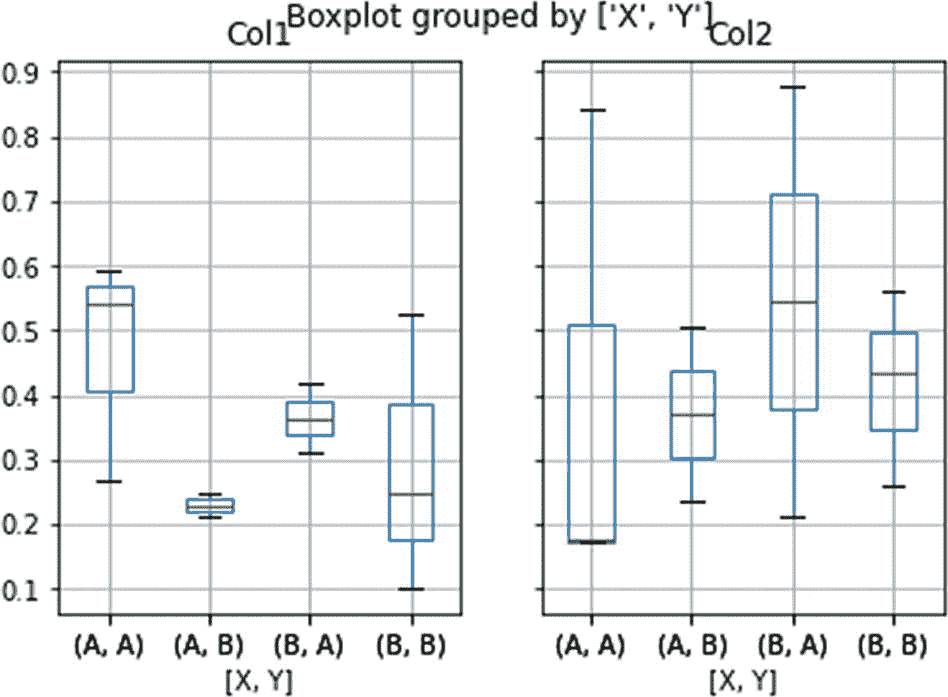

图 16-17

分组的盒状图(分组标准中的多列)

让我们看一个更复杂的例子，数据集有更多的变化。下面的代码创建了这样一个数据集:

```py
np.random.seed(1234)
df_box = pd.DataFrame(np.random.randn(10, 2), columns=['A', 'B'])
df_box['C'] = np.random.choice(['Yes', 'No'], size=10)
print(df_box)

```

输出是以下数据集:

```py
          A         B    C
0  0.471435 -1.190976   No
1  1.432707 -0.312652  Yes
2 -0.720589  0.887163   No
3  0.859588 -0.636524  Yes
4  0.015696 -2.242685   No
5  1.150036  0.991946  Yes
6  0.953324 -2.021255   No
7 -0.334077  0.002118   No
8  0.405453  0.289092   No
9  1.321158 -1.546906   No

```

您可以使用 Pandas 中的例程`groupby()`对数据进行分组，并将其可视化，如下所示:

```py
plt.figure()
bp = df_box.boxplot(by='C')
plt.show()

```

图 [16-18](#Fig18) 显示了按列 c 分组的输出。

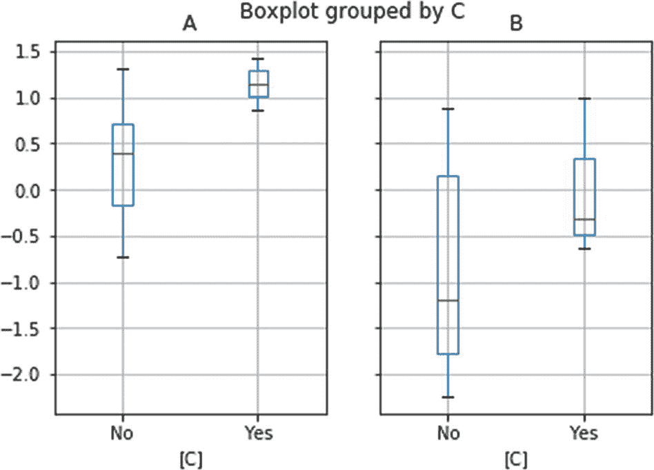

图 16-18

箱线图 plt.figure()可视化，按列 C 分组

另一个例子如下:

```py
bp = df_box.groupby('C').boxplot()
plt.show()

```

图 [16-19](#Fig19) 显示了输出。

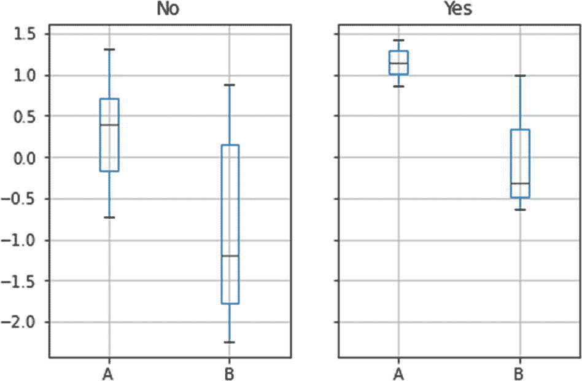

图 16-19

按列 C 分组的箱形图可视化

这就是将数据集可视化为箱线图的方式。

## 面积图

您也可以将数据集可视化为面积图。让我们创建一个包含四列的数据集，如下所示:

```py
df = pd.DataFrame(np.random.rand(10, 4),
                  columns=['A', 'B', 'C', 'D'])
print(df)

```

这将创建以下数据集:

```py
          A         B         C         D
0  0.982005  0.123943  0.119381  0.738523
1  0.587304  0.471633  0.107127  0.229219
2  0.899965  0.416754  0.535852  0.006209
3  0.300642  0.436893  0.612149  0.918198
4  0.625737  0.705998  0.149834  0.746063
5  0.831007  0.633726  0.438310  0.152573
6  0.568410  0.528224  0.951429  0.480359
7  0.502560  0.536878  0.819202  0.057116
8  0.669422  0.767117  0.708115  0.796867
9  0.557761  0.965837  0.147157  0.029647

```

您可以使用例程`area()`可视化所有这些数据，如下所示:

```py
plt.figure()
df.plot.area()
plt.show()

```

前面的例子创建了一个堆积面积图，如图 [16-20](#Fig20) 所示。

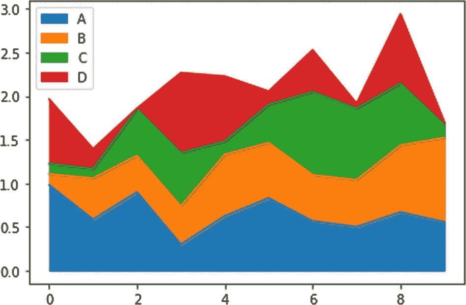

图 16-20

堆积面积图

您也可以通过向例程`area()`传递一个参数来创建未堆叠区域图，如下所示:

```py
plt.figure()
df.plot.area(stacked=False)
plt.show()

```

默认情况下，未堆叠面积图是透明的，因此所有单个面积图都是可见的。图 [16-21](#Fig21) 显示了输出。

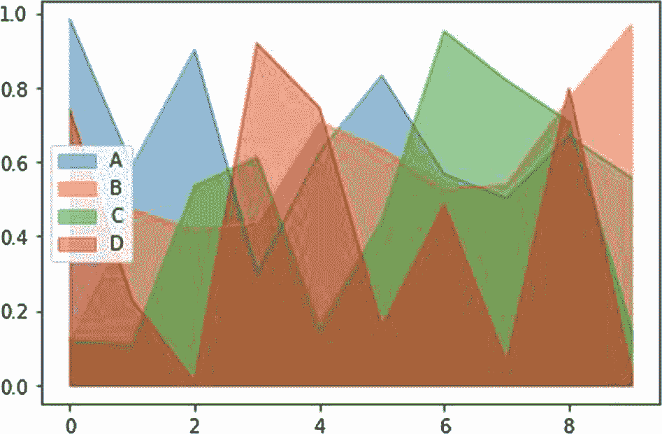

图 16-21

未堆叠面积图

这是创建面积图的方法。

## 散点图

您还可以将任何数据集可视化为散点图。让我们创建一个数据集，如下所示:

```py
df = pd.DataFrame(np.random.rand(10, 4),
                  columns=['A', 'B', 'C', 'D'])
print(df)

```

输出数据集如下所示:

```py
          A         B         C         D
0  0.593893  0.114066  0.950810  0.325707
1  0.193619  0.457812  0.920403  0.879069
2  0.252616  0.348009  0.182589  0.901796
3  0.706528  0.726658  0.900088  0.779164
4  0.599155  0.291125  0.151395  0.335175
5  0.657552  0.073343  0.055006  0.323195
6  0.590482  0.853899  0.287062  0.173067
7  0.134021  0.994654  0.179498  0.317547
8  0.568291  0.009349  0.900649  0.977241
9  0.556895  0.084774  0.333002  0.728429

```

您可以将 A 列和 B 列可视化为散点图，如下所示:

```py
plt.figure()
df.plot.scatter(x='A', y='B')
plt.show()

```

图 [16-22](#Fig22) 显示了输出。

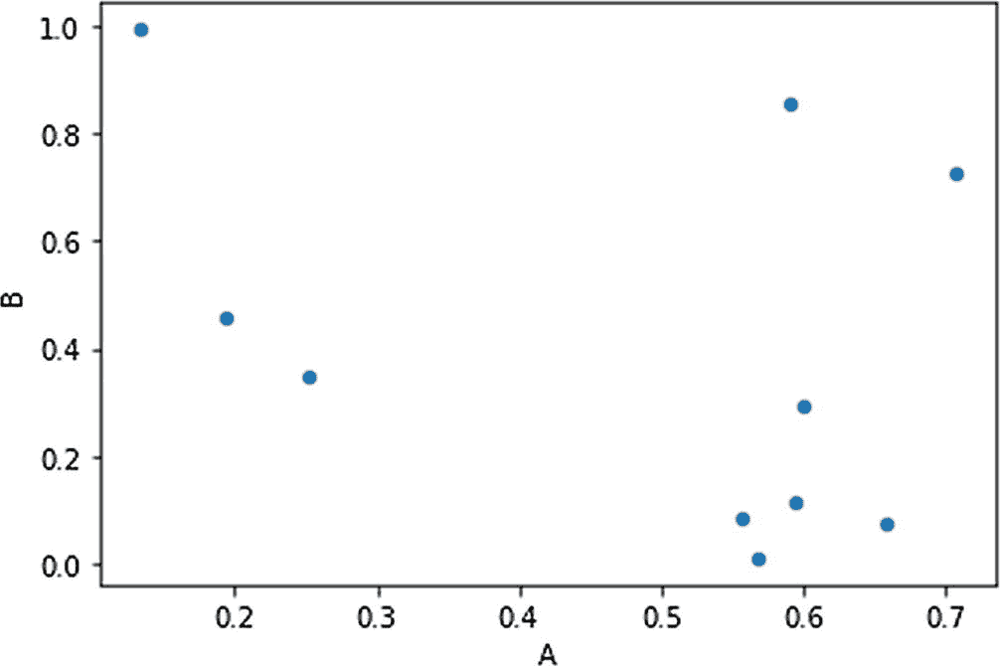

图 16-22

简单散点图

您可以可视化多个组，如下所示:

```py
ax = df.plot.scatter(x='A', y='B',
                     color='Blue',
                     label='Group 1')
plt.figure()
df.plot.scatter(x='C', y='D',
                color='Green',
                label='Group 2',
                ax=ax)
plt.show()

```

图 [16-23](#Fig23) 显示了输出。

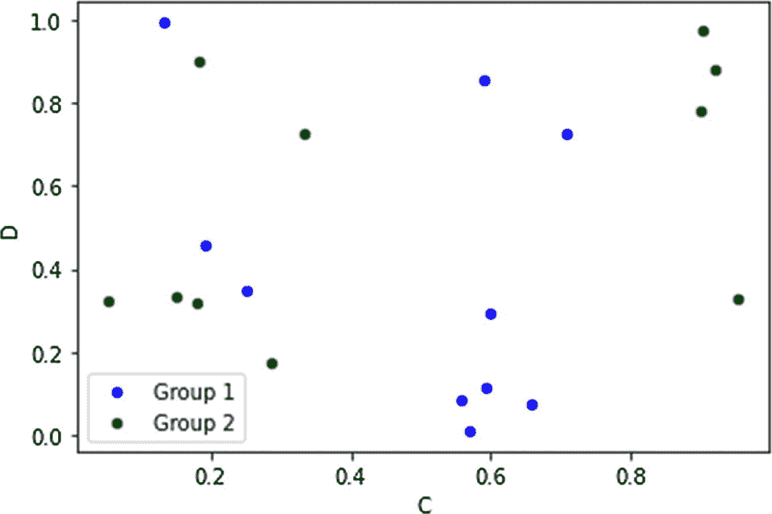

图 16-23

多组散点图

让我们看看如何自定义散点图。您可以自定义点的颜色和大小。颜色或尺寸可以是恒定的，也可以是可变的。以下是数据点可变颜色和恒定大小的示例。当颜色可变时，默认情况下会在输出中添加一个颜色条。

```py
plt.figure()
df.plot.scatter(x='A', y='B', c='C', s=40)
plt.show()

```

图 [16-24](#Fig24) 显示了输出。

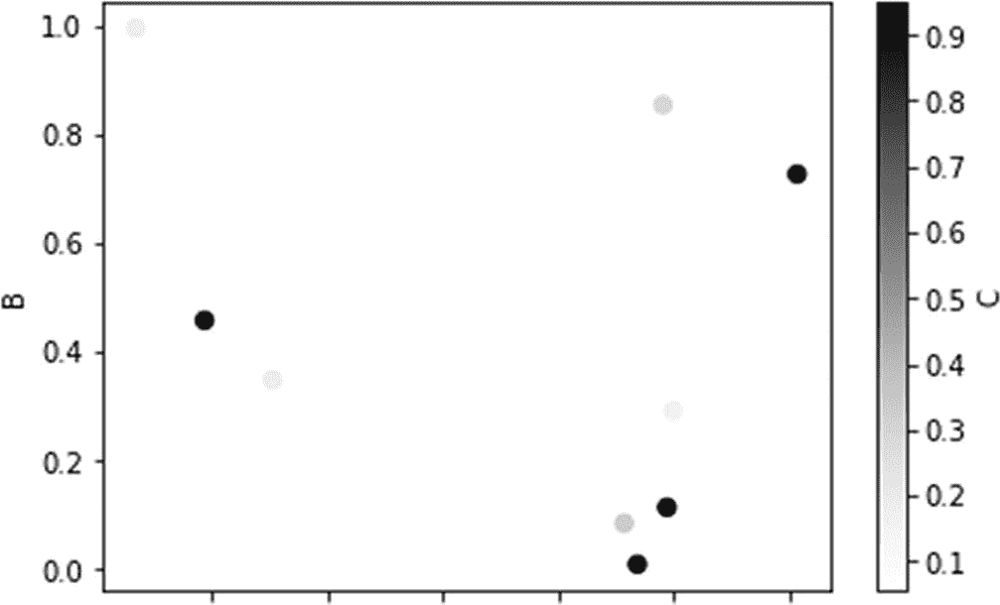

图 16-24

数据点的不同颜色散点图

让我们将大小指定为变量，如下所示:

```py
plt.figure()
df.plot.scatter(x='A', y='B', s=df['C']*100)
plt.show()

```

图 [16-25](#Fig25) 显示了输出。

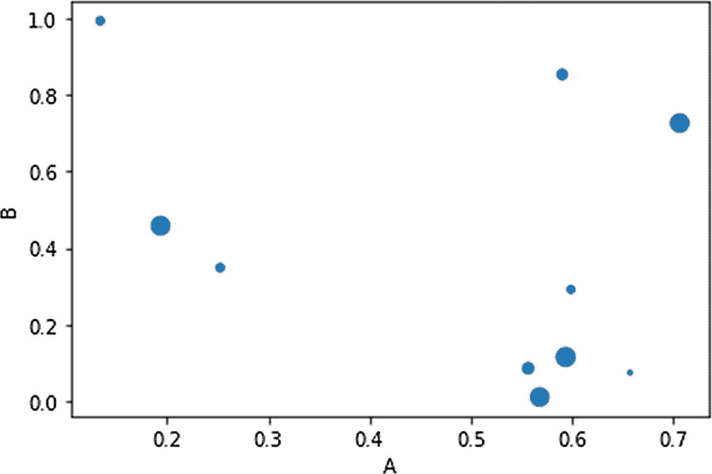

图 16-25

数据点大小不同的散点图

最后，让我们看一个完全定制的可变尺寸和可变颜色的示例，如下所示:

```py
plt.figure()
df.plot.scatter(x='A', y='B', c='C', s=df['D']*100)
plt.show()

```

图 [16-26](#Fig26) 显示了输出。

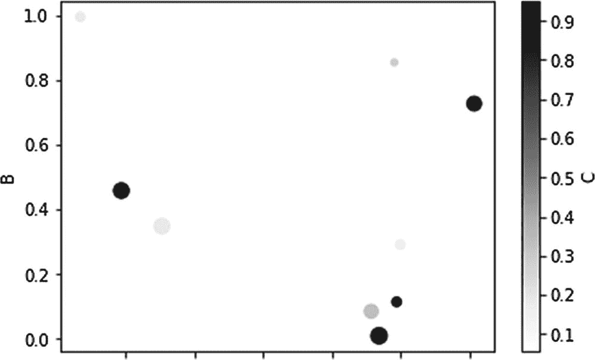

图 16-26

数据点大小不同的散点图

您刚刚学习了如何创建和定制散点图。

## 六边形箱线图

您也可以用六边形仓(hexbin)图来可视化数据。让我们准备一个数据集如下:

```py
df = pd.DataFrame(np.random.randn(100, 2),
                  columns=['A', 'B'])
df['B'] = df['B'] + np.arange(100)
print(df)

```

输出如下所示:

```py
           A          B
0   0.165445  -1.127470
1  -1.192185   1.818644
2   0.237185   1.663616
3   0.694727   3.750161
4   0.247055   4.645433
..       ...        ...
95  0.650346  94.485664
96  0.539429  97.526762
97 -3.277193  95.151439
98  0.672125  96.507021
99 -0.827198  99.914196

[100 rows x 2 columns]

```

让我们用 hexbin 图来直观显示这些数据，如下所示:

```py
plt.figure()
df.plot.hexbin(x='A', y='B', gridsize=20)
plt.show()

```

图 [16-27](#Fig27) 显示了输出。

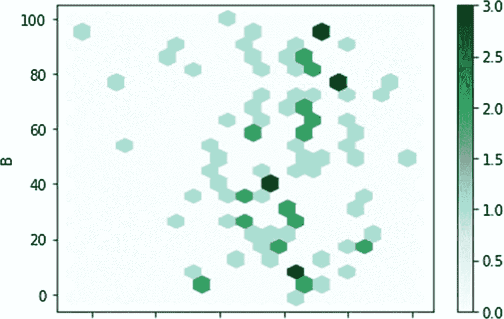

图 16-27

Hexbin 图示例

如您所见，您可以自定义网格的大小。

## 饼图

最后，您将学习如何创建饼图来可视化数据集。让我们创建一个数据集，如下所示:

```py
series = pd.Series(3 * np.random.rand(4),
                   index=['A', 'B', 'C', 'D'],
                   name='series')
print(series)

```

这将创建以下数据集:

```py
A    1.566910
B    0.294986
C    2.140910
D    2.652122
Name: series, dtype: float64

```

您可以将其形象化如下:

```py
plt.figure()
series.plot.pie(figsize=(6, 6))
plt.show()

```

图 [16-28](#Fig28) 显示了输出。

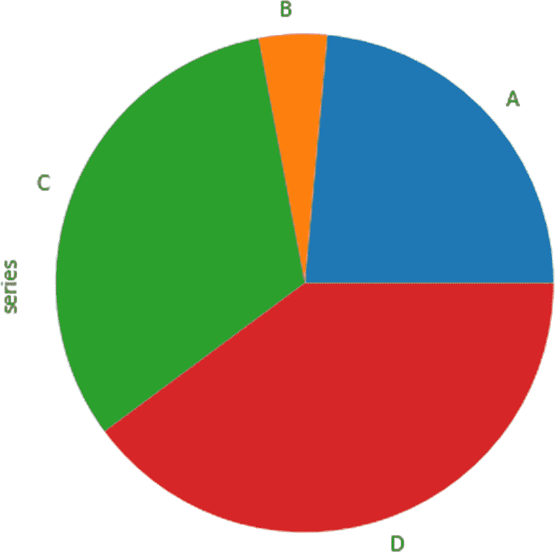

图 16-28

简单的饼图

让我们创建一个包含两列的数据集，如下所示:

```py
df = pd.DataFrame(3 * np.random.rand(4, 2),
                  index=['A', 'B', 'C', 'D'],
                  columns=['X', 'Y'])
print(df)

```

这会生成以下数据:

```py
          X         Y
A  1.701163  2.983445
B  0.536219  0.036600
C  1.370995  2.795256
D  2.538074  1.419990

```

图 [16-29](#Fig29) 显示了输出。

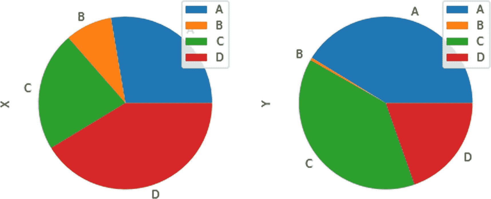

图 16-29

多列数据集的简单饼图

您可以自定义饼图。具体来说，您可以自定义字体、颜色和标签，如下所示:

```py
plt.figure()
series.plot.pie(labels=['A', 'B', 'C', 'D'],
                colors=['r', 'g', 'b', 'c'],
                autopct='%.2f', fontsize=20,
                figsize=(6, 6))
plt.show()

```

图 [16-30](#Fig30) 显示了输出。

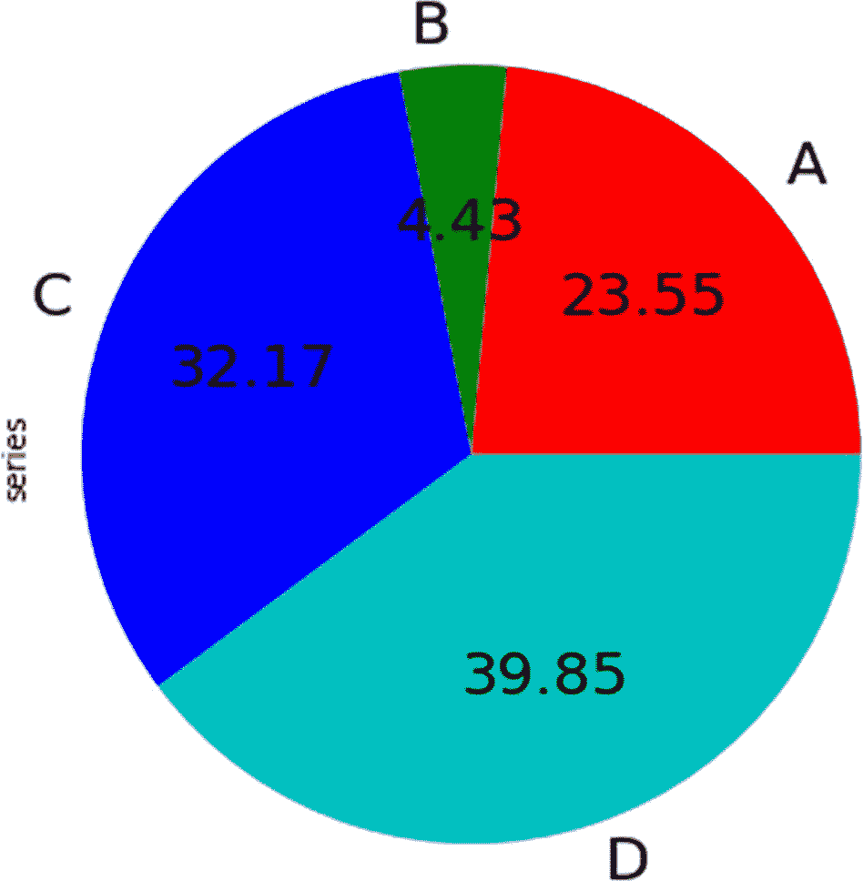

图 16-30

一个简单而定制的饼图

让我们通过传递总和小于 1.0 的值来创建一个部分饼图。以下是这方面的数据:

```py
series = pd.Series([0.1] * 4,
                   index=['A', 'B', 'C', 'D'],
                   name='series2')
print(series)

```

这将创建以下数据集:

```py
A    0.1
B    0.1
C    0.1
D    0.1
Name: series2, dtype: float64

```

部分饼图可以如下图所示:

```py
plt.figure()
series.plot.pie(figsize=(6, 6))
plt.show()

```

这就形成了一个局部饼图(或半圆)，如图 [16-31](#Fig31) 所示。

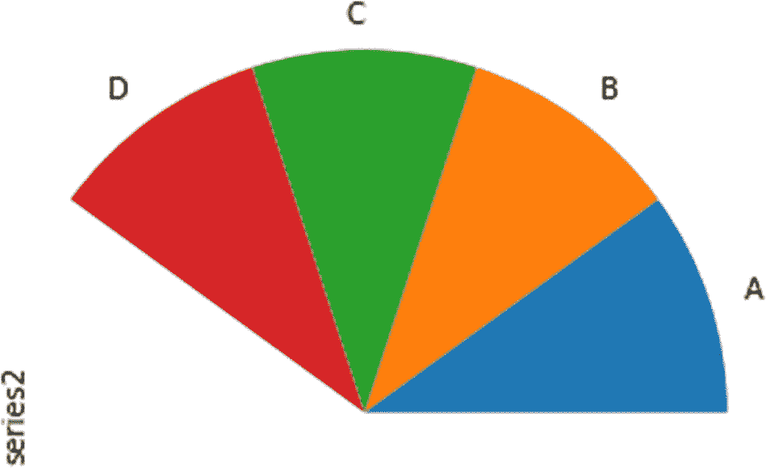

图 16-31

一个简单而定制的饼图

您刚刚学习了如何用饼图可视化数据。

## 摘要

在本章中，您学习了如何使用各种技术来可视化数据。您可以在实际项目中使用这些可视化技术。在接下来的章节中，我们将探索用 Python 创建数据可视化的其他库。

在下一章中，您将了解如何使用一个名为 Seaborn 的新库来创建数据可视化。