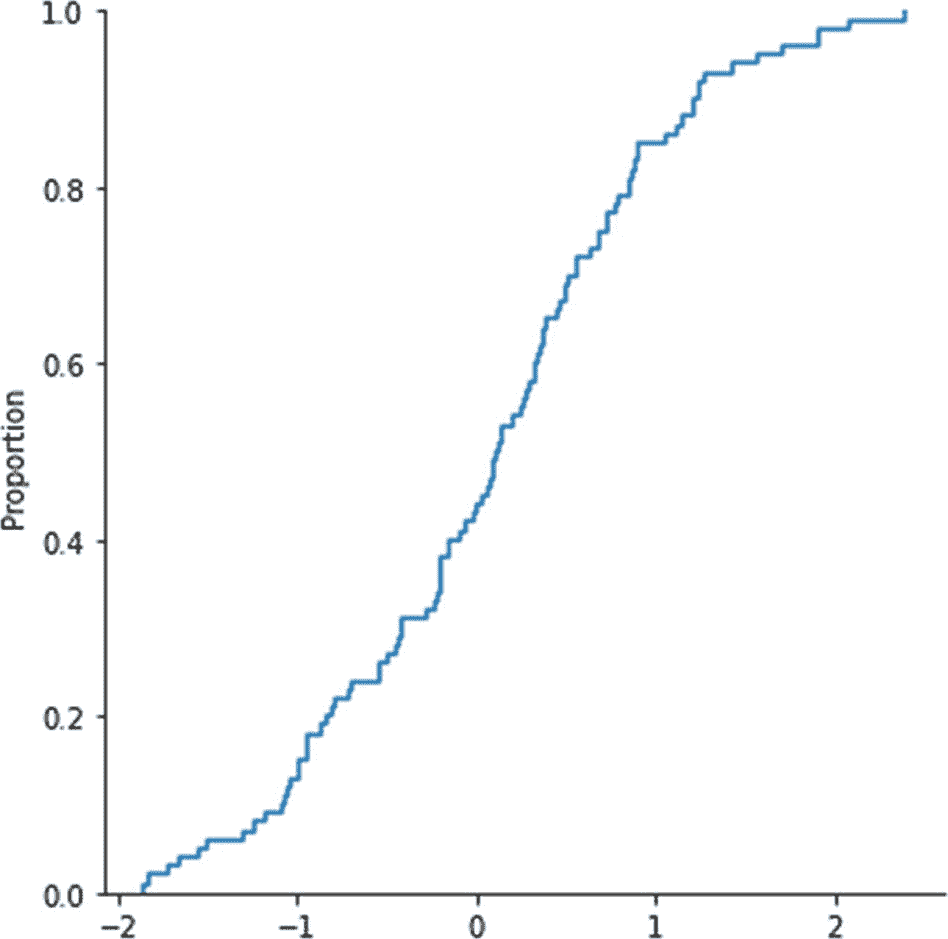

# 十七、Seaborn 数据可视化简介

在前一章中，您学习了如何可视化存储在 Pandas 系列和 dataframe 中的数据。

在本书的前几章中，您广泛学习了数据可视化库 Matplotlib 以及其他重要的数据科学库 NumPy 和 Pandas。在这一章中，您将暂时脱离 Matplotlib，学习如何使用另一个名为 Seaborn 的相关库进行数据可视化。以下是您将在本章中了解的主题:

*   什么是 Seaborn？

*   绘制统计关系

*   绘制线条

*   可视化数据的分布

读完这一章，你会很容易使用 Seaborn 库，并且能够创建很好的数据集可视化。

## 什么是 Seaborn？

您已经学习了如何使用 Matplotlib 库进行数据可视化。Matplotlib 并不是 Python 中唯一的数据可视化库。Python 中有许多可以可视化数据的库。科学数据可视化库支持 NumPy 和 Pandas 的数据结构。用于科学 Python 可视化的一个这样的库是 Seaborn ( [`https://seaborn.pydata.org/index.html`](https://seaborn.pydata.org/index.html) )。Seaborn 是基于 Matplotlib 构建的。它为绘制吸引人的图形提供了很多功能。它在 Pandas 中内置了对 series 和 dataframe 数据结构的支持，在 NumPy 中内置了对 Ndarrays 的支持。

让我们为本章中的演示创建一个新笔记本。现在，让我们用下面的命令安装 Seaborn:

```py
!pip3 install seaborn

```

您可以使用以下语句将库导入到您的笔记本或 Python 脚本中:

```py
import seaborn as sns

```

你知道 Seaborn 图书馆支持 Pandas 数据帧。Seaborn 库也存储了许多填充了数据的数据帧。所以，我们可以用它们来做演示。让我们看看如何检索这些数据帧。以下命令返回所有内置示例数据帧的列表:

```py
sns.get_dataset_names()

```

以下是输出:

```py
['anagrams',
 'anscombe',
 'attention',
 'brain_networks',
 'car_crashes',
 'diamonds',
 'dots',
 'exercise',
 'flights',
 'fmri',
 'gammas',
 'geyser',
 'iris',
 'mpg',
 'penguins',
 'planets',
 'tips',
 'titanic']

```

您可以将这些数据帧加载到 Python 变量中，如下所示:

```py
iris = sns.load_dataset('iris')

```

让我们用下面的语句来看看存储在`iris`数据集中的数据:

```py
iris

```

图 [17-1](#Fig1) 显示了输出。


图 17-1

虹膜数据集

## 绘制统计关系

您可以在 Seaborn 中用各种函数绘制两个变量之间的统计关系。完成这项工作的通用绘图函数是`relplot()`。您可以使用此功能绘制各种类型的数据。默认情况下，`relplot()`函数绘制散点图。这里有一个例子:

```py
%matplotlib inline
import numpy as np
import pandas as pd
import matplotlib.pyplot as plt

sns.relplot(x='sepal_length',
            y='sepal_width',
            data=iris)
plt.grid('on')
plt.show()

```

这产生了如图 [17-2](#Fig2) 所示的散点图。


图 17-2

散点图

您可以明确指定绘图类型，如下所示:

```py
sns.relplot(x='sepal_length', y='sepal_width',
            data=iris, kind='scatter')
plt.grid('on')
plt.show()

```

函数`replot()`是一个通用函数，可以传递一个参数来指定绘图类型。您也可以使用功能`scatterplot()`创建散点图。例如，下面的代码创建了如图 [17-2](#Fig2) 所示的相同结果:

```py
sns.scatterplot(x='sepal_length',
                y='sepal_width',
                data=iris)
plt.grid('on')
plt.show()

```

您可以将数据集的一些其他列提供给绘图函数，如下所示:

```py
sns.relplot(x='petal_length',
            y='petal_width',
            data=iris)
plt.grid('on')
plt.show()

```

图 [17-3](#Fig3) 显示了输出。


图 17-3

散点图的另一个例子

您也可以用`scatterplot()`函数编写如下:

```py
sns.scatterplot(x='petal_length',
                y='petal_width',
                data=iris)
plt.grid('on')
plt.show()

```

您可以自定义绘图，并使用颜色编码显示附加列，如下所示:

```py
sns.relplot(x='sepal_length',
            y='sepal_width',
            hue='species',
            data=iris)
plt.grid('on')
plt.show()

```

图 [17-4](#Fig4) 显示了输出。


图 17-4

带颜色的散点图

使用以下代码，您会得到如图 [17-4](#Fig4) 所示的相同结果:

```py
sns.scatterplot(x='sepal_length',
                y='sepal_width',
                hue='species',
                data=iris)
plt.grid('on')
plt.show()

```

您还可以为散点图数据点(标记)分配样式，如下所示:

```py
sns.relplot(x='sepal_length', y='sepal_width',
            hue='petal_length', style='species',
            data=iris)
plt.grid('on')
plt.show()

```

您可以在图 [17-5](#Fig5) 中看到输出。


图 17-5

带有颜色和自定义样式的散点图

以下代码产生如图 [17-5](#Fig5) 所示的相同输出:

```py
sns.scatterplot(x='sepal_length', y='sepal_width',
            hue='petal_length', style='species',
            data=iris)
plt.grid('on')
plt.show()

```

您也可以调整标记的大小，如下所示:

```py
sns.relplot(x='sepal_length', y='sepal_width',
            size='petal_length', style='species',
            hue='species', data=iris)
plt.grid('on')
plt.show()

```

图 [17-6](#Fig6) 显示了输出。


图 17-6

带有颜色、自定义样式和标记大小的散点图

以下代码产生如图 [17-5](#Fig5) 所示的相同结果:

```py
sns.scatterplot(x='sepal_length', y='sepal_width',
            size='petal_length', style='species',
            hue='species', data=iris)
plt.grid('on')
plt.show()

```

## 绘制线条

您还可以显示连续数据，如沿线的时间序列数据。时序数据至少在一列中有时间戳数据，或者有一个索引。时间序列的一个很好的例子是每日温度记录表。让我们创建一个时间序列数据框架来演示折线图。

```py
df = pd.DataFrame(np.random.randn(100, 4),
                  index=pd.date_range("1/1/2020",
                                      periods=100),
                  columns=list("ABCD"))
df = df.cumsum()

```

您可以使用功能`relplot()`绘制如下直线:

```py
sns.relplot(x=df.index, y='A', kind="line", data=df)
plt.xticks(rotation=45)
plt.show()

```

图 [17-7](#Fig7) 显示了输出。


图 17-7

时间序列数据的线图

您也可以使用以下代码生成如图 [17-7](#Fig7) 所示的输出:

```py
sns.lineplot(x=df.index,
             y='A', data=df)
plt.xticks(rotation=45)
plt.show()

```

在下一节中，您将学习如何可视化数据的分布。

## 可视化数据的分布

可视化数据分布的一个最突出的例子是频率表或频率分布表。您可以创建数据可以具有的值范围的存储桶(域)，然后可以列出满足存储桶标准的项目数。您还可以改变存储桶的大小，最小大小为 1。

您可以使用条形图和线条直观地显示频率分布的信息。如果你使用棒线，那么它就是所谓的*直方图*。您可以使用功能`displot()`来可视化频率数据。让我们从虚拟的单变量数据开始。

```py
x = np.random.randn(100)
sns.displot(x)
plt.show()

```

图 [17-8](#Fig8) 显示了输出。


图 17-8

柱状图

您还可以在输出中明确表示您需要一个直方图，如下所示:

```py
sns.displot(x, kind='hist')
plt.show()

```

直方图是默认的图表类型。您还可以显示高斯核密度估计(KDE)，如下所示:

```py
sns.displot(x, kind='kde')
plt.show()

```

图 [17-9](#Fig9) 显示了输出。


图 17-9

KDE 图

您可以将经验累积分布函数(eCDF)可视化如下:

```py
sns.displot(x, kind='ecdf')
plt.show()

```

图 [17-10](#Fig10) 显示了输出。



图 17-10

eCDF 图

您可以将直方图和 KDE 组合起来，如下所示:

```py
sns.displot(x, kind='hist', kde=True)
plt.show()

```

图 [17-11](#Fig11) 显示了输出。


图 17-11

结合 KDE 的直方图

现在让我们使用一些现实生活中的数据，如下:

```py
tips = sns.load_dataset("tips")
sns.displot(x='total_bill', data=tips, kind='hist')
plt.show()

```

图 [17-12](#Fig12) 显示了输出。


图 17-12

现实生活中的数据可视化为直方图

您可以在可视化中自定义容器(或桶)的大小，如下所示:

```py
sns.displot(x='total_bill', data=tips,
            kind='hist', bins=30, kde=True)
plt.show()

```

图 [17-13](#Fig13) 显示了输出。


图 17-13

直方图中的自定义存储桶

您可以根据您选择的标准调整图的色调，如下所示:

```py
sns.displot(x='total_bill', data=tips,
            kind='kde', hue='size')
plt.show()

```

图 [17-14](#Fig14) 显示了输出。


图 17-14

KDE 图中的定制颜色

到目前为止，我们已经使用了单个变量来显示该图。当您使用两个变量进行绘图时，它被称为*双变量*图。这里有一个简单的例子:

```py
sns.displot(x='total_bill',
            y='tip', data=tips)
plt.show()

```

图 [17-15](#Fig15) 显示了输出。


图 17-15

简单的二元直方图

您可以向此示例添加颜色，如下所示:

```py
sns.displot(x='total_bill', y='tip',
            hue='size', data=tips)
plt.show()

```

图 [17-16](#Fig16) 显示了输出。


图 17-16

一个简单的带颜色的二元直方图

您还可以自定义框的大小，并在 x 轴和 y 轴上添加记号(称为*地毯图*)，如下所示:

```py
sns.displot(x='total_bill', y='tip',
            data=tips, rug=True,
            kind='hist', bins=30)
plt.show()

```

图 [17-17](#Fig17) 显示了输出。


图 17-17

一个简单的双变量直方图，带有自定义的条块和地毯图

一种更有趣的可视化形式是双变量 KDE 图。它看起来像一个轮廓。代码如下:

```py
sns.displot(x='total_bill', y='tip',
            data=tips, kind='kde')
plt.show()

```

图 [17-18](#Fig18) 显示了输出。


图 17-18

一个简单的二元 KDE 图

您可以将地毯图添加到输出中，如下所示:

```py
sns.displot(x='total_bill', y='tip',
            data=tips, rug=True,
            kind='kde')
plt.show()

```

输出具有 KDE 和 rug 可视化效果，如图 [17-19](#Fig19) 所示。


图 17-19

带有地毯图的简单二元 KDE 图

基于数据框中的列，您可以创建按行或列排列的单个可视化效果。让我们根据吸头的大小创建一个可视化效果，如下所示:

```py
sns.displot(x='total_bill', y='tip',
            data=tips, rug=True,
            kind='kde', col='size')
plt.show()

```

在前面的示例中，我们启用了 rug plot 特性，这些图将根据吸头的大小单独生成。图 [17-20](#Fig20) 显示了输出。


图 17-20

一个简单的二元 KDE 图，地毯图按列排列

您也可以按如下方式按行排列各个图形:

```py
sns.displot(x='total_bill', y='tip',
            data=tips, rug=True,
            kind='kde', row='size')
plt.show()

```

图 [17-21](#Fig21) 显示了输出。


图 17-21

带有成行排列的地毯图的简单二元 KDE 图

您刚刚学习了如何可视化数据的分布。

## 摘要

这一章包含了大量的演示。您详细探索了 Python 的 Seaborn 数据可视化库。Seaborn 是一个庞大的库，在这一章中我们仅仅触及了它的皮毛。你可以参考位于 [`https://seaborn.pydata.org/index.html`](https://seaborn.pydata.org/index.html) 的 Seaborn 项目主页，获取 API 文档、教程和示例库。

在本书的下一章也是最后一章，您将学习如何使用 Matplotlib 和 Seaborn 数据可视化库可视化当前正在进行的新冠肺炎疫情的真实数据。