# 十八、使用 Matplotlib 和 Seaborn 可视化真实数据

在上一章中，您学习了如何使用新的数据可视化库为科学 Python 任务可视化数据。您学习了从以各种格式存储的数据中创建可视化效果。

在本章中，您将利用本书前几章中获得的所有知识，将它们整合在一起，为来自新冠肺炎疫情的真实数据和来自互联网的动物疾病数据集准备可视化。以下是您将在本章中探讨的主题:

*   新冠肺炎疫情数据

*   以编程方式获取疫情数据

*   为可视化准备数据

*   使用 Matplotlib 和 Seaborn 创建可视化

*   创建动物疾病数据的可视化

阅读完本章后，您将能够轻松使用和创建真实数据集的可视化效果。

## 新冠肺炎疫情数据

在写这篇文章的时候(2021 年 5 月)，世界正面临着新冠肺炎疫情。新冠肺炎是由严重急性呼吸综合征冠状病毒 2 型(新型冠状病毒)引起的。症状包括常见的流感样症状和呼吸困难。

世界上有多个组织收集和共享流行病的实时数据。一个是约翰霍普金斯大学( [`https://coronavirus.jhu.edu/map.html`](https://coronavirus.jhu.edu/map.html) )，一个是 Worldometers ( [`https://www.worldometers.info/coronavirus/`](https://www.worldometers.info/coronavirus/) )。这两个网页都有关于新冠肺炎疫情的数据，并且更新非常频繁。图 [18-1](#Fig1) 显示了新冠肺炎的约翰霍普金斯页面。

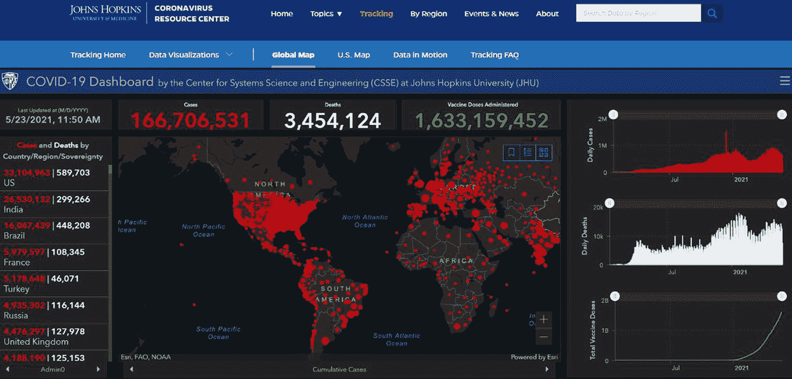

图 18-1

约翰霍普金斯大学新冠肺炎主页

图 [18-2](#Fig2) 显示了 Worldometers 网站。


图 18-2

世界计量新冠肺炎主页

正如我提到的，数据经常更新，所以这些网站对于最新的信息是相当可靠的。

## 以编程方式获取疫情数据

在本节中，您将学习如何使用 Python 程序获取两个数据集(约翰霍普金斯大学和世界计量学院)。为此，您需要为 Python 安装一个库。图书馆主页位于 [`https://ahmednafies.github.io/covid/`](https://ahmednafies.github.io/covid/) ，PyPI 页面为 [`https://pypi.org/project/covid/`](https://pypi.org/project/covid/) 。使用 Jupyter 笔记本为本章创建一个新笔记本。您可以在笔记本中使用以下命令轻松安装该库:

```py
!pip3 install covid

```

您可以将库导入笔记本或 Python 脚本/程序，如下所示:

```py
from covid import Covid

```

您可以创建一个对象来从在线源获取数据。默认情况下，约翰霍普金斯大学的数据源如下:

```py
covid = Covid()

```

请注意，由于高流量，有时服务器没有响应。这种情况我经历过很多次。

您可以按如下方式明确提及数据源:

```py
covid = Covid(source="john_hopkins")

```

您可以按如下方式明确指定世界几何:

```py
covid = Covid(source="worldometers")

```

您可以看到数据的来源如下:

```py
covid.source

```

根据数据源，这会返回一个相关的字符串，如下所示:

```py
'john_hopkins'

```

您可以按国家名称获取状态，如下所示:

```py
covid.get_status_by_country_name("italy")

```

这将返回一个字典，如下所示:

```py
{'id': '86',
 'country': 'Italy',
 'confirmed': 4188190,
 'active': 283744,
 'deaths': 125153,
 'recovered': 3779293,
 'latitude': 41.8719,
 'longitude': 12.5674,
 'last_update': 1621758045000}

```

您还可以通过国家 ID 获取状态，尽管只有 Johns Hopkins 数据集有此列，因此代码将为 Worldometers 返回一个错误。

```py
# Only valid for Johns Hopkins
covid.get_status_by_country_id(115)

```

输出类似于前面的示例，如下所示:

```py
{'id': '115',
 'country': 'Mexico',
 'confirmed': 2395330,
 'active': 261043,
 'deaths': 221597,
 'recovered': 1912690,
 'latitude': 23.6345,
 'longitude': -102.5528,
 'last_update': 1621758045000}

```

您也可以获取国家列表，如下所示:

```py
covid.list_countries()

```

以下是部分输出:

```py
[{'id': '179', 'name': 'US'},
 {'id': '80', 'name': 'India'},
 {'id': '24', 'name': 'Brazil'},
 {'id': '63', 'name': 'France'},
 {'id': '178', 'name': 'Turkey'},
 {'id': '143', 'name': 'Russia'},
 {'id': '183', 'name': 'United Kingdom'},
....

```

在本章中，您将继续使用约翰霍普金斯数据集。

您可以获得如下活动案例:

```py
covid.get_total_active_cases()

```

输出如下所示:

```py
27292520

```

您可以按如下方式获得确诊病例总数:

```py
covid.get_total_confirmed_cases()

```

输出如下所示:

```py
166723247

```

您可以获得恢复的案例总数，如下所示:

```py
covid.get_total_recovered()

```

输出如下所示:

```py
103133392

```

你可以得到总死亡人数如下:

```py
covid.get_total_deaths()

```

输出如下所示:

```py
3454602

```

您可以通过函数调用`covid.get_data()`获取所有数据。这将返回一个字典列表，其中每个字典保存一个国家的数据。以下是输出:

```py
[{'id': '179',
  'country': 'US',
  'confirmed': 33104963,
  'active': None,
  'deaths': 589703,
  'recovered': None,
  'latitude': 40.0,
  'longitude': -100.0,
  'last_update': 1621758045000},
 {'id': '80',
  'country': 'India',
  'confirmed': 26530132,
  'active': 2805399,
  'deaths': 299266,
  'recovered': 23425467,
  'latitude': 20.593684,
  'longitude': 78.96288,
  'last_update': 1621758045000},
......

```

## 为可视化准备数据

您必须准备好这些提取的数据以便可视化。为此，您必须转换 Pandas 数据框架中的词典列表。可以按如下方式完成:

```py
import pandas as pd
df = pd.DataFrame(covid.get_data())
print(df)

```

图 [18-3](#Fig3) 显示了输出。

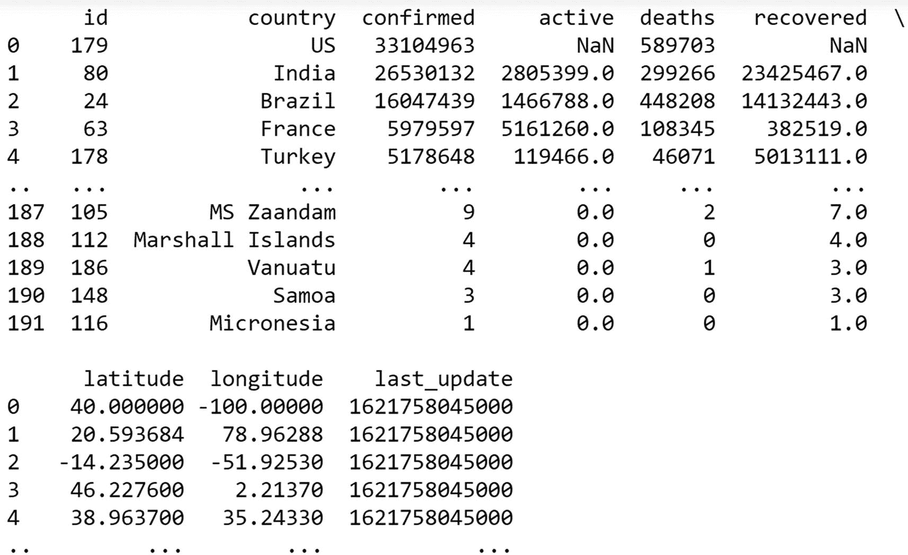

图 18-3

新冠肺炎数据的 Pandas 数据框架

您可以按如下方式进行排序:

```py
sorted = df.sort_values(by=['confirmed'], ascending=False)

```

然后，您必须排除世界和各大洲的数据，以便只保留单个国家的数据。

```py
excluded = sorted [ ~sorted.country.isin(['Europe', 'Asia',
                                          'South America',
                                          'World', 'Africa',
                                          'North America'])]

```

让我们找出十大记录。

```py
top10 = excluded.head(10)
print(top10)

```

然后，您可以将列分配给各个变量，如下所示:

```py
x = top10.country
y1 = top10.confirmed
y2 = top10.active
y3 = top10.deaths
y4 = top10.recovered

```

## 使用 Matplotlib 和 Seaborn 创建可视化

让我们用 Matplotlib 和 Seaborn 将数据可视化。首先导入所有需要的库，如下所示:

```py
%matplotlib inline
import matplotlib.pyplot as plt
import seaborn as sns

```

可以获得如下简单的线性图:

```py
plt.plot(x, y1)
plt.xticks(rotation=90)
plt.show()

```

图 [18-4](#Fig4) 显示了输出。

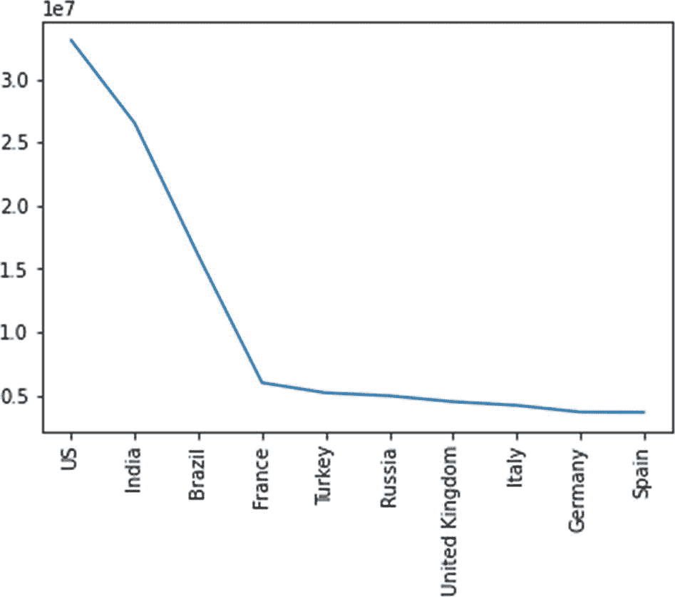

图 18-4

使用 Matplotlib 绘制线性图

你可以给这个绘图加个标题。你也可以使用 Seaborn 库。以下是 Seaborn 的线形图示例:

```py
sns.set_theme(style='whitegrid')
sns.lineplot(x=x, y=y1)
plt.xticks(rotation=90)
plt.show()

```

在代码示例中，我们使用了函数`set_theme()`。它为 Matplotlib 和 Seaborn 可视化设置整个笔记本的主题。您可以将字符串`'darkgrid'`、`'whitegrid'`、`'dark'`、`'white'`或`'ticks'`中的一个作为参数传递给这个函数。图 [18-5](#Fig5) 显示了输出。

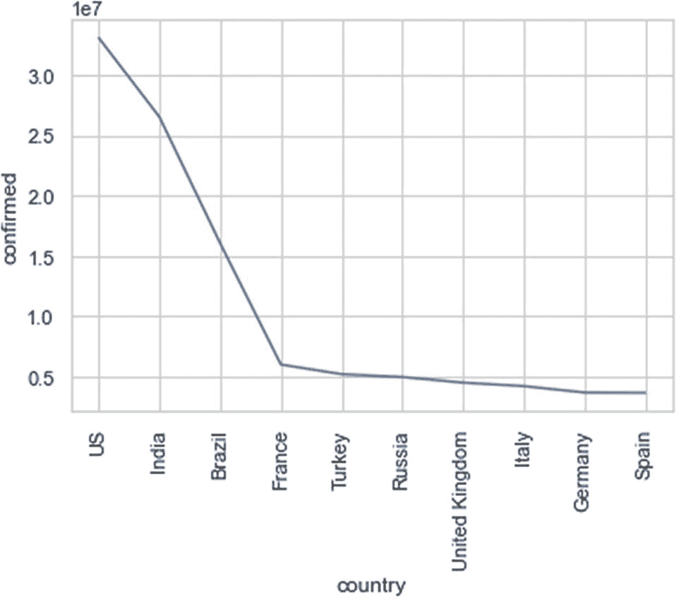

图 18-5

带有 Seaborn 的线性图

您可以使用 Matplotlib 创建一个简单的条形图，如下所示:

```py
plt.bar(x, y1)
plt.xticks(rotation=45)
plt.show()

```

图 [18-6](#Fig6) 显示了输出。

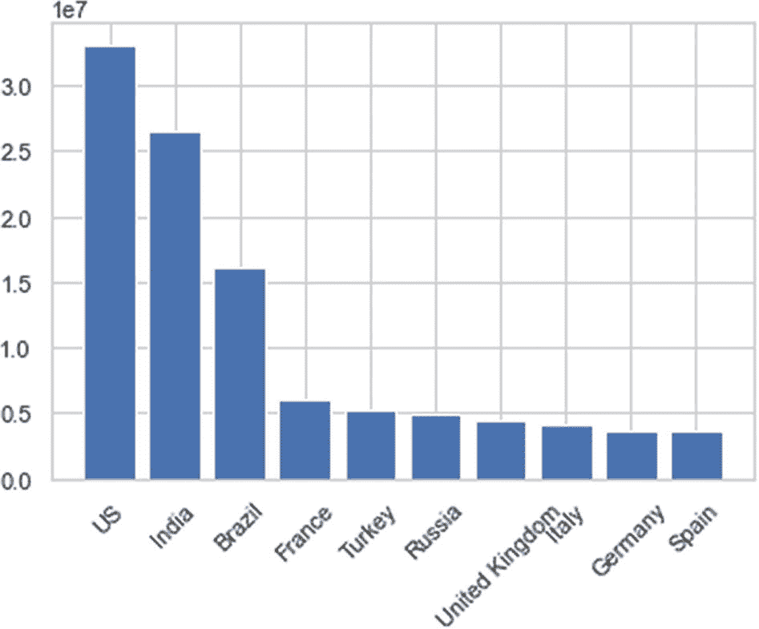

图 18-6

使用 Matplotlib 绘制条形图

同样的可视化也可以用 Seaborn 来实现，它可以生成美观得多的条形图。

```py
sns.barplot(x=x, y=y1)
plt.xticks(rotation=45)
plt.show()

```

图 [18-7](#Fig7) 显示了输出。

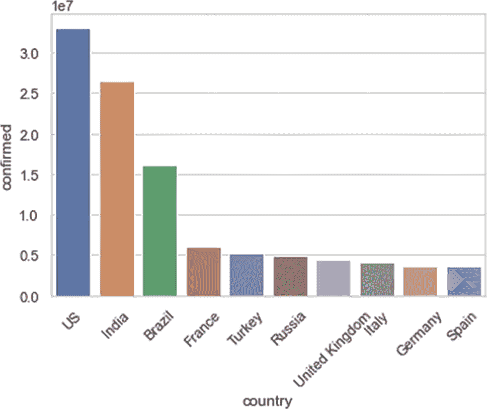

图 18-7

有 Seaborn 的条形图

您甚至可以按如下方式更改调色板:

```py
sns.barplot(x=x, y=y1,
            palette="Blues_d")
plt.xticks(rotation=45)
plt.show()

```

图 [18-8](#Fig8) 显示了输出。

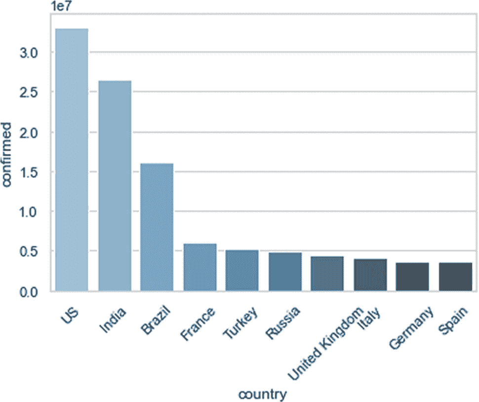

图 18-8

使用带有自定义调色板的 Seaborn 的条形图

您可以按如下方式创建多行图形:

```py
labels = ['Confirmed', 'Active', 'Deaths', 'Recovered']
plt.plot(x, y1, x, y2, x, y3, x, y4)
plt.legend(labels, loc='upper right')
plt.xticks(rotation=90)
plt.show()

```

图 [18-9](#Fig9) 显示了输出。

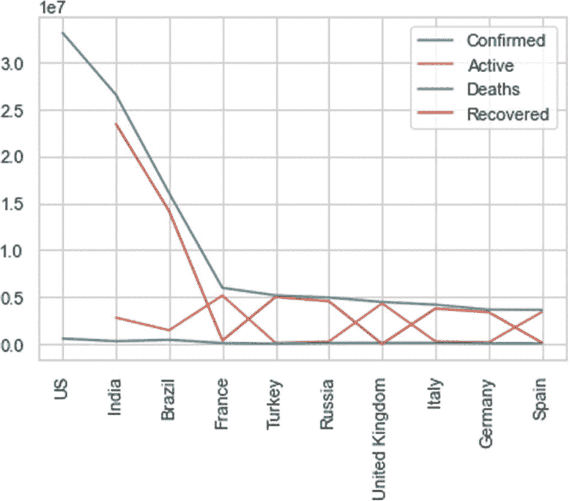

图 18-9

多线图

您可以使用 Seaborn 库来创建相同的图形，如下所示:

```py
sns.lineplot(x=x, y=y1)
sns.lineplot(x=x, y=y2)
sns.lineplot(x=x, y=y3)
sns.lineplot(x=x, y=y4)
plt.legend(labels, loc='upper right')
plt.xticks(rotation=45)
plt.show()

```

图 [18-10](#Fig10) 显示了输出。

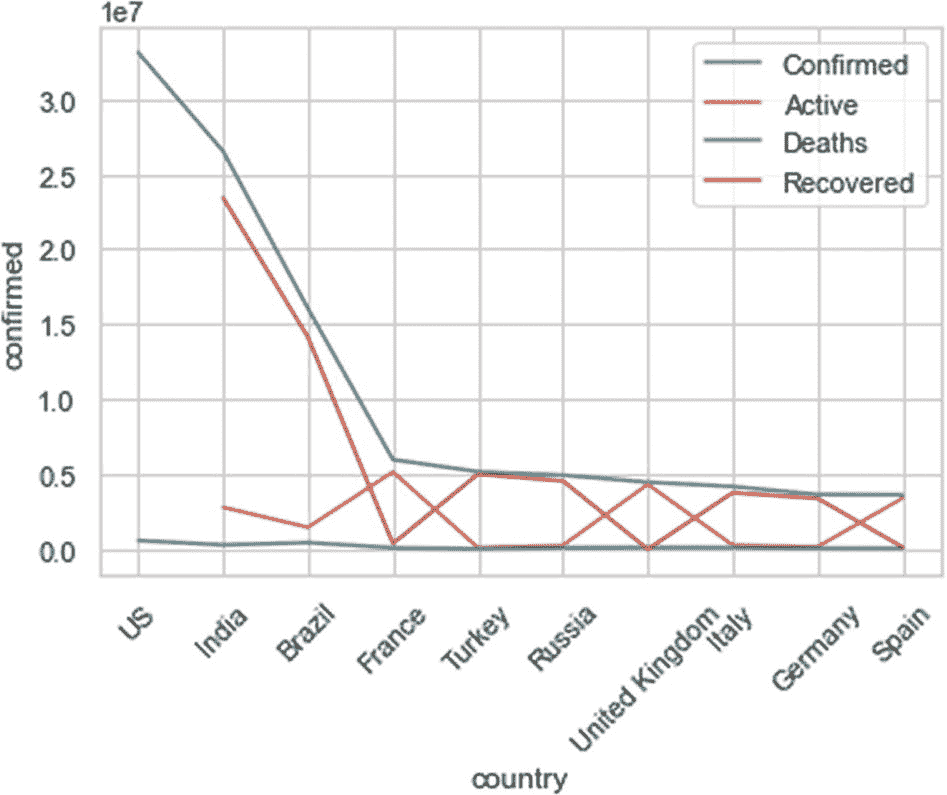

图 18-10

带有 Seaborn 的多线图

现在，您将看到如何使用 Matplotlib 创建多条形图，如下所示:

```py
df2 = pd.DataFrame([y1, y2, y3, y4])
df2.plot.bar()
plt.legend(x, loc='best')
plt.xticks(rotation=45)
plt.show()

```

图 [18-11](#Fig11) 显示了输出。

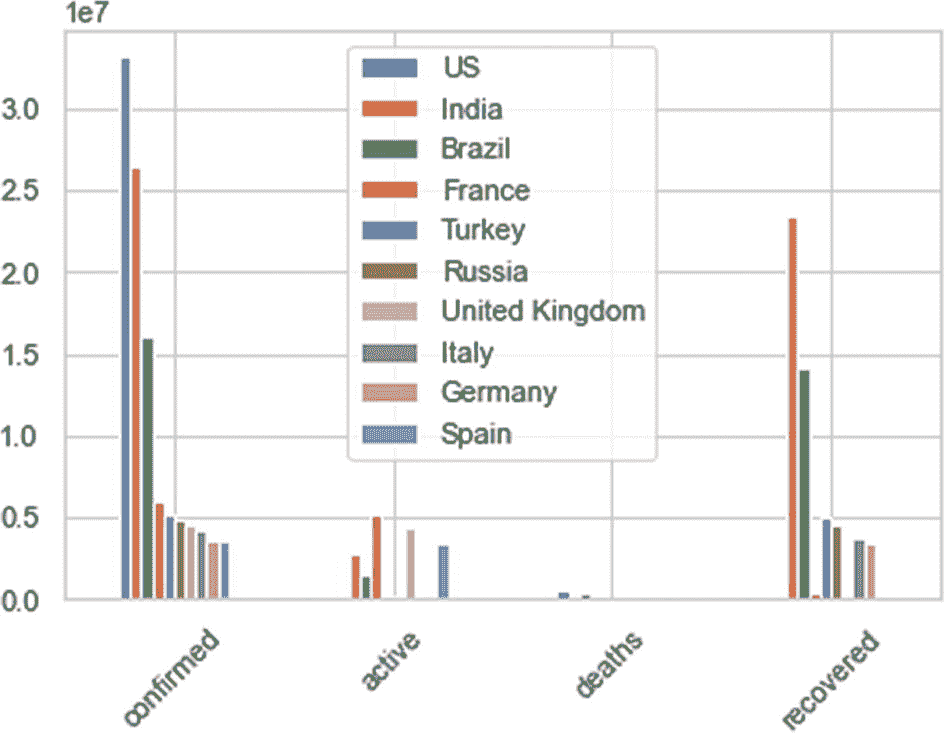

图 18-11

多行条形图

您甚至可以横向显示，如下所示:

```py
df2.plot.barh()
plt.legend(x, loc='best')
plt.xticks(rotation=45)
plt.show()

```

图 [18-12](#Fig12) 显示了输出。

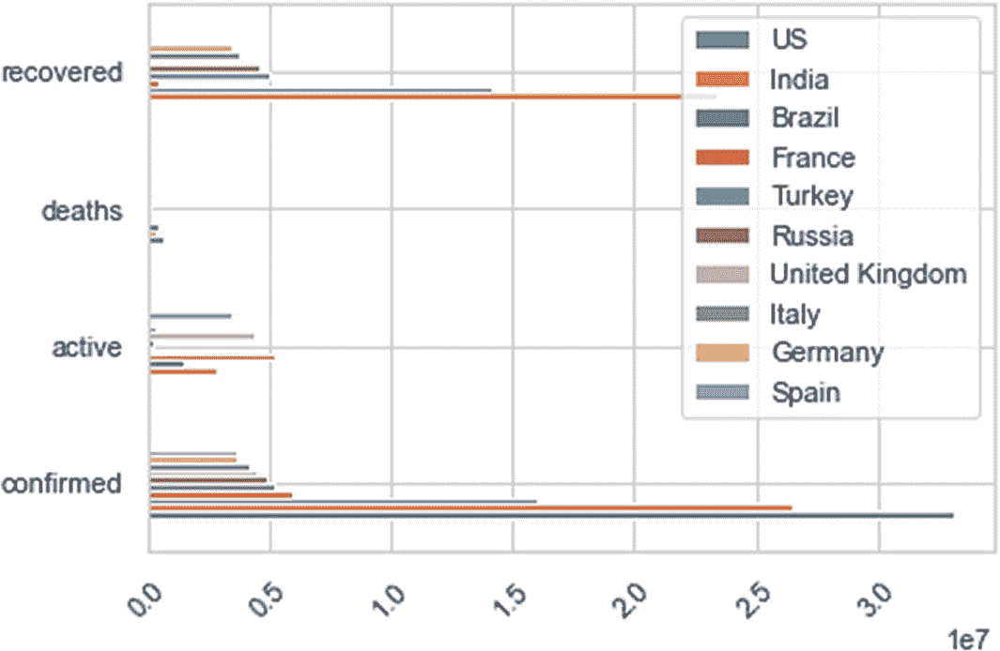

图 18-12

多线水平图

您可以使用 Seaborn 创建散点图，如下所示:

```py
sns.scatterplot(x=x, y=y1)
sns.scatterplot(x=x, y=y2)
sns.scatterplot(x=x, y=y3)
sns.scatterplot(x=x, y=y4)
plt.legend(labels, loc='best')
plt.xticks(rotation=45)
plt.show()

```

图 [18-13](#Fig13) 显示了输出。

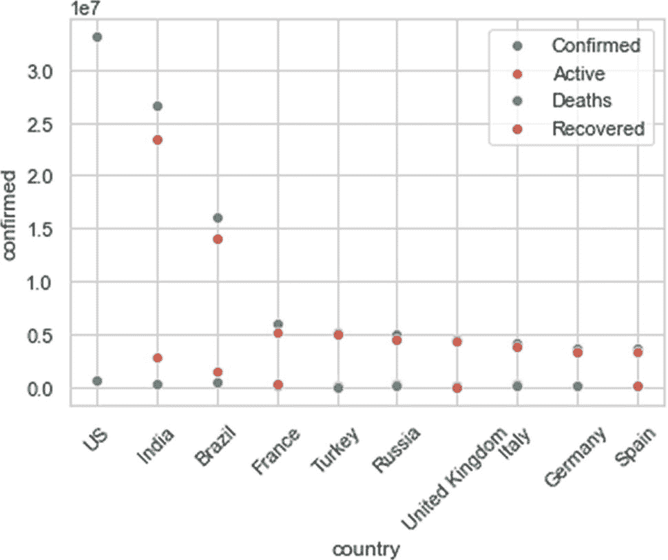

图 18-13

多行水平条形图

您甚至可以使用 Matplotlib 创建面积图，代码如下:

```py
df2.plot.area()
plt.legend(x, loc='best')
plt.xticks(rotation=45)
plt.show()

```

图 [18-14](#Fig14) 显示了输出。

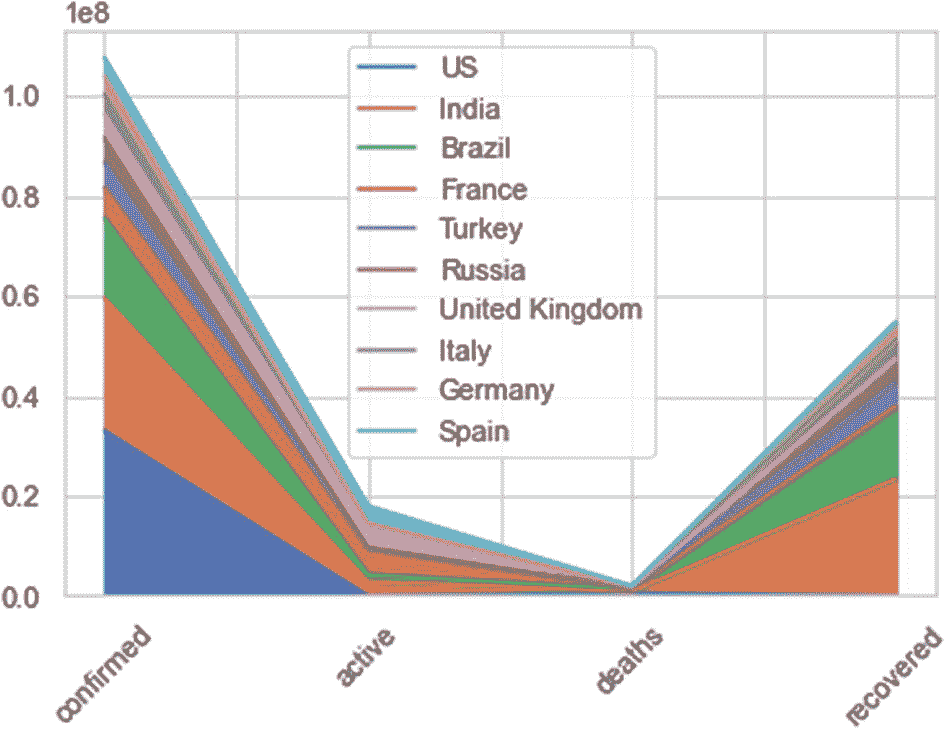

图 18-14

堆积面积图

您可以为数据创建未堆叠的透明面积图，如下所示:

```py
df2.plot.area(stacked=False)
plt.legend(x, loc='best')
plt.xticks(rotation=45)
plt.show()

```

图 [18-15](#Fig15) 显示了输出。

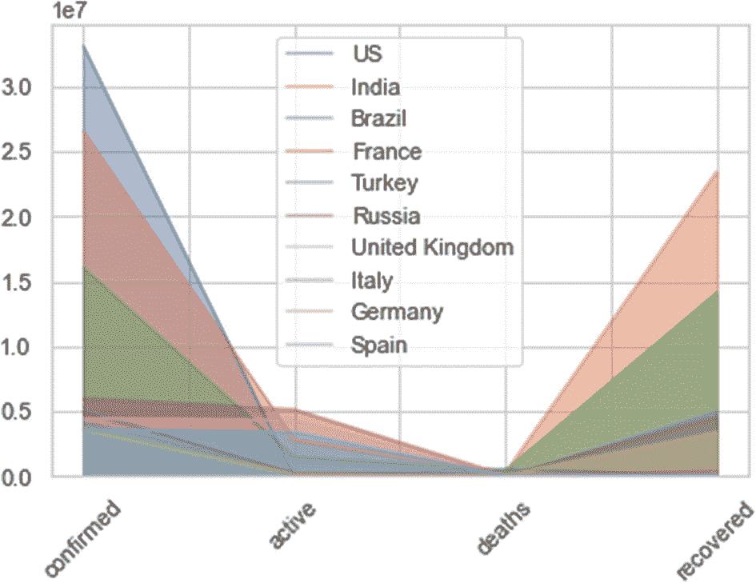

图 18-15

堆积面积图

您可以按如下方式创建饼图:

```py
plt.pie(y3, labels=x)
plt.title('Death Toll')
plt.show()

```

图 [18-16](#Fig16) 显示了输出。

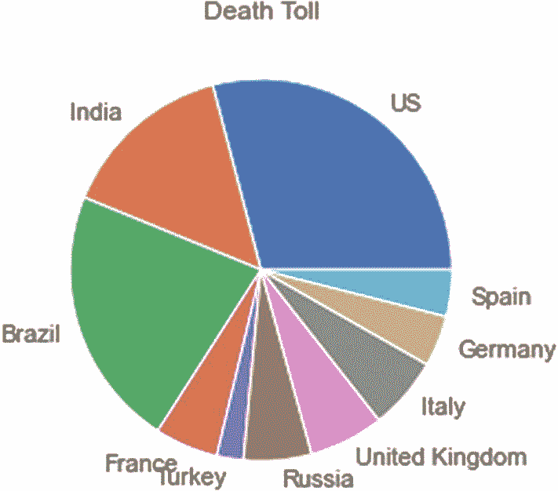

图 18-16

圆形分格统计图表

您也可以使用地毯图创建 KDE 图，但是对于我们在此示例中使用的数据，这可能没有太大意义。

```py
sns.set_theme(style="ticks")
sns.kdeplot(x=y1)
sns.rugplot(x=y1)
plt.show()

```

图 [18-17](#Fig17) 显示了输出。

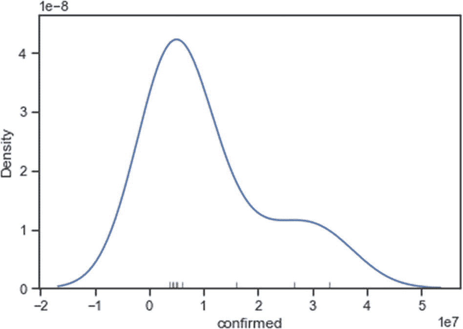

图 18-17

KDE 绘图

## 创建动物疾病数据的可视化

您也可以为其他真实数据集创建可视化效果。让我们为动物疾病数据创建可视化。让我们首先从一个在线知识库中阅读它。

```py
df = pd.read_csv("https://github.com/Kesterchia/Global-animal-diseases/blob/main/Data/Outbreak_240817.csv?raw=True")

```

让我们看看前五名的记录。

```py
df.head()

```

图 [18-18](#Fig18) 显示了输出。

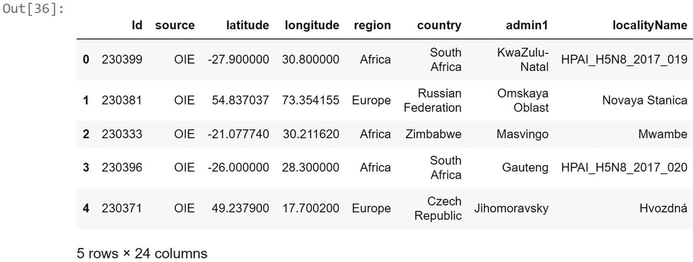

图 18-18

动物疾病数据

让我们按如下方式获取有关这些列的信息:

```py
df.info()

```

输出如下所示:

```py
<class 'pandas.core.frame.DataFrame'>
RangeIndex: 17008 entries, 0 to 17007
Data columns (total 24 columns):
 #   Column              Non-Null Count  Dtype
---  ------              --------------  -----
 0   Id                  17008 non-null  int64
 1   source              17008 non-null  object
 2   latitude            17008 non-null  float64
 3   longitude           17008 non-null  float64
 4   region              17008 non-null  object
 5   country             17008 non-null  object
 6   admin1              17008 non-null  object
 7   localityName        17008 non-null  object
 8   localityQuality     17008 non-null  object
 9   observationDate     16506 non-null  object
 10  reportingDate       17008 non-null  object
 11  status              17008 non-null  object
 12  disease             17008 non-null  object
 13  serotypes           10067 non-null  object
 14  speciesDescription  15360 non-null  object
 15  sumAtRisk           9757 non-null   float64
 16  sumCases            14535 non-null  float64
 17  sumDeaths           14168 non-null  float64
 18  sumDestroyed        13005 non-null  float64
 19  sumSlaughtered      12235 non-null  float64
 20  humansGenderDesc    360 non-null    object
 21  humansAge           1068 non-null   float64
 22  humansAffected      1417 non-null   float64
 23  humansDeaths        451 non-null    float64
dtypes: float64(10), int64(1), object(13)
memory usage: 3.1+ MB

```

让我们对列`country`执行“分组”操作，并计算所有案例的总和，如下所示:

```py
df2 = pd.DataFrame(df.groupby('country').sum('sumCases')['sumCases'])

```

现在我们来排序选出十大案例。

```py
df3 = df2.sort_values(by='sumCases', ascending = False).head(10)

```

让我们使用以下代码绘制一个条形图:

```py
df3.plot.bar()
plt.xticks(rotation=90)
plt.show()

```

图 [18-19](#Fig19) 显示了输出。

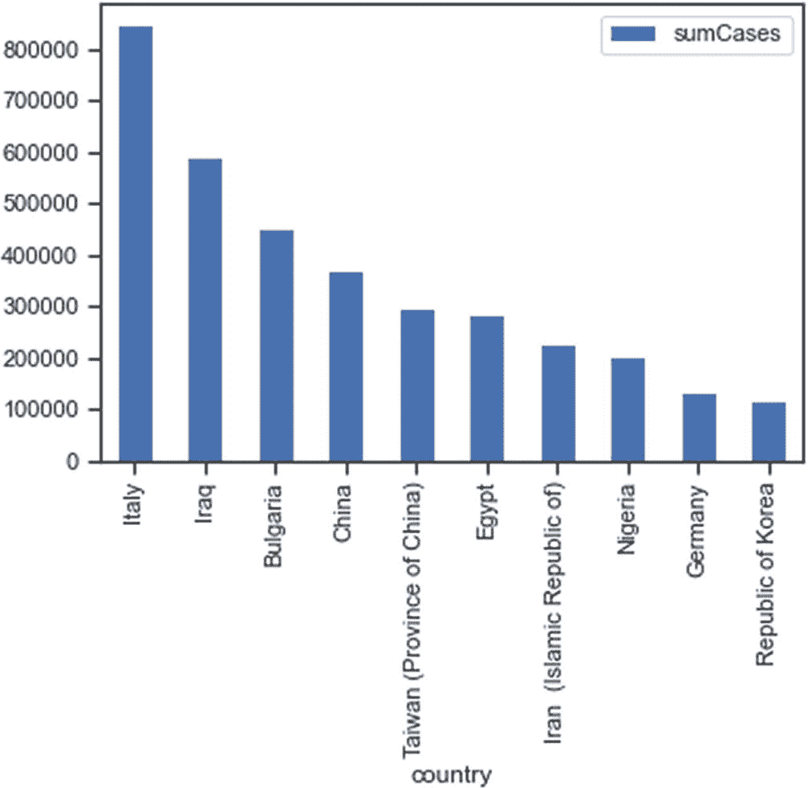

图 18-19

条形图

您可以将索引转换为列，如下所示:

```py
df3.reset_index(level=0, inplace=True)
df3

```

输出如下所示:

```py
      country                      sumCases
0     Italy                        846756.0
1     Iraq                         590049.0
2     Bulgaria                     453353.0
3     China                        370357.0
4     Taiwan (Province of China)   296268.0
5     Egypt                        284449.0
6     Iran (Islamic Republic of)   225798.0
7     Nigeria                      203688.0
8     Germany                      133425.0
9     Republic of Korea            117018.0

```

我们做一个饼状图如下:

```py
plt.pie(df3['sumCases'],
        labels=df3['country'])
plt.title('Death Toll')
plt.show()

```

图 [18-20](#Fig20) 显示了输出。

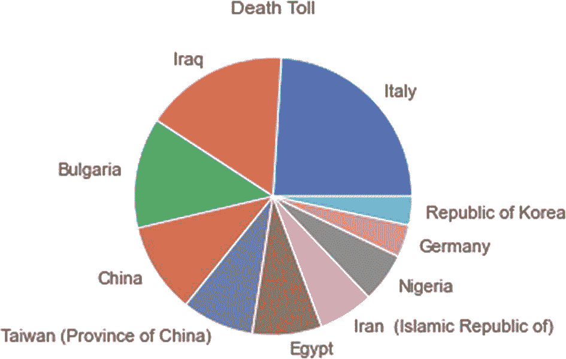

图 18-20

圆形分格统计图表

您可以使用 Seaborn 创建更加美观的条形图，如下所示:

```py
sns.barplot(x='country',
            y='sumCases',
            data=df3)
plt.xticks(rotation=90)
plt.show()

```

图 [18-21](#Fig21) 显示了输出。

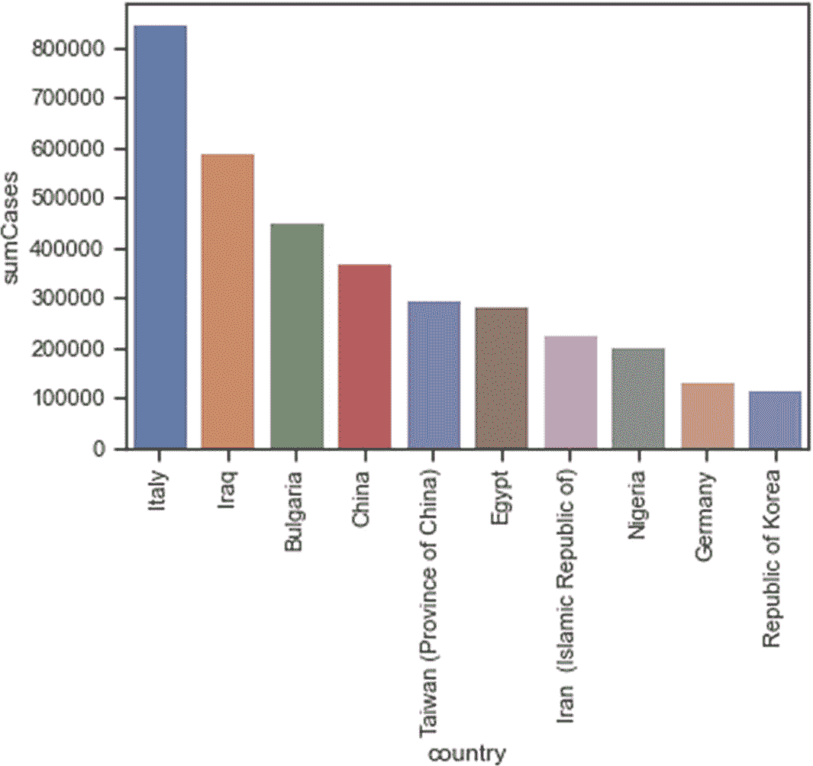

图 18-21

带 Seaborn 的条形图

您刚刚学会了可视化现实生活中的动物疾病数据。

## 摘要

在本章中，您探索了 Seaborn 数据可视化库的更多功能，它是科学 Python 生态系统的一部分。您还学习了如何将真实数据导入 Jupyter 笔记本。您使用了 Matplotlib 和 Seaborn 库来可视化数据。

如你所知，这是本书的最后一章。虽然我们非常详细地探讨了 Matplotlib，但我们只是触及了大量知识和编程 API 的皮毛。现在，您已经掌握了自己进一步探索 Matplotlib 和其他数据可视化库的知识。Python 有许多科学数据的数据可视化库。示例包括 Plotly、Altair 和 Cartopy。掌握了数据可视化的基础知识，就可以愉快地继续深入数据科学和可视化的旅程了！