# 五、可视化数据

## 数据质量报告

当您查看了足够多的数据集后，您将开发一组您想要回答的关于数据的问题，以确定数据集有多好。下面的脚本组合起来形成了一个数据质量报告，我用它来评估我所处理的数据集。

```py
# import the data
import pandas as pd
Location = "datasets\gradedata.csv"
df = pd.read_csv(Location)
df.head()
df.mode().transpose()

Listing 5-1Load Dataset from CSV

```

```py
data_types = pd.DataFrame(df.dtypes,
        columns=['Data Type'])
data_types

Listing 5-2Finding Data Types of Each Column

```

```py
missing_data_counts = pd.DataFrame(df.isnull().sum(),
        columns=['Missing Values'])
missing_data_counts

Listing 5-3Counting Number of Missing Observations by Column

```

```py
present_data_counts = pd.DataFrame(df.count(),
        columns=['Present Values'])
present_data_counts

Listing 5-4Counting Number of Present Observations by Column

```

```py
unique_value_counts = pd.DataFrame(
        columns=['Unique Values'])
for v in list(df.columns.values):
        unique_value_counts.loc[v] = [df[v].nunique()]
unique_value_counts

Listing 5-5Counting Number of Unique Observations by Column

```

```py
minimum_values = pd.DataFrame(columns=[
        'Minimum Values'])
for v in list(df.columns.values):
        minimum_values.loc[v] = [df[v].min()]
minimum_values

Listing 5-6Finding the Minimum Value for Each Column

```

```py
maximum_values = pd.DataFrame(
        columns=['Maximum Values'])
for v in list(df.columns.values):
        maximum_values.loc[v] = [df[v].max()]
maximum_values

Listing 5-7Finding the Maximum Value for Each Column

```

```py
pd.concat([present_data_counts,
        missing_data_counts,
        unique_value_counts,
        minimum_values,
        maximum_values],
        axis=1)

Listing 5-8Joining All the Computed Lists into 1 Report 

```

### 轮到你了

能否为`datasets/tamiami.csv`数据集创建数据质量报告？

## 绘制数据集:线形图

要创建一个简单的线图，输入清单 [5-9](#Par11) 中的代码。

```py
import pandas as pd
names = ['Bob','Jessica','Mary','John','Mel']
grades = [76,83,77,78,95]
GradeList = zip(names,grades)
df = pd.DataFrame(data = GradeList,
        columns=['Names', 'Grades'])
%matplotlib inline
df.plot()

Listing 5-9Line Plotting Your Dataset

```

当您运行它时，您应该会看到类似图 [5-1](#Fig1) 的图形。

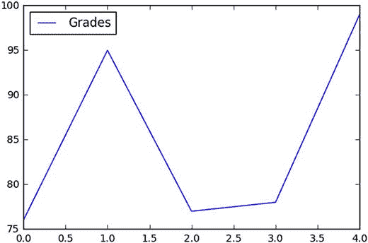

图 5-1

Simple Line Plot

定制图形很容易，但是您需要首先添加`matplotlib`库。

将清单 [5-10](#Par15) 中的代码添加到您已经做的代码中。

```py
import matplotlib.pyplot as plt
df.plot()
displayText = "my annotation"
xloc = 1
yloc = df['Grades'].max()
xtext = 8
ytext = 0
plt.annotate(displayText,
            xy=(xloc, yloc),
            xytext=(xtext,ytext),
            xycoords=('axes fraction', 'data'),
            textcoords='offset points')

Listing 5-10Code to Plot a Customized Graph

```

好的，`annotate`命令有很好的文档，位于 [`http://matplotlib.org/api/pyplot_api.html`](http://matplotlib.org/api/pyplot_api.html) 。但是让我们来看看我们输入的内容:

*   `displayText`:我们要为这个注释显示的文本
*   `xloc, yloc`:我们要标注的数据点的坐标
*   `xtext, ytext`:使用`textcoords`中指定的坐标系，我们希望文本出现的位置的坐标
*   `xycoords`:设置用于查找数据点的坐标系；它可以为 x 和 y 分别设置
*   `textcoords`:设置用于放置文本的坐标系

最后，我们可以添加一个箭头，将标注的数据点链接到文本标注(清单 [5-11](#Par23) )。

```py
df.plot()
displayText = "my annotation"
xloc = 1
yloc = df['Grades'].max()
xtext = 8
ytext = -150     
plt.annotate(displayText,
            xy=(xloc, yloc),
            arrowprops=dict(facecolor='black',
                        shrink=0.05),   
            xytext=(xtext,ytext),
            xycoords=('axes fraction', 'data'),
            textcoords='offset points')

Listing 5-11Code to Plot a Customized Graph

```

我们所做的只是调整文本的偏移量，以便在数据和注释之间有足够的空间来实际看到箭头。我们通过将`ytext`值从 0 更改为-150 来实现这一点。然后，我们添加了箭头的设置。

关于创建箭头的更多信息可以在 [`http://matplotlib.org/users/annotations_intro.html`](http://matplotlib.org/users/annotations_intro.html) 的`annotate`文档页面上找到。

### 轮到你了

以我们在这个例子中使用的相同数据集为例，向 Bob 的 76 添加一个注释“哇！”

## 绘制数据集:条形图

要创建条形图，输入清单 [5-12](#Par28) 中的代码。

```py
import matplotlib.pyplot as plt
import pandas as pd
names = ['Bob','Jessica','Mary','John','Mel']
status = ['Senior','Freshman','Sophomore','Senior',
        'Junior']
grades = [76,95,77,78,99]
GradeList = zip(names,grades)
df = pd.DataFrame(data = GradeList,
        columns=['Names', 'Grades'])
%matplotlib inline
df.plot(kind='bar')

Listing 5-12Bar Plotting Your Dataset

```

一旦您运行它，您将得到一个简单的条形图，但是 x 轴上的标题是数字 0–4。

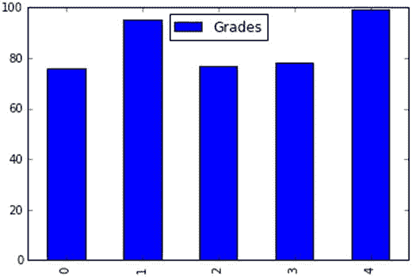

图 5-2

Simple Bar Plot

但是如果我们将`Names`列转换成索引，我们可以改进这个图。因此，首先，我们需要添加清单 [5-13](#Par31) 中的代码。

```py
df2 = df.set_index(df['Names'])
df2.plot(kind="bar")

Listing 5-13Adding Code to Plot Your Dataset

```

然后我们会得到一个类似图 [5-3](#Fig3) 的图。

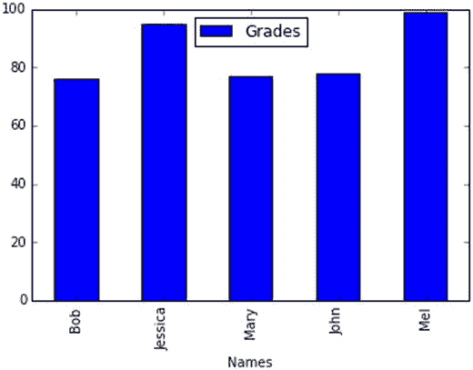

图 5-3

Bar Plot with Axis Titles

### 轮到你了

您能更改代码来创建一个状态为标签的条形图吗？

## 绘制数据集的图形:箱形图

要创建一个方框图，输入清单 [5-14](#Par35) 中的代码。

```py
import matplotlib.pyplot as plt
import pandas as pd
%matplotlib inline
names = ['Bob','Jessica','Mary','John','Mel']
grades = [76,95,77,78,99]
gender = ['Male','Female','Female','Male','Female']
status = ['Senior','Senior','Junior','Junior','Senior']
GradeList = zip(names,grades,gender)
df = pd.DataFrame(data = GradeList, columns=['Names', 'Grades', 'Gender'])
df.boxplot(column='Grades')

Listing 5-14Box Plotting Your Dataset

```

一旦你运行它，你会得到一个简单的方框图。

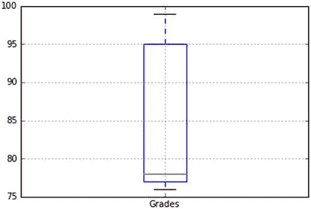

图 5-4

Simple Box Plot

现在，我们可以使用一个命令来创建分类图(在本例中，按性别分类)。见列表 [5-15](#Par38) 。

```py
df.boxplot(by='Gender', column="Grades")

Listing 5-15Adding Code to Categorize Your Box Plot

```

然后我们会得到一个类似图 [5-5](#Fig5) 的图。见清单 [5-16](#Par39) 。

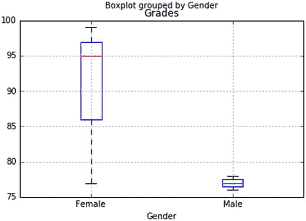

图 5-5

Categorized Box Plot .

清单 5-16。分类箱线图

最后，为了调整 y 轴，使其从 0 到 100，我们可以运行清单 [5-17](#Par42) 中的代码。

```py
axis1 = df.boxplot(by='Gender', column="Grades")
axis1.set_ylim(0,100)

Listing 5-17Adding Code to Adjust the Y-axis

```

它将产生一个类似于图 [5-6](#Fig6) 的图形。

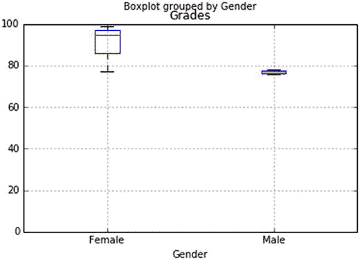

图 5-6

Box Plot Grouped by Gender

### 轮到你了

使用我们刚刚创建的数据集:

*   你能创建一个按学生身份分类的成绩方框图吗？
*   你能创建一个 y 轴从 50 到 110 的箱形图吗？

## 绘制数据集图表:直方图

由于直方图的性质，我们确实需要比我们正在处理的示例数据集中更多的数据。输入清单 [5-18](#Par48) 中的代码来导入更大的数据集。

```py
import matplotlib.pyplot as plt
import pandas as pd
%matplotlib inline
Location = "datasets/gradedata.csv"
df = pd.read_csv(Location)
df.head()

Listing 5-18Importing Dataset from CSV File

```

为了创建一个简单的直方图，我们可以简单地添加清单 [5-19](#Par50) 中的代码。

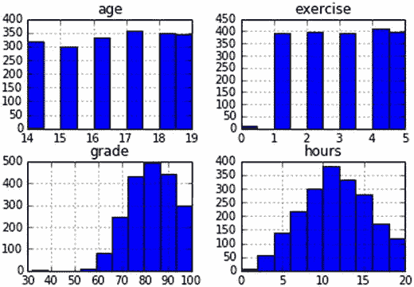

图 5-7

Simple Histogram

```py
df.hist()

Listing 5-19Creating a Histogram not Creating a Box Plot

```

因为`pandas`不确定您希望对哪一列的值进行计数，所以它给出了所有列的直方图和数值。

为了只查看几个小时的柱状图，我们可以将其指定为清单 [5-20](#Par53) 。

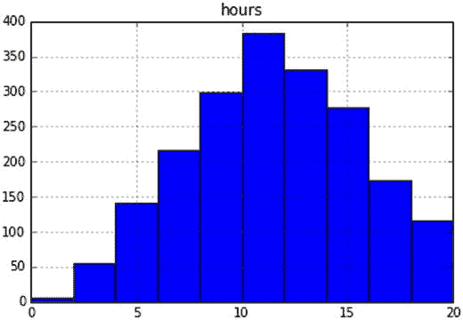

图 5-8

Single Column Histogram

```py
df.hist(column="hours")

Listing 5-20Creating Histogram for Single Column

```

为了查看按性别划分的时间直方图，我们可以使用清单 [5-21](#Par55) 。

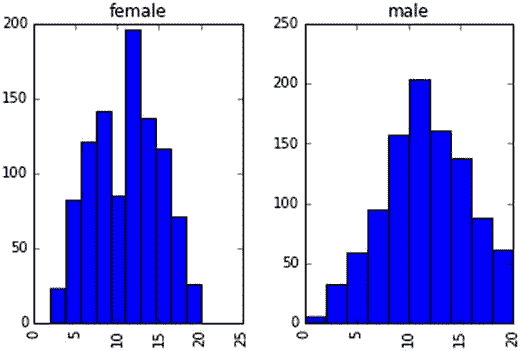

图 5-9

Categorized Histogram

```py
df.hist(column="hours", by="gender")

Listing 5-21Categorized Histogram

```

### 轮到你了

你能创建一个按性别分类的年龄直方图吗？

## 绘制数据集图表:饼图

要创建一个饼图，输入清单 [5-22](#Par58) 中的代码。

```py
import pandas as pd
import matplotlib.pyplot as plt
%matplotlib inline
names = ['Bob','Jessica','Mary','John','Mel']
absences = [3,0,1,0,8]
detentions = [2,1,0,0,1]
warnings = [2,1,5,1,2]
GradeList = zip(names,absences,detentions,warnings)
columns=['Names', 'Absences', 'Detentions','Warnings']
df = pd.DataFrame(data = GradeList, columns=columns)
df

Listing 5-22Pie Charting Your Dataset

```

这段代码创建了一个违反学生规则的数据集。接下来，在一个新的单元格中，我们将创建一个列来显示每个学生的违规或违规总数(列表 [5-23](#Par60) )。

```py
df['TotalDemerits'] = df['Absences'] +
        df['Detentions'] + df['Warnings']
df

Listing 5-23Creating New Column

```

最后，为了实际创建一个记过次数的饼图，我们可以运行清单 [5-24](#Par62) 中的代码。

```py
plt.pie(df['TotalDemerits'])

Listing 5-24Creating Pie Chart of Demerits

```

一旦你运行它，你会得到一个简单的饼状图(图 [5-10](#Fig10) )。

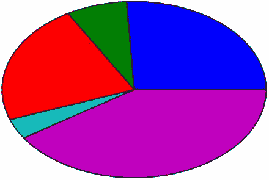

图 5-10

Simple Pie Chart

但是由于它有点简单(而且有点长)，让我们在一个新的单元格中尝试清单 [5-25](#Par67) 中的代码。

*   第 2 行:这将学生的名字作为标签添加到饼图中。
*   第 3 行:这是为第五个学生展开的饼图。你可以根据自己的喜好增加或减少数量。
*   第 4 行:这就是将饼图旋转到不同点的原因。
*   第 5 行:这是饼图上数字标签的格式。
*   第 7 行:这是迫使饼图呈圆形的原因。

```py
plt.pie(df['TotalDemerits'],
       labels=df['Names'],
       explode=(0,0,0,0,0.15),
       startangle=90,
       autopct='%1.1f%%',)
plt.axis('equal')
plt.show()

Listing 5-25Creating a Customized Pie Chart

```

你会看到一个类似图 [5-11](#Fig11) 的饼状图。

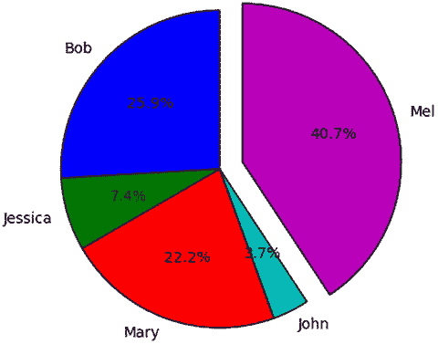

图 5-11

Customized Pie Chart

### 轮到你了

如果我们不突出最差的学生，而是突出最好的学生，会怎么样？让我们旋转图表并更改设置，以便突出显示 John 而不是 Mel。

## 绘制数据集:散点图

清单 [5-26](#Par78) 中的代码将允许我们生成一个简单的散点图。

*   第 4 行:指定数字应该内嵌显示
*   第 6 行:生成一个包含 200 个值的随机数据集
*   第 7 行:使用数据帧的索引作为 x，使用列`Col`的值作为 y，创建一个散点图

```py
import numpy as np
import pandas as pd
import matplotlib.pyplot as plt
%matplotlib inline
dataframe = pd.DataFrame({'Col':
        np.random.normal(size=200)})
plt.scatter(dataframe.index, dataframe['Col'])

Listing 5-26Creating a Scatter Plot

```

你应该得到一个类似图 [5-12](#Fig12) 的图。

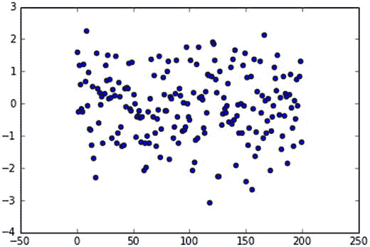

图 5-12

Simple Scatterplot

看我们的图，数据似乎没有任何模式。是随机的！

### 轮到你了

在`datasets/gradedata.csv`中创建小时和等级数据的散点图。你看到数据中的模式了吗？