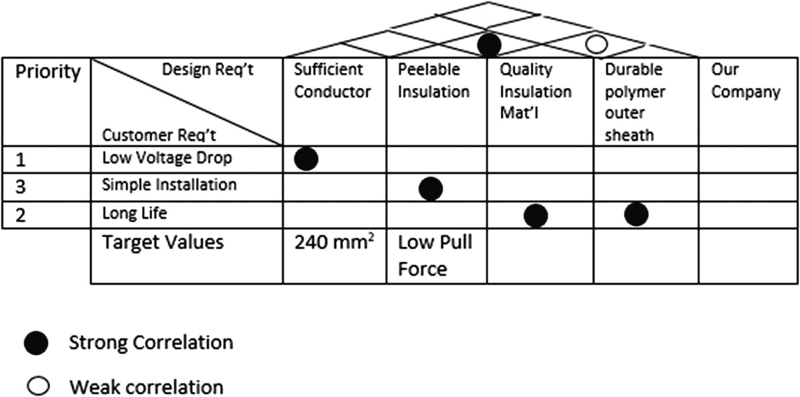
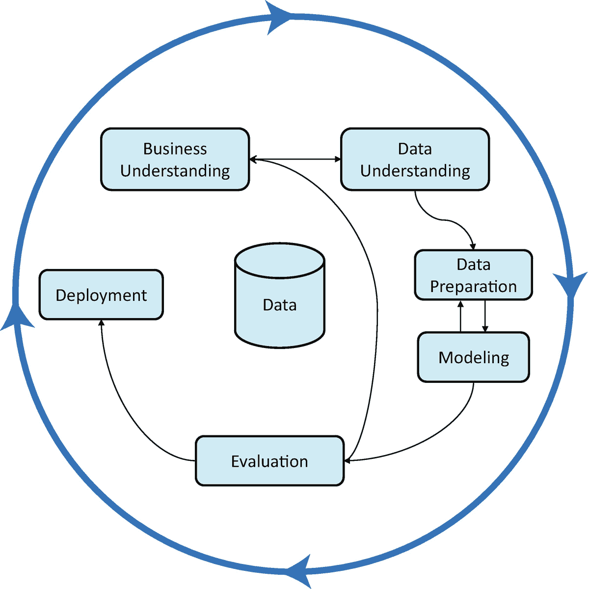

# 二、项目的数据科学战略

Meeting the Right Targets

在第 [1](1.html) 章中，我们讨论了数据科学团队的战略。然而，除非你为客户实现了某些目标，否则你无法从战略中获益。对于数据科学家来说，这通常意味着完成一个项目。团队的策略指导一些项目及其优先级，并且是项目策略的基础。然而，项目仍然需要它们自己的策略来恰当地定义它们的目标，以及可用的和允许的实现目标的方法。通过在每个项目的开始就确定这一点，你可以确保每个项目都实现了目标，更重要的是，你的工作得到了客户的充分认可。

## 项目管理

人们通常认为良好的项目管理对于项目的成功至关重要。你不能简单地开始一个项目，却不知道如何组织工作，以及如何估计完成项目和达到预期结果所需的时间和资源。

多年来，许多不同的过程被用来管理项目。这些过程都有一个共同点，那就是它们系统化了一种方法来决定做什么，估计做这件事需要多长时间，然后确保所做的是客户想要的。然而，它们在实现这些目标的手段上有所不同。

在最近的过去，许多软件公司和面向软件的公司(即，主要产品不是软件，但软件对产品的交付至关重要的公司)已经采用敏捷作为关键的项目管理方法。敏捷通常与正式的“瀑布”方法相反，在正式的“瀑布”方法中，需求是在项目的早期定义的，然后对需求的更改是困难的。

瀑布方法是为复杂的土木工程和建筑项目开创的，在这些项目中，最终期望的结果严重依赖于早期阶段，并且变更非常昂贵。例如，考虑建筑物的平面图如何确定所需的地基；一旦基础被浇注，回去做改变将是非常困难和昂贵的，因此，改变平面图只作出不需要不同的基础。

随着敏捷的兴起，有时使用敏捷原则似乎使得瀑布项目中使用的框架变得多余。然而，在不考虑其他人的信息和优势的情况下，不小心或天真地实施任何特定的项目管理框架，会有将婴儿连同洗澡水一起扔掉的风险。

精益软件开发 [1](#Fn1) 的先驱玛丽和托马斯·波彭迪克打破了两个神话，他们结合起来说明了这一点。第一个是“早期规范减少浪费”，第二个是“规划就是承诺”

这些神话是来自传统项目管理的想法，它经常被用来促进早期指定和创建一个致力于。如果你需要在设备交付前 6 个月开始挖掘地基，这些都是很重要的事情。

然而，制定计划和决定规格的工具仍然可以使用，同时保持计划可以改变的态度。早期的规范不一定是手铐，它可以只是你研究的结果。

因此，通过接受计划不是承诺，我们可以使用来自传统项目管理方法的最好的工具，尽可能多的具有适合我们情况的敏捷思维。

在接下来的材料中，我们借用了瀑布项目管理的材料，例如建议创建文档和建议尽早与客户交谈，我们并不要求对早期发现做出承诺，只是观察到在整个项目生命周期中与客户接触的机会可能不会顺利到来，所以在它们出现的时候使用它们。

许多传统项目管理实践的一个重要特征是强调正式的开始和结束程序，以确保遵循正确的路径，这是一种强调风险和质量管理的方法。

在传统的方法中，例如项目管理知识体系(PMBOK) [2](#Fn2) 和受控环境中的项目(prince 2)[3](#Fn3)这项工作提前进行，并产生一组记录发现结果的文档。这种方法的缺点是僵化的项目经理会把这些文档当作紧身衣，拒绝允许它们在面对变化的环境或新信息时被修改。

好处是目标从一开始就很明确。同时，没有必要停止敏捷——简单地采用其他方法中的精华，从中学习，并将其应用到您自己的情况中。事实上，混合方法的想法在今天越来越流行。事实上，PMBOK 和 Prince2 都开发了如何在保持敏捷的同时使用这些方法的指南。 [4](#Fn4)

正如我们接下来将看到的，选择正确的目标并正确定义它是一项艰巨的任务。情况不佳时也可能很贵。在这种情况下，从尽可能多的领域吸取经验教训以避免这种支出是有意义的。

最终，只要做得正确，尽可能深入地了解客户与敏捷原则没有任何冲突。面对变化的需求时的僵化更多地源于人为缺陷，而不是有缺陷的过程，并且不是放弃过程的理由。

## 定义目标

从许多方面来说，一般来说，数据科学最困难的方面，也是任何项目最困难的方面，是选择正确的目标。就数据科学而言，作为一门数学学科，或者至少是一门由计算机科学和统计学等领域的背景使他们更喜欢从定量的角度看待问题的学科，从业者需要具有数字定义的目标。

相比之下，在构建相关业务问题的背景下，定性观点在初始阶段可能更有帮助。首先，了解客户想要什么样的答案是很重要的。例如，他们会用你的工作作为决策支持，在一些可供选择的行动方案中进行选择吗？

相反，他们自己会以定量的方式使用结果吗？例如，确定要分配的资源数量或持有的库存水平？

在许多情况下，模型的输出并不是最终的行动——它只是以某种方式促成了最终的行动。实际的最终行动是模型的实现或基于模型输出的决策。例如，虽然回归模型的输出是一组用于定义方程的系数，并且将该方程应用于新输入的输出是一列数值，但真正的输出是作为理解这些值的结果而做出的决策。

举一个更具体的例子，正确地估计做一件事所花费的人-小时可能是一个模型的显而易见的选择，但它可能不是最终的目标。目标可能真的是估计经过的时间(我什么时候能有？)或劳动力资源(我应该分配多少人？).因此，选择正确的因变量进行建模可能不是显而易见的，可能还有另一个变量，更容易建模，也更适合客户的需求。

硬币的另一面是理解客户为什么需要数据科学解决方案。他们想要比目前更高精度的预测吗？或者，他们会满意同样的精度，但希望利用计算速度和能力来实现更快的周转时间？

最后一个问题应该是有效的数据科学家方法的关键，因为显然花一两个小时确保您正确理解客户的目标比花 10 个小时优化服务于不同目标的模型更有用。

## 犯错的代价

部分由于数据科学是一个相对较新的活动，与其他学科相比，很少有数据科学出错的代价的例子。然而，在软件工程的重叠环境中已经分析了失败的成本。其中一些被代码完成 2 、、[、](#Fn5)、T5】掩盖了，尽管这本书的重点是软件构建，但它本身却是决心避免浪费时间的数据工作者的绝佳资源。

《Code Complete 2*的作者 McConnell 结合了一系列论文的结果，给出了在软件项目的不同阶段修复缺陷所用时间的潜在范围——毫不奇怪，在需求阶段之后修复需求中的错误会随着项目的进展而迅速爆发，直到修复发布后的需求错误估计是在需求过程中修复它所花费时间的 10-100 倍。*

霍华德·雷法(Howard Raiffa)[6](#Fn6)更多地来自统计领域，他称解决错误的问题恰恰是第三类错误(类似于统计学导论课上常见的第一类和第二类错误)。Mitroff 和 Silvers 收集了许多这种错误的例子(并将这些错误分为有意的和无意的，尽管我们主要对无意的感兴趣)。虽然他们的许多示例问题太复杂，无法在这里复述，但下面给出了一个例子。

*   一座大型高层办公楼的经理接到越来越多的投诉，抱怨电梯服务质量差。她决定请一位顾问来给她建议如何解决这个问题……[顾问们建议昂贵的工程解决方案]……幸运的是，酒店的一位房客是心理学家。 [7](#Fn7)

心理学家在电梯工程师失败的地方取得了成功，他意识到人们抱怨电梯的主要原因是他们感到无聊。她在电梯附近安装了镜子，让电梯使用者开心，这个问题就消失了(作者指出，如果他们几年后发明了这个问题，它可能是电视屏幕，而不是镜子)。

这个故事的寓意是，解决正确的问题至关重要。问题从来都不是电梯走得太慢，而是电梯的使用者在等电梯的时候无事可做。

工程师犯的错误是试图加快电梯速度，而不是缓解电梯用户的无聊，这是第三类错误的一个例子——用精确的解决方案解决错误的问题。在数据科学中，如果你用错误的目标创建一个高度精确的模型，这很容易发生。

更不可思议的是，可能有多个“正确的”目标和多种方法来为它们建立精确的模型。多个权利目标可能在它们需要的数据和对该数据建模所需的工具方面有所不同。因此，数据科学家能够识别提供最易处理的解决方案的正确目标，这是一个巨大的优势。有时，您不需要更好的数据准备工具，而是需要一种看待问题的不同方式，用一种不那么繁重的数据挑战来重新构建它。

建立精确模型的多种方法也可以在很大程度上决定向客户提供什么样的解决方案。例如，许多人已经观察到，为赢得 Kaggle 竞赛而制作的超精确模型与行业中常见的精简模型非常不同，特别是因为用于实现赢得竞赛的最后 0.1%精确度的过程通常计算量太大，无法在合理的时间框架内为客户提供答案。

大多数数据科学专业人士认识到，赢得 Kaggle 竞赛的大量高级神经网络和梯度推进机器不适合大多数现实世界客户的需求。

更微妙的地方是存在多个可行的模型，而对客户偏好的不了解意味着可能会选择一个在客户眼中实际上并不是最优的模型。这是项目风险的一个例子，因为它是一个威胁项目预期成功的风险，但它不是最常讨论的项目风险之一。

### 项目风险和意外后果

项目风险通常是从项目完成的风险角度来定义和检查的。也就是说，根据我的经验，典型的项目风险讨论将集中在按时或正确完成项目的危险上。例如，我们将在本章的后面讨论 CRISP-DM 数据挖掘方法——它从“可能延迟项目或导致项目失败”的角度来描述风险 [8](#Fn8)

当考虑以非常强的定义开始的项目时，这种定义是很自然的，例如，土木工程项目，其中项目团队的组成是按照规定的蓝图建造结构。然而，在数据科学中，事实上在许多软件工程环境中，目标要模糊得多。

一种更隐蔽的项目风险类似于第三类错误——项目按时正确完成，但没有给客户带来预期的好处。比这更糟糕的情况是项目完全成功，然后无意中引起问题。这可能是第四类错误，尽管米特洛夫和西尔维斯已经提出了第四类错误的定义。

由于意外后果而产生不利结果的可能性是机器学习系统安全性的一个方面。这是机器学习中的一个新的考虑因素，但在不久的将来可能会受到越来越多的关注。

最近的一个例子说明了意外后果的危害。一名澳大利亚妇女给参与定向广告的科技公司写了一封公开信，此前她生下一名死产婴儿后，她的社交媒体被婴儿相关广告淹没。在她的公开信中，她提出了这样一个问题:“如果(目标营销人员)能确定她怀孕了，他们不能确定她曾经流产吗？”

凭直觉，营销人员能够识别出最近流产过的妇女(他们甚至可能向她们推销咨询服务)，但没有识别出她们的需求。虽然只能推测营销人员做了什么或没做什么，但没有刻意考虑错误放置的广告何时会产生负面后果是他们没有发现这一潜在问题的合理原因。

### 大数据—大风险？

大数据的趋势提供了另一个领域，在这个领域，关注正在解决的问题至关重要。虽然大数据确实可以提供较小数据集无法提供的解决方案，但人们也越来越认识到，较大的数据集也会带来更大的风险。特别是，具有许多可能的输入变量的数据集带来了将输入变量错误地识别为重要变量的特别高的风险。

因此，如果有一种回答客户需求的方法(找到更多的客户，更好地识别风险，等等。)在不使用越来越大的数据集来获得结果的情况下，这通常会是一个更好的结果，而且这还没有考虑到计算和编码时间方面的额外工作，这通常与大数据相比更适中的数据相关。

最后，大数据的最大问题是，它鼓励人们关注数据庞大的事实，而忽略了对客户问题的清晰理解。正如我们讨论过的并将进一步重申的，对客户问题的清晰理解应该始终是任何真正尝试提供价值的数据科学家的核心关注点。

## 定义目标

有许多方法可以最大限度地了解客户的真正需求。我们将回顾它们中的三个，并讨论它们在相关环境中通常是如何应用的。

这些方法中的每一种都有一个共同点，它们的存在都是为了扩大讨论，从如果允许默认，人们会自动做什么，到通过反射解决问题——人类的本性是尽快提出解决方案，而不会放慢速度来发现真正的问题，或者至少不会检查以确保真正的问题已经被识别。

因此，这些方法中的每一种都和其他方法一样存在，迫使人们在解决问题的过程中放慢速度，加快速度。

六适马 [11](#Fn11) 工艺最初是为在制造环境中使用而开发的。然而，在取得成功之后，特别是在通用电气公司，它最初是一家制造公司，但后来扩展到包括金融在内的其他领域，它开始被用于更广泛的应用。

六适马方法是阶段门控的，最初版本中的阶段通过助记符“DMAIC”被记住——定义、测量、分析、改进和控制。

解决问题的六适马方法成功的基础是在最初的“定义”阶段不遗余力地了解客户的声音。然后，这被转化为一个可衡量的目标，这是六适马团队的重点。这种方法有两个重要的结果。

首先，它确保项目的主题真正与最终用户相关。其次，它确保人们保持对可衡量目标是客户感兴趣的实际事物还是代理的理解，如果是后者，确保代理和客户关注的关系是透明的。

那么，我们如何正确地确定我们的客户真正想要的是什么呢？冷酷的现实是，他们往往无法告诉我们，尽管这并不意味着他们实际上不知道。

尽管六适马的开发环境与一些数据科学项目中的环境不同，但我们仍然可以从这种方法中获益良多。这一点尤其重要，因为可以说六适马最大的成就是采用了预先存在的质量保证工具，并将它们与理解质量项目真正目标的严格方法结合起来。

这种联系使六个适马用户能够确保他们能够向他们组织的其他人解释他们的成功——这是现代大多数公司的一个重要考虑因素，在现代，如果管理层看不到你增加价值，你可能很快就会被赶出公司。

六适马方法的第一个显著特征是定义阶段——设定目标和定义成功的地方——被认为是任何项目的真正基础。与此同时，并没有假设客户或委托人能够用容易帮助他们开发这类项目所需的明确目标的术语来表达他们的需求。相反，使用各种工具将客户知道的他们想要或需要的东西转化为更实际的东西，这本身有助于具体和可实现的目标设置。

通常在六适马环境中使用的工具旨在帮助实践者聚焦于对最终结果影响最大的问题部分，或者换句话说，具有最佳努力效益比的问题领域。

在这本书里，我们的目的不是给六个适马设计工具一个全面的或任何指导。我们将只看一个来展示这种哲学。我们还注意到，一般来说，六个适马声称的工具和技术并不是为六个适马项目而发明的——它们通常已经存在，并在广泛使用后的某个时间被确定为符合哲学，即使被推荐为六个适马工具使它们的使用更加广泛。

## 顾客的声音

解决问题的六适马方法成功的基础是目标是由客户的声音定义的。只有了解客户的声音，你才能找到一个目标，并将其转化为一个可衡量的目标，这成为六适马项目的重点。因此，定义阶段的很大一部分致力于了解客户的声音，而了解客户的声音被认为是定义项目的第一步。这种方法有两个重要的结果。

首先，它确保项目的主题真正与最终用户相关。其次，它确保人们保持对可衡量目标是客户感兴趣的实际事物还是代理的理解，如果是后者，确保代理和客户关注的联系方式是透明的。

那么，我们如何正确地确定我们的客户真正想要的是什么呢？冷酷的现实是，他们往往无法告诉我们，尽管这并不意味着他们实际上不知道。

在理想的世界中，我们可能想要使用六个适马从业者使用的工具，或者非常类似的东西。然而，我们处于劣势，因为六个适马从业者能够训练他们的(通常是内部的)客户期待某些工具，不幸的是，人们越来越期望数据科学家会进入，制作和实现一些模型，然后离开，留下轻松的利润。然而，这并不意味着我们不能从六个适马模型中的一些背后的思想中学习。

通常在六适马环境中使用的工具旨在帮助实践者专注于对最终结果影响最大的问题部分，或者换句话说，问题的某个领域，在该领域中，解决问题的容易程度与解决问题的益处之比提供了最有利的结果。

在这本书里，我们的目的不是给六个适马设计工具一个全面的甚至任何的指导。我们将只看一个来展示这一原理，以及它在实践中是如何工作的。和往常一样，也和本章介绍的其他工具一样，工具的正确选择取决于具体情况。

从理解顾客需求的角度来看，尤其是在更大的背景下，与六适马相关的最有力的工具之一是质量功能展开(QFD)。

质量功能展开起源于 20 世纪 60 年代的日本，后来由于在汽车行业的成功而流行起来。质量功能展开流程利用一个名为质量屋的图形来识别客户需求并记录其重要性，如图 [2-1](#Fig1) 所示。该图已被简化为一些更复杂的真实版本，以显示设计输入之间的相关性以及设计输入和客户要求之间的相关性是如何可见的。

图 2-1。

一个简单的质量屋图，通常用于质量功能展开。请注意，该图显示了设计要求本身以及设计要求和客户要求之间的相互关系。

六适马还采用了七个管理和规划工具，这是二战后日本的全面质量控制方法普及。 [12](#Fn12)

QFD 是一种允许用户运用系统思维和心理学来解决问题的方法，这意味着他们可以正确理解客户在哪里看到价值。它涵盖了“说出来的”和“没说出来的”需求，以避免开发一个完全符合客户要求的产品，而不是客户想要的产品。

关键信息很简单，顾客看重的不一定是我们认为她看重的。这也不总是客户最初参与时抱怨的第一件事。发现客户的真正动机可能很困难。

然而，由于这样做对于选择正确的目标至关重要，使用可用的工具来揭示用户的潜在动机应该是数据科学家过程中的一个重要部分。质量功能展开是在更广泛的商业环境中成功理解客户关注点的工具的一个重要例子。

## CRISP-DM

“六适马”和“DMAIC 进程”在开发时并没有考虑到数据科学或数据挖掘。尽管我们建议至少考虑使用六适马的一些工具来确定客户的需求，但六适马流程不适合数据科学项目的一个重要原因是它是线性的。

CRISP-DM [13](#Fn13) 很明显，这种方式的适用程度取决于用户希望如何向你展示自己；当决定一个特定项目的总体策略时，重要的是要考虑用户准备好接受提问的程度。

CRISP-DM 的迭代性质——它与敏捷哲学的共同点——使它成为思考数据科学项目的好方法。另一方面，由于它缺少其他方法中的一些客户焦点、项目管理和收尾元素，这些可能需要从另一种方法中借鉴。

CRISP-DM 循环可以在图 [2-2](#Fig2) 中看到。通过使用在后续周期收集的信息，使用 CRISP-DM 周期的数据科学家可以提高他们的第一次猜测。特别是，在数据发现的初始阶段之后，有一个特定的条款可以让客户进行进一步的讨论。

每个阶段被细分成更小的区域， [14](#Fn14) ，其中包含要考虑的重要领域的清单。例如，业务理解阶段是最符合本章的阶段，具有理解业务目标的明确目标，以及数据挖掘项目的成功标准。

然后在项目的后续阶段中引用这些内容。例如，在评估阶段，根据最初的成功标准进行评估，这是可以预料的。

然而，CRISP-DM 不仅仅是六个适马，而是非处方性的，因此没有给出关于哪些工具可以帮助实现期望的业务理解的具体指导。

图 2-2。

CRISP-DM 循环

## 与用户感同身受

六位适马从业者所采用的方法在很大程度上是一种工程方法。关键策略是定义一个有经济回报的具体问题。这适用于通常的六适马环境，在这种环境中，问题通常与劣质结果的特定成本相关，例如，需要返工或报废。

然而，对于可以通过数据科学抓住的每一个机会来说，这可能不是最好的方法。当机会与特定的低质量结果没有紧密联系时，设计思维方法可能是一个可行的替代方法。

在典型的设计思维生命周期中，开发人员在产生代表可能的解决方案的想法之前，与用户建立共鸣。这种方法允许实践者更好地理解客户的潜在或真正的问题，而不是他们可能提出的表面问题。

与用户感同身受的过程允许产生各种可能的解决方案，有可能产生一些非常天马行空的想法。我们在本章前面看到的米特洛夫和西尔维斯的电梯例子事实上完美地说明了这一点——心理学家考虑的是电梯使用者实际上想要什么，而不是她通常解决的那种问题。因此，她能够在技术解决方案不成功的地方提出成功的解决方案。

描述设计思维过程有许多不同的方式。其中之一是斯坦福过程，它使用五个阶段的过程来描述确保解决正确问题所需的步骤。 [十五](#Fn15)

1.  **移情:**从你的用户那里收集信息。

2.  **定义:**将用户信息转化为洞察。

3.  **Ideate:** 基于洞察力产生想法。

4.  原型:为你的想法建立一个版本。

5.  **测试:**验证你的想法。

尽管这些阶段是按顺序编写的，但这并不意味着它们需要按严格的顺序执行——迭代是可能的，也是可取的。

在我们的背景下，初始阶段尤其重要。与用户感同身受意味着停止强加你自己的想法，抛开你自己对这个问题在客户或用户看来是什么样子的假设。这正是心理学家在电梯问题中所做的。她问自己，“作为一名电梯用户，电梯到达的时间对我有什么影响？”

通过与用户共情，你将能够理解他们面临的实际问题，而不是你自己对世界的假设让你强加给客户的问题。

### 不要浪费一秒钟

和客户在一起的时间很宝贵。模仿其他行业的专家——医生、律师、管理顾问——运用最好的面试技巧，确保你在与客户相处的短暂时间里收获最多。如果你的客户是内部的，你有更多的时间，但是仍然很容易浪费时间，因此不能得到最好的结果——而且时间也不是无限的。

问题的一部分是说同一种语言。没有理由假设其他领域的专家精通机器学习、统计技术和行话。第二个困难的方面是如何在你的模型或其他数据分析中表现出自信，而不表现出傲慢。

即使不谦逊，至少也要表现出你不会把自己凌驾于你试图帮助的人之上，这样才能阻止他们拒绝你。如果你记得他们所拥有的关于他们问题本质的信息同样有用，但更难获得(世界上有很多数据科学家，但只有少数人像他们一样理解你客户的问题，他们可能都在同一个工作场所)应该很容易保持脚踏实地。

了解客户的统计或数据分析知识也很重要。当你的客户已经非常清楚中位数是多少时，向他们解释每一个基本的统计学术语肯定会让他们越位，就像用深奥的球形分布族的讨论来迷惑他们一样。

一般来说，你的听众很有可能已经获得了商业学位。他们很可能了解描述性统计的基础知识。像标准差这样的概念可能是模糊的或被遗忘的，但它们可能并不完全新颖。

不想成为该领域专家的人相对很少遇到机器学习算法及其术语，最明显的例子是数据科学家。

仔细考虑您是否需要告诉观众您的模型可能基于随机森林。在建立任何模型之前，不应该有任何必要进入那种细节——对于任何模型，用来建立它的算法是它最不重要的属性之一。如果你开始偏离主题，向不打算建立自己模型的客户解释特定算法的工作原理，你将耗尽他们向你解释业务的时间。让我们面对现实吧——他们几乎不可能有足够的时间向你解释清楚。

### 注意

在设计思维环境中经常听到的一个口号是避免解决方案。解决方案是指某人与用户或其他本地专家进行会议，旨在确定问题，并开始提出解决方案。这样做对会议来说可能是致命的，因为本地专家将停止解释他们的问题，要么关闭，要么提供他们自己的解决方案。

更好的是，在你报告了你已经建立的模型之后，再讨论可能的模型的细节。最终，你卖的不是一个随机的森林或一个神经网络，你卖的是降低他们的风险暴露，或者降低他们的一些成本的方法。除了需要确信您真的能做到之外，客户对如何做到并不感兴趣。

简而言之，与你的客户或用户的发现会议是一个很好的时机来记住这句格言“你有两只耳朵和一张嘴:按比例使用它们”，然后更少说话。人们经常想用自己的话来填补沉默——利用这一点。仔细想想什么时候需要引导谈话，往什么方向引导。

与客户的交谈几乎总能让他们对真正重要的东西有新的看法。有时候你需要做的就是坐在房间里听。其他时候，你需要把顾客哄到正确的心态，告诉你他们真正需要的是什么。

## 数据科学和棘手的问题

“棘手问题”有多种定义，但在提交给数据科学家的问题中，可以看到的一个特征是缺乏明确的表述。

如果您尝试应用传统的数据科学工具，棘手的问题可能是难以处理的(一些被认为是棘手的问题已经使用高级形式的决策理论至少部分地解决了，但这远远超出了我们的范围)。这并不意味着数据科学工具不能用来间接解决这些问题的至少某些方面。

然而，这确实意味着，当你被要求尽早解决一个棘手的问题时，识别这一点非常重要。一旦你知道这就是你正在处理的事情，你就可以决定一个适当的行动方案。两个主要的可能途径是传递问题，或者把问题重组为一个驯服的问题。

一个棘手问题的重要标志包括你与之交谈的客户未能就问题达成共识。试图确定问题的起点和终点可能是徒劳的。该问题可能是另一个问题的症状或原因。通过这种方式，这个问题改变了它的形状，从而挫败了给它划定界限的企图。这种变形使得任何模型或算法的使用都非常成问题。

如前所述，解决问题的一个重要部分是正确定义它。棘手问题的一个共同特征是它们不符合简单的定义。然而，事先决定立场有时会迫使问题进入可解决的状态。

通过以一种可接受的方式重新构想问题，它会变得容易处理。作为数据科学家，他们更倾向于数字解决方案或涉及自动化的解决方案。

事实上，假设有正确的输入，有一系列的问题重构方法被设计来帮助将棘手的问题转化为容易解决的问题。

Mitroff 在一篇论文中介绍了战略假设的提出和测试(关于前面提到的电梯问题)。这种方法的目标是理解支配问题的潜在假设。这是一个分五步进行的小组活动。

战略假设的提出和测试只是重新定义问题，使棘手的问题变得容易处理的一系列方法之一。现在至少有几种方法有相当长的跟踪记录来重组问题。虽然它们有一些共同的元素，例如通常最初被设想为一个小组活动(尽管它们经常被修改以供个人使用)，但是方法之间的差异意味着你可以为你的特定环境选择正确的方法，并且有时可以用另一种方法的思想来修改一种方法。

如果问题被设定为一个棘手的问题，那么在项目开始时理解正确的目标可能会被蒙上阴影，并且可能看起来难以解决。然而，由于任何问题的形式通常由许多假设决定——有些很容易识别，有些不太容易识别——所以经常有机会以一种屈服于可用工具的方式来重述问题。

仔细的应用问题结构化方法通常会让你将不适定的问题转化为适定的问题，并在其他人未能获得牵引力的地方取得成功。

## 记录项目的目标

正如团队目标一样，项目的目标很容易被遗忘或误解。对正确信息的强有力的文档记录确保您不会因为对您已经发现的内容的简单误解而交付给错误的目标，从而在最后的障碍中失败。

除了定义您正在建模的目标之外，还有多个维度可能对用户很重要。明显的例子包括理解模型结果的容易程度、返回结果的速度以及实现解决方案的速度。记录这些方面也是有帮助的。

记录项目可用的数据源以及结果将被交付到的平台，以定义最终的格式也是有帮助的。

单独来看，这些信息可能看起来很琐碎，但是错过其中的一些至少会浪费时间，如果不是导致项目不能满足客户的期望。

不幸的是，文档的概念已经与传统的瀑布式项目管理范例产生了联系，并且给一个权力饥渴的项目经理一个他或她可以用来击败其他不幸的人的钝器的风险。正如在别处提到的，这种风险是由人的个性引起的，而不是由工具或过程本身引起的。用正式的需求文档打击你的项目经理更有能力开发敏捷仪式，浪费每个人的时间，把公司锁在无意义的闹剧中。

记住文档不必是正式的也是值得的。制定全面的计划是很好的，它将每一次头脑风暴浓缩成他们的基本智慧，但这也非常耗时。

幸运的是，我们生活在这样一个时代，文档不需要在活页夹中正式打印会议记录，没有人会阅读或访问。从像 Confluence 这样的 wiki 软件，到虚拟白板软件，有一系列选项可以在用户发现时捕获用户发现，或者将发现的结果提取到具有可操作见解的文档中。

考虑到事情经常发生变化，以电子方式保存文件尤其有用。当文档是硬拷贝的同义词时，进行这些更改会有心理障碍。随着客户需求变得更加清晰，现在没有理由不更新文档。在某些情况下，如果文档是正式的并且存在矛盾的风险，这将需要变更管理流程。

其他时候，尽可能如实地收集研讨会的结果并在必要时更新就足够了。

总而言之，了解客户的真正需求是一个艰难的过程。很费时间，而且很大程度上取决于客户自己的好感度。考虑到这一点，我们希望确保万无一失。

选择一个正确的目标并构建它，以确保数据科学解决方案的最佳结果，这是定义项目成功的基本要素，有助于您的团队保持作为专家问题解决者的可信度。然而，尽管正确的目标可能是最关键的因素，但每个项目团队中拥有正确的技能和尽可能好的数据集也是至关重要的，我们将在下面考虑这些因素。

## 方式方法—项目资源

在第 [1](1.html) 章中，我们看到战略被表述为等式“战略=目标+方式+手段”一般来说，在数据科学的背景下，我们的方法和手段是我们团队中的人和他们的技能，它们代表“方法”，可用的数据代表“手段”

虽然在这一章中，我们已经关注了目标选择不当的风险，主要是因为这是最少被谈论的风险，但是没有合适的资源的风险也是一个始终存在的危险，尽管它更有可能导致项目无法完成，而不是不恰当的项目完成。

但是，无论哪种方式，对于您作为数据科学家的声誉以及数据科学作为解决组织内问题的有效方法的声誉来说，风险都是真实存在的。为了继续保持你在公司内接受困难挑战的许可，你需要确保人们尽可能多地看到你的成功——仔细考虑特定项目在你能力范围内的程度是至关重要的。

我们将考虑两个方面——首先是您团队中存在的能力——方法。第二，由你支配的数据——手段。

### 方法—数据科学技能

与其他专业人员相比，数据科学家在这一领域面临的挑战更大，因为数据科学家的广泛定义建立了一种预期，即任何一位数据科学家都拥有任何其他数据科学家的技能。到目前为止，可能有一些数据科学家专门研究文本挖掘，而另一个专门研究真正的大数据的想法尚未完全渗透，这使得团队被要求做一些你专业知识以外的事情完全有可能。

与此同时，数据科学社区在某种程度上接受了这一观点，将相对不同的专业领域，如深度学习、自然语言处理和地统计学，同等地视为一个技能集的一部分。

在这种环境下，每个项目都有超出你能力的风险。这本身并不一定是一个难以拒绝的问题。你应该至少承担一些项目，这些项目将拓展你的能力作为其核心目的之一。当期望没有被重新设置以考虑到团队的能力并不完全在那里的事实时，问题就开始了。

这就是在 Prince2 等系统中看到的项目合同概念的重要之处——它们允许你同意你没有完全能力完成的项目，同时明确设定预期，即完成项目和预期时间表都存在更多风险。

当您想要扩展您的能力时，您需要识别那些至少在某种程度上不会引起注意的项目。否则，您的组织将继续保持与您更熟悉的项目相同的期望水平。然而，如果你能成功地维持一个稳定的能力拓展项目，你就能发展技能。

只要你清楚实现全部预期收益的能力可能还不存在，完成那些超出你能力一点点——或者有时远远超出——的项目是提高能力的好方法。重要的是确保每个人都清楚，对项目来说，扩展能力实际上是一个比名义上的项目目标更重要的目标。

### 方法——可用数据

应用于数据科学的方式方法等式的最后一部分是方法—数据。很明显，您并不总是拥有对客户想要的任何东西建模所需的所有数据。

敏捷和 CRISP-DM 都为这个问题提供了部分解决方案。在 CRISP-DM 周期中，业务理解之后的下一个阶段是数据理解。通过与项目发起人或客户协商，使数据理解阶段成为一个关卡，您可以对数据不够丰富或质量不足以支持项目目标的可能性进行管理。还要注意，在 CRISP-DM 过程中，在这一点上有重复项目目标的空间——将目标推进到更可实现的东西(从某种意义上说，是战略的本质)。

敏捷方法允许类似的事情，通过将数据的初始评估作为早期的可交付成果，为未来的可交付成果奠定基础。因此，类似于我们在 CRISP-DM 框架内将每个阶段视为可交付成果的方式，我们可以在敏捷内做类似的事情。我们将定义一个探索性的数据分析报告作为可交付成果，然后将模型的原型作为第二个可交付成果。

在任一点上，我们都可以选择结束项目，获得不同的数据，或者在每个阶段追求不同的目标。如果我们对原型满意，实现可以是它自己的一组可交付成果，每次都变得更加完整。在任何时候，基于模型评估的结果，您可以决定构建一个捕获或清理附加数据的阶段。

永远记住数据是有弹性的。也就是说，当您需要更多数据时，有时可以获得(即，从现在拥有数据的人那里购买或以其他方式获取)或收集(即，可以放置传感器或程序来捕获数据)更多数据。无论哪种方式，时间或金钱(可以被视为与能量和物质具有相似的等价性)通常是你和更多数据之间的唯一障碍，所以如果你的案例足够有说服力，你的组织通常会为你得到它。

当您考虑要将哪些数据合并到模型中时，请考虑对模型进行评分所依据的数据是否与构建模型所依据的数据质量相同。开始时，通常使用历史数据集来训练模型，并且由于该数据有时间被考虑和重新考虑，所以晚到达的数据有时间到达，并且数据的问题有时间被纠正。

相比之下，评分数据会更接近实况或实时。因此，可能会有更多的数据丢失，并且更多的数据可能是不正确的或者在其他方面质量很差。当您打算推荐一个实现模型时，请留意这类问题。

数据是任何数据科学项目的重要组成部分，因此在项目生命周期的早期评估数据的可用性对于确保您的项目达到预期结果至关重要。

然而，数据的数量和质量并不是一成不变的，经常可以找到或收集额外的数据，而不会产生太大的费用。建立正确的案例，数据就会出现。

### 漏斗计划

总有比任何人都能做的更多的工作要做。有比任何人都能做的更多的项目要做，但是一些现在不值得做的事情可能是未来最重要的事情。

在一个组织内工作的数据科学家可以从 project hopper 的使用中受益——有时可以在六个适马组织中看到。这个想法很简单，有时当你完成了定义阶段或业务理解阶段，就会决定还有其他更优先的活动要做。但是，简单地把已经完成的工作倒掉，显然是一种浪费。

相反，总结到目前为止已经完成的工作，并创建一个项目漏斗，至少为以后保留业务理解部分的大纲。

hopper 是一个非常好的地方，可以存储那些以提高技能为主要目标的项目。你可以记录下你希望通过做这个项目获得的技能，这样你就可以为其他项目开发新的技能，这些项目可能会及时吸引更多的关注。

例如，如果你看到一个高调的项目可能需要深度学习，你可以从漏斗中选择一个低调的面向深度学习的项目，以确保所需的技能符合要求。

独角兽数据科学家了解统计学、机器学习和编程的每个方面，越来越被认为是她一直以来的神话生物。验证团队成员是否具备执行重要项目的技能需要优先考虑。

确保你保持一个稳定的项目流，这个项目的关键目标是扩展你的团队的技能，这将确保当你需要的时候有正确的技能。与此同时，确保组织的其他成员了解哪些活动属于您团队的专长，意味着对您能够实现的目标的期望仍然是现实的。

project hopper 是一个非常棒的战略工具，它允许数据科学团队的经理一方面控制团队的工作流程，另一方面控制团队的技能建设和总体方向。通过正确地使用它，您将能够成功地为您的团队在项目上建立新的技能，而这些项目不是您的组织关注的中心，同时还能够完成满足您的组织的最重要目标的稳定的项目流。

project hopper 也是一个我们可以保存优秀项目的地方，这些项目缺少三个要素中的一个，例如，具有明确目标但没有数据的项目，具有伟大目标和可行数据集但需要团队中尚未发现的技能的项目，但在未来会成为伟大的项目。

## 摘要

项目风险通常是从风险的角度来考虑的，目的只是为了及时完成项目。很少情况下，项目经理和他们的项目发起人会适当地考虑完成一个不能解决客户问题或产生新问题的项目的风险。

有时候，制造一个新问题会进入唐纳德·拉姆斯菲尔德所说的“未知的未知”领域。我们不能总是防止这种情况发生，但我们可以通过仔细考虑客户的意见来降低这种可能性。

有很多方法可以做到这一点。六适马 DMAIC 流程强调在初始定义阶段倾听客户的声音，并提出了一些工具来更好地了解客户的声音，这些工具适用于一些数据科学环境。六适马中可用的最强大的工具之一是质量功能展开，它使用质量屋框架中的七个管理工具来展示。

CRISP-DM 是专门为数据挖掘设计的标准框架，它描述了业务理解和数据理解之间的迭代过程。这样做的好处是，数据科学家可以通过参考可用数据来完善他们的业务理解，展示数据发现有助于与客户的对话。

最后，与敏捷相关的设计思维方法促进了与用户的共鸣，并提出了另一套接近客户期望的方法。

所有这些都要求当你能够花时间和客户在一起时，最好地利用客户的时间。和其他事情一样，他们不可能给你无限的时间。因此，我们将介绍一些技术来确保时间得到最好的利用。

数据科学以能够解决最困难的问题而闻名。这种声誉是一把双刃剑，一方面，它意味着数据科学家有机会处理最具挑战性和最有趣的问题，另一方面，他们有很多权利开发自己喜欢的解决方案。

然而，这个机会的另一面是，有时给出的问题确实是无法解决的。一类臭名昭著的无法解决的问题被称为棘手问题。识别他们给了你一个拒绝他们的机会，因此你的名声来自于一个从一开始就无法解决的问题。或者，你可以尝试说服你的客户允许你把问题重新组织成一种可以解决问题的形式。有许多技术可以做到这一点。

虽然精心选择的目标对于数据科学工作的成功至关重要，而且对于成功的感知也至关重要，但它们不是成功的数据科学项目的唯一重要方面。在前一章中，我们还讨论了方法和手段——项目团队的技能和可用的数据——对于战略的整体成功也是至关重要的。

在数据科学的上下文中，方法实际上是团队的技能集，方法是可用的数据。在项目级别，需要特别注意团队是否有足够的技能来完成项目。这有时会导致你拒绝一个项目。

同时，尝试你现有技能之外的项目是发展新技能的最好方式。考虑到这一点，有时你会想要尝试明显超出你当前技能范围的项目。当承担这样一个项目时，重要的是要确保组织内的期望在可能的时间表和最终产品的可能功效方面得到适当的管理。

在本章和上一章中，我们已经了解了如何在数据科学团队级别和数据科学项目级别应用战略思维。在这两种情况下，目标都是确保您作为数据科学家的努力实现了目标并得到充分的赞赏。

在第 [3](3.html) 章中，我们将了解如何销售数据科学团队和数据科学项目，以便您能够最大限度地提高使用率，从而提高您所从事项目的有用性。更重要的是，能够销售你正在做的项目意味着他们将获得一个开始的绿灯。

### 项目清单

这份清单包含项目期间值得考虑的事项，分为三个部分——目标、技能和数据。

#### 目标

*   是否有监管要求，例如金融或保险模型通常的情况？它们的影响是什么，例如，它们是否限制了算法的选择，需要额外的文档，或者在模型的生命周期中需要额外的报告？

*   模型多久更新一次？可能的答案从“从不”到每一秒都有。

*   当(不是如果)会有什么后果！)模型不正确？什么都没有？有人丢了点钱？有人失去了生命(例如，可能是医疗诊断模型的情况)？

*   将向模型提供多少数据？对于模型的结果，什么样的周转时间是可接受的？

*   用户将如何访问结果？

*   数据科学团队对终端用户有多少访问权限？在项目生命周期中，数据科学团队能够多次接触最终用户吗？

#### 技能

*   该技能目前是否存在于团队中？

*   拥有合适技能的人也是可用的人吗？

*   如果项目没有完成会有什么后果？

*   项目紧急吗？

*   雇一个临时工有多难？雇用一名临时工会给项目造成多大的延误？

#### 数据

*   团队以前处理过这个数据集吗？

*   数据的来源是什么？在您开始探索数据集之前，您认为数据集质量良好的可能性有多大？

*   数据多了会不会得到更好的结果？收集更多数据要花多少钱？需要多长时间？

*   如果您将这些数据合并到您的模型中，那么在模型实现时，您是否有权限使用这些数据？

*   当您实现模型时，数据的刷新频率是否与您需要刷新模型的频率一样？

<aside class="FootnoteSection" epub:type="footnotes">Footnotes [1](#Fn1_source)

Mary Poppendieck 和 Tom Poppendieck，*实施精益软件开发*(新泽西州上马鞍河:Addison Wesley，2007)。

  [2](#Fn2_source)

“PMBOK 指南和标准”，项目管理研究所，2019 年 4 月 8 日访问，来自 [`www.pmi.org/pmbok-guide-standards`](https://www.pmi.org/pmbok-guide-standards) 。

  [3](#Fn3_source)

“什么是 PRINCE2？”Axelos 全球最佳实践，2019 年 4 月 8 日访问，来自 [`www.axelos.com/best-practice-solutions/prince2/what-is-prince2`](https://www.axelos.com/best-practice-solutions/prince2/what-is-prince2) 。

  [4](#Fn4_source)

例如，参见 [`www.pmi.org/pmbok-guide-standards`](https://www.pmi.org/pmbok-guide-standards) 或 [`www.axelos.com/news/blogs/october-2018/using-agile-project-management-a-hybrid-approach`](https://www.axelos.com/news/blogs/october-2018/using-agile-project-management-a-hybrid-approach) 。

  [5](#Fn5_source)

史蒂夫·麦康奈尔，*代码完成 2* (华盛顿州雷蒙德市:微软出版社，2004 年)。

  [6](#Fn6_source)

霍华德·雷法，《决策分析:关于不确定性下的选择的介绍性讲座》。

  [7](#Fn7_source)

Ian Mitroff 和 Abraham Silvers，*肮脏的腐败策略:我们如何欺骗自己精确地解决错误的问题*(加利福尼亚州斯坦福:斯坦福大学出版社，2010 年)，第 34 页。

  [8](#Fn8_source)

彼得·查普曼、朱利安·柯林顿、兰迪·克伯、托马斯·卡巴扎、托马斯·雷纳茨、科林·希勒和鲁迪格·沃思， *CRISP-DM 1，0:逐步数据挖掘指南*，【SPSS，2000】， [`www.the-modeling-agency.com/crisp-dm.pdf`](http://www.the-modeling-agency.com/crisp-dm.pdf) 。

  [9](#Fn9_source)

Kush Varshney 和 Homa Alemzadeh，《论机器学习系统的安全性》，*大数据*，2017 年第 5 卷第 3 期， [`https://arxiv.org/abs/1610.01256`](https://arxiv.org/abs/1610.01256) 。

  [10](#Fn10_source)

温迪·图希(Wendy Tuohy)，《你没看见我谷歌婴儿不动:母亲的情绪恳求》，*年龄，*2018 年 12 月 12 日， [`www.theage.com.au/lifestyle/life-and-relationships/emotional-plea-to-spare-bereaved-mothers-from-hurtful-online-ads-goes-viral-20181212-p50ltv.html`](http://www.theage.com.au/lifestyle/life-and-relationships/emotional-plea-to-spare-bereaved-mothers-from-hurtful-online-ads-goes-viral-20181212-p50ltv.html) 。

  [11](#Fn11_source)

“六适马是什么？，“访问于 2019 年 4 月 9 日，来自 [`www.isixsigma.com/new-to-six-sigma/what-six-sigma/`](http://www.isixsigma.com/new-to-six-sigma/what-six-sigma/) 。

  [12](#Fn12_source)

"七种新的管理和计划工具是什么？"，访问于 2019 年 4 月 7 日，来自 [`https://asq.org/quality-resources/new-management-planning-tools`](https://asq.org/quality-resources/new-management-planning-tools) 。

  [13](#Fn13_source)

*CRISP-DM 的 IBM SPSS Modeler 指南，*FTP://public . dhe . IBM . com/software/analytics/SPSS/documentation/Modeler/15.0/en/CRISP _ DM . pdf

  [14](#Fn14_source)

同上。

  [15](#Fn15_source)

Rikke Dam 和 Teo Siang，“设计思维过程的五个阶段”，2019 年 4 月 8 日访问，来自 [`www.interaction-design.org/literature/article/5-stages-in-the-design-thinking-process`](http://www.interaction-design.org/literature/article/5-stages-in-the-design-thinking-process) 。

  [16](#Fn16_source)

“战略假设浮现和测试”，剑桥大学制造研究所，2019 年 4 月 7 日访问，来自 [`www.ifm.eng.cam.ac.uk/research/dstools/strategic-assumptions-surfacing-and-testing/`](http://www.ifm.eng.cam.ac.uk/research/dstools/strategic-assumptions-surfacing-and-testing/) 。

  [17](#Fn17_source)

乔纳森·罗森海德，“有什么问题吗？问题重构方法介绍”，*接口*，1996 年 12 月。

 </aside>