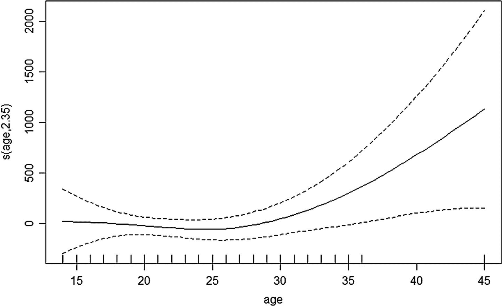
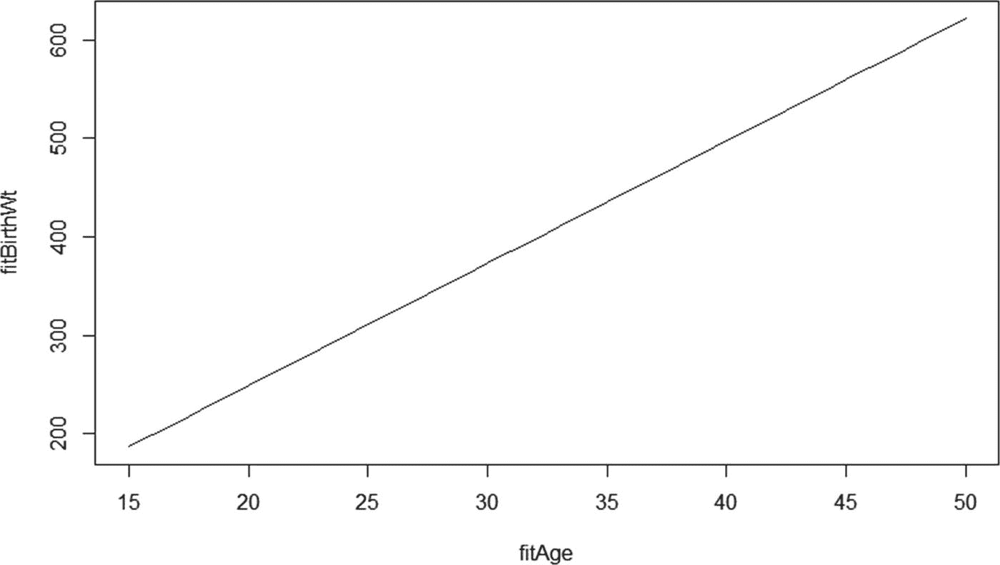

# 四、可信的模型

Earning Trust

在做预测或建立模型时(广义而言)，你不可避免地会出错——毕竟“所有的模型都是错的，” [1](#Fn1) 。显而易见的挑战是让你的观众相信你正在做一些他们可以利用的事情，即使你的模型是错误的。

在这种情况下，一个重要的工具就是向受众或用户解释你的模型的能力。如果没有对输入变量如何影响模型输出的某种形式的解释，你就无法对正在发生的事情做出任何假设。如果没有关于数据告诉你什么的假设，你就无法将结果与现有知识进行比较。是的，您将有某种准确性度量，但是它将缺少如何以及为什么达到其准确性的上下文。

反过来，这直接阻碍了您使用主题专家(SME)的知识来改进您的模型的能力，因为您无法将您的模型对问题的观点与主题专家对问题的观点进行比较。此外，无法在您的模型中直接使用主题专家的知识会错失为您的工作赢得支持的机会，也会错失改进您的模型的机会。

在这一点上，我应该注意到前面的章节没有假设任何特定的先验知识，除了一些建立预测模型的经验。在这一章中，至少一些讨论假设了广义线性模型(GLM)和回归的基本知识。

我仍然相信，如果你没有这个背景，你会学到很多这一章。然而，如果普通最小二乘回归、逻辑回归和泊松回归都可以被视为同一事物的例子的想法对你不熟悉，如果你阅读基本的广义线性模型文本，如多布森 [2](#Fn2) 或《远方》的文本，你将从本章中获得更多。 [3](#Fn3)

为了给模型提供可信度，对它正在做什么的解释需要对用户有意义。如果你把模型展示给用户，最好的情况是你的模型至少能说明一种他们已经知道的关系，以及另一种向他们展示新东西的关系。第一个确认模型已经找到了真实的关系。第二个说明模型发现了用户以前不知道的新东西。

如果你不能提供任何与用户自己观察到的东西相一致的发现，他们不太可能会接受你的模型是可信的。同时，如果你不能给他们提供任何新的东西，他们不太可能接受你的工作是值得付出的。

事实上，仅仅让用户拥有理解模型的能力是不够的。他们实际上还需要能够批评他们，并确保必要的预期信息被包括在内。我们将在本章末尾看到更多关于这个话题的内容。

在第 [3](3.html) 章中，我介绍了一个想法，即作为一个个体，要建立信任，你需要确保你有可信度、可靠性、亲密度，并尽量减少自我导向，正如在*的《值得信赖的顾问》中解释的那样。* [5](#Fn5) 虽然后两种属性是人类的领域，但是前两种可以应用到模特身上。确保你的模型可信可靠是赢得用户信任的基础。在这一章中，我们将集中讨论可信度。

为了可信，模型至少需要三个属性:

1.  **可理解性:**用户需要能够理解输入和输出之间的联系。因此，这个链接需要是可见的，而不是隐藏在一个黑盒子里。

2.  **可预测性/一致性:**当你的用户已经看到结果或者已经研究了模型定义，他们应该能够大概知道两种情况中哪一种更可能或者更不可能是特定的情况，或者如果是连续的模型，可能性更大。

3.  **反映真实世界的知识:**用户将经常对被建模的事物在现实生活中的行为方式有重要的体验。

第四点可能并不重要，但仍然有用——谈论你的模型何时最有可能出错，以及量化它最有可能出错的程度和方向的能力。这是另一个领域，伴随着模型可理解性或可解释性的问题，现在比机器学习(ML)炒作的第一波热潮受到了更多的关注。

如果你违反了这些关于模型行为的原则中的任何一条，你的用户对你的模型的信任将会迅速消失。虽然，特别是在后两点的情况下，并不总是有简单的方法来确保一个模型从一开始就符合这些规则，但是有一些方法可以使模型更有可能符合这些规则，还有一些方法可以检查您的模型是否符合这些规则。

本章将依次讨论这些属性。可理解性是这些问题中最技术性的，因此需要特别彻底的处理。然而，这并不意味着可理解性是最重要的，仅仅因为这需要额外的字数。我强烈认为，这些因素中的每一个都同等重要，形成了一个三条腿的凳子，如果其中一个因素不存在，凳子就不起作用。

这一章的很多内容将会以多种方式强调非线性关系。机器学习算法比简单回归模型更准确的一个重要方法是通过表示非线性关系，这应该是 ML 从业者所熟知的。允许额外非线性的缺点是有过度拟合的风险，这一观点也应该如此。较少讨论的是，非线性关系对用户来说更难理解，因此是信任的障碍。

大多数机器学习(ML)模型不允许建模者选择哪些变量将被建模为非线性效应。一个例外是广义加法模型(GAM)，它也允许在其主要实现中可视化非线性效应。这显然是更多的工作，但这意味着非线性部分可以限制在最重要的变量，这样，非线性变量的数量可以保持在一个较小的数字，可以解释。我们将在本章的后面探讨这种能力。

正如我们在前面章节中看到的，模型需要符合目的。因此，一些模型需要比其他模型更强调可信用户如何找到它们。有些人可能只需要在这方面非常轻的触摸。正如第 [3](3.html) 章所讨论的，重点是要仔细考虑用户的需求，并相应地匹配验证级别。特别是，考虑用户与结果的接近程度以及错误分类的成本——用户通常会在某种程度上意识到错误分类的成本(尽管通常只是从他们的角度来看)，并相应地调整他们的容忍度。

## 模型可理解性

直观地说，有两种策略可以用来建立既准确又可以解释的模型。第一个是建立一个本质上既可解释又能确保其准确性的模型。另一个是建立准确的模型，想出一个事后解读的方法。

在过去，人们通常认为，一方面，可以根据输入变量影响输出的方式来解释的模型不能为大多数人产生足够准确的结果。人们还经常假设，如果你能够建立一个足够精确的模型，那么几乎肯定不可能理解个体输入是如何影响结果的。

在接下来的几节中，我们将看到这两个假设是如何被证明是不正确的，并看到反驳这两个假设的不同方法。

### 既可解释又准确的模型

解释你的模型最明显的方法是从一开始就让它可以解释。如果可能，对连续因变量使用线性回归，或对分类因变量使用逻辑回归(二项式或多项式，视情况而定)或其他适当的 GLM(例如泊松、负二项式)。

机器学习模型在不必要的时候成为首选的一个特殊原因是，随着人们收集了更大的数据集，他们开始相信更大的数据集意味着更准确的结果，而没有停下来检查是否是这种情况。在某些特定情况下可能是这样，但很多时候并不是这样。

使用机器学习算法作为第一手段有时也会导致习惯，降低您制作准确和可解释模型的能力。

例如，因为一些算法需要以分类格式呈现的数据，所以在机器学习指南中，有时推荐将特征宁滨作为数据预处理步骤。然而，由于宁滨划分是任意和离散的，它们引入了不准确性。因此，重要的是要记住，建立传统的回归方法需要与建立机器学习不同的思维模式。当你转向回归方法时，一些适用于机器学习方法的经验教训将需要被抛弃。

除此之外，教回归原理的书不一定教好的建模实践。事实上，你可以说在回归环境中教授良好建模实践的书很少。从 Harrell 中选择的以下原则给出了生成本质上既准确又可解释的模型所需的一些概念:

*   一个模型的第一步，既是一个好的预测器，又是可解释的，是考虑已经非常仔细地收集的数据。每个输入的样本是否覆盖了每个输入的范围，正如您在对模型评分时所期望的那样？

*   仔细采访主题专家。您是否有与他们认为最有影响力的输入相对应的数据？

*   此外，就最有可能表现出相互作用的变量咨询主题专家。例如，Harrell 编制了一份与人类生物统计学相关的可能相互作用的列表。 [6](#Fn6)

*   考虑你将如何处理缺失的值。缺失的程度是否足够低，以至于您可以完全避免处理数据，或者您是否需要以某种方式估算值？

*   检查你对数据分布的假设。你的数据真的是计数，那么泊松回归是最合适的吗？

### 亲提示

利用您的主题专家的知识，如果可以的话，是创建一个既准确又可解释的模型的基础的一个很好的方法。在第 [1](1.html) 章中，我们讨论了正确的提问方式——有助于识别最重要变量的问题，最有可能产生重要交互作用的变量尤其有用。

提高模型预测性能的一种方法是采用收缩方法，如套索或岭回归。这些方法减少了与逐步回归相关的问题，即变量选择过程是谨慎的，因此是贪婪的，这可能导致高方差。作为一个例子，岭回归试图通过防止系数变得太大来减少这个问题，因此在完全丢弃变量和允许它们过度影响之间采取了中间路线。

如果放宽了线性关系的假设，线性模型可以模拟更复杂的关系。重要的是，能够不费吹灰之力地表示非线性关系是神经网络和树集成比线性模型表现更好的关键原因之一，因此放宽这一假设的能力是缩小差距的一大步。Harrell 支持的合理预测模型策略的一个要素是放松关键变量的线性假设(由主题领域的知识决定)。

本质上，通过遵循一个仔细的攻击计划，可以根据需要使用标准回归或 GLM 来构建一个既准确又可解释的模型。

线性假设可以放宽使用一个附加模型来说明有影响的非线性预测。广义加性模型(GAM)使用诸如样条的平滑函数来表示非线性关系。R 中的 mgcv 包是该模型最常用的包之一。其特别的优点是，它提供了通过绘制样条关系来可视化模型的非线性区域的能力。例如，图 [4-1](#Fig1) 显示了由广义加性模型建模的关系图。

图 4-1。

作者根据可从 R package MASS 获得的 birthwt 数据集准备的广义加法模型的平滑变量的典型图。请注意，y 轴不是婴儿的出生体重，而是与 15 岁母亲分娩的典型婴儿相比，由于母亲的年龄而增加的体重。 [7](#Fn7)

这些图的一个最大的优点是它们显示了哪里可以找到转折点。在图 [4-1](#Fig1) 的情况下，该图取自婴儿出生体重模型，其中 *x* 轴是母亲的年龄，直到大约 26 或 27 岁，出生体重和母亲的年龄之间似乎没有显著的关系。从这一点来看，母亲的年龄和出生体重之间似乎存在正相关关系(尽管置信区间随着数据的减少而变宽，因为数据点的数量随着母亲的年龄而减少)。

这是一个比纯线性模型更丰富的视图，在纯线性模型中，模型必须用一条线来表示所有这些信息，通过绘制一条斜率介于年轻母亲部分的接近零的梯度和年长母亲的明显正相关之间的线。该版本如图 [4-2](#Fig2) 所示。

图 4-2。

年龄和出生体重之间关系的线性表示，基于 R MASS 包中的 birthwt 数据集。为了配合图 [4-1](#Fig1) ，y 轴是年龄对出生体重的影响大小，而不是最终出生体重。

因此，得出的结论可能会非常不同——例如，使用该数据的线性方法，可以合理地得出这样的结论:母亲在 25 岁左右出生的婴儿可能会比青少年母亲出生的婴儿更重，但在分析 GAM 的非线性输出时，这一结论并不支持。一些教科书建议用一系列直线代替曲线。这可能是危险的，因为您将平滑曲线过渡替换为急剧过渡-您在一个点上立即从一个方向的线改变为不同方向的线，而不是在绕半径弯曲时逐渐改变。更有用的是与主题专家讨论为什么转折点在哪里。我将在本章的最后一节进一步讨论这一点。

这一领域与之前的观察结果紧密相关，即客户需要在他们的模型中看到一些他们已经知道和不知道的东西——展示一个 GAM，该 GAM 证实了客户之前的想法，即“年龄”是一个重要因素(他们确实知道的东西),但通过展示效果有一个峰值或逐渐减小(他们不知道的东西),扩大了他们的视角，为我带来了出色的客户认同。

这里的信息是不要放弃神经网络或随机森林等方法，而是不要轻易或过早地默认它们。即使当您的项目策略建议用可解释性换取准确性是必要的，也要意识到有许多方法可以洞察黑盒模型。让它们触手可及，以确保您的客户被您的模型及其结果所吸引——我们将在下一节中探讨其中的一些。

### 当无法解释模型时

在两种特殊情况下，实现一个可解释的模型是不太可能的，两者之间有相当多的重叠。首先是变量的数量太多——在某个点上超过大约 20 个输入变量，可解释模型的概念逐渐消失，因为列表变得太大，人类无法推理。另一种情况是手动开发的功能无法带来足够的性能，计算机视觉和图像识别就是这种情况的明显例子。

应该注意的是，在这两种情况下，都有一定程度的范围可以推回到可解释的模型——然而，决定不走这条路可能仍然是最合理的路线。有许多迹象表明情况可能是这样的:

*   可能的变量很多，没有一个特别强。

*   当你试图通过创建一个游戏或其他方式来可视化非线性关系时，每个变量都有几个拐点。

*   有大量证据表明存在多重共线性，通常的补救措施无法成功提高模型的准确性。

假设您的模型至少满足这些标准中的几个，您可能有理由使用黑盒模型(如神经网络或随机森林)来代替内在可解释的模型。或者，您可能需要快速构建您的模型并仔细判断，因为精心制作一个好的可解释模型所需的特性将会非常耗时。

### 黑盒子里的窗户

应用了前面的标准后，您决定只有黑盒算法才能提供您需要的性能。另一种选择是有一个表现良好的不透明模型，但提供另一个模型来解释它。这种想法的一个扩展是用传统上认为不可解释的随机森林等算法建立一个准确的预测模型，并使用先进的技术来解释它。

### 代理模型

强制黑盒模型可解释的一种非常直观的方法是使用其结果作为第二个模型的目标，该模型使用本质上可解释的方法，如决策树或回归。这种方法被称为构建代理模型。

尽管这种方法一直都是可用的，但是最近，专门应用这种方法的包和方法已经建立起来了。在接下来的小节中，我将讨论两种主要类型的代理模型和重要的实现。

### 局部代理模型

使用随机森林发现量化关系以及进行预测是一个活跃的研究课题。最近的论文，如“量化随机森林中的不确定性” [8](#Fn8) 讨论了基于 U-统计估计特定预测因子对整个随机森林中因变量的影响的大小和方向的策略。

R 中的 inTrees 包借鉴了类似的主题，它创建了一个树集合的规则集概要，是当今 R 中用来解释随机森林和其他树集合的几个包之一的一个很好的例子。inTrees 方法是从构成集成的树中提取规则，并根据规则的频率和错误等属性，保留最高质量的规则作为集成的解释或总结。

前面提到的方法只适用于树的集合，包括随机森林和梯度推进机器。解释最近出现的任何算法的结果的一个选项是使用通用模型解释器，其中本地可解释的模型不可知解释(LIME)可能是最突出的例子。

与广义加性模型等方法不同，LIME 将根据具体情况提供解释。也就是说，对于代表要评分的情况的一组参数，时间解释代表不同变量如何影响该特定情况；如果将另一种情况呈现给算法，变量的影响可能会非常不同。

解释以水平条形图的形式呈现，显示不同变量影响的相对大小，向右延伸的条形代表使分类更有可能的变量，向左延伸的条形代表使结果不太可能的变量。在高层次上，变量的影响来自敏感性分析，该分析检查与感兴趣的情况非常相似的其他情况的分类结果。

这是 LIME 的局部方面——解释是在个案的基础上给出的，而不是作为一个整体为模型提供规则或指南。这是与前面讨论的树集合的方法的显著区别。此外，LIME 目前仅适用于分类器，而非回归模型。

### 全球代理

LIME 是局部代理的一个例子——有效地构建了一个线性模型，它在所选例子周围的一个无限小的区域中工作。与局部代理直观相反的是全局代理——一种代理模型，它被期望解释底层模型在它的整个域中的行为，而不是在特定的点上。

如果存在显著的非线性或相互作用效应，局部替代和全局替代有可能在输入和输出变量之间得出完全不同的关系。因此，当试图向主题专家观众解释模型的整体操作时，全局代理可能特别有用，我们将在下面的文本中更详细地讨论。

使用全局代理的困难在于，您实际上需要构建一个额外的模型，其中包含了您在构建第一个模型时遇到的所有陷阱。代理模型本身可能会在您理解底层模型的方式中引入扭曲，在创建模型所引入的扭曲之上。

决策树可以说是用于构建代理模型的最流行的算法。虽然从理论上来说，建立一个决策树模型来适应输出应该是简单的，但是在实践中可能仍然是混乱的。Christopher Molnar 在 R 中创建了一个函数 TreeSurrogate，作为他的 iml(“可解释的机器学习”)包的一部分，它简化了将 PartyKit 包中的决策树拟合到您的预测的过程。 [10](#Fn10)

无论您是否决定使用 TreeSurrogate 函数，以黑盒模型的结果为目标来构建一个决策树模型应该是您解释最初看起来不可理解的模型的箭筒中的一支箭。毫无疑问，随着人们对确保模型可以被解释的兴趣越来越大，在不久的将来，更多的选择将开始出现。

### 模型可理解性的最后一英里:模型表示

创建一个最终用户能够理解的模型，一方面意味着确保他们基本理解模型中的输入和输出变量是什么，另一方面意味着他们理解这些变量在模型中是如何操作的。

在每一种情况下，最终演示对于确保实现无缝用户体验的最终目标都至关重要。虽然相对明显的是，输入变量本身是复杂模型的输出，或者变量具有不透明的名称，如“Var1 ”,会增加用户的困惑，而不是帮助他们理解，但有时不清楚需要多少解释。

部分问题在于，从建模者的角度来看，重要的是变量中包含了什么——模型的比率输入的名称很可能指的是构成比率的变量。显然，这对变量的用户来说没什么意义。想想会计比率的名称——“速动比率”、“酸性测试”，或者物理和工程中的无量纲常数，如雷诺数(在简单的水平上，它表示流体的湍流程度)。

雷诺数虽然没有一个完美的交流名称(从这个角度来看，“湍流数”可能是一个改进)，但它确实说明了以不同的方式将模型输入的计算与其在模型中的意义分离的概念——在不同的环境中，不同的工程模型中使用多个雷诺数，但基本上以相同的方式使用雷诺数——来量化流体的湍流。管道和通道中的流动、穿过流体下落的颗粒、搅拌槽中的叶轮以及填充床中流动的流体都有一个雷诺数——所有这些都有不同的计算，但至少在基本层面上表达了相同的概念。

在数据科学模型中，这有两种方式。一个是，如果你想在尽可能多的地方重用你的模型，为了可移植性，用一种独立于它们的成分的方式来标记你的变量是很方便的。例如，在信贷风险模型中，由于当地税收或其他监管原因，收入或资产可能有不同的计算方法。因此，您要么需要确定您的定义所遵循的法规，要么提供足够的细节，以便您的用户可以自己进行检查。

第二点更为重要——如果其他人要使用模型，您的界面将需要标记，而引用模型中变量含义的标记比解释其成分的标记更能向用户解释输入。

在雷诺数的情况下，解释“一个表示湍流趋势的常数，其中较高的数更倾向于湍流”更有用，并且比“直径、速度和流体密度与流体粘度的比率”更能解释其在模型中的用途

对于你的模型来说，以用户可以理解的方式解释一个工程变量很少会简单地意味着列出潜在的变量或者把它的数学定义贴在网页上。这意味着在你的模型环境中解释新变量的物理意义，如果你不知道这个变量在你的模型环境中意味着什么，是时候和你的主题专家谈谈了(如果他们不知道，你可能需要放弃这个变量)。

底线是你不能期望你的用户是读心术者，严格关注标签不仅会导致用户更有可能使用你的模型，而且也意味着他们不太可能从你的模型结果中做出不正确的推断。

### 标准和风格指南

有许多资源可以用来指导如何开发标注变量的标准化系统。一些最受欢迎的包括哈德利韦翰的 R 风格指南和谷歌的 R 风格指南。然而，其中许多更关注单词的大小写或何时使用花括号或方括号，而不是变量名的可用性。

另一个寻找命名变量的最佳方法的地方是干净代码从业者。像“避免虚假信息”这样的建议是一个好的开始。罗伯特·c·马丁的一条特别的建议是，一个变量出现得越频繁，它就应该越短。相反，不常出现的变量需要更长的名字来定义它们。

然而，这个建议仍然是专门针对编程的。我们可能会找到其他的建议来填补更多的空白。

来自数据库和数据仓库专家的建议更好，他们更关心确保非专家能够理解他们所呈现的数据的任务。

*   每个变量在数据库(或模型)中都应该有一个唯一的名称。 [11](#Fn11)

*   如果建模环境没有进一步限制，该名称应该最多包含 30 个字符。

*   如果需要，在所有变量中使用一个缩写。例如，如果您在多个变量中使用“重量”，请始终缩写为“wt”

*   名词用单格，动词用现在时。 [12](#Fn12)

在你的团队中遵守一套约定的规则将确保用户能够完全理解变量影响结果的方式以及这些变量的含义。

## 模型一致性

用户认为可信的模型的第二个属性是它的一致性。大多数用户的默认立场是，如果变老增加了人生某个阶段的死亡风险，那么它应该增加人生其他阶段的死亡风险——如果变老一岁突然降低了你死亡的可能性，他们会感到困惑。

考虑到相互作用和非线性效应的模型可能会提供更高的精确度。它们也更容易受到数据假象的影响，而不是代表建模场景的真实情况。这就是大家熟悉的过度拟合的故事。

机器学习文本中很好地涵盖了总体上的过度拟合，推荐交叉验证等方法来检测它，推荐正则化等方法来防止它。然而，这些方法主要是为了挑选平均过度拟合的模型。他们不太擅长挑选模型中与整体画面不同的区域，因此可能会削弱用户对模型内容的信心。

这是一个必须小心行事的领域。如果您选择了一个允许非线性关系的模型，那么您必须在这样一个假设下工作，即这些关系有时能够准确地代表您所分析的内容。问题是双重的——一方面，存在某些非线性不真实的风险。另一方面，你会经常发现，即使非线性关系是真实存在的，你的用户也很难接受。

一个特别的问题是关系会改变方向，正如开头的例子所强调的。保持相同方向的关系的技术名称是单调的——相反的是非单调的。非线性模型不一定是非单调的，线性模型也可以是非单调的(想想平方项)，但它们更有可能是单调的，与添加平方项或类似的线性模型相比，您对内在非线性模型的控制更少。

用户可能期望关系在模型的整个范围内有效。因此，即使有一个很好的理由让一段关系在不同的点上向不同的方向发展，说服你的用户仍然是一场艰苦的战斗。

仔细研究解释。如果你对一个人说，“多活一岁让你在接下来的一年里或多或少有死亡的风险？”他们几乎总是会回答“更有可能。”如果你告诉他们战争正在进行，18 岁到 30 岁的人都必须去前线服役，并问他们在这种情况下 29 岁的人是否比 31 岁的人更容易死亡，他们会回答“29 岁”

关键是，如果这种非线性关系有意义，并且人们理解它，他们就会相信它。建模者的任务是与主题专家一起验证非线性行为是否有真正的原因，然后将其传达给用户。

可以通过一系列不同的方式向用户传达原因。我们将在下一章的交流中看到其中的一些。现在，重要的是要认识到，你应该努力保持新的非线性关系的数量——那些你第一次教你的用户关于一种行为的关系——到一个可管理的数量。

在下一节中，我们将关注专题专家参与的研讨会，并获得他们对非线性关系是真实还是虚假的看法。

## 根据故事定制模型

许多模型都受到平坦最大效应的影响——最佳值不是一个点，而是实现相同价值的替代方法的区域。因此，一个模型在其开发过程中会达到一个优化点，在这个点上，即使输入发生重大变化，也很难进一步提高精度。 [13](#Fn13) 这可以被悲观地视为经济学中收益递减定律的数据科学版本，当它被首次提出时，人们正是这样看待它的。

然而，这个想法有一个半满的版本。不要把最大平坦值作为模型性能的限制，相反，可以把最大平坦值作为获得最佳结果的多种途径。因此，数据科学家比工程师处于更有利的位置，例如，工程师经常需要以性能换取成本，或以性能换取指标 A，以性能换取指标 b。

相反，一旦数据科学家针对准确性优化了模型，他们就可以自由地寻找优化其他指标的替代模型。文献中的例子表明，更复杂和更具体的模型变得简化和更普遍。

然而，在本章的上下文中，平坦的最大值效果提供了一个很好的机会来选择一个与用户的世界观最匹配的模型。你会意识到这个模型比其他任何模型更容易被用户接受。固定最大值为我们提供了另一个机会，使我们能够建立一个与您客户的目标市场相匹配的模型，例如，一个风险模型确定太大比例的信贷提供商目标人口是不可接受的风险，这将阻碍而不是帮助他们的业务，而一个在目标人口中更具选择性但同样准确的模型可能会更好地被接受。

平坦最大值效应提供的机会是挑战存在一个可以找到的真实模型的想法的机会，这通常具有副作用，即一旦目标已知，就在不考虑典型用户如何理解被建模的关系的情况下创建模型——如果存在“真实”或“最佳”模型，则考虑用户的观点是不必要的。

实际上，由于有多种最佳模式，显然在有可用的正确数据的情况下，有空间建立一个考虑到用户观点的模式，尽可能确认和编纂它。

## 满足用户的期望

模型是用来使用的，用户需要相信它们并理解它们，以便最大限度地使用它们——如果他们不信任它们，可能根本不会使用它们。获得用户信任的一个方法——梳理出重要的主题专业知识以更好地理解您自己——是亲自展示模型并检查关系的合理性。

为了充分利用您的主题专家，如果可能的话，您的建模过程的最后一步应该是邀请他们对模型的输出以及输入变量协同工作以实现结果的方式进行反馈。

石灰可视化的格式是如何可视化输入数据对输出的影响的有用指南。因为 LIME 将所有输入变量在特定情况下(特定借款人、特定被保险人、特定消费者等)的偏导数可视化。)在您的模型范围内，这种可视化让您有机会以对主题专家有意义的方式提出问题。将典型案例形象化，向用户展示模型如何工作，并询问他们对模型是否有意义的看法，以获得他们的认同并验证模型。

### 解释模型的表现

传统线性模型优于机器学习模型的一个优势是，已经开发了各种各样的工具来评估它们的性能。

一个特殊的例子是，线性模型的参数和预测的置信区间可以从几乎所有的统计软件包中容易地获得，并且计算方法相对简单，在标准教科书中广泛涉及。

在机器学习算法的情况下，情况远不是这样，包括决策树、随机森林和其他树的集合，以及神经网络。在这些算法的情况下，文本和包更有可能讨论输出，就好像它们是纯粹确定性的，没有误差线或类似的东西。在统计学术语中，模型只返回目标值本身、回归问题或分类概率、名义布尔目标的点估计。

然而，没有理由不使用置信区间或预测区间来描述机器学习模型的结果，并且越来越多的人认识到这样做的必要性，以及越来越多的工具允许从业者这样做。

类似于模型解释方法中存在的情况，存在为特定种类的算法计算置信区间的方法，并且存在计算置信区间的通用方法。我将从较高的层次来审视其中的一些方法，介绍它们的工作原理和局限性，而不是试图为另一个相对技术性的主题提供深入的解释。

### 代表性子模型

在随机森林和梯度推进机器的特定情况下，两者都是决策树的集合，构造置信区间的直观方式是分析构成整体模型的决策树。

由于这些模型本质上是由其他模型构建而成的，因此估计预测误差的直观方法是从来自基础模型的预测范围中得出误差。

对于这类模型，经常使用袋外抽样来量化模型的预测误差。袋外估计值是从没有使用特定观测值的树中得出的，并针对每种情况计算误差。因此，袋装树的内在可用性使得在随机森林及其同类的情况下计算预测间隔更简单。因此，随机森林的许多实现都有现成的预测误差估计值，作为软件包的现成部分。

可变重要性也很容易用于随机森林和基于树的表亲，如梯度增强机器，通过合计组成树集合的每棵树中每个分裂的重要性。从业者经常使用变量重要性来确定哪些变量应该保留，但更好的使用方法是与主题专家讨论，以确定模型是否使用了正确的逻辑。

如前所述，这是一个活跃的研究领域，随着 R 和 Python 中思想的新实现的出现——论文“量化随机森林中的不确定性”只是一个例子。 [14](#Fn14)

### 模型不可知评估

为机器学习模型创建置信区间的一种更通用的方法是使用 bootstrap 置信区间。

引导实际上是用替换进行重采样。为了引导模型的输出，您需要创建多个略有不同的模型。直观地说，简单的方法是创建多个模型，每个模型使用原始数据集的不同随机样本。一旦你创建了足够数量的模型，你就可以计算每个模型的误差，并建立一个置信区间。

能够讨论您的模型的局限性是确保模型用户能够信任您的结果的重要方式。预测区间本身是一种量化模型局限性的相对统计方法。在决定如何传达置信区间的内容时，你需要仔细考虑你的听众。

交叉验证和 bootstrapping 都可以用于推导任何形式的模型的预测区间。交叉验证倾向于高估预测误差，而 bootstrap 倾向于低估预测误差。

最近，在使用变分法作为另一种替代方法来计算机器学习模型的预测区间方面有所发展。虽然细节不适合这里，但这说明了这是一个吸引越来越多兴趣的领域，并且是计算这些预测区间的方法的另一个例子。

在某些方面，让用户知道预测区间在模型输出中如何变化比知道绝对值更能提供信息。知道预测在用户感兴趣的预测范围的中心是最窄的(代表模型最有信心的时间),给了用户对模型总输出的最大信心。

这可能会使模型输出的残差分析与整体误差分析一样重要。虽然残差分析通常用于 GLMs 的环境中，以验证诸如恒定方差(如果违反，可能表示不正确的分布假设)之类的假设，但是如果残差在预测变量范围的末端散开，或者在机器学习环境中对于特定输入变量的范围散开，则可能表示在该区域中模型不够准确，可能是由于该区域中缺少数据。

您还可以通过比较特定数据区域的预测误差来执行“软”类型的残差分析，例如，男性与女性、吸烟者与不吸烟者或儿童与成人(如果我们设想与医疗相关的模型)。

综上所述，能够以对用户有意义的方式量化模型的确定性，并能够解释什么时候模型工作得最好，是保持用户信任的关键。清楚地看到你的模型的局限性，而不是让人们放弃，有助于他们知道什么时候他们可以最有效和最有信心地使用它。

### 与主题专家召开研讨会，验证您的模型

我在本章开始时列出的模型所需的三个属性中的最后一个是，模型需要与用户对真实世界的体验相匹配。如果用户认为年龄或性别对结果有特殊的影响，要么模型需要与该位置一致，建模者需要能够声明该影响太弱而无法在模型中看到，要么最终建模者需要有足够的证据让人们改变主意。

研究表明，参与问题的解决会极大地增加人们接受解决方案的可能性。因此，即使你带着自己喜欢的解决方案进入这种情况，提出这个解决方案预期要克服的问题——而不提及你的解决方案——将有助于确保人们接受你的观点。如果你的用户能成为对话的积极参与者，而不是你与之交谈的人，那就更好了。)到，后一种情况允许他们巩固自己的负面观点。

虽然很明显这依赖于建立一个可以用这种方式讨论的白盒模型，但回报是巨大的。例如，这是计算出用户将看到的最终变量名的最佳方式，因为用户可以提出他们自己的有意义的名称。它可以让你避免“谷歌流感趋势”的错误，即展示一个包含明显虚假关系的模型。最后，仅仅询问用户的意见就能确保他们的认同，听取他们的建议并做出相应的改变就能达成交易。

与此同时，正如前面提到的，不与主题专家合作，无论他们是否是你的目标用户群的一部分，从让你的模型得到充分验证的角度来看，代表着一个巨大的机会的丧失。

正如主题专家用具体的术语思考的那样，为了促成一个允许他们发表意见的研讨会，需要您提供模型输出的具体示例，以及能引起他们共鸣的案例。

LIME 可视化风格是一种很好的方式来可视化这种特定目的的情况，因为如前所述，它显示了每个变量中运动的局部影响。这允许你以一种方式为主题专家设计你的问题，这意味着他们不需要任何统计知识来回答。以下是一些可能的例子:

*   看看这个案例，从男性变成女性会产生积极或消极的影响还是没有影响？

*   你认为情况 A 或情况 B 更有可能产生积极的结果(对于分类问题)/更大的价值(对于回归)？

*   您是否期望变量在模型的整个领域中以相同的方式工作？(换句话说，是否存在预期的相互作用，例如性别和药物剂量的影响之间的相互作用？)

虽然检查本地化的解释可以清楚地了解现实生活中的案例是如何工作的，但它们可能会导致只见树木不见森林。在没有或很少交互的普通线性模型中，这不是问题，因为在不同的局部区域中，模型操作的方式几乎没有或没有差异。

然而，当存在显著的非线性和相互作用效应时，可能会有严重的差异。如果是这种情况，研讨会需要包括全球关系的可视化，以说明预测空间不同区域的不同斜率。对于重要变量，所讨论的 GAM 图可能是可视化关键变量在其范围内改变梯度的方式的有用方式。

根据我的经验，当人们得到这些图表时，他们通常会对这些关系的非线性程度感到惊讶——人们天生就强烈期望关系是线性的。出于这个原因，给有影响力的用户群一个看这些图的机会是确保用户正确购买你的模型的一个重要方法。

重要的是，他们对这些图表的反应将使你更好地理解你的模型，并围绕其操作领域画出有用的界限。

例如，在我主持的这样一个会议中，*x*-轴粗略地说是资产的年龄。当针对产出变量绘制年龄图时，出现了一个明显的转折点，导致一名主题专家意识到这与影响资产维护方式的法规变化相关。

也就是说，当资产达到特定的生日时，法规要求进行额外的维护，因此矛盾的是，此时资产变得不太容易出现问题。这最终意味着模型的范围发生了变化，因此监管变化不再对模型产生影响。

在这次会议之后，除了找到改进模型的具体行动之外，受到更广泛的用户群体尊重的主题专家对模型的运作方式有了更好的理解。这显示了与用户的互动是如何导致一个真正更好的模型，以及被期望使用它的人更好的尊重。

即使您没有能力像与 GAM 一样将关系可视化，即使知道模型中不同变量的重要性，您也可以使用这些信息来引发讨论并挑战您的主题专家。很少有实现不提供可变重要性绘图，有一些包可以为任何给定的模型绘制可变重要性。

有时，只要知道模型严重依赖于中小企业认为不太重要的特定变量，就足以发现问题。

这一点现在已经在一项研究中得到证实，卡鲁阿纳 [16](#Fn16) 等人创造了 GAMs 和 GA 2 Ms(具有双向交互作用的 GAMS)来预测肺炎病例的再入院。作者的重点是生产“可修复”的模型——也就是说，模型的推理可以被主题专家检查、质疑，并在需要时修复。

在许多情况下，主题专家能够追踪到特定病例或病例群的意外规则，并确定该规则是一个数据假象，而不是改变再入院风险的真正医学原因。用 gam 或 GA 2 Ms 制造的模型被认为是可修复的，因为发现可疑的模型可以从模型中移除，而不会对模型偏差产生连锁反应。

主题专家的眼睛可以发现数据科学家不可能发现的不一致。虽然数据科学家应该彻底了解他们工作的环境，但他们不能像该领域的主题专家那样思考，并且通常不会注意到对真正的主题专家来说显而易见的问题。

因此，例如，虽然专门从事医学研究的统计学家对他们的领域有透彻的了解，但他们永远不会像医生或全职医学研究员那样思考，医生或医学研究员在审查研究结果时总是会注意到统计学家的一些不同之处。这在当前预测建模所针对的一系列应用中都是正确的。

## 外部验证

在各行各业中，确保发现并消除我们长期以来一直深入研究的错误的最佳方法之一是找到一双新鲜的眼睛。构建预测模型是如此，设计桥梁或写书也是如此。

一个具体问题的例子是数据泄露，这种问题可以被另一双具有统计思维的眼睛发现。很容易创建一个具有夸大性能的模型，这是由于在评分时对模型不可用的数据进行训练。这就是俗称的数据泄露，至少在某些时候，像 Kaggle 上的数据挖掘比赛是由利用这些泄露的人赢得的。

如果在您的训练过程中发生了数据泄漏，而您并不知道，您可能会有一个在验证过程中表现很好的模型，而在投入使用时表现很差。在这种情况下，一双新鲜的眼睛可以让你避免很多尴尬。

如果您的组织足够大，可能是因为团队中有足够多的数据科学家，他们可以被分成更小的小组，这些小组可以并行工作，而不会在工作时看到彼此的大量项目。在这种情况下，你可以让这些小组来验证彼此的工作，确保他们会有一双新鲜的眼睛。

然而，这可能是相对罕见的情况。如果你不在这个位置，对于有大量暴露的模型，你可能想考虑保留一个外部统计咨询来验证。如果您的模型直接暴露给客户，或者如果结果直接纳入您的组织的盈利方式，这可能特别重要。

后两个因素都可以通过这种方法进行检查。只要问你一些问题，并试图理解模型在做什么，一个有能力的外部评审者就会指出任何一个区域，要么是模型没有很好地反映你在现实世界中的操作方式，要么是模型与自身不一致。

这最后一个验证，尤其是在与主题专家的研讨会相结合时，是确保您的模型与自身一致、可被用户理解并在其问题域内有意义的最有效的方法。

## 摘要

我们已经看到，随着机器学习面临更复杂的挑战，犯错的代价更大，用户开始要求更大的保证。为了获得这种保证，用户现在希望更好地理解模型处理输入以实现输出的方式。

最容易理解的模型是通过线性回归建立的。传统上，机器学习实践者假设简单的回归模型甚至广义线性模型都不能达到足够的精度，我们回顾了现代技术，这可能意味着可以实现更好的精度。特别是，像广义加性模型这样的技术意味着我们可以放松线性假设，这意味着不太好的数据集可以用于回归，但仍然可以得到准确的模型。

回归模型仍然受到其假设的限制；带有微弱信号的杂乱数据集可能仍然需要黑盒机器学习算法来达到所需的精度。对于这些情况，现在有询问黑盒和开发可理解模型的方法。

非线性关系，尤其是非单调关系，对用户来说可能是违反直觉的，需要额外的分析和解释。广义加性模型也提供了一个很好的途径来可视化这种非线性关系，以帮助解释。

简单地使模型在输入和输出之间的关系方面易于理解，本身并不总是足以确保用户信任模型的结果。

需要注意的一个方面是输入和变量本身是否可以理解。在这方面，命名约定很重要，因为要确保容易获得正确的定义。

您可以通过允许用户自己玩模型，询问模型以决定其答案是否有意义，来帮助用户理解和信任模型。这可以通过使用用户选择的值运行评分引擎的计算机模拟来实现，或者可以通过对构成模型的规则的详细分析来实现，如果可以的话。越来越多的人认为，能够获得专家用户的这种认可是确保模型完整性和可靠性的一个重要途径。

让模型的未来用户参与进来也很重要，这不仅是为了改进模型，也是为了获得有影响力的未来用户的认同。一种方法是与您当地的主题专家举行研讨会，检查您的模型得出的推论是否符合他们对主题的理解——除非您的模型符合他们的预期，或者您的数据和分析确实改变了他们的预期，否则您不会让他们相信您的模型。

检查你的模型是否有意义的另一个重要方法是确保它是由没有参与构建它的人验证的。在一个较小的公司，这可能意味着你需要保留一个外部建模顾问。

在第 [5](5.html) 章中，我们将着眼于如何确保您的模型在实施后及以后继续履行其最初的承诺，包括模型维护和监督。

## 模型可信度清单

### 可解释的模型

*   给定你所拥有的数据类型，以及它可能违反典型假设的程度，你能开发出一个足够精确的内在可解释的模型吗，比如 GLM 或决策树？

*   如果没有，是否有现成的工具来解释您正在使用的黑盒算法的结果？

*   你能让你的用户获得解释吗，无论是在本地层面还是在全球层面？

*   你能向你的用户解释你的模型预测的不确定性水平吗？

### 模型演示

*   你的模型中的变量有有意义的名字吗？

*   你的用户能容易地找到任何比率的解释或其他用于派生变量的公式吗？

*   如果您的用户通过基于网络的平台或应用程序访问模型，用户界面/UX 设计是否允许用户快速访问目标和输入变量的定义和解释？

### 与他们自己和他们的主题一致的模型

*   主题专家是否有机会审核您的发现，包括单个结果是否有意义，以及它们与输入的关系是否有意义？

*   您是否与主题专家一起回顾了重要的非线性关系，以确保它们在主题的已知范围内是有意义的？

*   您是否向另一组数据科学家展示过该模型，以审查该模型的结果在统计方面是否稳健且可重复？

*   您是否将主题专家对最重要变量的看法与模型中发现的变量重要性进行了比较？

*   在被评估后，你有没有移除或修复任何看起来有缺陷的关系？

<aside class="FootnoteSection" epub:type="footnotes">Footnotes [1](#Fn1_source)

博克斯·GEP 和德雷珀 N，“所有的模型都是错误的，但有些是有用的”，*经验模型建立，* 1987。

  [2](#Fn2_source)

安妮特·多布森(Annette Dobson)，*广义线性模型介绍*(伦敦:查普曼&霍尔出版社，2002 年)。

  [3](#Fn3_source)

《遥远的朱利安》，*R*的线性模型(伦敦:查普曼&霍尔出版社，2009 年)。

  [4](#Fn4_source)

被金、拉杰夫·卡纳和奥卢瓦桑米·科耶约”的例子是不够的！:学会批判”，*神经信息处理系统(NIPS)会议*(巴塞罗那，2016)。

  [5](#Fn5_source)

戴维·h·迈斯特尔、查尔斯·h·格林和罗伯特·m·加尔福特，《值得信赖的顾问》(纽约:自由出版社，2000 年)。

  [6](#Fn6_source)

小弗兰克·哈勒尔(Frank E. Harrell，Jr .),*回归建模策略，第二版*(纽约:施普林格出版社，2015 年)。

  [7](#Fn7_source)

布莱恩·里普利，比尔·维纳布尔斯，道格拉斯·m·贝茨，库尔特·霍尼克和阿尔布雷希特·格布哈特，*麻省:支持维纳布尔斯和里普利的现代应用统计学的函数和数据集，* 2019， [`https://CRAN.R-project.org/package=MASS`](https://cran.r-project.org/package%253DMASS) 。

  [8](#Fn8_source)

Hooker G 和 Mentch L，“通过置信区间和假设检验量化随机森林中的不确定性”，*《机器学习研究杂志》*，17，2016。

  [9](#Fn9_source)

[`https://cran.r-project.org/web/packages/iml/vignettes/intro.html`](https://cran.r-project.org/web/packages/iml/vignettes/intro.html) 。

  [10](#Fn10_source)

[`https://cran.r-project.org/web/packages/iml/iml.pdf`](https://cran.r-project.org/web/packages/iml/iml.pdf) 。

  [11](#Fn11_source)

《SQL Server 命名指南和约定》，于 2019 年 4 月 4 日 [`www.cms.gov/research-statistics-data-and-systems/cms-information-technology/dbadmin/downloads/sqlserverstandardsandguildelines.pdf`](http://www.cms.gov/research-statistics-data-and-systems/cms-information-technology/dbadmin/downloads/sqlserverstandardsandguildelines.pdf) 访问。

  [12](#Fn12_source)

《数据仓库命名标准》，于 2019 年 4 月 4 日 [`https://kb.iu.edu/d/bctf`](https://kb.iu.edu/d/bctf) 访问。

  [13](#Fn13_source)

戴维·汉德，“分类器技术与进步的幻觉”，*《统计科学》，*2006 年第 20 卷第 1 期， [`https://arxiv.org/pdf/math/0606441.pdf`](https://arxiv.org/pdf/math/0606441.pdf) 。

  [14](#Fn14_source)

Lucas Mentch 和 Giles Hooker，“通过置信区间和假设检验量化随机森林中的不确定性”，*《机器学习研究杂志》*，2016 年第 17 期，第 1–41 页。

  [15](#Fn15_source)

大卫·拉泽尔和瑞恩·肯尼迪，“我们能从史诗般的谷歌流感趋势失败中学到什么”，*连线，*2015 年 10 月 1 日， [`www.wired.com/2015/10/can-learn-epic-failure-google-flu-trends/`](https://www.wired.com/2015/10/can-learn-epic-failure-google-flu-trends) 。

  [16](#Fn16_source)

Rich Caruana，Yin Lou，Johannes Gehrke，Paul Koch，Marc Sturm 和小糯米·埃尔哈达德，“医疗保健的可理解模型:预测肺炎风险和医院 30 天再入院”，*第 21 届 ACM SIGKDD 知识发现和数据挖掘国际会议论文集*，2015 年。

 </aside>