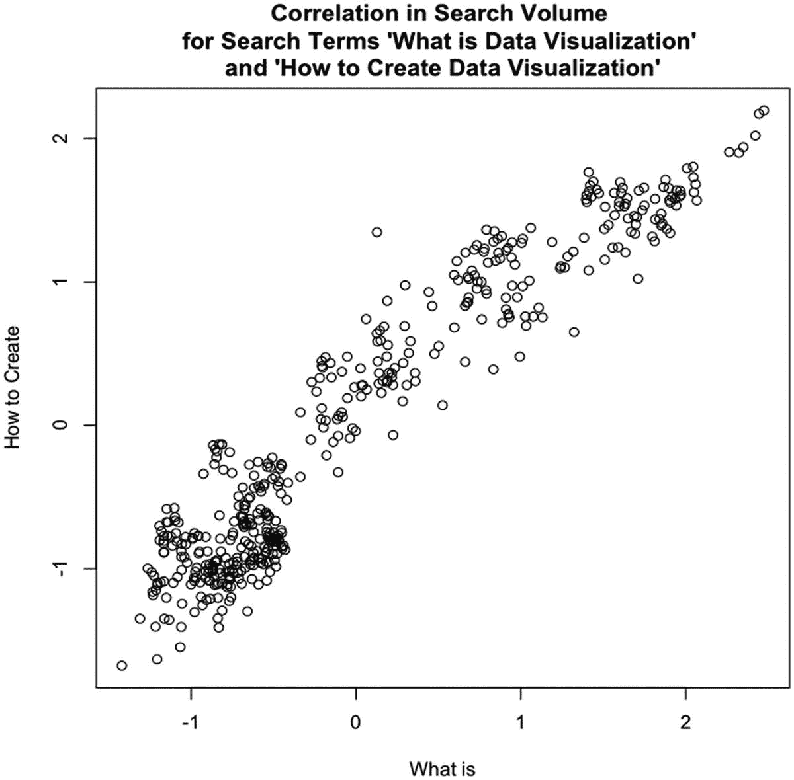

# 一、背景

当本文的第一版发布时，在 web 开发领域出现了一个新概念:使用数据可视化作为交流工具。今天，网络上到处都是信息图；然而，这个概念在其他领域和部门已经存在了好几代了。在您工作的公司，您的财务部门可能使用数据可视化来表示内部和外部的财务信息；看看几乎所有上市公司的季度收益报告就知道了。它们充满了图表，以显示季度收入，或年同比收入，或其他大量的历史财务数据。所有这些都是为了在一个简单易懂的图形中显示大量的数据点，可能是一页又一页的数据点。

比较一下 2007 年谷歌季度收益报告中的柱状图(啊，那时谷歌还是一家“小”公司；见图 [1-1](#Fig1) )以表格形式显示其所基于的数据子集(见图 [1-2](#Fig2) )。


图 1-2

表格形式的类似收入数据


图 1-1

谷歌 2007 年第四季度收入以条形图显示

条形图的可读性更强了。从它的形状我们可以清楚地看到收益在上升，并且每个季度都在稳步上升。通过颜色编码，我们可以看到收益的来源，通过注释，我们可以看到这些颜色编码代表的精确数字以及年同比百分比。

对于表格数据，您必须阅读左边的标签，将右边的数据与这些标签对齐，进行自己的汇总和比较，并得出自己的结论。需要做更多的前期工作来获取表格数据，并且存在这样一种非常真实的可能性，即你的受众要么不理解这些数据(因此围绕这些数据产生了他们自己的不正确的故事)，要么因为获取这些信息需要做大量的工作而完全听不进去。

不仅仅是财务部门使用可视化来交流大量的数据。也许您的运营部门使用图表来传达服务器的正常运行时间，或者您的客户支持部门使用图表来显示呼叫量。不管是哪种情况，工程和 web 开发团队最终接受这一点也就不足为奇了。

作为任何部门、团体或行业的一部分，我们都有大量的相关数据，这些数据对我们来说非常重要，首先要了解这些数据，以便我们能够完善和改进我们所做的事情，同时还要与我们的利益相关方进行沟通，展示我们的成功或验证资源需求，或者规划来年的战术路线图。

在我们这样做之前，我们需要了解我们在做什么。我们需要了解什么是数据可视化，对它们的历史有一个大致的了解，何时使用它们，以及如何在技术上和伦理上使用它们。

## 什么是数据可视化？

好吧，那么什么是数据可视化呢？数据可视化是收集、分析和图形化表示经验信息的艺术和实践。它们有时被称为*信息图形*(“信息图形”)，甚至只是*图*和*图*。不管你叫它什么，可视化数据的目标是讲述数据中的故事。讲述这个故事的前提是在非常深的层次上理解数据，并从数字中数据点的比较中收集洞察力。

存在用于制作数据可视化的语法，即具有直接已知上下文的图表形式的模式。在本书的后面，我们将专门用一章来介绍每一种重要的图表类型。

### 时间序列图表

*时序图*显示随时间的变化。参见图 [1-3](#Fig3) 中的时间序列图，该图显示了来自 Google Trends ( [`www.google.com/trends/`](http://www.google.com/trends/) )的关键词“数据可视化”的加权流行度。


图 1-3

Google Trends 中关键字“数据可视化”的加权趋势时间序列

请注意，垂直 y 轴显示的是一系列数字，从 20 增加到 100。这些数字代表加权搜索量，其中 100 是我们术语的峰值搜索量。在水平 x 轴上，我们看到从 2007 年到 2012 年。图表中的线条代表两个轴，即每个日期的给定搜索量。

从这个小样本中，我们可以看到这个词的受欢迎程度增加了两倍多，从 2007 年初的 29 到 2012 年底的 100。

### 条形图

*条形图*显示数据点的比较。参见图 [1-4](#Fig4) 中的条形图，该图展示了按国家对关键词“数据可视化”的搜索量，其数据也来自 Google Trends。


图 1-4

谷歌趋势按地区对关键词“数据可视化”的搜索量进行细分

我们可以在 y 轴上看到国家的名称，在 x 轴上看到从 0 到 100 的标准化搜索量。但是，请注意，没有给出时间度量。此图表代表一天、一个月还是一年的数据？

还要注意，我们不知道度量单位是什么。我强调这些要点不是为了回答它们，而是为了展示这种特殊图表类型的局限性和缺陷。我们必须始终意识到，我们的观众不会带来与我们相同的体验和背景，所以我们必须努力让我们的视觉化故事尽可能不言自明。

### 直方图

*直方图*是一种在两个轴上显示连续数据的条形图。它用于显示数据的分布或信息组出现在数据中的频率。参见图 [1-5](#Fig5) 中的柱状图，它显示了从 1980 年到 2012 年，*纽约时报*每年发表的多少篇文章以某种方式与数据可视化主题相关。从图表中我们可以看出，自 2009 年以来，这个话题的频率一直在上升。


图 1-5

显示纽约时报关于数据可视化文章分布的直方图

### dota 地图

*数据图*用于显示空间区域上的信息分布。图 [1-6](#Fig6) 显示了一张数据图，用于展示美国各州对搜索词“数据可视化”的兴趣。


图 1-6

美国各州对“数据可视化”的兴趣数据图(数据来自 Google Trends)

在本例中，阴影较深的州表示对搜索词更感兴趣。(这些数据也来自 Google Trends，谷歌对“数据可视化”一词的搜索频率证明了这一点。)同样值得注意的是，虽然深色往往被用来表示更大的影响，但如果没有图例，我们无法确定这一点。

### 散点图

像条形图一样，*散点图*用于比较数据，但特别是暗示数据中的相关性，或者数据可能以某种方式依赖或相关。参见图 [1-7](#Fig7) ，其中我们使用来自 Google Correlate ( [`www.google.com/trends/correlate`](http://www.google.com/trends/correlate) )的数据，寻找关键词“什么是数据可视化”和关键词“如何创建数据可视化”的搜索量之间的关系



图 1-7

散点图，检查与“数据可视化”、“如何创建”和“是什么”相关的搜索量之间的相关性

这张图表显示了数据中的正相关性，这意味着随着一个术语受欢迎程度的上升，另一个术语也会上升。因此，这张图表表明，随着越来越多的人了解数据可视化，越来越多的人希望学习如何创建数据可视化。

关于相关性，需要记住的重要一点是，它并不暗示直接原因——相关性不是因果关系。仅仅因为两个数向同一个方向移动，并不意味着一个引起另一个的变化。总会有第三个变量，或者说是巧合，导致了这种相关性。

### 历史

如果我们在谈论数据可视化的历史，那么数据可视化的现代概念很大程度上是从 William Playfair 开始的。威廉·普莱费尔是一名工程师、会计师、银行家，也是一名多才多艺的人，他一手创建了时间序列图、条形图和泡沫图。Playfair 的图表出版于 18 世纪末到 19 世纪初。他非常清楚自己的创新是同类创新中的第一个，至少在统计信息交流领域是如此，他在书中花了大量篇幅描述如何实现思维跳跃，将线条和线条视为货币等实物。

Playfair 最出名的是他的两本书:商业和政治地图集和 T2 统计年鉴。《T4 商业和政治地图集》出版于 1786 年，关注从国债到贸易数字甚至军费开支等不同方面的经济数据。它还首次印刷了时间序列图和条形图。

他的*统计年鉴*聚焦于当时欧洲主要国家资源的统计信息，并引入了气泡图。

Playfair 的图表有几个目标，其中可能会引起争议，评论工人阶级的消费能力下降，甚至展示大英帝国进出口数据的优势平衡，但最终他最广泛的目标是以容易消化、普遍理解的格式传达复杂的统计信息。

Note

多亏了霍华德·怀纳、伊恩·斯彭斯和剑桥大学出版社，这两本书最近才再版。

Playfair 有几个同时代的人，包括约翰·斯诺博士，他制作了我个人最喜欢的图表:霍乱地图。霍乱地图是一个信息图形应该有的一切:它易于阅读，信息丰富，最重要的是，它解决了一个真正的问题。

霍乱地图是一种数据地图，它概述了 1854 年伦敦爆发的所有霍乱诊断病例的位置(见图 [1-8](#Fig8) )。阴影区域是记录的霍乱死亡人数，地图上的阴影圆圈是水泵。仔细观察，记录的死亡人数似乎是从布罗德街的水泵辐射出来的。


图 1-8

约翰·斯诺的霍乱地图

斯诺博士关闭了宽街水泵，疫情结束了。

漂亮，简洁，有逻辑性。

另一个具有历史意义的信息图表是佛罗伦萨·南丁格尔和威廉·法尔绘制的《东部军队死亡原因图》。该图表如图 [1-9](#Fig9) 所示。


图 1-9

弗洛伦斯·南丁格尔和威廉·法尔绘制的东部军队死亡原因图表

南丁格尔和法尔在 1856 年制作了这张图表，以展示可预防死亡的相对数量，并在更高的层面上改善军事设施的卫生条件。请注意，南丁格尔和法尔可视化是一个风格化的饼图。饼图通常是一个圆形，代表给定数据集的整体，圆形的切片代表整体的百分比。饼图的有用性有时会引起争论，因为可以认为辨别角度之间的差异比确定条形的长度或笛卡尔坐标中线条的位置更难。Nightingale 似乎避免了这个陷阱，它不仅有楔形持有值的角度，而且还改变了切片的相对大小，使它们避开了包含圆的界限，并表示相对值。这可能会赢得一些饼状图的批评者；但是，在科学和学术界的某些圈子里，并不存在一个好的饼状图！

以上所有例子都有他们试图解决的特定目标或问题。

Note

丰富全面的历史超出了本书的范围，但如果你对一个深思熟虑的、令人难以置信的研究分析感兴趣，请务必阅读爱德华·塔夫特的*量化信息的可视化显示*。

### 现代景观

数据可视化正处于现代复兴的过程中，这在很大程度上是由于用于存储日志的廉价存储空间以及用于分析和绘制这些日志中的信息的免费和开源工具的激增。

从消费和欣赏的角度来看，有专门研究和讨论信息图形的网站。有一些通用的网站，如 FlowingData，它们聚集并讨论来自网络的数据可视化，从天体物理学时间表到国会上使用的模拟可视化。

来自 FlowingData About 页面( [`http://flowingdata.com/about/`](http://flowingdata.com/about/) )的使命陈述恰当地如下:“FlowingData 探索了设计师、统计学家和计算机科学家如何使用数据来更好地了解我们自己——主要是通过数据可视化。”

还有更专业的网站，如 quantifiedself.com，专注于收集和可视化关于自己的信息。甚至还有关于数据可视化的网络漫画，最典型的是兰道尔·门罗运营的 xkcd.com。兰德尔迄今为止创造的最著名和最热门的可视化工具之一是辐射剂量图。我们可以看到图 [1-10](#Fig10) 中的辐射剂量图(此处有高分辨率: [`http://xkcd.com/radiation/`](http://xkcd.com/radiation/) )。


图 1-10

兰道尔·门罗的辐射剂量图。请注意，在此可视化中，以一个图表中的单个块来表示的比例范围被分解，以显示全新的上下文和信息的微观世界。这种模式一遍又一遍地重复，显示出难以置信的信息深度

这张图表是为了应对 2011 年福岛第一核电站的核灾难而制作的，旨在澄清围绕灾难所做比较的错误信息和误解。它通过展示来自其他人或一根香蕉等辐射源的辐射量的规模差异来实现这一点，最终达到致命剂量的辐射量——这与在切尔诺贝利灾难附近度过十分钟相比是如何的。

在过去的 25 年里，作家兼耶鲁大学名誉教授爱德华·塔夫特一直致力于提高信息图形的标准。他出版了开创性的书籍，详细介绍了数据可视化的历史，甚至可以追溯到比 Playfair 更早的制图学的起源。他的原则之一是，通过增加图表中变量或数据点的数量，并消除他所创造的图表垃圾的使用，最大限度地增加每个图表中包含的信息量。根据 Tufte 的说法，图表垃圾是包含在图表中的任何不是信息的东西，包括装饰或粗而俗气的箭头。

Tufte 还发明了*迷你图*，这是一种时间序列图，去掉了所有轴，只保留了趋势线，以显示数据点的历史变化，而无需考虑确切的背景。迷你图应该足够小，以便与文本正文对齐，大小与周围的字符相似，并且无论文本的上下文是什么，都可以显示最近或历史的趋势。

## 为什么要数据可视化？

在威廉·普莱费尔对《商业与政治地图集》的介绍中，他合理地解释说，正如代数是算术的缩写，图表也是“简化和促进从一个人向另一个人传递信息的方式”将近 300 年后，这一原则依然如故。

数据可视化是呈现复杂多变的信息量的通用方式，正如我们在季度收益报告的开头示例中看到的那样。它们也是用数据讲述故事的有力方式。

假设您面前有 Apache 日志，其中有数千行都类似于以下内容:

```r
127.0.0.1 - - [10/Dec/2012:10:39:11 +0300] "GET / HTTP/1.1" 200 468 "-" "Mozilla/5.0 (X11; U; Linux i686; en-US; rv:1.8.1.3) Gecko/20061201 Firefox/2.0.0.3 (Ubuntu-feisty)"
127.0.0.1 - - [10/Dec/2012:10:39:11 +0300] "GET /favicon.ico HTTP/1.1" 200 766 "-" "Mozilla/5.0 (X11; U; Linux i686; en-US; rv:1.8.1.3) Gecko/20061201 Firefox/2.0.0.3 (Ubuntu-feisty)"

```

其中，我们看到 IP 地址、日期、请求的资源和客户机用户代理。现在想象这种情况重复了数千次——如此多次以至于你的眼睛有点呆滞，因为每条线都与其周围的线非常相似，以至于很难辨别每条线的终点，更不用说其中存在什么累积趋势了。

通过使用一些分析和可视化工具(如 R ),甚至是商业产品(如 Splunk ),我们可以巧妙地从日志中提取出各种有意义和有趣的故事，从特定 HTTP 错误发生的频率和针对哪些资源，到我们最广泛使用的 URL，到我们用户群的地理分布。

这只是我们的 Apache 访问日志。想象一下撒下一张大网，收集发布信息、错误和生产事件。对于我们所做的事情，我们可以收集什么样的见解:从我们的速度如何影响我们的缺陷密度，到我们的 bug 如何分布在我们的特性集中。还有什么更好的方式来交流这些发现，讲述这些故事，而不是通过一个普遍可消化的媒介，如数据可视化？

这本书的重点是探索我们作为开发人员如何利用这种实践和媒介作为持续改进的一部分——既识别和量化我们的成功和改进的机会，又更有效地交流我们的学习和进展。

## 工具

我们可以使用许多优秀的工具、环境和库来分析和可视化我们的数据。接下来的两节将对它们进行描述。

### 语言、环境和库

与 web 开发人员最相关的工具是 Splunk、R 和 D3(数据驱动文档)JavaScript 库。参见图 [1-11](#Fig11) 了解他们的兴趣对比(来自 Google Trends)。


图 1-11

对 Splunk、R 和 D3 的兴趣随时间变化的 Google 趋势分析

从图中我们可以看出，R 从 200 开始就有了稳定一致的利息额；Splunk 在 2005 年左右推出了该图表，在 2006 年左右出现了兴趣高峰，此后一直稳步增长，直到 2019 年才开始逐渐减弱。至于 D3，我们看到它在 2011 年左右开始达到顶峰，当时它被引入，它的前身 Protovis 已经日落。自 2013 年以来，r 和 D3 的兴趣保持相对稳定。

让我们从许多开发人员、科学家和统计学家选择的工具开始:R 语言。我们将在下一章深入探讨 R 环境和语言，但是现在，知道它是用于统计分析和图形显示的开源环境和语言就足够了。它功能强大，使用有趣，最重要的是，它是免费的。

在过去的几年里，人们对 Splunk 的兴趣稳步增长，这是有充分理由的。一旦设置好，它就很容易使用，具有极好的伸缩性，支持多个并发用户，并使每个人都能轻松地获得数据报告。您只需设置它来使用您的日志文件；然后，您可以进入 Splunk 仪表板，运行这些日志中关键值的报告。Splunk 创建可视化作为其报告功能和警报的一部分。虽然 Splunk 是一款商业产品，但它也提供免费试用版，可在此处获得: [`www.splunk.com/download`](http://www.splunk.com/download) 。

D3 是一个 JavaScript 库，允许我们制作交互式可视化。这是 Protovis 的官方后续版本。Protovis 是一个 JavaScript 库，由斯坦福大学的斯坦福可视化小组于 2009 年创建。Protovis 于 2011 年日落，创作者推出了 D3。我们将在第 4 章[详细探讨 D3 库。](4.html)

### 分析工具

除了前面提到的语言和环境，还有许多在线分析工具。

一个伟大的分析和研究托管工具是谷歌趋势。Google Trends 允许你比较搜索词的趋势。它提供了围绕这些趋势的各种伟大的统计信息，包括比较它们的相对搜索量(见图 [1-12](#Fig12) )、这些趋势来自的地理区域(见图 [1-13](#Fig13) )以及相关的关键词。


图 1-13

谷歌趋势数据地图显示了对关键词产生兴趣的地理位置


图 1-12

随着时间的推移，谷歌“数据科学家”和“计算机科学家”的趋势；请注意，从 2011 年开始，人们对术语“数据科学家”的兴趣迅速增长，与对术语“计算机科学家”的兴趣相匹配

另一个伟大的分析工具是 Wolfram|Alpha ( [`http://wolframalpha.com`](http://wolframalpha.com) )。Wolfram|Alpha 主页截图见图 [1-14](#Fig14) 。


图 1-14

Wolfram|Alpha 的主页

Wolfram|Alpha 不是一个搜索引擎。搜索引擎蜘蛛和索引内容。相反，Wolfram|Alpha 是一个问答(QA)引擎，它通过自然语言处理来解析人类可读的句子，并以计算结果做出响应。比方说，你想搜索光速。你可以去 Wolfram|Alpha 网站输入“光速是多少”。请记住，它使用自然语言处理来解析您的搜索查询，而不是关键字查找。

该查询的结果可以在图 [1-15](#Fig15) 中看到。Wolfram|Alpha 本质上是查找所有关于光速的数据，并以结构化、分类的方式呈现出来。您还可以导出每个结果的原始数据。


图 1-15

Wolfram|Alpha 查询“光速是多少”的结果

## 流程概述

因此，我们了解什么是数据可视化，对它的历史有一个高层次的理解，并对当前的形势有一个想法。我们开始对如何在我们的世界中使用它有所了解。我们知道一些有助于分析和创建图表的工具。现在让我们来看看涉及的过程。

创建数据可视化包括四个核心步骤:

1.  识别问题。

2.  收集数据。

3.  分析数据。

4.  将数据可视化。

让我们浏览一下流程中的每个步骤，并重新创建一个以前的图表来演示流程。

### 发现问题

第一步是确定我们想要解决的问题。这几乎可以是任何事情——从找出为什么您的 bug 积压似乎没有减少并保持下来，到查看在给定的时间内什么功能发布导致了最多的生产事件以及为什么。

对于我们的示例，让我们重新创建图 [1-5](#Fig5) ，并尝试量化随着时间的推移，人们对数据可视化的兴趣，正如《T2 时报》关于该主题的文章的数量所代表的那样。

### 收集数据

我们已经知道要调查什么了，所以我们开始研究吧。如果你试图解决一个问题或者讲述一个关于你自己产品的故事，你当然会从你自己的数据开始——可能是你的 Apache 日志，可能是你的 bug backlog，可能是你的项目跟踪软件的导出。

Note

如果您正专注于围绕您的产品收集指标，并且手头没有数据，那么您需要在仪器上投资。有许多方法可以做到这一点，通常是将日志记录放在您的代码中。至少，您希望记录错误状态并对其进行监控，但是您可能希望扩大跟踪的范围以包括调试目的，同时仍然尊重用户的隐私和公司的隐私政策。在我的书*Pro JavaScript Performance:Monitoring and Visualization*中，我探索了跟踪和可视化 web 和运行时性能的方法。

数据收集的一个重要方面是决定你的数据应该是哪种格式(如果你幸运的话)或者发现你的数据可以用哪种格式。接下来，我们将了解一些目前常用的数据格式。

JSON 是代表 JavaScript 对象符号的首字母缩写词。您可能知道，它本质上是一种将数据作为序列化 JavaScript 对象发送的方法。我们将 JSON 格式化如下:

```r
[object]{
    [attribute]: [value],
    [method] : function(){},
    [array]: [item, item]
}

```

另一种传输数据的方式是 XML 格式。XML 有一个预期的语法，其中元素可以有属性，有值，值总是在引号中，并且每个元素必须有一个结束元素。XML 看起来像这样:

```r
<parent attribute="value">
    <child attribute="value">node data</child>
</parent>

```

一般来说，我们可以期望 API(或应用程序编程接口)返回 XML 或 JSON 给我们，我们的首选通常是 JSON，因为正如我们所看到的，就使用的字符数量而言，它是一个轻量级得多的选项。

但是如果我们从应用程序中导出数据，它很可能是以逗号分隔值文件或 CSV 的形式。CSV 就像它听起来的那样:用逗号或其他某种分隔符分隔的值:

```r
value1,value2,value3
value4,value5,value6

```

对于我们的例子，我们将使用*纽约时报* API(应用程序编程接口)工具(需要免费注册)，可从 [`http://prototype.nytimes.com/gst/apitool/index.html`](http://prototype.nytimes.com/gst/apitool/index.html) 获得。API 工具公开了纽约时报提供的所有 API，包括文章搜索 API、竞选财务 API 和电影评论 API。我们需要做的就是选择 API 按钮，然后从显示的选项中选择文章搜索 API 按钮，选择/articlesearch.json 路径，键入我们的搜索查询或我们想要搜索的短语，然后单击“提出请求”。

这会查询 API 并将数据返回给我们，格式为 JSON。我们可以在图 [1-16](#Fig16) 中看到结果。


图 1-16

纽约时报 API 工具

然后，我们可以将返回的 JSON 数据复制并粘贴到我们自己的文件中，或者我们可以进一步获取一个 API 键，这样我们就可以从我们自己的应用程序中查询 API。

为了我们的例子，我们将把 JSON 数据保存到一个文件中，我们将这个文件命名为 **jsNYTimesData.txt** 。文件内容的结构如下:

```r
{
"offset": "0",
"results": [
   {
     "body": "BODY COPY",
     "byline": "By AUTHOR",
     "date": "20121011",
     "title": "TITLE",
     "url": "http:\/\/  www.nytimes.com/foo.html  "
   }, {
     "body": "BODY COPY",
     "byline": "By AUTHOR",
     "date": "20121021",
     "title": "TITLE",
     "url": "http:\/\/  www.nytimes.com/bar.html  "
   }
     ],
"tokens": [
   "JavaScript"
],
"total": 2
}

```

查看高级 JSON 结构，我们看到一个名为`offset`的属性、一个名为`results`的数组、一个名为`tokens`的数组和另一个名为`total`的属性。`offset`变量是用于分页的(我们从哪一页的结果开始)。`total`变量就像它听起来的那样:为我们的查询返回的结果的数量。我们真正关心的是`results`数组；它是一个对象数组，每个对象对应一篇文章。

文章对象具有名为`body`、`byline`、`date`、`title`和`url`的属性。

我们现在有了可以开始研究的数据。这让我们进入下一步，分析我们的数据。

DATA SCRUBBING

这里通常有一个隐藏的步骤，任何处理过数据的人都知道:清理数据。通常数据要么没有按照我们需要的格式进行格式化，或者在更糟糕的情况下，数据是脏的或不完整的。

在最好的情况下，您的数据只需要重新格式化甚至连接，继续这样做，但一定不要丢失数据的完整性。

脏数据包含无序的字段、包含明显错误信息的字段(想想邮政编码中的破折号)或数据中的缺口。如果您的数据是脏的，您有几个选择:

*   您可以删除有问题的行，但这可能会损害数据的完整性—一个很好的例子是，如果您正在创建直方图，删除行可能会改变分布并改变您的结果。

*   更好的选择是联系管理你的数据源的人，如果有更好的版本，试着去获取。

无论是哪种情况，如果数据是脏的，或者只是需要重新格式化才能导入到 R 中，那么在开始分析之前，一定要清理数据。

### 分析数据

有数据固然很棒，但这意味着什么呢？我们通过分析来确定。

分析是创建数据可视化最关键的部分。只有通过分析，我们才能理解我们的数据，也只有通过理解它，我们才能编造故事与他人分享。

为了开始分析，让我们将数据导入到 R 中。我们将在下一章深入研究这种语言。如果你还不熟悉 R，不要担心与下面的例子一起编码:只需跟随理解发生了什么，并在阅读第 [3](3.html) 和 [4](4.html) 章后返回这些例子。

因为我们的数据是 JSON，所以我们用一个叫`rjson`的 R 包。这将允许我们用`fromJSON()`函数读入并解析 JSON:

```r
install.packages("rjson")
library(rjson)
json_data <- fromJSON(paste(readLines("jsNYTimesData.txt"), collapse=""))

```

这很好，只是数据是以纯文本的形式读入的，包括日期信息。我们不能从文本中提取信息，因为很明显，文本除了是原始字符之外没有上下文意义。因此，我们需要遍历数据，并将其解析为更有意义的类型。

让我们创建一个数据框(一个类似数组的数据类型，我们将在下一章讨论它)，循环遍历我们的`json_data`对象，并解析出`date`属性中的年、月和日部分。让我们从`byline`中解析出作者姓名，并检查以确保如果作者姓名不存在，我们用字符串`"unknown"`替换空值。

```r
df <- data.frame()
for(n in json_data$response$docs){
      year <-substr(n$pub_date, 0, 4)
      month <- substr(n$pub_date, 6, 7)
      day <- substr(n$pub_date, 9, 10)
      author <- substr(n$byline$original, 4, 30)
      title <- n$headline$main
      if(length(author) < 1){
            author <- "unknown"
      }

```

接下来，我们可以将日期重组为一个 *MM/DD/YYYY* 格式的字符串，并将其转换为一个日期对象:

```r
datestamp <-paste(month, "/", day, "/", year, sep="")
datestamp <- as.Date(datestamp,"%m/%d/%Y")

```

最后，在我们离开循环之前，我们应该将这个新解析的作者和日期信息添加到一个临时行中，并将该行添加到我们的新数据框中:

```r
      newrow <- data.frame(datestamp, author, title, stringsAsFactors=FALSE, check.rows=FALSE)
      df <- rbind(df, newrow)
}
rownames(df) <- df$datestamp
Our complete loop should look like the following:
df <- data.frame()
for(n in json_data$response$docs){
      year <-substr(n$pub_date, 0, 4)
      month <- substr(n$pub_date, 6, 7)
      day <- substr(n$pub_date, 9, 10)
      author <- substr(n$byline$original, 4, 30)
      title <- n$headline$main
      if(length(author) < 1){
            author <- "unknown"
      }
      datestamp <-paste(month, "/", day, "/", year, sep="")
      datestamp <- as.Date(datestamp,"%m/%d/%Y")
      newrow <- data.frame(datestamp, author, title, stringsAsFactors=FALSE, check.rows=FALSE)
      df <- rbind(df, newrow)
}
rownames(df) <- df$datestamp

```

请注意，我们的示例假设返回的数据集具有唯一的日期值。如果出现错误，您可能需要清理返回的数据集，以清除任何重复的行。还要注意的是,*纽约时报* API 可能会随着时间而改变。在这本书的两次修订之间，API 工具改变了各种标题(例如，“标题”变成了“标题”)。如果这段代码看起来不起作用，您可能需要通读 JSON 数据，看看他们是否又按了一个开关！

一旦我们的数据框被填充，我们就可以开始对数据进行一些分析。让我们首先从每个条目中提取年份，并快速绘制一个茎和叶图，以查看数据的形状。

Note

约翰·图基在他的开创性工作*探索性数据分析*中创建了茎叶图。茎图和叶图是查看数据形状的快速、高级方式，很像直方图。在茎和叶图中，我们在左边构造“茎”列，在右边构造“叶”列。词干由结果集中最重要的唯一元素组成。叶由与每个茎相关联的值的剩余部分组成。在下面的茎和叶图中，年份是茎，R 表示与给定年份相关的每一行的零。另外需要注意的是，为了获得更简洁的可视化效果，交替的连续行通常被组合成一行。

首先，我们将创建一个新变量来保存年份信息:

```r
yearlist <- as.POSIXlt(df$datestamp)$year+1900

```

如果我们检查这个变量，我们会看到它看起来像这样:

```r
> yearlist
[1] 2012 2012 2012 2012 2012 2012 2012 2012 2012 2012 2012 2012 2012 2011 2011 2011 2011 2011 2011 2011 2011 2011 2011 2011 2011 2011 2011 2011 2011
[30] 2011 2011 2011 2011 2010 2010 2010 2010 2010 2010 2010 2010 2010 2010 2009 2009 2009 2009 2009 2009 2009 2008 2008 2008 2007 2007 2007 2007 2006
[59] 2006 2006 2006 2005 2005 2005 2005 2005 2005 2004 2003 2003 2003 2002 2002 2002 2002 2001 2001 2000 2000 2000 2000 2000 2000 1999 1999 1999 1999
[88] 1999 1999 1998 1998 1998 1997 1997 1996 1996 1995 1995 1995 1993 1993 1993 1993 1992 1991 1991 1991 1990 1990 1990 1990 1989 1989 1989 1988 1988
[117] 1988 1986 1985 1985 1985 1984 1982 1982 1981

```

太好了，这正是我们想要的:一年时间来代表每一篇被退回的文章。接下来，让我们创建茎叶图:

```r
> stem(yearlist)
1980 | 0
1982 | 00
1984 | 0000
1986 | 0
1988 | 000000
1990 | 0000000
1992 | 00000
1994 | 000
1996 | 0000
1998 | 000000000
2000 | 00000000
2002 | 0000000
2004 | 0000000
2006 | 00000000
2008 | 0000000000
2010 | 000000000000000000000000000000
2012 | 0000000000000

```

很有意思。我们看到在 20 世纪 90 年代中期有一些下降的逐步建立，在 2000 年代中期有另一个下降的逐步建立，以及自 2010 年以来的强烈爆发(茎和叶图将年份分成两个一组)。

看到这里，我的脑海里开始想象一个关于越来越受欢迎的主题的故事。但是这些文章的作者呢？也许它们是一两个非常感兴趣的作者的成果，他们对这个主题有相当多的话要说。

让我们探讨一下这个想法，看看我们解析出来的作者数据。让我们来看看数据框中的独特作者:

```r
> length(unique(df$author))
[1] 81

```

我们看到这些文章有 81 个独特的作者或作者组合！出于好奇，我们来看看每篇文章的作者分类。让我们快速创建一个条形图来查看数据的整体形状(条形图如图 [1-17](#Fig17) ):


图 1-17

按作者列出的文章数量的条形图，以便快速可视化

```r
plot(table(df$author), axes=FALSE)

```

我们去掉了 x 轴和 y 轴，这样我们就可以专注于数据的形状，而不用太担心粒度细节。从形状上，我们可以看到大量相同值的条形；这些作者只写过一篇文章。较高的栏是写了多篇文章的作者。基本上每个条都是一个独特的作者，条的高度表示他们写的文章的数量。我们可以看到，虽然大约有五个杰出的贡献者，但大多数作者平均只有一篇文章。

请注意，我们刚刚创建了几个可视化，作为我们分析的一部分。这两个步骤并不相互排斥；我们经常创建快速的可视化来促进我们自己对数据的理解。正是创建它们的意图使它们成为分析阶段的一部分。这些可视化旨在提高我们对数据的理解，以便我们能够准确地讲述数据中的故事。

我们在这个特定的数据集中看到的讲述了一个主题越来越受欢迎的故事，由各种作者(在柱状图中)越来越多的文章(在 stem 图中)所证明。现在让我们为大众消费做准备。

Note

我们不是在编造或发明这个故事。像信息考古学家一样，我们通过筛选原始数据来揭示这个故事。

### 可视化数据

一旦我们分析了数据并理解了它(我的意思是真正理解了数据，以至于我们熟悉了它周围的所有细节)，一旦我们看到了数据中包含的故事，是时候分享这个故事了。

对于当前的例子，我们已经制作了一个茎和叶图以及一个条形图作为我们分析的一部分。然而，茎和叶图对于分析数据来说是很好的，但是对于传达研究结果来说就不那么好了。茎和叶图中的数字所代表的上下文并不明显。我们制作的柱状图支持了故事的主题，而不是传达主题。

因为我们想展示文章按年份的分布，所以让我们用一个柱状图来讲述这个故事:

```r
hist(yearlist)

```

参见图 [1-18](#Fig18) 了解对`hist()`函数的调用所产生的结果。


图 1-18

年鉴直方图

这是一个好的开始，但是让我们进一步完善它。让我们给条形着色，给图表起一个有意义的标题，并严格定义年份的范围:

```r
hist(yearlist, breaks=(1981:2012), freq=TRUE, col="#CCCCCC", main="Distribution of Articles about Data Visualization\nby the NY Times", xlab = "Year")

```

这产生了我们在图 [1-5](#Fig5) 中看到的直方图。

## 数据可视化的伦理

还记得本章开头的图 [1-3](#Fig3) 吗，我们在那里看到了搜索词“数据可视化”的加权流行度？通过将数据限制在 2006 年至 2012 年，我们讲述了一个关键词越来越受欢迎的故事，在六年期间，其受欢迎程度几乎翻了一番。但是，如果我们在样本中包括更多的数据点，并将我们的视角扩展到包括 2004 年，会怎么样呢？该扩展时序图如图 [1-19](#Fig19) 所示。


图 1-19

扩展时间范围的谷歌趋势时间序列图表。请注意，额外的数据点提供了一个更大的背景，讲述了一个不同的故事

这张扩展图讲述了一个不同的故事:描述了 2005 年至 2009 年间受欢迎程度的下降。这张展开的图表还展示了用数据可视化有意或无意地歪曲事实是多么容易。

### 引用来源

当 Playfair 第一次出版他的*商业和政治地图集*时，他不得不对抗的最大偏见之一是他的同行对图表准确表示数据的固有不信任。他试图通过在这本书的前两个版本中加入数据表来克服这个问题。

同样，在发布图表时，我们应该始终包括我们的来源，以便我们的受众可以回去独立验证数据，如果他们愿意的话。这很重要，因为我们试图分享信息，而不是囤积信息，我们应该鼓励其他人自己检查数据，并对结果感到兴奋。

### 注意视觉线索

使用图表作为视觉速记的一个副作用是，当我们查看图表时，我们会带来自己的观点和背景。我们习惯于某些事物，例如红色被用来表示危险或引起注意，绿色表示安全。这些颜色的内涵是色彩理论的一个分支，叫做色彩和谐，至少应该知道你的颜色选择可能意味着什么。

当有疑问时，征求第二意见。当创建我们的图形时，我们经常会选择某种布局或图表。这很自然，因为我们花了时间分析和制作图表。一双新鲜、客观的眼睛应该指出无意的含义或过于复杂的设计，使视觉效果更加清晰。

## 摘要

本章介绍了一些关于数据可视化的介绍性概念，从进行数据收集和探索到查看构成可视模式的图表，这些可视模式定义了我们如何与数据进行通信。我们回顾了一下数据可视化的历史，从早期的威廉·普莱费尔和佛罗伦萨·南丁格尔到现代的 xkcd.com。

虽然我们在本章中看到了一点代码，但在下一章，我们将开始深入学习 R 的策略，并着手读取数据、塑造数据以及制作我们自己的可视化效果。