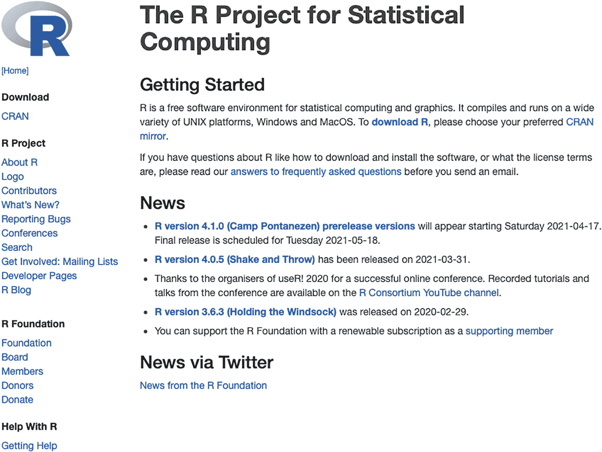
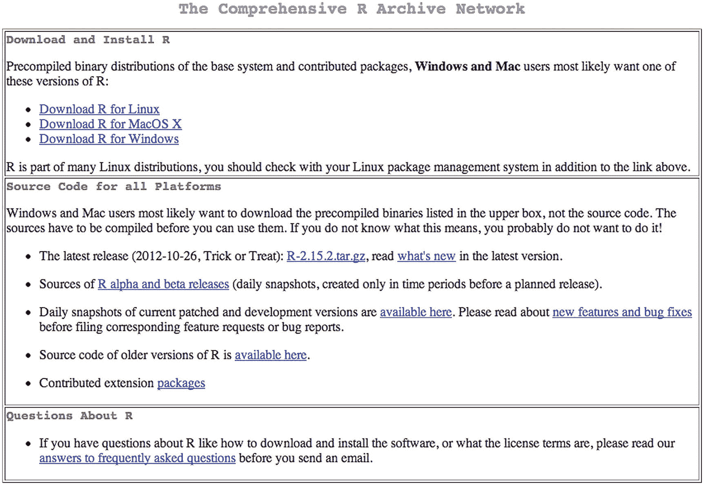
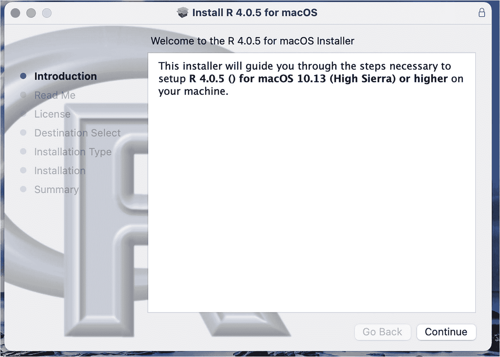
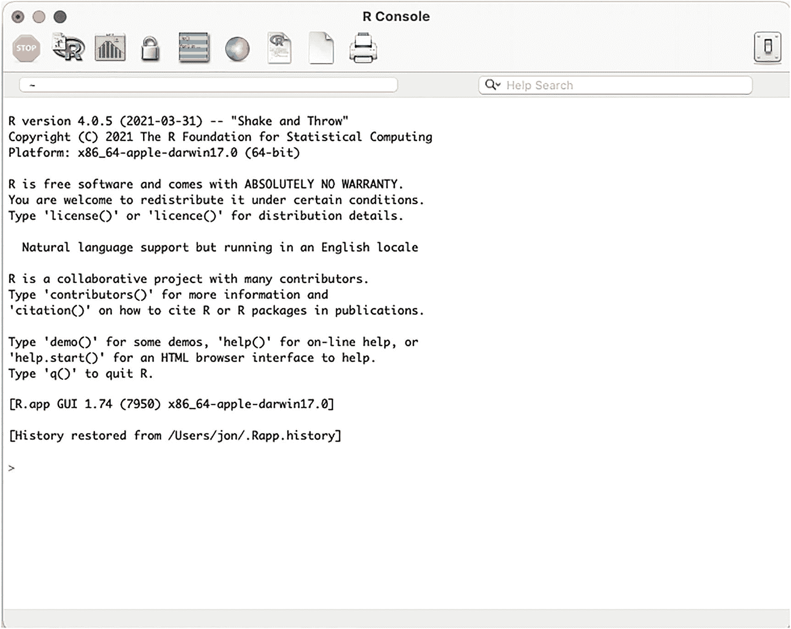
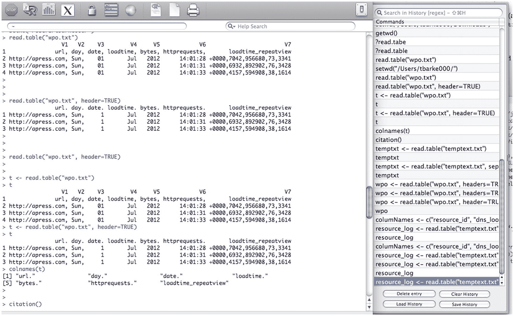
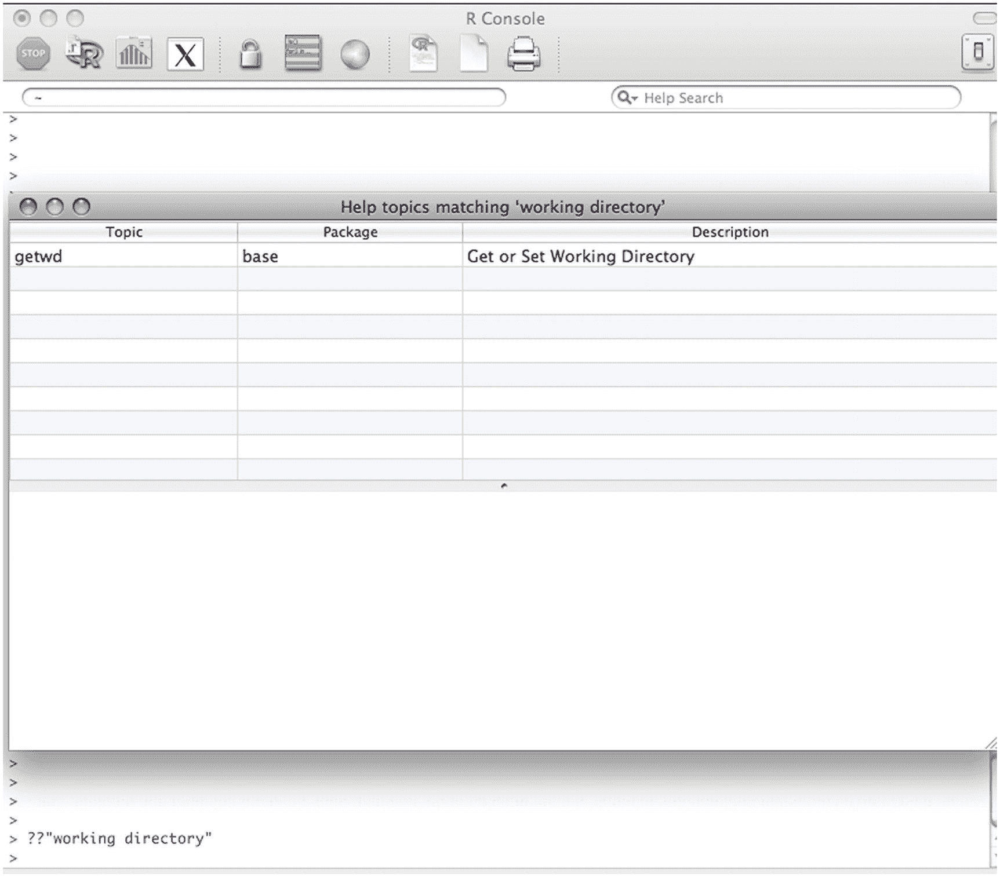
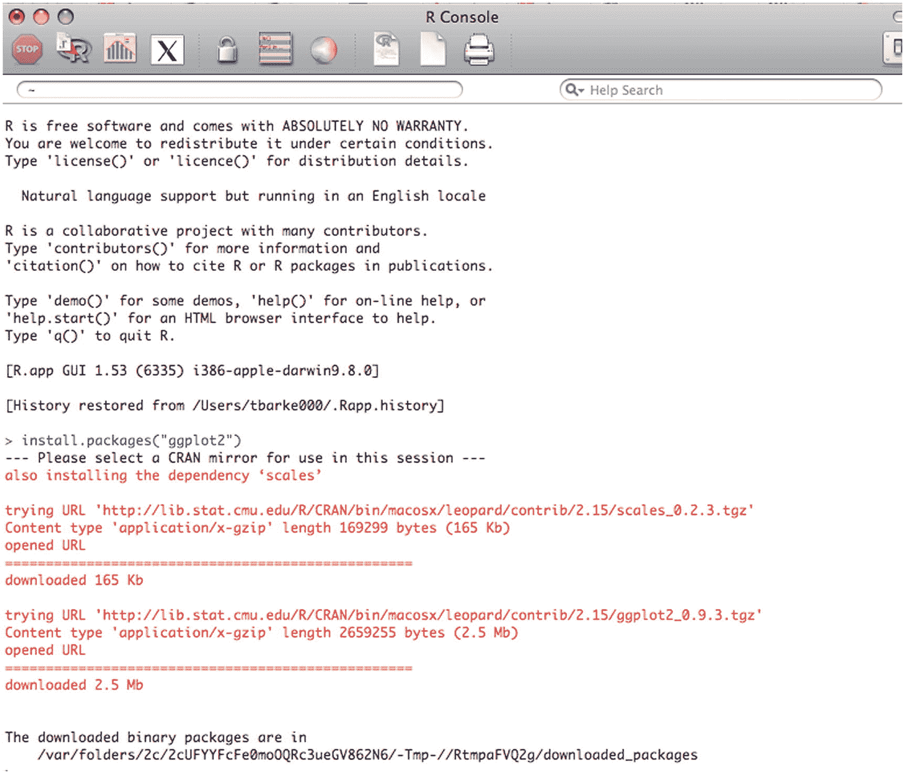
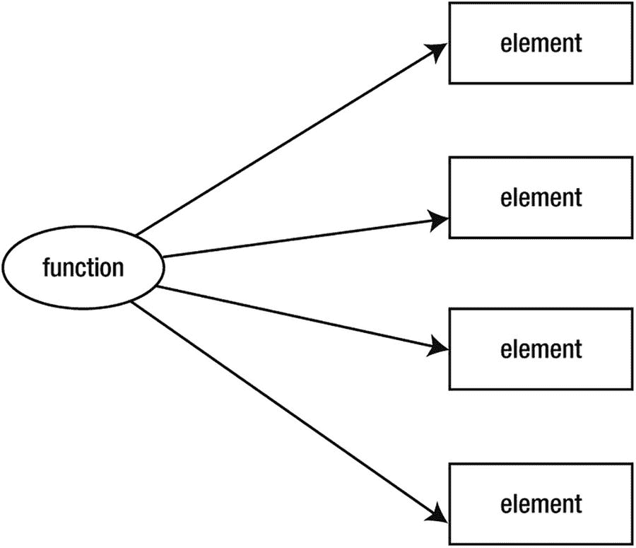

# 二、R 语言入门

在上一章中，我们定义了什么是数据可视化，看了一点媒体的历史，并探索了创建它们的过程。本章深入探讨了创建数据可视化最重要的工具之一:r。

在创建数据可视化时，R 是分析数据和创建可视化不可或缺的工具。我们将在本书的其余部分广泛使用 R，所以我们最好先设置水平。

r 既是一种环境，也是一种语言，用于运行统计计算和生成数据图形。它是由罗斯·伊哈卡和罗伯特·绅士于 1993 年在奥克兰大学创建的。R 环境是您开发和运行 R 的运行时环境。R 语言是你用来开发的编程语言。

r 是 S 语言的继承者，S 语言是一种统计编程语言，于 1976 年诞生于贝尔实验室。

## 了解 R 控制台

让我们从下载和安装 R 开始。R 可以从位于 [`www.r-project.org/`](http://www.r-project.org/) 的 R 基金会获得。R 基金会主页截图见图 [2-1](#Fig1) 。



图 2-1

R 基金会主页

可从综合 R 档案网(CRAN)网站获得预编译二进制: [`http://cran.r-project.org/`](http://cran.r-project.org/) (见图 [2-2](#Fig2) )。我们只需选择我们的操作系统和我们想要的 R 版本，就可以开始下载了。



图 2-2

CRAN 网站

下载完成后，我们可以运行安装程序。macOS 的 R 安装程序截图见图 [2-3](#Fig3) 。



图 2-3

r 在 Mac 上安装

一旦我们完成了安装，我们就可以启动 R 应用程序，并且我们会看到 R 控制台，如图 [2-4](#Fig4) 所示。



图 2-4

R 控制台

### 命令行

R 控制台是奇迹发生的地方！这是一个命令行环境，我们可以在其中运行 R 表达式。提高 R 语言速度的最好方法是在控制台中编写脚本，一次编写一部分，通常是尝试您正在尝试做的事情，并对其进行调整，直到获得您想要的结果。当您最终有了一个工作示例时，获取您想要的代码，并将其保存为 R 脚本文件。

R 脚本文件只是包含纯 R 的文件，可以在控制台中使用`source`命令运行:

```r
> source("someRfile.R")

```

查看前面的代码片段，我们假设 R 脚本位于当前的工作目录中。我们可以使用`getwd()`函数查看当前工作目录的方式是:

```r
> getwd()
[1] "/Users/tomjbarker"

```

我们也可以使用`setwd()`函数来设置工作目录。注意，除非保存会话，否则对工作目录所做的更改不会跨 R 会话持久化。

```r
> setwd("/Users/tomjbarker/Downloads")
> getwd()
[1] "/Users/tomjbarker/Downloads"

```

### 命令历史

R 控制台存储您输入的命令，您可以通过按向上箭头在前面的命令之间循环。点击 escape 按钮返回到命令提示符。我们可以通过单击控制台顶部的“显示/隐藏命令历史记录”按钮，在单独的窗口窗格中查看历史记录。“显示/隐藏命令历史记录”按钮是带有黄色和绿色交替条纹的矩形图标。参见图 [2-5](#Fig5) 中显示命令历史的 R 控制台。



图 2-5

显示命令历史的 r 控制台

### 访问文档

要阅读关于特定函数或关键字的 R 文档，只需在关键字前键入一个问号:

```r
> ?setwd

```

如果要在文档中搜索特定的单词或短语，可以在搜索查询前键入两个问号:

```r
> ??"working directory"

```

这段代码启动一个显示搜索结果的窗口(见图 [2-6](#Fig6) )。“搜索结果”窗口中包含搜索短语的每个主题都有一行，其中包含帮助主题的名称、帮助主题所讨论的功能所在的包以及帮助主题的简短描述。



图 2-6

帮助搜索结果窗口

### 包装

说到包裹，它们到底是什么？*包*是函数、数据集或对象的集合，可以导入到当前会话或工作区，以扩展我们在 r 中的功能。任何人都可以制作包并分发它。

要安装一个软件包，我们只需输入:

```r
install.packages([package name])

```

例如，如果我们想要安装`ggplot2`包——这是一个广泛使用且非常方便的图表包——我们只需在控制台中键入:

```r
> install.packages("ggplot2")

```

系统会立即提示我们选择想要使用的镜像位置，通常是离我们当前位置最近的位置。从那里开始安装。我们可以在图 [2-7](#Fig7) 中看到结果。



图 2-7

安装 ggplot2 软件包

压缩后的包被下载并展开到我们的 R 安装中。

如果我们想要使用已经安装的包，我们必须首先将它包含在我们的工作区中。为此，我们使用`library()`函数:

```r
> library(ggplot2)

```

可在此处找到 CRAN 提供的套餐列表: [`http://cran.r-project.org/web/packages/available_packages_by_name.html`](http://cran.r-project.org/web/packages/available_packages_by_name.html) 。

要查看已经安装的软件包列表，我们可以简单地调用不带参数的`library()`函数(根据您的安装和环境，您的软件包列表可能会有所不同):

```r
> library()
Packages in library '/Library/Frameworks/R.framework/Versions/2.15/Resources/library':
barcode                         Barcode distribution plots
base                            The R Base Package
boot                            Bootstrap Functions (originally by Angelo Canty for S)
class                           Functions for Classification
cluster                         Cluster Analysis Extended Rousseeuw et al.
codetools                       Code Analysis Tools for R
colorspace                      Color Space Manipulation
compiler                        The R Compiler Package
datasets                        The R Datasets Package
dichromat                       Color schemes for dichromats
digest                          Create cryptographic hash digests of R objects
foreign                         Read Data Stored by Minitab, S, SAS, SPSS, Stata, Systat, dBase,
                               ...
ggplot2                         An implementation of the Grammar of Graphics
gpairs                          gpairs: The Generalized Pairs Plot
graphics                        The R Graphics Package
grDevices                       The R Graphics Devices and Support for Colours and Fonts
grid                            The Grid Graphics Package
gtable                          Arrange grobs in tables
KernSmooth                      Functions for kernel smoothing for Wand & Jones (1995)
labeling                        Axis Labeling
lattice                         Lattice Graphics
mapdata                         Extra Map Databases
mapproj                         Map Projections
maps                            Draw Geographical Maps

```

## 导入数据

现在我们的环境已经下载并安装好了，我们知道如何安装我们可能需要的任何包。现在我们可以开始使用 r。

我们通常要做的第一件事是导入您的数据。有几种方法可以导入数据，但最常用的方法是使用`read()`函数，它有几种风格:

```r
read.table("[file to read]")
read.csv(["file to read"])

```

为了看到这一点，让我们首先创建一个名为`temptext.txt`的文本文件，格式如下:

```r
134,432,435,313,11
403,200,500,404,33
77,321,90,2002,395

```

我们可以将它读入一个名为`temptxt`的变量:

```r
> temptxt <- read.table("temptext.txt")

```

注意，当我们给这个变量赋值时，我们没有使用等号作为赋值操作符。我们改为使用箭头`<-`。这是 R 的赋值操作符，尽管如果你愿意，它也支持等号。但是标准是箭头，我们将在本书中展示的所有示例都将使用箭头。

如果我们打印出`temptxt`变量，我们会看到它的结构如下:

```r
> temptxt
                 V1
1 134,432,435,313,11
2 403,200,500,404,33
3 77,321,90,2002,395

```

我们看到我们的变量是一个叫做*数据帧*的类似表格的结构，R 为我们的数据结构分配了一个列名(`V1`)和行 id。很快会有更多关于列名的内容。

`read()`函数有许多参数，一旦数据被导入，您可以使用这些参数来优化数据导入和格式化的方式。

### 使用标题

`header`参数告诉 R 将外部文件中的第一行视为包含头信息。第一行成为数据框的列名。

例如，假设我们有一个日志文件，其结构如下:

```r
url, day, date, loadtime, bytes, httprequests, loadtime_repeatview
http://apress.com , Sun, 01 Jul 2012 14:01:28 +0000,7042,956680,73,3341
http://apress.com , Sun, 01 Jul 2012 14:01:31 +0000,6932,892902,76,3428
http://apress.com , Sun, 01 Jul 2012 14:01:33 +0000,4157,594908,38,1614

```

我们可以像这样将它加载到一个名为`wpo`的变量中:

1.  [T0](http://apress.com)T1】

2.  [T0](http://apress.com)T1】

3.  [T0](http://apress.com)T1】

```r
> wpo <- read.table("wpo.txt", header=TRUE, sep=",")
> wpo
  url  day date loadtime bytes httprequests loadtime_repeatview

```

当我们调用`colnames()`函数来查看`wpo`的列名时，我们会看到以下内容:

```r
> colnames(wpo)
[1] "url"     "day"     "date"     "loadtime"
[5] "bytes"     "httprequests"     "loadtime_repeatview"

```

### 指定字符串分隔符

`sep`属性告诉`read()`函数使用什么作为字符串分隔符来解析外部数据文件中的列。在我们到目前为止看到的所有例子中，逗号是我们的分隔符(正如我们在 wpo 的那一行中明确告诉 R 的那样)，但是我们可以使用竖线`|`或任何其他我们想要的字符。

比方说，我们前面的`temptxt`例子使用了管道；我们只需将代码更新如下:

1.  `134 432 435 313 11`

2.  `403 200 500 404 33`

3.  `77 321 90 2002 395`

```r
134|432|435|313|11
403|200|500|404|33
77|321|90|2002|395
> temptxt <- read.table("temptext.txt", sep="|")
> temptxt
  V1  V2  V3   V4  V5

```

哦，注意到了吗？这次我们实际上得到了不同的列名(`V1`、`V2`、`V3`、`V4`、`V5`)。之前，我们没有指定分隔符，所以 R 假设每一行都是一大块文本，并将其集中成一列(`V1`)。

### 指定行标识符

属性允许我们为我们的行指定标识符。默认情况下，正如我们在前面的例子中看到的，R 使用递增的数字作为行 id。请记住，每行的行名必须是唯一的。

记住这一点，让我们看一下导入一些不同的日志数据，这些数据具有唯一 URL 的性能指标:

```r
url, day, date, loadtime, bytes, httprequests, loadtime_repeatview
http://apress.com, Sun, 01 Jul 2012 14:01:28 +0000,7042,956680,73,3341
http://google.com, Sun, 01 Jul 2012 14:01:31 +0000,6932,892902,76,3428
http://apple.com, Sun, 01 Jul 2012 14:01:33 +0000,4157,594908,38,1614

```

当我们读入数据时，我们将确保指定将`url`列中的数据用作数据框的行名:

```r
> wpo <- read.table("wpo.txt", header=TRUE, sep=",", row.names="url")
> wpo
                    day  date                          loadtime   bytes         httprequests  loadtime_repeatview
http://apress.com   Sun  01 Jul 2012 14:01:28  +0000   7042       956680         73            3341
http://google.com   Sun  01 Jul 2012 14:01:31  +0000   6932       892902         76            3428
http://apple.com    Sun  01 Jul 2012 14:01:33  +0000   4157       594908         38            31614

```

### 使用自定义列名

我们开始吧。但是如果我们想要列名，但是文件中的第一行不是标题信息呢？我们可以使用`col.names`参数来指定一个可以用作列名的向量。

让我们来看看。在本例中，我们将使用之前使用的竖线分隔的文本文件:

```r
134|432|435|313|11
403|200|500|404|33
77|321|90|2002|395

```

首先，我们将创建一个名为`columnNames`的向量，它将保存我们将用作列名的字符串:

```r
> columnNames <- c("resource_id", "dns_lookup", "cache_load", "file_size", "server_response")

```

然后，我们将读入数据，将我们的向量传递给`col.names`参数:

```r
> resource_log <- read.table("temptext.txt", sep="|", col.names=columnNames)
> resource_log
 resource_id dns_lookup cache_load file_size server_response
1        134        432        435       313              11
2        403        200        500       404              33
3         77        321         90      2002             395

```

## 数据结构和数据类型

在前面的例子中，我们触及了很多概念；我们创造了变量，包括向量和数据框架；但我们没怎么谈论它们是什么。让我们后退一步，看看 R 支持的数据类型以及如何使用它们。

R 中的数据类型称为*模式*，可以是以下几种:

*   数字的

*   性格；角色；字母

*   逻辑学的

*   复杂的

*   生的

*   目录

我们可以使用`mode()`函数来检查变量的模式。

字符和数字模式对应于字符串和数字(整数和浮点)数据类型。逻辑模式是布尔值。

```r
> n <- 122132
> mode(n)
[1] "numeric"
> c <- "test text"
> mode(c)
[1] "character"
> l <- TRUE
> mode(l)
[1] "logical"

```

我们可以使用`paste()`函数执行字符串连接。我们可以使用`substr()`函数从字符串中提取字符。让我们看一些代码中的例子。

通常，我会保存一个目录列表，我可以从中读取数据或向其中写入图表。然后，当我想要引用数据目录中存在的新数据文件时，我只需将新文件名附加到数据目录中:

```r
> dataDirectory <- "/Users/tomjbarker/org/data/"
> buglist <- paste(dataDirectory, "bugs.txt", sep="")
> buglist
[1] "/Users/tomjbarker/org/data/bugs.txt"

```

`paste()`函数获取`N`数量的字符串并将它们连接在一起。它接受一个名为`sep`的参数，这个参数允许我们指定一个字符串，我们可以用它作为连接字符串之间的分隔符。我们不希望任何东西来分隔我们传入的空字符串。

如果我们想从字符串中提取字符，我们使用`substr()`函数。`substr()`函数接受一个要解析的字符串、一个起始位置和一个终止位置。它返回从起始位置到结束位置的所有字符。(请记住，在 R 中，列表不像大多数其他语言那样基于 0，而是从 1 开始索引。)

```r
> substr("test", 1,2)
[1] "te"

```

在前面的例子中，我们传入字符串“test”并告诉`substr()`函数返回第一个和第二个字符。

复数模式适用于复数。原始模式用于存储原始字节数据。

列表数据类型或模式可以是以下三类之一:向量、矩阵或数据框。如果我们为向量或矩阵调用`mode()`,它们返回它们包含的数据的模式；`class()`返回类。如果我们在数据帧上调用`mode()`，它返回类型`list`。

```r
> v <- c(1:10)
> mode(v)
[1] "numeric"
> m <- matrix(c(1:10), byrow=TRUE)
> mode(m)
[1] "numeric"
> class(m)
[1] "matrix" "array"
> d <- data.frame(c(1:10))
> mode(d)
[1] "list"
> class(d)
[1] "data.frame"

```

请注意，我们只是键入了`1:10`，而不是 1 到 10 之间的整个数字序列:

```r
v <- c(1:10)

```

向量是一维数组，一次只能保存单一模式的值。当我们谈到数据框架和矩阵时，R 才真正开始变得有趣。接下来的两节将介绍这些类。

### 数据帧

我们在本章开始时看到,`read()`函数接收外部数据并将其保存为数据帧。数据帧就像大多数其他松散类型语言中的数组:它们是保存不同类型数据的容器，由索引引用。但是，需要认识到的主要问题是，数据框将它们包含的数据视为行、列以及两者的组合。

例如，假设数据帧的格式如下:

```r
      col  col  col  col  col
row [ 1 ] [ 1 ] [ 1 ] [ 1 ] [ 1 ]
row [ 1 ] [ 1 ] [ 1 ] [ 1 ] [ 1 ]
row [ 1 ] [ 1 ] [ 1 ] [ 1 ] [ 1 ]
row [ 1 ] [ 1 ] [ 1 ] [ 1 ] [ 1 ]

```

如果我们试图引用前面数据帧中的第一个索引，就像我们传统上使用数组一样，比如说`dataframe[1]`，R 将返回数据的第一列，而不是第一项。因此数据框是通过它们的列和行来引用的。所以`dataframe[1]`返回第一列，`dataframe[,2]`返回第一行。

让我们用代码演示一下。

首先，让我们使用组合函数`c()`创建一些向量。请记住，向量是同一类型的数据集合。combine 函数接受一系列值，并将它们组合成向量。

```r
> col1 <- c(1,2,3,4,5,6,7,8)
> col2 <- c(1,2,3,4,5,6,7,8)
> col3 <- c(1,2,3,4,5,6,7,8)
> col4 <- c(1,2,3,4,5,6,7,8)

```

然后，让我们将这些向量组合成一个数据帧:

```r
> df <- data.frame(col1,col2,col3,col4)

```

现在让我们打印数据框以查看其内容和结构:

```r
> df
    col1 col2 col3 col4
1    1    1    1    1
2    2    2    2    2
3    3    3    3    3
4    4    4    4    4
5    5    5    5    5
6    6    6    6    6
7    7    7    7    7
8    8    8    8    8

```

请注意，它采用了每个向量，并使每个向量成为一列。还要注意，每一行都有一个 ID；默认情况下，它是一个数字，但我们可以覆盖它。

如果我们引用第一个索引，我们会看到数据框返回第一列:

```r
> df[1]
 col1
1    1
2    2
3    3
4    4
5    5
6    6
7    7
8    8

```

如果我们在 1 前面加一个逗号，我们引用第一行:

```r
> df[,1]
[1] 1 2 3 4 5 6 7 8

```

因此，通过指定`[column, row]`来访问数据帧的内容。

矩阵的工作方式大致相同。

### 矩阵

*矩阵*就像数据框一样，它们包含行和列，可以被任意一个引用。两者的核心区别在于数据帧可以保存不同的数据类型，而矩阵只能保存一种类型的数据。

这体现了哲学上的差异。通常，您使用数据框来保存从外部读入的数据，比如从平面文件或数据库中读入的数据，因为这些数据通常是混合型的。您通常将数据存储在要应用函数的矩阵中(稍后将详细介绍如何对列表应用函数)。

要创建一个矩阵，我们必须使用`matrix()`函数，传入一个向量，并告诉该函数如何分配向量:

*   `nrow`参数指定矩阵应该有多少行。

*   `ncol`参数指定列的数量。

*   `byrow`参数告诉 R，如果`TRUE`的话，向量的内容应该通过跨行迭代来分布，如果`FALSE`的话，应该通过列来分布。

```r
> content <- c(1,2,3,4,5,6,7,8,9,10)
> m1 <- matrix(content, nrow=2, ncol=5, byrow=TRUE)
> m1
    [,1] [,2] [,3] [,4] [,5]
[1,]    1    2    3    4    5
[2,]    6    7    8    9   10
>

```

注意，在前面的例子中,`m1`矩阵是一行一行水平填充的。在下面的例子中，`m1`矩阵是按列垂直填充的:

```r
> content <- c(1,2,3,4,5,6,7,8,9,10)
> m1 <- matrix(content, nrow=2, ncol=5, byrow=FALSE)
> m1
    [,1] [,2] [,3] [,4] [,5]
[1,]    1    3    5    7    9
[2,]    2    4    6    8   10

```

请记住，如果这些数字是一个序列，我们可以只键入以下内容，而不是手动键入前面的`content`向量中的所有数字:

```r
content <- (1:10)

```

我们用方括号引用矩阵中的内容，分别指定行和列:

```r
> m1[1,4]
[1] 7

```

如果数据帧只包含单一类型的数据，我们可以将数据帧转换为矩阵。为此，我们使用了`as.matrix()`函数。通常，我们会在将数据框传递给绘图函数以绘制图表时这样做。

```r
> barplot(as.matrix(df))

```

在下文中，我们创建了一个名为`df`的数据帧。我们用十个连续的数字填充数据帧。然后我们使用`as.matrix()`将`df`转换成一个矩阵，并将结果保存到一个名为`m`的新变量中。

```r
> df <- data.frame(1:10)
> df
  X1.10
1      1
2      2
3      3
4      4
5      5
6      6
7      7
8      8
9      9
10     10
> class(df)
[1] "data.frame"
> m <- as.matrix(df)
> class(m)
[1] "matrix" "array"

```

请记住，因为它们都是相同的数据类型，矩阵需要的开销更少，本质上比数据帧更有效。如果我们比较我们的矩阵`m`和我们的数据帧`df`的大小，我们看到只有十个项目，存在大小差异。

```r
> object.size(m)
552 bytes
> object.size(df)
776 bytes

```

也就是说，如果我们扩大规模，效率的提高并不等同。比较以下内容:

```r
> big_df <- data.frame(1:40000000)
> big_m <- matrix(1:40000000)
> object.size(big_m)
160000216 bytes
> object.size(big_df)
160000736 bytes

```

我们可以看到，小数据集的第一个示例显示矩阵比数据框小 30 %,但在第二个示例的较大比例中，矩阵仅比数据框小 0 . 00018%。

### 添加列表

当组合或添加数据帧或矩阵时，通常使用`rbind()`或`cbind()`按行或按列进行添加。

为了演示这一点，让我们向数据框`df`添加一个新行。我们将把`df`和新行一起传递给`rbind()`并添加到`df`。新行只包含一个元素，数字 11。

```r
> df <- rbind(df, 11)
> df
  X1.10
1      1
2      2
3      3
4      4
5      5
6      6
7      7
8      8
9      9
10     10
11     11

```

现在让我们向矩阵`m`中添加一个新列。为此，我们简单地将`m`作为第一个参数传递给`cbind()`；第二个参数是将被追加到新列的新矩阵。

```r
> m <- rbind(m, 11)
> m <- cbind(m, matrix(c(50:60), byrow=FALSE))
> m
     X1.10
[1,]     1  50
[2,]     2  51
[3,]     3  52
[4,]     4  53
[5,]     5  54
[6,]     6  55
[7,]     7  56
[8,]     8  57
[9,]     9  58
[10,]    10 59
[11,]    11 60

```

你可能会问，向量呢？好吧，让我们看看添加到我们的`content`向量。我们只需使用 combine 函数将当前向量与一个新向量合并:

```r
> content <- c(1,2,3,4,5,6,7,8,9,10)
> content <- c(content, c(11:20))
> content
[1]  1  2  3  4  5  6  7  8  9 10 11 12 13 14 15 16 17 18 19 20

```

### 遍历列表

作为通常使用过程化语言工作的开发人员，或者至少是使用过程化语言的开发人员(尽管近年来函数式编程范式变得更加主流)，当我们想要处理数组中的数据时，我们很可能习惯于遍历数组。这与纯函数式语言相反，在纯函数式语言中，我们会将函数应用于列表，比如`map()`函数。r 支持这两种范式。让我们首先看看如何循环遍历我们的列表。

R 支持的最有用的循环是`for in`循环。这里可以看到`for in`回路的基本结构:

```r
> for(i in 1:5){print(i)}
[1] 1
[1] 2
[1] 3
[1] 4
[1] 5

```

变量`i`的值在迭代的每一步中递增。我们可以使用`for in`循环遍历列表。我们可以指定一个特定的列进行迭代，如下所示，我们循环遍历数据帧`df`的 X1.10 列。

```r
> for(n in df$X1.10){ print(n)}
[1] 1
[1] 2
[1] 3
[1] 4
[1] 5
[1] 6
[1] 7
[1] 8
[1] 9
[1] 10
[1] 11

```

注意，我们是通过美元符号操作符来访问数据帧的列的。大致格局是`[data frame]$[column name]`。

### 将函数应用于列表

但是 R 真正想被使用的方式是对列表的内容应用函数(见图 [2-8](#Fig8) )。



图 2-8

对列表元素应用函数

我们在 R 中用`apply()`函数来做这件事。

`apply()`函数有几个参数:

*   首先是我们的列表。

*   接下来是一个数字向量，表示我们如何在列表中应用这个函数(`1`表示行，`2`表示列，`c[1,2]`表示行和列)。

*   最后是应用于列表的函数:

```r
apply([list], [how to apply function], [function to apply])

```

让我们看一个例子。让我们做一个新的矩阵，我们称之为`m`。矩阵`m`将有十列和四行:

```r
> m <- matrix(c(1:40), byrow=FALSE, ncol=10)
> m
    [,1] [,2] [,3] [,4] [,5] [,6] [,7] [,8] [,9] [,10]
[1,]    1    5    9   13   17   21   25   29   33    37
[2,]    2    6   10   14   18   22   26   30   34    38
[3,]    3    7   11   15   19   23   27   31   35    39
[4,]    4    8   12   16   20   24   28   32   36    40

```

现在，假设我们想要递增`m`矩阵中的每个数字。我们可以简单地如下使用`apply()`:

```r
> apply(m, 2, function(x) x <- x + 1)
    [,1] [,2] [,3] [,4] [,5] [,6] [,7] [,8] [,9] [,10]
[1,]    2    6   10   14   18   22   26   30   34    38
[2,]    3    7   11   15   19   23   27   31   35    39
[3,]    4    8   12   16   20   24   28   32   36    40
[4,]    5    9   13   17   21   25   29   33   37    41

```

你看到我们在那里做了什么吗？我们传入了`m`，我们指定我们想要跨列应用函数，最后我们传入了一个*匿名函数*。该函数接受一个我们称为`x`的参数。参数`x`是对当前矩阵元素的引用。从这里开始，我们只需将`x`的值增加 1。

好吧，假设我们想做一些稍微有趣的事情，比如将矩阵中的所有偶数归零。我们可以做到以下几点:

```r
> apply(m,c(1,2),function(x){if((x %% 2) == 0) x <- 0 else x <- x})
    [,1] [,2] [,3] [,4] [,5] [,6] [,7] [,8] [,9] [,10]
[1,]    1    5    9   13   17   21   25   29   33    37
[2,]    0    0    0    0    0    0    0    0    0     0
[3,]    3    7   11   15   19   23   27   31   35    39
[4,]    0    0    0    0    0    0    0    0    0     0

```

为了清楚起见，让我们分解一下我们正在应用的函数。我们只是通过检查当前元素除以 2 时是否有余数来检查它是否是偶数。如果是，我们将其设置为零；如果不是，我们把它设定为它自己:

```r
function(x){
    if((x %% 2) == 0)
         x <- 0
    else
         x <- x
}

```

### 功能

说到函数，在 R 中创建函数的语法与大多数其他语言非常相似。我们使用`function`关键字，给函数起一个名字，用左括号和右括号指定参数，并用花括号将函数体括起来:

```r
function [function name]([argument])
{
    [body of function]
}

```

R 允许的有趣的东西是`...`参数(有时称为点参数)。这允许我们向函数传递可变数量的参数。在该函数中，我们可以将`...`参数转换成一个列表，并遍历该列表以检索其中的值:

```r
> offset <- function (...){
    for(i in list(...)){
         print(i)
    }
}
> offset(23,11)
[1] 23
[1] 11

```

我们甚至可以在`...`参数中存储不同数据类型(模式)的值:

```r
> offset("test value", 12, 100, "19ANM")
[1] "test value"
[1] 12
[1] 100
[1] "19ANM"

```

r 使用词法范围。这意味着当我们调用一个函数并试图引用没有在该函数的局部范围内定义的变量时，R 解释器会在创建该函数的工作区或范围内寻找这些变量。如果 R 解释器在那个作用域中找不到那些变量，它就在那个作用域的父作用域中查找。

如果我们在函数 B 中创建一个函数 A，那么函数 A 的创建范围就是函数 B，例如，参见下面的代码片段:

```r
> x <- 10
> wrapper <- function(y){
     x <- 99
     c<- function(y){
          print(x + y)
     }
     return(c)
}
> t <- wrapper()
> t(1)
[1] 100
> x
[1] 10

```

我们在全局空间中创建了一个变量`x`，并赋予它一个值`10`。我们创建了一个函数，命名为`wrapper`，并让它接受一个名为`y`的参数。在`wrapper()`函数中，我们创建了另一个名为`x`的变量，并赋予它一个值`99`。我们还创建了一个名为`c`的函数。函数`wrapper()`将参数`y`传递给函数`c()`，函数`c()`输出`x`加到`y`的值。最后，`wrapper()`函数返回`c()`函数。

我们创建了一个变量`t`，并将其设置为`wrapper()`函数的返回值，也就是函数`c()`。当我们运行`t()`函数并传入一个值`1`时，我们看到它输出`100`，因为它从函数`wrapper()`中引用变量`x`。

能够进入已经执行的函数的范围被称为*闭包*。

但是，你可能会问，我们如何确定我们正在执行返回的函数，而不是每次都重新运行`wrapper()`？r 有一个非常好的特性，如果你输入不带括号的函数名，解释器会输出函数体。

当我们这样做时，我们实际上是在引用返回的函数，并使用闭包来引用`x`变量:

```r
> t
function(y){
         print(x + y)
    }
<environment: 0x17f1d4c4>

```

## 摘要

在这一章中，我们下载并安装了 R。我们探索了命令行，检查了数据类型，并开始运行导入到 R 环境中的数据以供分析。我们看了列表，如何创建列表、添加列表、循环列表，以及对列表中的元素应用函数。

我们看了函数，讨论了词法范围，并了解了如何在 r 中创建闭包。

下一章，我们将更深入地研究 R，看看对象，用 R 中的统计分析来熟悉一下，并探索创建 R Markdown 文档以便在 Web 上分发。