# 三、对 R 的深入探究

最后一章探索了 R 中的一些介绍性概念，从使用控制台到导入数据。我们安装了包并讨论了数据类型，包括不同的列表类型。我们最后讨论了函数并创建了闭包。

本章将着眼于 R 中面向对象的概念，探索统计分析中的概念，最后看看 R 如何被合并到 R Markdown 中用于实时分发。

## R 语言中的面向对象编程

r 支持两种不同的创建对象的系统:S3 和 S4 方法。S3 是 r 中处理对象的默认方式。我们一直在使用和制作 S3 对象。S4 是一种在 R 中创建对象的新方法，它有更多的内置验证，但是开销更大。让我们来看看这两种方法。

好了，传统的、基于类的、面向对象的设计的特点是创建类，这些类是实例化对象的蓝图(见图 [3-1](#Fig1) )。

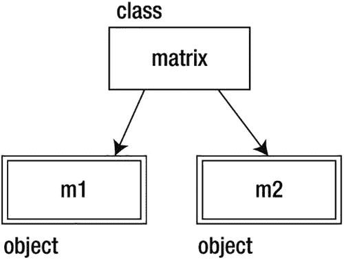

图 3-1

matrix 类用于创建变量`m1`和`m2`，两者都是矩阵

在非常高的层次上，在传统的面向对象语言中，类可以扩展其他类来继承父类的行为，类也可以实现接口，接口是定义对象的公共签名应该是什么的契约。参见图 [3-2](#Fig2) 中的一个例子，其中我们创建了一个`IUser`接口来描述任何用户类型类的公共接口，以及一个`BaseUser`类来实现接口并提供基本功能。在某些语言中，我们可能会将`BaseUser`变成一个抽象类，一个可以扩展但不能直接实例化的类。`User`和`SuperUser`类扩展了`BaseClass`，并为自己的目的定制了现有的功能。

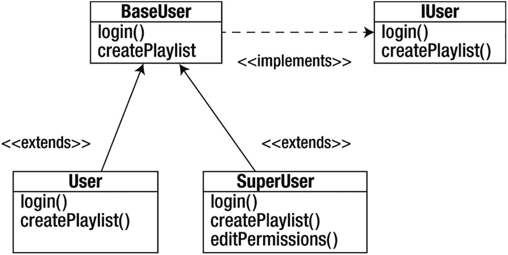

图 3-2

一个由子类`User`和`SuperUser`扩展的超类`BaseUser`实现的`IUser`接口

还存在多态性的概念，我们可以通过继承链改变功能。具体来说，我们将从基类继承一个函数，但覆盖它，保持签名(函数名、它接受的参数类型和数量以及它返回的数据类型)不变，但改变函数的功能。将重写函数与重载函数的概念进行比较，重载函数的名字相同，但签名和功能不同。

### S3 班级

S3，之所以这么叫是因为它首先在 S 语言的版本 3 中实现，它使用了一个叫做**通用函数**的概念。R 中的所有东西都是一个对象，每个对象都有一个名为`class`的字符串属性，表示对象是什么。它周围没有验证，我们可以临时覆盖`class`属性。这就是 S3 的主要问题——缺乏认可。如果您曾经在尝试使用一个函数时返回了一个深奥的错误消息，那么您很可能亲身经历了这种缺乏验证的后果。错误消息可能不是由 R 检测到传入了不正确的类型而生成的，而是由试图执行传入内容的函数在执行过程中的某个步骤失败而生成的。

请参见下面的代码，其中我们创建了一个矩阵，并将其类更改为 vector:

```r
> m <- matrix(c(1:10), nrow=2)
> m
   [,1] [,2] [,3] [,4] [,5]
[1,]    1    3    5    7    9
[2,]    2    4    6    8   10
> class(m) <- "vector"
> m
   [,1] [,2] [,3] [,4] [,5]
[1,]    1    3    5    7    9
[2,]    2    4    6    8   10
attr(,"class")
[1] "vector"

```

通用函数是检查传递给它们的对象的`class`属性的对象，并根据该属性表现出不同的行为。这是实现多态性的好方法。通过将通用函数传递给`methods()`函数，我们可以看到通用函数使用的方法。下面的代码展示了`plot()`通用函数的方法:

```r
> methods(plot)
[1] plot.acf*            plot.data.frame*    plot.decomposed.ts*        plot.default        plot.dendrogram*
[6] plot.density         plot.ecdf           plot.factor*        plot.formula*       plot.function
[11] plot.hclust*        plot.histogram*     plot.HoltWinters*          plot.isoreg*        plot.lm
[16] plot.medpolish*     plot.mlm            plot.ppr*                  plot.prcomp*        plot.princomp*
[21] plot.profile.nls*   plot.spec           plot.stepfun               plot.stl*           plot.table*
[26] plot.ts             plot.tskernel*      plot.TukeyHSD
Non-visible functions are asterisked

```

请注意，在通用的`plot()`函数中有无数的方法来处理可以传递给它的所有不同类型的数据，例如当我们将数据帧传递给`plot();`或者如果我们想要绘制一个`TukeyHSD`对象`plot()`，`plot.TukeyHSD`已经为我们准备好了。

Note

类型**？TukeyHSD** 了解关于该对象的更多信息。

现在你已经知道了 S3 面向对象的概念在 R 中是如何工作的，让我们看看如何创建我们自己的定制 S3 对象和通用函数。

S3 类是一个属性和函数的列表，其属性名为`class`。属性告诉通用函数如何处理实现特定类的对象。让我们使用图 [3-2](#Fig2) 中的`UserClass`想法来创建一个例子:

```r
> tom <- list(userid = "tbarker", password = "password123", playlist=c(12,332,45))
> class(tom) <- "user"

```

我们可以通过使用`attributes()`函数来检查我们的新对象，它告诉我们该对象的属性以及它的类:

```r
> attributes(tom)
$names
[1] "userid"   "password" "playlist"
$class
[1] "user"

```

现在要创建我们可以在新类中使用的通用函数，首先创建一个只处理我们的用户对象的函数；然后将其一般化，这样任何类都可以使用它。这将是`createPlaylist()`函数，它将接受要对其执行操作的用户和要设置的播放列表。这个的语法是`[ function name ].[ class name ]`。注意，我们使用美元符号来访问 S3 对象的属性。

```r
>createPlaylist.user <- function(user, playlist=NULL){
    user$playlist <- playlist
    return(user)
}

```

请注意，当您直接在控制台中键入时，R 使您能够跨越几行而不执行输入，直到您完成一个表达式。你的表达完成后，就会被解读。如果想一次执行几个表达式，可以复制粘贴到命令行中。

让我们测试一下，确保它能按预期工作。它应该将传入对象的`playlist`属性设置为传入的向量:

```r
> tom <- createPlaylist.user(tom, c(11,12))
> tom
$userid
[1] "tbarker"
$password
[1] "password123"
$playlist
[1] 11 12
attr(,"class")
[1] "user"

```

太棒了。现在让我们将`createPlaylist()`函数推广为一个通用函数。为此，我们只需创建一个名为`createPlaylist`的函数，并让它接受一个对象和一个值。在我们的函数中，我们使用`UseMethod()`函数将功能委托给我们特定于类的`createPlaylist()`函数:`createPlaylist.user`。

`UseMethod()`函数是通用函数的核心:它评估对象，确定其类，并分派给正确的特定于类的函数:

```r
> createPlaylist <- function(object, value)
{
      UseMethod("createPlaylist", object)
}

```

现在让我们试试看它是否有效:

```r
> tom <- createPlaylist(tom, c(21,31))
> tom
$userid
[1] "tbarker"
$password
[1] "password123"
$playlist
[1] 21 31
attr(,"class")
[1] "user"

```

太棒了。

### S4 班级

让我们看看 S4 物体。记住，对 S3 的主要抱怨是缺乏验证。S4 通过在类结构中内置开销来解决这一不足。让我们来看看。

首先，我们将创建`user`类。我们用`setClass()`函数来做这件事。

*   `setClass()`函数中的第一个参数是一个字符串，表示我们正在创建的类的名称。

*   下一个参数称为表示，它是命名属性的列表。

```r
setClass("user",
representation(userid="character",
    password="character",
    playlist="vector"
)
)

```

我们可以通过从这个类创建一个新对象来测试它。我们使用`new()`函数来创建该类的一个新实例:

```r
> lynn <- new("user", userid="lynn", password="test", playlist=c(1,2))
> lynn
An object of class "user"
Slot "userid":
[1] "lynn"
Slot "password":
[1] "test"
Slot "playlist":
[1] 1 2

```

非常好。注意，对于 S4 对象，我们使用`@`符号来引用对象的属性:

```r
> lynn@playlist
[1] 1 2
> class(lynn)
[1] "user"
attr(,"package")
[1] ".GlobalEnv

```

让我们通过使用`setMethod()`函数为这个类创建一个通用函数。我们只需传入函数名、类名，然后传入一个匿名函数作为泛型函数:

```r
> setMethod("createPlaylist", "user", function(object, value){
      object@playlist <- value
      return(object)
 })
Creating a generic function from function 'createPlaylist' in the global environment
[1] "createPlaylist"
>

```

让我们试一试:

```r
> lynn <- createPlaylist(lynn, c(1001, 400))
> lynn
An object of class "user"
Slot "userid":
[1] "lynn"
Slot "password":
[1] "test"
Slot "playlist":
[1] 1001  400

```

太棒了。

虽然有些人喜欢 S3 方式的简单和灵活，但有些人喜欢 S4 方式的结构；选择 S3 或 S4 的对象纯粹是个人喜好。我自己更喜欢 S3 的简洁，这也是我们在本书剩余部分要用到的。谷歌在其 R 风格指南中反映了我自己对 S3 的感受，称“除非有充分的理由使用 S4 的对象或方法，否则就使用 S3 的对象和方法。”

## R 中带有描述性度量的统计分析

现在让我们来看看统计分析中的一些概念，以及如何在 r 中实现它们。你可能记得大学统计学导论课上讲过的本章中的大部分概念；它们是开始思考和讨论您的数据所需的基本概念。

首先，让我们获得一些数据，我们将对这些数据进行统计分析。r 预装了许多数据集，我们可以将它们用作样本数据。要查看您安装的可用数据集列表，只需在控制台键入`data()`。您将看到如图 [3-3](#Fig3) 所示的屏幕。

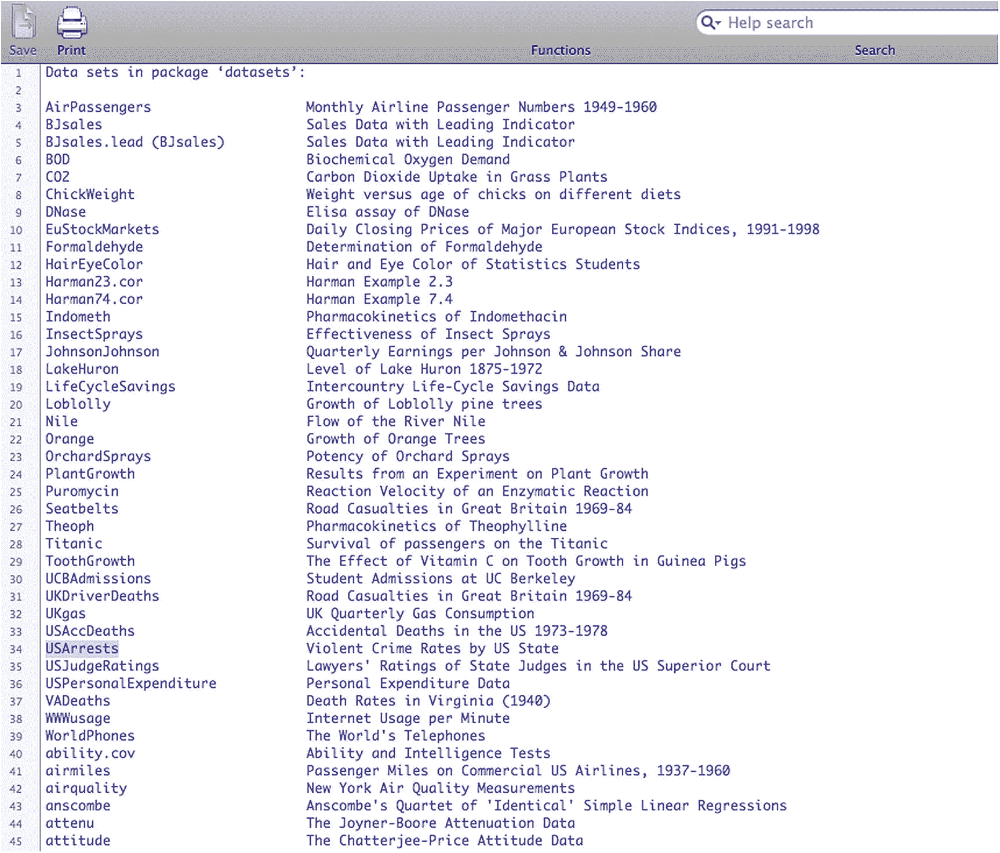

图 3-3

R 中的可用数据集

要查看数据集的内容，您可以在控制台中通过名称调用它。让我们看看`USArrests`数据集，我们将在接下来的几个主题中使用它。

```r
> USArrests
                Murder  Assault   UrbanPop Rape
Alabama          13.2    236       58      21.2
Alaska           10.0    263       48      44.5
Arizona           8.1    294       80      31.0
Arkansas          8.8    190       50      19.5
California        9.0    276       91      40.6
Colorado          7.9    204       78      38.7
Connecticut       3.3     110       77     11.1
Delaware          5.9     238       72     15.8
Florida          15.4     335       80     31.9
Georgia          17.4     211       60     25.8
Hawaii            5.3      46       83     20.2
Idaho             2.6     120       54     14.2
Illinois         10.4     249       83     24.0
Indiana           7.2     113       65     21.0
Iowa              2.2      56       57     11.3
Kansas            6.0     115       66     18.0
Kentucky          9.7     109       52     16.3
Louisiana        15.4     249       66     22.2
Maine             2.1      83       51      7.8
Maryland         11.3     300       67     27.8
Massachusetts     4.4     149       85     16.3
Michigan         12.1     255       74     35.1
Minnesota         2.7      72       66     14.9
Mississippi      16.1     259       44     17.1
Missouri          9.0     178       70     28.2
Montana           6.0     109       53     16.4
Nebraska          4.3     102       62     16.5
Nevada           12.2     252       81     46.0
New Hampshire     2.1      57       56      9.5
New Jersey        7.4     159       89     18.8
New Mexico       11.4     285       70     32.1
New York         11.1     254       86     26.1
North Carolina   13.0     337       45     16.1
North Dakota      0.8      45       44      7.3
Ohio              7.3     120       75     21.4
Oklahoma          6.6     151       68     20.0
Oregon            4.9     159       67     29.3
Pennsylvania      6.3     106       72     14.9
Rhode Island      3.4     174       87      8.3
South Carolina   14.4     279       48     22.5
South Dakota      3.8      86       45     12.8
Tennessee        13.2     188       59     26.9
Texas            12.7     201       80     25.5
Utah              3.2     120       80     22.9
Vermont           2.2      48       32     11.2
Virginia          8.5     156       63     20.7
Washington        4.0     145       73     26.2
West Virginia     5.7      81       39      9.3
Wisconsin         2.6      53       66     10.8
Wyoming           6.8     161       60     15.6
>

```

我们要看的 R 中的第一个函数是`summary()`函数，它接受一个对象并返回以下关键描述性指标，按列分组:

*   最小值

*   最大值

*   数字的中值和字符串的频率

*   平均

*   第一四分位数

*   第三个四分位数

让我们通过`summary()`函数运行`USArrests`数据集:

```r
> summary(USArrests)
   Murder          Assault         UrbanPop          Rape
Min.   : 0.800   Min.   : 45.0   Min.   :32.00   Min.   : 7.30
1st Qu.: 4.075   1st Qu.:109.0   1st Qu.:54.50   1st Qu.:15.07
Median : 7.250   Median :159.0   Median :66.00   Median :20.10
Mean   : 7.788   Mean   :170.8   Mean   :65.54   Mean   :21.23
3rd Qu.:11.250   3rd Qu.:249.0   3rd Qu.:77.75   3rd Qu.:26.18
Max.   :17.400   Max.   :337.0   Max.   :91.00   Max.   :46.00

```

让我们详细看看这些指标，以及标准偏差。

### 中位数和平均值

请注意，中位数是数据集中的中间值，确切地说，是数据集中大于和小于自身的数字数量相同的数字。如果我们的数据集如下所示，则中位数为 3:

```r
1, 2, 3, 4, 5

```

但是请注意，当数据集中有奇数个项目时，很容易找到中间值。假设数据集中有偶数个项目，如下所示:

```r
1, 2, 3, 4, 5, 6

```

在这种情况下，我们取中间的一对，3 和 4，并得到这两个数字的平均值。中位数是 3.5。

为什么中位数很重要？当你看一个数据集时，通常在光谱的两端都有异常值，这些值比数据集的其余部分高得多或低得多。收集中值排除了这些异常值，给出了更真实的平均值视图。

将这种想法与平均值进行对比，平均值就是数据集中值的总和除以项目的数量。这些值包含异常值，因此平均值可能会因为有显著的异常值而有所偏差，从而真正代表整个数据集。

例如，看看下面的数据集:

```r
1, 2, 3, 4, 30

```

该数据集的中值仍为 3，但平均值为 8，原因如下:

```r
median = [1,2] 3 [4,30]
mean =  1 + 2 + 3 + 4 + 30 = 40
    40 / 5 = 8

```

### 四重奏乐团

中位数是数据集的中心，这意味着中位数是第二个四分位数。四分位数是将数据集分成四个均匀部分的点。我们可以使用`quantile()`函数从数据集中提取四分位数。

```r
> quantile(USArrests$Murder)
  0%    25%    50%    75%   100%
0.800  4.075  7.250 11.250 17.400

```

`summary()`函数只是返回四分位数，以及最小值、最大值和平均值。以下是用于比较的`summary()`结果，突出显示了之前的四分位数:

```r
> summary(USArrests)
   Murder          Assault         UrbanPop          Rape
Min.   : 0.800   Min.   : 45.0   Min.   :32.00   Min.   : 7.30
1st Qu.: 4.075   1st Qu.:109.0   1st Qu.:54.50   1st Qu.:15.07
Median : 7.250   Median :159.0   Median :66.00   Median :20.10
Mean   : 7.788   Mean   :170.8   Mean   :65.54   Mean   :21.23
3rd Qu.:11.250   3rd Qu.:249.0   3rd Qu.:77.75   3rd Qu.:26.18
Max.   :17.400   Max.   :337.0   Max.   :91.00   Max.   :46.00

```

### 标准偏差

说到平均值的概念，还有一个概念是数据具有正态分布，或者数据通常密集地聚集在平均值周围，在平均值上下有较轻的分组。这通常用钟形曲线来说明，其中平均值位于曲线的顶部，异常值分布在曲线的两端(见图 [3-4](#Fig4) )。

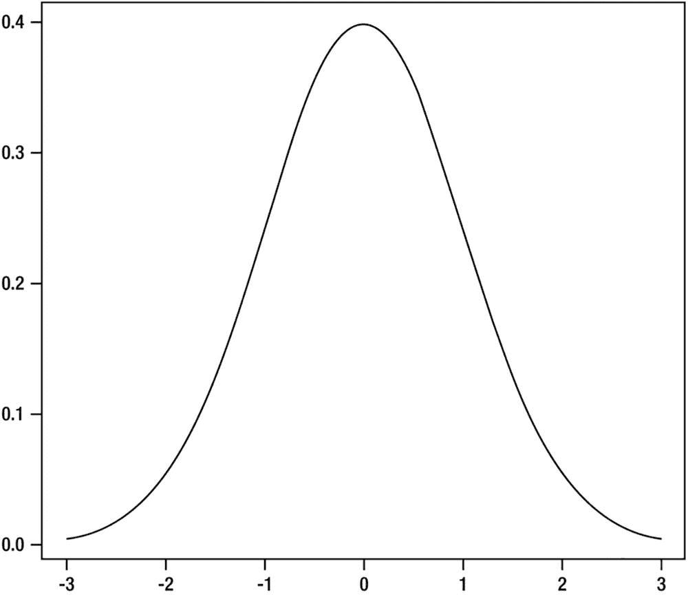

图 3-4

正态分布的钟形曲线

标准差是一个度量单位，它描述了数据分布与平均值的平均距离，因此我们可以用标准差来详细说明每个数据点与平均值的距离。

在 R 中，我们可以使用`sd()`函数来确定标准差。`sd()`函数需要一个数值向量:

```r
> sd(USArrests$Murder)
[1] 4.35551

```

如果我们想收集一个矩阵的标准偏差，我们可以使用 s `apply()`函数来应用`sd()`函数，如下所示:

```r
> sapply(USArrests, sd)
  Murder    Assault   UrbanPop       Rape murderRank
4.355510  83.337661  14.474763   9.366385  14.574930

```

## RStudio IDE

如果您喜欢在集成开发环境(IDE)中开发，而不是在命令行中，您可以使用一个名为 RStudio IDE 的免费产品。RStudio IDE 由 RStudio 公司制造，它不仅仅是一个 IDE(您很快就会看到)。RStudio 公司由 ColdFusion 的创始人 JJ·阿莱尔创立。RStudio IDE 可在 [`www.rstudio.com/ide/`](http://www.rstudio.com/ide/) 下载(下载页面截图见图 [3-5](#Fig5) )。

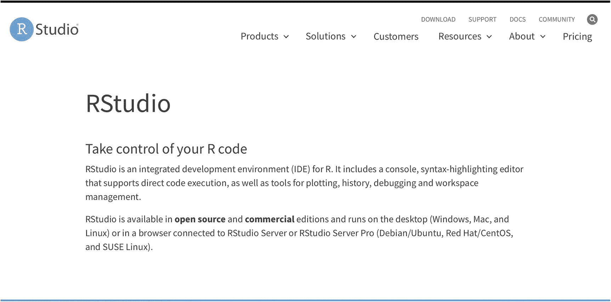

图 3-5

RStudio IDE 主页

Note

您应该现在安装 RStudio IDE，因为您将在本章的剩余部分使用它。

安装后，IDE 分成四个窗格(参见图 [3-6](#Fig6) )。

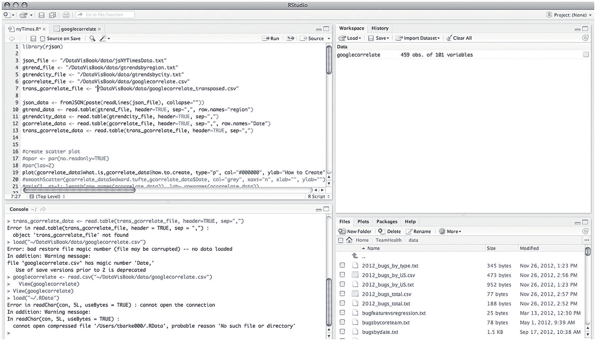

图 3-6

RStudio 接口

左上方的窗格是 R 脚本文件，我们在其中编辑 R 源代码。左下方的窗格是 R 命令行。右上侧窗格包含命令历史以及当前工作区中的所有对象。右下方的窗格分为多个选项卡，可显示以下内容:

*   当前工作目录的文件系统的内容

*   已经生成的图或图表

*   当前安装的软件包

*   r 帮助页面

虽然把你需要的所有东西都放在一个地方很棒，但是这里才是事情变得真正有趣的地方。

### r 降价

在 RStudio 的 0.96 版本中，团队宣布使用 knitr 包支持 R Markdown。我们现在可以将 R 代码嵌入到 markdown 文档中，这些文档可以被 knitr 解释成 HTML(超文本标记语言)。但是还有更好的。

RStudio 公司还开发了一款名为 RPubs 的产品，它允许用户创建账户并托管他们的 R Markdown 文件，以便在网上发布。

Note

Markdown 是一种纯文本标记语言，由约翰·格鲁伯和艾伦·施瓦茨创建。在 markdown 中，您可以使用简单和轻量级的文本编码来表示格式。降价文档被读取和解释，并输出一个 HTML 文件。

下面是降价语法的简要概述:

```r
header 1
=========
header 2
--------------
###header 3
####header 4
*italic*
**bold**
[link text]([URL])


```

R Markdown 的伟大之处在于我们可以在 Markdown 文档中嵌入 R 代码。我们使用三个刻度线和花括号中的字母`r`来嵌入 R:

```r
```{r}
[R code]
```r

```

我们需要三样东西来开始创建 R Markdown ( `.rmd`)文档:

*   稀有

*   R Studio IDE 版本 0.96 或更高版本

*   针织包装

knitr 包用于将 R 重新格式化成几种不同的输出格式，包括 HTML、markdown 甚至纯文本。

Note

有关编织机包装的信息，请访问 [`http://yihui.name/knitr/`](http://yihui.name/knitr/) 。

因为您已经安装了 R 和 RStudio IDE，所以您将首先安装 knitr。R Studio IDE 有一个很好的安装包的界面:只需进入工具文件菜单，然后单击安装包。您应该会看到如图 [3-7](#Fig7) 所示的弹出窗口，您可以在其中指定包名(R Studio IDE 前面有一个很好的类型用于包发现)和要安装到哪个库。

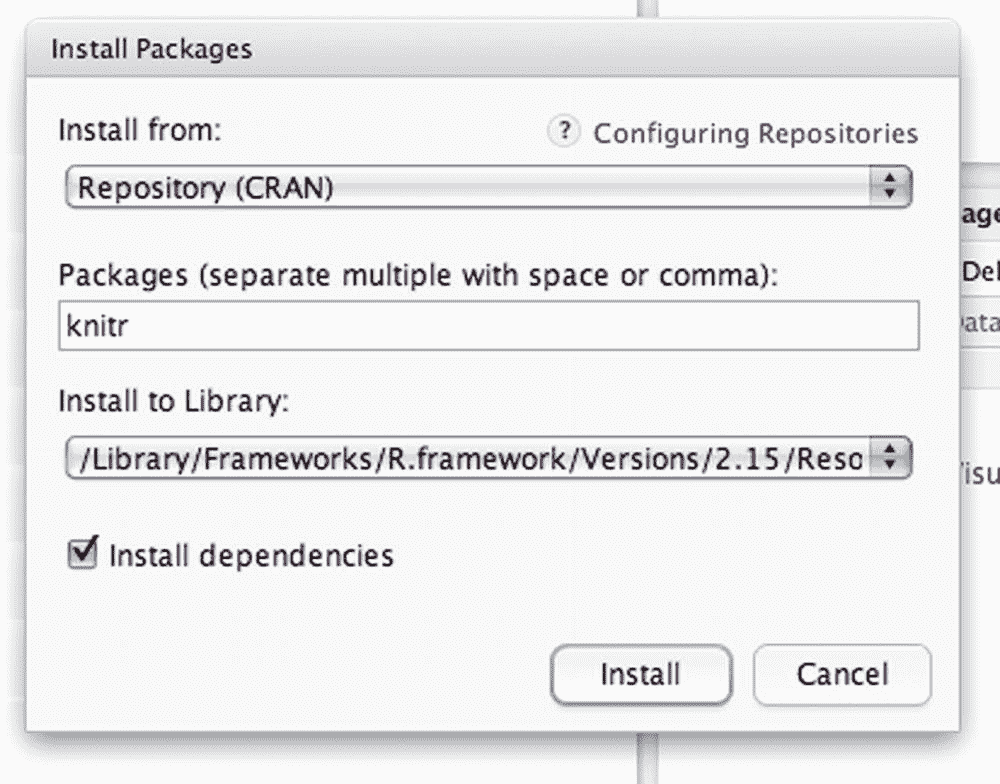

图 3-7

安装编织机组件

安装 knitr 后，您需要关闭并重新启动 RStudio IDE。然后你进入文件菜单，选择文件➤新，在其中你会看到一些选项，包括 R Markdown。如果您选择 R Markdown，并选择默认选项“Document”和“HTML”作为默认输出格式，您将获得一个新文件，其模板如图 [3-8](#Fig8) 所示。

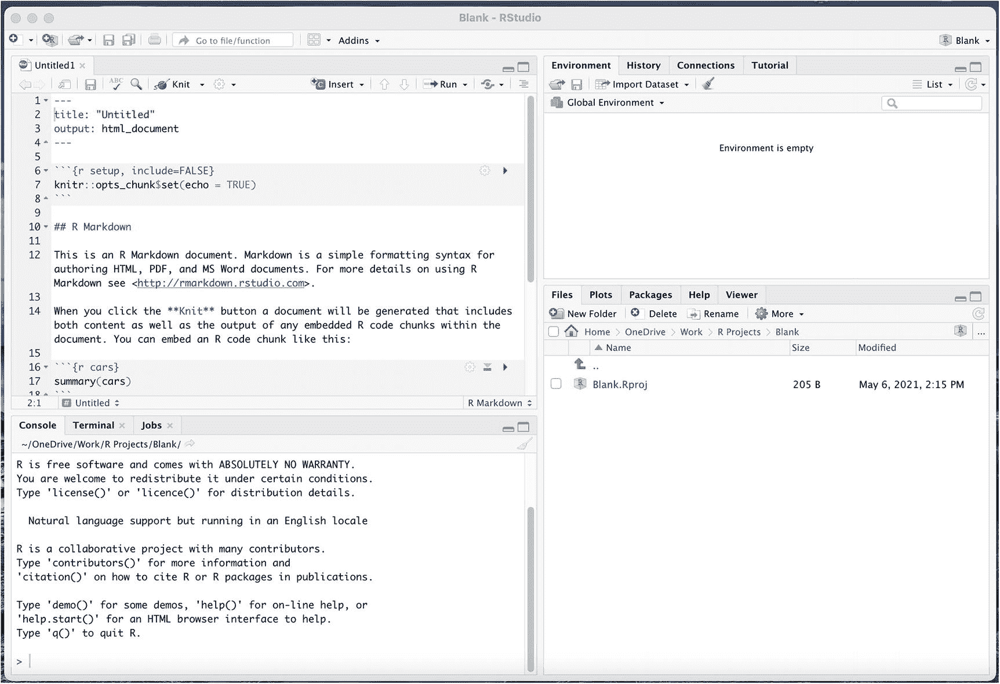

图 3-8

RStudio IDE

R Markdown 模板具有以下代码:

```r
---
title: "Untitled"
output: html_document
---

```{r setup, include=FALSE}
knitr::opts_chunk$set(echo = TRUE)
```r

## R Markdown

This is an R Markdown document. Markdown is a simple formatting syntax for authoring HTML, PDF, and MS Word documents. For more details on using R Markdown, see <http://rmarkdown.rstudio.com>.

When you click the **Knit** button, a document will be generated that includes both content and the output of any embedded R code chunks within the document. You can embed an R code chunk like this

:

```{r cars}
summary(cars)
```r

## Including Plots

You can also embed plots, for example:

```{r pressure, echo=FALSE}
plot(pressure)
```r

Note that the `echo = FALSE` parameter was added to the code chunk to prevent printing of the R code that generated the plot.

```

这是模板，当你点击 Knit 按钮时，你会看到如图 [3-9](#Fig9) 所示的输出。

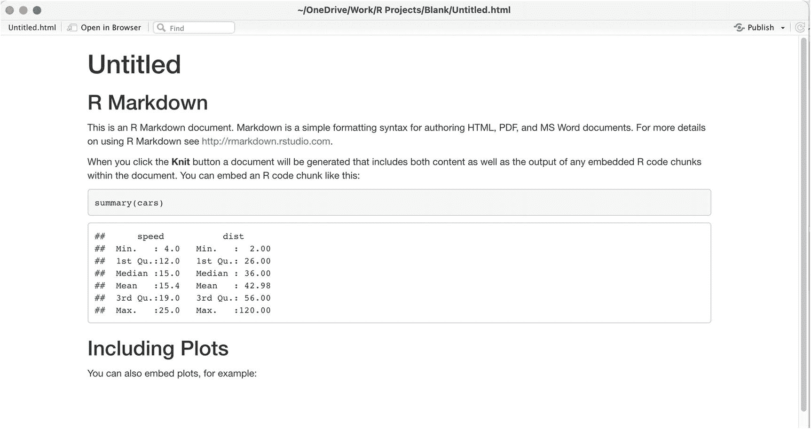

图 3-9

RMarkdown 模板的 HTML 输出

你注意到图 [3-9](#Fig9) 顶部的发布按钮了吗？这就是我们如何将 R Markdown 文件推送到 RPubs，以便在 Web 上托管和分发。

### RPubs

RPubs 是 R Markdown 文件的免费网络发布平台，由 RStudio(该公司)提供。您可以通过访问 [`www.rpubs.com`](http://www.rpubs.com) 创建免费账户。图 [3-10](#Fig10) 显示了 RPubs 主页的截图。

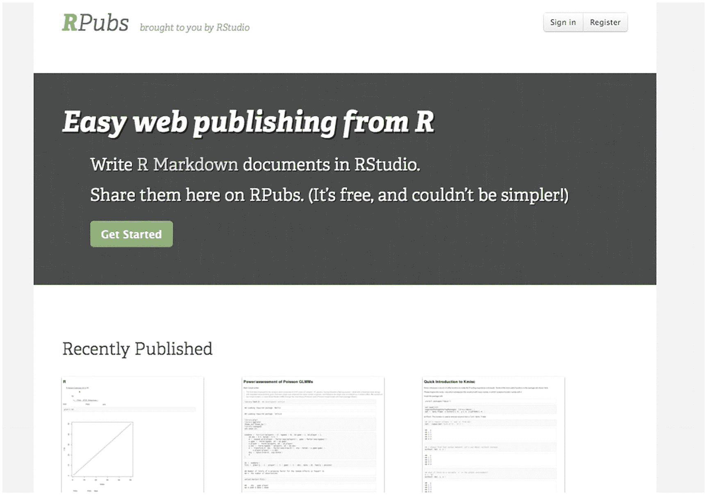

图 3-10

RPubs 主页

只需点击注册按钮，并填写表格，以创建您的免费帐户。RPubs 棒极了；这是一个我们可以发布 R Markdown 文档以供分发的平台。

Caution

请注意，你放在 RPubs 上的每个文件都是公开的，所以一定不要把任何敏感或专有的信息放在里面。如果您不想将 R Markdown 文件放在全世界都可以看到的地方，您可以点击“发布”按钮旁边的“另存为”按钮，将文件保存为普通的 HTML 格式。

单击发布按钮后，系统会提示您使用 RPubs 帐户登录。登录后，您将被引导至文档详情页面，如图 [3-11](#Fig11) 所示。

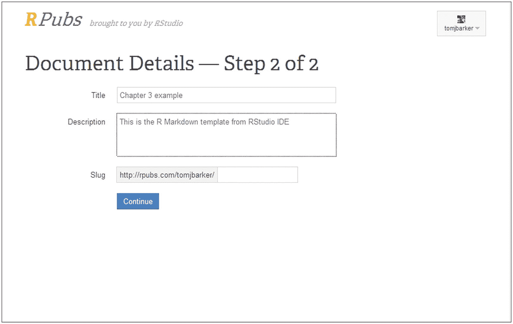

图 3-11

发布到 RPubs

填写完文档详细信息、文档标题和描述后，您将被定向到 RPubs 中的文档。图 [3-9](#Fig9) 托管在 RPubs 的模板见图 [3-12](#Fig12) 此处公开: [`www.rpubs.com/tomjbarker/3370`](http://www.rpubs.com/tomjbarker/3370) 。

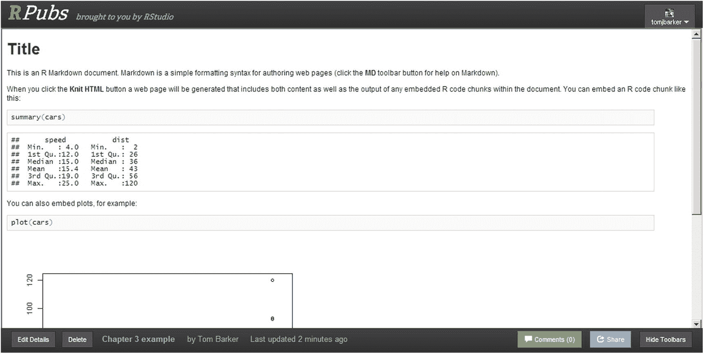

图 3-12

RMarkdown 模板发布到 RPubs

对于 R 文档和交流数据可视化来说，这是一种强大的分发方法。在接下来的章节中，我们将把所有完成的 R 图表放在 RPubs 上供公众阅读。

## 摘要

本章探讨了 R 中的一些更深层次的概念，从不同的面向对象设计模型到如何使用 R 进行统计分析。我们甚至研究了如何使用 RMarkdown 和 RPubs 使 R 中的数据可视化可用于公共分发。

在下一章中，我们将关注 D3，一个 JavaScript 库，它使我们能够在浏览器中分析和可视化数据，并为可视化添加交互性。