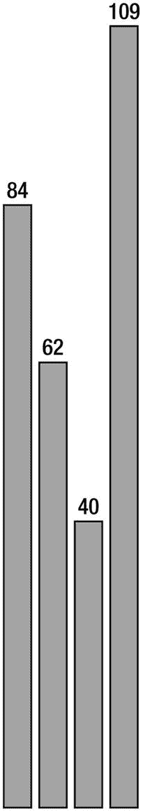

# 四、使用 D3 实现数据可视化

到目前为止，当我们谈论用于创建数据可视化的技术时，我们一直在谈论 R。我们已经花了最后两章来探索 R 环境和学习命令行。我们讨论了 R 语言的入门主题，从数据类型、函数到面向对象编程。我们甚至讨论了如何使用 RPubs 将我们的 R 文档发布到 Web 上。

本章我们将看一个叫做 D3 的 JavaScript 库，它被用来创建交互式数据可视化。首先是一个关于 HTML、CSS 和 JavaScript 的快速入门，D3 的支持语言。然后我们将深入研究 D3，并探索如何在 D3 中制作一些更常用的图表。

## 初步概念

D3 是一个 JavaScript 库。具体来说，这意味着它是用 JavaScript 编写的，并嵌入在 HTML 页面中。我们可以在自己的 JavaScript 代码中引用 D3 的对象和函数。所以让我们从头开始。下一节的目的不是深入研究 HTML CSS 和 JavaScript 还有很多其他的资源，包括我参与撰写的*基金会网站创建*。目的是对我们将直接用 D3 处理的概念有一个非常高层次的回顾。如果你已经熟悉 HTML、CSS 和 JavaScript，你可以跳到本章的“D3 历史”部分。

### 超文本标记语言

HTML 是一种标记语言；事实上，它代表超文本标记语言。它是一种表示语言，由表示格式和布局的元素组成。元素包含属性，这些属性具有指定元素、标记和内容的详细信息的值。为了解释，让我们看看我们的基本 HTML 框架结构，我们将在本章的大多数例子中使用它:

```r
<!DOCTYPE html>
<html>
<head></head>
<body></body>
</html>

```

让我们从第一行开始。这是告诉浏览器的渲染引擎使用什么规则集的 doctype。浏览器可以支持多个版本的 HTML，每个版本都有稍微不同的规则集。这里指定的文档类型是 HTML5 文档类型。doctype 的另一个例子是:

```r
<!DOCTYPE html PUBLIC "-//W3C//DTD XHTML 1.1//EN""  http://www.w3.org/TR/xhtml11/DTD/xhtml11.dtd  ">

```

这是 XHTML 1.1 的 doctype。注意，它指定了文档类型定义的 URL(`.dtd`)。如果我们阅读 URL 上的纯文本，我们会看到它是一个如何解析 HTML 标签的规范。W3C 在这里维护了一个文档类型列表: [`www.w3.org/QA/2002/04/valid-dtd-list.html`](http://www.w3.org/QA/2002/04/valid-dtd-list.html) 。

Modern Browser Architecture

现代浏览器由封装了特定功能的模块组成。这些模块也可以获得许可并嵌入到其他应用中:

*   它们有一个 UI 层来处理浏览器用户界面的绘制，比如窗口、状态栏和后退按钮。

*   他们有渲染引擎来解析、标记和绘制 HTML。

*   它们有一个网络层来处理检索 HTML 和页面上所有资源所涉及的网络操作。

*   他们有一个 JavaScript 引擎来解释和执行页面中的 JavaScript。

请参见图 4-1 了解该架构的图示。


图 4-1

现代浏览器架构

回到 HTML 的框架结构。下一行是`<html>`标签；这是文档的根级标记，包含我们将使用的所有其他 HTML 元素。请注意，文档的最后一行有一个结束标记。

接下来是`<head>`标签，它是一个容器，通常保存页面上没有显示的信息(例如，标题和元信息)。在`<head>`标签之后是`<body>`标签，它是一个容器，保存所有将在页面上显示的 HTML 元素，例如段落:

```r
<p> this is a paragraph </p>

```

或链接:

```r
<a href="[URL]">link text or image here</a>

```

或图像:

```r


```

当谈到 D3 时，我们将要编写的大部分 JavaScript 将在主体部分，而大部分 CSS 将在头部分。

### 半铸钢ˌ钢性铸铁(Cast Semi-Steel)

CSS 代表级联样式表，用于设计网页上 HTML 元素的样式。样式表要么包含在`<style>`标签中，要么通过`<link>`标签外部链接，由样式规则和选择器组成。选择器将 web 页面上的元素作为样式的目标，样式规则定义应用什么样式。让我们看一个例子:

```r
<style>
p{
    color: #AAAAAA;
}
</style>

```

在前面的代码片段中，样式表在一个`style`标签中。`p`是**选择器**，它告诉浏览器将网页上的每个段落标记作为目标。样式规则用花括号括起来，由属性和值组成。本例将所有段落中文本的颜色设置为`#AAAAAA`，这是浅灰色的十六进制值。

选择器是 CSS 的真正微妙之处。这与我们相关，因为 D3 也使用 CSS 选择器来定位元素。类似于 S3/S4 类如何在 R 中相互继承，我们可以通过类或 id 使用选择器和目标元素变得非常具体，或者我们可以使用伪类来针对抽象概念，比如当元素悬停在上面时。我们可以在 DOM 中上下定位元素的祖先和后代。

Note

DOM 代表文档对象模型，是允许 JavaScript 与网页上的 HTML 元素交互的应用程序编程接口(API)。

```r
.classname{
/* style sheet for a class*/
}
#id{
/*style sheet for an id*/
}
element:pseudo-class{
}

```

### 挽救（saving 的简写）

D3 的下一个介绍性概念是 SVG，它代表可伸缩矢量图形。SVG 是一种在浏览器中创建矢量图形的标准化方法，D3 用它来创建数据可视化。我们在 SVG 中关心的核心功能是绘制形状和文本并将它们集成到 DOM 中的能力，以便我们的形状可以通过 JavaScript 编写脚本。

Note

矢量图形是使用点和线创建的图形，这些点和线由渲染引擎进行数学计算和显示。将这种想法与位图或光栅图形进行对比，在位图或光栅图形中，像素显示是预先渲染的。向量，因为它们是简单的方程，往往规模更好，也更小。但是，它们缺乏位图或光栅图形的深度。

SVG 本质上是它自己的标记语言，有自己的 doctype。我们可以在外部`.svg`文件中编写 SVG，或者将 SVG 标签直接包含在我们的 HTML 中。在 HTML 页面中编写 SVG 标签允许我们通过 JavaScript 与形状进行交互。

SVG 支持预定义的形状以及画线的能力。SVG 中预定义的形状如下:

*   `<rect>`画矩形

*   `<circle>`画圆

*   `<ellipse>`画椭圆

*   `<line>`画线条；还有`<polyline>`和`<polygon>`用多个点画线

让我们看一些代码示例。如果我们将 SVG 写入 HTML 文档，我们使用`<svg>`标签包装我们的形状。`<svg>`带有`xmlns`和`version`属性。`xmlns`属性应该是 SVG 名称空间的路径，而`version`显然是 SVG 的版本:

```r
<svg xmlns:="  http://www.w3.org/2000/svg  " version="1.1">
</svg>

```

如果我们正在编写独立的`.svg`文件，我们将完整的`doctype`和`xml`标签包含到页面文件中:

```r
<?xml version="1.0" standalone="no"?>
<!DOCTYPE svg PUBLIC "-//W3C//DTD SVG 1.1//EN" "  http://www.w3.org/Graphics/SVG/1.1/DTD/svg11.dtd  ">
<svg xmlns:=" http://www.w3.org/2000/svg " version="1.1">
</svg>

```

无论哪种方式，我们都在`<svg>`标签中创建我们的形状。让我们在`<svg>`标签中创建一些示例形状:

```r
<svg xmlns:="  http://www.w3.org/2000/svg  " version="1.1" viewBox="0 0 500 500">
    <rect x="10" y="10" width="10" height="100" stroke="#000000" fill="#AAAAAA" />
    <circle cx="70" cy="50" r="40" stroke="#000000" fill="#AAAAAA" />
    <ellipse cx="230" cy="60" rx="100" ry="50" stroke="#000000" fill="#AAAAAA" />
</svg>

```

该代码产生如图 4-2 所示的形状。


图 4-2

在 SVG 中绘制的矩形、圆形和椭圆形

请注意，我们为所有形状分配了 x 和 y 坐标，在圆形和椭圆形的情况下，分配了 cx 和 cy 坐标，以及填充颜色和描边颜色。这只是最小的味道；我们也可以创建渐变和过滤器，然后将它们应用到我们的形状。我们还可以使用`<text>`标签创建文本，用于我们的 SVG 绘图。

让我们来看看。我们将更新前面的 SVG 代码，为每个形状添加文本标签:

```r
<svg xmlns:="  http://www.w3.org/2000/svg  " version="1.1" viewBox="0 0 500 500">
    <rect x="80" y="20" width="10" height="100" stroke="#000000" fill="#AAAAAA" />
    <text x="55" y="145" fill="#000000">rectangle</text>
    <circle cx="170" cy="60" r="40" stroke="#000000" fill="#AAAAAA" />
    <text x="150" y="145" fill="#000000">circle</text>
    <ellipse cx="330" cy="70" rx="100" ry="50" stroke="#000000" fill="#AAAAAA" />
    <text x="295" y="145" fill="#000000">ellipse</text>
</svg>

```

该代码创建如图 4-3 所示的图形。


图 4-3

带文本标签的 SVG 形状

现在，我们可以开始看到用这些基本构件创建数据可视化的可能性。因为 D3 是一个 JavaScript 库，而且我们用 D3 做的大部分工作都是在 JavaScript 中完成的，所以在我们深入研究 D3 之前，让我们先从高层次上了解一下 JavaScript。

### Java Script 语言

JavaScript 是网络的脚本语言。通过将`script`标签内嵌在文档中或者链接到外部 JavaScript 文档，可以将 JavaScript 包含在 HTML 文档中:

```r
<script>
//javascript goes here
</script>
<script src="pathto.js"></script>

```

JavaScript 可用于处理信息、对事件做出反应以及与 DOM 交互。在 JavaScript 中，我们使用关键字`var`创建变量。

```r
var foo = "bar";

```

注意，如果我们不使用`var`关键字，我们创建的变量将被赋给全局范围。我们不想这样做，因为我们的全局变量可能会被网页上的其他代码覆盖。

JavaScript 看起来很像其他基于 C 的语言，因为每个表达式都以分号结尾，函数和条件体等代码块都用花括号括起来。

条件语句通常是格式如下的`if-else`语句:

```r
if([condition]){
    [code to execute]
}else{
    [code to execute]
}

```

函数的格式如下:

```r
function [function name] ([arguments]){
    [code to execute]
}

```

在 JavaScript 中，我们通常通过引用元素的`id`属性来访问 DOM 元素。我们像使用`getElementById()`函数一样做这件事:

```r
var header = document.getElementById("header");

```

前面的代码存储了对 web 页面上 ID 为`header`的元素的引用。然后，我们可以更新该元素的属性，包括添加新元素或完全删除该元素。

JavaScript 中的对象通常是对象文字，这意味着我们在运行时创建它们，由属性和方法组成。我们像这样创建对象文字:

```r
var myObj = {
    myProp: 20,
    myfunc: function(){
    }
}

```

我们使用点运算符引用对象的属性和方法:

```r
myObj.myprop = 10;

```

看，这又快又无痛。好的，接下来是 D3！

## D3 的历史

D3 代表数据驱动文档，是一个用于创建交互式数据可视化的 JavaScript 库。将成为 D3 的想法的种子始于 2009 年的 Protovis，由迈克·博斯托克、瓦迪姆·奥吉夫茨基和杰夫·赫尔在斯坦福可视化小组工作时创建。

Note

史丹福可视化小组的信息可以在它的网站上找到: [`http://vis.stanford.edu/`](http://vis.stanford.edu/) 。Protovis 的原始白皮书可在 [`http://vis.stanford.edu/papers/protovis`](http://vis.stanford.edu/papers/protovis) 找到。

Protovis 是一个 JavaScript 库，它提供了创建不同类型可视化的接口。根名称空间是`pv`，它提供了一个 API 来创建条、点和区域等。像 D3 一样，Protovis 使用 SVG 来创建这些形状，但与 D3 不同，它将 SVG 调用包装在自己专有的术语中。

Protovis 在 2011 年被放弃了，所以它的创造者可以学习并专注于 D3。Protovis 和 D3 在哲学上是有区别的。Protovis 的目标是提供用于创建数据可视化的包装功能，而 D3 则通过使用现有的 web 标准和术语来简化数据可视化的创建。在 D3 中，我们在 SVG 中创建了矩形和圆形，这得益于 D3 的语法优势。

## 使用 D3

我们需要做的第一件事就是去 D3 网站 [`http://d3js.org/`](http://d3js.org/) ，下载最新版本(见图 4-4 )。


图 4-4

D3 主页

安装后，您可以设置一个项目。

### 设置项目

我们可以在页面上直接包含`.js`文件，就像这样:

```r
<script src="d3.v3.js"></script>

```

根命名空间是`d3`；我们从 D3 发出的所有命令都将使用`d3`对象。

### 使用 D3

我们使用`select()`函数来定位特定的元素，或者使用`selectAll()`函数来定位所有特定的元素类型:

```r
var body = d3.select("body");

```

前一行选择了`body`标签，并将其存储在名为`body`的变量中。然后，我们可以根据需要更改几何体的属性，或者向几何体添加新元素:

```r
var allParagraphs = d3.select("body").selectAll("p");

```

前一行选择了`body`标签，然后选择了正文中的所有段落标签。

请注意，我们在第二行将两个动作链接在一起。我们选择了正文，然后选择了所有的段落，这两个动作是连在一起的。还要注意，我们使用 CSS 选择器来指定目标元素。

好了，一旦我们选择了一个元素，它现在就被认为是我们的选择，我们可以对这个选择执行操作。我们可以在选择中选择元素，就像我们在前面的例子中所做的那样。

我们可以用`attr()`函数更新选择的属性。`attr()`函数接受两个参数:第一个是属性的名称，第二个是属性的设置值。假设我们想改变当前文档的背景颜色。我们可以选择主体，并通过将它添加到我们的脚本块来设置`bgcolor`属性:

```r
<script>
    d3.select("body")
         .attr("bgcolor", "#000000");
</script>

```

请注意，在前面的代码片段中，我们将链式属性函数调用带到了下一行。我们这样做是为了可读性。

真正有趣的是，因为我们在谈论 JavaScript，而函数是 JavaScript 中的一级对象，我们可以将函数作为属性值传入，这样无论它评估为什么，都成为设置的值:

```r
<script>
    d3.select("body")
         .attr("bgcolor", function(){
         return "#000000";
});
</script>

```

我们也可以使用`append()`函数向我们的选择添加元素。`append()`函数接受一个标签名作为第一个参数。它将创建指定类型的新元素，并将该新元素作为当前选择返回:

```r
<script>
var svg = d3.select("body")
         .append("svg");
</script>

```

前面的代码在页面主体中创建了一个新的 SVG 标记，并将该选择存储在变量`svg`中。

接下来，让我们用我们刚刚学到的关于 D3 的知识重新创建图 4-3 中的形状:

```r
<script>
    var svg = d3.select("body")
         .append("svg")
         .attr("width", 800);
    var r = svg.append("rect")
         .attr("x", 80)
         .attr("y", 20)
         .attr("height", 100)
         .attr("width", 10)
         .attr("stroke", "#000000")
         .attr("fill", "#AAAAAA");
    var c = svg.append("circle")
         .attr("cx", 170)
         .attr("cy", 60)
         .attr("r", 40)
         .attr("stroke", "#000000")
         .attr("fill", "#AAAAAA");
    var e = svg.append("ellipse")
         .attr("cx", 330)
         .attr("cy", 70)
         .attr("rx", 100)
         .attr("ry", 50)
         .attr("stroke", "#000000")
         .attr("fill", "#AAAAAA");
</script>

```

对于每个形状，我们向 SVG 元素添加一个新元素并更新属性。

如果我们比较这两种方法，我们可以看到我们只是在 D3 中创建了 SVG 元素，就像我们在直接标记中所做的一样。然后，我们在 SVG 元素中创建一个 SVG 矩形、圆形和椭圆形，以及我们在 SVG 标记中指定的相同属性。但是我们的 D3 例子有一个非常重要的不同:我们现在有了对页面上每个可以交互的元素的引用。

让我们来看看 D3 的交互。

### 绑定数据

对于数据可视化，我们与 SVG 形状最重要的交互是将数据绑定到它们。这使我们能够在形状的属性中反映这些数据。

为了绑定数据，我们简单地调用选择的`data()`方法:

```r
<script>
var rect = svg
    .append("rect")
    .data([1,2,3]);
</script>

```

这相当简单。然后，我们可以通过匿名函数引用绑定的数据，并将其传递给我们的`attr()`函数调用。让我们看一个例子。

首先，让我们创建一个名为`dataSet`的数组。为了开始设想这将如何与创建数据可视化相关联，您可以将`dataSet`视为一个非连续值的列表，可能是一个类的测试分数或一组区域的总降雨量:

```r
<script>
var dataSet = [ 84,62,40,109];
</script>

```

接下来，我们将在页面上创建一个 SVG 元素。为此，我们将选择正文并附加一个宽度为 800 像素的 SVG 元素。我们将在一个名为`svg`的变量中保存对这个 SVG 元素的引用:

```r
<script>
var svg = d3
    .select("body")
    .append("svg")
    .attr("width", 800);
</script>

```

这就是能够绑定数据改变事情的地方。我们将一系列命令连接在一起，这些命令将根据数据数组中存在的元素数量在 SVG 元素中创建占位符矩形。

我们将首先使用`selectAll()`返回对 SVG 元素中所有矩形的引用。现在还没有，但是在链执行完的时候会有。接下来，我们绑定我们的`dataSet`变量并调用`enter()`。`enter()`函数从绑定数据中创建占位符对象。最后，我们调用`append()`在`enter()`创建的每个占位符处创建一个矩形。

```r
<script>
bars = svg
    .selectAll("rect")
    .data(dataSet)
    .enter()
    .append("rect");
</script>

```

如果我们在浏览器中查看到目前为止的工作，我们会看到一个空白页，但是如果我们在 web inspector(如 Firebug)中查看 HTML，我们会看到 SVG 元素以及创建的矩形，但是还没有指定样式或属性，类似于图 4-5 。


图 4-5

Firebug 检查界面

接下来，让我们来设计刚刚制作的矩形。我们在变量`bars`中有一个对所有矩形的引用，所以让我们把一堆`attr()`调用链接在一起来设计矩形的样式。现在，让我们使用绑定的数据来确定条形的高度。

```r
<script>
bars
    .attr("width", 15 )
    .attr("height", function(x){return x;})
    .attr("x", function(x){return x + 40;})
    .attr("fill", "#AAAAAA")
    .attr("stroke", "#000000");
</script>

```

完整的源代码如下所示，并做出了我们在图 4-6 中看到的形状:


图 4-6

条形图的矩形样式

```r
<script>
var dataSet = [84,62,40,109];
var svg = d3
    .select("body")
    .append("svg")
    .attr("width", 800);
bars = svg
    .selectAll("rect")
    .data(dataSet)
    .enter()
    .append("rect");
bars
    .attr("width", 15 )
    .attr("height", function(x){return x;})
    .attr("x", function(x){return x + 40;})
    .attr("fill", "#AAAAAA")
    .attr("stroke", "#000000");
</script>

```

现在再看看 Firebug 或者你的浏览器的调试工具；可以看到生成的标记，如图 4-7 所示。


图 4-7

Firebug 中显示为 SVG 源代码的矩形

现在，您可以真正看到我们如何通过将数据绑定到 SVG 形状来开始用 D3 进行数据可视化。让我们把这个概念向前推进一步。

## 创建条形图

到目前为止，我们的示例看起来很像一个条形图的开始，因为我们有许多高度代表数据的条形。让我们给它一些结构。

首先，让我们给我们的 SVG 容器一个更具体的宽度和高度。这很重要，因为 SVG 容器的大小决定了我们用来标准化图表其余部分的比例。因为我们将在整个代码中引用这个大小，所以让我们确保将这些值抽象到它们自己的变量中。

我们将为我们的 SVG 容器定义一个高度和宽度。我们还将创建保存我们将在轴上使用的最小值和最大值的变量:分别是 0 和 109(最大的数据点)。我们还将定义一个偏移值，这样我们就可以绘制比图表略大的 SVG 容器，以给出它周围的图表边距。

```r
<script>
var chartHeight = 460,
    chartWidth = 400,
    chartMin = 0,
    chartMax = 109,
    offset = 60
var svg = d3
    .select("body")
    .append("svg")
    .attr("width", chartWidth)
    .attr("height", chartHeight + offset);
</script>

```

接下来我们需要确定我们的酒吧的方向。如图 4-6 所示，这些条是从上往下画的，所以尽管它们的高度是准确的，但它们看起来是朝下的，因为 SVG 是从左上方画形状和定位形状的。因此，为了使它们的方向正确，使条形看起来像是从图表的底部向上，让我们给条形添加一个 y 属性。

y 属性应该是引用数据的函数；该函数应该从图表高度中减去条形高度值。该函数返回的值是 y 坐标中使用的值。

```r
<script>
bars
    .attr("width", 15 )
    .attr("height", function(x){return x;})
    .attr("y", function(x){return (chartHeight - x);})
    .attr("x", function(x){return x;})
    .attr("fill", "#AAAAAA")
    .attr("stroke", "#000000");
</script>

```

这会将条形翻转到 SVG 元素的底部。我们可以在图 4-8 中看到结果。


图 4-8

条形图中的矩形不再反转

现在让我们缩放条形以适应 SVG 元素的高度。为此，我们将使用 D3 `scale()`函数。`scale()`函数用于获取一个范围内的数字，并将其转换为另一个数字范围内该数字的等效值，本质上是将值换算为等效值。

在这种情况下，我们有一个数字范围，它表示我们的`dataSet`数组中的值的范围，它表示条形的高度，我们希望将这些数字转换成等价的值:

```r
<script>
var yscale = d3.scaleLinear()
    .domain([chartMin,chartMax])
    .range([0,(chartHeight)]);
</script>

```

确保将这段代码放在声明图表变量的部分之后，最好是在声明“svg”变量之前。然后，我们只需使用`yscale()`函数更新条形的高度和 y 属性:

```r
<script>
bars
    .attr("width", 15 )
    .attr("height", function(x){ return yscale(x);})
    .attr("y", function(x){return (chartHeight - yscale(x));})
    .attr("x", function(x){return x;})
    .attr("fill", "#AAAAAA")
    .attr("stroke", "#000000");
</script>

```

这产生了如图 4-9 所示的图形。


图 4-9

正确缩放的条形图矩形

非常好！但到目前为止，我们只是根据高度来放置条形，而不是根据它们在数组中的位置。让我们改变这一点，使它们的数组位置更有意义，这样条形就会以正确的顺序显示。

为此，我们只需更新条形的 x 值。我们已经看到，我们可以将一个匿名函数传递给`attr()`函数的 value 参数。匿名函数中的第一个参数是数组中当前元素的值。如果我们在匿名函数中指定第二个参数，它将保存当前的索引号。

然后，我们可以引用该值并偏移它来放置每个条形:

```r
<script>
bars
    .attr("width", 15 )
    .attr("height", function(x){ return yscale(x);})
    .attr("y", function(x){return (chartHeight - yscale(x));})
    .attr("x", function(x, i){return (i * 20);})
    .attr("fill", "#AAAAAA")
    .attr("stroke", "#000000");
</script>

```

这为我们提供了图 4-10 中所示的条的顺序。只需目测一下，我们就可以知道现在条形更接近于数组中数据的表示形式——不仅仅是高度，还包括数组中指定顺序的高度。


图 4-10

条形图中的矩形按照数据中的顺序排列

现在，让我们添加文本标签，以便我们可以更好地看到条形的高度所表示的值。

我们通过创建 SVG 文本元素来实现这一点，其方式与创建条的方式非常相似。我们为数据数组中的每个元素创建文本占位符，然后设置文本元素的样式。您会注意到，我们传递到 x 和 y 属性调用中的匿名函数对于文本元素和对于条形几乎是相同的，只是进行了偏移，以便文本位于每个条形的上方和中心:

```r
<script>
svg.selectAll("text")
    .data(dataSet)
    .enter()
    .append("text")
    .attr("x", function(d, i) { return ((i * 20) + offset/4); })
    .attr("y", function(x, i){return (chartHeight - yscale(x) - 24) ;})
    .attr("dx", -15/2)
    .attr("dy", "1.2em")
    .attr("text-anchor", "middle")
    .text(function(d) { return d;})
    .attr("fill", "black");
</script>

```

该代码生成如图 4-11 所示的图表。



图 4-11

带文本标签的条形图

参见以下完整的源代码:

```r
<html>
<head>
<title></title>
<script src="d3.js"></script>

</head>
<body>
<script>
var dataSet = [84,62,40,109];
var chartHeight = 460,
    chartWidth = 400,
    chartMin = 0,
    chartMax = 115,
    offset = 60;
var yscale = d3.scaleLinear()
    .domain([chartMin,chartMax])
    .range([0,(chartHeight)]);
var svg = d3
    .select("body")
    .append("svg")
    .attr("width", chartWidth)
    .attr("height", chartHeight + offset);
bars = svg
    .selectAll("rect")
    .data(dataSet)
    .enter()
    .append("rect");
bars
    .attr("width", 15 )
    .attr("height", function(x){ return yscale(x);})
    .attr("y", function(x){return (chartHeight - yscale(x));})
    .attr("x", function(x, i){return (i * 20);})
    .attr("fill", "#AAAAAA")
    .attr("stroke", "#000000");
svg.selectAll("text")
    .data(dataSet)
    .enter()
    .append("text")
    .attr("x", function(d, i) { return ((i * 20) + offset/4); })
    .attr("y", function(x, i){return (chartHeight - yscale(x) - 24) ;})
    .attr("dx", -15/2)
    .attr("dy", "1.2em")
    .attr("text-anchor", "middle")
    .text(function(d) { return d;})
    .attr("fill", "black");
</script>
</body>
</html>

```

最后，让我们从外部文件读入数据，而不是在页面中硬编码。

## 加载外部数据

首先，我们将从文件中取出数组，并将其放入自己的外部文件:`sampleData.csv`。`sampleData.csv`的内容简单如下:

```r
84,62,40,109

```

接下来，我们将使用`d3.text()`函数加载`sampleData.csv`。`d3.text()`的工作方式是获取一个外部文件的路径，然后将它赋给一个变量(在本例中为数据)。该函数接收一个参数，该参数是外部文件的内容:

```r
<script>
d3.text("sampleData.csv").then((data) => {});
</script>

```

问题是，在开始对数据进行任何制图之前，我们需要外部文件的内容。因此，在回调函数中，我们将解析文件，然后包装所有现有的功能，如下所示:

```r
<html>
<head>
<title></title>
<script src="d3.js"></script>
</head>
<body>
<script>
d3.text("sampleData.csv").then((data) =>  {
var dataSet = data.split(",");
var chartHeight = 460,
    chartWidth = 400,
    chartMin = 0,
    chartMax = 115,
    offset = 60;
var yscale = d3.scaleLinear()
    .domain([chartMin,chartMax])
    .range([0,(chartHeight)]);
var svg = d3
    .select("body")
    .append("svg")
    .attr("width", chartWidth)
    .attr("height", chartHeight + offset);
bars = svg

    .selectAll("rect")
    .data(dataSet)
    .enter()
    .append("rect");
bars
    .attr("width", 15 )
    .attr("height", function(x){ return yscale(x);})
    .attr("y", function(x){return (chartHeight - yscale(x));})
    .attr("x", function(x, i){return (i * 20);})
    .attr("fill", "#AAAAAA")
    .attr("stroke", "#000000");
svg.selectAll("text")
    .data(dataSet)
    .enter()
    .append("text")
    .attr("x", function(d, i) { return ((i * 20) + offset/4); })
    .attr("y", function(x, i){return (chartHeight - yscale(x) - 24) ;})
    .attr("dx", -15/2)
    .attr("dy", "1.2em")
    .attr("text-anchor", "middle")
    .text(function(d) { return d;})
    .attr("fill", "black");
  })
</script>
</body>
</html>

```

需要注意的是，如果您在本地计算机上运行这段代码，而不是在 web 服务器上运行，您将得到类似“跨源请求仅支持 HTTP”的错误。这是一种安全措施，您的浏览器使用它来防止恶意代码在您的本地计算机上运行。建议在编程时使用本地 web 服务器来解决这个问题。

回到我们的 d3.text()函数——CSV 文件不是我们唯一可以读取的格式。事实上，`d3.text()`只是语法糖——D3 实现`XMLHttpRequest`对象`d3.xhr()`的便利方法或特定类型包装器。

作为参考，`XMLHttpRequest`对象是 AJAX 事务中用来从客户端异步加载内容而无需刷新页面的对象。在纯 JavaScript 中，我们实例化 XHR 对象，传入资源的 URL，以及检索资源的方法(GET 或 POST)。我们还指定了一个回调函数，该函数将在 XHR 对象更新时被调用。在这个函数中，我们可以解析数据并开始使用它。参见图 4-12 以获得该过程的高级图。


图 4-12

XHR 交易顺序图

在 D3 里，`d3.xhr()`函数是 D3 对`XMLHttpRequest`对象的包装。它的工作方式与我们刚刚看到的`d3.text()`非常相似，我们传入一个资源的 URL 和一个要执行的回调函数。

D3 具有的其他特定类型的便利功能是`d3.csv()`、`d3.json()`、`d3.xml()`和`d3.html()`。

## 摘要

本章探讨了 D3。我们开始讲述 HTML、CSS、SVG 和 JavaScript 的介绍性概念，至少是与实现 D3 相关的内容。从那里，我们深入研究了 D3，查看了一些介绍性的概念，比如创建我们的第一个 SVG 形状，通过将这些形状制作成条形图来扩展这个想法。

D3 是制作数据可视化的极好的库。要查看完整的 API 文档，请参见 [`https://github.com/mbostock/d3/wiki/API-Reference`](https://github.com/mbostock/d3/wiki/API-Reference) 。

我们将回到 D3，但是首先，我们将探索一些我们可以创建的数据可视化，它们在 web 开发的世界中有实际的应用。我们要看的第一个是你可能在谷歌分析仪表板或类似的东西上看到过的东西:基于用户访问的数据地图。