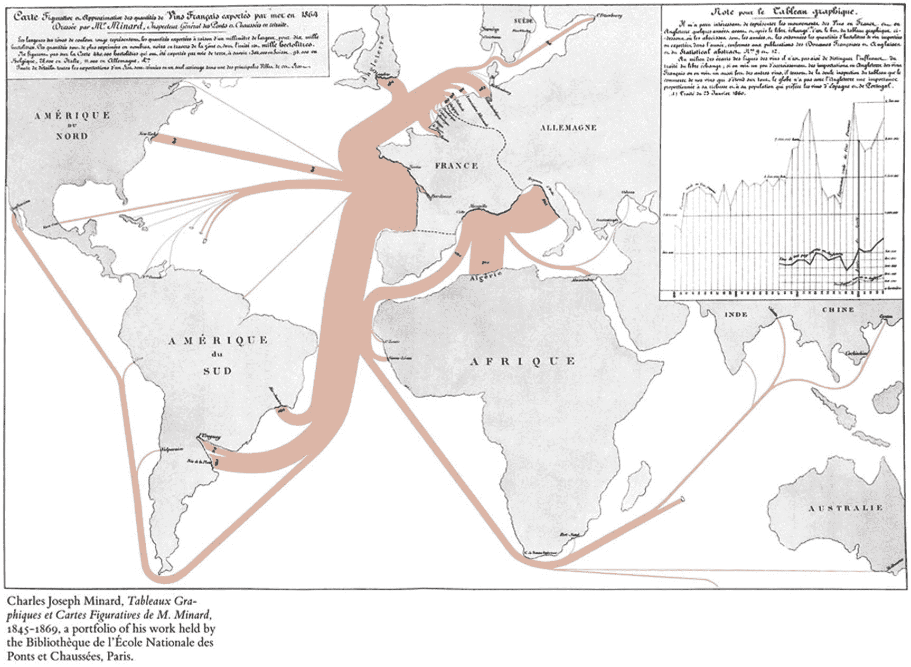
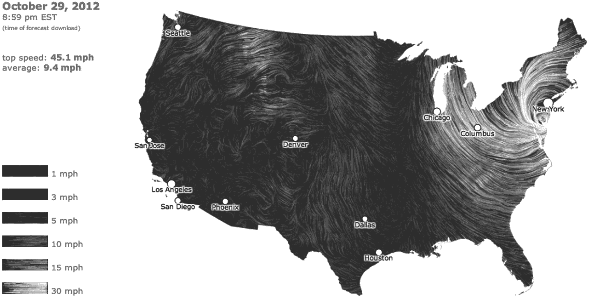
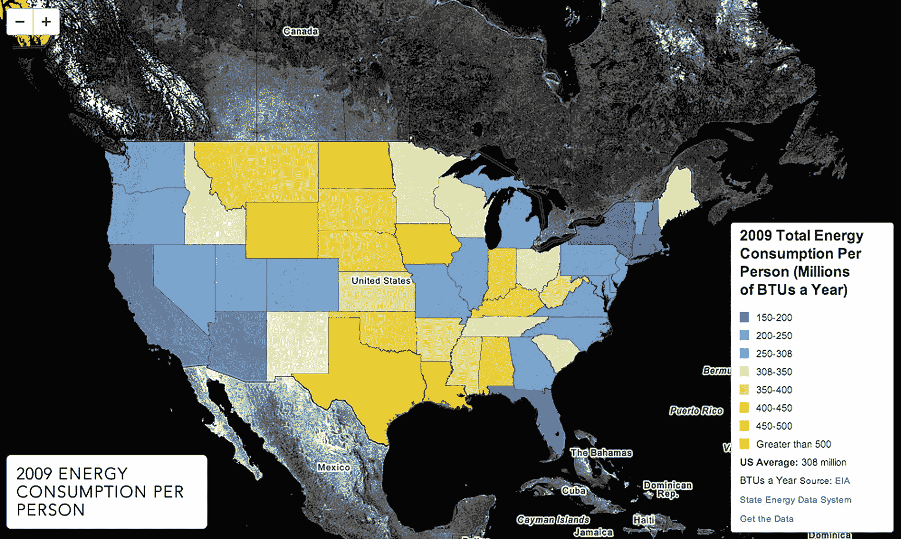
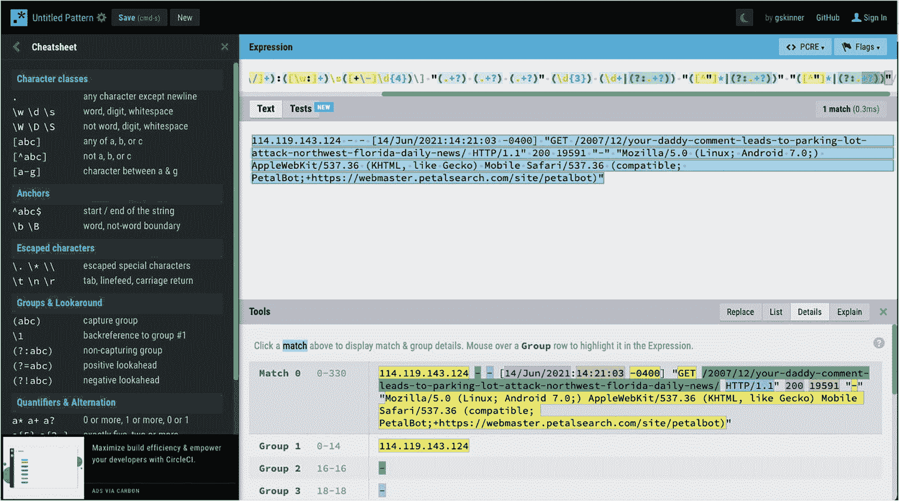
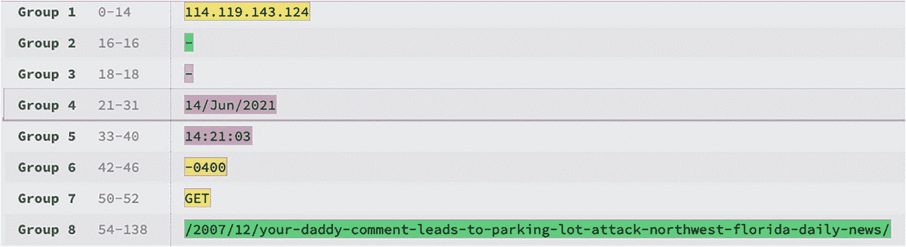
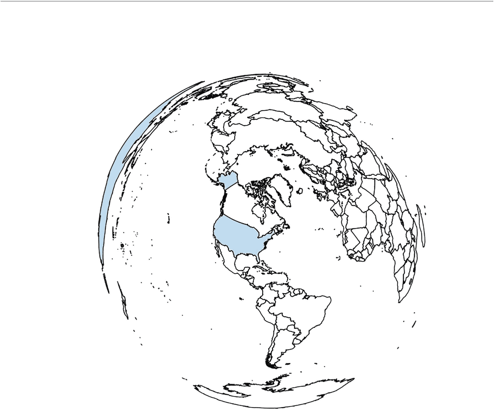
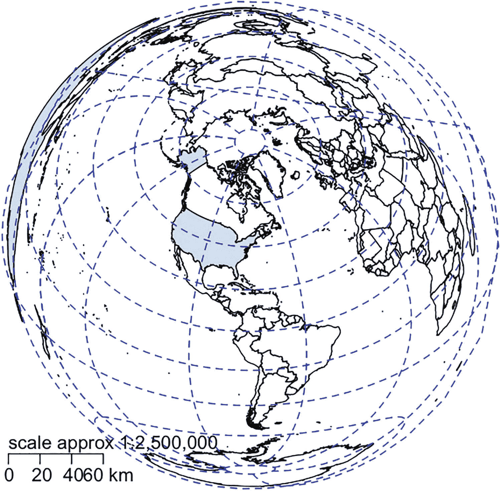
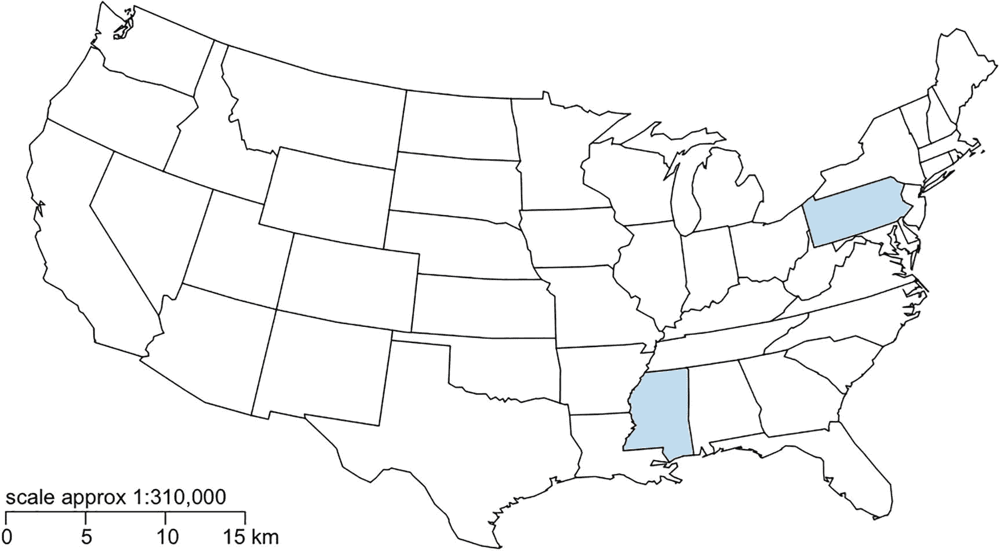
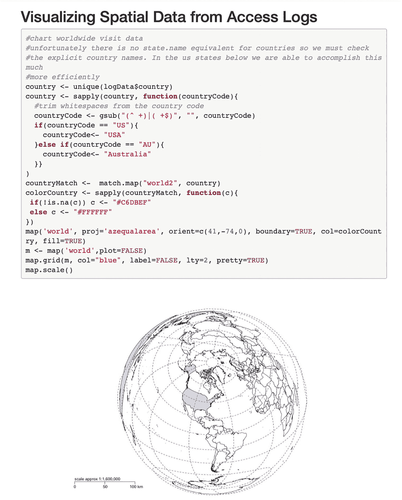
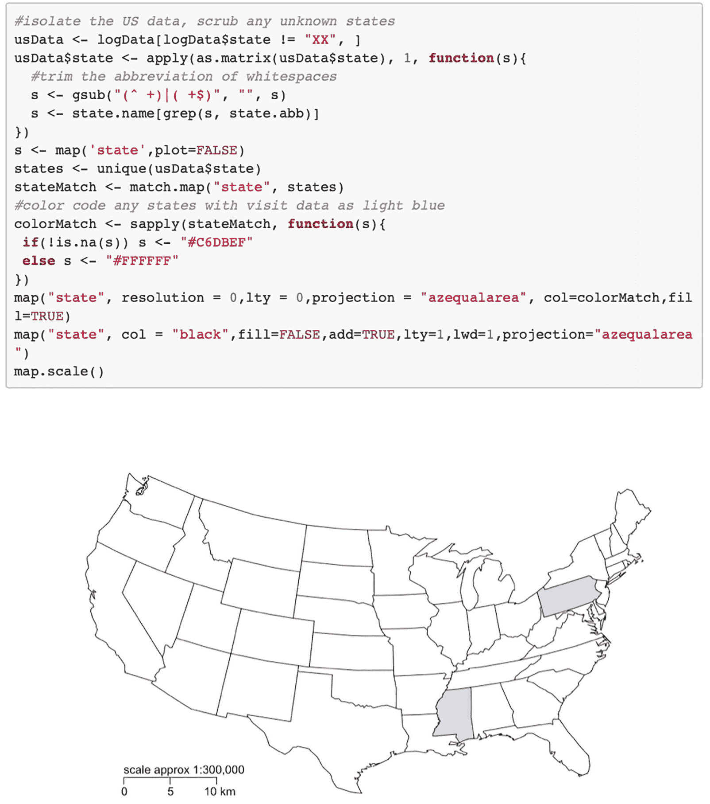

# 五、可视化访问日志中的空间数据

在上一章中，我们讨论了 D3，并研究了从制作简单形状到用这些形状制作条形图的概念。在前两章中，我们深入研究了 r。现在，您已经熟悉了我们将使用的核心技术，让我们开始看一些例子，作为 web 开发人员，我们如何创建数据可视化来交流我们领域内的有用信息。

我们要看的第一个是从我们的访问日志中创建一个数据映射。

## 什么是数据图？

首先，让我们进行水平设置，并确保我们清楚地定义了一个数据映射。数据地图是空间领域的信息表示，是统计学和制图学的结合。数据地图是最容易理解和最广泛使用的数据可视化工具，因为它们的数据表达在我们都熟悉和使用的东西中:地图。

回想一下琼恩·雪诺在 1854 年绘制的霍乱地图第一章的讨论。这被认为是数据地图的最早例子之一，尽管有几个著名的同时代人，包括十九世纪法国工程师查尔斯·密纳德的几个。他因 1812 年拿破仑入侵俄罗斯的数据可视化而广为人知。

米纳德还创建了几个突出的数据地图。他的两个最著名的数据地图包括展示法国消费的牛的来源地区和百分比的数据地图(见图 5-1 )和展示葡萄酒从法国出口的路径和目的地的数据地图(见图 5-2 )。



图 5-2

米纳德展示葡萄酒出口路径和目的地的数据地图


图 5-1

来自 Charles Minard 的早期数据地图展示了法国的来源地区和牛的消费情况

今天，我们到处都能看到数据地图。它们可以是知识性和艺术性的表达，就像费尔南达·维埃加斯和马丁·瓦滕伯格的风地图项目(见图 5-3 )。在 [`http://hint.fm/wind`](http://hint.fm/wind) 可以看到，风力项目展示了美国上空气流的路径和力量。



图 5-3

风地图，显示飓风桑迪登陆时各地区的风速(经费尔南达·维埃加斯和马丁·瓦滕伯格许可使用)

数据图可能很深奥，例如 energy.gov 大学提供的数据图展示了各州的能源消耗(见图 5-4 )甚至各州的可再生能源产量等概念。



图 5-4

描述 energy.gov 各州能源消耗的数据图(可在 [`http://energy.gov/maps/2009-energy-consumption-person`](http://energy.gov/maps/2009-energy-consumption-person) 获得)

现在，您已经看到了数据地图的历史和当代示例。在本章中，您将了解如何从 web 服务器访问日志创建自己的数据映射。

## 访问日志

访问日志是 web 服务器保存的记录，用于跟踪请求了哪些资源。每当从服务器请求网页、图像或任何其他类型的文件时，服务器都会为该请求创建一个日志条目。每个请求都有与之相关联的某些数据点，通常是关于资源请求者的信息(例如，IP 地址和用户代理)以及诸如一天中的时间和请求了什么资源之类的一般信息。

我们来看看访问日志。一个示例条目如下所示:

```r
msnbot-157-55-17-199.search.msn.com - - [18/Jan/2013:13:32:15 -0400] "GET /robots.txt HTTP/1.1" 404 208 "-" "Mozilla/5.0 (compatible; bingbot/2.0; +  http://www.bing.com/bingbot.htm)"

```

这是一个样本 Apache 访问日志的片段。Apache 访问日志遵循组合日志格式，这是万维网联盟(W3C)通用日志格式标准的扩展。通用日志格式的文档可在此处找到:

```r
www.w3.org/Daemon/User/Config/Logging.html#common-logfile-format

```

通用日志格式定义了以下字段，用制表符分隔:

*   远程主机的 IP 地址或 DNS 名称

*   远程用户的日志名

*   远程用户的用户名

*   日期戳

*   请求—通常包括请求方法和所请求资源的路径

*   为请求返回的 HTTP 状态代码

*   请求的资源的总文件大小

组合日志格式添加了参考和用户代理字段。组合日志格式的 Apache 文档可以在下面找到:

```r
http://httpd.apache.org/docs/current/logs.html#combined

```

注意，不可用的字段由单个破折号`-`表示。

让我们仔细分析一下前面的日志条目:

*   第一个字段是`msnbot-157-55-17-199.search.msn.com`。这是一个 DNS 名称，只是碰巧内置了 IP 地址。我们不能指望解析出这个域的 IP 地址，所以现在，就忽略这个 IP 地址。当我们开始以编程方式解析日志时，我们将使用本机 PHP 函数`gethostbyname()`来查找给定域名的 IP 地址。

*   接下来的两个字段，日志名和用户，是空的。

*   接下来是日戳:`[18/Jan/2013:13:32:15 -0400]`。

*   日期戳之后是请求:`"GET /robots.txt HTTP/1.1"`。如果你还没有从 DNS 名称中猜到，这是一个机器人，具体来说是微软的`msnbot`替代品:??。在这个记录中，`bingbot`正在请求`robots.txt`文件。

*   接下来是请求的 HTTP 状态:`404`。显然，没有可用的`robots.txt`文件。

*   接下来是请求的总负载。显然 404 需要 208 字节。

*   接下来是一个破折号，表示引用地址为空。

*   最后是 useragent: `"Mozilla/5.0 (compatible; bingbot/2.0; +` [`http://www.bing.com/bingbot.htm`](http://www.bing.com/bingbot.htm) `)"`，它明确地告诉我们，它确实是一个 bot。

现在您已经有了访问日志并理解了其中的内容，您可以解析它以编程方式使用其中的每个字段。

## 解析访问日志

解析访问日志的过程如下:

1.  读取访问日志。

2.  解析它并根据存储的 IP 地址收集地理数据。

3.  为我们的可视化输出我们感兴趣的字段。

4.  读入这个输出并可视化。

前三步我们用 PHP，最后一步用 R。请注意，您需要运行 PHP 5.4.10 或更高版本才能成功运行以下 PHP 代码。

### 读取访问日志

创建一个名为`parseLogs.php`的新 PHP 文档，首先创建一个函数来读取文件。调用这个函数`parseLog()`并让它接受文件的路径:

```r
function parseLog($file){
}

```

在这个函数中，您将编写一些代码来打开传入的文件进行读取，并遍历文件的每一行，直到到达文件的末尾。迭代中的每一步都将读入的行存储在变量`$line`中:

```r
$logArray = array();
$file_handle = fopen($file, "r");
while (!feof($file_handle)) {
     $line = fgets($file_handle);
}
fclose($file_handle);

```

目前为止 PHP 中相当标准的文件 I/O 功能。在这个循环中，您将对一个您将调用`parseLogLine()`的函数和另一个您将调用`getLocationbyIP()`的函数进行函数调用。在`parseLogLine()`中，你将拆分行并将值存储在一个数组中。在`getLocationbyIP()`中，你将使用 IP 地址获取地理信息。然后，您将把这个返回的数组存储在一个名为$ `logArray`的更大的数组中。

```r
$lineArr = parseLogLine($line);
$lineArr = getLocationbyIP($lineArr);
$logArray[count($logArray)] = $lineArr;

```

不要忘记在函数的顶部创建`$logArray`变量。

完成的函数应该是这样的:

```r
function parseLog($file){
$logArray = array();
$file_handle = fopen($file, "r");
while (!feof($file_handle)) {
     $line = fgets($file_handle);
     $lineArr = parseLogLine($line);
     $lineArr = getLocationbyIP($lineArr);
     $logArray[count($logArray)] = $lineArr;
}
fclose($file_handle);
return $logArray;
}

```

### 解析日志文件

接下来，您将充实`parseLogLine()`函数。首先，您将创建一个空函数:

```r
function parseLogLine($logLine){
}

```

该函数需要一行访问日志。

请记住，访问日志的每一行都是由空格分隔的信息部分组成的。您的第一反应可能是在每个空格处拆分该行，但这会导致以意想不到的方式拆分用户代理字符串(可能还有其他字段)。

就我们的目的而言，解析该行的一个更干净的方法是使用正则表达式。正则表达式，简称 regex，是使您能够快速有效地进行字符串匹配的模式。

正则表达式使用特殊字符来定义这些模式:单个字符、字符文字或字符集。对正则表达式的深入探讨超出了本章的范围，但是阅读不同正则表达式模式的一个很好的参考是微软正则表达式快速参考，可从这里获得: [`http://msdn.microsoft.com/en-us/library/az24scfc.aspx`](http://msdn.microsoft.com/en-us/library/az24scfc.aspx) 。

Grant Skinner 还提供了一个很棒的创建和调试正则表达式的工具(见图 5-5 ，这里有: [`https://regexr.com`](https://regexr.com) 。



图 5-5

格兰特·斯金纳的正则表达式工具

要使用 Grant 的工具，将顶部的模式从 JavaScript 更改为 PCRE(这是 PHP 解释正则表达式的方式)。然后将以下内容粘贴到大的“文本”框中:

114.119.143.124---[14/Jun/2021:14:21:03-0400]" GET/2007/12/your-daddy-comment-leads-to-parking-lot-attack-northwes-Florida-daily-news/HTTP/1.1 " 200 19591 "-" Mozilla/5.0(Linux；安卓 7.0；)AppleWebKit/537.36 (KHTML，喜欢壁虎)手机 Safari/537.36(兼容；PetalBot+ [`https://webmaster.petalsearch.com/site/petalbot`](https://webmaster.petalsearch.com/site/petalbot) )”

最后，在“表达式”框中输入以下正则表达式:^([\d.:]+)(\ s+)(\ s+)\[([\ w \/]+):([\ w:]+)\ s([+\-]\ d { 4 })\]"(。+?) (.+?) (.+?)"(\d{3}) (\d+|(？:.+?)) "([^"]*|(?:.+?))" "([^"]*|(?:.+?))"

单击表达式匹配将让您了解正则表达式的每个部分是如何在我们粘贴的日志条目中找到的。

转向我们的 PHP 代码，让我们定义正则表达式模式，并将其存储在一个名为`$pattern`的变量中。

如果你不精通正则表达式，你可以使用 Grant Skinner 的工具很容易地创建它们(参见图 5-5 )。使用此工具，您可以得出以下模式:

```r
$pattern = '/^([\d.:]+) (\S+) (\S+) \[([\w\/]+):([\w:]+)\s([+\-]\d{4})\] "(.+?) (.+?) (.+?)" (\d{3}) (\d+|(?:.+?)) "([^"]*|(?:.+?))" "([^"]*|(?:.+?))"/';

```

在该工具中，您可以看到它是如何将字符串分成以下几组的(参见图 5-6 )。



图 5-6

日志文件行被分成多个组

您现在有了一个可以使用的正则表达式。让我们使用 PHP 的`preg_match()`函数。它将正则表达式、与之匹配的字符串和作为模式匹配输出的数组作为参数:

```r
preg_match($pattern,$logLine,$logs);

```

从那里，我们可以创建一个带有命名索引的关联数组来保存我们解析的上行:

```r
$logArray = array();
$logArray['ip'] = gethostbyname($logs[1]);
$logArray['identity'] = $logs[2];
$logArray['user'] = $logs[2];
$logArray['date'] = $logs[4];
$logArray['time'] = $logs[5];
$logArray['timezone'] = $logs[6];
$logArray['method'] = $logs[7];
$logArray['path'] = $logs[8];
$logArray['protocol'] = $logs[9];
$logArray['status'] = $logs[10];
$logArray['bytes'] = $logs[11];
$logArray['referer'] = $logs[12];
$logArray['useragent'] = $logs[13];

```

我们完整的`parseLogLine()`函数现在应该是这样的:

```r
function parseLogLine($logLine){
        $pattern = '/^([\d.:]+) (\S+) (\S+) \[([\w\/]+):([\w:]+)\s([+\-]\d{4})\] "(.+?) (.+?) (.+?)" (\d{3}) (\d+|(?:.+?)) "([^"]*|(?:.+?))" "([^"]*|(?:.+?))"/';
        preg_match($pattern,$logLine,$logs);
        $logArray = array();
        $logArray['ip'] = gethostbyname($logs[1]);
        $logArray['identity'] = $logs[2];
        $logArray['user'] = $logs[2];
        $logArray['date'] = $logs[4];
        $logArray['time'] = $logs[5];
        $logArray['timezone'] = $logs[6];
        $logArray['method'] = $logs[7];
        $logArray['path'] = $logs[8];
        $logArray['protocol'] = $logs[9];
        $logArray['status'] = $logs[10];
        $logArray['bytes'] = $logs[11];
        $logArray['referer'] = $logs[12];
        $logArray['useragent'] = $logs[13];
        return $logArray;
}

```

接下来，您将为`getLocationbyIP()`函数创建功能。

### 通过 IP 进行地理定位

在`getLocationbyIP()`函数中，您可以通过解析访问日志的一行来获取数组，并使用 IP 字段来获取地理位置。通过 IP 地址获取地理位置的方法有很多种；大多数情况下，要么调用第三方 API，要么下载预先填充了 IP 位置信息的第三方数据库。其中一些第三方是免费提供的；有些是有成本的。

出于我们的目的，您可以使用 hostip.info 上的免费 API。图 5-7 显示了 hostip.info 主页。


图 5-7

hostip.info 主页

hostip.info 服务收集来自 ISP 的地理定位信息以及来自用户的直接反馈。它公开了一个 API 和一个可供下载的数据库。

该 API 在 [`http://api.hostip.info/`](http://api.hostip.info/) 可用。如果没有提供参数，API 将返回客户端的地理位置。默认情况下，API 返回 XML。返回值如下所示:

```r
<?xml version="1.0" encoding="ISO-8859-1" ?>
<HostipLookupResultSet version="1.0.1" xmlns:gml="  http://www.opengis.net/gml  " xmlns:xsi="  http://www.w3.org/2001/XMLSchema-instance  " xsi:noNamespaceSchemaLocation="  http://www.hostip.info/api/hostip-1.0.1.xsd  ">
 <gml:description>This is the Hostip Lookup Service</gml:description>
 <gml:name>hostip</gml:name>
 <gml:boundedBy>
  <gml:Null>inapplicable</gml:Null>
 </gml:boundedBy>
 <gml:featureMember>
  <Hostip>
   <ip>71.225.152.145</ip>
   <gml:name>Chalfont, PA</gml:name>
   <countryName>UNITED STATES</countryName>
   <countryAbbrev>US</countryAbbrev>
   <!-- Co-ordinates are available as lng,lat -->
   <ipLocation>
    <gml:pointProperty>
     <gml:Point srsName="  http://www.opengis.net/gml/srs/epsg.xml#4326  ">
      <gml:coordinates>-75.2097,40.2889</gml:coordinates>
     </gml:Point>
    </gml:pointProperty>
   </ipLocation>
  </Hostip>
 </gml:featureMember>
</HostipLookupResultSet>

```

您可以细化 API 调用。如果你只需要国家信息，你可以呼叫 [`http://api.hostip.info/country.php`](http://api.hostip.info/country.php) 。它返回一个带有国家代码的字符串。如果 JSON 优于 XML，可以调用 [`http://api.hostip.info/get_json.php`](http://api.hostip.info/get_json.php) ，得到如下结果:

```r
{"country_name":"UNITED STATES","country_code":"US","city":"Chalfont, PA","ip":"71.225.152.145"}

```

要指定 IP 地址，添加参数`?ip=xxxx`，如下所示:

```r
http://api.hostip.info/get_json.php?ip=100.43.83.146

```

好了，我们来编写函数吧！

我们将剔除这个函数，让它接受一个数组。我们将从数组中提取 IP 地址，将其存储在一个变量中，并将该变量连接到一个包含 hostip.info API 路径的字符串:

```r
function getLocationbyIP($arr){
     $IPAddress = $arr['ip'];
     $IPCheckURL = "  http://api.hostip.info/get_json.php?ip=$IPAddress  ";
}

```

您将把这个字符串传递给本机 PHP 函数`file get_contents()`，并将返回值(API 调用的结果)存储在一个名为`jsonResponse`的变量中。您将使用 PHP `json_decode()`函数将返回的 JSON 数据转换成原生 PHP 对象:

```r
$jsonResponse =  file_get_contents($IPCheckURL);
$geoInfo = json_decode($jsonResponse);

```

接下来，从对象中提取地理位置数据，并将其添加到传递给函数的数组中。城市和州信息是由逗号和空格分隔的单个字符串(“费城，宾夕法尼亚州”)，因此您需要在逗号处进行拆分，并将每个字段分别保存在数组中。

```r
$arr['country'] = $geoInfo->{"country_code"};
$arr['city'] = explode(",",$geoInfo->{"city"})[0];
$arr['state'] = explode(",",$geoInfo->{"city"})[1];

```

接下来，让我们做一点错误检查，这将使后面的过程更容易。您将检查状态字符串是否有任何值；如果没有，就设置为“XX”。一旦您开始解析 r 中的数据，这将很有帮助。最后，您将返回更新后的数组:

```r
if(count($arr['state']) < 1)
     $arr['state'] = "XX";
return $arr;

```

完整的函数应该是这样的:

```r
function getLocationbyIP($arr){
     $IPAddress = $arr['ip'];
     $IPCheckURL = "  http://api.hostip.info/get_json.php?ip=$IPAddress  ";
     $jsonResponse =  file_get_contents($IPCheckURL);
     $geoInfo = json_decode($jsonResponse);
     $arr['country'] = $geoInfo->{"country_code"};
     $arr['city'] = explode(",",$geoInfo->{"city"})[0];
     $arr['state'] = explode(",",$geoInfo->{"city"})[1];
     if(count($arr['state']) < 1)
          $arr['state'] = "XX";
     return $arr;
}

```

最后，让我们创建一个函数，将处理后的数据写出到一个文件中。

### 输出字段

您将创建一个名为`writeRLog()`的函数，它接受两个参数——填充了修饰日志数据的数组和文件路径:

```r
function writeRLog($arr, $file){
}

```

您需要创建一个名为`writeFlag`的变量，它将是一个标志，告诉 PHP 向文件中写入或追加数据。您检查文件是否存在；如果是这样，您将追加内容而不是覆盖内容。检查完毕后，打开文件:

```r
writeFlag = "w";
if(file_exists($file)){
     $writeFlag = "a";
}
$fh = fopen($file, $writeFlag) or die("can't open file");

```

然后遍历传入的数组；构建一个包含每个日志条目的 IP 地址、日期、HTTP 状态、国家代码、州和城市的字符串；并将该字符串写入文件。一旦遍历完数组，就关闭文件。

```r
for($x = 0; $x < count($arr); $x++){
     if($arr[$x]['country'] != "XX"){
          $data = $arr[$x]['ip'] . "," . $arr[$x]['date'] . "," . $arr[$x]['status'] . "," . $arr[$x]['country'] . "," . $arr[$x]['state'] . "," . $arr[$x]['city'];
      }
      fwrite($fh, $data . "\n");
 }

```

我们完成的`writeRLog()`函数应该是这样的:

```r
function writeRLog($arr, $file){
     $writeFlag = "w";
     if(file_exists($file)){
          $writeFlag = "a";
          }
          $fh = fopen($file, $writeFlag) or die("can't open file");
          for($x = 0; $x < count($arr); $x++){
               if($arr[$x]['country'] != "XX"){
                    $data = $arr[$x]['ip'] . "," . $arr[$x]['date'] . "," . $arr[$x]['status'] . "," . $arr[$x]['country'] . "," . $arr[$x]['state'] . "," . $arr[$x]['city'];
               }
               fwrite($fh, $data . "\n");
          }
     fclose($fh);
     echo "log created";
}

```

### 添加控制逻辑

最后，您将创建一些控制逻辑来调用您刚刚创建的所有这些函数。您将声明访问日志的路径和输出平面文件的路径，调用`parseLog()`，并将输出发送到`writeRLog()`。

```r
$logfile = "access_log";
$chartingData = "accessLogData.txt";
$logArr = parseLog($logfile);
writeRLog($logArr, $chartingData);

```

我们完成的 PHP 代码应该如下所示:

```r
<html>
<head></head>
<body>
<?php
$logfile = "access_log";
$chartingData = "accessLogData.txt";
$logArr = parseLog($logfile);
writeRLog($logArr, $chartingData);
function parseLog($file){
        $logArray = array();
        $file_handle = fopen($file, "r");
        while (!feof($file_handle)) {
           $line = fgets($file_handle);
           $lineArr = parseLogLine($line);
           $lineArr = getLocationbyIP($lineArr);
           $logArray[count($logArray)] = $lineArr;
        }
        fclose($file_handle);
        return $logArray;
}
function parseLogLine($logLine){
        $pattern = '/^([\d.:]+) (\S+) (\S+) \[([\w\/]+):([\w:]+)\s([+\-]\d{4})\] "(.+?) (.+?) (.+?)" (\d{3}) (\d+|(?:.+?)) "([^"]*|(?:.+?))" "([^"]*|(?:.+?))"/';
        preg_match($pattern,$logLine,$logs);
        $logArray = array();
        $logArray['ip'] = gethostbyname($logs[1]);
        $logArray['identity'] = $logs[2];
        $logArray['user'] = $logs[2];
        $logArray['date'] = $logs[4];
        $logArray['time'] = $logs[5];
        $logArray['timezone'] = $logs[6];
        $logArray['method'] = $logs[7];
        $logArray['path'] = $logs[8];
        $logArray['protocol'] = $logs[9];
        $logArray['status'] = $logs[10];
        $logArray['bytes'] = $logs[11];
        $logArray['referer'] = $logs[12];
        $logArray['useragent'] = $logs[13];
        return $logArray;
}
function getLocationbyIP($arr){
        $IPAddress = $arr['ip'];
        $IPCheckURL = "http://api.hostip.info/get_json.php?ip=$IPAddress";
        $jsonResponse =  file_get_contents($IPCheckURL);
        $geoInfo = json_decode($jsonResponse);
        $arr['country'] = $geoInfo->{"country_code"};

        $arr['city'] = explode(",",$geoInfo->{"city"})[0];
        $arr['state'] = explode(",",$geoInfo->{"city"})[1];
        return $arr;
}
function writeRLog($arr, $file){
        $writeFlag = "w";
        if(file_exists($file)){
                $writeFlag = "a";
        }
        $fh = fopen($file, $writeFlag) or die("can't open file");
        for($x = 0; $x < count($arr); $x++){
                if($arr[$x]['country'] != "XX"){
                        $data = $arr[$x]['ip'] . "," . $arr[$x]['date'] . "," . $arr[$x]['status'] . "," . $arr[$x]['country'] . "," . $arr[$x]['state'] . "," . $arr[$x]['city'];
                }
                fwrite($fh, $data . "\n");
        }
        fclose($fh);
        echo "log created";
}
?>
</body>
</html>

```

它应该会生成一个类似如下的平面文件:

```r
71.225.152.145,18/Jan/2013,404,US, PA,Chalfont
114.119.143.124,14/Jun/2021,200,AU,,Canberra

```

我们在这里制作了一个示例访问日志: [`https://jonwestfall.com/data/access_log`](https://jonwestfall.com/data/access_log) 。

### 在 R 中创建数据映射

到目前为止，您已经解析了访问日志，清理了数据，用位置信息修饰了数据，并创建了一个包含信息子集的平面文件。下一步是可视化这些数据。

因为您正在制作地图，所以需要安装地图包。开 R；在控制台中，键入以下内容:

```r
> install.packages('maps')
> install.packages('mapproj')

```

现在我们可以开始了！要在 R 脚本中引用地图包，需要通过调用`library()`函数将其加载到内存中:

```r
library(maps)
library(mapproj)

```

接下来创建几个变量——一个指向格式化的访问日志数据；另一个是列名列表。您创建了第三个变量`logData`，用于保存在读取平面文件时创建的数据帧。

```r
logDataFile <- '/Applications/MAMP/htdocs/accessLogData.txt'
logColumns <- c("IP", "date", "HTTPstatus", "country", "state", "city")
logData <- read.table(logDataFile, sep=",", col.names=logColumns)

```

如果您在控制台中键入 **logData** ，您会看到数据帧的格式如下:

```r
> logData
     IP             date         HTTPstatus  country  state  city
1    100.43.83.146  25/Jan/2013  404         US       NV     Las Vegas
2    100.43.83.146  25/Jan/2013  301         US       NV     Las Vegas
3    64.29.151.221  25/Jan/2013  200         US       XX     (Unknown city)
4    180.76.6.26    25/Jan/2013  200         CN       XX     Beijing

```

显然，你可以从这里开始追踪几个不同的数据点。让我们首先来看一下流量来自哪些国家。

#### 测绘地理数据

您可以从`logData`中提取唯一的国家名称开始。您将把它存储在一个名为`country:`的变量中

```r
> country <- unique(logData$country)

```

如果您在控制台中键入 **country** ，数据如下所示:

```r
> country
[1] US CN CA SE UA
Levels: CA CN SE UA US

```

这些是您从 iphost.info 获得的国家代码。R 使用不同的国家代码集，因此您需要将 iphost 国家代码转换为 R 国家代码。您可以通过对国家列表应用函数来实现这一点。

您将使用`sapply()`将您自己设计的匿名函数应用到国家代码列表中。在匿名函数中，您将修剪任何空白并直接替换国家代码。您将使用`gsub()`函数替换传入参数的所有实例。

```r
country <- sapply(country, function(countryCode){
  #trim whitespaces from the country code
  countryCode <- gsub("(^ +)|( +$)", "", countryCode)
  if(countryCode == "US"){
    countryCode<- "USA"
  }else if(countryCode == "AU"){
    countryCode<- "Australia"
  }}
)

```

您会注意到，您对每个国家代码都进行了硬编码。当然，这是一种不好的形式，一旦你深入研究了状态数据，你就会用一种非常不同的方式来处理这个问题。

如果您再次在控制台中键入 **country** ，您将会看到以下内容:

```r
> country
         US          AU
      "USA" "Australia"

```

接下来使用`match.map()`函数将国家与地图包的国家列表进行匹配。函数创建一个数字向量，其中每个元素对应世界地图上的一个国家。交叉点的元素(国家列表中的国家与世界地图中的国家相匹配)具有分配给它们的值，特别是原始国家列表中的索引号。所以对应于美国的元素有 1，对应于加拿大的元素有 2，以此类推。在没有交集的地方，元素的值为 NA。

```r
countryMatch <-  match.map("world2", country)

```

接下来让我们使用`countryMatch`列表来创建一个颜色编码的国家匹配。为此，只需应用一个检查每个元素的函数。如果不是 NA，将颜色#C6DBEF 分配给元素，这是一种很好的浅蓝色。如果元素是 NA，则将元素设置为 white 或#FFFFFF。您将把这个结果保存在一个新的列表中，您将称之为`colorCountry`。

```r
colorCountry <- sapply(countryMatch, function(c){
 if(!is.na(c)) c <- "#C6DBEF"
 else c <- "#FFFFFF"
})

```

现在让我们用`map()`函数创建我们的第一个可视化！`map()`函数接受几个参数:

*   第一个是要使用的数据库的名称。数据库名称可以是`world`、`usa state`或`county`；每个都包含与`map()`函数将要绘制的地理区域相关的数据点。

*   如果您只想绘制更大的地理数据库的子集，您可以指定一个名为`region`的可选参数，该参数列出了要绘制的区域。

*   您也可以指定要使用的地图投影。一个*地图投影*基本上是一种在平面上表现三维弯曲空间的方式。有许多预定义的投影，R 中的`mapproj`包支持许多这样的投影。对于您将要制作的世界地图，您将使用等面积投影，其标识符为“azequalarea”。有关地图投影的更多信息，请参见 [`http://xkcd.com/977/`](http://xkcd.com/977/) 。

*   您还可以使用`orientation`参数指定地图的中心点，用纬度和经度表示。

*   最后，您将把刚刚创建的`colorCountry`列表传递给`col`参数。

```r
map('world', proj='azequalarea', orient=c(41,-74,0), boundary=TRUE, col=colorCountry, fill=TRUE)

```

这段代码生成的地图如图 5-8 所示。



图 5-8

使用世界地图的数据地图

从这张地图上，我们可以看到唯一列表中的国家为蓝色阴影，其余国家为白色。这很好，但我们可以做得更好。

#### 添加纬度和经度

让我们从添加纬度和经度线开始，这将突出地球的曲率，并给出极点在哪里的背景。为了创建纬度和经度线，我们首先创建一个新的地图对象，但是我们将把`plot`设置为`FALSE`，这样地图就不会被绘制到屏幕上。我们将这个地图对象保存到一个名为`m`的变量中:

```r
m <- map('world',plot=FALSE)

```

接下来我们将调用`map.grid()`并传入我们存储的地图对象:

```r
map.grid(m, col="blue", label=FALSE, lty=2, pretty=TRUE)

```

请注意，如果您在命令窗口中一行一行地运行这段代码，那么在您输入代码时保持 Quartz 图形窗口打开是很重要的，这样 R 就可以更新图表。如果您在一行一行地输入时关闭 Quartz 窗口，您可能会得到一个错误消息，说明还没有调用`plot.new`。或者您可以将每一行输入到一个文本文件中，然后一次将它们复制到 R 命令行中。

现在，让我们在图表中添加一个刻度来显示

```r
map.scale()

```

我们完成的 R 代码现在应该看起来像这样:

```r
library(maps)
library(mapproj)
logDataFile <- '/Applications/MAMP/htdocs/accessLogData.txt'
logColumns <- c("IP", "date", "HTTPstatus", "country", "state", "city")
logData <- read.table(logDataFile, sep=",", col.names=logColumns)
country <- unique(logData$country)
country <- sapply(country, function(countryCode){
  #trim whitespaces from the country code
  countryCode <- gsub("(^ +)|( +$)", "", countryCode)
  if(countryCode == "US"){
    countryCode<- "USA"
  }else if(countryCode == "CN"){
    countryCode<- "China"
  }else if(countryCode == "CA"){
    countryCode<- "Canada"
  }else if(countryCode == "SE"){
    countryCode<- "Sweden"
  }else if(countryCode == "UA"){
    countryCode<- "USSR"
  }
})
countryMatch <-  match.map("world", country)
#color code any states with visit data as light blue
colorCountry <- sapply(countryMatch, function(c){
 if(!is.na(c)) c <- "#C6DBEF"
 else c <- "#FFFFFF"
})
m <- map('world',plot=FALSE)
map('world',proj='azequalarea',orient=c(41,-74,0), boundary=TRUE, col=colorCountry,fill=TRUE)
map.grid(m,col="blue", label=FALSE, lty=2, pretty=TRUE)
map.scale()

```

并且这段代码输出如图 5-9 所示的世界地图。



图 5-9

带有经纬线和比例尺的全球数据地图

非常好！接下来，让我们深入分析美国各州的访问情况。

#### 显示区域数据

让我们从隔离用户数据开始；我们可以通过选择状态不等于“XX”的所有行来实现这一点。还记得我们在 PHP 中解析访问日志时将 state 列中的值设置为“XX”吗？这就是为什么。美国以外的国家没有与之相关的州数据，所以我们可以简单地只提取有州数据的行。

```r
usData <- logData[logData$state != "XX", ]

```

接下来，我们需要用完整的州名替换从 hostip.info 获得的州名缩写，这样我们就可以创建一个`match.map`查找列表，就像我们对前面的国家数据所做的那样。

州数据的好处是，R 有一个数据集，其中包含美国所有 50 个州的名称、缩写，甚至更深奥的信息，如州的区域和命名的部门(新英格兰、中大西洋等)。有关更多信息，请在 R 控制台键入`?state.name`。

我们可以使用该数据集中的信息将州缩写与地图包所需的完整州名进行匹配。为此，我们使用`apply()`函数运行一个匿名函数，该函数遍历`state.abb`数据集，找到传入的州名缩写的匹配项，然后使用返回值作为索引，从`state.name`数据集检索完整的州名:

```r
usData$state <- apply(as.matrix(usData$state), 1, function(s){
  #trim the abbreviation of whitespaces
  s <- gsub("(^ +)|( +$)", "", s)
  s <- state.name[grep(s, state.abb)]
})

```

我们实现了与之前的国家比赛相同的功能，但更加优雅。如果我们愿意的话，我们可以回去创建我们自己的国家名称数据集，以备将来使用，从而为国家匹配提供一个类似的优雅解决方案。

现在我们有了完整的州名，我们可以提取一个唯一的州名列表，并使用该列表创建一个地图匹配列表(同样，就像我们对国家所做的一样):

```r
states <- unique(usData$state)
stateMatch <- match.map("state", states)

```

使用我们的状态匹配列表，我们可以再次对其应用一个函数，该函数将在我们的匹配列表中查找不具有 NA 值的匹配元素，并将这些元素的值设置为我们漂亮的浅蓝色，而所有具有 NA 值的元素都设置为白色。我们将这个列表保存在一个名为`colorMatch`的变量中。

```r
#color code any states with visit data as light blue
colorMatch <- sapply(stateMatch, function(s){
 if(!is.na(s)) s <- "#C6DBEF"
 else s <- "#FFFFFF"
})

```

然后我们可以在对`map()`函数的调用中使用`colorMatch`:

```r
map("state", resolution = 0,lty = 0,projection = "azequalarea", col=colorMatch,fill=TRUE)

```

嗯，但是注意到什么了吗？只有彩色区域被绘制到舞台上，如图 5-10 所示。


图 5-10

仅显示有数据的州的数据映射

我们需要进行第二次`map()`调用来绘制地图的剩余部分。在这个`map()`调用中，我们将把`add`参数设置为`TRUE`，这将导致我们正在绘制的新地图被添加到当前地图中。在此过程中，让我们也为这张地图创建一个比例:

```r
map("state", col = "black", fill=FALSE, add=TRUE, lty=1, lwd=1, projection="azequalarea")
map.scale()

```

该代码产生图 5-11 中的完成状态图。



图 5-11

已完成的状态数据映射

### 分发可视化

好了，现在让我们把 R 代码放在 R Markdown 文件中进行分发。让我们进入 RStudio，点击文件➤新➤ R Markdown。让我们添加一个标题，并确保我们的 R 代码包含在```r`{r}`标签中，并且我们的图表有指定的高度和宽度。我们完成的 R Markdown 文件应该如下所示:

```
Visualizing Spatial Data from Access Logs
========================================================
```r{r}
library(maps)
library(mapproj)
logDataFile <- '/Applications/MAMP/htdocs/accessLogData.txt'
logColumns <- c("IP", "date", "HTTPstatus", "country", "state", "city")
logData <- read.table(logDataFile, sep=",", col.names=logColumns)
```
```r{r fig.width=15, fig.height=10}
#chart worldwide visit data
#unfortunately there is no state.name equivalent for countries so we must check
#the explicit country names. In the us states below we are able to accomplish this much
#more efficiently

country <- unique(logData$country)
country <- sapply(country, function(countryCode){
  #trim whitespaces from the country code
  countryCode <- gsub("(^ +)|( +$)", "", countryCode)
  if(countryCode == "US"){
    countryCode<- "USA"
  }else if(countryCode == "CN"){
    countryCode<- "China"
  }else if(countryCode == "CA"){
    countryCode<- "Canada"
  }else if(countryCode == "SE"){
    countryCode<- "Sweden"
  }else if(countryCode == "UA"){
    countryCode<- "USSR"
  }
})
countryMatch <-  match.map("world", country)
#color code any states with visit data as light blue
colorCountry <- sapply(countryMatch, function(c){
 if(!is.na(c)) c <- "#C6DBEF"
 else c <- "#FFFFFF"
})
m <- map('world',plot=FALSE)
map('world',proj='azequalarea',orient=c(41,-74,0), boundary=TRUE, col=colorCountry,fill=TRUE)
map.grid(m,col="blue", label=FALSE, lty=2, pretty=FALSE)
map.scale()
```
```r{r fig.width=10, fig.height=7}
#isolate the US data, scrub any unknown states

usData <- logData[logData$state != "XX", ]
usData$state <- apply(as.matrix(usData$state), 1, function(s){
  #trim the abbreviation of whitespaces
  s <- gsub("(^ +)|( +$)", "", s)
  s <- state.name[grep(s, state.abb)]
})
s <- map('state',plot=FALSE)
states <- unique(usData$state)
stateMatch <- match.map("state", states)
#color code any states with visit data as light blue
colorMatch <- sapply(stateMatch, function(s){
 if(!is.na(s)) s <- "#C6DBEF"
 else s <- "#FFFFFF"
})
map("state", resolution = 0,lty = 0,projection = "azequalarea", col=colorMatch,fill=TRUE)
map("state", col = "black",fill=FALSE,add=TRUE,lty=1,lwd=1,projection="azequalarea")
map.scale()
```

```

该代码产生如图 5-12 所示的输出。我还在本书的代码下载中提供了这个 R 脚本。

 

图 5-12

R Markdown 中的数据映射

## 摘要

本章讨论了解析访问日志以生成数据映射可视化。您查看了地图中的全球国家数据和更多的本地化州数据。这是您开始将使用数据应用到生活中的第一次尝试。

下一章在时序图的上下文中查看 bug backlog 数据。