# 六、可视化随着时间的推移的数据

最后一章讨论了使用访问日志来创建表示用户地理位置的数据地图。我们使用`map`和`mapproj`(用于地图投影)包来创建这些可视化。

本章探讨如何创建时间序列图表，这是一种比较数值随时间变化的图表。它们通常从左到右读取，x 轴代表某个时间度量，y 轴代表值的范围。本章讨论可视化缺陷随时间的变化。

随着时间的推移，跟踪缺陷不仅允许我们识别问题中的尖峰，还允许我们识别工作流中更大的模式，特别是当我们包括更细粒度的细节(如错误的严重性)并包括交叉引用数据(如迭代开始和结束等事件的日期)时。我们开始揭示一些趋势，比如在一个迭代中什么时候打开了 bug，什么时候打开了大部分阻塞 bug，或者什么迭代产生了最多的 bug。这种自我评估和反思让我们能够识别并关注盲点或需要改进的地方。它还允许我们在更大的范围内识别胜利，而这些胜利在没有上下文的情况下查看每日数据时可能会被错过。

一个恰当的例子:最近我们的组织设立了一个更大的团队目标，即在年底达到一定的 bug 数量，占我们在年初打开的所有 bug 的百分比。与我们的同事和我们的管理人员一起，我们指导所有的开发人员，创建过程改进，并为这个目标赢得人心。年底时，我们仍未解决的 bug 数量与我们开始时大致相同。我们感到困惑和担忧。但是当我们合计每天的数字时，我们意识到我们取得了比预期更大的成就:与前一年相比，我们实际上每年打开的错误减少了三分之一。这是一个巨大的问题，如果我们不是以批判的眼光看待这些数据，很容易被忽略。

## 收集数据

创建缺陷时间序列图的第一步是决定我们想要查看和收集数据的时间段。这意味着获取给定时间段内所有 bug 的导出。

这一步完全依赖于您可能使用的错误跟踪软件。也许您使用惠普的质量中心，因为它对您组织的其余测试需求有意义(例如能够使用 LoadRunner)。也许你使用一个托管的基于网络的解决方案，比如 Rally，因为你将缺陷管理与你的用户故事和发布跟踪捆绑在一起。也许你有自己安装的 Bugzilla，因为它是开放和免费的。

不管是哪种情况，所有的缺陷管理软件都有方法导出你当前的缺陷列表。根据所使用的缺陷跟踪软件，您可以导出到一个平面文件，比如一个逗号或者制表符分隔的文件。该软件还允许通过 API 访问其内容，因此您可以创建一个访问 API 并公开内容的脚本。

无论哪种方式，随着时间的推移，有两种重要的主要情况:

*   按日期运行的错误总数

*   按日期排列的新 bug

对于这两种情况中的任何一种，当我们从缺陷跟踪软件中导出时，我们关心的最少字段如下:

*   开业日期

*   缺陷 id

*   缺陷状态

*   缺陷的严重程度

*   缺陷的描述

导出的 bug 数据应该如下所示:

```r
Date, ID, Severity, Status, Summary
6/7/20,DE45091,Minor,Open,videos not playing
8/21/20,DE45092,Blocker,Open,alignment off
3/7/20,DE45093,Moderate,Closed,monsters attacking

```

让我们处理数据，以便能够可视化。

## R 数据分析

第一件事是读入和排序数据。假设数据被导出到一个名为`allbugs.csv`的平面文件中，我们可以如下读入数据(我们已经在 [`http://jonwestfall.com/data/allbugs.csv`](http://jonwestfall.com/data/allbugs.csv) 为其提供了示例数据):

```r
bugExport <- "/Applications/MAMP/htdocs/allbugs.csv"
bugs <- read.table(bugExport, header=TRUE, sep=",")

```

让我们按日期排列数据框。为此，我们必须使用`as.Date()`函数将作为字符串读入的`Date`列转换为`Date`对象。`as.Date()`函数接受几个符号来表示如何读取和构造日期对象，如表 [6-1](#Tab1) 所示。

表 6-1

作为。日期( )函数符号

<colgroup><col class="tcol1 align-left"> <col class="tcol2 align-left"></colgroup> 
| 

标志

 | 

意义

 |
| --- | --- |
| `%m` | 数字月 |
| `%b` | 字符串形式的月份名称，缩写 |
| `%B` | 字符串形式的完整月份名称 |
| `%d` | 数字日 |
| `%a` | 缩写字符串形式的工作日 |
| `%A` | 字符串形式的完整工作日 |
| `%y` | 两位数的年份 |
| `%Y` | 四位数的年份 |

所以对于日期`"04/01/2013"`，我们传入`"%m/%d/%Y"`；对于`"April 01, 13"`，我们传入`"%B %d, %Y"`。您可以看到模式是如何匹配的:

```r
as.Date(bugs$Date,"%m/%d/%y")

```

我们将在`order()`函数中使用转换后的日期，该函数返回来自`bugs`数据框的索引号列表，对应于数据框中值的正确排序方式:

```r
> order(as.Date(bugs$Date,"%m/%d/%y"))
  [1] 127  90 187 112  13 119 137 101  37  53  52  67 125   4  81  93 136   3  55  62  33  25 130  75  85  28
 [27]  44 159 126 107  30 191  80 124  36 104  18  24  82  20  21  34  56 147  29 156  16  59  51 139   1 123
 [53] 113 146 148   5 103  43  83  23 173  11 168  99  35   7 192  42 142 121   9  69   2 171  60  94 164  17
 [79]  91  84 178  96 105   8 110  39 177 109  97 120 135  58  79  15 111  49 117  50  57  92 129 114 145 158
[105] 116 151 143 162  31  73  77 182  26  74 195  10  48  88  76 183 115 184 189 108  61 174 144 186  12 134
[131] 157  41  86  27 175   6 165  46 118 188  65 141  22 169 190  72  66 154  40  47  64 166  14  87  95 155
[157] 193 133 179  54 140 128  89 102 161  63  45  78 138 180 149 185 106  38 181 172 176 153 160 150 170 122
[183] 194 100 167  68  98 132  70 152  19 163  71  32 131

```

最后，我们将使用`order()`函数的结果作为`bugs`数据帧的索引，并将结果传回`bugs`数据帧:

```r
bugs <- bugs[order(as.Date(bugs$Date," %m/%d/%y ")),]

```

这段代码根据在`order()`函数中返回的索引顺序对`bugs`数据帧重新排序。当我们开始分割数据时，它会很方便。数据帧现在应该是按时间顺序排列的错误列表，如下所示:

```r
> bugs
        Date      ID Severity Status                 Summary
127  1/3/20 DE45217    Minor   Open     Mug of coffee empty
90   1/4/20 DE45180    Minor Closed mug of coffee destroyed
187  1/5/20 DE45277    Minor   Open             Zerg attack
112  1/9/20 DE45202  Blocker Closed                 Monkeys
13  1/12/20 DE45103    Minor   Open     Mug of coffee empty
119 1/13/20 DE45209  Blocker Closed     The plague occurred
Let's write this newly ordered list back out to a new file that we will reference later called allbugsOrdered.csv:
write.table(bugs, col.names=TRUE, row.names=FALSE, file="allbugsOrdered.csv", quote = FALSE, sep = ",")

```

当我们在 D3 中查看这些数据时，这将派上用场。

### 计算 Bug 数量

接下来，我们将按日期计算总 bug 数。这将显示每天有多少新的 bug 被打开。

为此，我们将`bugs$Date`传递给`table()`函数，该函数在`bugs`数据帧中构建一个每个日期计数的数据结构:

```r
totalBugsByDate <- table(bugs$Date)

```

所以`totalBugsByDate`的结构看起来如下:

```r
> totalBugsByDate

 1/11/21  1/12/20  1/12/21  1/13/20  1/17/21  1/18/21   1/2/21  1/21/20  1/22/20
       1        1        3        1        2        1        1        1        1
 1/24/20  1/24/21  1/25/20  1/27/21  1/29/21   1/3/20   1/4/20   1/5/20   1/5/21
       1        1        1        1        1        1        1        1        1
  1/9/20  10/1/20 10/10/20 10/15/20 10/16/20 10/18/20 10/21/20 10/25/20 10/26/20
       1        1        1        1        1        2        2        1        1
10/29/20 10/30/20  10/6/20 11/17/20 11/18/20 11/19/20 11/21/20 11/23/20 11/26/20
       2        1        1        1        1        1        1        1        2
 11/4/20  11/8/20 12/14/20 12/15/20 12/17/20 12/21/20 12/22/20 12/23/20 12/24/20
       2        1        2        1        1        1        2        1        1
12/27/20 12/29/20  12/3/20 12/31/20  2/12/21  2/13/21  2/14/20  2/15/20  2/15/21
       1        1        1        1        1        1        1        1        1
 2/16/20  2/22/21  2/24/20  2/25/21  2/26/21  2/28/21   2/3/21   2/4/21   2/8/21
       1        2        1        1        2        1        1        1        1
  3/1/20   3/1/21  3/11/21  3/14/21  3/17/21   3/2/20   3/2/21  3/22/20  3/23/21
       2        1        3        1        1        1        1        2        1
 3/24/20  3/25/21  3/26/20  3/28/20   3/3/21  3/31/20  3/31/21   3/6/21   3/7/20
       1        1        1        1        1        1        1        1        1
  3/7/21  4/12/21  4/13/20  4/15/21  4/18/21  4/19/21  4/20/20  4/25/20  4/26/21
       1        1        1        1        2        1        1        1        1
 4/27/20  4/29/21   4/4/20   4/5/21   4/7/20   4/8/20   5/1/20  5/10/20  5/11/21
       1        1        1        3        1        2        2        1        1
 5/12/20  5/14/21  5/16/21  5/17/20  5/17/21   5/2/21  5/20/20  5/20/21  5/22/20
       2        1        1        1        1        1        1        2        2
 5/24/21  5/25/20  5/26/21  5/27/20  5/27/21  5/28/20  5/28/21  5/29/21  5/30/20
       1        1        1        1        1        1        1        2        1
 5/31/20   5/6/20   5/8/20  6/11/20  6/11/21  6/14/20  6/16/21   6/2/21  6/20/20
       1        1        1        1        1        1        2        1        1
 6/28/20   6/3/20   6/3/21   6/4/20   6/4/21   6/6/21   6/7/20   6/7/21   6/8/21
       1        1        1        1        1        1        2        1        1
  6/9/21  7/14/20  7/18/20   7/2/20  7/22/20  7/23/20  7/25/20  7/28/20  7/29/20
       1        1        2        1        1        1        1        1        1
  7/9/20  8/10/20  8/17/20   8/2/20  8/21/20  8/22/20  8/23/20  8/24/20  8/26/20
       1        1        2        1        1        1        1        2        1
 8/27/20  8/28/20  8/29/20   8/3/20   8/6/20  9/10/20  9/11/20  9/14/20  9/16/20
       1        1        1        1        1        1        1        1        1
  9/2/20  9/21/20   9/8/20
       1        1        1

```

让我们将这些数据绘制出来，以了解每天有多少 bug 被打开:

```r
plot(totalBugsByDate, type="l", main="New Bugs by Date", col="red", ylab="Bugs")

```

这段代码创建了如图 [6-1](#Fig1) 所示的图表。

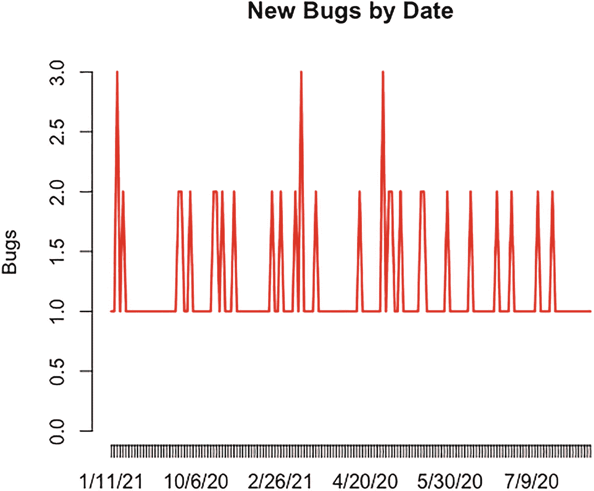

图 6-1

按日期排列的新 bug 时间序列

现在我们已经知道了每天产生多少个 bug，我们可以通过使用`cumsum()`函数得到一个累计总数。它获取每天打开的新 bug，并创建它们的运行总和，每天更新总数。它允许我们为一段时间内累积的 bug 计数生成一条趋势线。

```r
> runningTotalBugs <- cumsum(totalBugsByDate)
>
> runningTotalBugs
 1/11/21  1/12/20  1/12/21  1/13/20  1/17/21  1/18/21   1/2/21  1/21/20  1/22/20
       1        2        5        6        8        9       10       11       12
 1/24/20  1/24/21  1/25/20  1/27/21  1/29/21   1/3/20   1/4/20   1/5/20   1/5/21
      13       14       15       16       17       18       19       20       21
  1/9/20  10/1/20 10/10/20 10/15/20 10/16/20 10/18/20 10/21/20 10/25/20 10/26/20
      22       23       24       25       26       28       30       31       32
10/29/20 10/30/20  10/6/20 11/17/20 11/18/20 11/19/20 11/21/20 11/23/20 11/26/20
      34       35       36       37       38       39       40       41       43
 11/4/20  11/8/20 12/14/20 12/15/20 12/17/20 12/21/20 12/22/20 12/23/20 12/24/20
      45       46       48       49       50       51       53       54       55
12/27/20 12/29/20  12/3/20 12/31/20  2/12/21  2/13/21  2/14/20  2/15/20  2/15/21
      56       57       58       59       60       61       62       63       64
 2/16/20  2/22/21  2/24/20  2/25/21  2/26/21  2/28/21   2/3/21   2/4/21   2/8/21
      65       67       68       69       71       72       73       74       75
  3/1/20   3/1/21  3/11/21  3/14/21  3/17/21   3/2/20   3/2/21  3/22/20  3/23/21
      77       78       81       82       83       84       85       87       88
 3/24/20  3/25/21  3/26/20  3/28/20   3/3/21  3/31/20  3/31/21   3/6/21   3/7/20
      89       90       91       92       93       94       95       96       97
  3/7/21  4/12/21  4/13/20  4/15/21  4/18/21  4/19/21  4/20/20  4/25/20  4/26/21
      98       99      100      101      103      104      105      106      107
 4/27/20  4/29/21   4/4/20   4/5/21   4/7/20   4/8/20   5/1/20  5/10/20  5/11/21
     108      109      110      113      114      116      118      119      120
 5/12/20  5/14/21  5/16/21  5/17/20  5/17/21   5/2/21  5/20/20  5/20/21  5/22/20
     122      123      124      125      126      127      128      130      132
 5/24/21  5/25/20  5/26/21  5/27/20  5/27/21  5/28/20  5/28/21  5/29/21  5/30/20
     133      134      135      136      137      138      139      141      142
 5/31/20   5/6/20   5/8/20  6/11/20  6/11/21  6/14/20  6/16/21   6/2/21  6/20/20
     143      144      145      146      147      148      150      151      152
 6/28/20   6/3/20   6/3/21   6/4/20   6/4/21   6/6/21   6/7/20   6/7/21   6/8/21
     153      154      155      156      157      158      160      161      162
  6/9/21  7/14/20  7/18/20   7/2/20  7/22/20  7/23/20  7/25/20  7/28/20  7/29/20
     163      164      166      167      168      169      170      171      172
  7/9/20  8/10/20  8/17/20   8/2/20  8/21/20  8/22/20  8/23/20  8/24/20  8/26/20
     173      174      176      177      178      179      180      182      183
 8/27/20  8/28/20  8/29/20   8/3/20   8/6/20  9/10/20  9/11/20  9/14/20  9/16/20
     184      185      186      187      188      189      190      191      192
  9/2/20  9/21/20   9/8/20
     193      194      195

```

这正是我们现在需要的，来规划 bug 积压每天增长或减少的方式。为此，让我们将`runningTotalBugs`传递给`plot()`函数。我们将类型设置为`"l"`,以表示我们正在创建一个折线图，然后将该图命名为随时间累积的缺陷。在`plot()`函数中，我们还关闭了轴，这样我们就可以为这个图表绘制自定义轴。我们将希望绘制自定义轴，以便我们可以将日期指定为 x 轴标签。

为了绘制自定义轴，我们使用了`axis()`函数。`axis()`函数中的第一个参数是一个数字，它告诉 R 在哪里画轴。

*   `1`对应图表底部的 x 轴。

*   `2`在图表的左边。

*   `3`到图表的顶端。

*   在图表的右边。

```r
plot(runningTotalBugs, type="l", xlab="", ylab="", pch=15, lty=1, col="red", main="Cumulative Defects Over Time", axes=FALSE)
axis(1, at=1: length(runningTotalBugs), lab= row.names(totalBugsByDate))
axis(2, las=1, at=10*0:max(runningTotalBugs))

```

请注意，绘图类型设置为小写 L，而不是大写 I 或 1。这段代码创建了如图 [6-2](#Fig2) 所示的时序图。

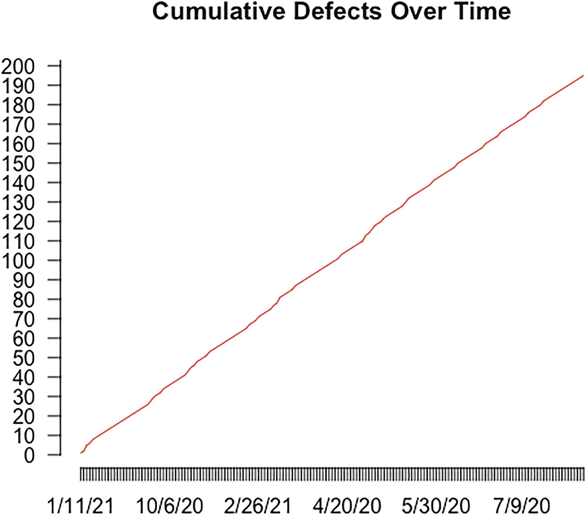

图 6-2

随着时间的推移累积的缺陷

这显示了按日期逐渐增加的 bug backlog。

到目前为止，完整的 R 代码如下:

```r
bugExport <- "allbugs.csv"
bugs <- read.table(bugExport, header=TRUE, sep=",")
as.Date(bugs$Date,"%m/%d/%y")
order(as.Date(bugs$Date,"%m/%d/%y"))
bugs <- bugs[order(as.Date(bugs$Date," %m/%d/%y ")),]
write.table(bugs, col.names=TRUE, row.names=FALSE, file="allbugsOrdered.csv", quote = FALSE, sep = ",")

totalBugsByDate <- table(bugs$Date)
plot(totalBugsByDate, type="l", main="New Bugs by Date", col="red", ylab="Bugs")
runningTotalBugs <- cumsum(totalBugsByDate)
runningTotalBugs
plot(runningTotalBugs, type="l", xlab="", ylab="", pch=15, lty=1, col="red", main="Cumulative Defects Over Time", axes=FALSE)
axis(1, at=1: length(runningTotalBugs), lab= row.names(totalBugsByDate))
axis(2, las=1, at=10*0:max(runningTotalBugs))

```

让我们来看看 bug 的关键程度，它不仅显示了 bug 何时被打开，还显示了最严重(或非严重)的 bug 何时被打开。

### 检查错误的严重性

请记住，当我们导出 bug 数据时，我们包括了`Severity`字段，它指示每个 bug 的严重程度。每个团队和组织可能有自己的严重性分类，但通常包括以下内容:

*   阻塞程序是非常严重的错误，它们会阻止大量工作的启动。它们通常具有不完整的功能，或者缺少广泛使用的功能的某些部分。它们也可能是与合同或法律约束功能(如隐藏式字幕或数字版权保护)的差异。

*   中度错误是严重的错误，但没有严重到导致发布的程度。它们可能会破坏不常用功能的功能。可访问性的范围，或者一个特性被广泛使用的程度，通常是使一个 bug 成为一个阻止者或者一个关键的决定因素。

*   **minor**是影响极小的 bug，甚至可能不会被最终用户注意到。

为了按严重程度分类 bug，我们简单地调用`table()`函数，就像我们按日期分类 bug 一样，但是这次也添加了`Severity`列:

```r
bugsBySeverity <- table(factor(bugs$Date),bugs$Severity)

```

这段代码创建了一个如下所示的数据结构:

```r
          Blocker Minor Moderate
  1/11/21       0     1        0
  1/12/20       0     1        0
  1/12/21       1     2        0
  1/13/20       1     0        0
  1/17/21       2     0        0
  1/18/21       0     0        1
  1/2/21        0     1        0
  1/21/20       1     0        0
  1/22/20       1     0        0
  1/24/20       0     1        0

```

然后我们可以绘制这个数据对象。我们这样做的方法是使用`plot()`函数为其中一列创建一个图表，然后使用`lines()`函数在图表上为其余的列绘制线条:

```r
plot(bugsBySeverity[,3], type="l", xlab="", ylab="", pch=15, lty=1, col="orange", main="New Bugs by Severity and Date", axes=FALSE)
lines(bugsBySeverity[,1], type="l", col="red", lty=1)
lines(bugsBySeverity[,2], type="l", col="yellow", lty=1)
axis(1, at=1: length(runningTotalBugs), lab= row.names(totalBugsByDate))
axis(2, las=1, at=0:max(bugsBySeverity[,3]))
legend("topleft", inset=.01, title="Legend", colnames(bugsBySeverity), lty=c(1,1,1), col= c("red", "yellow", "orange"))

```

该代码生成如图 [6-3](#Fig3) 所示的图表。

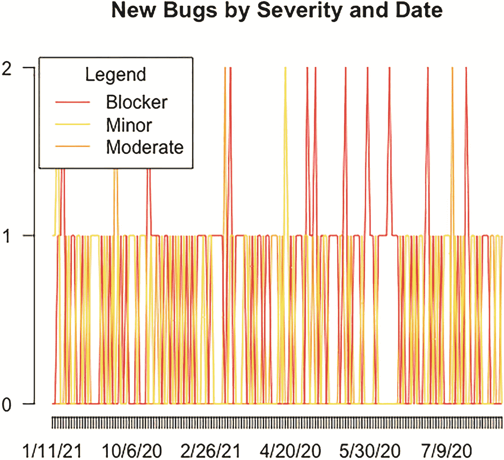

图 6-3

我们的 plot()和 lines()函数按照严重性绘制了错误图表

这很好，但是如果我们想按严重性查看累积的 bug 呢？我们可以简单地使用前面的 R 代码，但是我们可以绘制出每列的累积和，而不是绘制出每列:

```r
plot(cumsum(bugsBySeverity[,3]), type="l", xlab="", ylab="", pch=15, lty=1, col="orange", main="Running Total of Bugs by Severity", axes=FALSE)
lines(cumsum(bugsBySeverity[,1]), type="l", col="red", lty=1)
lines(cumsum(bugsBySeverity[,2]), type="l", col="yellow", lty=1)
axis(1, at=1: length(runningTotalBugs), lab= row.names(totalBugsByDate))
axis(2, las=1, at=0:max(cumsum(bugsBySeverity[,3])))
legend("topleft", inset=.01, title="Legend", colnames(bugsBySeverity), lty=c(1,1,1), col= c("red", "yellow", "orange"))

```

该代码生成如图 [6-4](#Fig4) 所示的图表。

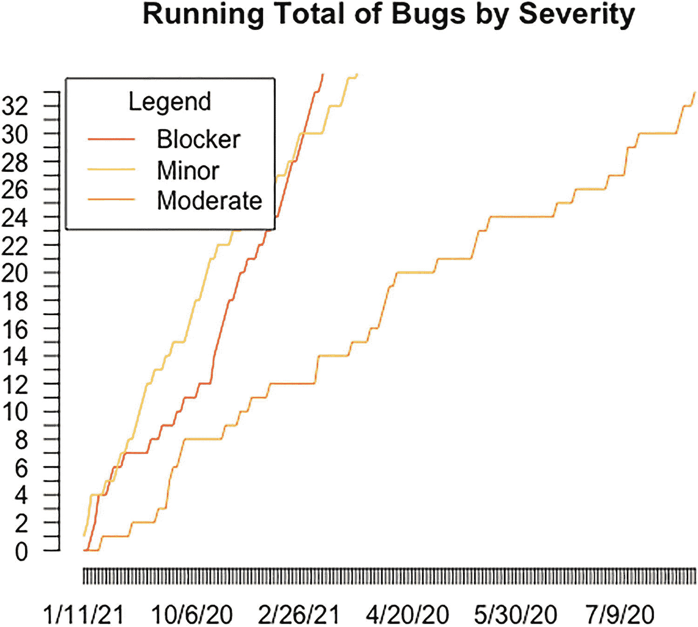

图 6-4

按严重性列出的运行错误总数

## 添加与 D3 的交互性

前面的例子是可视化和传播关于缺陷产生的信息的好方法。但是，如果我们能更进一步，让我们可视化的消费者更深入地研究他们感兴趣的数据点，会怎么样呢？假设我们希望允许用户将鼠标悬停在时间序列中的特定点上，并查看构成该数据点的所有 bug 的列表。我们可以用 D3 做到这一点；让我们走一遍并找出方法。

首先，让我们创建一个引用了`D3.js`的具有基本 HTML 框架结构的新文件，并将其保存为`timeseriesGranular.htm`。在这个例子中，我们想要使用 D3 的旧版本——版本 3 (d3.v3.js，可以在本书的代码下载中找到),因为它比新的代码结构允许更多的灵活性和逐步构建。

```r
<html>
<head></head>
<body>
<script src="d3.v3.js"></script>
</body>
</html>

```

接下来，我们在一个新的`script`标签中设置一些初步数据。我们创建一个对象来保存图形的边距数据以及高度和宽度。我们还创建了一个 D3 时间格式化程序，将从 string 读入的日期转换成一个本地的`Date`对象。

```r
<script>
var margin = {top: 20, right: 20, bottom: 30, left: 50},
 width = 960 - margin.left - margin.right,
 height = 500 - margin.top - margin.bottom;
var parseDate = d3.timeFormat("%m/%d/%y").parse;
</script>

```

### 读入数据

我们添加一些代码来读入数据(之前从 R 输出的`allbugsOrdered.csv`文件)。回想一下，这个文件包含了按日期排序的全部 bug 数据。

我们使用`d3.csv()`函数来读取这个文件:

*   第一个参数是文件的路径。

*   第二个参数是读入数据后要执行的函数。正是在这个匿名函数中，我们添加了大部分功能，或者至少是依赖于要处理的数据的功能。

匿名函数接受两个参数:

*   第一个捕获任何可能发生的错误。

*   第二个是正在读入的文件的内容。

在该函数中，我们首先遍历数据的内容，并使用日期格式化程序将`Date`列中的所有值转换为本地 JavaScript `Date`对象:

```r
d3.csv("allbugsOrdered.csv", function(error, data) {
        data.forEach(function(d) {
        d.Date = parseDate(d.Date);
});
});

```

如果我们要`console.log()`数据，它将是一个看起来像图 [6-5](#Fig5) 的对象数组。

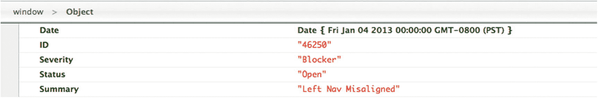

图 6-5

我们的 bug 数据对象

在匿名函数中，但在循环之后，我们使用`d3.nest()`函数来创建一个变量，该变量保存按日期分组的 bug 数据。我们将这个变量命名为`nested_data`:

```r
nested_data = d3.nest()
.key(function(d) { return d.Date; })
.entries(data);

```

`nested_data`变量现在是一个树形结构——特别是一个按日期索引的列表，每个索引都有一个 bug 列表。如果我们去`console.log() nested_data`，它将是一个看起来像图 [6-6](#Fig6) 的对象数组。

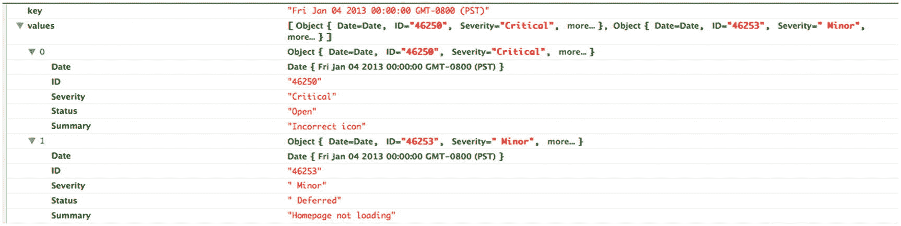

图 6-6

包含 bug 数据对象的数组

### 在页面上绘图

我们准备开始绘制页面。因此，让我们跳出回调函数，转到`script`标记的根，并使用之前定义的边距、宽度和高度将 SVG 标记写出到页面:

```r
var svg = d3.select("body").append("svg")
 .attr("width", width + margin.left + margin.right)
 .attr("height", height + margin.top + margin.bottom)
        .append("g")
 .attr("transform", "translate(" + margin.left + "," + margin.top + ")");

```

这是我们绘制轴和趋势线的容器。

仍然在根级别，我们为 x 轴和 y 轴添加一个 D3 `scale`对象，使用变量`width`表示 x 轴范围，使用变量`height`表示 y 轴范围。我们在根级别添加 x 轴和 y 轴，传入它们各自的缩放对象，并将它们定位在底部和左侧。

```r
var xScale = d3.time.scale()
 .range([0, width]);
var yScale= d3.scale.linear()
 .range([height, 0]);
var xAxis = d3.svg.axis()
 .scale(xScale)
 .orient("bottom");
var yAxis = d3.svg.axis()
 .scale(yScale)
 .orient("left");

```

但是它们仍然没有显示在页面上。我们需要返回到我们在`d3.csv()`调用中创建的匿名函数，并添加我们创建的`nested_data`列表，作为新创建的秤的域数据:

```r
xScale.domain(d3.extent(nested_data, function(d) { return new Date(d.key); }));
yScale.domain(d3.extent(nested_data, function(d) { return d.values.length; }));

```

从这里，我们需要生成轴。我们通过添加和选择一个用于通用分组的 SVG `g`元素，并将这个选择添加到`xAxis()`和`yAxis()` D3 函数中来实现。这也包含在加载数据时调用的匿名回调函数中。

我们还需要通过添加图表的高度来转换 x 轴，以便将其绘制在图表的底部:

```r
svg.append("g")
 .attr("transform", "translate(0," + height + ")")
 .call(xAxis);
svg.append("g")
 .call(yAxis)

```

这将创建图表的起点，其有意义的轴如图 [6-7](#Fig7) 所示。

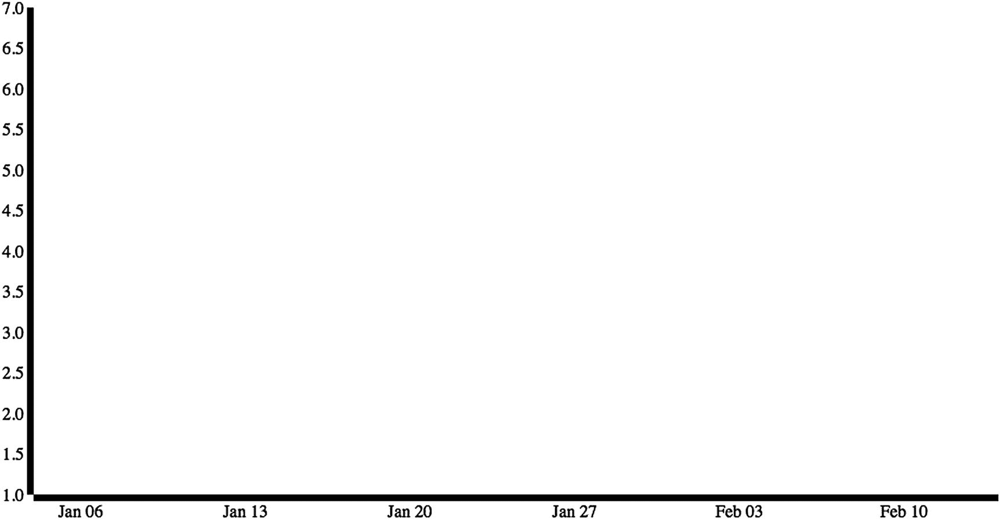

图 6-7

时间序列开始形成；x 轴和 y 轴，但还没有线条

需要添加趋势线。回到根级别，让我们创建一个名为`line`的变量作为 SVG 行。假设我们已经为该行设置了`data`属性。我们还没有，但一会儿就会了。对于线条的 x 值，我们将有一个函数返回通过`xScale`刻度对象过滤的日期。对于线条的 y 值，我们将创建一个函数，返回通过`yScale` scale 对象运行的 bug 计数值。

```r
var line = d3.svg.line()
 .x(function(d) { return xScale(new Date(d.key)); })
 .y(function(d) { return yScale(d.values.length); });

```

接下来，我们回到处理数据的匿名函数。在添加的轴的正下方，我们将追加一个 SVG 路径。我们设置`nested_data`变量作为路径的基准，新创建的`line`对象作为`d`属性。作为参考，`d`属性是我们指定路径描述的地方。关于`d`属性的文档见此处: [`https://developer.mozilla.org/en-US/docs/SVG/Attribute/d`](https://developer.mozilla.org/en-US/docs/SVG/Attribute/d) 。

```r
svg.append("path")
 .datum(nested_data)
 .attr("d", line);

```

我们现在可以开始在浏览器中看到一些东西。到目前为止，代码应该是这样的:

```r
<!DOCTYPE html>
<head>
<meta charset="utf-8">
</head>
<body>
        <script src="d3.v3.js"></script>
<script>
var margin = {top: 20, right: 20, bottom: 30, left: 50},
 width = 960 - margin.left - margin.right,
 height = 500 - margin.top - margin.bottom;
var parseDate = d3.time.format("%m-%d-%Y").parse;
var xScale = d3.time.scale()
 .range([0, width]);
var yScale = d3.scale.linear()
 .range([height, 0]);
var xAxis = d3.svg.axis()
         .scale(xScale)
         .orient("bottom");
var yAxis = d3.svg.axis()
         .scale(yScale)
         .orient("left");
var line = d3.svg.line()
 .x(function(d) { return xScale(new Date(d.key)); })
        .y(function(d) { return yScale(d.values.length); });
var svg = d3.select("body").append("svg")
 .attr("width", width + margin.left + margin.right)
 .attr("height", height + margin.top + margin.bottom)
        .append("g")
 .attr("transform", "translate(" + margin.left + "," + margin.top + ")");
d3.csv("allbugsOrdered.csv", function(error, data) {
        data.forEach(function(d) {
                d.Date = parseDate(d.Date);
        });
 nested_data = d3.nest()
                .key(function(d) { return d.Date; })
                .entries(data);
         xScale.domain(d3.extent(nested_data, function(d) { return new Date(d.key); }));
         yScale.domain(d3.extent(nested_data, function(d) { return d.values.length; }));
         svg.append("g")
         .attr("transform", "translate(0," + height + ")")
         .call(xAxis);
                svg.append("g")
                 .call(yAxis);
                svg.append("path")
                 .datum(nested_data)
                 .attr("d", line);
});
</script>

</body>
</html>

```

该代码产生如图 [6-8](#Fig8) 所示的图形。

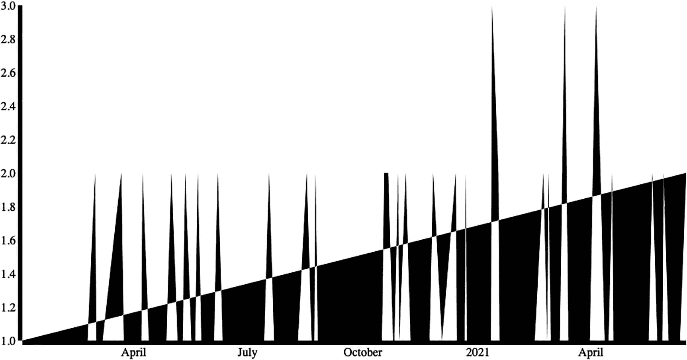

图 6-8

具有行数据但填充不正确的时间序列

但这并不完全正确。路径的阴影是基于浏览器对意图的最佳猜测，对其感知的封闭区域进行阴影处理。让我们使用 CSS 显式关闭阴影，改为设置路径线的颜色和宽度:

```r
<style>
.trendLine {
 fill: none;
 stroke: #CC0000;
 stroke-width: 1.5px;
}
</style>

```

我们用类`trendLine`为页面上的任何元素创建了样式规则。接下来，让我们在创建路径的同一个代码块中将该类添加到 SVG 路径中:

```r
Svg.append("path")
 .datum(nested_data)
 .attr("d", line)
 .attr("class", "trendLine");

```

该代码生成如图 [6-9](#Fig9) 所示的图表。


图 6-9

具有校正的线条但无样式轴的时间序列

看起来好多了！我们应该做一些小的改动，比如在 y 轴上添加文本标签，并调整轴线的宽度，使其更加整洁:

```r
.axis path{
 fill: none;
 stroke: #000;
 shape-rendering: crispEdges;
}

```

这将使我们的斧头看起来更紧。我们只需要在创建轴时将样式应用到轴上:

```r
svg.append("g")
 .attr("transform", "translate(0," + height + ")")
 .call(xAxis)
 .attr("class", "axis");
svg.append("g")
 .call(yAxis)
 .attr("class", "axis");

```

结果如图 [6-10](#Fig10) 所示。

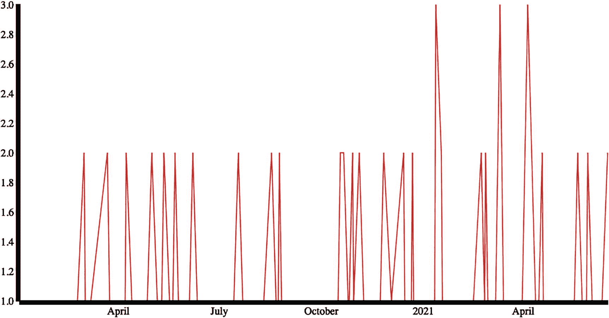

图 6-10

用样式化轴更新的时间序列

到目前为止，这很好，但它没有显示出在 r 中这样做的真正好处。事实上，我们写了相当多的额外代码只是为了获得奇偶校验，甚至没有做我们在 r 中做的任何数据清理。

使用 D3 的真正好处是增加了交互性。

### 添加交互性

假设我们有这个新错误的时间序列，我们很好奇在二月中旬的大高峰中有什么错误。通过利用我们在 HTML 和 JavaScript 中工作的事实，我们可以通过添加一个工具提示框来扩展这一功能，该框列出了每个日期的错误。

要做到这一点，我们首先应该创建用户可以鼠标悬停的明显区域，例如每个数据点或离散日期处的红圈。要做到这一点，我们只需要在我们添加路径的地方下面创建 SVG 圆圈，在读入外部数据时触发匿名函数。我们将`nested_data`变量设置为圆圈的`data`属性，将它们设置为半径为 3.5 的红色，并将它们的 x 和 y 属性分别设置为与日期和 bug 总数相关联:

```r
svg.selectAll("circle")
.data(nested_data)
.enter().append("circle")
        .attr("r", 3.5)
        .attr("fill", "red")
        .attr("cx", function(d) { return xScale(new Date(d.key)); })
        .attr("cy", function(d) { return yScale(d.values.length);})

```

这段代码更新了现有的时间序列，看起来如图 [6-11](#Fig11) 所示。这些红圈现在是焦点区域，用户可以将鼠标放在上面查看更多信息。

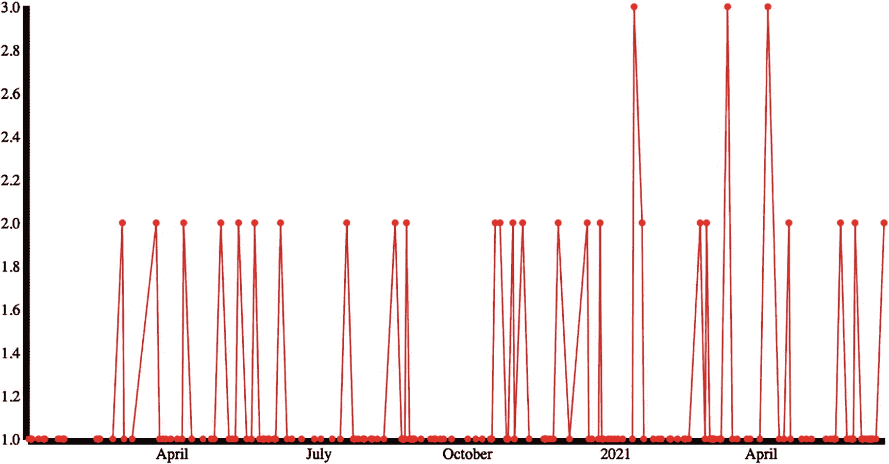

图 6-11

添加到线上每个数据点的圆

让我们接下来编写一个`div`作为工具提示，我们将显示相关的错误数据。为此，我们将创建一个新的`div`，就在我们在`script`标签的根处创建`line`变量的下方。我们在 D3 中再次这样做，选择`body`标签并给它附加一个`div`，给它一个类和 id`tooltip`——这样我们就可以对它应用`tooltip`样式(我们将在一分钟内创建它),这样我们就可以在本章的后面通过 ID 与它交互。我们将默认隐藏它。我们将把对这个`div`的引用存储在一个我们称之为`tooltip`的变量中。

```r
var tooltip = d3.select("body")
 .append("div")
 .attr("class", "tooltip")
 .attr("id", "tooltip")
 .style("position", "absolute")
 .style("z-index", "10")
 .style("visibility", "hidden");

```

我们接下来需要使用 CSS 样式化这个`div`。我们将不透明度调整为只有 75%可见，这样当工具提示出现在趋势线上时，我们可以看到它后面的趋势线。我们对齐文本，设置字体大小，使 div 有一个白色背景，并给它圆角。

```r
.tooltip{
        opacity: .75;
        text-align:center;
        font-size:12px;
        width:100px;
        padding:5px;
        border:1px solid #a8b6ba;
        background-color:#fff;
        margin-bottom:5px;
        border-radius: 19px;
        -moz-border-radius: 19px;
        -webkit-border-radius: 19px;
}

```

接下来，我们必须向圆圈添加一个`mouseover`事件处理程序，用信息填充工具提示并取消隐藏工具提示。为此，我们返回到创建圆圈的代码块，并添加一个触发匿名函数的`mousemove`事件处理程序。

在匿名函数中，我们覆盖了工具提示的`innerHTML`,以显示当前红圈的日期以及与该日期相关的错误数量。然后，我们遍历 bug 列表，写出每个 bug 的 ID。

```r
svg.selectAll("circle")
 .data(nested_data)
 .enter().append("circle")
 .attr("r", 3.5)
 .attr("fill", "red")
 .attr("cx", function(d) { return xScale(new Date(d.key)); })
 .attr("cy", function(d) { return yScale(d.values.length);})
 .on("mouseover", function(d){
 document.getElementById("tooltip").innerHTML = d.key + " " + d.values.length + " bugs<br/>";
 for(x=0;x<d.values.length;x++){
 document.getElementById("tooltip").innerHTML += d.values[x].ID + "<br/>";
 }
 tooltip.style("visibility", "visible");
 })

```

如果我们想更进一步，我们可以为每个 bug ID 创建链接，链接到 bug 跟踪软件，列出每个 bug 的描述，如果 bug 跟踪软件有一个 API 接口，我们甚至可以有表单字段，让我们可以直接从这个工具提示更新 bug 信息。只有我们的想象力和可用的工具限制了我们将这个概念延伸到什么程度的可能性。

最后，我们向红圈添加了一个`mousemove`事件处理程序，这样每当用户将鼠标放在红圈上时，我们就可以根据上下文重新定位工具提示。为此，我们使用`d3.mouse`对象获取当前鼠标坐标。我们使用这些坐标来简单地用 CSS 重新定位工具提示。所以我们没有用工具提示覆盖红色圆圈，我们将顶部属性偏移 25 像素，将左侧属性偏移 75 像素。

```r
svg.selectAll("circle")
 .data(nested_data)
 .enter().append("circle")
 .attr("r", 3.5)
 .attr("fill", "red")
 .attr("cx", function(d) { return xScale(new Date(d.key)); })
 .attr("cy", function(d) { return yScale(d.values.length);})
 .on("mouseover", function(d){
 document.getElementById("tooltip").innerHTML = d.key + " " + d.values.length + " bugs<br/>";
 for(x=0;x<d.values.length;x++){
 document.getElementById("tooltip").innerHTML += d.values[x].ID + "<br/>";
 }
 tooltip.style("visibility", "visible");
 })
 .on("mousemove", function(){
 return tooltip.style("top", (d3.mouse(this)[1] + 25)+"px").style("left", (d3.mouse(this)[0] + 70)+"px");
 });

```

当鼠标悬停在其中一个红色圆圈上时，应显示工具提示(参见图 [6-12](#Fig12) )。

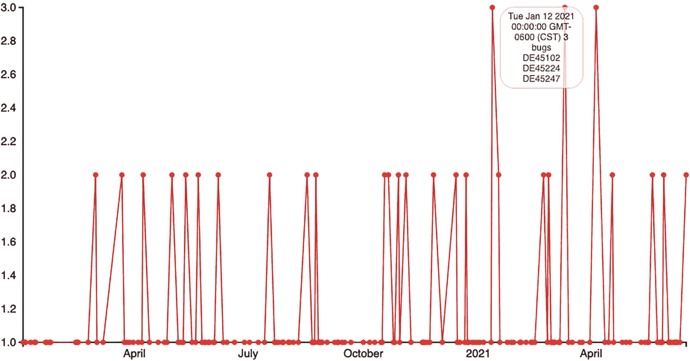

图 6-12

显示翻转的完整时间序列

完整的源代码现在应该是这样的:

```r
<!DOCTYPE html>
<html>
<meta charset="utf-8">
<head>
<style>
body {
 font: 15px sans-serif;
}
.trendLine {
 fill: none;
 stroke: #CC0000;
 stroke-width: 1.5px;
}
.axis path{
 fill: none;
 stroke: #000;
 shape-rendering: crispEdges;
}
.tooltip{
        opacity: .75;
        text-align:center;
        font-size:12px;
        width:100px;
        padding:5px;
        border:1px solid #a8b6ba;
        background-color:#fff;
        margin-bottom:5px;
        border-radius: 19px;
        -moz-border-radius: 19px;
        -webkit-border-radius: 19px;
}
</style>
</head>
<body>
        <script src="d3.v3.js"></script>
<script>

var margin = {top: 20, right: 20, bottom: 30, left: 50},
 width = 960 - margin.left - margin.right,
 height = 500 - margin.top - margin.bottom;
var parseDate = d3.time.format("%m/%d/%y").parse;
var xScale = d3.time.scale()
 .range([0, width]);
var yScale = d3.scale.linear()
 .range([height, 0]);
var xAxis = d3.svg.axis()
         .scale(xScale)
         .orient("bottom");
var yAxis = d3.svg.axis()
         .scale(yScale)
         .orient("left");
var line = d3.svg.line()
 .x(function(d) { return xScale(new Date(d.key)); })
 .y(function(d) { return yScale(d.values.length); });
var tooltip = d3.select("body")
 .append("div")
 .attr("class", "tooltip")
 .attr("id", "tooltip")
 .style("position", "absolute")
 .style("z-index", "10")
 .style("visibility", "hidden");
var svg = d3.select("body").append("svg")
 .attr("width", width + margin.left + margin.right)
 .attr("height", height + margin.top + margin.bottom)
        .append("g")
 .attr("transform", "translate(" + margin.left + "," + margin.top + ")");
d3.csv("https://jonwestfall.com/data/allbugsOrdered.csv", function(error, data) {
        data.forEach(function(d) {
                d.Date = parseDate(d.Date);
        });
 nested_data = d3.nest()
                .key(function(d) { return d.Date; })
                .entries(data);
         xScale.domain(d3.extent(nested_data, function(d) { return new Date(d.key); }));
         yScale.domain(d3.extent(nested_data, function(d) { return d.values.length; }));
         svg.append("g")
         .attr("transform", "translate(0," + height + ")")
         .call(xAxis)

         .attr("class", "axis");
                svg.append("g")
                 .call(yAxis)
         .attr("class", "axis");
                svg.append("path")
                 .datum(nested_data)
                 .attr("d", line)
         .attr("class", "trendLine");
                svg.selectAll("circle")
                 .data(nested_data)
                 .enter().append("circle")
                 .attr("r", 3.5)
                 .attr("fill", "red")
                 .attr("cx", function(d) { return xScale(new Date(d.key)); })
                 .attr("cy", function(d) { return yScale(d.values.length);})
                         .on("mouseover", function(d){
                                 document.getElementById("tooltip").innerHTML = d.key + " " + d.values.length + " bugs<br/>";
                                 for(x=0;x<d.values.length;x++){
                                         document.getElementById("tooltip").innerHTML += d.values[x].ID + "<br/>";
                               }
                                tooltip.style("visibility", "visible");
                })
                        .on("mousemove", function(){
                                return tooltip.style("top", (d3.mouse(this)[1] + 25)+"px").style("left", (d3.mouse(this)[0] + 70)+"px");
 });
});
</script>
</body>
</html>

```

## 摘要

本章探索了时间序列图，既有哲学上的，也有使用它们来跟踪一段时间内的 bug 创建的上下文。我们从所选的错误跟踪软件中导出原始错误数据，并将其导入到 R 中进行清理和分析。

在 R 中，我们研究了建模和可视化数据的不同方法，研究了聚合和粒度细节，例如新的 bug 如何随着时间的推移对运行总数产生影响，或者新的 bug 是何时随着时间的推移引入的。当我们能够把我们正在看的日期联系起来时，这是特别有价值的。

然后，我们将数据读入 D3，并创建了一个交互式时间序列，使我们能够从高级趋势数据深入到所创建的每个 bug 的细节。

下一章将探讨如何创建条形图，以及如何使用它们来确定需要关注和改进的领域。