# 七、条形图

第 [6](6.html) 章探讨了如何使用时序图来查看一段时间内的缺陷数据，这一章介绍了条形图，它显示了相对于特定数据集的有序或分级数据。它们通常由 x 轴和 y 轴组成，并有条形或彩色矩形来表示类别的值。

威廉·普莱费尔(William Playfair)在 1786 年的第一版《商业与政治地图集》(The Commercial and Political Atlas)中创建了条形图，以显示苏格兰与世界不同地区的进出口数据(见图 [7-1](#Fig1) )。他出于需要创造了它；地图册中的其他图表是时间序列图表，展示了数百年的贸易数据，但对于苏格兰来说，只有一年的数据。在使用时间序列图时，Playfair 认为这是一种低劣的可视化；一种与现有资源的妥协，因为它“不包含时间的任何部分，并且在效用上比包含时间的部分差得多”(Playfair，1786，第 101 页)。

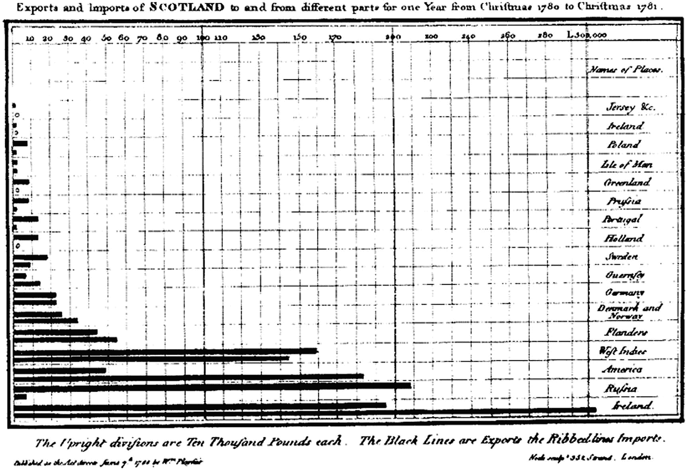

图 7-1

威廉·普莱费尔的条形图显示了苏格兰的进出口数据

Playfair 最初对他的发明评价很低，以至于他都懒得把它收录到随后的第二版和第三版地图集里。他继续设想一种不同的方式来展示整体的一部分；为此，他在 1801 年出版的统计年鉴中发明了饼状图。

条形图是展示分级数据的好方法，不仅因为条形图是显示数值差异的清晰方式，而且通过使用不同类型的条形图(如堆积条形图和分组条形图),该模式还可以扩展为包括更多的数据点。

## 标准条形图

让我们来看看您已经熟悉的数据——上一章的`bugsBySeverity`数据:

```r
head(bugsBySeverity)

          Blocker Minor Moderate
  1/11/21       0     1        0
  1/12/20       0     1        0
  1/12/21       1     2        0
  1/13/20       1     0        0
  1/17/21       2     0        0
  1/18/21       0     0        1

```

您可以创建一个新的列表，其中包含每种错误类型的总和，并以条形图的形式显示总数，如下所示:

```r
totalBugsBySeverity <- c(sum(bugsBySeverity[,1]), sum(bugsBySeverity[,2]), sum(bugsBySeverity[,3]))
barplot(totalBugsBySeverity, main="Total Bugs by Severity")
axis(1, at=1: length(totalBugsBySeverity), lab=c("Blocker", "Critical", "Minor"))

```

该代码生成如图 [7-2](#Fig2) 所示的图表。

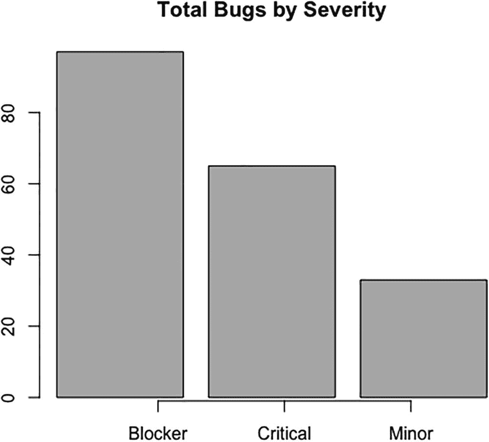

图 7-2

按严重性划分的错误条形图

## 堆积条形图

堆积条形图允许我们显示类别中的子部分或分段。假设您使用`bugsBySeverity`时间序列数据，并希望查看每天新出现的 bug 的危险程度:

```r
t(bugsBySeverity)

    1/11/21 1/12/20 1/12/21 1/13/20 1/17/21 1/18/21 1/2/21 1/21/20 1/22/20
Blocker   0       0       1       1       2       0      0       1       1
Minor     1       1       2       0       0       0      1       0       0
Moderate  0       0       0       0       0       1      0       0       0

    1/24/20 1/24/21 1/25/20 1/27/21 1/29/21 1/3/20 1/4/20 1/5/20 1/5/21
Blocker   0       0       1       0       0      0      0      0      0
Minor     1       1       0       1       0      1      1      1      1
Moderate  0       0       0       0       1      0      0      0      0

    1/9/20 10/1/20 10/10/20 10/15/20 10/16/20 10/18/20 10/21/20 10/25/20
Blocker  1       0        0        1        0        0        0        1
Minor    0       1        0        0        1        0        1        0
Moderate 0       0        1        0        0        2        1        0

    10/26/20 10/29/20 10/30/20 10/6/20 11/17/20 11/18/20 11/19/20 11/21/20
Blocker    0        1        0       0        0        1        0        0
Minor      0        0        1       1        1        0        1        1
Moderate   1        1        0       0        0        0        0        0

    11/23/20 11/26/20 11/4/20 11/8/20 12/14/20 12/15/20 12/17/20 12/21/20
Blocker    0        2       1       1        1        1        0        1
Minor      1        0       1       0        0        0        1        0
Moderate   0        0       0       0        1        0        0        0

    12/22/20 12/23/20 12/24/20 12/27/20 12/29/20 12/3/20 12/31/20 2/12/21
Blocker    1        0        1        0        0       1        0       1
Minor      0        1        0        0        1       0        1       0
Moderate   1        0        0        1        0       0        0       0

    2/13/21 2/14/20 2/15/20 2/15/21 2/16/20 2/22/21 2/24/20 2/25/21
Blocker   0       1       0       1       1       1       1       0
Minor     0       0       1       0       0       1       0       1
Moderate  1       0       0       0       0       0       0       0

    2/26/21 2/28/21 2/3/21 2/4/21 2/8/21 3/1/20 3/1/21 3/11/21 3/14/21
Blocker   1       1      1      1      1      0      1       2       0
Minor     1       0      0      0      0      0      0       1       1
Moderate  0       0      0      0      0      2      0       0       0

    3/17/21 3/2/20 3/2/21 3/22/20 3/23/21 3/24/20 3/25/21 3/26/20 3/28/20
Blocker   1      1      1       1       0       0       1       0       1
Minor     0      0      0       1       1       0       0       1       0
Moderate  0      0      0       0       0       1       0       0       0

    3/3/21 3/31/20 3/31/21 3/6/21 3/7/20 3/7/21 4/12/21 4/13/20 4/15/21
Blocker  1       0       1      1      0      0       0       0       0
Minor    0       0       0      0      0      0       0       1       0
Moderate 0       1       0      0      1      1       1       0       1

    4/18/21 4/19/21 4/20/20 4/25/20 4/26/21 4/27/20 4/29/21 4/4/20 4/5/21
Blocker   0       0       1       0       1       1       1      0      2
Minor     2       1       0       1       0       0       0      1      1
Moderate  0       0       0       0       0       0       0      0      0

    4/7/20 4/8/20 5/1/20 5/10/20 5/11/21 5/12/20 5/14/21 5/16/21 5/17/20
Blocker  1      1      2       0       1       1       0       1       1
Minor    0      0      0       1       0       1       1       0       0
Moderate 0      1      0       0       0       0       0       0       0

    5/17/21 5/2/21 5/20/20 5/20/21 5/22/20 5/24/21 5/25/20 5/26/21 5/27/20
Blocker   1      1       0       1       2       0       0       1       1
Minor     0      0       0       0       0       1       0       0       0
Moderate  0      0       1       1       0       0       1       0       0

    5/27/21 5/28/20 5/28/21 5/29/21 5/30/20 5/31/20 5/6/20 5/8/20 6/11/20
Blocker  1       0       1       2       1       1      0      1       1
Minor    0       1       0       0       0       0      1      0       0
Moderate 0       0       0       0       0       0      0      0       0

    6/11/21 6/14/20 6/16/21 6/2/21 6/20/20 6/28/20 6/3/20 6/3/21 6/4/20
Blocker   1       1       2      1       1       1      0      1      0
Minor     0       0       0      0       0       0      0      0      1
Moderate  0       0       0      0       0       0      1      0      0

    6/4/21 6/6/21 6/7/20 6/7/21 6/8/21 6/9/21 7/14/20 7/18/20 7/2/20
Blocker  0      1      0      1      0      0       1       2      0
Minor    1      0      1      0      1      1       0       0      1
Moderate 0      0      1      0      0      0       0       0      0

    7/22/20 7/23/20 7/25/20 7/28/20 7/29/20 7/9/20 8/10/20 8/17/20 8/2/20
Blocker   1       0       0       1       0      0       0       0      0
Minor     0       1       0       0       1      1       1       0      1
Moderate  0       0       1       0       0      0       0       2      0

    8/21/20 8/22/20 8/23/20 8/24/20 8/26/20 8/27/20 8/28/20 8/29/20 8/3/20
Blocker   1       0       0       2       1       0       0       1      0
Minor     0       0       1       0       0       1       1       0      1
Moderate  0       1       0       0       0       0       0       0      0

    8/6/20 9/10/20 9/11/20 9/14/20 9/16/20 9/2/20 9/21/20 9/8/20
Blocker  1       1       1       0       0      0       0      0
Minor    0       0       0       0       0      1       1      0
Moderate 0       0       0       1       1      0       0      1

```

您可以用堆积条形图表示以下数据，如图 [7-3](#Fig3) 所示:

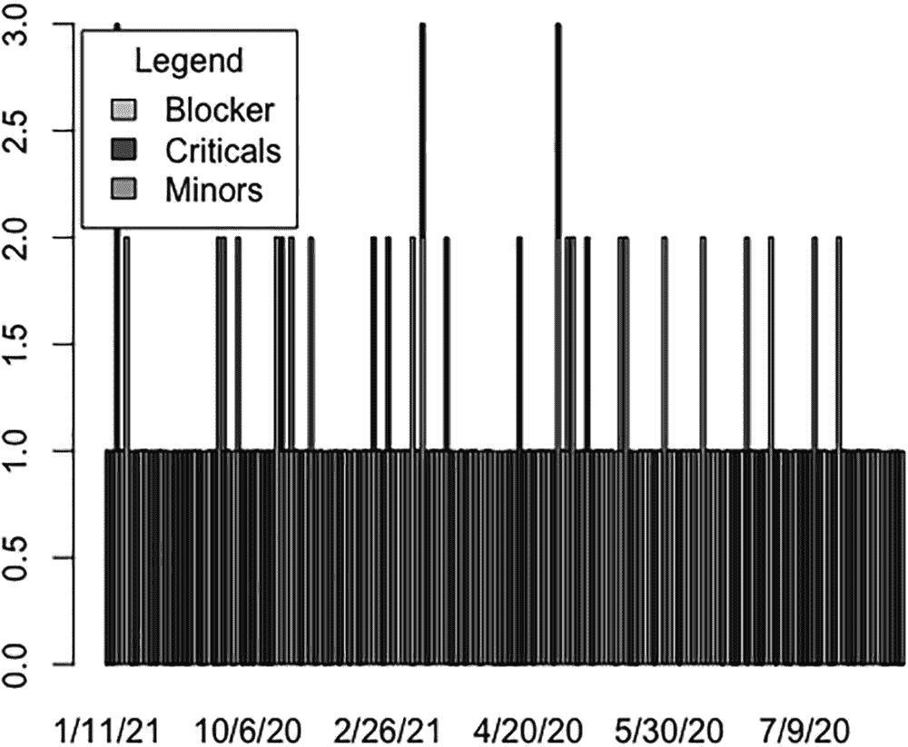

图 7-3

按严重性和日期排列的错误堆积条形图。因为每天臭虫的总数不同，所以这些条的高度也不一样

```r
barplot(t(bugsBySeverity), col=c("#CCCCCC", "#666666", "#AAAAAA"))
legend("topleft", inset=.01, title="Legend", c("Blocker", "Criticals", "Minors"), fill=c("#CCCCCC", "#666666", "#AAAAAA"))

```

总的缺陷由条形的全高表示，每个条形的彩色部分表示缺陷的严重程度。堆积条形图使我们能够显示数据中的细微差别，尽管人们可能希望在可视化时减少日期的数量以获得更清晰的图片。

## 分组条形图

分组条形图使我们能够显示与堆叠条形图相同的细微差别，但我们不是将各段放在彼此的顶部，而是将它们分成并排的分组。图 [7-4](#Fig4) 显示 x 轴上的每个日期都有三个与之相关的条形，每个条形代表一个关键程度类别:

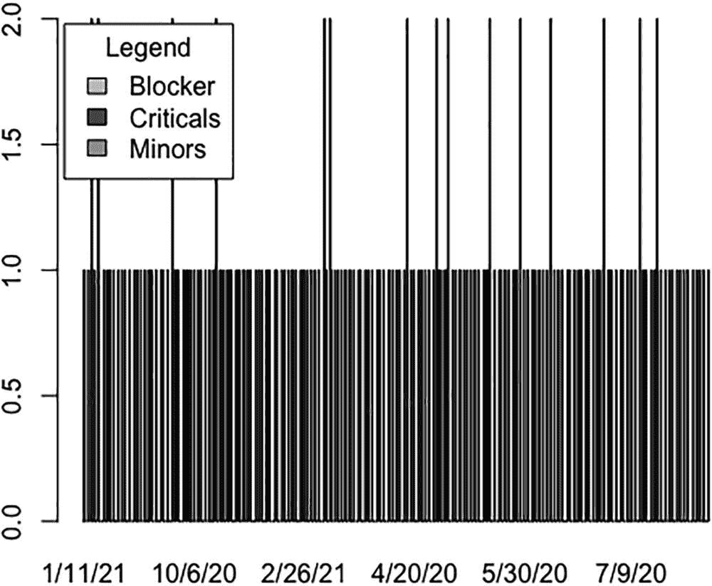

图 7-4

按严重性和日期分组的错误条形图

```r
barplot(t(bugsBySeverity), beside=TRUE, col=c("#CCCCCC", "#666666", "#AAAAAA"))
legend("topleft", inset=.01, title="Legend", c("Blocker", "Criticals", "Minors"), fill=c("#CCCCCC", "#666666", "#AAAAAA"))

```

由于数据的密度，乍一看，数字 [7-3](#Fig3) 和 [7-4](#Fig4) 可能是相同的。为了避免这种情况，我们可以使用下面的代码来减少数据点的数量，只显示五天的数据。尝试使用这两个代码片段来查看更改。

```r
barplot(t(bugsBySeverity[1:10,]), col=c("#CCCCCC", "#666666", "#AAAAAA"))
legend("topleft", inset=.01, title="Legend", c("Blocker", "Criticals", "Minors"), fill=c("#CCCCCC", "#666666", "#AAAAAA"))

versus

barplot(t(bugsBySeverity[1:10,]), beside=TRUE, col=c("#CCCCCC", "#666666", "#AAAAAA"))
legend("topleft", inset=.01, title="Legend", c("Blocker", "Criticals", "Minors"), fill=c("#CCCCCC", "#666666", "#AAAAAA"))

```

## 可视化和分析生产事故

如果您开发的产品被某个人使用——最终用户、消费服务甚至内部客户——您很可能经历过生产事故。当应用程序的某个部分在生产中对用户不正常时，就会发生生产事故。它非常像一个 bug，但它是您的客户所经历和报告的 bug。

就像 bug 一样，生产事件是正常的，是软件开发的预期结果。谈论事件时，有三个主要问题需要考虑:

*   **报告的错误的严重性或影响程度**:站点中断和小的布局错误之间有很大的区别。

*   **频率，或者说事件发生或重复发生的频率**:如果你的网络应用充满问题，你的客户体验、你的品牌和你正常的工作流程都会受到影响。

*   **持续时间，或个别事件持续多长时间**:持续时间越长，受影响的顾客就越多，对你的品牌影响就越大。

处理生产事故是产品运营和组织成熟的重要组成部分。根据事件的严重程度，它们可能会破坏你的日常工作；团队可能需要停止一切工作，努力解决这个问题。优先级较低的项目可以排队，并与常规功能工作一起引入常规工作主体。

与处理生产事故同样重要的是能够分析生产事故的趋势，以确定问题领域。问题区域通常是生产中经常出现问题的特征或部分。一旦我们确定了问题领域，我们就可以进行根本原因分析，并有可能开始围绕这些领域构建主动的脚手架。

Note

*主动脚手架*是我创造的一个术语，用来描述建立故障转移或额外的安全围栏，以防止问题区域的问题再次出现。主动搭建可以是从检测用户何时接近容量限制(如浏览器 cookie 限制或应用程序堆大小，并在问题发生前纠正)到注意第三方资产的性能问题，并在将它们呈现给客户端之前拦截和优化它们。

另一种处理生产事故的有趣方式是 Heroku 过去处理事故的方式:将事故与逐月正常运行时间可视化一起放在时间线上，并公开发布。Heroku 的生产事件时间表在 [`https://status.heroku.com/`可用；](https://status.heroku.com/%3B)见图 [7-5](#Fig5) 。

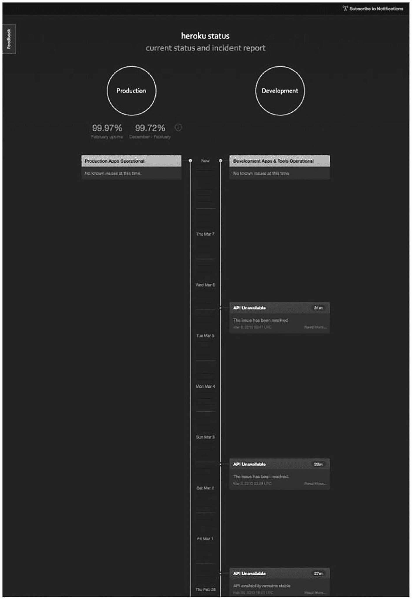

图 7-5

Heroku 状态页面

GitHub 过去也有一个很棒的状态页面，可以可视化关于其性能和正常运行时间的关键指标(见图 [7-6](#Fig6) )。具有讽刺意味的是，他们现在已经切换到 Heroku 放弃的时间线方法(见图 [7-7](#Fig7) ，来自 [`www.githubstatus.com/history`](http://www.githubstatus.com/history) )。

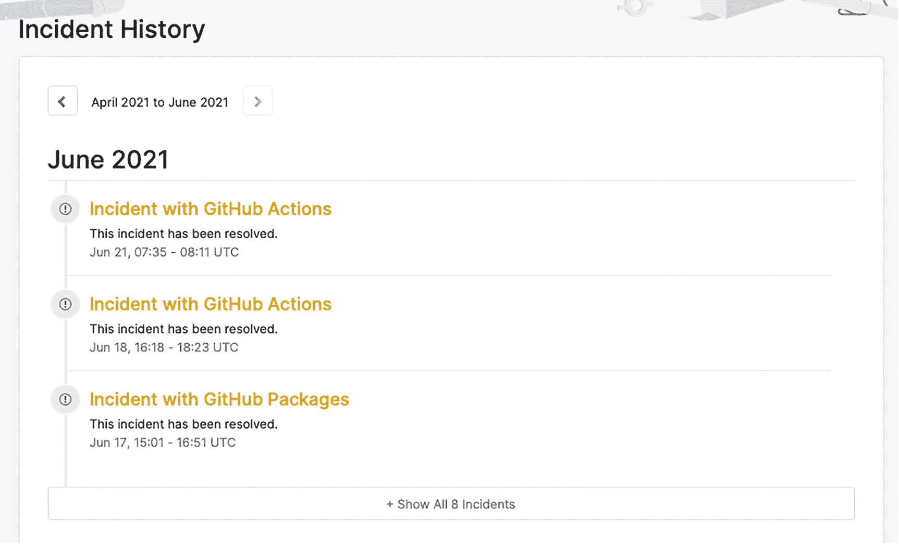

图 7-7

GitHub 的时间表

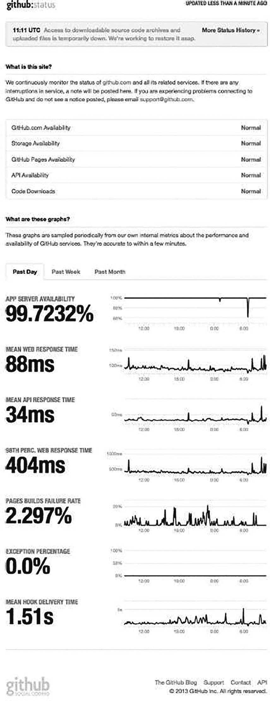

图 7-6

GitHub 状态页

就我们的目的而言，本章使用条形图按特征查看生产事故，以开始识别我们自己产品中的问题区域。

## 用 R 在条形图上绘制数据

如果我们想要规划出我们的生产事件，我们必须首先获得数据的导出，就像我们需要为 bug 做的那样。因为生产事故通常是一次性事件，公司通常使用一系列方法来跟踪它们，从吉拉( [`www.atlassian.com/software/jira/overview`](http://www.atlassian.com/software/jira/overview) )等票务系统到维护项目的电子表格，只要我们能检索到原始数据，什么都行。(乔恩在这里做了样本数据: [`http://jonwestfall.com/data/productionincidents.csv`](http://jonwestfall.com/data/productionincidents.csv) )。)

一旦我们有了原始数据，它可能看起来像下面这样:一个逗号分隔的平面列表，包含 ID、日期戳和描述列。还应该有一列列出发生事件的应用程序的功能或部分。

```r
ID,DateOpened,DateClosed,Description,Feature,Severity
880373,5/22/21 10:14,5/25/21 11:52,Fwd: 2 new e-books Associate Editors,General Inquiry,1
837947,4/29/21 12:35,5/7/21 14:09,Fwd: New Resource to Post,General Inquiry,2
489036,4/23/21 14:38,4/27/21 9:00,STP ebook editor with finished book,General Inquiry,1
443617,1/25/21 17:43,1/26/21 8:49,New member - IRC Committee at STP,General Inquiry,2
911894,1/18/21 10:25,1/20/21 8:51,Fwd: Updates to International Relations Committee page,General Inquiry,1
974124,1/11/21 14:55,1/12/21 10:55,Fwd: New Resource to Post,General Inquiry,2
341352,1/2/21 10:51,1/5/21 16:26,New eBooks,eBook Publishing,1

```

让我们将原始数据读入 R 并存储在一个名为`prodData`的变量中:

```r
> prodIncidentsFile <- "http://jonwestfall.com/data/productionincidents.csv";
> prodData <- read.table(prodIncidentsFile, sep=",", header=TRUE)
> prodData
      ID    DateOpened     DateClosed  Description              Feature           Severity
1 880373 5/22/21 10:14  5/25/21 11:52  Fwd: 2 new e-books Associate Editors    General Inquiry   1
2 837947 4/29/21 12:35   5/7/21 14:09  Fwd: New Resource to Post    General Inquiry   2
3 489036 4/23/21 14:38   4/27/21 9:00  STP ebook editor with finished book    General Inquiry   1
4 443617 1/25/21 17:43   1/26/21 8:49  New member - IRC Committee at STP    General Inquiry   2
5 911894 1/18/21 10:25   1/20/21 8:51  Fwd: Updates to International                                        Relations Committee page    General Inquiry   1
6 974124 1/11/21 14:55  1/12/21 10:55  Fwd: New Resource to Post    General Inquiry   2
7 341352  1/2/21 10:51   1/5/21 16:26  New eBooks     eBook Publishing  1

```

我们希望按照`Feature`列对它们进行分组，这样我们就可以绘制特性总数的图表。为此，我们在 R 中使用了`aggregate()`函数。`aggregate()`函数接受一个 R 对象、一个用作分组元素的列表和一个应用于分组元素的函数。因此，假设我们调用`aggregate()`函数，将 ID 列作为 R 对象传入，让它按`Feature`列分组，并让 R 获得每个特性分组的长度:

```r
prodIncidentByFeature <- aggregate(prodData$ID, by=list(Feature=prodData$Feature), FUN=length)

```

这段代码创建了一个如下所示的对象:

```r
> prodIncidentByFeature
           Feature x
1 eBook Publishing 1
2  General Inquiry 6

```

然后我们可以将这个对象传递给`barplot()`函数，得到如图 [7-8](#Fig8) 所示的图表。

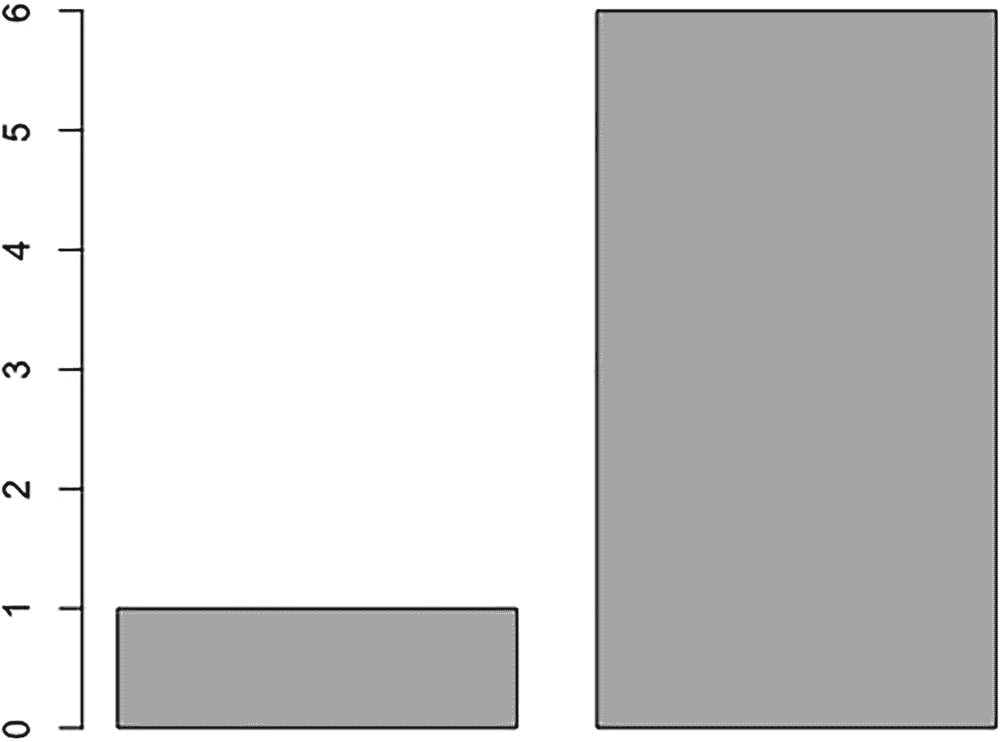

图 7-8

开始绘制条形图

```r
barplot(prodIncidentByFeature$x)

```

这是一个很好的开始，确实讲述了一个故事，但它不是很有描述性。除了 x 轴没有被标记的事实之外，问题区域由于没有对结果排序而变得模糊。

### 订购结果

让我们使用`order()`函数按照每个事件的总数对结果进行排序:

```r
prodIncidentByFeature <- prodIncidentByFeature[order(prodIncidentByFeature$x),]

```

然后，我们可以通过水平分层条形图并将文本旋转 90 度来设置条形图的格式，以突出显示这种顺序。

要旋转文本，我们必须使用`par()`功能改变我们的图形参数。更新图形参数具有全局影响，这意味着我们在更新后创建的任何图表都会继承这些更改，因此我们需要保留当前设置，并在创建条形图后重置它们。我们将当前设置存储在一个名为`opar`的变量中:

```r
opar <- par(no.readonly=TRUE)

```

Note

如果您在 R 命令行中跟随，前面的行本身不会生成任何东西；它只是设置图形参数。

然后，我们将新参数传递给`par()`调用。我们可以使用`las`参数来格式化轴。`las`参数接受以下值:

*   0 是文本平行于轴的默认行为。

*   1 显式使文本水平。

*   2 使文本垂直于轴。

*   3 显式使文本垂直。

```r
par(las=3)

```

然后我们再次调用`barplot()`，但是这次传入参数`horiz=TRUE`，让 R 水平而不是垂直绘制线条:

`barplot(prodIncidentByFeature$x, xlab="Number of Incidents", names.arg=prodIncidentByFeature$Feature`，**horiz =真，**，`space=1, cex.axis=0.6, cex.names=0.8, main="Production Incidents by Feature", col= "#CCCCCC")`

```r
And, finally, we restore the saved settings so that future charts don't inherit this chart's settings:
> par(opar)

```

这段代码产生了如图 [7-9](#Fig9) 所示的可视化效果。

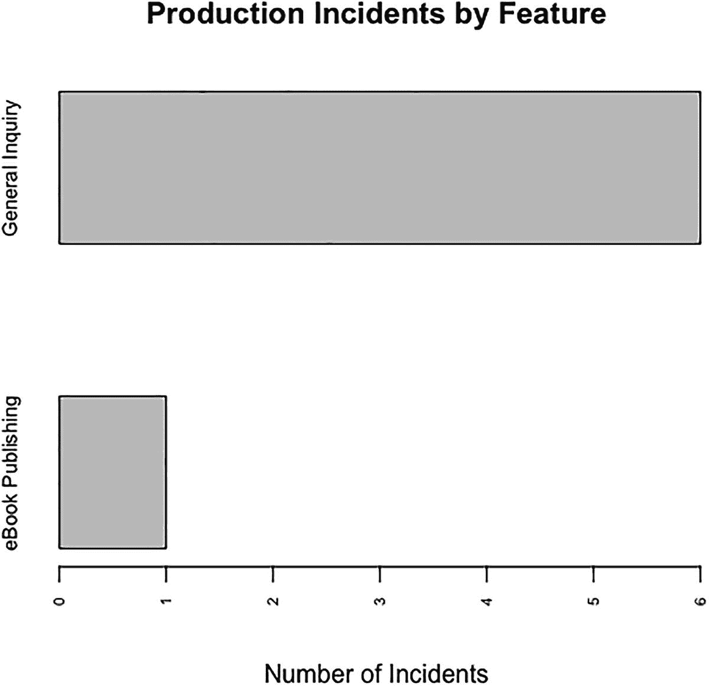

图 7-9

按功能划分的生产事故条形图

从这张图表中，你可以看到最大的问题领域是标签为一般查询的类别，其次是电子书出版。

### 创建堆积条形图

围绕这些功能的问题有多严重？接下来，让我们创建一个堆积条形图，查看每个生产事件的严重性细分。为此，我们必须创建一个表，在该表中，我们按特征和严重性对生产事件进行细分。我们可以为此使用`table()`函数，就像我们在上一章中对 bug 所做的那样:

```r
prodIncidentByFeatureBySeverity <- table(factor(prodData$Feature),prodData$Severity)

```

该代码创建一个如图 [7-10](#Fig10) 所示格式的变量，其中行代表每个特性，列代表每个严重级别:

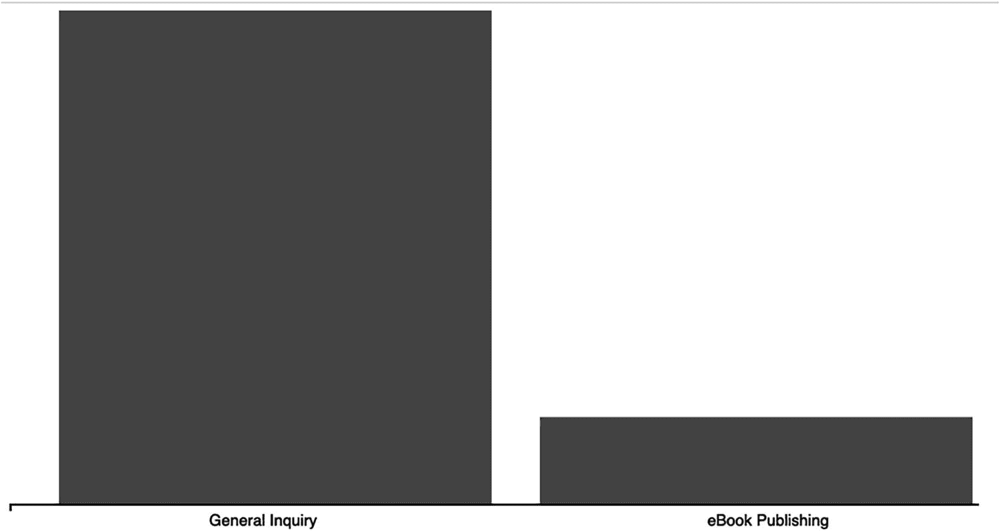

图 7-11

按功能和严重性划分的生产事件堆积条形图

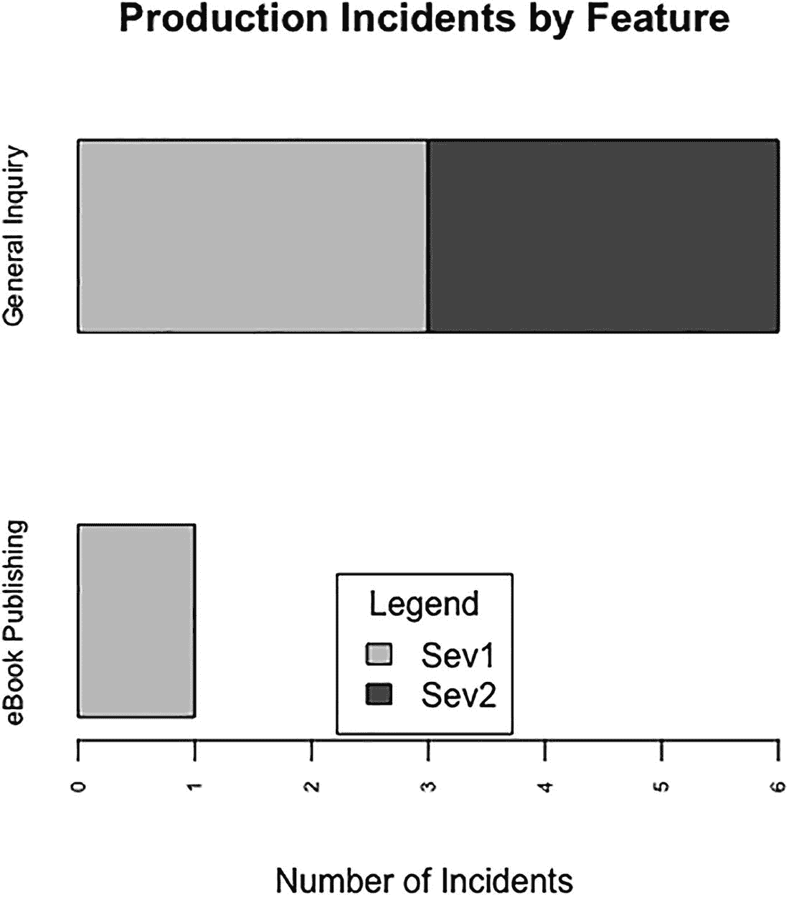

图 7-10

按功能和严重性划分的生产事件堆积条形图

```r
prodIncidentByFeatureBySeverity

                   1 2
  eBook Publishing 1 0
  General Inquiry  3 3
opar <- par(no.readonly=TRUE)
par(las=3, mar=c(5,5,5,5))
barplot(t(prodIncidentByFeatureBySeverity), xlab="Number of Incidents", names.arg=rownames(prodIncidentByFeatureBySeverity), horiz=TRUE, space=1, cex.axis=0.6, cex.names=0.8, main="Production Incidents by Feature", col=c("#CCCCCC", "#666666", "#AAAAAA", "#333333"))
legend("bottom", inset=.01, title="Legend", c("Sev1", "Sev2"), fill=c("#CCCCCC", "#666666"))
par(opar)

```

有意思！我们失去了排序，但那是因为我们有许多新的数据点可供选择。高级总量与此图的相关性较低；更重要的是严重性的分解。

## D3 的条形图

现在，您已经知道了使用条形图在较高层次上汇总数据的好处，以及获得堆积条形图所能揭示的粒度细分的好处。让我们换个角度，使用 D3 来看看如何创建一个高级条形图，它允许我们深入每个条形图，以查看运行时数据的粒度表示。

我们首先在 D3 版本 3 中创建一个条形图，然后创建一个堆叠条形图。当我们的用户将鼠标放在条形图上时，我们将叠加堆叠的条形图，以显示数据如何实时分解。

### 创建垂直条形图

因为我们在第 4 章[中已经在 D3 中制作了一个水平条形图，现在我们将制作一个垂直条形图。遵循我们在前几章中建立的相同模式，我们首先创建一个基本的 HTML 框架结构，它包括一个到 D3 版本 3 库的链接。我们使用上一章中用于正文和轴路径的相同的基本样式规则，以及一个额外的规则来将 bar 类中的所有元素着色为深灰色。](4.html)

```r
<!DOCTYPE html>
<html>
<head>
<meta charset="utf-8">
<title></title>
<script src="d3.v3.js"></script>
<style type="text/css">
     body {
          font: 15px sans-serif;
     }
     .axis path{
          fill: none;
          stroke: #000;
          shape-rendering: crispEdges;
     }
     .bar {
          fill: #666666;
     }
</style>
</head>
<body></body>
</html>

```

接下来，我们创建`script`标签来保存所有的图表代码，以及保存尺寸信息的初始变量集:基本高度和宽度，用于 x 和 y 坐标信息的 D3 scale 对象，保存边距信息的对象，以及从总高度中去掉上下边距的调整后的高度值:

```r
<script>
var w = 960,
    h = 500,
    x = d3.scale.ordinal().rangeRoundBands([0, w]),
    y = d3.scale.linear().range([0, h]),
    z = d3.scale.ordinal().range(["lightpink", "darkgray", "lightblue"])
    margin = {top: 20, right: 20, bottom: 30, left: 40},
    adjustedHeight = 500 - margin.top - margin.bottom;
</script>

```

接下来，我们创建 x 轴对象。请记住，在前面的章节中，轴还没有画出来，所以我们需要稍后在可缩放矢量图形(SVG)标记中调用它，我们将创建这个标记来画轴:

```r
var xAxis = d3.svg.axis()
    .scale(x)
    .orient("bottom");

```

让我们将 SVG 容器绘制到页面上。这将是我们将绘制到页面上的所有其他内容的父容器。

```r
var svg = d3.select("body").append("svg")
    .attr("width", w)
    .attr("height", h)
  .append("g")

```

下一步是读入数据。我们将使用与 R 示例相同的数据源:平面文件`productionIncidents.txt`。我们可以使用`d3.csv()`函数读取并解析文件。一旦文件的内容被读入，它们就被存储在变量`data`中，但是如果出现任何错误，我们将把错误细节存储在一个我们称之为`error`的变量中。

```r
d3.csv("http://jonwestfall.com/data/productionincidents.csv", function(error, data) {
      }

```

在这个`d3.csv()`函数的范围内，我们将放置大部分剩余的功能，因为这些功能依赖于数据的处理。

让我们按特征汇总数据。为此，我们使用`d3.nest()`函数并将键设置为`Feature`列:

```r
nested_data = d3.nest()
     .key(function(d) { return d.Feature; })
     .entries(data);

```

这段代码创建了一个对象数组。

在这个数组中，每个对象都有一个列出特性的键和一个列出每个生产事件的对象数组。

我们使用这个数据结构来创建核心条形图。我们为此创建了一个函数:

```r
function barchart(){
}

```

在这个函数中，我们设置了`svg`元素的`transform`属性，它设置了包含将要绘制的图像的坐标。在这种情况下，我们将其限制为左边距和上边距值:

```r
svg.attr("transform", "translate(" + margin.left + "," + margin.top + ")");

```

我们还为 x 轴和 y 轴创建缩放对象。对于条形图，我们通常对 x 轴使用顺序刻度，因为它们用于离散值，如类别。更多关于 D3 顺序音阶的信息可以在 [`https://github.com/mbostock/d3/wiki/Ordinal-Scales`](https://github.com/mbostock/d3/wiki/Ordinal-Scales) 的文档中找到。

我们还创建了 scale 对象来将数据映射到图表的边界:

```r
var xScale = d3.scale.ordinal()
     .rangeRoundBands([0, w], .1);
var yScale = d3.scale.linear()
     .range([h, 0]);
xScale.domain(data.map(function(d) { return d.key; }));
yScale.domain([0, d3.max(nested_data, function(d) { return d.values.length; })]);

```

我们接下来需要画出栅栏。我们基于分配给条的级联样式表(CSS)类创建一个选择。我们将`nested_data`绑定到条上，为`nested_data`中的每个键值创建 SVG 矩形，并将`bar`类分配给每个矩形；我们将很快定义类样式规则。我们将每个条形的 x 坐标设置为顺序刻度，并将 y 坐标和`height`属性都设置为线性刻度。

我们还添加了一个`mouseover`事件处理程序，并调用了一个我们很快就会创建的函数`transitionVisualization()`。当鼠标悬停在其中一个条形图上时，此函数会转换我们将在条形图上制作的堆叠条形图。

```r
svg.selectAll(".bar")
     .data(nested_data)
     .enter().append("rect")
     .attr("class", "bar")
     .attr("x", function(d) { return xScale(d.key); })
     .attr("width", xScale.rangeBand())
     .attr("y", function(d) { return yScale(d.values.length) - 50; })
     .attr("height", function(d) { return h - yScale(d.values.length); })
     .on("mouseover", function(d){
          transitionVisualization (1)
     })

```

让我们添加一个对我们将要创建的函数`drawAxes()`的调用:

```r
drawAxes()

```

完整的`barchart()`函数如下所示:

```r
  function barchart(){
          svg.attr("transform", "translate(" + margin.left + "," + margin.top + ")");
          var xScale = d3.scale.ordinal()
              .rangeRoundBands([0, w], .1);
          var yScale = d3.scale.linear()
              .range([h, 0]);
      xScale.domain(nested_data.map(function(d) { return d.key; }));
      yScale.domain([0, d3.max(nested_data, function(d) { return d.values.length; })]);
      svg.selectAll(".bar")
          .data(nested_data)
        .enter().append("rect")
          .attr("class", "bar")
          .attr("x", function(d) { return xScale(d.key); })
          .attr("width", xScale.rangeBand())
          .attr("y", function(d) { return yScale(d.values.length) - 50; })
          .attr("height", function(d) { return h - yScale(d.values.length); })
          .on("mouseover", function(d){
                           transitionVisualization (1)
          })
    drawAxes()
  }

```

让我们创建`drawAxes()`函数。我们把这个函数放在了`d3.csv()`函数的范围之外，在`script`标签的根处。

对于这个图表，让我们用更简单的方法，只画 x 轴。就像上一章一样，我们绘制 SVG `g`元素并调用`xAxis`对象:

```r
function drawAxes(){
     svg.append("g")
          .attr("class", "x axis")
          .attr("transform", "translate(0," + adjustedHeight + ")")
          .call(xAxis);
}

```

这将绘制 x 轴，该轴为条形图提供其类别标签。

### 创建堆积条形图

现在我们有了一个条形图，让我们创建一个堆积条形图。首先，让我们塑造数据。我们需要一个对象数组，其中每个对象代表一个特性，并有每个级别的事件总数。

让我们从一个名为`grouped_data`的新数组开始:

```r
var grouped_data = new Array();

```

让我们通过`nested_data`进行迭代，因为`nested_data`已经按照特性进行了分组:

```r
nested_data.forEach(function (d) {
}

```

在每次遍历`nested_data`时，我们创建一个临时对象，并遍历`values`数组中的每个事件:

```r
tempObj = {"Feature": d.key, "Sev1":0, "Sev2":0, "Sev3":0, "Sev4":0};
     d.values.forEach(function(e){
     }

```

在`values`数组的每次迭代中，我们测试当前事件的严重性，并增加临时对象的适当属性:

```r
if(e.Severity == 1)
     tempObj.Sev1++;
else if(e.Severity == 2)
     tempObj.Sev2++
else if(e.Severity == 3)
     tempObj.Sev3++;
else if(e.Severity == 4)
     tempObj.Sev4++;

```

创建`grouped_data`数组的完整代码如下所示:

```r
nested_data.forEach(function (d) {
     tempObj = {"Feature": d.key, "Sev1":0, "Sev2":0, "Sev3":0, "Sev4":0};
     d.values.forEach(function(e){
          if(e.Severity == 1)
               tempObj.Sev1++;
          else if(e.Severity == 2)
               tempObj.Sev2++
          else if(e.Severity == 3)
               tempObj.Sev3++;
          else if(e.Severity == 4)
               tempObj.Sev4++;
     })
     grouped_data[grouped_data.length] = tempObj
});

```

完美！接下来，我们创建一个函数，在该函数中，我们在`d3.csv()`函数的范围内绘制堆积条形图:

```r
function stackedBarChart(){
}

```

这就是有趣的地方。使用`d3.layout.stack()`函数，我们转置我们的数据，这样我们就有了一个数组，其中每个索引代表一个严重级别，并包含每个特征的一个对象，该对象具有相应严重级别的每个事件的计数:

```r
var sevStatus = d3.layout.stack()(["Sev1", "Sev2", "Sev3", "Sev4"].map(function(sevs)
     {
          return grouped_data.map(function(d) {
          return {x: d.Feature, y: +d[sevs]};
    });
  }));

```

接下来，我们使用`sevStatus`为将要绘制的条形段的 x 和 y 值创建域图:

```r
x.domain(sevStatus[0].map(function(d) { return d.x; }));
y.domain([0, d3.max(sevStatus[sevStatus.length - 1], function(d) { return d.y0 + d.y; })]);

```

接下来，我们为`sevStatus`数组中的每个索引绘制 SVG `g`元素。它们充当容器，我们在其中画出线条。我们将`sevStatus`绑定到这些分组元素，并设置`fill`属性来返回颜色数组中的一种颜色。

```r
var sevs = svg.selectAll("g.sevs")
     .data(sevStatus)
     .enter().append("g")
     .attr("class", "sevs")
     .style("fill", function(d, i) { return z(i); });

```

最后，我们在刚刚创建的分组中绘制条形。我们将一个通用函数绑定到条形的`data`属性，该属性只传递传递给它的任何数据；这继承自 SVG 分组。

我们在不透明度设置为 0 的情况下绘制条形，因此条形最初是不可见的。我们还附加了`mouseover`和`mouseout`事件处理程序，以调用`transitionVisualization()`——当`mouseover`事件被触发时传递 1，当`mouseout`事件被触发时传递 0(我们将很快充实`transitionVisualization()`的功能)。

```r
var rect = sevs.selectAll("rect")
     .data(function(data){ return data; })
     .enter().append("svg:rect")
     .attr("x", function(d) { return x(d.x) + 13; })
     .attr("y", function(d) { return -y(d.y0) - y(d.y) + adjustedHeight; })
     .attr("class", "groupedBar")
     .attr("opacity", 0)
     .attr("height", function(d) { return y(d.y) ; })
     .attr("width", x.rangeBand() - 20)
     .on("mouseover", function(d){
          transitionVisualization (1)
     })
     .on("mouseout", function(d){
     transitionVisualization (0)
     });

```

完整的堆积条形图代码应该如下所示

```r
function groupedBarChart(){
     var sevStatus = d3.layout.stack()(["Sev1", "Sev2", "Sev3", "Sev4"].map(function(sevs)
     {
          return grouped_data.map(function(d) {
          return {x: d.Feature, y: +d[sevs]};
    });
  }));
     x.domain(sevStatus[0].map(function(d) { return d.x; }));
     y.domain([0, d3.max(sevStatus[sevStatus.length - 1], function(d) { return d.y0 + d.y; })]);
  // Add a group for each sev category.
     var sevs = svg.selectAll("g.sevs")
          .data(sevStatus)
          .enter().append("g")
          .attr("class", "sevs")
          .style("fill", function(d, i) { return z(i); })
          .style("stroke", function(d, i) { return d3.rgb(z(i)).darker(); });
     var rect = sevs.selectAll("rect")
          . data(function(data){ return data; })
          .enter().append("svg:rect")
          .attr("x", function(d) { return x(d.x) + 13; })
          .attr("y", function(d) { return -y(d.y0) - y(d.y) + adjustedHeight; })
           .attr("class", "groupedBar")
          .attr("opacity", 0)
          .attr("height", function(d) { return y(d.y) ; })
          .attr("width", x.rangeBand() - 20)
          .on("mouseover", function(d){
               transitionVisualization (1)
          })
          .on("mouseout", function(d){
          transitionVisualization (0)
          });
  }

```

### 创建覆盖的可视化

但是我们还没有完成。我们一直在引用这个`transitionVisualization()`函数，但是我们还没有定义它。让我们现在就解决这个问题。还记得我们是如何使用它的吗:当用户将鼠标放在我们的条形图上时，我们调用`transitionVisualization()`并传入 1。当用户将鼠标放在我们的堆积条形图上时，我们也调用`transitionVisualization()`并传入一个 1。但是当用户鼠标离开堆叠条形图中的一个条时，我们调用`transitionVisualization()`并传入一个 0。

因此，我们传入的参数设置了堆叠条形图的不透明度。因为我们最初绘制的堆叠条形图的不透明度为 0，所以只有当用户滑过条形图中的某个条时，我们才会看到它，而当用户滚离该条时，它又会隐藏起来。

为了创造这种效果，我们使用 D3 过渡。过渡很像其他语言(如 ActionScript 3)中的补间。我们创建一个 D3 选择(在这种情况下，我们可以选择类`groupedBar`的所有元素)，调用`transition()`，并设置我们想要更改的选择的属性:

```r
function transitionVisualization(vis){
     var rect = svg.selectAll(".groupedBar")
     .transition()
     .attr("opacity", vis)
}

```

我们现在已经有了完整的可视化，如图 [7-11](#Fig11) 所示。

完整的代码如下所示，虽然很难通过印刷媒体演示这一功能，但您可以在 Jon 的网站上看到工作模型(可在 [`https://jonwestfall.com/d3/ch7.d3.example.htm`](https://jonwestfall.com/d3/ch7.d3.example.htm) 找到)或将代码放在本地 web 服务器上并自己运行:

```r
<!DOCTYPE html>
<html>
  <head>
          <meta charset="utf-8">
    <title></title>
        <script src="d3.v3.js"></script>
        <style type="text/css">
        body {
          font: 15px sans-serif;
        }
        .axis path{
          fill: none;
          stroke: #000;
          shape-rendering: crispEdges;
        }
        .bar {
          fill: #666666;
        }
    </style>  </head>
  <body>
    <script type="text/javascript">
var w = 960,
    h = 500,
    x = d3.scale.ordinal().rangeRoundBands([0, w]),
    y = d3.scale.linear().range([0,h]),
    z = d3.scale.ordinal().range(["lightpink", "darkgray", "lightblue"])
    margin = {top: 20, right: 20, bottom: 30, left: 40},
    adjustedHeight = 500 - margin.top - margin.bottom;
        var xAxis = d3.svg.axis()
            .scale(x)
            .orient("bottom");
        var svg = d3.select("body").append("svg")
            .attr("width", w)
            .attr("height", h)
          .append("g")
        function drawAxes(){
          svg.append("g")
              .attr("class", "x axis")
              .attr("transform", "translate(0," + adjustedHeight + ")")
              .call(xAxis);
         }
         function transitionVisuaization(vis){
                 var rect = svg.selectAll(".groupedBar")
                .transition()
                .attr("opacity", vis)
         }
        d3.csv("https://jonwestfall.com/data/productionincidents.csv", function(error, data) {
            nested_data = d3.nest()
                         .key(function(d) { return d.Feature; })
                         .entries(data);
                var grouped_data = new Array();
                //for stacked bar chart
                nested_data.forEach(function (d) {
                         tempObj = {"Feature": d.key, "Sev1":0, "Sev2":0, "Sev3":0, "Sev4":0};
                         d.values.forEach(function(e){
                                 if(e.Severity == 1)
                                 tempObj.Sev1++;
                                 else if(e.Severity == 2)
                                 tempObj.Sev2++
                                 else if(e.Severity == 3)
                                 tempObj.Sev3++;
                                 else if(e.Severity == 4)
                                 tempObj.Sev4++;
                         })
                         grouped_data[grouped_data.length] = tempObj
                });
function stackedBarChart(){
  var sevStatus = d3.layout.stack()(["Sev1", "Sev2", "Sev3", "Sev4"].map(function(sevs) {
    return grouped_data.map(function(d) {
      return {x: d.Feature, y: +d[sevs]};
    });
  }));
  x.domain(sevStatus[0].map(function(d) { return d.x; }));
  y.domain([0, d3.max(sevStatus[sevStatus.length - 1], function(d) { return d.y0 + d.y; })]);
  // Add a group for each sev category.
  var sevs = svg.selectAll("g.sevs")
      .data(sevStatus)
    .enter().append("g")
      .attr("class", "sevs")
      .style("fill", function(d, i) { return z(i); });
  var rect = sevs.selectAll("rect")
      .data(function(data){ return data; })
    .enter().append("svg:rect")
      .attr("x", function(d) { return x(d.x) + 13; })
      .attr("y", function(d) { return -y(d.y0) - y(d.y) + adjustedHeight; })
          .attr("class", "groupedBar")
          .attr("opacity", 0)
      .attr("height", function(d) { return y(d.y) ; })
      .attr("width", x.rangeBand() - 20)
          .on("mouseover", function(d){
                  transitionVisuaization(1)
          })
          .on("mouseout", function(d){
                  transitionVisuaization(0)
          });
  }
  function barchart(){
          svg.attr("transform", "translate(" + margin.left + "," + margin.top + ")");
          var xScale = d3.scale.ordinal()
              .rangeRoundBands([0, w], .1);
          var yScale = d3.scale.linear()
              .range([h, 0]);
      xScale.domain(nested_data.map(function(d) { return d.key; }));
      yScale.domain([0, d3.max(nested_data, function(d) { return d.values.length; })]);
      svg.selectAll(".bar")
          .data(nested_data)
        .enter().append("rect")
          .attr("class", "bar")
          .attr("x", function(d) { return xScale(d.key); })
          .attr("width", xScale.rangeBand())
          .attr("y", function(d) { return yScale(d.values.length) - 50; })
          .attr("height", function(d) { return h - yScale(d.values.length); })
          .on("mouseover", function(d){
                           transitionVisuaization(1)
          })
        stackedBarChart()
    drawAxes()
  }
  barchart();
});
    </script>
  </body>
</html>

```

## 摘要

本章介绍了如何使用条形图来显示生产事故环境中的分级数据。因为生产事故本质上是来自用户群的关于你的产品如何不正常或失败的直接反馈，管理生产事故是任何成熟的工程组织的关键部分。

然而，管理生产事故不仅仅是在问题出现时做出反应；它还与分析围绕您的事件的数据有关:您的应用程序的哪些领域经常中断，您在生产中看到哪些意外的使用模式可能会导致这些重复出现的问题，如何构建主动式脚手架来防止这些问题以及未来的问题。所有这些问题只有通过充分了解你的产品和数据才能回答。在这一章中，你朝着更大的理解迈出了第一步。