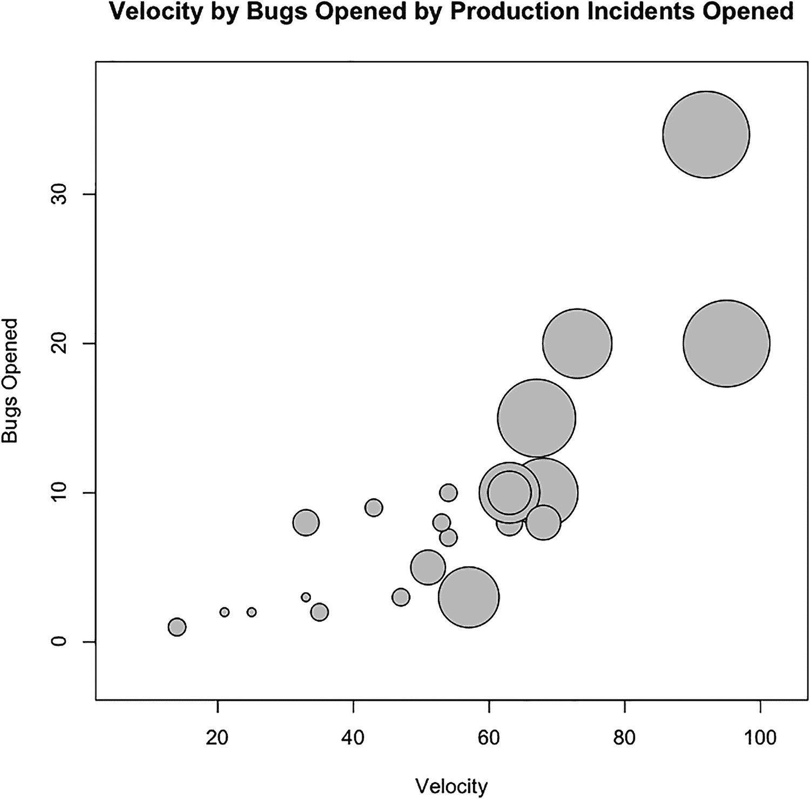
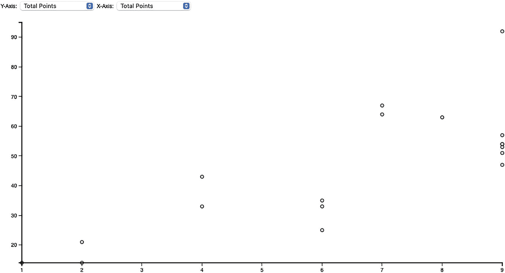

# 八、散点图相关分析

在上一章中，您了解了如何使用条形图来分析生产事故。您看到条形图非常适合显示已排序数据集中的差异，并且您使用这一想法来确定问题重复出现的区域。您还使用堆积条形图查看了生产事故严重性的细分。

本章着眼于散点图的相关性分析。散点图是在各自的轴上绘制两个独立数据集的图表，显示为笛卡尔网格(x 和 y 坐标)上的点。正如您将看到的，散点图用于尝试和识别两个数据点之间的关系。

Note

Michael Friendly 和 Daniel Denis 发表了一篇关于散点图历史的经过深思熟虑和彻底研究的论文，最初发表于 2005 年*行为科学史杂志*，第 41 卷，并可在 Friendly 的网站 [`www.datavis.ca/papers/friendly-scat.pdf`](http://www.datavis.ca/papers/friendly-scat.pdf) 上获得。这篇文章绝对值得一读，因为它试图追溯最早记录的散点图和图表第一次被称为散点图，并且非常巧妙地描述了散点图和时间序列之间的区别(换句话说，所有的时间序列都是以时间为轴的散点图，而不是所有的散点图都是时间序列！).

## 在数据中查找关系

散点图上的点形成的模式或缺乏模式表明了这种关系。在很高的层面上，关系可以是


图 8-1

散点图显示了北美和欧洲手机总数之间的正相关关系

*   正相关，其中一个变量随着另一个变量的增加而增加。这可以通过从左到右形成一条对角线的点来证明(见图 8-1 )。


图 8-2

散点图显示体重和时间流逝之间的负相关关系(对于正在节食的人)

*   负相关，其中一个变量增加，另一个减少。这可以通过形成一条从左到右向下的线的点来证明(见图 8-2 )。


图 8-3

散点图显示美国历年意外死亡人数之间没有关联

*   无相关性，由散点图显示(或不显示)，散点图没有可辨别的趋势线(见图 8-3 )。

当然，简单地识别两个数据点或数据集之间的相关性并不意味着这种关系中有直接的原因——因此习惯上认为相关性并不意味着因果关系。例如，参见图 8-2 中的负相关图。如果我们假设两个轴——体重和天数——之间有直接的因果关系，我们将假设时间的流逝导致体重下降。

虽然散点图对于分析两组数据之间的关系非常有用，但是也有一种相关的模式可以用来引入第三组数据。这种可视化被称为气泡图，它使用散点图中的点的半径来展示数据的第三维。

参见图 8-4 中的气泡图，该图显示了豚鼠牙齿生长长度与服用维生素 C 剂量之间的相关性。第三个数据点是给药方式:要么补充维生素，要么喝橙汁。它作为图形中每个点的半径添加；大圆圈是维生素补充剂，小圆圈是橙汁。


图 8-4

豚鼠牙齿生长与维生素 C 剂量的相关性，包括维生素补充剂和橙汁

为了本章的目的，我们将使用散点图和气泡图来查看团队速度与我们关注的其他领域的隐含关系，实际上是对团队动态进行相关性分析。我们将比较团队规模和速度、速度和生产事故等等。

## 敏捷开发的介绍性概念

让我们从介绍敏捷开发的一些初步概念开始。如果你已经精通敏捷，这一节将是一个回顾。敏捷开发有很多种风格，但是最常见的高级概念是将大量工作时间打包的思想。时间盒使团队能够专注于一件事情并完成它，允许涉众对完成的内容快速给出反馈。这个简短的反馈循环允许团队和涉众随着需求甚至行业的变化而改变方向。

团队在工作主体上工作的这段时间——无论是一周、三周还是其他——被称为冲刺。在 sprint 结束时，团队应该有可发布的代码，尽管并不要求在每次 sprint 之后发布。

sprint 以团队定义工作主体的计划会议开始，以团队检查已完成的工作主体的回顾会议结束。在冲刺阶段，团队定期培训新的工作来完成；它定义了列出验收标准的用户故事中的工作。正是这些用户故事在每个 sprint 开始时举行的计划会议中得到优先考虑和承诺。

该流程的高级工作流程如图 8-5 所示。


图 8-5

敏捷开发的高级工作流

用户故事有与之相关的故事点。故事点是对故事复杂程度的估计，通常是一个数值。当团队完成冲刺时，他们开始形成一致的速度。速度是团队在一次冲刺中完成的故事点的平均数量。

速度是很重要的，因为你用它来估计你的团队在每个 sprint 开始时可以完成多少，并预测团队在一年中根据你的路线图可以完成多少积压的工作。

有很多工具可以用来管理敏捷项目，比如 Rally ( [`www.rallydev.com/`](http://www.rallydev.com/) )或者 Atlassian 的 green hopper([`www.atlassian.com/software/greenhopper/overview`](http://www.atlassian.com/software/greenhopper/overview))，也是这家公司制造了吉拉和 Confluence。无论您使用什么工具，都应该能够导出您的数据，包括每个 sprint 的用户点数。

## 相关分析

为了开始分析，让我们导出每个 sprint 的故事点总和以及团队名称。我们应该将所有这些数据点编译成一个文件，命名为`teamvelocity.txt`。我们的文件应该看起来像下面这样，它显示了名为 Red 和 Gold 的团队的 12.1 和 12.2 sprints 的数据(任意的名称，这些团队使用不同的工作主体开发相同的产品):

```r
Sprint,TotalPoints,Team
12.1,25,Gold
12.1,63,Red
12.2,54,Red
...

```

让我们在那里添加一个额外的列来表示每个 sprint 的每个团队的总成员。数据现在应该是这样的:

```r
Sprint,TotalPoints,TotalDevs,Team
12.1,25,6,Gold
12.1,63,10,Red
12.2,54,9,Red
...

```

我们也提供了这个样本数据集，有更多的点，这里: [`https://jonwestfall.com/data/teamvelocity.txt`](https://jonwestfall.com/data/teamvelocity.txt) 。

太棒了。现在让我们将它读入 R，将第一行中的路径改为您放置它的位置:

```r
tvFile <- "/Applications/MAMP/htdocs/teamvelocity.txt"
teamvelocity <- read.table(tvFile, sep=",", header=TRUE)

```

### 创建散点图

现在使用`plot()`函数创建一个散点图，比较团队在每个 sprint 中完成的总分数和每个 sprint 中团队成员的数量。我们将`teamvelocity$TotalPoints`和`teamvelocity$TotalDevs`作为前两个参数传递，将类型设置为`p`，并为轴赋予有意义的标签:

```r
plot(teamvelocity$TotalPoints,teamvelocity$TotalDevs, type="p", ylab="Team Members", xlab="Velocity", bg="#CCCCCC", pch=21)

```

这就产生了我们在图 8-6 中看到的散点图；我们可以看到，随着我们向团队中添加更多的成员，他们在迭代或 sprint 中可以完成的故事点的数量也在增加。


图 8-6

团队速度和团队成员总数的相关性

### 创建气泡图

如果我们想要更深入地了解到目前为止的数据，例如，显示哪些点属于哪个团队，我们可以用气泡图来可视化这些信息。我们可以使用`symbols()`函数创建气泡图。我们将`TotalPoints`和`TotalDevs`传入`symbols()`，就像我们对`plot()`所做的一样，但是我们也将`Team`列传入一个名为`circles`的参数。这指定了要在图表上绘制的圆的半径。因为在我们的例子中`Team`是一个字符串，R 将其转换成一个因子。我们也用`bg`参数设置圆的颜色，用`fg`参数设置圆的笔画颜色。

```r
symbols(teamvelocity$TotalPoints, teamvelocity$TotalDevs, circles=as.factor(teamvelocity$Team), inches=0.35, fg="#000000", bg="#CCCCCC", ylab="Team Members", xlab="Velocity")

```

前面的 R 代码应该会产生一个类似图 8-7 的气泡图。


图 8-7

团队速度、团队成员总数与表示团队的气泡大小的相关性

## 可视化 bug

图 8-7 所示的气泡图用处有限，主要是因为团队分解并不是真正相关的数据点。让我们拿起`teamvelocity.txt`文件，开始添加更多的信息。我们已经在第六章中讨论过追踪 bug 数据；现在让我们使用我们的 bug 跟踪软件，添加两个新的与 bug 相关的数据点:每个 sprint 结束时每个团队的 backlog 中的总 bug，以及每个 sprint 中打开了多少个 bug。我们将这些新数据点的列分别命名为`BugBacklog`和`BugsOpened`。

更新后的文件应该如下所示:

```r
Sprint,TotalPoints,TotalDevs,Team,BugBacklog,BugsOpened
12.1,25,6,Gold,125,10
12.2,42,8,Gold,135,30
12.3,45,8,Gold,150,25

```

接下来，让我们用这些新数据创建一个散点图。我们首先将速度与每次迭代中打开的 bug 进行比较:

```r
plot(teamvelocity$TotalPoints,teamvelocity$BugsOpened, type="p", xlab="Velocity", ylab="Bugs Opened During Sprint", bg="#CCCCCC", pch=21)

```

这将创建如图 8-8 所示的散点图。


图 8-8

团队速度和打开的 bug 的相关性

这很有趣。团队中有更多的人和完成更多的工作(或者至少完成更复杂的工作)之间存在正相关，完成的故事点越多，产生的 bug 就越多。因此，复杂性的增加与给定 sprint 中产生的 bug 数量的增加相关。至少我的数据似乎暗示了这一点。

让我们在现有的气泡图中反映这个新的数据点；我们不是按团队来划分圈子，而是按打开的 bug 来划分圈子:

```r
symbols(teamvelocity$TotalPoints, teamvelocity$TotalDevs, circles= teamvelocity$BugsOpened, inches=0.35, fg="#000000", bg="#CCCCCC", ylab="Team Members", xlab="Velocity", main = "Velocity by Team Size by Bugs Opened")

```

这段代码生成如图 8-9 所示的气泡图；您可以看到气泡的大小遵循现有的正相关模式，气泡随着团队成员数量和团队速度的增加而变大。


图 8-9

团队速度和团队规模的相关性，其中圆圈大小表示打开的 bug

接下来，让我们创建一个散点图来查看每个 sprint 之后的总 bug backlog:

```r
plot(teamvelocity$TotalPoints,teamvelocity$BugBacklog, type="p", xlab="Velocity", ylab="Total Bug Backlog", bg="#CCCCCC", pch=21)

```

该代码生成如图 8-10 所示的图表。


图 8-10

团队速度与总 bug 积压的相关性

这个数字表明不存在相关性。这可能是因为许多原因:也许团队一直在 sprint 期间修复 bug，或者他们正在关闭迭代过程中打开的所有 bug。确定根本原因超出了散点图的范围，但是我们可以看出，当 bug 被打开并且复杂性增加时，bug 的总积压量并没有增加。

## 可视化生产事件

让我们在另一个数据点进入文件的下一层；我们将针对 sprint 期间完成的工作添加一个生产事件列。具体来说，当一个 sprint 中的一部分工作完成后，它就被发布到产品中，并且一个发布版本号通常与这个发布版本相关联。我们讨论的最后一个数据点是关于在给定迭代的发布中跟踪生产中的问题。而不是迭代过程中出现的问题；迭代中完成的工作被推向生产时出现的问题。

现在让我们添加最后一列，名为`ProductionIncidents`:

```r
Sprint,TotalPoints,TotalDevs,Team,BugBacklog,BugsOpened,ProductionIncidents
12.1,25,6,Gold,125,10,1
12.2,42,8,Gold,135,30,3
12.3,45,8,Gold,150,25,2

```

太好了！接下来，让我们用这些数据创建一个新的气泡图，比较完成的总故事点，每个迭代中打开的 bug，以及每个发布的生产事件:

```r
symbols(teamvelocity$TotalPoints, teamvelocity$BugsOpened, circles=teamvelocity$ProductionIncidents, inches=0.35, fg="#000000", bg="#CCCCCC", ylab="Bugs Opened", xlab="Velocity", main = "Velocity by Bugs Opened by Production Incidents Opened")

```

该代码创建如图 8-11 所示的图表。



图 8-11

团队速度和打开的 bug 的相关性，其中圆圈的大小表示生产事件的数量

从这个图表中，您可以看到，至少根据我们的样本数据，对于一个给定的 sprint，完成的总故事点、打开的 bug 和打开的生产事件之间存在正相关。

最后，现在所有的数据都被分层到平面文件中，我们可以创建一个散点图矩阵。这是所有列的矩阵，用散点图相互比较。我们可以使用散点图矩阵一次性查看所有数据，并快速挑选出数据集中可能存在的任何相关模式。我们可以只用图形包中的`plot()`函数或`pairs()`函数创建散点图矩阵:

```r
plot(teamvelocity)
pairs(teamvelocity)

```

任何一种都会产生如图 8-12 所示的图表。


图 8-12

我们完整数据集的散点图矩阵

在图 8-12 中，每行代表数据框中的一列，每个散点图代表这些列的交叉点。当您浏览矩阵中的每个散点图时，您可以清楚地看到本章已经介绍过的组合中的相关模式。虽然这是一种有效的可视化，但同时查看如此多的变量，眼睛很容易疲劳。重要的是要考虑到，仅仅因为你可以把所有的事情都放在一个数字中，你可能就不想这样做了。您可以考虑将您的数据子集化到感兴趣的特定列，使这样的图形更容易浏览。

## D3 中的交互式散点图

到目前为止，在本章中，我们已经创建了不同的散点图来表示我们想要查看的数据组合。但是，如果我们想要创建一个散点图，让我们能够选择轴所基于的数据点呢？借助 D3，我们可以做到这一点！

### 添加基本 HTML 和 JavaScript

让我们从包含`d3.js`的基本 HTML 结构以及基本 CSS 开始:

```r
<!DOCTYPE html>
<html>
  <head>
          <meta charset="utf-8">
    <title></title>
<style>
body {
  font: 15px sans-serif;
}
.axis path{
  fill: none;
  stroke: #000;
  shape-rendering: crispEdges;
}
.dot {
  stroke: #000;
}
</style>
</head>
<body>
<script src="d3.v3.js"></script>
</body>
</html>

```

接下来让我们添加`script`标签来保存图表。就像前面的 D3 例子一样，包括起始变量、边距、x 和 y 范围对象，以及 x 和 y 轴对象:

```r
<script>
var margin = {top: 20, right: 20, bottom: 30, left: 40},
    width = 960 - margin.left - margin.right,
    height = 500 - margin.top - margin.bottom;
var x = d3.scale.linear()
    .range([0, width]);
var y = d3.scale.linear()
    .range([height, 0]);
var xAxis = d3.svg.axis()
    .scale(x)
    .orient("bottom");
var yAxis = d3.svg.axis()
    .scale(y)
    .orient("left");
</script>

```

让我们像前面的例子一样在页面上创建 SVG 标记:

```r
var svg = d3.select("body").append("svg")
    .attr("width", width + margin.left + margin.right)
    .attr("height", height + margin.top + margin.bottom)
  .append("g")
    .attr("transform", "translate(" + margin.left + "," + margin.top + ")");

```

### 加载数据

现在我们需要使用`d3.csv()`函数加载数据。在所有之前的 D3 例子中，大部分工作都是在回调函数的范围内完成的，但是对于这个例子，我们需要公开我们的功能，这样我们就可以通过 form `select`元素来改变数据点。然而，我们仍然需要从回调函数驱动初始功能，因为那时我们将拥有我们的数据，所以我们将设置我们的回调函数来调用存根公共函数。

我们为从平面文件返回的数据设置一个名为`chartData`的公共变量，并调用两个名为`removeDots()`和`setChartDots()`的函数:

```r
d3.csv("teamvelocity.txt", function(error, data) {
          chartData = data;
          removeDots()
          setChartDots("TotalDevs", "TotalPoints")
});

```

注意，我们将`"TotalDevs"`和`"TotalPoints"`传递给了`setChartDots()`函数。这是为了启动泵，因为它们将是页面加载时我们显示的初始数据点。

### 添加交互式功能

现在我们需要真正创造出我们已经熄灭的东西。首先，让我们在`script`标签的根位置创建变量`chartData`，在这里我们设置其他变量:

```r
var margin = {top: 20, right: 20, bottom: 30, left: 40},
    width = 960 - margin.left - margin.right,
    height = 500 - margin.top - margin.bottom,
    chartData;

```

接下来，我们创建`removeDots()`函数，该函数选择页面上的任何圆或轴并删除它们:

```r
function removeDots(){
      svg.selectAll("circle")
           .transition()
               .duration(0)
               .remove()
      svg.selectAll(".axis")
             .transition()
             .duration(0)
             .remove()
}

```

最后，我们创建了`setChartDots()`功能。该函数接受两个参数:`xval`和`yval`。因为我们希望确保 D3 转换已经运行完毕，并且它们有一个 250 毫秒的默认运行时间，即使我们将持续时间设置为 0，我们也将在一个`setTimeout()`调用中包装函数的内容，所以我们在开始绘制图表之前等待 300 毫秒。如果我们不这样做，我们可能会进入一种竞争状态，在这种状态下，当过渡从屏幕上消失时，我们正在向屏幕上绘制。

```r
function setChartDots(xval, yval){
         setTimeout(function() {
         }, 300);
  }

```

在该函数中，我们使用`xval`和`yval`参数设置 x 和 y 缩放对象的域。这些参数对应于我们将绘制图表的数据点的列名:

```r
x.domain(d3.extent(chartData, function(d) { return d[xval];}));
y.domain(d3.extent(chartData, function(d) { return d[yval];}));

```

接下来，我们将圆绘制到屏幕上，使用全局变量`chartData`来填充它，并将传入的列数据作为圆的 x 和 y 坐标。我们还在这个函数中增加了坐标轴，这样每次坐标轴改变时，我们都会重新绘制值。

```r
svg.selectAll(".dot")
     .data(chartData)
     .enter().append("circle")
     .attr("class", "dot")
     .attr("r", 3)
     .attr("cx", function(d) { return x(d[xval]);})
     .attr("cy", function(d) { return y(d[yval]);})
     .style("fill", "#CCCCCC");
svg.append("g")
     .attr("class", "axis")
     .attr("transform", "translate(0," + height + ")")
     .call(xAxis)
 svg.append("g")
     .attr("class", "axis")
     .call(yAxis)

```

完整的函数应该如下所示:

```r
function setChartDots(xval, yval){
       setTimeout(function() {
        x.domain(d3.extent(chartData, function(d) { return d[xval];}));
        y.domain(d3.extent(chartData, function(d) { return d[yval];}));
        svg.selectAll(".dot")
            .data(chartData)
          .enter().append("circle")
            .attr("class", "dot")
            .attr("r", 3)
            .attr("cx", function(d) { return x(d[xval]);})
            .attr("cy", function(d) { return y(d[yval]);})
            .style("fill", "#CCCCCC");
            svg.append("g")
                .attr("class", "axis")
                .attr("transform", "translate(0," + height + ")")
                .call(xAxis)
            svg.append("g")
                .attr("class", "axis")
                .call(yAxis)
       }, 300);
}

```

太棒了。

### 添加表单域

接下来让我们添加表单字段。我们将添加两个`select`元素，其中每个`option`对应于平面文件中的一列。这些元素调用一个 JavaScript 函数，`getFormData()`，我们将很快定义它:

```r
<form>
        Y-Axis:
        <select id="yval" onChange="getFormData()">
                 <option value="TotalPoints">Total Points</option>
                 <option value="TotalDevs">Total Devs</option>
                 <option value="Team">Team</option>
                 <option value="BugsOpened">Bugs Opened</option>
                 <option value="ProductionIncidents">Production Incidents</option>
        </select>
        X-Axis:
        <select id="xval" onChange="getFormData()">
                 <option value="TotalPoints">Total Points</option>
                 <option value="TotalDevs">Total Devs</option>
                 <option value="Team">Team</option>
                 <option value="BugsOpened">Bugs Opened</option>
                 <option value="ProductionIncidents">Production Incidents</option>
        </select>
</form>

```

### 正在检索表单数据

剩下的最后一点功能是编写`getFormData()`函数。这个函数从两个`select`元素中提取选择的选项，并使用这些值传递给`setChartDots()`——当然是在调用`removeDots()`之后。

```r
function getFormData(){
       var xEl = document.getElementById("xval")
       var yEl = document.getElementById("yval")
       var x = xEl.options[xEl.selectedIndex].value
       var y = yEl.options[yEl.selectedIndex].value
       removeDots()
       setChartDots(x,y)
}

```

太好了！

### 使用可视化

完整的源代码应该如下所示:

```r
<!DOCTYPE html>
<html>
  <head>
          <meta charset="utf-8">
    <title></title>
<style>
body {
  font: 10px sans-serif;
}
.axis path,
.axis line {
  fill: none;
  stroke: #000;
  shape-rendering: crispEdges;
}
.dot {
  stroke: #000;
}
</style>
</head>
<body>
        <form>
                Y-Axis:
                <select id="yval" onChange="getFormData()">
                         <option value="TotalPoints">Total Points</option>
                         <option value="TotalDevs">Total Devs</option>
                         <option value="Team">Team</option>
                         <option value="BugsOpened">Bugs Opened</option>
                         <option value="ProductionIncidents">Production Incidents</option>
                </select>
                X-Axis:
                <select id="xval" onChange="getFormData()">
                         <option value="TotalPoints">Total Points</option>
                         <option value="TotalDevs">Total Devs</option>
                         <option value="Team">Team</option>
                         <option value="BugsOpened">Bugs Opened</option>
                         <option value="ProductionIncidents">Production Incidents</option>
                </select>
        </form>
<script src="d3.v3.js"></script>
<script>
var margin = {top: 20, right: 20, bottom: 30, left: 40},
    width = 960 - margin.left - margin.right,
    height = 500 - margin.top - margin.bottom,
        chartData;
var x = d3.scale.linear()
    .range([0, width]);
var y = d3.scale.linear()
    .range([height, 0]);
var xAxis = d3.svg.axis()
    .scale(x)
    .orient("bottom");
var yAxis = d3.svg.axis()
    .scale(y)
    .orient("left");
var svg = d3.select("body").append("svg")
    .attr("width", width + margin.left + margin.right)
    .attr("height", height + margin.top + margin.bottom)
  .append("g")
    .attr("transform", "translate(" + margin.left + "," + margin.top + ")");
    svg.append("g")
        .attr("class", "x axis")
        .attr("transform", "translate(0," + height + ")")
        .call(xAxis)
    svg.append("g")
        .attr("class", "y axis")
        .call(yAxis)
   function getFormData(){
          var xEl = document.getElementById("xval")
          var yEl = document.getElementById("yval")
          var x = xEl.options[xEl.selectedIndex].value
          var y = yEl.options[yEl.selectedIndex].value
          removeDots()
          setChartDots(x,y)
   }
   function removeDots(){
         svg.selectAll("circle")
              .transition()
                  .duration(0)
                  .remove()
         svg.selectAll(".axis")
                 .transition()
                .duration(0)
                .remove()
   }
  function setChartDots(xval, yval){
         setTimeout(function() {
          x.domain(d3.extent(chartData, function(d) { return d[xval];}));
          y.domain(d3.extent(chartData, function(d) { return d[yval];}));
          svg.selectAll(".dot")
              .data(chartData)
            .enter().append("circle")
              .attr("class", "dot")
              .attr("r", 3)
              .attr("cx", function(d) { return x(d[xval]);})
              .attr("cy", function(d) { return y(d[yval]);})
              .style("fill", "#CCCCCC");
               svg.append("g")
                  .attr("class", "axis")
                  .attr("transform", "translate(0," + height + ")")
                  .call(xAxis)
              svg.append("g")
                  .attr("class", "axis")
                  .call(yAxis)
         }, 300);
  }
d3.csv("teamvelocity.txt", function(error, data) {
          chartData = data;
          removeDots()
          setChartDots("TotalDevs", "TotalPoints")
});
</script>
</body>
</html>

```

它应该创建如图 8-13 所示的交互式可视化。



图 8-13

使用 D3 的交互式散点图

## 摘要

这一章着眼于团队行动的速度与漏洞和生产问题的出现之间的相互关系。这些数据点之间自然存在正相关关系:当我们制造新的东西时，我们为那些新的东西和现有的东西创造了新的机会去打破。

当然，这并不意味着我们应该停止制造新的东西，即使出于某种原因，我们的业务部门和我们的行业允许这样做。这意味着我们需要在创造新事物和培育及维护现有事物之间找到平衡。这正是我们将在下一章看到的。