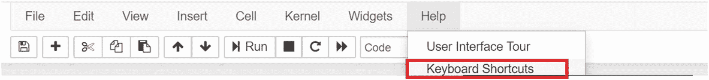

# 一、熟悉 Python

Python 是一种开源编程语言，由荷兰程序员吉多·范·罗苏姆创建。Python 以英国喜剧团体 Monty Python 命名，是一种高级、解释型、开源语言，是当今世界上最受欢迎、发展最快的编程语言之一。它也是数据科学和机器学习的首选语言。

在这一章中，我们首先介绍 Jupyter notebook——一个用 Python 运行代码的 web 应用程序。然后，我们将介绍 Python 中的基本概念，包括数据类型、操作符、容器、函数、类和文件处理、异常处理，以及编写代码和模块的标准。

本书的代码示例是使用 Python 版本 3.7.3 和 Anaconda 版本 4.7.10 编写的。

## 技术要求

Anaconda 是一个开源平台，被 Python 程序员和数据科学家广泛使用。安装这个平台会安装 Python、Jupyter 笔记本应用程序和数百个库。下面是安装 Anaconda 发行版需要遵循的步骤。


图 1-1

安装 Anaconda

1.  打开以下网址: [`https://www.anaconda.com/products/individual`](https://www.anaconda.com/products/individual)

2.  点击操作系统的安装程序，如图 [1-1](#Fig1) 所示。安装程序会下载到您的系统中。


图 1-2

发射 Jupyter

1.  打开安装程序(上一步下载的文件)并运行它。

2.  安装完成后，在开始菜单旁边的资源管理器(搜索栏)中键入“jupyter notebook”或“jupyter”打开 Jupyter 应用程序，如图 [1-2](#Fig2) (针对 Windows OS 显示)。

请按照以下步骤下载本书中使用的所有数据文件:

*   点击以下链接: [`https://github.com/DataRepo2019/Data-files`](https://github.com/DataRepo2019/Data-files)

*   选择绿色的“代码”菜单，并从该菜单的下拉列表中单击“下载 ZIP”

*   从下载的 zip 文件夹中提取文件，并将这些文件导入到 Jupyter 应用程序中

现在我们已经安装并启动了 Jupyter，让我们在下一节了解如何使用这个应用程序。

## 开始使用 jupiter 笔记本

在讨论 Jupyter 笔记本的本质之前，让我们先来讨论一下什么是集成开发环境(IDE)。IDE 集合了编程中涉及的各种活动，包括编写和编辑代码、调试和创建可执行文件。它还包括自动完成(完成用户想要键入的内容，从而使用户能够专注于逻辑和解决问题)和语法突出显示(突出显示语言的各种元素和关键字)等功能。除了 Jupyter，还有很多 Python 的 ide，包括 Enthought Canopy、Spyder、PyCharm 和 Rodeo。Jupyter 成为数据科学社区中无处不在、事实上的标准有几个原因。这些优势包括易于使用和定制、支持多种编程语言、平台独立性、方便访问远程数据，以及将输出、代码和多媒体结合在一个屋檐下的好处。

JupyterLab 是 Jupyter 笔记本的 IDE。Jupyter 笔记本是在用户机器上本地运行的网络应用程序。它们可用于加载、清理、分析和建模数据。您可以在 Jupyter 笔记本中添加代码、公式、图像和降价文本。Jupyter 笔记本有两个用途，一是运行您的代码，二是作为一个平台，展示您的工作并与他人分享。让我们看看这个应用程序的各种特性。


图 1-4

Jupyter 单元格中的简单代码语句

1.  **输入并执行代码**

    在笔记本的第一个单元格内点击，输入一行简单的代码，如图 [1-4](#Fig4) 所示。从“单元格”菜单中选择*运行单元格*来执行代码，或者使用快捷键 *Ctrl+Enter* 。


图 1-3

创建新的 Jupyter 笔记本

1.  **打开仪表板**

    在“开始”菜单旁边的搜索栏中键入“jupyter notebook”。这将打开 Jupyter 仪表板。仪表板可用于创建新笔记本或打开现有笔记本。

2.  **创建新笔记本**

    在 Jupyter 仪表盘右上角选择 *New* 创建一个新的 Jupyter 笔记本，然后在出现的下拉列表中选择 *Python 3* ，如图 [1-3](#Fig3) 所示。


图 1-5

将模式更改为降价

1.  **添加降价文本或标题**

    在新的单元格中，通过选择如图 [1-5](#Fig5) 所示的 *Markdown* 或者按键盘上的 *Esc+M* 键来改变格式。您也可以通过从如下所示的下拉列表中选择*标题*或按快捷键 *Esc+(1/2/3/4)来为 Jupyter 笔记本添加标题。*


图 1-6

更改文件的名称

1.  **重命名笔记本**

    点击笔记本默认名称，输入新名称，如图 [1-6](#Fig6) 所示。

    您也可以通过选择*文件➤重命名*来重命名笔记本。


图 1-7

下载 Jupyter 笔记本

1.  **保存笔记本**

    按 Ctrl+S 或选择文件➤保存和检查点。

2.  **下载笔记本**

    您可以通过电子邮件或共享您的笔记本，方法是使用选项*文件➤下载为➤笔记本(。ipynb)* ，如图 [1-7](#Fig7) 所示。

### jupiter 中的快捷方式和其他功能

让我们来看看 Jupyter 笔记本的一些关键特性，包括快捷键、制表符补全和魔法命令。

表 [1-1](#Tab1) 给出了一些在 Jupyter 笔记本中常见的图标、相应的菜单功能和键盘快捷键。

表 1-1

Jupyter 笔记本工具栏功能

<colgroup><col class="tcol1 align-left"> <col class="tcol2 align-left"> <col class="tcol3 align-left"> <col class="tcol4 align-left"></colgroup> 
| 

工具栏中的图标

 | 

功能

 | 

键盘快捷键

 | 

菜单功能

 |
| --- | --- | --- | --- |
|  | 保存 Jupyter 笔记本 | *Esc+s* | *文件➤另存为* |
|  | 向 Jupyter 笔记本添加新单元格 | *Esc+b* (在当前单元格下方增加一个单元格)，或者 *Esc+a* (在当前单元格上方增加一个单元格) | *在上方插入➤插入单元格或在下方插入➤插入单元格* |
|  | 剪切选定的单元格 | *Esc+x* | 编辑➤剪切单元格 |
|  | 复制选定的单元格 | *Esc+c* | 编辑➤复制单元格 |
|  | 将一个单元格粘贴到另一个选定单元格的上方或下方 | *Esc+v* | *编辑*上方的➤粘贴单元格或*编辑*下方的➤粘贴单元格 |
|  | 运行给定的单元 | *Ctrl+Enter* (运行选中的单元格)； *Shift+Enter* (运行选中单元格并插入新单元格) | *细胞➤运行选定的细胞* |
|  | 中断内核 | *Esc+ii* | *内核➤中断* |
|  | 重启内核 | *Esc+00* | *内核➤重启* |

如果您不确定使用哪个快捷键，请进入:*帮助➤快捷键*，如图 [1-8](#Fig8) 所示。



图 1-8

Jupyter 中的帮助菜单

常用的键盘快捷键包括

*   *Shift+Enter* 运行当前单元格中的代码，移动到下一个单元格。

*   *Esc* 离开单元格。

*   *Esc+M* 将单元格的模式更改为“降价”模式。

*   *Esc+Y* 将单元格的模式改为“编码”。

### 制表符结束

这是一个可以用在 Jupyter 笔记本上的功能，帮助你完成正在编写的代码。使用制表符补全可以加快工作流程，减少错误，并快速补全函数名，从而减少打字错误，使您不必记住所有模块和函数的名称。

例如，如果您想要导入 Matplotlib 库，但不记得拼写，您可以键入前三个字母 mat，然后按 Tab。您会看到一个下拉列表，如图 [1-9](#Fig9) 所示。库的正确名称是下拉列表中的第二个名称。


图 1-9

Jupyter 中的制表符结束

### 木星中使用的魔法命令

魔术命令是以一个或多个%符号开始的特殊命令，后面跟一个命令。以一个%符号开始的命令适用于单行代码，以两个%符号开始的命令适用于整个单元(单元内的所有代码行)。

一个常用的神奇命令，如下所示，用于在笔记本中显示 Matplotlib 图形。添加这个神奇的命令避免了为显示图形而单独调用 *plt.show* 函数的需要(Matplotlib 库在第 [7](7.html) 章中详细讨论)。

代码:

```py
%matplotlib inline

```

神奇的命令，如 *timeit* ，也可以用来计时脚本的执行，如下所示。

代码:

```py
%%timeit
for i in range(100000):
    i*i

```

输出:

```py
16.1 ms ± 283 μs per loop (mean ± std. dev. of 7 runs, 100 loops each)

```

既然您已经了解了使用 Jupyter 笔记本的基本知识，那么让我们开始学习 Python 并了解这种语言的核心方面。

## Python 基础

在本节中，我们将熟悉 Python 的语法、注释、条件语句、循环和函数。

### 注释、打印和输入

在这一节中，我们将介绍一些基础知识，比如打印、从用户那里获得输入，以及添加注释来帮助他人理解您的代码。

#### 评论

注释解释一行代码做什么，程序员用它来帮助其他人理解他们写的代码。在 Python 中，注释以#符号开始。

适当的间距和缩进在 Python 中至关重要。Java 和 C++等其他语言使用括号来括住代码块，而 Python 使用缩进四个空格来指定代码块。人们需要注意缩进以避免错误。像 Jupyter 这样的应用程序通常会注意缩进，并自动在代码块的开头添加四个空格。

#### 印刷

*打印*功能将内容打印到屏幕或任何其他输出设备。

通常，我们将字符串和变量的组合作为参数传递给 print 函数。参数是包含在函数括号内的值，函数用它来产生结果。在下面的语句中，“你好！”是 *print* 函数的参数。

代码:

```py
print("Hello!")

```

为了打印多行代码，我们在字符串的开头和结尾使用三重引号，例如:

代码:

```py
print('''Today is a lovely day.
It will be warm and sunny.
It is ideal for hiking.''')

```

输出:

```py
Today is a lovely day.
It will be warm and sunny.
It is ideal for hiking.

```

注意，在 Python 中我们不像其他语言那样使用分号来结束语句。

*格式*方法可以与*打印*方法结合使用，用于在字符串中嵌入变量。它使用花括号作为变量的占位符，这些变量作为参数传递给方法。

让我们看一个简单的例子，我们使用*格式*方法打印变量。

代码:

```py
weight=4.5
name="Simi"
print("The weight of {} is {}".format(name,weight))

```

输出:

```py
The weight of Simi is 4.5

```

在没有 format 方法的情况下，上述语句也可以重写如下:

代码:

```py
print("The weight of",name,"is","weight")

```

请注意，只有 print 参数的字符串部分用引号括起来。变量名不在引号内。同样，如果在打印参数中有任何常量，它们也不会出现在引号中。在下面的示例中，一个布尔常量(True)、一个整数常量(1)和字符串组合在一个 print 语句中。

代码:

```py
print("The integer equivalent of",True,"is",1)

```

输出:

```py
The integer equivalent of True is 1

```

格式字段可以指定浮点数的精度。浮点数是带小数点的数字，小数点后的位数可以使用如下格式字段指定。

代码:

```py
x=91.234566
print("The value of x upto 3 decimal points is {:.3f}".format(x))

```

输出:

```py
The value of x upto 3 decimal points is 91.235

```

我们可以指定传递给方法的变量的位置。在这个例子中，我们使用位置“1”来引用参数列表中的第二个对象，使用位置“0”来指定参数列表中的第一个对象。

代码:

```py
y='Jack'
x='Jill'
print("{1} and {0} went up the hill to fetch a pail of water".format(x,y))

```

输出:

```py
Jack and Jill went up the hill to fetch a pail of water

```

#### 投入

*输入*功能接受用户的输入。用户提供的输入被存储为类型为*字符串*的变量。如果您想对任何数字输入进行数学计算，您需要将输入的数据类型更改为 int 或 float，如下所示。

代码:

```py
age=input("Enter your age:")
print("In 2010, you were",int(age)-10,"years old")

```

输出:

```py
Enter your age:76
In 2010, you were 66 years old

```

Python 中输入/输出的进一步阅读: [`https://docs.python.org/3/tutorial/inputoutput.html`](https://docs.python.org/3/tutorial/inputoutput.html)

### 变量和常数

常量或文字是不变的值，而变量包含可以改变的值。我们不需要在 Python 中声明一个变量，也就是指定它的数据类型，不像 Java 和 C/C++等其他语言。我们通过给变量命名并赋值来定义它。根据该值，数据类型会自动分配给它。使用赋值运算符(=)将值存储在变量中。Python 中命名变量的规则如下:

*   变量名不能有空格

*   变量不能以数字开头

*   变量名只能包含字母、数字和下划线(_)

*   变量不能使用保留关键字的名称(例如，*类*、*继续*、*中断*、*打印*等)。是 Python 语言中预定义的术语，具有特殊含义，作为变量名无效)

### 经营者

以下是 Python 中一些常用的运算符。

**算术运算符**:取两个整数值或浮点值，执行一次运算，返回值。

Python 支持以下算术运算符:

*   **(指数)

*   %(模或余数)，

*   //(商)，

*   *(乘法)

*   -(减法)

*   +(加法)

操作顺序至关重要。括号优先于指数，指数优先于除法和乘法，乘法优先于加法和减法。设计了一个首字母缩略词——p . e . d . m . a . s .(请原谅我亲爱的萨莉阿姨)——可以用来记住这些运算的顺序，以了解算术表达式中首先需要应用哪个运算符。下面给出了一个例子:

代码:

```py
(1+9)/2-3

```

输出:

```py
2.0

```

在前面的表达式中，首先执行括号内的运算，得到 10，然后执行除法，得到 5，最后执行减法，得到最终输出 2。

**比较操作符**:这些操作符比较两个值，并评估为真或假值。Python 支持以下比较运算符:

*   >:大于

*   :小于

*   < =:小于或等于

*   > =:大于或等于

*   ==:平等。请注意，这不同于赋值运算符(=)

*   ！=(不等于)

**逻辑(或布尔)运算符**:类似于比较运算符，它们也评估为*真*或*假*值。这些运算符对布尔变量或表达式进行运算。Python 支持以下逻辑运算符:

*   *and 运算符*:使用该运算符的表达式只有在其所有子表达式都为*真*时，才计算为*真*。否则，如果它们中的任何一个为*假*，则表达式评估为*假*

    下面显示了一个使用*和*操作符的例子。

    CODE:

    ```py
    (2>1) and (1>3)

    ```

    Output:

    ```py
    False

    ```

*   *或*运算符:使用了*或*运算符的表达式，如果表达式中的任何一个子表达式为*真*，则计算结果为*真*。如果表达式的所有子表达式都评估为 *False，则该表达式评估为 *False* 。*

    下面显示了一个使用*或*操作符的例子。

    CODE:

    ```py
    (2>1) or (1>3)

    ```

    Output:

    ```py
    True

    ```

*   *not* 运算符:使用了 *not* 运算符的表达式，如果表达式为 *False* ，则计算结果为 *True* ，反之亦然。

    下面是一个使用*而不是*运算符的例子。

    CODE:

    ```py
    not(1>2)

    ```

    Output:

    ```py
    True

    ```

#### 赋值运算符

这些运算符为变量或操作数赋值。以下是 Python 中使用的赋值运算符列表:

*   =(给变量赋值)

*   +=(将右边的值与左边的操作数相加)

*   -=(从左边的操作数中减去右边的值)

*   *=(将左边的操作数乘以右边的值)

*   %=(返回左边的操作数除以右边的值后的余数)

*   /=(返回左边的操作数除以右边的值后的商)

*   //=(只返回左边的操作数除以右边的值后的商的整数部分)

下面给出了一些使用这些赋值运算符的例子。

代码:

```py
x=5 #assigns the value 5 to the variable x
x+=1 #statement adds 1 to x (is equivalent to x=x+1)
x-=1 #statement subtracts 1 from x (is equivalent to x=x-1)
x*=2 #multiplies x by 2(is equivalent to x=x*2)
x%=3 #equivalent to x=x%3, returns remainder
x/=3 #equivalent to x=x/3, returns both integer and decimal part of quotient

x//=3 #equivalent to x=x//3, returns only the integer part of quotient after dividing x by 3

```

**恒等运算符(is 和 not is)**

这些操作符检查两个对象是否相等，即两个对象是否指向同一个值，并根据它们是否相等返回一个布尔值( *True/False* )。在下面的示例中，三个变量" *x"* 、*、【y】*和 *"z"* 包含相同的值，因此，当比较" x "和" z "时，恒等运算符(*是*)返回 *True* 。

示例:

```py
x=3
y=x
z=y
x is z

```

输出:

```py
True

```

**隶属运算符(in 和 not in)**

这些操作符检查一个特定的值是否出现在一个字符串或一个容器中(像列表和元组，在下一章讨论)。如果值存在，操作符中的*返回“真”，如果值不在字符串或容器中，*操作符中的*返回“真”。*

代码:

```py
'a' in 'and'

```

输出:

```py
True

```

### 数据类型

数据类型是变量的类别或类型，基于它存储的值。

变量或常量的数据类型可以使用 *type* 函数获得。

代码:

```py
type(45.33)

```

输出:

```py
float

```

表 [1-2](#Tab2) 中给出了一些常用的数据类型。

表 1-2

Python 中的常见数据类型

<colgroup><col class="tcol1 align-left"> <col class="tcol2 align-left"> <col class="tcol3 align-left"></colgroup> 
| 

数据类型

 | 

数据类型

 | 

例子

 |
| --- | --- | --- |
| 数字数据 | *int* :对于没有小数点的数字*float* :带小数点的数字 | `#int``a=1``#float``b=2.4` |
| 顺序 | 序列存储多个值。Python 中的一些序列是:*列表**范围**元组* | `#tuple``a=(1,2,3)``#list``b=[1,2,3]``#range``c=range(5)` |
| 字符或文本 | *str* 是用于存储引号内的单个字符或字符序列的数据类型 | `#single character``X='a'``#multiple characters``x='hello world'``#multiple lines``x='''hello world``good morning'''` |
| 布尔数据 | *bool* 是用于存储真值或假值的数据类型 | `X=True``Y=False` |
| 映射对象 | 字典是字典的数据类型(一个将键映射到值的对象) | `x={'Apple':'fruit','Carrot':'vegetable'}` |

**代表日期和时间**

Python 有一个名为 *datetime* 的模块，允许我们定义日期、时间或持续时间。

我们首先需要导入这个模块，这样我们就可以使用这个模块中可用的函数来定义一个日期或时间对象，使用下面的语句。

代码:

```py
import datetime

```

让我们使用本模块中的方法来定义各种日期/时间对象。

**日期对象**

可以使用 *date* 方法定义由日、月和年组成的日期，如下所示。

代码:

```py
date=datetime.date(year=1995,month=1,day=1)
print(date)

```

输出:

```py
1995-01-01

```

注意， *date* 方法的所有三个参数——日、月和年——都是必需的。如果在定义一个*日期*对象时跳过这些参数中的任何一个，就会出现错误，如下所示。

代码:

```py
date=datetime.date(month=1,day=1)
print(date)

```

输出:

```py
TypeError                         Traceback (most recent call last)
<ipython-input-3-7da76b18c6db> in <module>
----> 1 date=datetime.date(month=1,day=1)
      2 print(date)

TypeError: function missing required argument 'year' (pos 1)

```

**时间对象**

为了在 Python 中定义一个存储时间的对象，我们使用了 *time* 方法。

可以传递给此方法的参数可能包括小时、分钟、秒或微秒。注意，与*日期*方法不同，参数对于*时间*方法不是强制性的(它们可以被跳过)。

代码:

```py
time=datetime.time(hour=12,minute=0,second=0,microsecond=0)
print("midnight:",time)

```

输出:

```py
midnight: 00:00:00

```

**日期时间对象**

我们还可以使用 *datetime* 方法定义一个由日期和时间组成的 datetime 对象，如下所示。对于此方法，日期参数——日、月和年——是必需的，但时间参数(如小时、分钟等)是必需的。)可以跳过。

代码:

```py
datetime1=datetime.datetime(year=1995,month=1,day=1,hour=12,minute=0,second=0,microsecond=0)
print("1st January 1995 midnight:", datetime1)

```

输出:

```py
1st January 1995 midnight: 1995-01-01 12:00:00

```

**时三角洲对象**

一个 *timedelta* 对象代表一个特定的持续时间，并且是使用 *timedelta* 方法创建的。

让我们创建一个存储 17 天时间的 *timedelta* 对象。

代码:

```py
timedelta1=datetime.timedelta(weeks=2,days=3)
timedelta1

```

输出:

```py
datetime.timedelta(days=17)

```

在创建一个 *timedelta* 对象时，您还可以添加其他参数，如秒、分钟和小时。

可以将 *timedelta* 对象添加到现有的 date 或 datetime 对象中，但不能添加到 time 对象中

将持续时间(*时间增量*对象)添加到*日期*对象:

代码:

```py
#adding a duration to a date object is supported
date1=datetime.date(year=1995,month=1,day=1)
timedelta1=datetime.timedelta(weeks=2,days=3)
date1+timedelta1

```

输出:

```py
datetime.date(1995, 1, 18)

```

将持续时间(*时间增量*对象)添加到*日期时间*对象:

代码:

```py
#adding a duration to a datetime object is supported
datetime1=datetime.datetime(year=1995,month=2,day=3)
timedelta1=datetime.timedelta(weeks=2,days=3)
datetime1+timedelta1

```

输出:

```py
datetime.datetime(1995, 2, 20, 0, 0)

```

向*时间*对象添加持续时间会导致错误:

代码:

```py
#adding a duration to a time object is not supported
time1=datetime.time(hour=12,minute=0,second=0,microsecond=0)
timedelta1=datetime.timedelta(weeks=2,days=3)
time1+timedelta1

```

输出:

```py
TypeError                             Traceback (most recent call last)
<ipython-input-9-5aa64059a69a> in <module>
      2 time1=datetime.time(hour=12,minute=0,second=0,microsecond=0)
      3 timedelta1=datetime.timedelta(weeks=2,days=3)
----> 4 time1+timedelta1

TypeError: unsupported operand type(s) for +: 'datetime.time' and 'datetime.timedelta'

```

延伸阅读:

了解有关 Python 日期时间模块的详细信息

[T2`https://docs.python.org/3/library/datetime.html`](https://docs.python.org/3/library/datetime.html)

### 使用字符串

字符串是用引号括起来的一个或多个字符的序列(单引号和双引号都可以接受)。字符串的数据类型是 *str。* Python 不支持字符数据类型，不像 Java 和 c 这样的老语言。即使是单个字符，如‘a’，‘b’，也存储为字符串。字符串在内部存储为数组，并且是不可变的(不能修改)。让我们看看如何定义一个字符串。

**定义字符串**

单行字符串可以用单引号或双引号来定义。

代码:

```py
x='All that glitters is not gold'
#OR
x="All that glitters is not gold"

```

对于多行字符串，使用三重引号:

代码:

```py
x='''Today is Tuesday.
Tomorrow is Wednesday'''

```

**字符串操作**

字符串可以使用各种函数，下面将解释其中一些函数。

1.  查找字符串的长度: *len* 函数可用于计算字符串的长度，如下所示。

    代码:

    ```py
    len('Hello')

    ```

    Output:

    ```py
    5

    ```

2.  访问字符串中的单个元素:

    可以使用索引运算符[]提取字符串中的单个字符。

    CODE:

    ```py
    x='Python'
    x[3]
    Output

    :
    'h'

    ```

3.  对字符串进行切片:切片是指提取对象的一部分或子集(在这种情况下，对象是字符串)。切片也可以用于其他可迭代对象，比如列表和元组，我们将在下一章讨论。冒号操作符用于切片，带有可选的开始、停止和步进索引。下面提供了一些切片的例子。

    CODE:

    ```py
    x='Python'
    x[1:] #from second character to the end

    ```

    输出:

    ```py
    'ython'
    Some more examples of slicing:

    ```

    CODE:

    ```py
    x[:2] #first two characters. The starting index is assumed to be 0

    ```

    Output:

    ```py
    'Py'

    ```

    CODE:

    ```py
    x[::-1]#reversing the string, the last character has an index -1

    ```

    Output:

    ```py
    'nohtyP'

    ```

4.  理由:

    为了向右侧或左侧添加空格，或者使字符串居中，使用了 *rjust* 、 *ljust* 或 *center* 方法。传递给这种方法的第一个参数是新字符串的长度，可选的第二个参数是用于填充的字符。默认情况下，空格用于填充。

    代码:

    ```py
    '123'.rjust(5,"*")

    ```

    Output:

    ```py
    '**123'

    ```

5.  改变大小写:改变字符串的大小写，使用*上*或*下*的方法，如下图所示。

    代码:

    ```py
    'COLOR'.lower()

    ```

    Output:

    ```py
    'color'

    ```

6.  检查字符串包含的内容:

    为了检查字符串是以给定的字符开始还是结束，使用了 *startswith* 或 *endswith* 方法。

    代码:

    ```py
    'weather'.startswith('w')

    ```

    Output:

    ```py
    True

    ```

7.  从字符串中删除空格:

    要删除字符串中的空格，请使用 *strip* 方法(删除两端的空格)、*rst strip*(删除右端的空格)或 *lstrip* 方法(删除左端的空格)。下面显示了一个示例。

    代码:

    ```py
    '  Hello'.lstrip()

    ```

    Output:

    ```py
    'Hello'

    ```

8.  检查字符串的内容:

    有几种方法可以检查一个字符串包含什么，比如`isalpha, isupper, isdigit, isalnum`等等。只有当字符串中的所有字符都满足给定条件时，所有这些方法才返回“True”。

    代码:

    ```py
    '981'.isdigit()#to check for digits

    ```

    Output:

    ```py
    True

    ```

    CODE:

    ```py
    'Abc'.isupper()
    #Checks if all characters are in uppercase. Since all letters are not uppercase, the condition is not satisfied

    ```

    Output:

    ```py
    False

    ```

9.  连接字符串列表:

    *join* 方法将一系列字符串组合成一个字符串。在 *join* 方法的左侧，我们提到了用于连接字符串的引号中的分隔符。在右边，我们传递单个字符串的列表。

    代码:

    ```py
    ' '.join(['Python','is','easy','to','learn'])

    ```

    Output:

    ```py
    'Python is easy to learn'

    ```

10.  拆分字符串:

    *split* 方法的作用与 join 方法相反。它将一个字符串分解成一个单词列表，并返回这个列表。如果我们只传递一个单词给这个方法，它会返回一个只包含一个单词的列表，并且不会进一步分割字符串。

    代码:

    ```py
    'Python is easy to learn'.split()

    ```

    Output:

    ```py
    ['Python', 'is', 'easy', 'to', 'learn']

    ```

### 条件语句

条件语句，顾名思义，计算一个条件或一组条件。在 Python 中， *if-elif-else* 构造用于此目的。Python 没有 switch-case 结构，这种结构在其他一些语言中用于条件执行。

条件语句以 *if* 关键字和表达式或要计算的条件开始。接下来是一个代码块，仅当条件评估为“真”时才执行；否则将被跳过。

*else* 语句(不包含任何条件)用于在 *if* 语句中提到的条件不满足时执行一段代码。 *elif* 语句用于评估特定条件。elif 语句的顺序很重要。如果 *elif* 语句之一评估为真，则后面的 *elif* 语句根本不执行。 *if* 语句也可以单独存在，不提及 *else* 或 *elif* 语句。

以下示例演示了 *if-elif-else* 构造。

代码:

```py
#if-elif-else
color=input('Enter one of the following colors - red, orange or blue:')
if color=='red':
    print('Your favorite color is red')
elif color=='orange':
    print('Your favorite color is orange')
elif color=='blue':
    print('Your favorite color is blue')
else:
    print("You entered the wrong color")

```

输出:

```py
Enter one of the following colors - red, orange or blue:pink
You entered the wrong color

```

条件语句可以嵌套，这意味着我们可以将一个条件语句(内部)放在另一个条件语句(外部)中。使用嵌套语句时，需要特别注意缩进。下面显示了一个嵌套的 if 语句的例子。

代码:

```py
#nested conditionals
x=20
if x<10:
    if x<5:
        print("Number less than 5")
    else:
        print("Number greater than 5")
else:
    print("Number greater than 10")

```

输出:

```py
Number greater than 10

```

延伸阅读:查看更多关于*如果*声明: [`https://docs.python.org/3/tutorial/controlflow.html#if-statements`](https://docs.python.org/3/tutorial/controlflow.html%2523if-statements)

### 环

循环用于重复执行部分代码。代码块的一次执行称为一次迭代，循环通常会经历多轮迭代。Python 中使用了两种类型的循环——用于循环的*和用于*循环的*。*

#### While 循环

只要条件为“真”,当我们想要执行特定指令时，就会使用 *while* 循环。代码块执行后，执行将返回到代码块的开头。下面显示了一个示例。

代码:

```py
#while loop with continue statement
while True:
    x=input('Enter the correct color:')
    if(x!='red'):
        print("Color needs to be entered as red")
        continue
    else:
        break

```

输出:

```py
Enter the correct color:blue
Color needs to be entered as red
Enter the correct color:yellow
Color needs to be entered as red
Enter the correct color:red

```

在前面的示例中，第一条语句( *while True* )用于执行无限循环。一旦输入的用户名长度正确，break 语句就会在循环之外执行；否则，将向用户显示一条消息，要求输入正确长度的用户名。请注意，在代码块的最后一条语句之后，执行会自动转到循环的开头。

*break* 语句用于将控制置于循环之外。当我们想要跳出一个无限循环时，这是很有用的。

*continue* 语句的作用正好相反——它控制循环的开始。关键字 *break* 和 *continue* 可以用于循环和条件语句，比如 *if/else* 。

延伸阅读:

查看有关以下内容的更多信息:

*   *中断*和*继续*语句: [`https://docs.python.org/3/tutorial/controlflow.html#break-and-continue-statements-and-else-clauses-on-loops`](https://docs.python.org/3/tutorial/controlflow.html%2523break-and-continue-statements-and-else-clauses-on-loops)

*   *而*声明: [`https://docs.python.org/3/reference/compound_stmts.html#while`](https://docs.python.org/3/reference/compound_stmts.html%2523while)

#### for 循环

循环的*用于执行一段代码预定的次数。*循环的*可用于任何类型的 iterable 对象，也就是说，可由循环用于运行重复实例或迭代的值序列。这些可迭代对象包括列表、元组、字典和字符串。*

回路的*通常也与*范围*功能一起使用。range 函数创建了一个 *range* 对象，另一个可迭代对象，它是一个等间距整数序列。考虑下面的例子，我们使用 *for* 循环计算前五个奇数的总和。*

代码:

```py
#for loop
sum=0
for i in range(1,10,2):
    sum=sum+i
print(sum)

```

输出:

```py
25

```

*范围*函数有三个参数:开始参数、停止参数和步进参数。这三个参数都不是强制性的。从 0 到 9(包括 0 和 9)的数字可以生成为*范围(10)* 、*范围(0，10)* 或*范围(0，10，1)。*默认开始参数为 0，默认步进参数为 1。

*For* 循环也可以嵌套(一个外循环和任意数量的内循环)，如下所示。

代码:

```py
#nested for loop
for i in 'abcd':
    for j in range(4):
        print(i,end=" ")
    print("\n")

```

输出:

```py
a a a a

b b b b

c c c c

d d d d

```

延伸阅读:查看更多关于 for 的声明: [`https://docs.python.org/3/tutorial/controlflow.html#for-statements`](https://docs.python.org/3/tutorial/controlflow.html%2523for-statements)

### 功能

一个函数可以被认为是一个“黑盒”(用户不需要关心函数的内部工作)，它接受输入，处理输入，并产生输出。函数本质上是执行特定任务的语句块。

在 Python 中，使用 *def* 关键字定义函数。后面是函数名和一个或多个可选参数。参数是只存在于函数中的变量。函数中定义的变量具有局部作用域，这意味着不能在函数外部访问它们。它们也被称为局部变量。外部代码或函数不能操作函数中定义的变量。

一个函数可以有一个可选的返回值。返回值是由返回到主程序的函数产生的输出。调用函数意味着给函数输入(参数)来执行任务并产生输出。

函数的效用在于它们的可重用性。它们还有助于避免冗余和将代码组织成逻辑块。我们只需要给它提供运行指令所需的一组输入。可以重复调用一个函数，而不是手动输入相同的代码行。

例如，假设您想在给定的数字列表中找出质数。一旦你写了一个函数来检查一个整数是否是一个质数，你可以简单地将列表中的每个数字作为参数传递给函数并调用它，而不是为你想要测试的每个整数写相同的代码行。

代码:

```py
def checkPrime(i):
     #Assume the number is prime initially
    isPrime=True
    for j in range(2,i):
        # checking if the number is divisible by any number between 2 and i
        if i%j==0:
            #If it is divisible by any number in the j range, it is not prime
            isPrime=False
    # This is the same as writing if isPrime==True
    if isPrime:
        print(i ,"is prime")
    else:
        print(i, "is not prime")
for i in range(10,20):
    checkPrime(i)

```

输出:

```py
10 is not prime
11 is prime
12 is not prime
13 is prime
14 is not prime
15 is not prime
16 is not prime
17 is prime
18 is not prime
19 is prime

```

延伸阅读:查看更多关于定义函数: [`https://docs.python.org/3/tutorial/controlflow.html#defining-functions`](https://docs.python.org/3/tutorial/controlflow.html%2523defining-functions)

**匿名或λ****函数**使用*λ*关键字定义。它们是单表达式函数，提供了一种简洁的方法来定义函数，而无需将函数对象绑定到名称。这些函数被称为“匿名”的原因是它们不需要名字。考虑下面的例子，我们使用 lambda 函数来计算两个数的和。

代码:

```py
(lambda x,y:(x+y))(5,4)

```

输出:

```py
9

```

注意匿名函数的语法。它以关键字 *lambda* 开始，后面是参数(在本例中是‘x’和‘y’)。然后是冒号，冒号后是一个表达式，它被求值并返回。没有必要提到 return 语句，因为在这样的函数中有一个隐式的 return。请注意，该函数也没有名称。

## 语法错误和异常

语法错误是用户在编写代码时可能无意中犯下的错误，例如，拼写错误的关键字、没有缩进代码等等。另一方面，异常是程序执行过程中出现的错误。用户在运行程序时可能会输入不正确的数据。如果你想用一个数(比如说‘a’)除以另一个数(比如说‘b’)，但是给分母(比如说‘b’)一个 0 的值，这将会产生一个异常。Python 中自动生成并显示给用户的异常可能无法清楚地表达问题。使用带有 *try-except* 构造的异常处理，我们可以构造一个用户友好的消息，使用户能够更好地纠正错误。

异常处理有两个部分。首先，我们将可能导致错误的代码放在一个 *try* 子句下。然后，在 *except* 子句中，我们尝试处理在 *try* 块中导致错误的任何原因。我们在 *except* 子句中提到异常类的名称，后面是我们处理错误的代码块。处理错误的一个简单方法是打印一条消息，告诉用户需要纠正的更多细节。

注意，所有异常都是从类 *BaseException* 派生的对象，并且遵循层次结构。

延伸阅读:Python 中异常的类层次结构可以在这里找到: [`https://docs.python.org/3/library/exceptions.html#exception-hierarchy`](https://docs.python.org/3/library/exceptions.html%2523exception-hierarchy)

下面是一个简单的程序例子，有和没有异常处理。

```py
while True:
    try:
        n=int(input('Enter your score:'))
        print('You obtained a score of ',n)
        break
    except ValueError:
        print('Enter only an integer value')

```

输出:

```py
Enter your score(without a decimal point):abc
Enter only an integer value
Enter your score(without a decimal point):45.5
Enter only an integer value
Enter your score(without a decimal point):90
You obtained a score of  90

```

相同程序(无异常处理):

代码:

```py
n=int(input('Enter your score:'))
print('You obtained a score of ',n)

```

输出:

```py
Enter your score:ninety three
---------------------------------------------------------------------------
ValueError                         Traceback (most recent call last)
<ipython-input-12-aa4fbda9d45f> in <module>

----> 1 n=int(input('Enter your score:'))
      2 print('You obtained a score of ',n)

ValueError: invalid literal for int() with base 10: 'ninety three'

```

前面代码中有可能导致错误的语句是:`int(input('Enter your score:'))`。 *int* 函数需要一个整数作为参数。如果用户输入一个浮点或字符串值，就会产生一个 *ValueError* 异常。当我们使用 *try-except* 构造时， *except* 子句打印一条消息，要求用户纠正输入，使其更加明确。

## 使用文件

我们可以使用 Python 中的方法或函数来读写文件。换句话说，我们可以创建一个文件，向其中添加内容或文本，并使用 Python 提供的方法读取其内容。

这里，我们讨论如何读写逗号分隔值(CSV)文件。CSV 文件或逗号分隔文件是文本文件，是 Excel 电子表格的文本版本。

所有这些操作的功能都在 CSV 模块下定义。必须首先使用`import csv`语句导入这个模块，以使用它的各种方法。

### 从文件中读取

从 Python 中读取文件包括以下步骤:

1.  使用`with open`语句，我们可以打开一个现有的 CSV 文件，并将结果文件对象分配给一个变量或文件句柄(在下面的例子中命名为‘f’)。请注意，我们需要使用绝对路径或相对路径来指定文件的路径。之后，我们需要指定打开文件的模式。对于阅读，模式是“r”。如果我们不指定模式，默认情况下文件是打开读取的。

2.  接下来是一段代码，使用 *csv.reader* 函数将文件内容存储在一个 read 对象中，其中我们将文件句柄 f 指定为一个参数。

3.  但是，这个文件的内容不能通过这个 read 对象直接访问。我们创建一个空列表(在下面的例子中命名为‘contents ’),然后使用 for 循环逐行遍历我们在步骤 2 中创建的 read 对象，并将其追加到这个列表中。然后可以打印该列表，以查看我们创建的 CSV 文件的行。

代码:

```py
#Reading from a file
import csv
with open('animals.csv') as f:
    contents=csv.reader(f)
    lines_of_file=[]
    for line in contents:
        lines_of_file+=line

lines_of_file

```

### 写入文件

写入文件包括以下步骤。

1.  使用*打开*功能，打开一个现有的 CSV 文件，或者如果文件不存在，打开功能创建一个新文件。如果要覆盖内容或写入新文件，请用引号将文件名(带绝对路径)括起来，并将模式指定为“w”。如果您只想在现有文件中添加一些行，请使用“a”或“append”模式。由于我们不想在这种情况下覆盖，我们使用 append ('a ')模式打开文件。将它存储在一个变量或文件句柄中，并给它一个名字，比如说‘f’。

2.  使用 *csv.writer()* 函数，创建一个 writer 对象来添加内容，因为我们不能直接写入 csv 文件。将变量(文件句柄)“f”作为参数传递给此函数。

3.  对上一步中创建的 writer 对象调用 *writerow* 方法。传递给该方法的参数是要添加的新行(作为列表)。

4.  打开系统上的 CSV 文件，查看更改是否已经反映出来。

代码:

```py
#Writing to a file
with open(r'animals.csv',"w") as f:
    writer_object=csv.writer(f,delimiter=",")
    writer_object.writerow(['sheep','lamb'])

```

open 函数可用于打开文件的模式有:

*   " r ":以只读方式打开文件。

*   “w”:打开一个只写的文件。如果文件已经存在，它将覆盖该文件。

*   “a”:在文件末尾打开文件进行写入。它保留原始文件内容。

*   " w+":打开文件进行读写。

延伸阅读:查看更多关于用 Python 读写文件: [`https://docs.python.org/3/tutorial/inputoutput.html#reading-and-writing-files`](https://docs.python.org/3/tutorial/inputoutput.html%2523reading-and-writing-files)

## Python 中的模块

模块是扩展名为. py 的 Python 文件。它可以被认为是物理图书馆的一部分。正如图书馆的每个部分(例如，小说、体育、健身)都包含类似性质的书籍一样，模块包含彼此相关的功能。例如， *matplotlib* 模块包含了所有与绘制图形相关的函数。一个模块也可以包含另一个模块。例如， *matplotlib* 模块包含一个名为 *pyplot* 的模块。Python 中有许多内置函数，它们是标准库的一部分，使用它们不需要导入任何模块。

可以使用 *import* 关键字，后跟模块名称来导入模块:

代码:

```py
import matplotlib

```

您也可以使用关键字中的*导入模块的一部分(子模块或函数)。这里，我们从数学模块导入余弦函数:*

代码:

```py
from math import cos

```

在 Python 中创建和导入定制模块需要以下步骤:

1.  在“开始”菜单旁边的搜索栏中键入“idle”。Python shell 打开后，选择*文件➤新文件*创建一个新文件

2.  创建一些功能相似的函数。作为一个例子，在这里，我们正在创建一个简单的模块，它创建了两个函数——sin _ angle 和 cos_angle。这些函数计算角度的正弦和余弦(以度为单位)。

    CODE:

    ```py
    import math
    def sin_angle(x):
        y=math.radians(x)
        return math.sin(y)
    def cos_angle(x):
        y=math.radians(x)
        return math.cos(y)

    ```

3.  保存文件。这个目录是保存文件的地方，也是 Python 运行的目录。您可以使用以下代码获取当前工作目录:

    CODE:

    ```py
    import os
    os.getcwd()

    ```

4.  使用 import 语句，导入并使用您刚刚创建的模块。

## Python 增强提案(PEP)8–编写代码的标准

Python 增强提案(PEP)是一个技术文档，为 Python 语言中引入的新特性提供文档。PEP 文档有很多种类型，其中最重要的是 PEP 8。PEP 8 文档提供了用 Python 编写代码的风格指南。PEP 8 的主要重点是提供一套增强代码可读性的一致规则——任何阅读你的代码的人都应该能够理解你在做什么。你可以在这里找到完整的 PEP8 文档: [`https://www.python.org/dev/peps/pep-0008/`](https://www.python.org/dev/peps/pep-0008/)

PEP8 中有几个针对准则不同方面的指南，其中一些概述如下。

*   缩进:缩进用来表示代码块的开始。在 Python 中，四个空格用于缩进。缩进时应避免使用制表符。

*   行长度:一行代码的最大字符长度是 79 个字符。对于注释，限制为 72 个字符。

*   在 Python 中命名不同类型对象的命名约定也在 PEP 8 中列出。应该使用短名称，并且可以使用下划线来提高可读性。对于命名函数、方法、变量、模块和包，使用小写(全部是小写字母)符号。对于常量，使用大写(全部大写)符号，对于类，使用 CapWords(两个单词都以大写字母开头，不用空格分隔)符号进行命名。

*   注释:建议使用以#开头并描述整个代码块的块注释。应该避免与代码行在同一行的行内注释，如下所示。如果要使用它们，它们应该用两个空格与代码隔开。

代码:

*   进口:

```py
sum+=1 #incrementing the sum by 1

```

当导入一个模块以在代码中使用它时，避免通配符导入(使用*符号)，如下所示。

代码:

```py
from module import *

```

不应在同一行中导入多个包或类。

代码:

```py
import a,b

```

它们应该在单独的行中导入，如下所示。

代码:

```py
import a
import b

```

应尽可能使用绝对进口，例如:

代码:

```py
import x.y

```

或者，我们可以使用这种符号来导入模块:

代码:

*   编码:用于在 Python 3 中编写代码的编码格式是 UTF-8

```py
from x import y

```

## 摘要

*   Python 的语法不同于其他语言，如 Java 和 C，因为 Python 中的语句不以分号结尾，空格(四个空格)用于缩进，而不是花括号。

*   Python 有基本的数据类型，如 *int* 、 *float* 、 *str* 和 *bool* 等等，还有根据数据类型对变量进行操作的运算符(算术、布尔、赋值和比较)。

*   Python 有 *if-elif-else* 关键字用于语句的条件执行。它还有用于循环的*和用于重复程序特定部分的 *while* 循环。*

*   函数有助于重用部分代码并避免冗余。每个功能应该只执行一项任务。Python 中的函数是使用 *def* 关键字定义的。匿名函数或 T2 函数为在一行中编写函数提供了一种快捷方式，无需将函数绑定到名称上。

*   模块是相似函数的集合，是一个简单的 Python 文件。除了作为标准库一部分的函数之外，任何作为外部模块一部分的函数都需要使用 *import* 关键字导入该模块。

*   Python 具有创建、读取和写入文本和 CSV 文件的功能。这些文件可以以各种模式打开，这取决于您是要读取、写入还是追加数据。

*   异常处理可用于处理程序执行过程中发生的异常。使用 *try* 和 *except* 关键字，我们可以处理程序中可能导致异常的部分。

*   PEP 8 为 Python 中一系列与编码相关的方面设定了标准，包括空格、制表符和空行的使用，以及命名和编写注释的约定。

下一章将深入探讨容器、列表、元组、字典和集合等主题。我们还讨论了一种称为面向对象编程的编程范式，以及如何使用类和对象来实现它。

## 复习练习

**问题 1**

使用嵌套循环计算数字 1 到 5 的阶乘。

**问题 2**

使用下列哪一项定义函数？

1.  *def* 关键字

2.  *功能*关键字

3.  *void* 关键字

4.  不需要关键字

**问题 3**

以下代码的输出是什么？

```py
x=True
y=False
z=True
x+y+z

```

**问题 4**

编写一个 Python 程序来打印以下序列:


**问题 5**

使用正确的语法定义了这些变量中的哪一个？

1.  `1x=3`

2.  `x 3=5`

3.  `x`

4.  `x_3=5`

5.  `x$4=5`

**问题 6**

以下代码的输出是什么？(提示:id 函数返回一个对象的内存地址。)

```py
str1="Hello"
str2=str1
id(str1)==id(str2)

```

**问题 7**

将字符串“123-456-7890”转换为格式“1234567890”。使用*连接*和*拆分*字符串功能。

**问题 8**

编写一个执行以下任务的函数(文件名作为参数传递):

*   创建一个新的文本文件，其名称作为参数传递给函数

*   向文件中添加一行文本(“Hello World”)

*   阅读文件的内容

*   再次打开文件，在第一行下面添加另一行(“这是下一行”)

*   重读文件并在屏幕上打印内容

**答案**

**问题 1**

解决方案:

```py
#Question 1
for i in range(1,6):
    fact=1
    for j in range(1,i+1):
        fact=fact*j
    print("Factorial of number ",i," is:",fact)

```

**问题 2**

选项 Python 中的函数需要 *def* 关键字。

**问题 3**

输出:2

解释:布尔值“True”被视为值 1，“False”被视为值 0。对布尔变量应用加法运算符是有效的。

**问题 4**

解决办法

```py
#question 4
l=range(6)
for i in l[::-1]:
    print("*"*i)
    print("\n")

```

**问题 5**

选项 4 是正确的。

让我们一个接一个地检查选项:

1.  1x=3:不正确，因为变量不能以数字开头

2.  x 3=5:不正确，因为变量名不能包含空格

3.  x:不正确，因为变量需要初始值

4.  x_3=5:正确；定义变量时，下划线是可接受的字符

5.  x$4=5:不正确；不允许使用像$这样的特殊字符

**问题 6**

这两个字符串具有相同的值和内存地址。

输出:

```py
True

```

**问题 7**

这个问题可以用一行代码解决——只需拆分字符串，将其转换为一个列表，然后将其连接回一个字符串。

代码:

```py
"".join(list("123-456-7890".split("-")))

```

**问题 8**

解决方案:

```py
#Question 8
def filefunction(name):
    #open the file for writing
    with open(name+".txt","w") as f:
        f.write("Hello World")
    #read and print the file contents
    with open(name+".txt","r") as f:
        print(f.read())
    #open the file again the append mode
    with open(name+".txt","a") as f:
        f.write("\nThis is the next line")
    #reread and print the lines in the file
    with open(name+".txt","r") as f:
        print(f.read())
filename=input("Enter the name of the file ")
filefunction(filename)

```