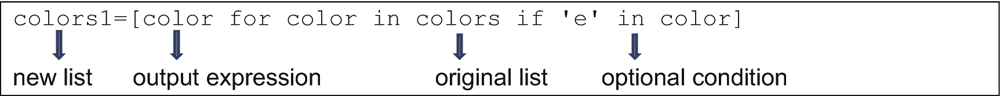

# 二、探索容器、类和对象

在这一章中，我们将继续学习 Python 中的其他一些基本概念——各种类型的容器、可用于每个容器的方法、面向对象的编程、类和对象。

## 容器

在前一章中，我们看到一个变量可以有类似于 *int* 、 *float* 、 *str* 等数据类型，但是只能保存一个值。容器是可以包含多个值的对象。这些值可以具有相同的数据类型，也可以具有不同的数据类型。Python 中的四个内置容器是:

*   列表

*   元组

*   字典

*   设置

容器也被称为可迭代的；也就是说，您可以访问或遍历给定容器对象中的每个值。

在下面的小节中，我们将更详细地讨论每个容器及其方法。

### 列表

列表包含一组按顺序存储的值。列表是可变的，也就是说，可以修改、添加或删除列表中的值，使其成为一个灵活的容器。

可以使用索引来访问单个列表项，索引是方括号中的整数，表示该项的位置。列表的索引从 0 开始。

现在让我们来看看如何定义和操作一个列表。

**定义列表**

可以通过给列表一个名称和一组用方括号括起来的值来定义列表。

代码:

```py
colors=['violet','indigo','red','blue','green','yellow']

```

**向列表添加项目**

表 [2-1](#Tab1) 中说明了不同的方法可用于向列表添加值。在前面的代码中创建的“颜色”列表用于下表给出的示例中。

表 2-1

向列表中添加项目

<colgroup><col class="tcol1 align-left"> <col class="tcol2 align-left"> <col class="tcol3 align-left"></colgroup> 
| 

方法

 | 

描述

 | 

例子

 |
| --- | --- | --- |
| 附加 | 在列表末尾添加一项。该方法只接受一个值作为参数。 | 代码:`colors.append('white')``#the value 'white' is added after the last item in the 'colors' list` |
| 插入 | 在给定位置或索引处添加一项。这个方法有两个参数——索引和要添加的值。 | 代码:`colors.insert(3,'pink')``#the value 'pink' is added at the fourth position in the 'colors'` `list` |
| 扩展 | 在给定列表的末尾添加多个元素(作为一个列表)。该方法将另一个列表作为参数。 | 代码:`colors.extend(['purple','magenta'])``#values 'purple' and 'magenta' added at the end of the 'colors' list` |

**从列表中删除元素**

正如有多种方法可以向列表中添加项目一样，也有多种方法可以从列表中删除值，如表 [2-2](#Tab2) 中所述。请注意，每种方法一次只能删除一个项目。

表 2-2

从列表中删除项目

<colgroup><col class="tcol1 align-left"> <col class="tcol2 align-left"> <col class="tcol3 align-left"></colgroup> 
| 

方法

 | 

描述

 | 

例子

 |
| --- | --- | --- |
| 的 | 关键字删除给定位置的项目。 | 代码:`del colors[1]``#removes the second item of the 'colors' list` |
| *移除* | 当已知要移除的项的名称，但不知道其位置时，使用此方法。 | 代码:`colors.remove('white')``#removes the item 'white' from the 'colors' list` |
| *流行* | 此方法移除并返回列表中的最后一项。 | 代码:`colors.pop()``#removes the last item and displays the item removed` |

**查找列表中对象的索引(位置)**

*index* 方法用于找出列表中特定项或值的位置(或索引),如以下语句所示。

代码:

```py
colors.index('violet')

```

输出:

```py
0

```

**计算列表长度**

*len* 函数返回列表中的项目数，如下所示。列表的名称作为参数传递给这个函数。注意 *len* 是一个函数，不是一个方法。方法只能用于对象。

代码:

```py
len(colors)

```

输出:

```py
7

```

**排序列表**

*sort* 方法对列表中的值进行升序或降序排序。默认情况下，此方法按升序对项目进行排序。如果列表包含字符串，则按字母顺序进行排序(使用每个字符串的第一个字母)，如下所示。

代码:

```py
colors.sort()
colors

```

输出:

```py
['blue', 'green', 'purple', 'red', 'violet', 'white', 'yellow']

```

请注意，列表必须是同类的(列表中的所有值都应该是相同的数据类型)，排序方法才能起作用。如果列表包含不同数据类型的项目，应用 sort 方法会导致错误。

如果您想按相反的字母顺序对元素进行排序，您需要添加 *reverse* 参数，并将其设置为“True”，如下所示。

代码:

```py
colors.sort(reverse=True)
colors

```

输出:

```py
['yellow', 'white', 'violet', 'red', 'purple', 'green', 'blue']

```

请注意，如果您只想颠倒列表中项目的顺序，而不想对项目进行排序，您可以使用 *reverse* 方法，如下所示。

代码:

```py
colors=['violet','indigo','red','blue','green','yellow']
colors.reverse()
colors

```

输出:

```py
['yellow', 'green', 'blue', 'red', 'indigo', 'violet']

```

延伸阅读:

查看更多可用于列表的方法:

[T2`https://docs.python.org/3/tutorial/datastructures.html#more-on-lists`](https://docs.python.org/3/tutorial/datastructures.html%2523more-on-lists)

**切片列表**

当我们从列表中创建切片时，我们通过从列表中选择特定的值，基于它们的位置或者通过使用一个条件，来创建原始列表的子集。列表切片的工作方式类似于字符串切片，我们在上一章已经研究过了。

为了使用索引创建切片，我们使用冒号操作符(:)并为需要选择的索引指定起始值和终止值。

如果我们在冒号前后都没有提供开始或停止值，则假定开始值是第一个元素的索引(0)，而停止值是最后一个元素的索引，如下面的语句所示。

代码:

```py
`colors[:]

```

输出:

```py
['Violet', 'Indigo', 'Blue', 'Green', 'Yellow', 'Orange', 'Red']

```

如果我们使用步进索引，我们也可以使用冒号操作符两次。在下面的语句中，通过指定步长索引为 2 来提取列表的替代元素。

代码:

```py
colors[::2]

```

输出:

```py
['Violet', 'Blue', 'Yellow', 'Red']

```

就像字符串一样，列表遵循正索引和负索引。负索引(从–1 开始，是列表中最后一个元素的索引)从右到左工作，而正索引(从 0 开始，是列表中第一个元素的索引)从左到右工作。

下面显示了一个使用负索引的切片示例，其中我们从列表中的最后一个值开始提取替代元素。

代码:

```py
colors[-1:-8:-2]

```

输出:

```py
['Red', 'Yellow', 'Blue', 'Violet']

```

#### 从现有列表创建新列表

从现有列表创建新列表有三种方法——列表综合、*映射*函数和*过滤器*函数——下面将对此进行解释。

1.  **列出理解**

List comprehensions 提供了一种从现有列表创建新列表的简单而直观的方法。

让我们通过一个例子来理解这一点，在这个例子中，我们从前面创建的列表(“colors”)中创建一个新的列表(“colors1”)。此列表仅包含原始列表中包含字母“e”的项目。

代码:

```py
colors1=[color for color in colors if 'e' in color]
colors1

```

输出:

```py
['violet', 'red', 'blue', 'green', 'yellow']

```

列表理解的结构如图 [2-1](#Fig1) 所示。新列表中项目的输出表达式(' color ')首先出现。接下来是一个 for 循环来遍历原始列表(注意，其他循环，如 *while* 循环，在列表理解中不用于迭代)。最后，您可以使用 if/else 结构添加一个可选条件。



图 2-1

列表理解

如果我们试图使用循环和条件，在没有列表理解的情况下创建相同的列表，代码将会更加扩展，如下所示。

代码:

```py
colors1=[]
for color in colors:
    if 'e' in color:
        colors1.append(color)

```

在使用列表理解时要记住的关键点是代码的可读性不应该受到损害。如果在创建新列表的过程中涉及到太多的条件表达式和循环，最好避免列表理解。

延伸阅读:查看更多关于列表理解: [`https://docs.python.org/3/tutorial/datastructures.html#list-comprehensions`](https://docs.python.org/3/tutorial/datastructures.html%2523list-comprehensions)

1.  **地图功能**

    *map* 函数用于通过在现有列表上应用用户定义的或内置的函数来创建新列表。 *map* 函数返回一个地图对象，我们需要应用 list 函数将其转换成一个列表。

    The map function accepts two arguments:
    *   要应用的函数

    *   要应用该函数的列表

在下面的示例中，我们从“colors”列表创建一个新列表(“colors1”)，将其元素转换为大写。使用了一个匿名(lambda)函数，后跟原始列表的名称。

代码:

```py
colors=['violet','indigo','red','blue','green','yellow']
colors1=map(lambda x:x.upper(),colors)
colors1

```

输出:

```py
<map at 0x2dc87148630>

```

该函数返回一个 map 对象，需要使用 *list* 函数将其转换为 list。

代码:

```py
list(colors1)

```

输出:

1.  **过滤功能**

```py
['VIOLET', 'INDIGO', 'RED', 'BLUE', 'GREEN', 'YELLOW']

```

*过滤器*函数的语法类似于*地图*函数的语法。*映射*函数在应用后返回原始列表中的所有对象，而*过滤器*函数仅返回那些满足调用过滤器函数时指定的条件的项目。与 map 函数类似，我们传递两个参数(一个 lambda 函数或一个用户定义的函数，后跟列表的名称)。

在下面的例子中，我们从原始列表中创建一个列表，只保留那些少于五个字符的条目。

代码:

```py
colors2=filter(lambda x:len(x)<5,colors)
list(colors2)

```

输出:

```py
['red', 'blue']

```

现在让我们讨论如何同时遍历两个或更多的列表。

**使用 zip 函数遍历多个列表**

*zip* 函数提供了一种组合列表并在这些列表上联合执行操作的方法，如下所示。需要组合的列表作为参数传递给 list 函数。

代码:

```py
#zip function and lists
colors=['Violet','Indigo','Blue','Green','Yellow','Orange','Red']
color_ids=[1,2,3,4,5,6,7]
for i,j in zip(colors, color_ids):
    print(i,"has a serial number",j)

```

输出:

```py
Violet has a serial number 1
Indigo has a serial number 2
Blue has a serial number 3
Green has a serial number 4
Yellow has a serial number 5
Orange has a serial number 6
Red has a serial number 7

```

*zip* 函数返回存储在“zip”类型对象中的元组列表。该对象的类型需要更改为*列表*类型才能查看元组。

代码:

```py
list(zip(colors,color_ids))

```

输出:

```py
[('Violet', 1),
 ('Indigo', 2),
 ('Blue', 3),
 ('Green', 4),
 ('Yellow', 5),
 ('Orange', 6),
 ('Red', 7)]

```

下一个函数， *enumerate* ，帮助我们访问列表中条目的索引。

#### 访问列表中项目的索引

当你想访问一个给定列表中的对象及其索引时,*枚举*函数很有用。该函数返回一系列元组，每个元组包含该项及其索引。该函数的用法示例如下所示。

代码:

```py
colors=['Violet','Indigo','Blue','Green','Yellow','Orange','Red']
for index,item in enumerate(colors):
    print(item,"occurs at index",index)

```

输出:

```py
Violet occurs at index 0
Indigo occurs at index 1
Blue occurs at index 2
Green occurs at index 3
Yellow occurs at index 4
Orange occurs at index 5
Red occurs at index 6

```

#### 列表的连接

列表的连接，即我们组合两个或多个列表，可以使用'+'操作符来完成。

代码:

```py
x=[1,2,3]
y=[3,4,5]
x+y

```

输出:

```py
[1, 2, 3, 3, 4, 5]

```

我们可以连接任意数量的列表。请注意，串联不会修改任何被连接的列表。串联操作的结果存储在一个新的对象中。

*extend* 方法也可以用于列表的连接。与'+'操作符不同，*扩展*方法改变了原始列表。

代码:

```py
x.extend(y)
x

```

输出:

```py
[1, 2, 3, 3, 4, 5]

```

其他算术运算符，如-、*或/，不能用于组合列表。

为了找出两个包含数字的列表中元素的区别，我们使用 list comprehension 和 *zip* 函数，如下所示。

代码:

```py
x=[1,2,3]
y=[3,4,5]
d=[i-j for i,j in zip(x,y)]
d

```

输出:

```py
[-2, -2, -2]

```

### 元组

tuple 是 Python 中的另一个容器，和 list 一样，它按顺序存储项目。像列表中的项目一样，元组中的值可以通过它们的索引来访问。然而，元组的一些属性使其不同于列表，如下所述。

1.  **不变性**:tuple 是不可变的，这意味着您不能添加、删除或更改 tuple 中的元素。另一方面，列表允许所有这些操作。

2.  **语法**:定义元组的语法使用圆括号(或圆括号)将单个值括起来(与列表使用的方括号相比)。

3.  **速度**:就访问和检索单个元素的速度而言，一个元组比一个列表表现得更好。

现在让我们学习如何定义一个元组以及可以用于元组的各种方法。

**定义一个元组**

元组可以定义为带括号或不带括号，如下面的代码所示。

代码:

```py
a=(1,2,3)
#can also be defined without parenthesis
b=1,2,3
#A tuple can contain just a simple element
c=1,
#Note that we need to add the comma even though there is no element following it because we are telling the interpreter that it is a tuple.

```

就像列表一样，元组可以包含任何内置数据类型的对象，比如浮点、字符串、布尔值等等。

#### 用于元组的方法

虽然元组不能更改，但有一些操作可以用元组来执行。这些操作解释如下。

**元组中对象的频率**

*count* 方法用于计算元组中给定值的出现次数:

代码:

```py
x=(True,False,True,False,True)
x.count(True)

```

输出:

```py
3

```

**元组项目的位置/索引**

*index* 方法可以用来查找一个元组中一个条目的位置。使用前面语句中创建的元组，让我们找到值“False”的出现。

代码:

```py
x.index(False)

```

输出:

```py
1

```

index 方法只返回该项第一次出现的位置。

**元组解包**

元组解包是提取元组中的单个值并将这些项中的每一项存储在单独的变量中的过程。

代码:

```py
a,b,c,d,e=x

```

如果我们不知道元组中项的数量，我们可以使用“*_”符号将出现在第一个元素之后的元素解包到一个列表中，如下所示。

代码:

```py
a,*_=x
print(a,_)

```

输出:

```py
True [False, True, False, True]

```

**一个元组的长度**

可以使用 *len* 函数计算元组的长度:

代码:

```py
len(x)

```

输出`:`

```py
5

```

**元组切片**

可以对元组执行值的更小子集的切片或创建(在这方面类似于列表和字符串)。

下面是一个例子。

代码:

```py
x[::-1]

```

输出:

```py
(True, False, True, False, True)

```

#### 元组的应用

下面是一些可以使用元组的场景。

1.  **用元组创建字典**

我们将在下一节详细讨论字典，它是一个包含一组条目的容器(有一个映射到值的键)。元组可用于在创建字典时定义条目。

字典项是一个元组，可以使用 *dict* 方法将字典定义为一个元组列表，如下所示。

代码:

```py
x=dict([('color','pink'),('flower','rose')])
x

```

输出:

1.  **多重分配**

```py
{'color': 'pink', 'flower': 'rose'}

```

如前所述，元组解包是将元组分成其组件的过程。这个原则可以用于在一行中初始化多个变量，如下所示。

代码:

```py
#tuple unpacking
(a,b,c,d)=range(4)
print(a,b,c,d)

```

输出:

```py
0 1 2 3

```

延伸阅读:在此查看更多关于元组: [`https://docs.python.org/3/tutorial/datastructures.html#tuples-and-sequences`](https://docs.python.org/3/tutorial/datastructures.html%2523tuples-and-sequences)

### **字典**

字典是包含一组条目的容器，每个条目将一个“键”映射到一个“值”。每个单独的项也称为键/值对。关于字典，还有其他一些需要注意的地方:

*   与列表和元组中的值不同，字典中的项不是按顺序存储的。

*   像列表一样，字典是可变的(即，可以对字典对象进行修改)。

*   花括号用于将字典中的条目括起来。

让我们了解如何定义一个字典以及可以用于字典对象的不同方法。

**定义字典**

字典被定义为一对花括号内的一组逗号分隔的键/值对，如下面的代码所示。

代码:

```py
numbers={'English':'One','Spanish':'Uno','German':'Ein'}
numbers

```

输出:

```py
{'English': 'One', 'Spanish': 'Uno', 'German': 'Ein'}

```

“英语”、“西班牙语”和“德语”构成了键，而“One”、“Uno”和“Ein”是字典中的值。

还可以使用 *dict* 函数来定义字典，正如我们在前面讨论元组时所解释的。这个函数的参数是一个元组列表，每个元组代表一个键/值对，如下所示。

```py
numbers=dict([('English','One'),('Spanish','Uno'),('German','Ein')])

```

**向字典添加条目(键/值对)**

使用该键作为索引，可以向字典中添加一个新项，如下所示。

代码:

```py
numbers['French']='un'
numbers
#A new key/value pair with the key as 'French' and value as 'un' has been added.

```

输出:

```py
{'English': 'One', 'Spanish': 'Uno', 'German': 'Ein', 'French': 'un'}

```

**访问字典中的关键字**

*keys* 方法访问字典中的键:

代码:

```py
numbers.keys()

```

输出:

```py
dict_keys(['English', 'Spanish', 'German', 'French'])

```

**访问字典中的值**

*values* 方法访问字典中的值:

代码:

```py
numbers.values()

```

输出:

```py
dict_values(['One', 'Uno', 'Ein', 'un'])

```

**访问字典中的所有键/值对**

*items* 方法用于访问字典中的键/值对列表。

代码:

```py
numbers.items()

```

输出:

```py
dict_items([('English', 'One'), ('Spanish', 'Uno'), ('German', 'Ein'), ('French', 'un')])

```

**访问单个值**

可以使用给定键作为索引来检索对应于该键的值，如下所示。

代码:

```py
numbers['German']

```

输出:

```py
'Ein'

```

*get* 方法也可以用于检索值。该密钥作为参数传递给此方法，如下所示。

代码:

```py
numbers.get('German')

```

输出与前面语句中获得的输出相同。

**设置键的默认值**

前面讨论的 *get* 方法也可以用来添加一个键/值对，并为一个键设置默认值。如果已经定义了键/值对，则默认值将被忽略。还有另一个方法， *setdefault* ，也可以用于这个目的。

注意， *get* 方法并不改变字典对象，而 *setdefault* 方法确保这些改变反映在对象中。

*setdefault* 方法的用法示例如下所示。

代码:

```py
numbers.setdefault('Mandarin','yi')
numbers

```

输出:

```py
{'English': 'One',
 'Spanish': 'Uno',
 'German': 'Ein',
 'French': 'un',
 'Mandarin': 'yi'}

```

正如我们所看到的，添加了一个新的键/值对。

下面显示了一个 *get* 方法的例子。

代码:

```py
numbers.get('Hindi','Ek')
numbers

```

输出:

```py
{'English': 'One',
 'Spanish': 'Uno',
 'German': 'Ein',
 'French': 'un',
 'Mandarin': 'yi'}

```

由 g *et* 方法设置的值不会添加到字典中。

**清理字典**

*clear* 方法从字典中删除所有的键/值对，换句话说，它清除字典的内容，而不从内存中删除变量。

```py
#removing all the key/value pairs
numbers.clear()

```

输出:

```py
  {}

```

延伸阅读:查看更多关于词典的信息:

[T2`https://docs.python.org/3/tutorial/datastructures.html#dictionaries`](https://docs.python.org/3/tutorial/datastructures.html%2523dictionaries)

### 设置

集合是一个容器，其中包含未排序或未索引的元素。集合的主要特征是它是由*个唯一的*元素组成的集合。请注意，如果我们在创建集合时添加重复的元素，Python 不会抛出错误。然而，当我们对集合执行操作时，所有重复的元素都被忽略，只考虑不同的元素。

**设定定义**

就像字典一样，集合是用花括号声明的，并且有无序的元素。然而，虽然可以使用关键字作为索引来访问字典中的值，但是不能通过索引来访问集合中的值。

以下是集合定义的示例:

代码:

```py
a={1,1,2}
a

```

输出:

```py
{1, 2}

```

正如我们从输出中看到的，重复值 1(存在于集合定义中)被忽略。

**设定操作**

表 [2-3](#Tab3) 中解释了可用于器械包的方法和功能。

延伸阅读:查看更多关于集: [`https://docs.python.org/3/tutorial/datastructures.html#sets`](https://docs.python.org/3/tutorial/datastructures.html%2523sets)

表 2-3

集合操作

<colgroup><col class="tcol1 align-left"> <col class="tcol2 align-left"> <col class="tcol3 align-left"></colgroup> 
| 

操作

 | 

方法/功能

 | 

例子

 |
| --- | --- | --- |
| 求集合的长度 | 函数计算集合中元素的数量，只考虑不同的值。 | `len(a)` |
| 集合迭代 | for 循环可以遍历一个集合并打印它的元素。 | `for x in a:``print(x)` |
| 添加项目或值 | 使用*添加*方法可以将单个物品添加到器械包中。对于添加多个值，使用*更新*方法。 | `a.add(3)``#or``a.update([4,5])` |
| 移除项目 | 可以使用*移除*或*丢弃*方法移除物品。 | `a.remove(4)``# Or``a.discard(4)``#Note: When we try to delete an element that is not in the set, the discard method does not give an error, whereas the remove method gives a KeyError.` |

既然我们已经涵盖了 Python 语言的所有要素——我们在前一章中学习的概念以及我们在本章中了解的关于各种容器及其方法的内容，我们需要决定使用哪种风格或编程范式。在各种编程范例中，包括过程式编程、函数式编程和面向对象编程，我们将在下一节讨论面向对象编程。

## 面向对象编程

面向对象编程(通常也称为“OOPS”)是作为传统编程方法的过程编程的替代方案出现的。

程序设计包括使用一系列步骤顺序执行程序。过程化编程的一个主要缺点是全局变量的存在容易受到意外操纵。OOPS 相对于过程化编程提供了几个优势，包括重用代码的能力、消除全局变量、防止未经授权的数据访问，以及提供管理代码复杂性的能力。

Python 遵循面向对象的范式。类和对象构成了面向对象编程的构造块。类提供了蓝图或结构，而对象实现了这个结构。使用 *class* 关键字定义类。

例如，假设您有一个名为“Baby”的类，其属性包括婴儿的名字、性别和体重。这个类的方法(或类中定义的函数)可以是婴儿执行的动作，如笑、哭和吃。实例/对象是类的实现，有自己的一组属性和方法。在这个例子中，每个婴儿都有其独特的特征(数据)和行为(功能)

一个类可以有一组属性或变量，可以是类变量，也可以是实例变量。类的所有实例共享类变量，而实例变量对于每个实例是唯一的。

让我们看看如何在 Python 中定义类，使用下面的例子:

代码:

```py
#example of a class
class Rectangle:
    sides=4
    def __init__(self,l,b):
        self.length=l
        self.breadth=b
    def area(self):
        print("Area:",self.length*self.breadth)
my_rectangle=Rectangle(4,5)
my_rectangle.area()

```

输出:

```py
Area: 20

```

*class* 关键字后跟一个类名和一个冒号。接下来，我们定义一个名为“sides”的类变量，并将其初始化为 4。该变量对该类的所有对象都是通用的。

在这之后，有一个设置或初始化变量的构造函数。注意构造函数的特殊语法——空格跟在关键字 *def* 后面，然后是两个下划线符号, *init* 关键字，再后面是两个下划线符号。

在一个类中定义的任何方法的第一个参数是 *self* 关键字，它引用该类的一个实例。然后是初始化参数“l”和“b”，它们指的是矩形的长度和宽度。这些值是在我们创建对象时作为参数提供的。实例变量“self.length”和“self . width”使用前面提到的参数进行初始化。接下来是另一个计算矩形面积的方法。记住，每当我们定义一个类的任何方法时，我们都需要添加 *self* 作为参数。

一旦定义了类，我们就可以定义这个类的一个实例，也称为对象。我们创建一个对象就像我们创建一个变量，给它一个名字，并初始化它。“my_rectangle”是创建的对象/实例的名称，后跟一个“=”符号。然后我们提到类的名字和在构造函数中使用的参数来初始化对象。我们正在创建一个长为 4，宽为 5 的矩形。然后我们调用 area 方法来计算面积，它计算并打印面积。

延伸阅读:查看更多关于 Python 中的类: [`https://docs.python.org/3/tutorial/classes.html`](https://docs.python.org/3/tutorial/classes.html)

### 面向对象编程原则

面向对象编程的主要原则是封装、多态、数据抽象和继承。让我们来看看这些概念。

**封装**:封装是指将数据(类中定义的变量)与可以修改它的功能(方法)绑定在一起。封装还包括数据隐藏，因为类内定义的数据不会被类外定义的任何函数操纵。一旦我们创建了该类的一个对象，它的变量只能由与该对象相关联的方法(或函数)来访问和修改。

让我们考虑下面的例子:

代码:

```py
class Circle():
    def __init__(self,r):
        self.radius=r
    def area(self):
        return 3.14*self.r*self.r
c=Circle(5)
c.radius #correct way of accessing instance variable

```

这里，Circle 类有一个实例变量 radius 和一个方法 area。变量 radius 只能使用该类的对象访问，而不能通过任何其他方式访问，如下面的语句所示。

代码:

```py
c.radius #correct way of accessing instance variable
radius #incorrect, leads to an error

```

**多态性**

多态(一个接口，多种形式)提供了使用相同接口(方法或函数)的能力，而不管数据类型如何。

让我们使用 *len* 函数来理解多态性的原理。

代码:

```py
#using the len function with a string
len("Hello")

```

输出:

```py
5

```

代码:

```py
#using the len function with a list
len([1,2,3,4])

```

输出:

```py
4

```

代码:

```py
#using the len function with a tuple
len((1,2,3))

```

输出:

```py
3

```

代码:

```py
#using the len function with a dictionary
len({'a':1,'b':2})

```

输出:

```py
2

```

计算其参数长度的 *len* 函数可以接受任何类型的参数。我们将字符串、列表、元组和字典作为参数传递给该函数，该函数返回这些对象的长度。没有必要为每种数据类型编写单独的函数。

**继承**:继承指的是从父类创建另一个类的能力，称为子类。子类继承了父类的一些属性和功能，但也可能有自己的功能和变量。

下面演示了 Python 中继承的一个例子。

```py
#inheritance
class Mother():
    def __init__(self,fname,sname):
        self.firstname=fname
        self.surname=sname
    def nameprint(self):
        print("Name:",self.firstname+" "+self.surname)
class Child(Mother):
    pass

```

父类称为“Mother”，其属性“firstname”和“surname”使用 *init* 构造函数方法初始化。名为“child”的子类继承自“Mother”类。当我们定义子类时，父类的名称作为参数传递。关键字 *pass* 指示 Python 不需要为子类做任何事情(这个类只是从父类继承一切，而不添加任何东西)。

然而，即使子类没有实现任何其他方法或添加任何额外的属性，关键字 *pass* 对于防止抛出任何错误是必不可少的。

延伸阅读:了解更多传承: [`https://docs.python.org/3/tutorial/classes.html#inheritance`](https://docs.python.org/3/tutorial/classes.html%2523inheritance)

**数据抽象**

数据抽象是只显示功能而隐藏实现细节的过程。例如，Whatsapp 的新用户只需要学习它的基本功能，如发送消息、附加照片和拨打电话，而不必学习编写该应用程序代码的开发人员如何实现这些功能。

在下面的例子中，我们声明了一个“Circle”类的对象并使用 area 方法计算面积，当我们调用 area 方法时，我们不需要知道面积是如何计算的。

```py
class Circle():
    def __init__(self,r):
        self.r=r
    def area(self):
        return 3.14*self.r*self.r
circle1=Circle(3)
circle1.area()

```

输出:

```py
28.259999999999998

```

## 摘要

*   容器是属于基本数据类型(如 int、float、str)的对象集合。Python 中有四个内置容器——列表、元组、字典和集合。

*   每个容器都有不同的属性，可以应用于容器的各种函数也各不相同，这取决于元素是否可以排序和更改(可变性)。列表是可变的和有序的，元组是不可变的和有序的，字典和集合是可变的和无序的。

*   Python 遵循面向对象编程的原则，如继承(从另一个类派生一个类)、数据抽象(仅呈现相关细节)、封装(将数据与功能绑定)和多态(使用多种数据类型的接口的能力)。

*   一个类包含一个构造函数(使用特殊的语法定义)、实例变量和操作这些变量的方法。所有方法都必须包含关键字 *self* 作为引用该类对象的参数。

在下一章，我们将学习 Python 如何应用于正则表达式和解决数学问题，以及用于这些应用的库。

## 复习练习

**问题 1**

如何将列表转换成元组，反之亦然？

**问题 2**

就像列表理解一样，字典理解是从现有条目创建字典的捷径。使用字典理解创建以下字典(从两个列表中，一个包含键(a–f)，另一个包含值(1–6)):

```py
{'a': 0, 'b': 1, 'c': 2, 'd': 3, 'e': 4, 'f': 5}

```

**问题 3**

下面哪个代码语句*不是*会导致错误？

1.  `'abc'[0]='d'`

2.  `list('abc')[0]='d'`

3.  `tuple('abc')[0]='d'`

4.  `dict([('a',1),('b',2)])[0]=3`

**问题 4**

写一个程序，计算“乌云背后都有一线光明”这句话的元音数。

**问题 5**

以下代码的输出是什么？

```py
x=1,2
y=1,
z=(1,2,3)
type(x)==type(y)==type(z)

```

**问题 6**

以下代码的输出是什么？

```py
numbers={
    'English':{'1':'One','2':'Two'},
    'Spanish':{'1':'Uno','2':'Dos'},
    'German':{'1':'Ein','2':'Zwei'}
}
numbers['Spanish']['2']

```

**问题 7**

考虑下面的字典:

```py
eatables={'chocolate':2,'ice cream':3}

```

使用将另一个条目(关键字为“biscuit ”,值为 4)添加到这个字典中

*   如果语句

*   setdefault 方法

**问题 8**

创建一个包含从 1 到 20 的奇数的列表，并使用适当的 list 方法执行以下操作:

*   在末尾添加元素 21

*   在第四个位置插入数字 23

*   向此列表中添加另一个包含 1 到 20 的偶数的列表

*   找出数字 15 的索引

*   移除并返回最后一个元素

*   删除第 10 个元素

*   筛选此列表以创建所有数字小于或等于 13 的新列表

*   使用 map 函数创建一个新列表，其中包含列表中数字的方块

*   使用列表理解从现有列表创建新列表。如果是奇数，这个列表应该包含原始数字。否则它应该包含该数字的一半。

**答案**

**问题 1**

使用 list 方法将元组转换为列表:

```py
list((1,2,3))

```

使用 tuple 方法将列表转换为元组:

```py
tuple([1,2,3])

```

**问题 2**

代码:

```py
#list containing keys
l=list('abcdef')
#list containing values
m=list(range(6))
#dictionary comprehension
x={i:j for i,j in zip(l,m)}
x

```

**问题 3**

正确选项:b 和 d

在选项 a 和 c 中，代码语句试图分别改变字符串和元组中的项目，它们是不可变的对象，因此这些操作是不允许的。在选项 b(列表)和 d(词典)中，允许项目分配。

**问题 4**

解决方案:

```py
message="Every cloud has a silver lining"
m=message.lower()
count={}
vowels=['a','e','i','o','u']
for character in m:
    if character.casefold() in vowels:
        count.setdefault(character,0)
        count[character]=count[character]+1
print(count)

```

**问题 5**

输出:

```py
True

```

这三种方法都是公认的定义元组的方式。

**问题 6**

输出:

```py
'Dos'

```

这个问题使用了嵌套字典(字典中的字典)的概念。

**问题 7**

解决方案:

```py
eatables={'chocolate':2,'ice cream':3}
#If statement
if 'biscuit' not in eatables:
    eatables['biscuit']=4
#setdefault method(alternative method)
eatables.setdefault('biscuit',4)

```

**问题 8**

解决方案:

```py
odd_numbers=list(range(1,20,2))
#Add the element 21 at the end
odd_numbers.append(21)
#insert the number 23 at the 4th position
odd_numbers.insert(3,23)
#To this list, add another list containing even numbers from 1 to 20
even_numbers=list(range(2,20,2))
odd_numbers.extend(even_numbers)
#find the index of the number 15
odd_numbers.index(15)
#remove and return the last element
odd_numbers.pop()
#delete the 10the element
del odd_numbers[9]
#filter this list with all numbers less than or equal to 13
nos_less_13=filter(lambda x:x<=13,odd_numbers)
list(nos_less_13)
#use the map function to create a list containing squares
squared_list=map(lambda x:x**2,odd_numbers)
#use list comprehension for the new list
new_list=[x/2 if x%2==0 else x for x in odd_numbers]
new_list

```