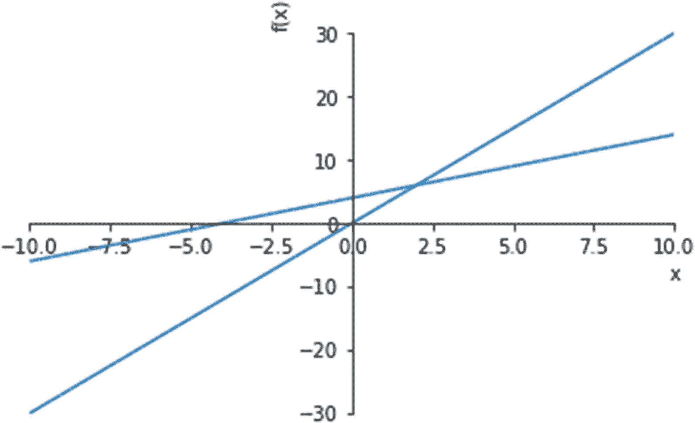

# 三、Python 中的正则表达式和数学

在这一章中，我们讨论 Python 中的两个模块: *re* ，它包含可应用于正则表达式的函数，以及 *SymPy* ，用于解决代数、微积分、概率和集合论中的数学问题。我们将在本章中学习的概念，如搜索和替换字符串、概率和绘制图表，将在后续章节中派上用场，我们将在后续章节中介绍数据分析和统计。

## 正则表达式

正则表达式是包含字符(如字母和数字)和元字符(如*和$符号)的模式。每当我们想要搜索、替换或提取具有可识别模式的数据时，都可以使用正则表达式，例如日期、邮政编码、HTML 标记、电话号码等等。通过确保用户输入的格式正确，它们还可以用于验证密码和电子邮件地址等字段。

### 使用正则表达式解决问题的步骤

Python 中的 *re* 模块提供了对正则表达式的支持，可以使用以下语句导入该模块:

```py
import re

```

如果您还没有安装 *re* 模块，请进入 Anaconda 提示符并输入以下命令:

```py
pip install re

```

一旦模块被导入，您需要遵循以下步骤。

1.  **定义并编译正则表达式**:re 模块导入后，我们定义正则表达式并编译。搜索模式以前缀“r”开头，后跟字符串(搜索模式)。前缀“r”代表原始字符串，它告诉编译器特殊字符将按字面意思处理，而不是转义序列。请注意，前缀“r”是可选的。compile 函数将搜索模式编译成字节码，如下所示，搜索字符串(和)作为参数传递给 compile 函数。

    CODE:

    ```py
    search_pattern=re.compile(r'and')

    ```

2.  **在字符串**中定位搜索模式(正则表达式):

    在第二步中，我们尝试使用 search 方法在要搜索的字符串中定位这个模式。这个方法是对我们在上一步中定义的变量(search_pattern)调用的。

    CODE:

    ```py
    search_pattern.search('Today and tomorrow')

    ```

    Output:

    ```py
    <re.Match object; span=(6, 9), match="and">

    ```

因为在字符串(“Today and tomorrow”)中找到了搜索模式(“and”)，所以返回一个 match 对象。

**快捷方式(结合步骤 2 和 3)**

前面的两个步骤可以合并成一个步骤，如下面的语句所示:

代码:

```py
re.search('and','Today and tomorrow')

```

使用前面定义的一行代码，我们将定义、编译和定位搜索模式这三个步骤合并为一个步骤。

延伸阅读:参考本文档，了解如何在 Python 中使用正则表达式:

[T2`https://docs.python.org/3/howto/regex.html#regex-howto`](https://docs.python.org/3/howto/regex.html%2523regex-howto)

### 正则表达式的 Python 函数

我们使用正则表达式来匹配、拆分和替换文本，并且这些任务中的每一个都有单独的函数。表 [3-1](#Tab1) 提供了所有这些功能的列表，以及它们的用法示例。

表 3-1

在 Python 中使用正则表达式的函数

<colgroup><col class="tcol1 align-left"> <col class="tcol2 align-left"></colgroup> 
| 

Python 函数

 | 

例子

 |
| --- | --- |
| *re.findall( )* :搜索正则表达式的所有*可能匹配项，并返回在字符串中找到的所有匹配项的列表。* | 代码:`re.findall('3','98371234')`输出:`['3', '3']` |
| *re.search( )* :搜索单个匹配项，并返回与字符串中找到的第一个匹配项相对应的 match 对象。 | 代码:`re.search('3','98371234')`输出:`<re.Match object; span=(2, 3), match="3">` |
| *re.match( )* :该功能类似于*重新搜索*功能。这个函数的限制是，如果模式出现在字符串的开头的*，它只返回一个匹配对象*。** | 代码:`re.match('3','98371234')`因为搜索模式(3)不在字符串的开头，所以 match 函数不返回对象，我们看不到任何输出。 |
| *re.split( ):* 在被搜索字符串中找到搜索模式的位置拆分字符串。 | 代码:`re.split('3','98371234')`输出:`['98', '712', '4']`只要找到搜索模式“3”，该字符串就会被拆分成更小的字符串。 |
| *re():*用另一个字符串或模式替换搜索模式。 | 代码:`re.sub('3','three','98371234')`输出:`'98three712three4'`字符串中的字符“3”被替换为字符串“三”。 |

延伸阅读:

了解上表中讨论的函数的更多信息:

*   搜索匹配功能: [`https://docs.python.org/3.4/library/re.html#search-vs-match`](https://docs.python.org/3.4/library/re.html%2523search-vs-match)

*   拆分功能: [`https://docs.python.org/3/library/re.html#re.split`](https://docs.python.org/3/library/re.html%2523re.split)

*   子功能: [`https://docs.python.org/3/library/re.html#re.sub`](https://docs.python.org/3/library/re.html%2523re.sub)

*   Findall 函数: [`https://docs.python.org/3/library/re.html#re.findall`](https://docs.python.org/3/library/re.html%2523re.findall)

#### 元字符

元字符是正则表达式中使用的具有特殊含义的字符。下面将解释这些元字符，并举例说明它们的用法。

1.  **点(。)元字符**

    这个元字符匹配一个字符，这个字符可以是一个数字、字母，甚至是它本身。

    在下面的例子中，我们尝试匹配三个字母的单词(来自下面代码中逗号后面给出的列表)，从两个字母“ba”开始。

    CODE:

    ```py
    re.findall("ba.","bar bat bad ba. ban")

    ```

    Output:

    ```py
    ['bar', 'bat', 'bad', 'ba.', 'ban']

    ```

    请注意，输出中显示的结果之一是“ba”是一个实例，其中。(点)元字符已匹配自身。

2.  **方括号([])作为元字符**

    为了匹配一组字符中的任何一个字符，我们使用方括号([ ])。在这些方括号中，我们定义了一组字符，其中一个字符必须与文本中的字符相匹配。

    让我们用一个例子来理解这一点。在下面的示例中，我们尝试匹配包含字符串“ash”的所有字符串，并以下列任何字符开始-“c”、“r”、“b”、“m”、“d”、“h”或“w”。

    CODE:

    ```py
    regex=re.compile(r'[crbmdhw]ash')
    regex.findall('cash rash bash mash dash hash wash crash ash')

    ```

    Output:

    ```py
    ['cash', 'rash', 'bash', 'mash', 'dash', 'hash', 'wash', 'rash']

    ```

    请注意，字符串“ash”和“crash”不匹配，因为它们不符合标准(字符串需要以方括号中定义的字符之一开头)。

3.  **问号(？)元字符**

    当您需要匹配一个字符的最多一次出现时，使用这个元字符。这意味着我们要寻找的字符可能不在搜索字符串中，或者只出现一次。考虑下面的例子，我们试图匹配以字符“Austr”开始，以字符“ia”结束，并且以下每个字符零个或一个出现的字符串——“a”、“l”、“a”、“s”。

    CODE:

    ```py
    regex=re.compile(r'Austr[a]?[l]?[a]?[s]?ia')
    regex.findall('Austria Australia Australasia Asia')

    ```

    Output:

    ```py
    ['Austria', 'Australia', 'Australasia']

    ```

    请注意，字符串“Asia”不符合此标准。

4.  **星号(*)元字符**

    这个元字符可以匹配零个或多个给定的搜索模式。换句话说，搜索模式可能根本不会出现在字符串中，也可能出现任意次。

    让我们通过一个例子来理解这一点，在这个例子中，我们试图匹配所有以字符串“abc”开头，后面跟有零个或多个数字“1”的字符串。

    CODE:

    ```py
    re.findall("abc[1]*","abc1 abc111 abc1 abc abc111111111111 abc01")

    ```

    Output:

    ```py
    ['abc1', 'abc111', 'abc1', 'abc', 'abc111111111111', 'abc']

    ```

    请注意，在这一步中，我们将正则表达式的编译和搜索合并在一个单独的步骤中。

5.  **反斜杠(\)元字符**

    The backslash symbol is used to indicate a character class, which is a predefined set of characters. In Table [3-2](#Tab2), the commonly used character classes are explained.

    表 3-2

    字符类别

    <colgroup><col class="tcol1 align-left"> <col class="tcol2 align-left"></colgroup> 
    | 

    字符类

     | 

    涵盖的字符

     |
    | --- | --- |
    | \d | 匹配一个数字(0–9) |
    | \D | 匹配任何不是数字的字符 |
    | \w | 匹配字母数字字符，可以是小写字母(A–Z)、大写字母(A–Z)或数字(0–9) |
    | \W | 匹配任何不是字母数字的字符 |
    | \s | 匹配任何空白字符 |
    | \S | 匹配任何非空白字符 |

    **反斜杠符号的另一种用法:转义元字符**

    正如我们所见，在正则表达式中，元字符如。和*有特殊含义。如果我们想在字面上使用这些字符，我们需要通过在这些字符前面加上一个\(反斜杠)符号来“转义”它们。例如，要搜索文本 W.H.O，我们需要对。(点)字符，以防止它被用作常规元字符。

    CODE:

    ```py
    regex=re.compile(r'W\.H\.O')
    regex.search('W.H.O norms')

    ```

    Output:

    ```py
    <re.Match object; span=(0, 5), match='W.H.O'>

    ```

6.  **加号(+)元字符**

    此元字符匹配一个或多个搜索模式。在下面的示例中，我们尝试匹配所有以至少一个字母开头的字符串。

    CODE:

    ```py
    re.findall("[a-z]+123","a123 b123 123 ab123 xyz123")

    ```

    Output:

    ```py
    ['a123', 'b123', 'ab123', 'xyz123']

    ```

7.  **花括号{}作为元字符**

    使用花括号并在花括号中指定一个数字，我们可以指定一个范围或一个数字来表示搜索模式的重复次数。

    在下面的例子中，我们找出了所有格式为“xxx-xxx-xxxx”的电话号码(三个数字，接着是另一组三个数字，最后是一组四个数字，每组数字用“-”号分隔)。

    CODE:

    ```py
    regex=re.compile(r'[\d]{3}-[\d]{3}-[\d]{4}')
    regex.findall('987-999-8888 99122222 911-911-9111')

    ```

    Output:

    ```py
    ['987-999-8888', '911-911-9111']

    ```

    只有搜索字符串(`987-999-8888, 911-911-9111)`中的第一个和第三个数字与模式匹配。\d 元字符代表一个数字。

    如果我们不知道重复次数的确切数字，但知道最大和最小重复次数，我们可以在花括号内提到上限和下限。在下面的示例中，我们搜索包含最少六个字符、最多十个字符的所有字符串。

    CODE:

    ```py
    regex=re.compile(r'[\w]{6,10}')
    regex.findall('abcd abcd1234,abc$$$$$,abcd12 abcdef')

    ```

    Output:

    ```py
    ['abcd1234', 'abcd12', 'abcdef']

    ```

8.  **美元($)元字符**

    如果这个元字符出现在搜索字符串的末尾，它就匹配一个模式。

    在下面的例子中，我们使用这个元字符来检查搜索字符串是否以数字结尾。

    CODE:

    ```py
    re.search(r'[\d]$','aa*5')

    ```

    Output:

    ```py
    <re.Match object; span=(3, 4), match="5">

    ```

    因为字符串以数字结尾，所以返回一个 match 对象。

9.  **脱字符(^)元字符**

    脱字符(^)元字符在字符串的开头查找匹配项。

    在下面的例子中，我们检查搜索字符串是否以空格开头。

    CODE:

    ```py
    re.search(r'^[\s]','   a bird')

    ```

    Output:

    ```py
    <re.Match object; span=(0, 1), match=' '>

    ```

延伸阅读:了解更多元字符: [`https://docs.python.org/3.4/library/re.html#regular-expression-syntax`](https://docs.python.org/3.4/library/re.html%2523regular-expression-syntax)

现在让我们讨论另一个库，Sympy，它用于解决各种基于数学的问题。

## 使用 Sympy 解决数学问题

SymPy 是 Python 中的一个库，可用于解决各种数学问题。我们首先看一下如何在代数中使用辛函数——解方程和分解表达式。在这之后，我们将介绍集合论和微积分中的一些应用。

可以使用以下语句导入 SymPy 模块。

代码:

```py
import sympy

```

如果您还没有安装 *sympy* 模块，请进入 Anaconda 提示符并输入以下命令:

```py
pip install sympy

```

现在让我们用这个模块来解决各种数学问题，从表达式的因式分解开始。

### 代数表达式的因式分解

表达式的因式分解包括将表达式分解成更简单的表达式或因子。将这些因素相乘，我们得到了原始表达式。

举个例子，一个代数表达式，像*x*<sup>2</sup>—*y*<sup>2</sup>，可以因式分解为:(x-y)*(x+y)。

SymPy 为我们提供了分解表达式和扩展表达式的功能。

一个代数表达式包含在 SymPy 中被表示为“符号”的变量。在应用 SymPy 函数之前，Python 中的一个变量必须被转换成一个 symbol 对象，该对象是使用 *symbols* 类(用于定义多个符号)或 *Symbol* 类(用于定义单个符号)创建的。然后，我们导入*因子*和*扩展*函数，然后将我们需要进行因子分解或扩展的表达式作为参数传递给这些函数，如下所示。

代码:

```py
#importing the symbol classes
from sympy import symbols,Symbol
#defining the symbol objects
x,y=symbols('x,y')
a=Symbol('a')
#importing the functions
from sympy import factor,expand
#factorizing an expression
factorized_expr=factor(x**2-y**2)
#expanding an expression
expanded_expr=expand((x-y)**3)
print("After factorizing x**2-y**2:",factorized_expr)
print("After expanding (x-y)**3:",expanded_expr)

```

输出:

```py
After factorizing x**2-y**2: (x - y)*(x + y)
After expanding,(x-y)**3: x**3 - 3*x**2*y + 3*x*y**2 - y**3

```

### 解代数方程(一个变量)

代数方程包含一个表达式，带有一系列等于零的项。现在让我们使用 SymPy 中的*求解*函数来求解方程*x*T2】25*x*+6 = 0。

我们从 SymPy 库中导入 *solve* 函数，并将我们想要求解的方程作为参数传递给这个函数，如下所示。 *dict* 参数以结构化格式产生输出，但是包含这个参数是可选的。

代码:

```py
#importing the solve function
from sympy import solve
exp=x**2-5*x+6
#using the solve function to solve an equation
solve(exp,dict=True)

```

输出:

```py
[{x: 2}, {x: 3}]

```

### 解联立方程(两个变量)

*solve* 函数也可以用来同时求解两个方程，如下面的代码块所示。

代码:

```py
from sympy import symbols,solve
x,y=symbols('x,y')
exp1=2*x-y+4
exp2=3*x+2*y-1
solve((exp1,exp2),dict=True)

```

输出:

```py
[{x: -1, y: 2}]

```

延伸阅读:查看更多关于求解函数的信息:

[T2`https://docs.sympy.org/latest/modules/solvers/solvers.html#algebraic-equations`](https://docs.sympy.org/latest/modules/solvers/solvers.html%2523algebraic-equations)

### 求解用户输入的表达式

我们可以让用户使用 *input* 函数输入表达式，而不是定义表达式。问题是用户输入的内容被当作字符串处理，而 SymPy 函数无法处理这样的输入。

函数可以用来将任何表达式转换成与 SymPy 兼容的类型。注意，当输入时，用户必须输入数学运算符，如*、**，等等。例如，如果表达式是 2*x+3，用户在输入时不能跳过星号。如果用户输入 2x+3，将会产生一个错误。下面的代码块中提供了一个代码示例来演示 *sympify* 函数。

代码:

```py
from sympy import sympify,solve
expn=input("Input an expression:")
symp_expn=sympify(expn)
solve(symp_expn,dict=True)

```

输出:

```py
Input an expression:x**2-9
[{x: -3}, {x: 3}]

```

### 图解求解联立方程

代数方程也可以用图解法求解。如果把方程画在图上，两条线的交点代表解。

来自 *sympy.plotting* 模块的绘图函数可用于绘制方程，两个表达式作为参数传递给该函数。

代码:

```py
from sympy.plotting import plot
%matplotlib inline
plot(x+4,3*x)
solve((x+4-y,3*x-y),dict=True)

```

输出(如图 [3-1](#Fig1) 所示)。



图 3-1

用图解联立方程

### 创建和操作集合

集合是唯一元素的集合，有许多操作可以应用于集合。集合用文氏图表示，文氏图描述两个或多个集合之间的关系。

SymPy 为我们提供了创建和操作集合的功能。

首先，您需要从 SymPy 包中导入 *FiniteSet* 类来处理集合。

代码:

```py
from sympy import FiniteSet

```

现在，声明这个类的一个对象来创建一个集合，并使用您想要的集合中的数字来初始化它。

代码:

```py
s=FiniteSet(1,2,3)

```

输出:

```py
{1,2,3}

```

我们也可以从列表中创建一个集合，如下面的语句所示。

代码:

```py
l=[1,2,3]
s=FiniteSet(*l)

```

### 集合的并与交

两个集合的并集是两个集合中所有不同元素的列表，而两个集合的交集包括两个集合的公共元素。

SymPy 为我们提供了一种使用*并集*和*交集*函数计算两个集合的并集和交集的方法。

我们使用 FiniteSet 类创建集合，然后对它们应用*联合*和*相交*函数，如下所示。

代码:

```py
s1=FiniteSet(1,2,3)
s2=FiniteSet(2,3,4)
union_set=s1.union(s2)
intersect_set=s1.intersect(s2)
print("Union of the sets is:",union_set)
print("Intersection of the sets is:",intersect_set)

```

输出:

```py
Union of the sets is: {1, 2, 3, 4}
Intersection of the sets is: {2, 3}

```

### 寻找一个事件的概率

事件的概率是事件发生的可能性，用数字定义。

使用集合来定义我们的事件和样本空间，我们可以在 SymPy 函数的帮助下解决概率问题。

让我们考虑一个简单的例子，其中我们发现在前十个自然数中找到 3 的倍数的概率。

为了回答这个问题，我们首先将样本空间“s”定义为一个从 1 到 10 的集合。然后，我们定义事件，用字母“a”表示，它是 3 的倍数的出现。然后，我们通过使用 *len* 函数，用样本空间中的元素数量来定义该事件中的元素数量，从而找到该事件的概率(‘a’)。这将在下面演示。

代码:

```py
s=FiniteSet(1,2,3,4,5,6,7,8,9,10)
a=FiniteSet(3,6,9)
p=len(a)/len(s)
p

```

输出:

```py
0.3

```

延伸阅读:

查看更多可对器械包执行的操作: [`https://docs.sympy.org/latest/modules/sets.html#compound-sets`](https://docs.sympy.org/latest/modules/sets.html%2523compound-sets)

与 SymPy: [`https://docs.sympy.org/latest/modules/sets.html#module-sympy.sets.sets`](https://docs.sympy.org/latest/modules/sets.html%2523module-sympy.sets.sets) 中的集合相关的所有信息

### 微积分解题

我们将学习如何使用 SymPy 计算一个函数的极限值、导数、定积分和不定积分。

#### 函数的极限

函数的极限值 f(x)是当 x 接近某一特定值时的函数值。

例如，如果我们取函数 1/x，我们看到随着 x 的增加，1/x 的值继续减少。当 x 接近一个无限大的值时，1/x 变得更接近 0。使用 SymPy 函数- *limit* 计算极限值，如下所示。

代码:

```py
from sympy import limit,Symbol
x=Symbol('x')
limit(1/x,x,0)

```

输出:

```py
∞

```

#### 函数的导数

函数的导数定义了该函数相对于独立变量的变化率。如果我们以距离为函数，以时间为自变量，这个函数的导数就是这个函数对时间的变化率，也就是速度。

SymPy 有一个函数， *diff* ，以表达式(要计算其导数)和自变量为自变量，返回表达式的导数。

代码:

```py
from sympy import Symbol,diff
x=Symbol('x')
#defining the expression to be differentiated
expr=x**2-4
#applying the diff function to this expression
d=diff(expr,x)
d

```

输出:

```
2𝑥

```py

#### 函数的积分

函数的积分也叫做反导数。一个函数对两点的定积分，比如说“p”和“q”，就是曲线下两个极限之间的面积。对于不定积分，这些极限是没有定义的。

在 SymPy 中，可以使用 *integrate* 函数计算积分。

让我们来计算上一个例子中看到的函数的微分(2x)的不定积分。

代码:

```
from sympy import integrate
#applying the integrate function
integrate(d,x)

```py

输出:

```
𝑥2

```py

让我们使用积分函数来计算上面输出的定积分。integrate 函数接受的参数包括极限值 1 和 4(作为一个元组)，以及变量(符号)“x”。

代码:

```
integrate(d,(x,1,4))

```py

输出:

```
15

```py

延伸阅读:查看更多关于微分、积分和计算极限的函数: [`https://docs.sympy.org/latest/tutorial/calculus.html`](https://docs.sympy.org/latest/tutorial/calculus.html)

## 摘要

1.  正则表达式是文字和元字符的组合，有多种应用。

2.  正则表达式可用于搜索和替换单词，定位系统中的文件，以及 web 爬行或抓取程序。它还可以应用于数据争论和清理操作，验证用户在电子邮件和 HTML 表单中的输入，以及搜索引擎。

3.  在 Python 中， *re* 模块提供了对正则表达式的支持。Python 中正则表达式匹配常用的函数有: *findall* 、 *search* 、 *match* 、 *split* 和 *sub* 。

4.  元字符是正则表达式中具有特殊意义的字符。每个元字符都有特定的用途。

5.  字符类(以反斜杠符号开头)用于匹配预定义的字符集，如数字、字母数字字符、空白字符等。

6.  Sympy 是一个用于解决数学问题的库。Sympy 中使用的基本构建块称为“符号”，它代表一个变量。我们可以使用 Sympy 库的函数来分解或展开表达式，解方程，微分或积分函数，以及解决涉及集合的问题。

在下一章中，我们将学习另一个 Python 模块 NumPy，它用于创建数组、计算统计聚集度量和执行计算。NumPy 模块也构成了 Pandas 的主干，这是一个用于数据争论和分析的流行库，我们将在第 [6](6.html) 章中详细讨论。

## 复习练习

**问题 1**

选择不正确的陈述:

1.  即使在集合中使用，元字符也被视为元字符

2.  的。(点/点)元字符用于匹配除换行符之外的任何(单个)字符

3.  正则表达式不区分大小写

4.  默认情况下，正则表达式只返回找到的第一个匹配项

5.  以上都不是

**问题 2**

解释正则表达式的一些用例。

**问题 3**

对一个元字符进行转义的目的是什么，为此使用了哪个字符？

**问题 4**

以下语句的输出是什么？

```
re.findall('bond\d{1,3}','bond07 bond007 Bond 07')

```py

**问题 5**

将下列元字符与其功能配对:

<colgroup><col class="tcol1 align-left"> <col class="tcol2 align-left"></colgroup> 
|     1\. + | a.匹配零个或一个字符 |
| 2\. * | b.匹配一个或多个字符 |
|     3\. ? | c.匹配字符集 |
|     4\. [ ] | d.匹配搜索字符串末尾的字符 |
| 5\. $ | e.匹配零个或多个字符 |
|     6\. { } | f.指定时间间隔 |

**问题 6**

将以下元字符(用于字符类)与其功能匹配:

<colgroup><col class="tcol1 align-left"> <col class="tcol2 align-left"></colgroup> 
| 1.\d | a.匹配单词的开头或结尾 |
| 2.\D | b.匹配除空白字符以外的任何字符 |
| 3.\S | c.匹配非数字 |
| 4.\w | d.匹配数字 |
| 5.\b | e.匹配字母数字字符 |

**问题 7**

编写一个程序，要求用户输入密码并进行验证。密码应满足以下要求:

*   长度至少应为六个字符

*   至少包含一个大写字母、一个小写字母、一个特殊字符和一个数字

**问题 8**

考虑两个表达式 y=x**2-9 和 y=3*x-11。

使用 SymPy 函数解决以下问题:

*   对表达式 x**2-9 进行因式分解，并列出其因式

*   解这两个方程

*   画出这两个方程，并用图表显示其解

*   对于 x=1，求表达式 x**2-9 的微分

*   求表达式 3*x-11 在点 x=0 和 x=1 之间的定积分

**答案**

**问题 1**

不正确的选项是选项 1 和 3。

选项 1 是不正确的，因为当元字符在集合中使用时，它不被认为是元字符，而是采用其字面意义。

选项 3 不正确，因为正则表达式区分大小写(“hat”与“HAT”不同)。

其他选项都是正确的。

**问题 2**

正则表达式的一些用例包括

1.  HTML 表单中的用户输入验证。正则表达式可用于检查用户输入，并确保输入符合表单中各个字段的要求。

2.  Web 爬行和 web 抓取:正则表达式通常用于从网站搜索一般信息(爬行)和从网站提取某些类型的文本或数据(抓取)，例如电话号码和电子邮件地址。

3.  在您的操作系统上定位文件:使用正则表达式，您可以在您的系统上搜索文件名具有相同扩展名或遵循某种其他模式的文件。

**问题 3**

我们对元字符进行转义，以便在字面上使用它。反斜杠字符(\)符号位于要转义的元字符之前。例如，符号“*”在正则表达式中有特殊的含义。如果你想用这个字符它没有特殊的含义，你需要用\*

**问题 4**

输出

```
['bond07', 'bond007']

```py

**问题 5**

```
1-b; 2-e; 3-a; 4-d; 5-c; 6-f

```py

**问题 6**

```
1-d; 2-c; 3-b; 4-e; 5-a

```py

**问题 7**

代码:

```
import re
special_characters=['$','#','@','&','^','*']
while True:
    s=input("Enter your password")
    if len(s)<6:
        print("Enter at least 6 characters in your password")
    else:
        if re.search(r'\d',s) is None:
            print("Your password should contain at least 1 digit")
        elif re.search(r'[A-Z]',s) is None:
            print("Your password should contain at least 1 uppercase letter")
        elif re.search(r'[a-z]',s) is None:
            print("Your password should contain at least 1 lowercase letter")
        elif not any(char in special_characters for char in s):
            print("Your password should contain at least 1 special character")
        else:
            print("The password you entered meets our requirements")
            break

```py

**问题 8**

代码:

```
from sympy import Symbol,symbols,factor,solve,diff,integrate,plot
#creating symbols
x,y=symbols('x,y')
y=x**2-9
y=3*x-11
#factorizing the expression
factor(x**2-9)
#solving two equations
solve((x**2-9-y,3*x-11-y),dict=True)
#plotting the equations to find the solution
%matplotlib inline
plot(x**2-9-y,3*x-11-y)
#differentiating at a particular point
diff(x**2-9,x).subs({x:1})
#finding the integral between two points
integrate(3*x-11,(x,0,1))

```