# 四、描述性数据分析基础

在前面的章节中，您已经了解了 Python 语言——语法、函数、条件语句、数据类型和不同类型的容器。您还回顾了更高级的概念，如正则表达式、文件处理以及用 Python 解决数学问题。我们的焦点现在转向这本书的核心，描述性数据分析(也称为探索性数据分析)。

在描述性数据分析中，我们借助总结、聚合和可视化等方法来分析过去的数据，以得出有意义的见解。相比之下，当我们进行预测分析时，我们试图使用各种建模技术对未来进行预测或预报。

在本章中，我们将了解各种类型的数据、如何对数据进行分类、根据数据类别执行哪些操作，以及描述性数据分析流程的工作流程。

## 描述性数据分析-步骤

图 [4-1](#Fig1) 逐步说明了描述性数据分析所遵循的方法。

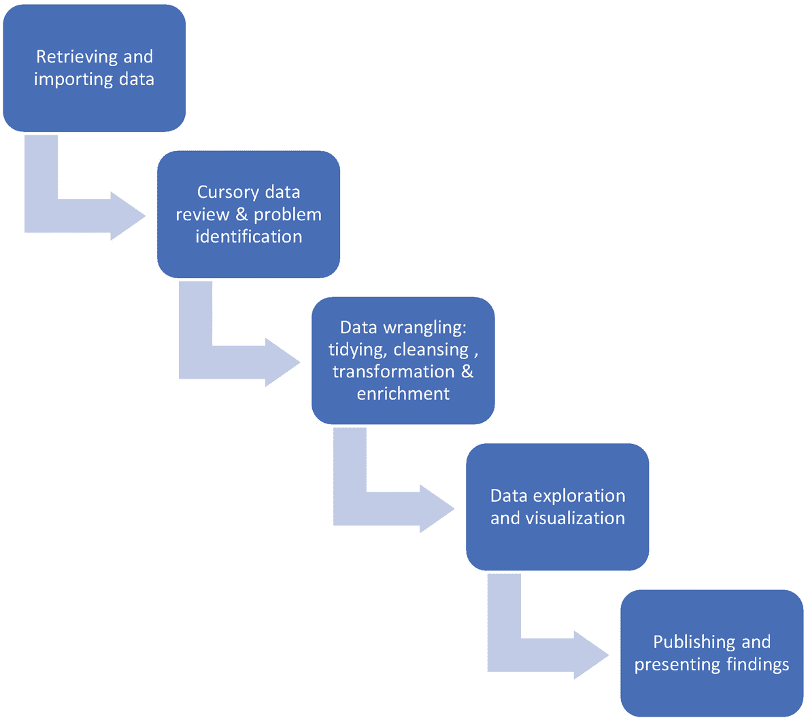

图 4-1

描述性数据分析的步骤

让我们详细了解这些步骤。

1.  **数据检索**:数据可以以结构化格式(如数据库或电子表格)或非结构化格式(如网页、电子邮件、Word 文档)存储。在考虑了数据的成本和结构等参数之后，我们需要弄清楚如何检索这些数据。像 Pandas 这样的库提供了以各种格式导入数据的功能。

2.  **粗略的数据回顾和问题识别**:在这一步，我们对想要分析的数据形成第一印象。我们旨在了解每个单独的列或功能、数据集中使用的各种缩写和符号的含义、记录或数据代表的内容以及用于数据存储的单位。我们还需要提出正确的问题，并在进入分析的本质之前弄清楚我们需要做什么。这些问题可能包括以下内容:哪些是与分析相关的功能，各个列中是否有增加或减少的趋势，我们是否看到任何丢失的值，我们是否正在尝试开发预测并预测一个功能，等等。

3.  **数据争论**:这一步是数据分析的关键，也是最耗时的活动，数据分析师和科学家大约 80%的时间都花在这上面。

    由于以下任何原因，原始形式的数据通常不适合于分析:存在缺失和冗余值、异常值、不正确的数据类型、存在无关数据、使用了一个以上的测量单位、数据分散在不同的源中，以及列未被正确识别。

    数据角力或 munging 是转换原始数据以使其适合数学处理和绘制图表的过程。它包括删除或替换丢失的值和不完整的条目，去除分号和逗号等填充值，过滤数据，更改数据类型，消除冗余，以及将数据与其他来源合并。

    数据争论包括整理、清理和丰富数据。在数据整理中，我们识别数据集中的变量，并将它们映射到列。我们还沿着右轴组织数据，并确保行包含观察值而不是特征。将数据转换成整洁形式的目的是使数据具有便于分析的结构。数据清理包括处理缺失值、不正确的数据类型、异常值和错误输入的数据。在数据丰富中，我们可能会添加来自其他来源的数据，并创建可能有助于我们分析的新列或功能。

4.  **数据探索和可视化**:准备好数据后，下一步是发现数据中的模式，总结关键特征，并理解各种特征之间的关系。有了可视化，你可以实现所有这些，并且清晰地呈现关键的发现。用于可视化的 Python 库包括 Matplotlib、Seaborn 和 Pandas。

5.  **展示和发布我们的分析** : Jupyter 笔记本有两个用途，一是执行我们的代码，二是作为一个平台来提供我们分析的高级摘要。通过添加笔记、标题、注释和图像，您可以美化您的笔记本，使其更适合更广泛的受众。笔记本可以下载成各种格式，比如 PDF，以后可以与他人分享以供审阅。

我们现在继续讨论数据的各种结构和层次。

## 数据结构

我们需要分析的数据可能具有以下任何一种结构，如图 [4-2](#Fig2) 所示。

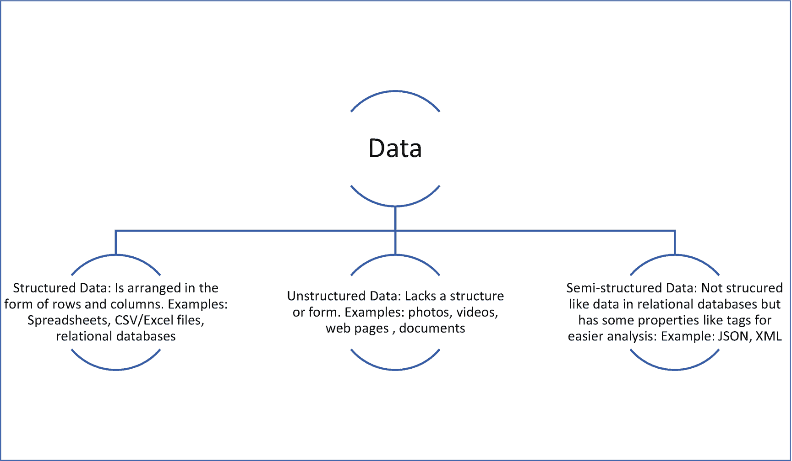

图 4-2

数据结构

## 将数据分类到不同的级别

大体上有两个层次的数据:连续的和分类的。连续数据可以进一步分为比率和区间，而分类数据可以是名义数据或顺序数据。数据等级如图 [4-3](#Fig3) 所示。

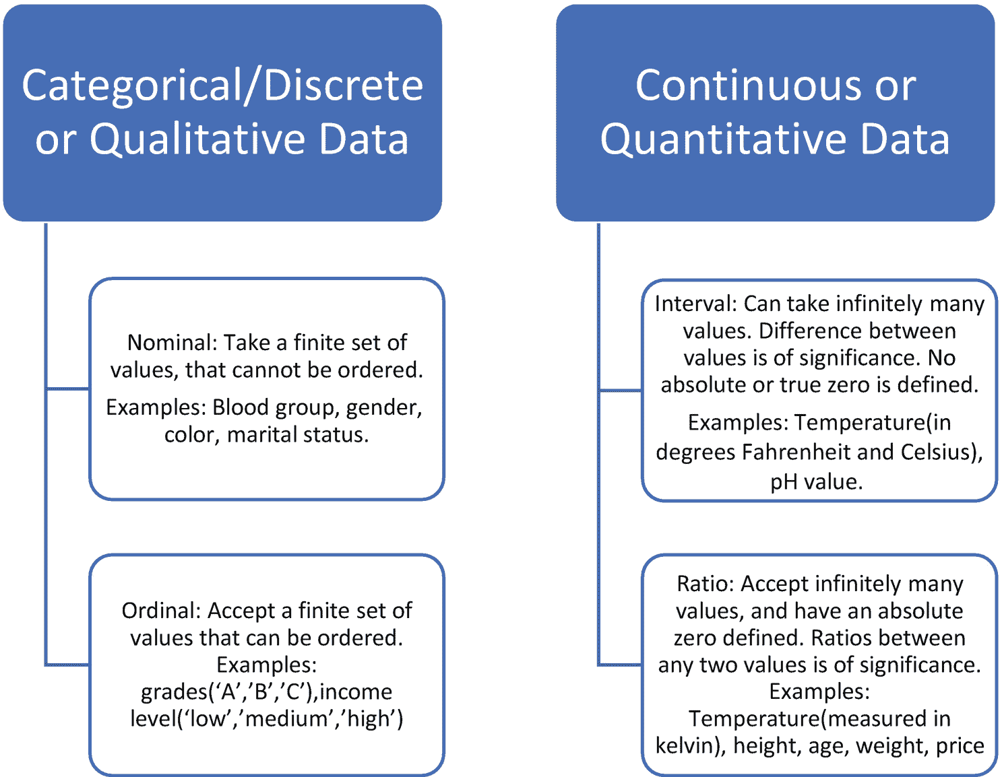

图 4-3

数据级别

以下是一些需要注意的要点:

*   **分类变量的数值**:分类数据不限于非数值。例如，学生的排名可以取 1/2/3 等值，这是一个包含数字值的顺序(分类)变量的示例。然而，这些数字不具有数学意义；例如，寻找平均排名是没有意义的。

*   **真零点** **的意义**:我们已经注意到区间变量没有绝对零点作为参考点，而比率变量有一个有效的零点。绝对零表示没有值。例如，当我们说像身高和体重这样的变量是比率变量时，这意味着这些变量中的任何一个值为 0 都意味着无效或不存在的数据点。对于像温度这样的间隔变量(当以摄氏度或华氏度测量时)，值 0 并不意味着没有数据。0 只是温度变量可以采用的值之一。另一方面，当在开尔文温标中测量时，温度是一个比率变量，因为该温标定义了绝对零度。

*   **识别区间变量**:区间变量没有绝对零度作为参考点，但是识别具有这种特征的变量可能并不明显。每当我们谈论一个数字的百分比变化时，它都是相对于它以前的值而言的。例如，通货膨胀或失业的百分比变化是以最后一个时间值作为参考点来计算的。这些是区间数据的实例。区间变量的另一个例子是在标准化考试中获得的分数，如 GRE(研究生入学考试)。最低分 260，最高分 340。评分是相对的，不是从 0 开始。与区间数据，而你可以执行加法和减法运算。不能对值进行除法或乘法运算(比率数据允许的运算)。

## 可视化不同级别的数据

每当需要分析数据时，首先要了解数据是结构化的还是非结构化的。如果数据是非结构化的，那么将它转换成具有行和列的结构化形式，这使得使用像 Pandas 这样的库进行进一步分析更加容易。有了这种格式的数据后，将每个要素或列分为四个数据级别，并相应地执行分析。

请注意，在本章中，我们仅旨在了解如何对数据集中的变量进行分类，并确定适用于每个类别的操作和绘图。第 [7](7.html) 章解释了可视化数据所需编写的实际代码。

我们看看如何对特征进行分类，并使用著名的 *Titanic* 数据集执行各种操作。数据集可以从这里导入:

[T2`https://github.com/DataRepo2019/Data-files/blob/master/titanic.csv`](https://github.com/DataRepo2019/Data-files/blob/master/titanic.csv)

数据集的背景信息:1912 年 4 月 15 日号，英国客轮泰坦尼克号在从南安普顿到纽约的处女航中与冰山相撞后沉没。在 2，224 名乘客中，有 1，500 人死亡，这是一场空前的悲剧。这个数据集描述了乘客的生存状态和关于他们的其他细节，包括他们的阶级、姓名、年龄和亲属数量。

图 [4-4](#Fig4) 提供了该数据集的快照。

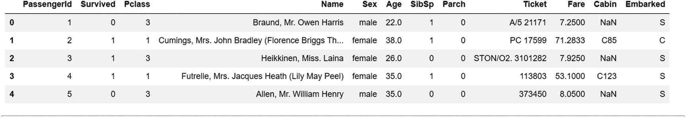

图 4-4

泰坦尼克号数据集

表 [4-1](#Tab1) 记录了该数据集中根据数据级别分类的要素。

表 4-1

泰坦尼克号数据集——数据级别

<colgroup><col class="tcol1 align-left"> <col class="tcol2 align-left"> <col class="tcol3 align-left"></colgroup> 
| 

数据集中的要素

 | 

它代表了什么

 | 

数据水平

 |
| --- | --- | --- |
| 乘客 Id | 乘客的身份号码 | 名义上的 |
| P 类 | 客运班(1:1 st 班；2: 2 级和级；3: 3 rd class)，乘客等级被用作衡量乘客的社会经济地位 | 序数 |
| 幸存 | 存活状态(0:未存活；1:幸存) | 名义上的 |
| 名字 | 乘客姓名 | 名义上的 |
| 兄弟姐妹数 | 船上的兄弟姐妹/配偶人数 | 比例 |
| 票 | 票号 | 名义上的 |
| 小木屋 | 客舱号 | 名义上的 |
| 性 | 乘客的性别 | 名义上的 |
| 年龄 | 年龄 | 比例 |
| 烤 | 船上父母/孩子的数量 | 比例 |
| 票价 | 乘客票价(英镑) | 比例 |
| 从事 | 装运港(C 为瑟堡，Q 为皇后镇，S 为南安普敦) | 名义上的 |

现在让我们来了解一下该数据集中要素分类背后的基本原理。

1.  Nominal variables: Variables like “PassengerId”, “Survived”, “Name”, “Sex”, “Cabin”, and “Embarked” do not have any intrinsic ordering of their values. Note that some of these variables have numeric values, but these values are finite in number. We cannot perform an arithmetic operation on these values like addition, subtraction, multiplication, or division. One operation that is common with nominal variables is counting. A commonly used method in Pandas, *value_counts* (discussed in the next chapter), is used to determine the number of values per each unique category of the nominal variable. We can also find the mode (the most frequently occurring value). The bar graph is frequently used to visualize nominal data (pie charts can also be used), as shown in Figure [4-5](#Fig5).

    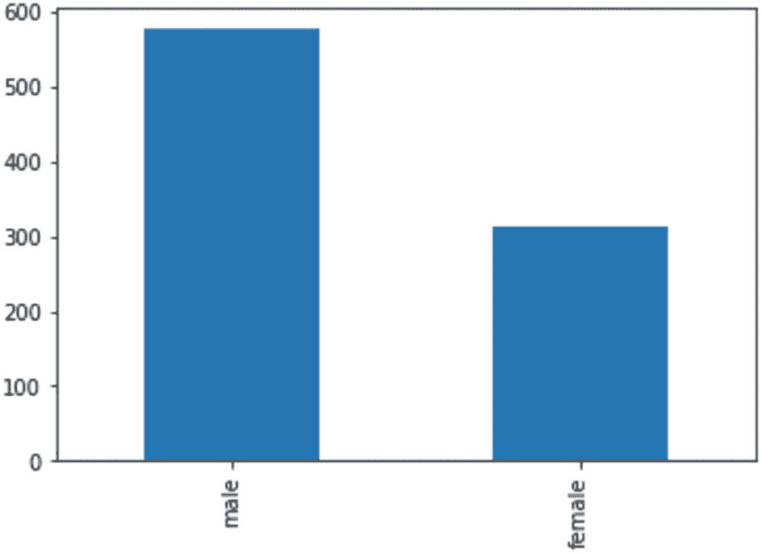

    图 4-5

    显示每个类别计数的条形图

2.  顺序变量:“Pclass”(或乘客等级)是一个顺序变量，因为它的值遵循一个顺序。值 1 相当于一等，2 相当于二等，依此类推。这些阶级价值观表明了社会经济地位。

    我们可以找出中间值和百分位数。我们还可以计算每个类别中值的数量，计算模式，并使用条形图和饼图等图表，就像我们对名义变量所做的那样。

    In Figure [4-6](#Fig6), we have used a pie chart for the ordinal variable “Pclass”.

    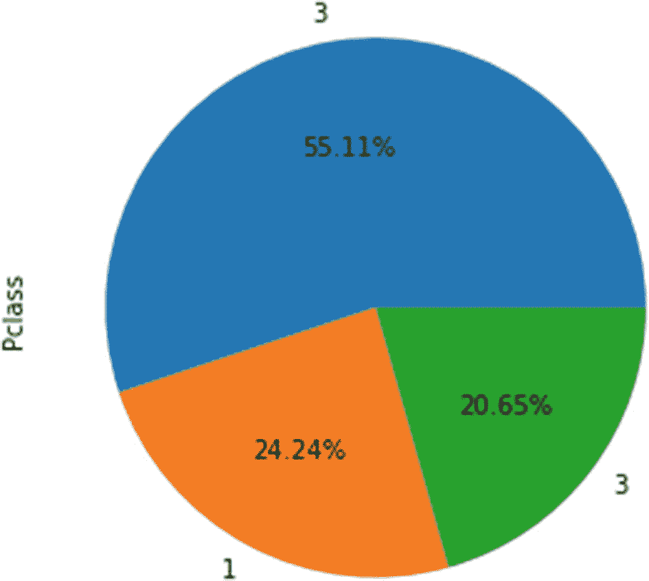

    图 4-6

    显示每个类别的百分比分布的饼图

3.  比率数据:“年龄”和“费用”变量是比率数据的例子，以零值作为参考点。有了这种类型的数据，我们可以进行广泛的数学运算。

    For example, we can add all the fares and divide it by the total number of passengers to find the mean. We can also find out the standard deviation. A histogram, as shown in Figure [4-7](#Fig7), can be used to visualize this kind of continuous data to understand the distribution.

    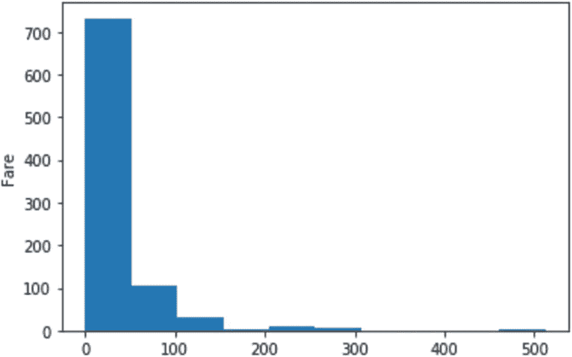

    图 4-7

    显示比率变量分布的直方图

在前面的图中，我们查看了用于绘制单个分类变量或连续变量的图表。在下一节中，我们了解当我们有一个以上的变量或变量组合属于不同的规模或水平时，应使用哪些图表。

### 绘制混合数据

在本节中，我们将考虑三个场景，每个场景都有两个变量，它们可能属于也可能不属于同一级别，并讨论每个场景使用哪个图(使用相同的 *Titanic* 数据集)。

1.  One categorical and one continuous variable: A box plot shows the distribution, symmetry, and outliers for a continuous variable. A box plot can also show the continuous variable against a categorical variable. In Figure [4-8](#Fig8), the distribution of ‘Age’ (a ratio variable) for each value of the nominal variable – ‘Survived’ (0 is the value for passengers who did not survive and 1 is the value for those who did).

    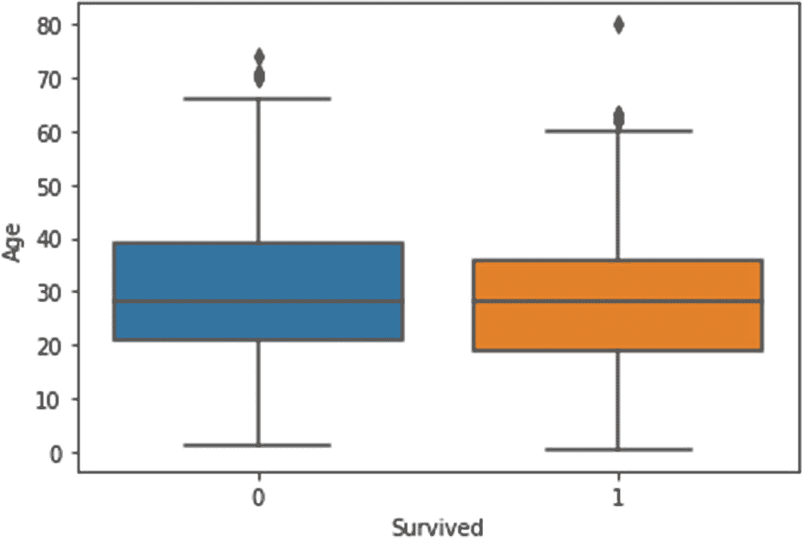

    图 4-8

    箱形图，显示不同类别的年龄分布

2.  Both continuous variables: Scatter plots are used to depict the relationship between two continuous variables. In Figure [4-9](#Fig9), we plot two ratio variables, ‘Age’ and ‘Fare’, on the x and y axes to produce a scatter plot.

    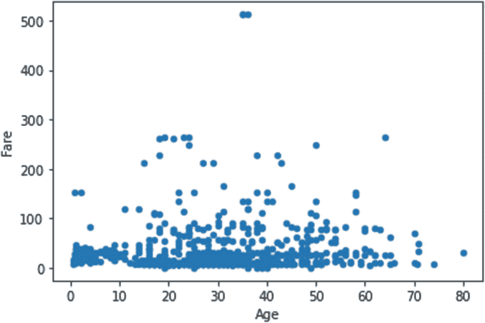

    图 4-9

    散点图

3.  Both categorical variables: Using a clustered bar chart (Figure [4-10](#Fig10)), you can combine two categorical variables with the bars depicted side by side to represent every combination of values for the two variables.

    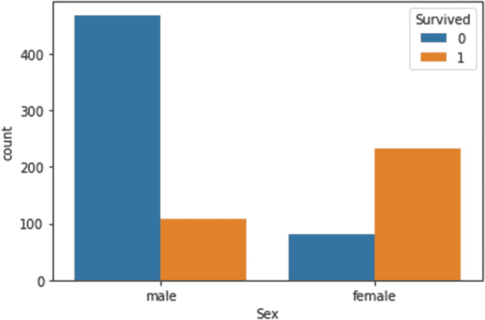

    图 4-10

    簇状条形图

我们也可以使用堆积条形图来绘制两个分类变量。考虑下面的堆积条形图，如图 [4-11](#Fig11) 所示，绘制了两个分类变量——“Pclass”和“Survived”。

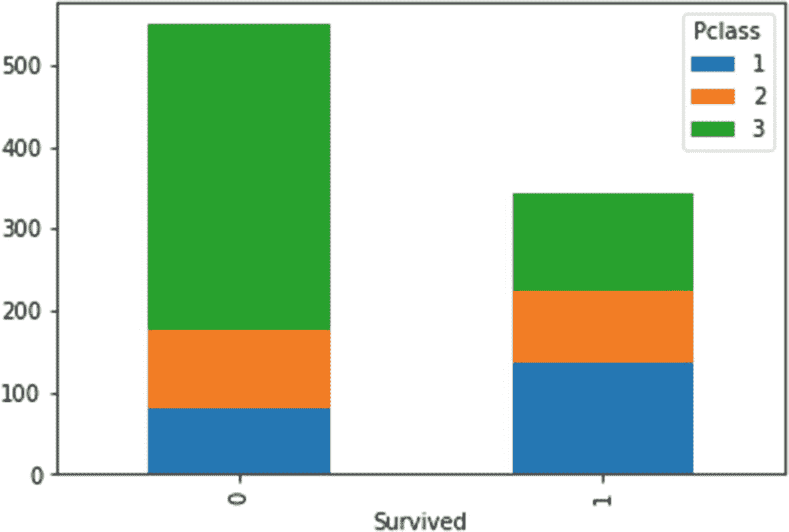

图 4-11

堆积条形图

总的来说，当您想要显示某个分类变量的不同值之间的连续变量时，您可以使用散点图来显示两个连续变量，使用堆积或簇状条形图来显示两个分类变量，以及使用箱形图。

## 摘要

1.  描述性数据分析是一个五步过程，使用过去的数据，遵循逐步的方法。这个过程的核心——数据争论——包括处理缺失值和其他异常。它还处理重组、合并和转换。

2.  数据可以根据其结构(结构化、非结构化或半结构化)或其包含的值的类型(分类或连续)进行分类。

3.  分类数据可以分为名义数据和顺序数据(取决于值是否可以排序)。连续数据可以是比率或区间类型(取决于数据是否以 0 作为绝对参考点)。

4.  可以使用的数学运算和图形绘制的种类因数据水平而异。

现在你已经对描述性数据分析过程有了一个高层次的了解，我们在下一章进入数据分析的本质。在下一章中，我们将讨论如何为我们在数据争论和准备中执行的各种任务编写代码，这一章将介绍 Pandas 库。

## 复习练习

**问题 1**

根据数据类型对下列变量进行分类。

*   pH 标度

*   语言能力

*   李克特量表(用于调查)

*   工作经验

*   一天中的时间

*   社会保险号

*   距离

*   出生年

**问题 2**

按照数据分析过程中出现的顺序安排以下五个步骤。

1.  形象化

2.  分析的发布和展示

3.  导入数据

4.  数据争论

5.  问题陈述公式

**问题 3**

对于以下每个操作或统计测量，列出兼容的数据类型。

*   分开

*   添加

*   增加

*   减法

*   平均

*   中位数

*   方式

*   标准偏差

*   范围

**问题 4**

对于以下每一项，列出兼容的数据类型。

*   条形图

*   直方图

*   饼图

*   散点图

*   堆积条形图

**答案**

**问题 1**

*   pH 值刻度:间隔

pH 值刻度没有绝对零点。虽然这些值可以比较，但我们无法计算比率。

*   语言能力:序数

    一门语言的熟练程度有不同的等级，如“初级”、“中级”和“高级”，这些都是有序的，因此属于顺序等级。

*   李克特量表(用于调查):序数。

    李克特量表常用于调查，其值有“不满意”、“满意”和“非常满意”。这些值形成了一个逻辑顺序，因此任何代表李克特量表的变量都是序数变量。

*   工作经验:比率

    因为这个变量有一个绝对零点，并且可以进行算术运算，包括比率的计算，所以这个变量是一个比率变量。

*   一天中的时间:间隔

    时间(12 小时制)没有绝对的零点。我们可以计算两个时间点之间的差异，但不能计算比率。

*   社会安全号码:名义上的

    像社会保险号这样的标识符的值是没有顺序的，不适合数学运算。

*   距离:比率

    参考点为 0，值可以加、减、乘、除，距离是一个比率变量。

*   出生年份:间隔

    这样的变量没有绝对的零点。你可以计算两年之间的差异，但我们无法找出比率。

**问题 2**

正确的顺序是 3，5，4，1，2

**问题 3**

*   分部:比率数据

*   加法:比率数据、区间数据

*   乘法:比率数据

*   减法:区间数据、比率数据

*   均值:比率数据、区间数据

*   中位数:序数数据，比率数据，区间数据

*   模式:所有四个级别的数据(比率、区间、标称和序数)

*   标准差:比率和区间数据

*   范围:比率和区间数据

**问题 4**

*   箱线图:序数、比率、间隔

*   直方图:比率，间隔

*   饼图:名义值，序数

*   散点图:比率，间隔

*   堆积条形图:名义值，序数