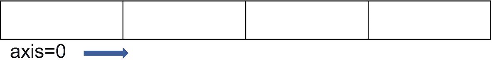
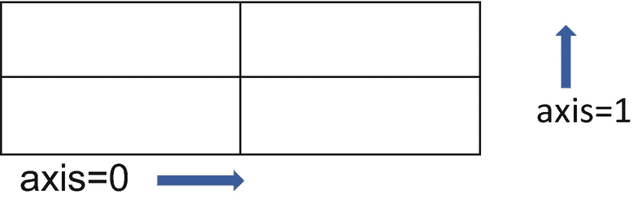
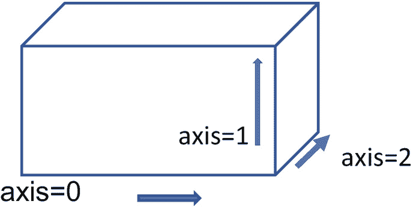

# 五、使用 NumPy 数组

NumPy 或 Numerical Python 是一个基于 Python 的库，用于数学计算和处理数组。Python 不支持一维以上的数据结构，像列表、元组和字典这样的容器是一维的。Python 中内置的数据类型和容器不能被重构为一个以上的维度，也不适合复杂的计算。这些缺点限制了分析数据和构建模型时所涉及的一些任务，这使得数组成为一种重要的数据结构。

NumPy 数组可以被重新整形，并利用向量化的原理(其中应用于数组的操作反映在其所有元素上)。

在前一章，我们看了描述性数据分析中使用的基本概念。NumPy 是我们在数据分析中执行的许多任务不可或缺的一部分，是 Pandas 中使用的许多函数和数据类型的主干。在本章中，我们了解了如何使用各种方法创建 NumPy 数组，组合数组，对数组进行切片、整形和执行计算。

## 熟悉数组和 NumPy 函数

在这里，我们看看创建和组合数组的各种方法，以及常用的 NumPy 函数。

**导入 NumPy 包**

必须先导入 NumPy 包，然后才能使用它的函数，如下所示。NumPy 的简写符号或别名是 *np* 。

代码:

```py
import numpy as np

```

如果您尚未安装 NumPy，请转到 Anaconda 提示符并输入以下命令:

```py
pip install numpy

```

## 创建数组

NumPy 中的基本单位是一个数组。在表 [5-1](#Tab1) 中，我们来看看创建数组的各种方法。

表 5-1

创建 NumPy 数组的方法

<colgroup><col class="tcol1 align-left"> <col class="tcol2 align-left"></colgroup> 
| 

方法

 | 

例子

 |
| --- | --- |
| 从列表中创建数组 | 函数用来从一个列表中创建一个一维或多维数组。代码:`np.array([[1,2,3],[4,5,6]])`输出:`array([[1, 2, 3],``[4, 5, 6]])` |
| 从一个范围创建数组 | 函数用于创建一个整数范围。代码:`np.arange(0,9)``#Alternate syntax:``np.arange(9)``#Generates 9 equally spaced integers starting from 0`输出:`array([0, 1, 2, 3, 4, 5, 6, 7, 8])` |
| 创建一个等距数字数组 | 函数在两个极限之间创建给定数量的等距值。代码:`np.linspace(1,6,5)``# This generates five equally spaced values between 1 and 6`输出:`array([1.  , 2.25, 3.5 , 4.75, 6.  ])` |
| 创建一个零数组 | 函数创建一个给定行数和列数的数组，数组中只有一个值“0”。代码:`np.zeros((4,2))``#Creates a 4*2 array with all values as 0`输出:`array([[0., 0.],``[0., 0.],``[0., 0.],``[0., 0.]])` |
| 创建一个 1 的数组 | *np.ones* 函数类似于 *np.zeros* 函数，不同之处在于在整个数组中重复的值是“1”。代码:`np.ones((2,3))``#creates a 2*3 array with all values as 1`输出:`array([[1., 1., 1.],``[1., 1., 1.]])` |
| 创建一个数组，其中给定的值在整个过程中重复 | 函数使用用户指定的值创建一个数组。代码:`np.full((2,2),3)``#Creates a 2*2 array with all values as 3`输出:`array([[3, 3],``[3, 3]])` |
| 创建空数组 | 函数 *np.empty* 生成一个数组，没有任何特定的初始值(数组是随机初始化的)。代码:`np.empty((2,2))``#creates a 2*2 array filled with random values`输出:`array([[1.31456805e-311, 9.34839993e+025],``[2.15196058e-013, 2.00166813e-090]])` |
| 从重复列表创建数组 | 函数从一个重复给定次数的列表中创建一个数组。代码:`np.repeat([1,2,3],3)``#Will repeat each value in the list 3 times`输出:`array([1, 1, 1, 2, 2, 2, 3, 3, 3])` |
| 创建随机整数数组 | *randint* 函数(来自 *np.random* 模块)生成一个包含随机数的数组。代码:`np.random.randint(1,100,5)``#Will generate an array with 5 random numbers between 1 and 100`输出:`array([34, 69, 67,  3, 96])` |

需要注意的一点是，数组是同构的数据结构，不像容器(像列表、元组、字典)；也就是说，数组应该包含相同数据类型的项。例如，我们不能拥有一个同时包含整数、字符串和浮点(十进制)值的数组。虽然用不同数据类型的项定义 NumPy 数组不会在编写代码时导致错误，但应该避免这种情况。

现在我们已经了解了定义数组的各种方法，我们来看看可以对它们执行的操作，从数组的整形开始。

### 重塑数组

重塑数组是改变数组维数的过程。NumPy 方法“reshape”很重要，通常用于将一维数组转换为多维数组。

考虑一个包含十个元素的简单一维数组，如下面的语句所示。

代码:

```py
x=np.arange(0,10)

```

输出:

```py
array([0, 1, 2, 3, 4, 5, 6, 7, 8, 9])

```

我们可以将一维数组“x”改造成一个五行两列的二维数组:

代码:

```py
x.reshape(5,2)

```

输出:

```py
array([[0, 1],
       [2, 3],
       [4, 5],
       [6, 7],
       [8, 9]])

```

作为另一个示例，考虑以下数组:

代码:

```py
x=np.arange(0,12)
x

```

输出:

```py
array([ 0,  1,  2,  3,  4,  5,  6,  7,  8,  9, 10, 11])

```

现在，应用 *reshape* 方法创建两个子数组——每个子数组有三行两列:

代码:

```py
x=np.arange(0,12).reshape(2,3,2)
x

```

输出:

```py
array([[[ 0,  1],
        [ 2,  3],
        [ 4,  5]],

       [[ 6,  7],
        [ 8,  9],
        [10, 11]]])

```

经过整形的数组的维数乘积应该等于原始数组中的元素数。在这种情况下，数组(2，3，2)的维数乘以等于 12，即数组中元素的数目。如果不满足这个条件，整形就不起作用。

除了 *reshape* 方法，我们还可以使用 *shape* 属性来改变数组的形状或维度:

代码:

```py
x.shape=(5,2)
#5 is the number of rows, 2 is the number of columns

```

请注意， *shape* 属性对原始数组进行更改，而 *reshape* 方法不会改变数组。

使用“拆纱”方法可以逆转整形过程:

代码:

```py
x=np.arange(0,12).reshape(2,3,2)
x.ravel()

```

输出:

```py
array([ 0,  1,  2,  3,  4,  5,  6,  7,  8,  9, 10, 11])

```

延伸阅读:查看更多关于数组创建的套路: [`https://numpy.org/doc/stable/reference/routines.array-creation.html#`](https://numpy.org/doc/stable/reference/routines.array-creation.html)

**数组的逻辑结构**

用于指定点的位置的笛卡尔坐标系由一个平面组成，该平面具有两条称为“x”和“y”轴的垂直线。使用点的 x 和 y 坐标来指定点的位置。这种用轴来表示不同维度的原理也用在数组中。

一维数组有一个轴(轴=0)，因为它有一个维度，如图 [5-1](#Fig1) 所示。



图 5-1

一维数组表示

二维数组的轴值为“0”表示行轴，值为“1”表示列轴，如图 [5-2](#Fig2) 所示。



图 5-2

二维数组表示形式

三维数组有三个轴，代表三个维度，如图 [5-3](#Fig3) 所示。



图 5-3

三维数组表示

扩展逻辑，具有“n”维的阵列具有“n”个轴。

请注意，前面的图表仅代表数组的逻辑结构。当涉及到内存中的存储时，数组中的元素占据连续的位置，而与维数无关。

**NumPy 数组的数据类型**

*type* 函数可以用来确定 NumPy 数组的类型:

代码:

```py
type(np.array([1,2,3,4]))

```

输出:

```py
numpy.ndarray

```

**修改数组**

数组的长度是在定义时设置的。让我们考虑下面的数组“a”:

代码:

```py
a=np.array([0,1,2])

```

前面的代码语句将创建一个长度为 3 的数组。此后，数组长度不可修改。换句话说，我们不能在数组定义后添加新元素。

下面的语句将导致错误，在该语句中，我们尝试向该数组添加第四个元素:

代码:

```py
a[3]=4

```

输出:

```py
---------------------------------------------------------------------------
IndexErrorTraceback (most recent call last)
<ipython-input-215-94b083a55c38> in <module>
----> 1a[3]=4

IndexError: index 3 is out of bounds for axis 0 with size 3
---------------------------------------------------------------------------

```

但是，您可以更改现有元素的值。下面的语句就可以了:

代码:

```py
a[0]=2

```

总之，虽然可以修改数组中现有项目的值，但不能向数组中添加新项目。

现在我们已经看到了如何定义和整形一个数组，我们来看看如何组合数组。

### 组合数组

组合数组有三种方法:追加、串联和堆叠。

1.  **追加**包括将一个数组连接到另一个数组的末尾。 *np.append* 函数用于追加两个数组。

    CODE:

    ```py
    x=np.array([[1,2],[3,4]])
    y=np.array([[6,7,8],[9,10,11]])
    np.append(x,y)

    ```

    Output:

    ```py
    array([ 1,  2,  3,  4,  6,  7,  8,  9, 10, 11])

    ```

2.  **串联**包括沿一个轴(垂直或水平)连接数组。函数的作用是连接数组。

    CODE:

    ```py
    x=np.array([[1,2],[3,4]])
    y=np.array([[6,7],[9,10]])
    np.concatenate((x,y))

    ```

    Output:

    ```py
    array([[ 1,  2],
           [ 3,  4],
           [ 6,  7],
           [ 9, 10]])

    ```

    默认情况下， *concatenate* 函数垂直连接数组(沿“0”轴)。如果您希望数组并排连接，则需要添加“轴”参数，其值为“1”:

    CODE:

    ```py
    np.concatenate((x,y),axis=1)

    ```

    *追加*函数在内部使用*连接*函数。

3.  **堆叠**:堆叠有垂直和水平两种，如下所述。

    **垂直堆叠**

    顾名思义，垂直堆叠将阵列一个接一个地堆叠起来。垂直堆叠的阵列的每个子阵列中的元素数量必须相同，垂直堆叠才能工作。 *np.vstack* 函数用于垂直堆叠。

    CODE:

    ```py
    x=np.array([[1,2],[3,4]])
    y=np.array([[6,7],[8,9],[10,11]])
    np.vstack((x,y))

    ```

    Output:

    ```py
    array([[ 1,  2],
           [ 3,  4],
           [ 6,  7],
           [ 8,  9],
           [10, 11]])

    ```

    看看数组“x”和“y”的每个子数组中有两个元素。

    **水平堆叠**

    水平堆叠并排堆叠阵列。对于水平堆叠的每个阵列，子阵列的数量需要相同。 *np.hstack* 函数用于水平堆叠。

    在下面的例子中，我们在每个数组中都有两个子数组，“x”和“y”。

    CODE:

    ```py
    x=np.array([[1,2],[3,4]])
    y=np.array([[6,7,8],[9,10,11]])
    np.hstack((x,y))

    ```

    Output:

    ```py
    array([[ 1,  2,  6,  7,  8],
    [ 3,  4,  9, 10, 11]])

    ```

在下一节中，我们将研究如何使用逻辑运算符来测试 NumPy 数组中的条件。

### 条件测试

NumPy 使用逻辑运算符(&、|、~)，以及类似于 *np.any* 、 *np.all* 和 *np.where* 的函数来检查条件。返回数组中满足条件的元素(或它们的索引)。

考虑以下阵列:

代码:

```py
x=np.linspace(1,50,10)
x

```

输出:

```py
array([ 1\.        ,  6.44444444, 11.88888889, 17.33333333, 22.77777778,
       28.22222222, 33.66666667, 39.11111111, 44.55555556, 50\.        ])

```

让我们检查以下条件，看看哪些元素满足这些条件:

*   检查所有值是否满足给定的条件:只有当数组中的所有项都满足该条件时， *np.all* 函数才返回值" True ",如下例所示。

    CODE:

    ```py
    np.all(x>20)
    #returns True only if all the elements are greater than 20

    ```

    输出:

    ```py
    False

    ```

*   检查数组中是否有任何值满足某个条件:如果有任何项满足该条件， *np.any* 函数返回值" True"。

    CODE:

    ```py
    np.any(x>20)
    #returns True if any one element in the array is greater than 20

    ```

    输出:

    ```py
    True

    ```

*   返回满足条件的项目的索引: *np.where* 函数返回满足给定条件的数组中的值的索引。

    CODE:

    ```py
    np.where(x<10)
    #returns the index of elements that are less than 10

    ```

    输出:

    ```py
    (array([0, 1], dtype=int64),)

    ```

    *np.where* 函数对于有选择地检索或过滤数组中的值也很有用。例如，我们可以使用下面的代码语句检索那些满足条件“x < 10”的项目:

    CODE:

    ```py
    x[np.where(x<10)]

    ```

    Output:

    ```py
    array([1\.        , 6.44444444])

    ```

*   检查多个条件:

    NumPy uses the following Boolean operators to combine conditions:
    *   & operator(相当于 Python 中的*和*运算符):当所有条件都满足时返回 True:

        CODE:

        ```py
        x[(x>10) & (x<50)]
        #Returns all items that have a value greater than 10 and less than 50

        ```

        Output:

        ```py
        array([11.88888889, 17.33333333, 22.77777778, 28.22222222, 33.66666667,
        39.11111111, 44.55555556])

        ```

    *   |操作符(相当于 Python 中的*或*操作符):当一组给定条件中的任意一个条件得到满足时，返回 True。

        CODE:

        ```py
        x[(x>10) | (x<5)]
        #Returns all items that have a value greater than 10 or less than 5

        ```

        Output:

        ```py
        array([ 1\.        , 11.88888889, 17.33333333, 22.77777778, 28.22222222,
                33.66666667, 39.11111111, 44.55555556, 50\.        ])

        ```

    *   ~运算符(相当于 Python 中的*而非*运算符)，用于对条件求反。

        CODE:

        ```py
        x[~(x<8)]
        #Returns all items greater than 8

        ```

        Output:

        ```py
        array([11.88888889, 17.33333333, 22.77777778, 28.22222222, 33.66666667,
        39.11111111, 44.55555556, 50\.        ])

        ```

我们现在继续讨论 NumPy 中的其他一些重要概念，比如广播和向量化。我们还讨论了算术运算符在 NumPy 数组中的使用。

## 广播、向量化和算术运算

**广播**

当我们说两个数组可以一起广播时，这意味着它们的维数对于对它们执行算术运算是兼容的。只要遵循广播规则，就可以使用算术运算符组合数组，下面将对此进行解释。

1.  两个阵列具有相同的尺寸。

    在本例中，两个数组的尺寸都是 2*6。

    CODE:

    ```py
    x=np.arange(0,12).reshape(2,6)
    y=np.arange(5,17).reshape(2,6)
    x*y

    ```

    Output:

    ```py
    array([[  0,   6,  14,  24,  36,  50],
    [ 66,  84, 104, 126, 150, 176]])

    ```

2.  其中一个数组是单元素数组。

    在本例中，第二个数组只有一个元素。

    CODE :

    ```py
    x=np.arange(0,12).reshape(2,6)
    y=np.array([1])
    x-y

    ```

    Output:

    ```py
    array([[-1,  0,  1,  2,  3,  4],
    [ 5,  6,  7,  8,  9, 10]])

    ```

3.  数组和标量(单个值)组合在一起。

    在本例中，变量 y 在运算中用作标量值。

    CODE:

    ```py
    x=np.arange(0,12).reshape(2,6)
    y=2
    x/y

    ```

    Output:

    ```py
    array([[0\. , 0.5, 1\. , 1.5, 2\. , 2.5],
    [3\. , 3.5, 4\. , 4.5, 5\. , 5.5]])

    ```

我们可以使用算术运算符(+/-/*和/)或函数( *np.add* 、 *np.subtract* 、 *np.multiply* 和 *np.divide* )对数组进行加、减、乘和除操作

代码:

```py
np.add(x,y)
#Or
x+y

```

输出:

```py
array([[ 6,  8],
       [11, 13]])

```

同样，你可以用 *np.subtract* (或——运算符)做减法，用 *np.multiply* (或*运算符)做乘法，用 *np.divide* (或/运算符)做除法。

延伸阅读:查看更多关于阵列广播: [`https://numpy.org/doc/stable/user/basics.broadcasting.html`](https://numpy.org/doc/stable/user/basics.broadcasting.html)

**矢量化**

使用向量化的原理，您还可以方便地对数组中的每个对象应用算术运算符，而不是遍历元素，这是您对列表等容器中的项目应用运算时会做的事情。

代码:

```py
x=np.array([2,4,6,8])
x/2
#divides each element by 2

```

输出:

```py
array([1., 2., 3., 4.])

```

**点积**

我们可以得到两个数组的点积，这和两个数组相乘是不一样的。将两个数组相乘得到元素的乘积，而两个数组的点积计算元素的内积。

如果我们取两个数组，

```py
|PQ|
|RS|
and
|UV|
|WX|

```

点积由下式给出

```py
|PQ| . |UV| = |P*U+Q*VP*V+Q*X|
|R S|   |WX|   |R*U+S*WR*V+S*X|

```

将数组相乘得到以下结果:

```py
|PQ| * |UV| = |P*U Q*V|
|R S|   |WX|   |R*WS*X|

```

如前所述，数组可以用乘法运算符(*)或 *np.multiply* 函数相乘。

获得点积的 NumPy 函数是 *np* 。*打点。*

代码:

```py
np.dot(x,y)

```

输出:

```py
array([[21, 24],
       [47, 54]])

```

我们也可以把一个数组和一个标量结合起来。

在下一个主题中，我们将讨论如何获取数组的各种属性。

## 获取数组的属性

使用属性可以找出数组属性，如大小、维度、元素数量和内存使用情况。

考虑以下阵列:

*   属性给出了数组中元素的数量。

    代码:

    ```py
    x.size

    ```

    Output:

    ```py
    10

    ```

*   属性给出了维度的数量。

    代码:

    ```py
    x.ndim

    ```

    Output:

    ```py
    2

    ```

*   数组占用的内存(总字节数)可以使用 *nbytes* 属性来计算。

    代码:

    ```py
    x.nbytes

    ```

    Output:

    ```py
    40

    ```

    每个元素占用 4 个字节(因为这是一个 int 数组)；因此，十个元素占用 40 个字节

*   这个数组中元素的数据类型可以使用 *dtype* 属性来计算。

    代码:

    ```py
    x.dtype

    ```

    Output:

    ```py
    dtype('int32')

    ```

```py
x=np.arange(0,10).reshape(5,2)

```

注意数组的*类型*和*类型*之间的区别。 *type* 函数给出了容器对象的类型(在本例中，类型是 *ndarray* )，而 dtype 是一个属性，给出了数组中单个项目的类型。

延伸阅读:了解关于 NumPy 支持的数据类型列表的更多信息:

[T2`https://numpy.org/devdocs/user/basics.types.html`](https://numpy.org/devdocs/user/basics.types.html)

**转置一个数组**

数组的转置是它的镜像。

考虑以下阵列:

代码:

```py
x=np.arange(0,10).reshape(5,2)

```

有两种转置数组的方法:

*   我们可以用 *np.transpose* 的方法。

    代码:

*   或者，我们可以使用 T 属性来获得转置。

    代码:

```py
np.transpose(x)

```

```py
x.T

```

这两种方法给出相同的输出:

```py
array([[0, 2, 4, 6, 8],
[1, 3, 5, 7, 9]])

```

**屏蔽阵列**

假设您使用一个 NumPy 数组来存储一个班级学生的考试成绩。虽然你有大多数学生的数据，但也有一些缺失值。在这种情况下，用于存储具有无效或缺失条目的数据的掩码数组非常有用。

可以通过创建“ma.masked_array”类(numpy.ma 模块的一部分)的对象来定义屏蔽数组:

代码:

```py
import numpy.ma as ma
x=ma.masked_array([87,99,100,76,0],[0,0,0,0,1])
#The last element is invalid or masked
x[4]

```

输出:

```py
Masked

```

两个数组作为参数传递给 *ma.masked_array* 类——一个包含数组中各项的值，另一个包含掩码值。掩码值“0”表示相应的项值有效，掩码值“1”表示它缺失或无效。例如，在前面的示例中，值 87、99、100 和 76 是有效的，因为它们具有掩码值“0”。第一个数组(0)中掩码值为“1”的最后一项无效。

掩码值也可以使用掩码属性来定义。

代码:

```py
x=ma.array([87,99,100,76,0])
x.mask=[0,0,0,0,1]

```

要取消元素屏蔽，请为其赋值:

代码:

```py
x[4]=82

```

此元素的掩码值变为 1，因为它不再有效。

现在让我们看看如何从数组中创建子集。

## 切片或选择数据子集

数组切片类似于 Python 中字符串和列表的切片。切片是数据结构(在本例中是数组)的子集，它可以表示一组值或单个值。

考虑以下阵列:

代码:

```py
x=np.arange(0,10).reshape(5,2)

```

输出:

```py
array([[0, 1],
       [2, 3],
       [4, 5],
       [6, 7],
       [8, 9]])

```

下面给出了一些切片的例子。

*   选择第一个子数组[0，1]:

    代码:

    ```py
    x[0]

    ```

    Output:

    ```py
    array([0, 1])

    ```

*   选择第二列:

    CODE:

    ```py
    x[:,1]
    #This will select all the rows and the 2ndcolumn (has an index of 1)

    ```

    输出:

    ```py
    array([1, 3, 5, 7, 9])

    ```

*   选择第四行第一列的元素:

    代码:

    ```py
    x[3,0]

    ```

    Output:

    ```py
    6

    ```

*   我们还可以基于以下条件创建切片:

    代码:

    ```py
    x[x<5]

    ```

    Output:

    ```py
    array([0, 1, 2, 3, 4])

    ```

当我们分割一个数组时，原始数组没有被修改(数组的副本被创建)。

现在我们已经学习了如何创建和使用数组，接下来我们将学习 NumPy 的另一个重要应用——使用各种函数计算统计量。

## 获取描述性统计数据/汇总数据

NumPy 中有一些方法可以简化复杂的计算和确定聚合度量。

让我们找到该数组的集中趋势(平均值、方差、标准偏差)、总和、累积总和以及最大值的度量:

代码:

```py
x=np.arange(0,10).reshape(5,2)
#mean
x.mean()

```

输出:

```py
4.5

```

找出差异:

代码:

```py
x.var() #variance

```

输出:

```py
2.9166666666666665

```

计算标准偏差:

代码:

```py
x.std()  #standard deviation

```

输出:

```py
1.707825127659933

```

计算每列的总和:

代码:

```py
x.sum(axis=0) #calculates the column-wise sum

```

输出:

```py
array([ 6, 15])

```

计算累积和:

代码:

```py
x.cumsum()
#calculates the sum of 2 elements at a time and adds this sum to the next element

```

输出:

```py
array([ 0,  1,  3,  6, 10, 15, 21, 28, 36, 45], dtype=int32)

```

找出数组中的最大值:

代码:

```py
x.max()

```

输出:

```py
9

```

在结束本章之前，让我们了解一下矩阵 NumPy 包支持的另一种数据结构。

## 矩阵

矩阵是二维数据结构，而数组可以由任意维数组成。

使用 *np.matrix* 类，我们可以使用以下语法创建一个矩阵对象:

代码:

```py
x=np.matrix([[2,3],[33,3],[4,1]])
#OR
x=np.matrix('2,3;33,3;4,1') #Using semicolons to separate the rows
x

```

输出:

```py
matrix([[ 2,  3],
        [33,  3],
        [ 4,  1]])

```

大多数可以应用于数组的函数也可以应用于矩阵。矩阵使用一些算术运算符，使矩阵运算更加直观。例如，我们可以使用*运算符来获得两个矩阵的点积，它复制了函数 *np.dot* 的功能。

由于矩阵只是数组的一个特例，在 NumPy 的未来版本中可能会被弃用，所以通常最好使用 NumPy 数组。

## 摘要

*   NumPy 是一个用于数学计算和创建数据结构(称为数组)的库，数组可以包含任意维数。

*   创建数组有多种方法，也可以改变数组的形状以添加更多的维度或更改现有的维度。

*   数组支持矢量化，这提供了一种快速直观的方法来对数组的所有元素应用算术运算符。

*   可以使用简单的 NumPy 函数计算各种统计和聚合度量，如 *np.mean* 、 *np.var* 、 *np.std* 等等。

## 复习练习

**问题 1**

创建以下数组:

```py
array([[[ 1,  2,  3,  4],
        [ 5,  6,  7,  8]],

       [[ 9, 10, 11, 12],
        [13, 14, 15, 16]],

       [[17, 18, 19, 20],
        [21, 22, 23, 24]]])

```

对前面的数组进行切片以获得以下内容:

*   第三个子阵列(17，18，19，20，21，22，23，24)中的元素

*   最后一个元素(24)

*   第二列中的元素(2，6，10，14，18，22)

*   对角线上的元素(1，10，19，24)

**问题 2**

使用适当的 NumPy 函数创建每个数组:

*   有七个随机数的数组

*   未初始化的 2*5 数组

*   一个数组，包含 10 个 1 到 3 之间的等距浮点数

*   所有值都为 100 的 3*3 数组

**问题 3**

为以下各项编写简单的代码语句:

*   创建一个数组来存储前 50 个偶数

*   计算这些数字的平均值和标准偏差

*   将此数组重塑为包含两个子数组的数组，每个子数组有五行和五列

*   计算这个重新成形的数组的维数

**问题 4**

计算这两种数据结构的点积:

```py
[[ 2,  3],
[33,  3],
[ 4,  1]]

AND

[[ 2,  3, 33],
[ 3,  4,  1]]

```

使用

1.  矩阵

2.  数组

**问题 5**

第 1 部分和第 2 部分中编写的代码有什么不同，输出会有什么不同？

第一部分:

代码:

```py
x=np.array([1,2,3])
x*3

```

第二部分:

代码:

```py
a=[1,2,3]
a*3

```

**答案**

**问题 1**

*   第三个子阵列(17，18，19，20，21，22，23，24)中的元素:

    代码:

```py
x=np.arange(1,25).reshape(3,2,4)

```

*   最后一个元素(24):

    代码:

```py
x[2]

```

*   第二列中的元素(2，6，10，14，18，22):

    代码:

```py
x[2,1,3]

```

*   对角线上的元素(1，10，19，24):

    代码:

```py
x[:,:,1]

```

```py
x[0,0,0],x[1,0,1],x[2,0,2],x[2,1,3]

```

**问题 2**

*   包含七个随机数的数组:

    代码:

*   未初始化的 2*5 数组:

    代码:

```py
np.random.randn(7)

```

*   一个数组，包含 10 个 1 到 3 之间的等距浮点数:

    代码:

```py
np.empty((2,5))

```

*   所有值都为 100 的 3*3 数组:

    代码:

```py
np.linspace(1,3,10)

```

```py
np.full((3,3),100)

```

**问题 3**

代码:

```py
#creating the array of first 50 even numbers
x=np.arange(2,101,2)
#calculating the mean
x.mean()
#calculating the standard deviation
x.std()
#reshaping the array
y=x.reshape(2,5,5)
#calculating its new dimensions
y.ndim

```

**问题 4**

使用矩阵计算点积需要使用*算术运算符

代码:

```py
x=np.matrix([[2,3],[33,3],[4,1]])
y=np.matrix([[2,3,33],[3,4,1]])
x*y

```

使用数组计算点积需要使用点方法。

代码:

```py
x=np.array([[2,3],[33,3],[4,1]])
y=np.array([[2,3,33],[3,4,1]])
x.dot(y)

```

**问题 5**

产出:

1.  `array([3, 6, 9])`

    数组支持矢量化，因此*运算符应用于每个元素。

2.  `[1, 2, 3, 1, 2, 3, 1, 2, 3]`

    对于列表，不支持矢量化，应用*运算符只是重复列表，而不是将元素乘以给定的数字。需要一个“for”循环来对每个项目应用算术运算符。