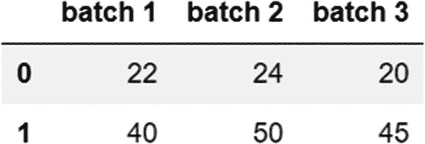

# 六、使用 Pandas 准备你的数据

随着互联网、社交网络、移动设备和大数据的爆炸式增长，可用的数据量非常庞大。管理和分析这些数据以得出有意义的推论可以推动决策制定、提高生产率和降低成本。在前一章中，你学习了 NumPy——帮助我们处理数组和执行计算的库，也是我们在本章中讨论的 Pandas 库的主干。Pandas 是用于处理数据的 Python 库，其优势在于它是一个强大的工具，具有许多操纵数据的能力。

Python 作为首选编程语言的日益流行与其在数据科学领域的广泛应用密切相关。2019 年在 Python 开发者中进行的一项调查发现，NumPy 和 Pandas 是最受欢迎的数据科学框架(来源: [`https://www.jetbrains.com/lp/python-developers-survey-2019/`](https://www.jetbrains.com/lp/python-developers-survey-2019/) )。

在这一章中，我们将学习 Pandas 的构造块(序列、数据帧和索引)，并了解该库中用于整理、清理、合并和聚合 Pandas 中的数据的各种函数。这一章比你到目前为止读过的其他章节更复杂，因为我们涵盖了广泛的主题，这些主题将帮助你发展准备数据所必需的技能。

## Pandas 一瞥

韦斯·麦金尼在 2008 年开发了 Pandas 图书馆。Pandas 这个名字来自计量经济学中用于分析时间序列数据的术语“面板数据”。Pandas 有许多特性，如下所列，这些特性使它成为数据争论和分析的流行工具。

1.  Pandas 提供了标记数据或索引的特性，这加快了数据的检索。

2.  输入和输出支持:Pandas 提供了从不同文件格式读取数据的选项，如 JSON (JavaScript 对象表示法)、CSV(逗号分隔值)、Excel 和 HDF5(分层数据格式版本 5)。它还可以用于将数据写入数据库、web 服务等。

3.  分析所需的大部分数据并不包含在一个单一的源中，我们经常需要组合数据集来整合分析所需的数据。Pandas 再一次用定制的功能来拯救数据。

4.  速度和增强的性能:Pandas 库基于 Cython，它结合了 Python 的便利性和易用性以及 C 语言的速度。Cython 有助于优化性能和降低开销。

5.  数据可视化:为了从数据中获得洞察力，并使其能够呈现给观众，使用可视化手段查看数据是至关重要的，Pandas 提供了许多内置的可视化工具，使用 Matplotlib 作为基础库。

6.  对其他库的支持:Pandas 可以与其他库顺利集成，如 Numpy、Matplotlib、Scipy 和 Scikit-learn。因此，我们可以结合数据操作执行其他任务，如数值计算、可视化、统计分析和机器学习。

7.  分组:Pandas 提供了对拆分-应用-组合方法的支持，通过这种方法，我们可以将数据分组，对它们应用独立的函数，并组合结果。

8.  处理缺失数据、重复数据和填充字符:数据通常有缺失值、重复数据、空格、特殊字符(如$、&)等，这些可能需要删除或替换。有了 Pandas 提供的功能，您可以轻松处理这种异常情况。

9.  数学运算:许多数字运算和计算可以在 Pandas 中执行，NumPy 在后端用于此目的。

## 技术要求

本章所需的库和外部文件将在下面详细介绍。

**安装库**

如果您还没有安装 Pandas，请进入 Anaconda 提示符并输入以下命令。

```py
>>>pip install pandas

```

一旦安装了 Pandas 库，您需要在使用它的功能之前导入它。在您的 Jupyter 笔记本中，键入以下内容以导入该库。

代码:

```py
import pandas as pd

```

在这里， *pd* 是 Pandas 的一个标准简称或别名。

对于一些例子，我们还使用了 NumPy 库中的函数。确保安装并导入了 Pandas 和 NumPy 库。

**外部文件**

您需要下载一个数据集，`“` [`subset-covid-data.csv`](https://github.com/DataRepo2019/Data-files/blob/master/subset-covid-data.csv) ，其中包含了在特定日期各个国家与新冠肺炎疫情相关的病例和死亡人数的数据。请使用以下链接下载数据集: [`https://github.com/DataRepo2019/Data-files/blob/master/subset-covid-data.csv`](https://github.com/DataRepo2019/Data-files/blob/master/subset-covid-data.csv)

## Pandas 的积木

系列和 DataFrame 对象是 Pandas 中的底层数据结构。简而言之，一个系列就像一个列(只有一个维度)，一个数据帧(有两个维度)就像一个有行和列的表格或电子表格。存储在序列或数据帧中的每个值都附有一个标签或索引，这加快了数据的检索和访问。在本节中，我们将学习如何创建系列和数据框架，以及用于操作这些对象的函数。

**创建系列对象**

序列是一维对象，具有一组值及其关联的索引。表 [6-1](#Tab1) 列出了创建系列的不同方式。

表 6-1

创建系列对象的各种方法

<colgroup><col class="tcol1 align-left"> <col class="tcol2 align-left"></colgroup> 
| 

方法

 | 

句法

 |
| --- | --- |
| 使用标量值 | 代码(用于使用标量值创建序列):`pd.Series(2)``#Creating a simple series with just one value. Here, 0 is the index label, and 2 is the value the Series object contains.`输出:`0    2``dtype: int64` |
| 使用列表 | 代码(用于使用列表创建系列):`pd.Series([2]*5)``#Creating a series by enclosing a single value (2) in a list and replicating it 5 times. 0,1,2,3,4 are the autogenerated index labels.`输出:`0    2``1    2``2    2``3    2``4    2``dtype: int64` |
| 在字符串中使用字符 | 代码(用于使用字符串创建序列):`pd.Series(list('hello'))``#Creating a series by using each character in the string "hello" as a separate value in the Series.` |
|   | 输出:`0    h``1    e``2    l``3    l``4    o``dtype: object` |
| 使用字典 | 代码(用于从字典创建序列):`pd.Series({1:'India',2:'Japan',3:'Singapore'})`#键/值对对应于 Series 对象中的索引标签和值。输出:`1        India``2        Japan``3    Singapore``dtype: object` |
| 使用范围 | 代码(用于根据范围创建系列):`pd.Series(np.arange(1,5))``#Using the NumPy arrange function to create a series from a range of 4 numbers (1-4), ensure that the NumPy library is also imported`输出:`0    1``1    2``2    3``3    4``dtype: int32` |
| 使用随机数 | 代码(用于从随机数创建序列):`pd.Series(np.random.normal(size=4))``#Creating a set of 4 random numbers using the np.random.normal function`输出:`0   -1.356631``1    1.308935``2   -1.247753``3   -1.408781``dtype: float64` |
| 创建带有自定义索引标签的序列 | 代码(用于创建自定义索引):`pd.Series([2,0,1,6],index=['a','b','c','d'])``#The list [2,0,1,6] specifies the values in the series, and the list for the index['a','b','c','d'] specifies the index labels`输出:`a    2``b    0``c    1``d    6``dtype: int64` |

总之，您可以从单个(标量)值、列表、字典、一组随机数或一系列数字中创建一个 Series 对象。 *pd。Series* 函数创建一个 Series 对象(注意“Series”中的字母“S”是大写的；pd.series 就不行了)。如果要自定义索引，请使用 index 参数。

## 检查系列的属性

在这一节中，我们将研究用于找出关于 Series 对象的更多信息的方法，例如元素的数量、值和唯一元素。

**找出一个数列中元素的个数**

有三种方法可以找到一个系列包含的元素数量:使用*大小*参数、*长度*函数或*形状*参数

*size* 属性和 *len* 函数返回一个值——序列的长度，如下所示。

代码:

```py
#series definition
x=pd.Series(np.arange(1,10))
#using the size attribute
x.size

```

输出:

```py
9

```

我们还可以使用 *len* 函数来计算元素的数量，这将返回相同的输出(9)，如下所示。

代码:

```py
len(x)

```

*shape* 属性返回一个包含行数和列数的元组。因为 Series 对象是一维的，所以 shape 属性只返回行数，如下所示。

代码:

```py
x.shape

```

输出:

```py
(9,)

```

**列出系列中各个元素的值**

*值*属性返回一个 NumPy 数组，其中包含序列中每一项的值。

代码:

```py
x.values

```

输出:

```py
array([1, 2, 3, 4, 5, 6, 7, 8, 9])

```

**访问系列的索引**

可以通过索引属性*访问系列的索引。*索引是具有数据类型和一组值的对象。索引对象的默认类型是 *RangeIndex* 。

代码:

```py
x.index

```

输出:

```py
RangeIndex(start=0, stop=9, step=1)

```

索引标签形成了一个数字范围，从 0 开始。默认步长或一个索引标签值与下一个索引标签值之差为 1。

**获取序列中的唯一值及其计数**

*value_counts()* 方法是一个重要的方法。当与 Series 对象一起使用时，它显示该对象中包含的唯一值以及每个唯一值的计数。将这种方法与分类变量一起使用是一种常见的做法，以了解它包含的不同值。

代码:

```py
z=pd.Series(['a','b','a','c','d','b'])
z.value_counts()

```

输出:

```py
a    2
b    2
c    1
d    1
dtype: int64

```

前面的输出显示，在名为“z”的 Series 对象中，值“a”和“b”出现了两次，而字符“c”和“d”出现了一次。

**系列的方法链接**

我们可以将多种方法应用于一个系列，并连续应用。这称为方法链接，可应用于 Series 和 DataFrame 对象。

示例:

假设我们想找出值“a”和“b”在下面定义的序列“z”中出现的次数。我们可以通过链接将 *value_counts* 方法和 *head* 方法结合起来。

代码:

```py
z=pd.Series(['a','b','a','c','d','b'])
z.value_counts().head(2)

```

输出:

```py
a    2
b    2
dtype: int64

```

如果多个方法需要一起更改并应用于一个 Series 对象，最好在单独的一行中提到每个方法，每行以反斜杠结束。这将使代码更具可读性，如下所示。

代码:

```py
z.value_counts()\
.head(2)\
.values
Output:
array([2, 2], dtype=int64)

```

我们已经介绍了用于 Series 对象的基本方法。如果您想了解有关 Series 对象和 Series 对象使用的方法的更多信息，请参考以下链接。

[T2`https://pandas.pydata.org/pandas-docs/stable/reference/api/pandas.Series.html`](https://pandas.pydata.org/pandas-docs/stable/reference/api/pandas.Series.html)

我们现在把 ovn 移到 DataFrames，另一个重要的 Pandas 对象。

## 数据帧

数据帧是系列的扩展。它是用于存储数据的二维数据结构。Series 对象包含两个组件一组值和附加到这些值上的索引标签 DataFrame 对象包含三个组件一列对象、索引对象和包含这些值的 NumPy 数组对象。

索引和列统称为轴。索引构成轴“0 ”,列构成轴“1”。

我们在表 [6-2](#Tab2) 中查看创建数据帧的各种方法。

表 6-2

创建数据帧的不同方法

<colgroup><col class="tcol1 align-left"> <col class="tcol2 align-center"></colgroup> 
| 

方法

 | 

句法

 |
| --- | --- |
| 通过组合系列对象 | 代码:`student_ages=pd.Series([22,24,20]) #series 1``teacher_ages=pd.Series([40,50,45])#series 2``combined_ages=pd.DataFrame([student_ages,teacher_ages]) #DataFrame``combined_ages.columns=['class 1','class 2','class 3']#naming columns``combined_ages`输出:这里，我们定义两个系列，然后使用 *pd。DataFrame* 函数创建一个名为“combined_ages”的新数据帧。我们在单独的步骤中给列命名。 |
| 从字典上 | 代码:`combined_ages=pd.DataFrame({'class 1':[22,40],'class 2':[24,50],'class 3':[20,45]})``combined_ages`输出:字典作为参数传递给 *pd。DataFrame* 函数(列名构成键，每列中的值包含在一个列表中)。 |
| 从 numpy 数组 | 代码:`numerical_df=pd.DataFrame(np.arange(1,9).reshape(2,4))``numerical_df`输出:这里，我们首先使用 *np.arange* 函数创建一个 NumPy 数组。然后我们将这个数组改造成一个两行四列的数据帧。 |
| 使用一组元组 | 代码:`combined_ages=pd.DataFrame([(22,24,20),(40,50,45)],columns=['class 1','class 2','class 3'])``combined_ages`输出:我们使用一组元组重新创建了“组合年龄”数据帧。每个元组相当于数据帧中的一行。 |

综上所述，我们可以使用一个字典，一组元组，通过组合系列对象来创建一个 DataFrame。这些方法都使用 *pd。数据帧*功能。注意，这个方法中的字符“D”和“F”都是大写的；pd.dataframe 不起作用。

### 通过从其他格式导入数据来创建数据框架

Pandas 可以使用它的阅读器功能从各种各样的格式中读取数据(参见这里支持的格式的完整列表: [`https://pandas.pydata.org/pandas-docs/stable/user_guide/io.html`](https://pandas.pydata.org/pandas-docs/stable/user_guide/io.html) )。以下是一些常用的格式。

#### 从 CSV 文件:

*read_csv* 函数可用于将 csv 文件中的数据读入数据帧，如下所示。

代码:

```py
titanic=pd.read_csv('titanic.csv')

```

从 CSV 文件中读取数据是创建数据帧最常用的方法之一。CSV 文件是用于存储和检索值的逗号分隔文件，其中每行相当于一行。在调用“read_csv”功能之前，记得使用 Jupyter 主页上的上传按钮在 Jupyter 中上传 CSV 文件(图 [6-1](#Fig1) )。


图 6-1

Jupyter 文件上传

#### 从 Excel 文件:

Pandas 支持使用 *pd.read_excel* 函数从 xls 和 xlsx 文件格式导入数据，如下所示。

代码:

```py
titanic_excel=pd.read_excel('titanic.xls')

```

#### 从 JSON 文件:

JSON 代表 JavaScript Object Notation，是一种跨平台的文件格式，用于在客户机和服务器之间传输和交换数据。Pandas 提供了函数 *read_json* 从 json 文件中读取数据，如下所示。

代码:

```py
titanic=pd.read_json('titanic-json.json')

```

#### 从 HTML 文件:

我们还可以使用 *pd.read_html* 函数从 web 页面导入数据。

在下面的示例中，该函数将网页上的表解析为 DataFrame 对象。这个函数返回一个 DataFrame 对象的列表，这些对象对应于网页上的表格。在下面的例子中，table[0]对应于提到的 URL 上的第一个表。

代码:

```py
url="https://www.w3schools.com/sql/sql_create_table.asp"
table=pd.read_html(url)
table[0]

```

输出:


延伸阅读:查看 Pandas 中支持的格式的完整列表以及从这些格式中读取数据的函数:

[T2`https://pandas.pydata.org/pandas-docs/stable/reference/io.html`](https://pandas.pydata.org/pandas-docs/stable/reference/io.html)

### 访问数据帧中的属性

在本节中，我们将了解如何访问 DataFrame 对象中的属性。

我们使用以下数据框架:

代码:

```py
combined_ages=pd.DataFrame({'class 1':[22,40],'class 2':[24,50],'class 3':[20,45]})

```

**属性**

当与 DataFrame 对象一起使用时，index 属性给出索引对象的类型及其值。

代码:

```py
combined_ages.index

```

输出:

```py
RangeIndex(start=0, stop=2, step=1)

```

columns 属性提供关于列的信息(它们的名称和数据类型)。

代码:

```py
combined_ages.columns

```

输出:

```py
Index(['class 1', 'class 2', 'class 3'], dtype="object")

```

索引对象和列对象都是索引对象的类型。index 对象的类型为 *RangeIndex* ，columns 对象的类型为“Index”。index 对象的值充当行标签，而 column 对象的值充当列标签。

#### 访问数据帧中的值

使用 values 属性，您可以获得存储在 DataFrame 中的数据。如您所见，输出是一个包含值的数组。

代码:

```py
combined_ages.values

```

输出:

```py
array([[22, 24, 20],
       [40, 50, 45]], dtype=int64)

```

### 修改数据框架对象

在这一节中，我们将学习如何更改列名以及添加和删除列和行。

#### 重命名列

可以使用 *rename* 方法更改列名。字典作为参数传递给此方法。这个字典的键是旧的列名，值是新的列名。

代码:

```py
combined_ages.rename(columns={'class 1':'batch 1','class 2':'batch 2','class 3':'batch 3'},inplace=True)
combined_ages

```

输出:



我们使用 *inplace* 参数的原因是为了在实际的 DataFrame 对象中进行更改。

重命名也可以通过直接访问 columns 属性并在数组中提到新的列名来完成，如下例所示。

代码:

```py
combined_ages.columns=['batch 1','batch 2','batch 3']

```

使用 dictionary 格式重命名是重命名列的一种更直接的方法，并且对原始 DataFrame 对象进行更改。这种方法的缺点是需要记住数据帧中各列的顺序。当我们使用 *rename* 方法时，我们使用了一个字典，其中我们知道我们正在更改哪些列名。

#### 替换数据帧中的值或观察值

*replace* 方法可用于替换数据帧中的值。我们可以再次使用字典格式，用键/值对表示旧值和新值。这里，我们用值 33 替换值 22。

代码:

```py
combined_ages.replace({22:33})

```

输出:


#### 向数据框架添加新列

在数据帧中插入新列有四种方法，如表 [6-3](#Tab3) 所示。

表 6-3

向数据框架添加新列

<colgroup><col class="tcol1 align-left"> <col class="tcol2 align-center"></colgroup> 
| 

列插入方法

 | 

句法

 |
| --- | --- |
| 使用索引运算符，[ ] | 代码:`combined_ages['class 4']=[18,40]``combined_ages`输出:通过在索引操作符中以字符串的形式提到列名并给它赋值，我们可以添加一个列。 |
| 使用*插入*的方法 | 代码:`combined_ages.insert(2,'class 0',[18,35])``combined_ages`输出:*insert* 方法可用于添加列。需要向该方法传递三个参数，如下所述。第一个参数是要插入新列的索引(在本例中，索引是 2，这意味着新列被添加为 DataFrame 的第三列)第二个参数是要插入的新列的名称(本例中为“class 0”)第三个参数是包含新列值的列表(在本例中是 18 和 35)对于能够成功添加列的 *insert* 方法来说，这三个参数都是必需的。 |
| 使用*位置*步进器 | 代码:`combined_ages.loc[:,'class 4']=[20,40]``combined_ages`输出:*loc* 索引器通常用于从序列和数据帧中检索值，但也可用于插入列。在前面的语句中，所有行都是使用:运算符选择的。该运算符后跟要插入的列的名称。该列的值包含在一个列表中。 |
| 使用*串联*功能 | 代码:`class5=pd.Series([31,48])``combined_ages=pd.concat([combined_ages,class5],axis=1)``combined_ages`输出:首先，要添加的列(本例中为“class5”)被定义为一个 Series 对象。然后使用 *pd.concat* 函数将其添加到 DataFrame 对象中。该轴需要被称为“1”，因为新数据是沿着列轴添加的。 |

总之，我们可以使用索引操作符、 *loc* 索引器、 *insert* 方法或 *concat* 函数向 DataFrame 添加一列。添加列的最直接、最常用的方法是使用索引运算符[]。

##### 在数据帧中插入行

在数据帧中添加行有两种方法，要么使用 *append* 方法，要么使用 *concat* 函数，如表 [6-4](#Tab4) 所示。

表 6-4

向数据帧添加新行

<colgroup><col class="tcol1 align-left"> <col class="tcol2 align-center"></colgroup> 
| 

行插入方法

 | 

句法

 |
| --- | --- |
| 使用*追加*的方法 | 代码:`combined_ages=combined_ages.append({'class 1':35,'class 2':33,'class 3':21},ignore_index=True)``combined_ages`输出:*append* 方法的参数——需要添加的数据——被定义为一个字典。然后这个字典作为参数传递给 *append* 方法。设置*ignore _ index*=*True*参数可以防止抛出错误。此参数重置索引。在使用 *append* 方法时，我们需要确保使用 *ignore_index* 参数，或者在将序列追加到 DataFrame 之前为其命名。请注意， *append* 方法没有确保更改反映在原始对象中的 *inplace* 参数；因此，我们需要将原始对象设置为指向使用 append 创建的新对象，如前面的代码所示。 |
| 使用 *pd.concat* 函数 | 代码:`new_row=pd.DataFrame([{'class 1':32,'class 2':37,'class 3':41}])``pd.concat([combined_ages,new_row])`输出:*pd.concat* 函数用于添加新行，如前面的语法所示。要添加的新行被定义为 DataFrame 对象。然后调用 *pd.concat* 函数，并将两个数据帧的名称(原始数据帧和定义为数据帧的新行)作为参数传递。 |

总之，我们可以使用 *append* 方法或 *concat* 函数向数据帧添加行。

#### 从数据帧中删除列

有三种方法可以用来从数据帧中删除一列，如表 [6-5](#Tab5) 所示。

表 6-5

从数据帧中删除列

<colgroup><col class="tcol1 align-left"> <col class="tcol2 align-left"></colgroup> 
| 

删除列的方法

 | 

句法

 |
| --- | --- |
| *del* 功能 | 代码:`del combined_ages['class 3']``combined_ages`输出:前面的语句删除最后一列(名为“class 3”)。注意，删除就地发生，即在原始数据帧本身中。 |
| 使用*弹出*的方法 | 代码:`combined_ages.pop('class 2')`输出:`0    24``1    50``Name: class 2, dtype: int64`*pop* 方法就地删除一列，并将删除的列作为 Series 对象返回 |
| 使用下落法 | 代码:`combined_ages.drop(['class 1'],axis=1,inplace=True)``combined_ages`输出:需要删除的列在列表中以字符串的形式出现，然后作为参数传递给 *drop* 方法。由于默认情况下 *drop* 方法删除行(axis=0 ),如果我们想要删除列，我们需要将轴值指定为“1”。与 *del* 函数和 *pop* 方法不同，使用 *drop* 方法的删除不会发生在原始 DataFrame 对象中，因此，我们需要添加 *inplace* 参数。 |

综上所述，我们可以使用 *del* 函数、 *pop* 方法，或者 *drop* 方法从 DataFrame 中删除一列。

#### 从数据帧中删除一行

从数据帧中删除行有两种方法——使用布尔选择或使用 drop 方法，如表 [6-6](#Tab6) 所示。

表 6-6

从数据帧中删除行

<colgroup><col class="tcol1 align-left"> <col class="tcol2 align-center"></colgroup> 
| 

行删除方法

 | 

句法

 |
| --- | --- |
| 使用布尔选择 | 代码:`combined_ages[~(combined_ages.values<50)]`输出:我们使用 NOT 操作符(~)来删除我们不想要的行。这里，我们删除数据帧中小于 50 的所有值。 |
| 使用*下降*的方法 | 代码:`combined_ages.drop(1)`输出:这里，我们删除了第二行，它的行索引为 1。如果要删除多行，我们需要在列表中指定这些行的索引。 |

因此，我们可以使用布尔选择或 drop 方法从数据帧中删除行。由于 drop 方法同时删除行和列，因此可以统一使用。请记住向 drop 方法添加所需的参数。要删除列，需要添加*轴* (=1)参数。为了在原始数据帧中反映变化，需要包含*就地* (=True)参数。

## 索引

索引是 Pandas 的基础，它使得检索和访问数据比其他工具快得多。设置适当的索引以优化性能至关重要。在 NumPy 中，索引是作为不可变(不能修改)数组实现的，并且包含可哈希的对象。可散列对象是可以根据其内容转换为整数值的对象(类似于字典中的映射)。具有不同值的对象将具有不同的哈希值。

Pandas 有两种类型的索引——行索引(垂直的),带有附加到行的标签；列索引，带有每个列的标签(列名)。

现在让我们来探索索引对象——它们的数据类型、属性，以及它们如何加速数据访问。

### 索引对象的类型

索引对象有一种数据类型，下面列出了其中的一些。

*   Index:这是一种通用索引类型；列索引具有这种类型。

*   range index:Pandas 中的默认索引类型(当没有单独定义索引时使用)，实现为一个递增整数的范围。这种索引类型有助于节省内存。

*   Int64Index:包含整数作为标签的索引类型。对于这种索引类型，索引标签不需要等间距，而对于 RangeIndex 类型的索引，这是必需的。

*   Float64Index:包含浮点数(带小数点的数字)作为索引标签。

*   IntervalIndex:包含间隔(例如，两个整数之间的间隔)作为标签。

*   CategoricalIndex:一组有限的值。

*   DateTimeIndex:用于表示日期和时间，就像在时序数据中一样。

*   PeriodIndex:表示像季度、月或年这样的周期。

*   TimedeltaIndex:表示两个时间段或两个日期之间的持续时间。

*   MultiIndex:具有多个级别的层次索引。

延伸阅读:

在此了解更多关于指数类型的信息: [`https://pandas.pydata.org/pandas-docs/stable/reference/api/pandas.Index.html`](https://pandas.pydata.org/pandas-docs/stable/reference/api/pandas.Index.html)

### 创建自定义索引并将列用作索引

创建 Pandas 对象时，会创建一个 RangeIndex 类型的默认索引，如前所述。这种类型的索引的第一个标签值为 0(对应于 Pandas 系列或数据帧的第一项)，第二个标签值为 1，后跟一个间隔为一个整数的算术级数。

我们可以使用 index 参数或属性来设置定制的索引。在我们之前创建的 Series 和 DataFrame 对象中，我们只是为单个项目设置值，在 index 对象没有标签的情况下，使用默认索引(RangeIndex 类型)。

当我们定义一个系列或数据帧时，我们可以使用 index 参数为索引标签提供自定义值。

代码:

```py
periodic_table=pd.DataFrame({'Element':['Hydrogen','Helium','Lithium','Beryllium','Boron']},index=['H','He','Li','Be','B'])

```

输出:


如果我们在创建对象的过程中跳过 index 参数，我们可以使用 index 属性设置标签，如下所示。

代码:

```py
periodic_table.index=['H','He','Li','Be','B']

```

*set_index* 方法可用于使用现有列设置索引，如下所示:

代码:

```py
periodic_table=pd.DataFrame({'Element':['Hydrogen','Helium','Lithium','Beryllium','Boron'],'Symbols':['H','He','Li','Be','B']})
periodic_table.set_index(['Symbols'])

```

输出:


可以使用 reset_index 方法使索引再次成为列或进行重置:

代码:

```py
periodic_table.reset_index()

```

输出:


我们还可以在将数据从外部文件读入数据帧时设置索引，使用 *index_col* 参数，如下所示。

代码:

```py
titanic=pd.read_csv('titanic.csv',index_col='PassengerId')
titanic.head()

```

输出:


### 数据检索的索引和速度

我们知道索引极大地提高了访问数据的速度。让我们借助一个例子来理解这一点。

考虑以下数据帧:

代码:

```py
periodic_table=pd.DataFrame({'Atomic Number':[1,2,3,4,5],'Element':['Hydrogen','Helium','Lithium','Beryllium','Boron'],'Symbol':['H','He','Li','Be','B']})

```

输出:


#### 不使用索引进行搜索

现在，尝试在不使用索引的情况下检索原子序数为 2 的元素，并使用 *timeit* 神奇函数测量检索所需的时间。当不使用索引时，执行线性搜索来检索元素，这相对来说比较耗时。

代码:

```py
%timeit periodic_table[periodic_table['Atomic Number']==2]

```

输出:

```py
1.66 ms ± 99.1 μs per loop (mean ± std. dev. of 7 runs, 1000 loops each)

```

#### 使用索引进行搜索

现在，将“原子序数”列设置为索引，并使用 *loc* 索引器查看现在搜索需要多长时间:

代码:

```py
new_periodic_table=periodic_table.set_index(['Atomic Number'])
%timeit new_periodic_table.loc[2]

```

输出:

```py
281 μs ± 14.4 μs per loop (mean ± std. dev. of 7 runs, 1000 loops each)

```

在不使用索引的情况下，搜索操作的执行时间大约为毫秒级(大约 1.66 毫秒)。通过使用索引，检索操作所需的时间现在是微秒级的(281 μs `)`，这是一个显著的改进。

### 指数的不变性

如前所述，索引对象是不可变的——一旦定义，就不能修改索引对象或其标签。

例如，让我们试着改变我们刚刚定义的周期表数据帧中的一个索引标签，如下所示。我们在输出中得到一个错误，因为我们试图在一个不可变的对象上操作。

代码:

```py
periodic_table.index[2]=0

```

输出:

```py
---------------------------------------------------------------------------
TypeError                                 Traceback (most recent call last)
<ipython-input-24-cd2fece917cb> in <module>
----> 1periodic_table.index[2]=0

~\Anaconda3\lib\site-packages\pandas\core\indexes\base.py in __setitem__(self, key, value)
   3936
   3937def __setitem__(self, key, value):
-> 3938raiseTypeError("Index does not support mutable operations")
   3939
   3940def __getitem__(self, key):

TypeError: Index does not support mutable operations

```

虽然不能更改索引对象的值，但是我们可以使用索引的属性来检索关于索引的信息，比如索引对象中包含的值、是否有空值等等。

让我们通过一些例子来看看一些索引属性:

考虑以下数据帧中的列索引:

代码:

```py
periodic_table=pd.DataFrame({'Element':['Hydrogen','Helium','Lithium','Beryllium','Boron']},index=['H','He','Li','Be','B'])

column_index=periodic_table.columns

```

列索引的一些属性是

1.values 属性:返回列名

代码:

```py
column_index.values

```

输出:

```py
array(['Element'], dtype=object)

```

*2.hasnans* 属性:根据空值的存在返回布尔值 True 或 False。

代码:

```py
column_index.hasnans

```

输出:

```py
False

```

*3.nbytes* 属性:返回内存中占用的字节数

代码:

```py
column_index.nbytes

```

输出:

```py
8

```

延伸阅读:有关属性的完整列表，请参考以下文档: [`https://pandas.pydata.org/pandas-docs/stable/reference/api/pandas.Index.html`](https://pandas.pydata.org/pandas-docs/stable/reference/api/pandas.Index.html)

### 索引对齐

当添加两个 Pandas 对象时，会检查它们的索引标签是否对齐。对于具有匹配索引的项，它们的值被相加或连接。在索引不匹配的情况下，结果对象中对应于该索引的值为空( *np)。南*。

让我们用一个例子来理解这一点。这里，我们看到 s1 中的 0 索引标签在 s2 中没有匹配，s2 中的最后一个索引标签(10)在 s1 中没有匹配。当对象被组合时，这些值等于 null。索引标签对齐的所有其他值相加在一起。

代码:

```py
s1=pd.Series(np.arange(10),index=np.arange(10))
s2=pd.Series(np.arange(10),index=np.arange(1,11))
s1+s2

```

输出:

```py
0      NaN
1      1.0
2      3.0
3      5.0
4      7.0
5      9.0
6     11.0
7     13.0
8     15.0
9     17.0
10     NaN
dtype: float64

```

### 对索引设置操作

我们可以对不同对象的索引执行集合运算，如并集、差集和对称差集。

考虑下面的索引“i1”和“i2”，它们是从我们在上一节中创建的两个 Series 对象(“s1”和“s2”)创建的:

代码:

```py
i1=s1.index
i2=s2.index

```

#### 联合操作

返回两个集合中存在的所有元素。

代码:

```py
i1.union(i2)

```

输出:

```py
Int64Index([0, 1, 2, 3, 4, 5, 6, 7, 8, 9, 10], dtype="int64")

```

#### 差分运算

返回存在于一个集合中但不存在于另一个集合中的元素。

代码:

```py
i1.difference(i2) #elements present in i1 but not in i2

```

输出:

```py
Int64Index([0], dtype="int64")

```

#### 对称差分运算

返回两个集合不共有的元素。此运算不同于差运算，因为它考虑了两个集合中的不常用元素:

代码:

```py
i1.symmetric_difference(i2)

```

输出:

```py
Int64Index([0, 10], dtype="int64")

```

还可以对两个索引对象执行算术运算，如下所示。

代码:

```py
i1-i2

```

输出:

```py
Int64Index([-1, -1, -1, -1, -1, -1, -1, -1, -1, -1], dtype="int64")

```

## Pandas 中的数据类型

Pandas 中使用的数据类型是从 NumPy 派生的，除了定性数据的“category”数据类型，它是在 Pandas 中定义的。常见的数据类型包括

*   对象(用于存储数字、字符串等混合数据。)

*   int64(用于整数值)

*   float64(用于带小数点的数字)

*   日期时间(用于存储日期和时间数据)

*   类别(对于只包含几个不同值的变量，如“真”/“假”，或一些有限的有序类别，如“一”/“二”/“三”/“四”)

### 获取有关数据类型的信息

我们现在了解了如何检索关于列的数据类型的信息。

导入 *subset-covid-data.csv* 文件并将数据读入 DataFrame，如下所示。

代码:

```py
data=pd.read_csv('subset-covid-data.csv')
data.head()

```

输出:


使用 *dtypes* 属性，我们可以获得这个数据帧中列的类型。

代码:

```py
data.dtypes

```

输出:

```py
country          object
continent        object
date             object
day               int64
month             int64
year              int64
cases             int64
deaths            int64
country_code     object
population      float64
dtype: object

```

正如我们在前一章所讨论的，对于分类变量和连续变量，可以使用的数学运算和图形的种类是不同的。了解列的数据类型有助于我们理解如何分析变量。数据类型为“object”或“category”的列是分类变量，而数据类型为“int64”和“float64”的变量是连续的。

#### 获取每种数据类型的计数

为了获得属于每种数据类型的列数，我们使用了 *get_dtype_counts* 方法:

代码:

```py
data.get_dtype_counts()

```

输出:

```py
float64    1
int64      5
object     4
dtype: int64

```

#### 选择特定的数据类型

使用 *select_dtypes* 方法，我们可以根据您想要选择的数据类型来过滤列:

代码:

```py
data.select_dtypes(include='number').head()
#This will select all columns that have integer and floating-point data and exclude the rest. The head parameter has been used to limit the number of records being displayed.

```

输出:


#### 计算内存使用量和更改列的数据类型

我们可以通过使用 *memory_usage* 方法找到一个系列或一个数据帧的内存使用量(以字节为单位)。在使用这种方法时，我们包括了*深度*参数，以获得系统级内存使用的更全面的描述。

代码:

```py
data['continent'].memory_usage(deep=True)

```

输出:

```py
13030

```

让我们看看是否可以减少本专栏的内存使用。首先，让我们找到它当前的数据类型。

代码:

```py
data['continent'].dtype

```

输出:

```py
dtype('O')

```

我们可以看到，这一列占用了 13030 字节的内存，数据类型为“O”。Pandas 分类数据类型对于存储只有几个唯一值的定性变量很有用，因为这样可以减少内存使用。由于大陆列只有几个唯一的值(“欧洲”、“亚洲”、“美洲”、“非洲”、“大洋洲”)，让我们将该列的数据类型从*对象*更改为*分类*，看看这是否会减少内存使用。我们使用 *astype* 方法来改变数据类型。

代码:

```py
data['continent']=data['continent'].astype('category')
data['continent'].memory_usage(deep=True)

```

输出:

```py
823

```

更改数据类型后，内存使用量似乎减少了不少。让我们计算一下确切的减少百分比。

代码:

```py
(13030-823)/13030

```

输出:

```py
0.936838066001535

```

通过将数据类型从 object 改为 categorical，内存使用量显著减少了约 93%。

## 数据子集的索引和选择

在 Pandas 中，有许多选择和访问数据的方法，如下所列。

*   *loc* 和 *iloc* 分度器

*   *ix* 步进器

*   *at* 和 *iat* 索引器

*   索引运算符[]

数据检索的首选方法是使用 *loc* 和 *iloc* 索引器。索引器和索引运算符都支持使用索引来访问对象。请注意，索引器不同于索引运算符，后者是一对包含索引的方括号。虽然我们使用了索引操作符[]，用于从列表、元组和 NumPy 等对象中选择数据，但不建议使用此操作符。

例如，如果我们想要选择 Pandas 中的第一行，我们将使用下面给出的第一条语句。

代码:

```py
data.iloc[0] #correct
data[0] #incorrect

```

### 了解 loc 和 iloc 索引器

**loc 索引器**通过使用索引标签选择数据来工作，这类似于 Python 中在字典中选择数据的方式，使用与值相关联的键。

另一方面， **iloc 索引器** **，**使用整数位置选择数据，这类似于列表和数组中的单个元素。

注意 *loc* 和 *iloc* 是索引器，后面是方括号，而不是圆括号(就像函数或方法的情况)。逗号前的索引值是指行索引，逗号后的索引值是指列索引。

让我们考虑一些例子来理解 *loc* 和 *iloc* 索引器是如何工作的。对于这些示例，我们再次使用新冠肺炎数据集(“subset-covid-data.csv”)。

代码:

```py
data=pd.read_csv('subset-covid-data.csv',index_col='date')

```

这里，我们使用“日期”列作为索引。

#### 选择连续的行

为此，我们可以使用 *iloc* ，因为我们知道要检索的行的索引(前五行):

代码:

```py
data.iloc[0:5]

```

输出:


请注意，我们只提到了行索引，在没有列索引的情况下，默认情况下会选择所有列。

#### 选择连续的列

我们可以为此使用 *iloc* ，因为前三列的索引值(0，1，2)是已知的。

代码:

```py
data.iloc[:,:3]

```

或者

```py
data.iloc[:,0:3]

```

输出(仅显示前五行)


虽然我们可以跳过列索引，但不能跳过行索引。

以下语法不起作用:

代码:

```py
data.iloc[,0:3] #incorrect

```

在本例中，我们选择了所有的行和三列。在冒号(:)符号的两边，我们有一个开始值和一个结束值。如果起始值和终止值都缺失，则意味着要选择所有值。如果缺少起始索引，则假定默认值为 0。如果缺少停止索引值，则采用索引的最后一个可能的位置值(1 减去列数或行数)。

#### 选择单个行

让我们使用 *iloc* 步进器选择第 100 行。第 100 行的索引为 99(因为索引编号从 0 开始)。

代码:

```py
data.iloc[99]

```

输出:

```py
country             Jamaica
continent           America
day                      12
month                     4
year                   2020
cases                     4
deaths                    0
country_code            JAM
population      2.93486e+06
Name: 2020-04-12, dtype: object

```

#### 使用索引标签选择行

选择日期为 2020-04-12 的行。这里，我们使用 loc 索引器，因为我们知道需要选择的行的索引标签，但不知道它们的位置。

```py
data.loc['2020-04-12']

```

输出(仅显示前五行):


#### 使用名称选择列

让我们选择名为“cases”的列。由于列名充当其索引标签，因此我们可以使用 loc 索引器。

代码:

```py
data.loc[:,'cases']

```

输出:

```py
date
2020-04-12       34
2020-04-12       17
2020-04-12       64
2020-04-12       21
2020-04-12        0

```

#### 使用负索引值进行选择

让我们选择前五行和后三列。这里，我们使用负索引来选择最后三列。最后一列的位置索引值为–1，倒数第二列的索引值为–2，依此类推。步长为–1。我们跳过行片的起始值(:5)，因为默认值是 0。

代码:

```py
data.iloc[:5,-1:-4:-1]

```

输出:


#### 选择不连续的行和列

要选择一组不连续的行或列，我们需要将行或列的索引位置或标签包含在一个列表中。在下面的示例中，我们选择第二和第五行，以及第一和第四列。

代码:

```py
data.iloc[[1,5],[0,3]]

```

输出:


### 其他(不常用的)数据访问索引器

推荐使用索引器 *loc* 和 *iloc* 从系列和 DataFrame 对象中切片或选择数据子集的原因是，它们有明确的规则来选择数据，要么只通过它们的标签(在 loc 的情况下)，要么通过它们的位置(在 iloc 的情况下)。然而，理解 Pandas 中支持的其他索引器是很重要的，这将在下一节中解释。

#### ix 索引器

*ix* 索引器允许我们通过结合索引标签和位置来选择数据。这种选择方法与 *loc* 和 *iloc* 分度器使用的方法形成对比，它们不允许我们混淆位置和标签。由于 *ix* 索引器没有明确的规则来选择数据，因此存在很多歧义，并且该索引器现在已被弃用(这意味着尽管它仍受支持，但不应使用)。出于演示的目的，让我们看看 ix 索引器是如何工作的。让我们选择数据集中“cases”列的前五行。

代码:

```py
data.ix[:5,'cases']

```

输出:

```py
 C:\Users\RA\Anaconda3\lib\site-packages\ipykernel_launcher.py:1: DeprecationWarning:
.ix is deprecated. Please use
.loc for label based indexing or
.iloc for positional indexing

See the documentation here:
http://pandas.pydata.org/pandas-docs/stable/indexing.html#ix-indexer-is-deprecated
  """Entry point for launching an IPython kernel.

date
2020-04-12    34
2020-04-12    17
2020-04-12    64
2020-04-12    21
2020-04-12     0
Name: cases, dtype: int64

```

请注意，使用 ix 指示符会导致警告，要求用户使用 loc 或 iloc 来代替它。

#### 索引运算符- [ ]

即使索引操作符不是 Pandas 中数据选择或切片的首选模式，它仍然有其用途。该运算符的一个适当应用是从数据帧中选择列。参数是以字符串形式出现的列的名称(用引号括起来)。

例如，下面的语句将从我们的 COVID 数据集中选择 population 列。

代码:

```py
data['population']

```

输出(仅显示前五行):

```py
date
2020-04-12     37172386.0
2020-04-12      2866376.0
2020-04-12     42228429.0
2020-04-12        77006.0
2020-04-12     30809762.0

```

为了选择多个列，我们在列表中将列名作为字符串传递，如下面的示例所示:

代码:

```py
data[['country','population']]

```

输出(截断):


索引运算符也可用于选择一组连续的行。

代码:

```py
data[:3]

```

输出:


但是，它不能用于选择一系列不连续的行，因为这将引发错误。以下语句将不起作用。

代码:

```py
data[[3,5]] #incorrect

```

索引运算符的另一个限制是它不能用于同时选择行和列。下面的语句也不起作用。

代码:

```py
data[:,3] #incorrect

```

#### at 和 iat 索引器

还有另外两个不太常用的索引器——*at*(类似于 *loc* ，与标签一起工作)和 *iat* (类似于 *iloc* ，与仓位一起工作)。 *at* 和 *iat* 分度器的三个主要特征是

*   它们只能用于从系列或数据帧中选择标量(单个)值。

*   行索引和列索引都需要作为参数提供给这些索引器，因为它们返回单个值。我们不能用这个索引器获得一组行或列，而用其他索引器是可能的。

*   这些索引器在检索数据时比 loc 和 iloc 更快。

让我们借助一个例子来理解这些索引器是如何工作的。

导入 subset-covid-data.csv 数据集。

```py
data=pd.read_csv('subset-covid-data.csv')

```

处的*索引器的工作方式类似于 loc，您需要将行索引标签和列名作为参数传递。*

让我们尝试检索第一行中的人口值。由于我们没有为此数据帧设置索引，索引标签和位置将是相同的。

代码:

```py
data.at[0,'population']
#0 is the index label as well as the position

```

输出:

```py
37172386.0

```

*iat* 索引器类似于 *iloc* 索引器，行/列索引作为参数传递。

代码:

```py
data.iat[0,9]
#0,9 is the position of the first record of the population column

```

输出与前一条语句的输出相同。

### 用于选择数据子集的布尔索引

在前面的例子中，我们使用了各种索引器来根据位置或标签检索数据。使用布尔索引，我们使用条件语句根据它们的值过滤数据。可以指定单个条件，也可以使用按位运算符- & (and)、| (or)、~ (not)组合多个条件。

让我们考虑一个例子来理解这一点。在这里，我们选择了所有洲名为“亚洲”，国名以字母“C”开头的记录。

代码:

```py
data[(data['continent']=='Asia') & (data['country'].str.startswith('C'))]

```

输出:


### 使用查询方法检索数据

虽然我们像前面的例子一样组合了多个条件，但是代码的可读性可能会受到影响。在这种情况下可以使用*查询*方法。

让我们检索大陆名称为“亚洲”且病例数高于 500 的所有记录。注意语法，我们用双引号将每个条件括起来，并使用逻辑运算符*和*，而不是位运算符&。

代码:

```py
data.query("(continent=='Asia')""and (cases>=500)")

```

输出:


#### 进一步阅读

查看更多信息:

*   查询方式: [`https://pandas.pydata.org/pandas-docs/stable/reference/api/pandas.DataFrame.query.html`](https://pandas.pydata.org/pandas-docs/stable/reference/api/pandas.DataFrame.query.html)

*   Pandas 索引: [`https://pandas.pydata.org/docs/user_guide/indexing.html`](https://pandas.pydata.org/docs/user_guide/indexing.html)

## Pandas 中的操作员

Pandas 使用以下操作符，这些操作符可以应用于整个系列。虽然 Python 需要一个循环来遍历列表或字典中的每个元素，但 Pandas 利用了 NumPy 中实现的矢量化特性，该特性使这些操作符能够应用于序列中的每个元素，从而消除了对迭代和循环的需要。不同类型的操作器在表 [6-7](#Taba) 中列出。

表 6-7

Pandas 运营商

<colgroup><col class="tcol1 align-left"> <col class="tcol2 align-left"></colgroup> 
| 

**操作员类型**

 | 

**操作员包括**

 |
| --- | --- |
| 算术运算符 | +加法)、-(减法)、*(乘法)、**(乘方)、%(余数运算符)、/(除法)、//(地板除法，用于得到商)。算术运算符执行的函数可以使用以下方法复制:add for +，sub for -，mul for *，div for /，mod for %，pow for **。 |
| 比较运算符 | ==(等于)，(大于)，<=(less than or equal to),> =(大于等于)，！=(不等于) |
| 逻辑运算符 | &,&#124;,~.Pandas 和 NumPy 一样，使用位操作符(&、&#124;、~)作为逻辑操作符，因为这些操作符对一个序列中的每个元素进行操作。注意，这些操作符不同于 Python 中使用的逻辑操作符，在 Python 中使用了关键字*和*、*或*和*而不是*。 |

## 用 Pandas 来表示日期和时间

在 Pandas 中，有一个时间戳函数可以用来定义日期、时间或者日期和时间的组合。这与 Python 中的实现形成对比，Python 中的实现需要单独的对象来定义日期或时间。 *pd。时间戳*函数相当于 Python 中的以下函数: *datetime.date* 、 *datetime.time* 、 *datetime.datetime.*

举个例子，让我们用 *pd 来表示 Pandas 中的日期 2000 年 12 月 25 日<sup>到</sup>。时间戳*功能。

代码:

```py
pd.Timestamp('25/12/2000')

```

输出:

```py
Timestamp('2000-12-25 00:00:00')

```

*时间戳*函数非常灵活，接受各种格式的参数。还可以使用以下任何语句复制前面的输出。

```py
#different input formats for creating a Timestamp object

pd.Timestamp('25 December 2000')

pd.Timestamp('December 25 2000')

pd.Timestamp('12/25/2000')

pd.Timestamp('25-12-2000')

pd.Timestamp(year=2000,month=12,day=25)

pd.Timestamp('25-12-2000 12 PM')

pd.Timestamp('25-12-2000 0:0.0')

```

*pd。Timestamp* 函数帮助我们定义日期、时间以及这两者的组合。但是，如果我们需要定义一个持续时间，这个函数就不起作用了。一个单独的功能， *pd。Timedelta* ，帮助我们创建存储持续时间的对象。这相当于 Python 中的 *datetime.timedelta* 函数。

让我们使用 *Timedelta* 函数来定义 Pandas 的持续时间。

代码:

```py
pd.Timedelta('45 days 9 minutes')

```

输出:

```py
Timedelta('45 days 00:09:00')

```

像*时间戳*函数一样，*时间增量*函数在接受什么作为输入参数方面是灵活的。前面的语句也可以写成如下形式。

代码:

```py
pd.Timedelta(days=45,minutes=9)

```

我们还可以添加*单位*参数来创建一个*时间增量*对象。在下面的代码行中，值为“m”的参数单位表示分钟，我们将 00:00:00 小时的基本时间加上 500 分钟。

代码:

```py
pd.Timedelta(500,unit='s')

```

输出:

```py
Timedelta('0 days 08:20:00')

```

### 将字符串转换成 Pandas 时间戳对象

日期一般用字符串表示，需要转换成 Pandas 能理解的类型。函数的作用是:将日期转换成时间戳对象。将它转换成这种格式有助于比较两个日期，给定日期加上或减去持续时间，以及从给定日期提取单个组成部分(如日、月和年)。它还有助于表示不是传统的“日-月-年”或“月-日-年”格式的日期。

让我们考虑一个例子来理解这一点。考虑用字符串“1990 年 4 月 2 日上午 11 点 20 分和 1 日”表示的日期。我们可以将其转换为时间戳对象，并指定格式参数，以便正确解析日、月和年等各个组成部分。 *pd.to_datetime* 函数中的*格式*参数及其格式代码(如%H，%M)有助于指定日期的书写格式。%H 代表小时，%M 代表分钟，%d 代表日，%m 代表月，%Y 代表年。

代码:

```py
a=pd.to_datetime('11:20,02/04/1990', format='%H:%M,%d/%m/%Y')
a

```

输出:

```py
Timestamp('1990-04-02 11:20:00')

```

既然这个日期已经被转换成一个*时间戳*对象，我们就可以对它执行操作了。一个*时间增量*对象可以被添加到一个时间戳对象中。

让我们给这个日期加上四天:

代码:

```py
a+pd.Timedelta(4,unit='d')

```

输出:

```py
Timestamp('1990-04-06 11:20:00')

```

### 提取时间戳对象的组成部分

一旦使用 *pd.to_datetime* 函数将日期转换为 Pandas 时间戳对象，就可以使用相关属性提取日期变量的各个组成部分。

代码:

```py
#extracting the month
a.month

```

输出:

```py
4

```

代码:

```py
#extracting the year
a.year

```

输出:

```py
1990

```

代码:

```py
#extracting the day
a.day

```

输出:

```py
2

```

我们还可以使用分钟和小时属性从日期`.`中提取分钟和小时

#### 进一步阅读

了解更多关于 Pandas 时间戳功能: [`https://pandas.pydata.org/pandas-docs/stable/reference/api/pandas.Timestamp.html`](https://pandas.pydata.org/pandas-docs/stable/reference/api/pandas.Timestamp.html)

## 分组和聚合

聚合是将一组值汇总成单个值的过程。

统计学家哈德利·威克姆(Hadley Wickham)制定了“拆分-应用-组合”方法论(论文可在此处访问: [`https://www.jstatsoft.org/article/view/v040i01/v40i01.pdf`](https://www.jstatsoft.org/article/view/v040i01/v40i01.pdf) )，该方法有三个步骤:

1.  将数据分成更小的组，以便于管理和相互独立。这是在 Pandas 身上用 *groupby* 方法完成的。

2.  对每个组应用函数。我们可以应用任何聚合函数，包括最小值、最大值、中值、平均值、总和、计数、标准差、方差和大小。这些聚合函数中的每一个都计算整个组的聚合值。注意，我们也可以编写一个定制的聚合函数。

3.  将对每个组应用函数后的结果组合成一个组合对象。

在下一节中，我们将查看 *groupby* 方法、聚合函数、*转换*、*过滤器*和*应用*方法，以及 *groupby* 对象的属性。

这里，我们再次使用相同的新冠肺炎数据集，它显示了 2020 年 4 月 12 日<sup>至</sup>所有国家的病例和死亡人数。

代码:

```py
df=pd.read_csv('subset-covid-data.csv')
df.head()

```

输出:


正如我们所看到的，有几个国家属于同一个大陆。让我们找出各大洲的病例和死亡总数。为此，我们需要使用“大陆”列进行分组。

代码:

```py
df.groupby('continent')['cases','deaths'].sum()

```

输出:


这里我们是按“洲”列分组，这就变成了*分组列*。我们正在汇总病例数和死亡数的值，这使得名为“病例”和“死亡”的列成为了*汇总列*。sum 方法成为了我们的*聚合函数*，它计算属于某个大陆的所有国家的病例和死亡总数。每当执行 *groupby* 操作时，建议在一开始就识别这三个元素(分组列、聚合列和聚合函数)。

以下十三个集合函数可以应用于组: *sum()* ， *max()* ， *min()* ， *std()* ， *var()* ， *mean()* ， *count()* ， *size()* ， *sem()* ， *first()* ， *last()* ，

 *我们还可以使用 *agg* 方法，将 *np.sum* 作为属性，产生与前面语句相同的输出:

代码:

```py
df.groupby('continent')['cases','deaths'].agg(np.sum)

```

*agg* 方法可以接受任何聚合方法，比如 mean、sum、max 等等，这些方法在 NumPy 中实现。

我们还可以将聚合列和聚合方法作为字典传递给 *agg* 方法，如下所示，这将再次产生相同的输出。

代码:

```py
df.groupby('continent').agg({'cases':np.sum,'deaths':np.sum})

```

如果有多个分组列，使用列表将列名保存为字符串，并将该列表作为参数传递给 *groupby* 方法。

聚合函数延伸阅读: [`https://pandas.pydata.org/pandas-docs/stable/user_guide/groupby.html#aggregation`](https://pandas.pydata.org/pandas-docs/stable/user_guide/groupby.html%2523aggregation)

### 检查 groupby 对象的属性

应用 *groupby* 方法的结果是一个 groupby 对象。这个 *groupby* 对象有几个属性将在本节中解释。

#### *groupby* 对象的数据类型

可以使用 type 函数访问 groupby 对象的数据类型。

代码:

```py
grouped_continents=df.groupby('continent')
type(grouped_continents)

```

输出:

```py
pandas.core.groupby.generic.DataFrameGroupBy

```

groupby 对象的每个组都是一个单独的数据帧。

#### 获取这些组的名称

*groupby* 对象有一个名为 *groups* 的属性。在 *groupby* 对象上使用这个属性将返回一个字典，这个字典的关键字是组的名称。

代码:

```py
grouped_continents.groups.keys()

```

输出:

```py
dict_keys(['Africa', 'America', 'Asia', 'Europe', 'Oceania', 'Other'])

```

#### 使用第 n 种方法返回每组中位置相同的记录

假设您想要查看属于每个大洲的第四个国家的详细信息。使用第*n*方法，我们可以通过对第四个位置使用位置索引值 3 来检索该数据。

代码:

```py
grouped_continents.nth(3)

```

输出:


#### 使用 get_group 方法获取特定组的所有数据

使用 *get_group* 方法，将组名作为该方法的参数。在本例中，我们检索名为“Europe”的组的所有数据。

代码:

```py
grouped_continents.get_group('Europe')

```

输出(包含 54 条记录；以下仅显示前四条记录):


我们已经看到了如何将聚合函数应用于 groupby 对象。现在让我们看看其他一些函数，如 filter、apply 和 transform，它们也可以用于 groupby 对象。

### 过滤组

*filter* 方法根据特定条件删除或过滤掉组。agg (aggregate)方法为每个组返回一个值，而 filter 方法根据是否满足条件从每个组返回记录。

让我们考虑一个例子来理解这一点。我们要返回平均死亡率大于 40 的大洲的所有行。在 groupby 对象上调用了 *filter* 方法，并且 *filter* 方法的参数是 lambda 函数或预定义函数。这里的 *lambda* 函数计算每个组的平均死亡率，用参数“x”表示。这个参数是一个代表每个组的数据帧(在我们的例子中是大陆)。如果该组满足条件，则返回其所有行。否则，将排除该组的所有行。

代码:

```py
grouped_continents=df.groupby('continent')
grouped_continents.filter(lambda x:x['deaths'].mean()>=40)

```

输出(仅显示前五行):


在输出中，我们看到只返回组(大洲)“America”和“Europe”的行，因为只有这些组满足条件(组平均死亡率大于 40)。

### 转换方法和分组依据

*变换*方法是另一种可以与 *groupby* 对象一起使用的方法，它对组的每个值应用一个函数。它返回一个对象，该对象具有与原始数据框或数据系列相同的行，并且具有相似的索引。

让我们对 population 列使用*转换*方法，通过将该行中的每个值除以 1000000 来获得百万人口。

代码:

```py
grouped_continents['population'].transform(lambda x:x/1000000)

```

输出(仅显示前五行和后两行；实际输出包含 206 行):

```py
0       37.172386
1        2.866376
2       42.228429
3        0.077006
4       30.809762
.
..
...
204     17.351822
205     14.439018
Name: population, Length: 206, dtype: float64

```

注意， *filter* 方法返回的记录比它的输入对象少，而 *transform* 方法返回的记录数量与输入对象相同。

在前面的例子中，我们对一个系列应用了*转换*方法。我们也可以在整个数据帧上使用它。*变换*方法的一个常见应用是用来填充空值。让我们用值 0 填充数据帧中缺少的值。在输出中，请注意国家“安圭拉”的国家代码和人口的值(之前缺失)现在替换为值 0。

代码:

```py
grouped_continents.transform(lambda x:x.fillna(0))

```

输出:


*transform* 方法可用于任何系列或数据帧，而不仅仅是用于 *groupby* 对象。从现有列创建新列是*转换*方法的常见应用。

### 应用方法和分组依据

*apply* 方法将一个函数“应用”到 *groupby* 对象的每一组。apply 和 transform 方法的区别在于 apply 方法更灵活，因为它可以返回任何形状的对象，而 transform 方法需要返回相同形状的对象。

*apply* 方法可以返回单个(标量)值、序列或数据帧，并且输出不必与输入具有相同的结构。此外，当*转换*方法将函数应用于一个组的每一列时，*应用*方法将函数应用于整个组。

让我们使用*应用*方法来计算每个组(洲)中的总缺失值。

代码:

```py
grouped_continents.apply(lambda x:x.isna().sum())

```

输出:


除了 *groupby* 对象之外， *apply* 方法类似于 transform 方法，可用于 Series 和 DataFrame 对象。

## 如何组合 Pandas 中的对象

在 Pandas 中，有各种功能来组合两个或更多的对象，这取决于我们是想水平组合还是垂直组合它们。在本节中，我们将介绍用于组合对象的四种方法- *追加*、*连接*、*串联*和*合并。*

### 添加行的 Append 方法

此方法用于向现有 DataFrame 或 Series 对象添加行，但不能用于添加列。让我们看一个例子:

让我们创建以下数据帧:

代码:

```py
periodic_table=pd.DataFrame({'Atomic Number':[1,2,3,4,5],'Element':['Hydrogen','Helium','Lithium','Beryllium','Boron'],'Symbol':['H','He','Li','Be','B']})

```

我们现在添加一个新行(以 dictionary 对象的形式),将它作为参数传递给 *append* 方法。

我们还需要记住将 *ignore_index* 参数的值设置为 True。将其设置为“True”会用新索引替换旧索引。

代码:

```py
periodic_table.append({'Atomic Number':6,'Element':'Carbon','Symbol':'C'},ignore_index=True)

```

输出:


注意，如果我们在使用 append 函数时跳过 *ignore_index* 参数，我们将得到一个错误，如下所示:

代码:

```py
periodic_table.append({'Atomic Number':6,'Element':'Carbon','Symbol':'C'})

```

输出:


使用 *append* 方法，我们还可以通过将每一行定义为一个 Series 对象并将这些 Series 对象作为一个列表传递给 append 方法来添加多行。*警察局。Series* 方法有一个 name 属性，它将一个索引标签分配给一个系列。

代码:

```py
series1=pd.Series({'Atomic Number':7,'Element':'Carbon','Symbol':'C'},name=len(periodic_table))
series2=pd.Series({'Atomic Number':8,'Element':'Oxygen','Symbol':'O'},name=len(periodic_table)+1)
periodic_table.append([series1, series2])

```

输出:


注意，我们这次没有使用 *ignore_index* 参数，因为我们使用了 *name* 参数(参考之前显示的错误消息，其中提到我们可以在 append 方法中使用 *ignore_index* 参数或 *name* 参数)。使用 *name* 参数可以防止索引重置，当我们包含 *ignore_index* 参数时会发生这种情况。

#### 了解各种类型的连接

在讨论组合 Pandas 对象的其他方法之前，我们需要理解内部、外部、左和右连接的概念。当联接两个对象时，联接的类型决定了这些对象中的哪些记录包含在最终结果集中。

*   左连接:左侧对象中的所有行都包含在组合对象中。包括右侧对象中与左侧对象匹配的行。

*   右连接:组合对象中包含的右侧对象的所有行。包括左侧对象中与左侧匹配的行。

*   外部连接:包含在组合对象中的两个对象的所有行(无论它们是否匹配)。

*   内部联接:只包括两个对象中匹配的行。

### Concat 函数(从其他对象添加行或列)

这个函数为我们提供了向 Pandas 对象添加行和列的选项。默认情况下，它在行轴上工作并添加行。

让我们通过一个例子来看看 *concat* 函数是如何工作的。这里，我们垂直连接两个 DataFrame 对象。第二个 DataFrame 对象被添加到第一个 DataFrame 对象的最后一行之后。

代码:

```py
periodic_table=pd.DataFrame({'Atomic Number':[1,2,3,4,5],'Element':['Hydrogen','Helium','Lithium','Beryllium','Boron'],'Symbol':['H','He','Li','Be','B']})
periodic_table_extended=pd.DataFrame({'Atomic Number':[8,9,10],'Element':['Oxygen','Fluorine','Neon'],'Symbol':['O','F','Ne']})
#Join these two DataFrames just created vertically using the concat function:
pd.concat([periodic_table,periodic_table_extended])

```

输出:


我们还可以沿着列轴并排连接对象，如下所示。

代码:

```py
pd.concat([periodic_table,periodic_table_extended],axis=1)

```

输出:


默认情况下， *concat* 函数执行外部连接，返回两个对象的所有记录。串联的结果集将有五条记录(等于较长对象的长度，即第一个数据帧)。因为第二个 DataFrame 只有三行，所以您可以在最终的连接对象中看到第四行和第五行的 null 值。

我们可以通过添加参数 *join* 将它改为内部连接。通过使用如下所示的内部联接，带有的最终结果集只包含索引匹配的两个对象中的那些记录。

代码:

```py
pd.concat([periodic_table,periodic_table_extended],axis=1,join='inner')

```

输出:


我们可以使用 *keys* 参数来识别最终结果集中被连接的每个对象。

代码:

```py
pd.concat([periodic_table,periodic_table_extended],axis=1,keys=['1st periodic table','2nd periodic table'])

```

输出:


### 连接方法–索引到索引

*join* 方法基于公共索引值对齐两个 Pandas 对象。也就是说，它在两个对象中查找匹配的索引值，然后将它们垂直对齐。此方法的默认连接类型是左连接。

让我们考虑下面的例子，其中我们连接两个对象。

代码:

```py
periodic_table.join(periodic_table_extended,lsuffix='_left',rsuffix='_right')

```

输出:


由于在前面的例子中两个 DataFrame 对象有共同的列名，我们需要使用 *lsuffix* 和 *rsuffix* 参数来区分它们。索引 0、1 和 2 是两个对象共有的。结果集包括第一个数据帧中的所有行，如果第二个数据帧中有索引不匹配的行，则所有这些行中的值都为空(用 NaN 表示)。用于连接方法的默认连接类型是左连接。

### 合并方法–基于公共列的 SQL 类型连接

像*连接*方法一样，*合并*方法也用于水平连接对象。当我们用一个公共的列名连接两个 DataFrame 对象时使用它。 *join* 和 *merge* 方法的主要区别在于 *join* 方法基于公共索引值组合对象，而 *merge* 方法基于公共列名组合对象。另一个区别是 merge 方法中的默认连接类型是内部连接，而 join 方法默认执行对象的左连接。

让我们通过一个例子来看看合并方法是如何工作的。这里定义的两个 DataFrame 对象有一个共同的列名——原子序数。这是一个我们可以应用合并方法的场景。

代码:

```py
periodic_table=pd.DataFrame({'Atomic Number':[1,2,3,4,5],'Element':['Hydrogen','Helium','Lithium','Beryllium','Boron'],'Symbol':['H','He','Li','Be','B']})
periodic_table_extended=pd.DataFrame({'Atomic Number':[1,2,3],'Natural':'Yes'})
periodic_table.merge(periodic_table_extended)

```

输出:


公共列名的存在对于合并操作是必不可少的，否则我们会得到一个错误。如果两个数据帧之间有一个以上的公共列，我们可以使用 on 参数指定要执行合并的列。

我们可以使用 *how* 参数改变默认的连接类型(内部连接)。

代码:

```py
periodic_table.merge(periodic_table_extended,how='outer')

```

输出:


如果我们在被连接的两个对象中有相同的列，但是它们的名称不同，我们可以在 merge 方法中使用参数来区分这些列。

在下面的示例中，有两个值相同但名称不同的列。在第一个 DataFrame 对象中，列的名称是“原子序数”，而在第二个 DataFrame 对象中，列的名称是“数字”。

代码:

```py
periodic_table=pd.DataFrame({'Atomic Number':[1,2,3,4,5],'Element':['Hydrogen','Helium','Lithium','Beryllium','Boron'],'Symbol':['H','He','Li','Be','B']})
periodic_table_extended=pd.DataFrame({'Number':[1,2,3],'Natural':'Yes'})

```

使用左边列的 *left_on* 参数和右边列的 *right_on* 参数，我们合并两个对象如下:

代码:

```py
periodic_table.merge(periodic_table_extended,left_on='Atomic Number',right_on='Number')

```

输出:


注意， *append* 、 *merge* 和 *join* 都是 DataFrame 对象使用的 DataFrame 方法，而 *concat* 是一个 Pandas 函数。

延伸阅读:

合并方法: [`https://pandas.pydata.org/pandas-docs/stable/reference/api/pandas.DataFrame.merge.html`](https://pandas.pydata.org/pandas-docs/stable/reference/api/pandas.DataFrame.merge.html)

加入方式: [`https://pandas.pydata.org/pandas-docs/stable/reference/api/pandas.DataFrame.join.html#pandas.DataFrame.join`](https://pandas.pydata.org/pandas-docs/stable/reference/api/pandas.DataFrame.join.html%2523pandas.DataFrame.join)

串联功能: [`https://pandas.pydata.org/pandas-docs/stable/reference/api/pandas.concat.html`](https://pandas.pydata.org/pandas-docs/stable/reference/api/pandas.concat.html)

追加方式: [`https://pandas.pydata.org/pandas-docs/stable/reference/api/pandas.DataFrame.append.html`](https://pandas.pydata.org/pandas-docs/stable/reference/api/pandas.DataFrame.append.html)

## 重构数据和处理异常

正如我们前面所讨论的，原始状态的数据通常是杂乱的，不适合分析。大多数数据集在适合分析和可视化之前需要大量的处理。下面列出了数据集中最常见的问题。

*   数据缺少值。

*   列名是不可理解的。

*   变量存储在行和列中。

*   一列可以代表多个变量。

*   在一个表中有不同的观察单位。

*   存在数据重复。

*   数据是围绕错误的轴构建的(例如，水平轴而不是垂直轴)。

*   变量是分类的，但是我们需要它们是数字格式的，以便进行计算和可视化。

*   无法正确识别变量的数据类型。

*   数据包含需要删除的空格、逗号、特殊符号等等。

在下面几节中，我们将了解如何处理缺失和重复的数据，如何将数据从宽格式转换为长格式，以及如何使用各种方法，如 *pivot* 、 *stack* 和 *melt* 。

### 处理缺失数据

Pandas 中缺失的数据由值 *NaN* ( *不是数字*)表示，表示为关键字 *np.nan* 。我们可以使用 *isna* 或 *isnull* 方法来查找空值。对于 Series 或 DataFrame 中的每个对象，这两种方法都返回 True(对于缺失值)或 False(对于所有其他值)布尔值。

让我们看看降雨量数据集中有多少空值。

代码:

```py
df=pd.read_csv('subset-covid-data.csv')
df.isna().sum().sum()

```

输出:

```py
8

```

该数据集中有八个空值。 *sum* 方法使用两次。第一个 sum 方法计算每列缺失值的总数，第二个 sum 方法将这些值相加，得出整个数据帧中缺失值的数量。

我们有两种选择来处理这些缺失的数据——要么我们去除这些值(丢弃它们),要么我们用合适的度量(如平均值、中值或众数)来替代这些值，这些度量可以用作缺失值的近似值。让我们来看看每一种方法。

#### 丢弃丢失的数据

*dropna* 方法删除数据帧或系列中所有缺失的值。

代码:

```py
df.dropna()

```

请注意，此方法会创建数据帧的副本，而不会修改原始数据帧。为了修改原始数据帧，我们使用 inplace=True 参数。

代码:

```py
df.dropna(inplace=True)

```

#### 归罪

插补是替换缺失值的过程。在 Pandas 中，可以使用 *fillna* 方法，用均值、中值或众数等集中趋势的度量来替代缺失值。您还可以用固定值或常数值(如 0)来填充缺少的值。

我们可以使用向前填充技术用它之前的值填充丢失的值，或者使用向后填充技术用它之后的值替换空值。

使用相同的数据集(subset-covid-data.csv)，让我们尝试理解向前填充和向后填充的概念。

代码:

```py
data=pd.read_csv('subset-covid-data.csv')
df=data[4:7]
df

```

正如我们所看到的，DataFrame 对象 df(从原始数据集创建)缺少值。


让我们使用向前填充技术( *ffill* )，用国家`安圭拉'的 *NaN* 值替换它前面的值(在前一行中)，如下所示。

代码:

```py
df.fillna(method='ffill')

```

输出:


正如我们所看到的，安圭拉的人口字段被安哥拉的相应值所替代(在它之前的记录)。

我们还可以使用反向填充技术“bfill”来替换丢失的值，该技术用下一行中出现的下一个有效观察值来替换丢失的值。

代码:

```py
df.fillna(method='bfill')

```

输出:


安圭拉缺失的人口数值现在由下一行的相应数值(安提瓜和巴布达)取代。

缺失值插补的标准方法是用其他有效观察值的平均值代替空值。fillna 方法也可以用于此目的。

这里，我们将每列中缺失的值替换为该列中其他两个值的平均值。

代码:

```py
df.fillna(df.mean())

```

输出:


在 DataFrame 对象 df 中，安圭拉缺失的人口数值现在由其他两个国家(安哥拉和安提瓜和巴布达)的人口数字的平均值代替。

插值是估计数字列中缺失值的另一种技术，最直接的插值技术是线性插值方法。在线性插值中，直线方程用于根据已知值估计未知值。如果有两个点，( *x* <sub>0</sub> 、 *y* <sub>0</sub> )和( *x* <sub>1、</sub> *y* <sub>1</sub> )，那么一个未知点(x，y)可以用下面的等式来估计:


在 Pandas 中，有一种*插值*方法，可以从已知值中估计未知值。

代码:

```py
df.interpolate(method='linear')

```

输出:


每列中缺失的值使用该列中的其他值进行插值。

延伸阅读:查看更多关于 Pandas 缺失数据: [`https://pandas.pydata.org/pandas-docs/stable/user_guide/missing_data.html`](https://pandas.pydata.org/pandas-docs/stable/user_guide/missing_data.html)

### 数据复制

由于许多记录包含相同的数据，数据中的冗余是一种常见现象。

让我们考虑以下数据框架:

代码:

```py
periodic_table=pd.DataFrame({'Atomic Number':[1,2,3,4,5,5],'Element':['Hydrogen','Helium','Lithium','Beryllium','Boron','Boron'],'Symbol':['H','He','Li','Be','B','B']})

```


正如我们所看到的，这个数据中有重复项(最后两行是相同的)。

在 Pandas 中，可以使用*重复*方法来检测重复的存在。*复制的*方法为每一行返回一个布尔值，如下所示。因为第五行是第四行的副本，所以布尔值为真。

代码:

```py
periodic_table.duplicated()

```

输出:

```py
0    False
1    False
2    False
3    False
4    False
5     True
dtype: bool

```

通过将此方法与 *sum* 方法链接起来，我们可以找到数据帧中重复项的总数。

代码:

```py
periodic_table.duplicated().sum()

```

输出:

```py
1

```

现在让我们使用 *drop_duplicates* 方法来删除重复项。

代码:

```py
periodic_table.drop_duplicates(inplace=True)

```

输出:


重复的行已被删除。由于 *drop_duplicates* 方法不对实际的 DataFrame 对象进行更改，我们需要使用 *inplace* 参数。

默认情况下， *drop_duplicates* 方法保留所有重复行中的第一行。如果我们想保留最后一行，我们可以使用参数 *keep='last'* ，如下所示。

代码:

```py
periodic_table.drop_duplicates(keep='last')

```

输出:


除了处理冗余或缺失的数据，我们可能需要替换那些对我们的分析没有价值的数据，比如空格或特殊字符。可以使用前面讨论过的 replace 方法来删除或替换值。我们可能还需要更改列的数据类型，因为 Pandas 可能无法正确识别所有的数据类型，这可以使用“astype”方法来完成。

## 整理数据和重组数据的技术

整齐的数据是由哈德利·韦翰发明的一个术语。根据他撰写的一篇论文(链接: [`http://vita.had.co.nz/papers/tidy-data.pdf`](http://vita.had.co.nz/papers/tidy-data.pdf) )，整理数据的三大原则是:

1.  列对应于数据中的变量，每个变量映射到一个列。

2.  这些行只包含观察值，不包含变量。

3.  每个数据结构或表格只包含一个观察单位。

请注意，使数据整洁不同于数据清理。数据清理涉及处理缺失值和冗余信息、删除填充字符以及更改不准确的数据类型。另一方面，将数据转换成整齐的格式需要重新组织数据并沿右轴排列，以便于分析。

让我们用一个例子来理解这一点，使用下面的数据框架。


前面的数据帧显示了四名学生的年龄(以岁为单位)和身高(以厘米为单位)。虽然这些数据是可读的，但不是“整齐”的形式。此数据框架有三个问题违反了数据整洁的原则:

*   学生的姓名不能用作列名。相反，我们需要用一个变量来代表所有的名字。

*   属性“年龄”和“身高”不应用作行中的观察值。它们实际上是独立的变量，应该是单独的列。

*   在同一数据框架中有两种不同的观察单位——测量年龄的年和测量身高的厘米

长格式的数据被认为是整齐的，在下一节中，我们将介绍 Pandas 中把数据集转换成这种结构的方法。

### 从宽到长格式的转换(整齐的数据)

以下是两个数据帧，数据相同，但结构不同(宽和长)。

**宽格式**


**长格式**


转换为长格式的主要好处是，这种格式便于数据操作，如添加或检索数据，因为我们不需要担心数据的结构。此外，当数据以长格式存储时，数据检索明显更快。

让我们用这个例子来理解。

首先，创建以下数据帧:

代码:

```py
grades=pd.DataFrame({'Biology':[90,87,45],'Chemistry':[46,56,87],'Mathematics':[95,74,45],'Physics':[75,65,33]},index=['Andrew','Sarah','Jason'])
grades

```

输出:


在这个数据框架中，我们可以看到整洁数据的原则没有得到遵守。有两个主要变量(学生和科目)没有被标识为列。可变科目(如生物、化学、数学和物理)的值是观察值，不应用作列。

### 堆栈方法(宽到长格式转换)

我们可以使用 stack 方法纠正 grades 数据帧中观察到的异常，该方法获取所有列名并将它们移动到索引中。此方法返回一个新的数据帧或系列，带有多级索引。

代码:

```py
grades_stacked=grades.stack()
grades_stacked

```

输出:

```py
Andrew  Biology        90
        Chemistry      46
        Mathematics    95
        Physics        75
Sarah   Biology        87
        Chemistry      56
        Mathematics    74
        Physics        65
Jason   Biology        45
        Chemistry      87
        Mathematics    45
        Physics        33
dtype: int64

```

如前面的输出所示，该结构已经从宽格式更改为长格式。

让我们检查一下这个堆叠对象的数据类型。

代码:

```py
type(grades_stacked)

```

输出:

```py
pandas.core.series.Series

```

我们可以看到，这是一个系列对象。我们可以使用 *reset_index* 方法将该对象转换为 DataFrame，这样两个变量——Name 和 Subject——可以被标识为两个独立的列:

代码:

```py
grades_stacked.reset_index()

```

输出:


在前面的输出中，我们使用 *rename_axis* 方法更改了列的名称，并重置了索引，如下所示。

代码:

```py
grades_stacked.rename_axis(['student_name','subject']).reset_index(name='marks')

```

输出:


要将此数据帧转换回其原始(宽)格式，我们使用 unstack 方法，如下所示:

代码:

```py
grades_stacked.unstack()

```

输出:


### 熔化方法(宽到长格式转换)

除了*栈*方法之外，*融化*方法也可以用于将数据转换为长格式。*熔化*方法比*堆叠*方法更加灵活，它提供了一个选项来添加定制输出的参数。

让我们创建相同的数据帧(宽格式):

代码:

```py
grades=pd.DataFrame({'Student_Name':['Andrew','Sarah','Jason'],'Biology':[90,87,45],'Chemistry':[46,56,87],'Mathematics':[95,74,45],'Physics':[75,65,33]})

```


现在，使用*熔化*方法将其转换为长格式。

代码:

```py
grades.melt(id_vars='Student_Name',value_vars=['Biology','Chemistry','Physics','Mathematics'],var_name='Subject',value_name='Marks')

```

输出:


我们在熔融法中使用了四个变量:

*   id_vars:我们不想改变形状并保留其当前形式的列。如果我们查看 grades 数据帧的原始宽格式，则 Student_Name 的结构是正确的，并且可以保持原样。

*   value_vars: Variable 或我们要将其整形为单列的变量。在等级数据框架的宽版本中，四个科目中的每一个都有一列。这些实际上是单个列的值。

*   var_name:重新整形后的新列的名称。我们希望创建一个单独的列——“主题”，值为“生物”、“化学”、“物理”和“数学”。

*   value_name:这是列(“标记”)的名称，其中包含的值对应于经过整形的列(“主题”)的值。

### 透视方法(长到宽转换)

*pivot* 方法是另一种重塑数据的方法，但与 *melt* 和 *stack* 方法不同，这种方法将数据转换成宽格式。在下面的例子中，我们用 pivot 方法反转熔化操作的效果。

代码:

```py
#original DataFrame
grades=pd.DataFrame({'Student_Name':['Andrew','Sarah','Jason'],'Biology':[90,87,45],'Chemistry':[46,56,87],'Mathematics':[95,74,45],'Physics':[75,65,33]})
#Converting to long format with the wide method
grades_melted=grades.melt(id_vars='Student_Name',value_vars=['Biology','Chemistry','Physics','Mathematics'],var_name='Subject',value_name='Marks')
#Converting back to wide format with the pivot method
grades_melted.pivot(index='Student_Name',columns='Subject',values='Marks')

```

输出:


以下参数用于 pivot 方法:

*   *索引*:指作为索引使用的列。在年级数据框架的宽格式中，我们使用学生姓名作为索引。

*   *列*:列的名称，其值用于创建一组新的列。“主题”列的每个值在宽格式中形成一个单独的列。

*   *值*:用于填充 DataFrame 中的值的列。在我们的分数例子中,“分数”栏就是用于这个目的的。

延伸阅读:

融化功能: [`https://pandas.pydata.org/pandas-docs/stable/reference/api/pandas.melt.html`](https://pandas.pydata.org/pandas-docs/stable/reference/api/pandas.melt.html)

枢纽功能: [`https://pandas.pydata.org/pandas-docs/stable/reference/api/pandas.pivot.html`](https://pandas.pydata.org/pandas-docs/stable/reference/api/pandas.pivot.html)

## 摘要

1.  Pandas 是一个用于处理数据的 Python 库，它提供了许多优势，包括支持导入数据的各种输入格式、与其他库的集成、速度以及清理、分组、合并和可视化数据的功能。

2.  系列、数据框架和索引构成了 Pandas 的核心。系列是一维的，相当于列，而数据帧是二维的，相当于表格或电子表格。序列和数据帧使用通过哈希表实现的索引来加速数据检索。

3.  有多种方法可以创建和修改 Series 和 DataFrame 对象。Python 对象，如列表、元组和字典，以及 NumPy 数组，可以用来创建 Pandas 对象。我们可以添加和删除行或列，替换值，以及重命名列。

4.  Pandas 中的数据检索可以通过使用位置( *iloc* 索引器)或索引标签( *loc* 索引器)，或者通过指定条件(布尔条件)来完成。

5.  Pandas 使用 *groupby* 函数进行聚合。各种函数可以与 *groupby* 函数结合使用，以计算每个组的聚合度量，根据条件过滤组，转换值，或对它们应用运算。

6.  Pandas 支持组合、连接和合并两个或多个对象。 *append* 方法将一个对象垂直添加到现有对象中， *concat* 函数可以并排或垂直添加对象。 *join* 和 *merge* 方法基于公共列或索引值水平连接对象。

7.  整齐数据是指这样一种结构，其中列对应于数据集中的变量，行包含观察值，并且只有一个观察单位。通常，长(垂直)格式的数据被认为是整齐的。像 melt 和 stack 这样的函数将数据帧转换成长格式。拆分和透视功能将数据转换为宽格式。

既然我们已经学习了如何准备数据并使其为分析做好准备，让我们在下一章看看数据可视化。

## 复习练习

**问题 1**

用 Pandas 为编写函数/索引器/属性

*   从 HTML 文件导入数据

*   将数据导出到 Excel 文件

*   使用索引位置选择数据

*   使用标签选择数据

*   用中值替换空值

*   重命名列

*   获取数据帧中的行数和列数

*   使用 pivot 函数转换为宽格式

*   执行两个表的内部连接

*   更改系列的数据类型

**问题 2**

*df.describe* 函数返回以下汇总统计值:计数、最小值、最大值、标准偏差、百分位数和平均值。

您将添加哪个参数来获得以下结果:唯一值的数量、出现最频繁的值以及该值的频率？

**问题 3**

在数据帧中导入“subset-covid-data.csv”。选择以下数据:

1.  国家和大陆列

2.  将“国家”列设置为索引，并使用 at 或 loc 索引器检索国家“阿尔及利亚”的人口。

3.  使用 iloc 或 iat 索引器选择第 50 <sup>行</sup>和第 3 <sup>列</sup>的值。

4.  检索最后三条记录的国家代码和人口数据。

5.  选择人口超过 250 万且病例数超过 3000 的国家的数据。

**问题 4**

在 DataFrame 中导入文件“subset-covid-data.csv”的数据，并编写以下代码语句:

1.  删除“国家代码”列

2.  将此列插回到它之前所在的位置

3.  删除前三行

4.  将这些行添加回来(在它们的原始位置)

**问题 5**

创建以下数据框架:

```py
DataFrame name: orders_df

```


```py
DataFrame name: orders1_df

```


```py
DataFrame name:customers_df

```


您会使用哪种功能或方法来:

1.  结合前两个 DataFramesorders _ df 和 orders1_df 的细节？

2.  创建一个数据框架来显示客户和他们订购的商品？

3.  是否将 order_id 列作为 orders_df 和 customers_df 的索引？您现在将使用哪种方法来组合这两个对象，以显示客户下了哪些订单？

**问题 6**

下面的数据框记录了四个人的体重波动:


1.  创建前面的数据帧。

2.  把这个数据帧转换成整齐的格式。

3.  确定这四个人中谁的体重波动最小。

4.  对于平均体重低于 65 公斤的人，将他们的体重(所有四天)转换为磅并显示该数据。

问题 7

对象数据类型用于包含以下数据的列:

1.  用线串

2.  数字(int 和 float)

3.  布尔运算

4.  所有前述数据类型的组合

问题 8

可以使用点符号(a.column_name)和索引运算符(a[column_name])来访问列。哪一种是首选的符号，为什么？

问题 9

哪种方法用于获取数据帧中的元数据？

1.  描述方法

2.  数值计数法

3.  信息方法

4.  以上都不是

问题 10(填空)

*   连接方法的默认连接类型是 ____，添加连接类型的参数是 ___

*   合并方法的默认连接类型是 ____，添加连接类型的参数是 ___

*   concat 函数的默认连接类型是 ____，用于添加连接类型的参数是 ___

*   Pandas 中的函数创建了一个表示日期/时间值的对象，并等效于以下 Python 函数:datetime.date、datetime.time 或 datetime.datetime 是 ___

*   Pandas 中表示持续时间的函数相当于 Python 中的 datetime.timedelta 函数，是 ___

**答案**

**问题 1**

*   从 HTML 文件导入数据:

代码:

*   将数据导出到 Excel 文件:

```py
pd.read_html(url)

```

代码:

*   使用索引位置选择数据:

```py
df.to_excel(name_of_file)

```

代码:

*   使用标签选择数据:

```py
df.iloc[index position]

```

代码:

*   用中值替换数据帧中的空值:

```py
df.loc[column name or index label]

```

代码:

*   重命名列:

```py
df.fillna(df.median())

```

*   获取数据帧中的行数和列数:

```py
df.rename(columns={'previous_name:'new_name'})

```

代码:

*   使用*枢轴*功能转换为宽格式:

```py
df.shape

```

代码:

*   执行两个 DataFrame 对象的内部连接

```py
df.pivot(index=column_name1,
columns=column_name2, values=column_name3)

```

代码:

```py
df1.merge(df2)

```

对于*合并*方法，默认的连接类型是*内部*；因此，我们不需要明确提到它。

*   更改系列对象/列的数据类型:

代码:

```py
series_name.astype(new data type)

```

**问题 2**

我们可以使用 include='all '参数获得所有三个值，如下所示:

代码:

```py
df.describe(include='all')

```

**问题 3**

代码:

```py
df=pd.read_csv('subset-covid-data.csv')

```

1.检索国家和大陆列

代码:

```py
df[['country','continent']]

```

2.将“国家”列设置为索引，并使用 at 或 loc 索引器检索国家“阿尔及利亚”的人口。

代码:

```py
df.set_index('country',inplace=True)

```

使用以下语句检索总体:

代码:

```py
df.at['Algeria','population']

```

或者

```py
df.loc['Algeria','population']

```

3.使用 iloc 或 iat 索引器选择第 50 <sup>行</sup>和第 3 <sup>列</sup>的值。

```py
df.iat[49,2]

```

或者

```py
df.iloc[49,2]

```

4.检索最后三条记录的国家代码和人口数据:

代码:

```py
df.iloc[203:,-1:-3:-1]

```

或者

代码:

```py
df.iloc[203:,7:]

```

5.选择人口超过 250 万且病例数超过 3000 的国家的数据。

代码:

```py
df[(df['cases']>=3000) & (df['population']>=25000000)]

```

问题 4(行和列的添加和删除)

1.  删除“国家代码”栏:

    代码:

1.  将此列插回之前的位置:

    代码:

```py
x=df.pop('country_code')

```

1.  删除前三行:

    代码:

```py
df.insert(8,'country_code',x)

```

1.  将这些行添加回数据帧的原始位置:

    CODE:

    ```py
    x=df.iloc[0:3]
    pd.concat([x,df])

    ```

```py
df.drop([0,1,2],inplace=True)

```

问题 5

创建以下数据框架:

代码:

```py
orders_df=pd.DataFrame({'order_id':[1,2,3],'item':['pens','shirts','coffee']})
orders1_df=pd.DataFrame({'order_id':[4,5,6],'item':['crayons','tea','fruits']})
customers_df=pd.DataFrame({'order id':[1,2,3],'customer_name':['anne','ben','carlos']})

```

用于组合对象的函数

*   结合两个数据帧 orders_df 和 orders1_df 的详细信息:

    代码:

*   创建一个组合数据框架，显示客户及其订购的商品:

    代码:

```py
         pd.concat((orders_df,orders1_df))

```

*   将 order_id/order id 列作为“orders_df”和“customers_df”数据帧的索引:

    CODE:

    ```py
    orders_df.set_index('order_id',inplace=True)
    customers_df.set_index('order id',inplace=True)

    ```

    方法来组合这两个对象，以显示客户下了哪些订单:

    代码:

```py
pd.merge(orders_df,customers_df,left_on='order_id',right_on='order id')

```

```py
orders_df.join(customers_df)

```

**问题 6(整理数据和汇总)**

1.  创建此数据框架。

    CODE:

    ```py
    df=pd.DataFrame({'Anna':[51,52,51.4,52.8,50.5],'Ben':[70,70.5,69.1,69.8,70.5],'Carole':[64,64.2,66.8,66,63.4],'Dave':[81,81.3,80.5,80.9,81.4]})

    ```

2.  把这个转换成整齐的格式。

    我们使用 *melt* 方法将数据帧转换为长格式，然后重命名列。

    CODE:

    ```py
    df_melted=df.melt()
    df_melted.columns=['name','weight']

    ```

3.  为了找出这四个人中谁的体重相对于他们的平均体重波动最小，我们需要首先汇总数据。

    我们使用 *groupby* 函数根据人名对数据进行分组，并使用标准差( *np.std* )聚合函数。

    代码:

```py
df_melted.groupby('name').agg({'weight':np.std})

```

输出:


从前面的输出中可以看出，戴夫的标准差最小，因此他的体重波动最小。

1.  对于平均体重低于 65 公斤的人，我们现在需要将他们的体重转换为磅，并显示他们四天的体重。

    我们使用过滤方法过滤出平均重量大于 65 千克的组，然后应用转换方法将重量转换为磅。

    CODE:

    ```py
    df_melted.groupby('name').filter(lambda x:x.mean()>65)['weight'].transform(lambda x:float(x)*2.204)

    ```

**问题 7**

选项 1 和 4

Pandas 中的 object 数据类型用于包含数字、字符串等混合数据的字符串或列。

**问题 8**

首选索引运算符[]，因为它不会与内置方法冲突，并且可以处理包含空格和特殊字符的列名。当您必须检索包含空格的列时，点符号不起作用。

问题 9

选项 3–信息方法。

info 方法用于获取 Series 或 DataFrame 对象的元数据。它为我们提供了列的名称、它们的数据类型、非空值的数量以及内存使用情况。

**第 10 题(填空题)**

连接方法的默认连接类型是"*左连接*，添加连接类型的参数是" *how* 参数

合并方法的默认连接类型是一个*“内部连接”*，添加连接类型的参数是*“如何”*参数

concat 函数的默认连接类型是一个*“外部连接”*，用于添加连接类型的参数是“*连接”*参数

Pandas 中的函数创建了一个表示日期/时间值的对象，相当于以下 Python 函数: *datetime.date* 、 *datetime.time* 或 *datetime.datetime* 为 *pd。时间戳*

Pandas 中与 Python 中的 *datetime.timedelta* 函数等效的用于表示持续时间的函数是 *pd。时间增量**