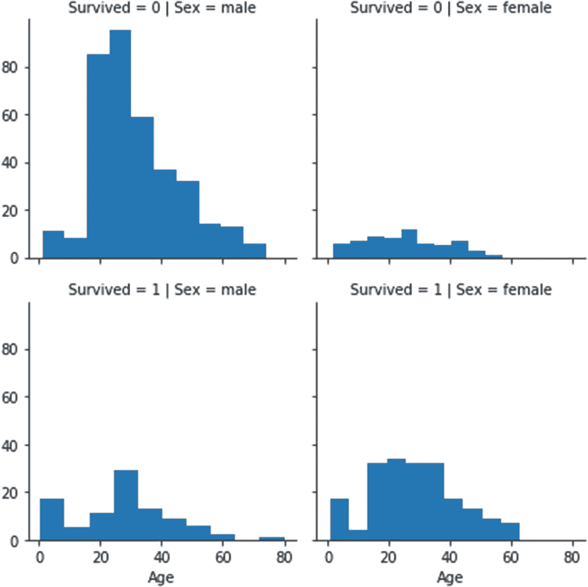

# 七、使用 Python 库实现数据可视化

在最后一章中，我们阅读了关于 Pandas 的内容，这是一个具有各种功能的库，用于准备数据，以便为分析和可视化做好准备。可视化是一种理解数据模式、识别异常值和其他兴趣点，并将我们的发现呈现给外部受众的方法，而无需手动筛选数据。可视化还有助于我们从原始数据中收集信息，并获得难以获得的洞察力。

阅读完本章后，您将能够理解常用的绘图，理解 Matplotlib 中面向对象和有状态的方法并应用这些方法进行可视化，学习如何使用 Pandas 进行绘图，并理解如何使用 Seaborn 创建图形。

## 技术要求

在 Jupyter 笔记本中，键入以下内容以导入以下库。

代码:

```py
import pandas as pd
import seaborn as sns
import matplotlib.pyplot as plt

```

这里， *plt* 是我们用来绘图的 Matplotlib 的 *pyplot* 模块的简称或者别名， *sns* 是 Seaborn 库的别名， *pd* 是 Pandas 的别名。

如果没有安装这些库，请转到 Anaconda 提示符并按如下方式安装它们:

```py
pip install matplotlib
pip install seaborn
pip install pandas

```

### 外部文件

我们在本章中使用 *Titanic* 数据集来演示各种图。

请使用以下链接下载数据集: [`https://github.com/DataRepo2019/Data-files/blob/master/titanic.csv`](https://github.com/DataRepo2019/Data-files/blob/master/titanic.csv)

您也可以使用以下步骤下载该数据集:

*   点击以下链接: [`https://github.com/DataRepo2019/Data-files`](https://github.com/DataRepo2019/Data-files)

*   点击:代码➤下载压缩


*   从下载的 zip 文件夹中，打开“titanic.csv”文件

## 常用地块

在探索性或描述性数据分析中广泛使用的一些基本图包括条形图、饼图、直方图、散点图、箱线图和热图；这些在表 [7-1](#Tab1) 中解释。

表 7-1

描述性数据分析中可视化数据的常用图

<colgroup><col class="tcol1 align-left"> <col class="tcol2 align-left"> <col class="tcol3 align-left"></colgroup> 
| 

图表或绘图的类型

 | 

描述

 | 

形状

 |
| --- | --- | --- |
| 条形图 | 条形图使分类数据可视化，条形的宽度或高度代表每个类别的值。条形图可以垂直或水平显示。 |  |
| 柱状图 | 直方图用于可视化连续变量的分布。它将连续变量的范围划分为多个区间，并显示大部分值所在的位置。 |  |
| 箱线图 | 箱形图有助于直观地描述数据的统计特征。箱形图提供了五点汇总，图中的每条线代表所绘制数据的统计测量值(参见右图)。这五项措施是最小值第 25 个百分位数中位数(第 50 个百分位数)第 75 个百分位数最大值您在右图中看到的小圆圈/点代表异常值(或极端值)。方框两边的两条线分别代表最小值和最大值，也称为“触须”。这些须状物之外的任何点都被称为异常值。框中的中线代表中位数。箱线图通常用于连续(比率/区间)变量，尽管它也可以用于一些分类变量，如顺序变量。 |  |
| 饼图 | 饼图将变量的不同值显示为圆内的扇形。饼图与分类变量一起使用。 |  |
| 散点图 | 散点图将两个连续变量的值显示为 x 轴和 y 轴上的点，帮助我们直观地了解这两个变量是否相关。 |  |
| 热图 | 热图使用颜色编码矩阵显示多个变量之间的相关性，其中颜色饱和度表示变量之间的相关性强度。热图有助于同时显示多个变量。 |  |

现在让我们看看一些用于可视化的 Python 库，从 Matplotlib 开始。

## Matplotlib

Python 中数据可视化的主要库是 Matplotlib。Matplotlib 有许多类似于 Matlab(一种带有绘图工具的计算环境和编程语言)的可视化特性。Matplotlib 主要用于绘制二维图形，对创建三维图形的支持有限。

与其他库(如 Seaborn 和 Pandas)相比，使用 Matplotlib 创建的绘图需要更多的代码行和绘图参数的定制(使用一些默认设置来简化创建绘图的代码编写)。

Matplotlib 构成了使用 Python 执行的大多数可视化的主干。

Matplotlib 中有两个接口，有状态的和面向对象的，在表 [7-2](#Tab2) 中有描述。

表 7-2

Matplotlib 中的接口

<colgroup><col class="tcol1 align-left"> <col class="tcol2 align-left"></colgroup> 
| 

有状态接口

 | 

面向对象的接口

 |
| --- | --- |
| 这个接口使用了基于 Matlab 的 *pyplot* 类。创建此类的单个对象，用于所有绘图目的。 | 在这个界面中，我们为不同的绘图元素使用不同的对象。该界面中用于绘图的两个主要对象是*人物*对象，作为其他对象的容器。*轴*对象，它是包含 x 轴、y 轴、点、线、图例和标签的实际绘图区域。注意，这里的轴不是指 x 和 y 轴，而是指整个子情节。 |
| 代码示例(使用有状态接口的可视化) :`import matplotlib.pyplot as plt``%matplotlib inline``x=[1,2,3,4]``y=[3,6,9,12]``plt.plot(x,y) # The plot function plots a line between the x and y coordinates``plt.xlim(0,5) # Sets limits for the x axis``plt.ylim(0,15) # Sets limits for the y axis` | 代码示例(使用面向对象界面的可视化):`import matplotlib.pyplot as plt``%matplotlib inline``x=[1,2,3,4]``y=[3,6,9,12]``fig,ax=plt.subplots(figsize=(10,5)) #The subplots method creates a tuple returning a figure and one or more axes.``ax.plot(x,y) #Creating a plot with an axes object` |
| `plt.xlabel('X axis') #labels the x axis``plt.ylabel('Y axis') #labels the y axis``plt.title('Basic plot') #Gives a title``plt.suptitle('Figure title',size=20,y=1.02) # Gives a title to the overall figure`定制(使用有状态接口):在此界面中，所有更改都是使用指向图形或轴的 pyplot 对象的当前状态进行的，如下所示。代码示例:`#This code makes changes to the graph created using the plt object``ax=plt.gca() # current axes``ax.set_ylim(0,12) #use it to set the y axis limits``fig=plt.gcf() #current figure``fig.set_size_inches(4,4) #use it to set the figure size` | 定制(使用面向对象的界面):在这个界面中，因为我们有不同的对象用于图形和每个子图或轴，这些对象被单独定制和标记，如下所示。代码示例:`#this code makes changes to the graph created using the preceding object-oriented interface``ax.set_xlim(0,5) # Sets limit for the x axis``ax.set_ylim(0,15) # Sets limit for the y axis``ax.set_xlabel('X axis') #Labels x axis``ax.set_ylabel('Y axis') #Labels y axis``ax.set_title('Basic plot') # Gives a title to the graph plotted``fig.suptitle('Figure title',size=20,y=1.03) #Gives a title to the overall figure` |

延伸阅读:查看更多关于这两种不同界面: [`https://matplotlib.org/3.1.1/tutorials/introductory/lifecycle.html`](https://matplotlib.org/3.1.1/tutorials/introductory/lifecycle.html)

### 使用 Matplotlib 绘图的方法

由于能够控制和自定义每个单独的对象或绘图，因此推荐使用面向对象的方法在 Matplotlib 中绘图。以下步骤使用面向对象的方法进行绘图。

1.  **创建一个图形(外容器)并设置其尺寸**:

    *plt.figure* 函数创建一个图形并设置其尺寸(宽度和高度)，如下所示。

    代码:

1.  **确定子情节的数量，并为图中的每个子情节分配位置**:

    在下面的例子中，我们创建了两个支线剧情，并将它们垂直放置。因此，我们将图形分成两行和一列，每一部分有一个子情节。

    *fig.add_subplot* 函数创建一个轴对象或子图，并为每个子图分配一个位置。参数–211(用于创建第一个轴对象-“ax1”的 *add_subplot* 函数)意味着我们给它图中的第一个位置，有两行和一列。

    参数-212(用于创建第二个轴对象- "ax2 "的 *add_subplot* 函数)意味着我们给出了图中第二个位置的两行和一列。请注意，第一个数字表示行数，第二个数字表示列数，最后一个数字表示子图或轴的位置。

    CODE:

    ```py
    ax1=fig.add_subplot(211)
    ax2=fig.add_subplot(212)

    ```

2.  绘制并标注每个支线剧情:

    在位置被分配给每个支线剧情后，我们继续生成单独的支线剧情。我们正在创建一个直方图(使用 *hist* 函数)和一个条形图(使用*条形图*函数)。使用 *set_xlabel* 和 *set_ylabel* 功能标记 x 轴和 y 轴。

    CODE:

    ```py
    labelling the x axis
    ax1.set_xlabel("Age")
    #labelling the yaxis
    ax1.set_ylabel("Frequency")
    #plotting a histogram using the hist function
    ax1.hist(df['Age'])
    #labelling the X axis
    ax2.set_xlabel("Category")
    #labelling the Y axis
    ax2.set_ylabel("Numbers")
    #setting the x and y lists for plotting the bar chart
    x=['Males','Females']
    y=[577,314]
    #using the bar function to plot a bar graph
    ax2.bar(x,y)

    ```

```py
fig=plt.figure(figsize=(10,5))

```

输出:

注意图 [7-1](#Fig1) 的上半部分被第一个轴对象(直方图)占据，图的下半部分包含第二个子图(柱状图)。


图 7-1

人物中的支线剧情

## 使用 Pandas 绘图

Pandas 库在幕后使用 Matplotlib 库进行可视化，但是使用 Pandas 函数绘制图形更加直观和用户友好。Pandas 要求数据为宽格式或聚合格式。

Pandas 中使用的 *plot* 函数(基于 Matplotlib plot 函数)允许我们简单地通过定制指定绘图类型的*种类*参数的值来创建各种各样的绘图。这也是面向对象编程中多态性的一个例子(OOPS 的原则之一，我们在第 [2](2.html) 章中研究过)，我们使用相同的方法做不同的事情。*绘图*方法中的*种类*参数随着您想要绘制的图形种类而变化。

让我们学习如何使用*虹膜*数据集在 Pandas 身上创建情节。

*鸢尾*数据集包含鸢尾植物各种物种的样本。每个样本包含五个属性:萼片长度、萼片宽度、花瓣长度、花瓣宽度和种类(*鸢尾*、*杂色鸢尾*和*海滨鸢尾*)。每个物种有 50 个样本。 *Iris* 数据集内置于 *sklearn* 库中，可按如下方式导入:

代码:

```py
import pandas as pd
from sklearn.datasets import load_iris
data=load_iris()
iris=pd.DataFrame(data=data.data,columns=data.feature_names)
iris['species']=pd.Series(data['target']).map({0:'setosa',1:'versicolor',2:'virginica'})

```

### 散点图

散点图有助于我们了解两个变量之间是否存在线性关系。要在 Pandas 中生成散点图，我们需要使用值 *scatter* 和参数 *kind* ，并在 *plot* 函数的参数列表中提到要用于绘图的列(由参数“x”和“y”指定)。图 [7-2](#Fig2) 中的图表表明两个变量(“花瓣长度”和“花瓣宽度”)是线性相关的。

代码:

```py
iris.plot(kind='scatter',x='petal length (cm)',y='petal width (cm)')

```

输出:


图 7-2

Pandas 散点图

### **直方图**

直方图用于可视化频率分布，不同的条形代表不同区间的频率(图 [7-3](#Fig3) )。值“hist”与*图*功能中的*种类*参数一起用于创建直方图。

代码:

```py
iris['sepal width (cm)'].plot(kind='hist')

```

输出:


图 7-3

直方图的一个例子

从这个直方图中我们可以看出,“萼片宽度”变量大致呈正态分布。

### 饼图

饼状图将构成变量的不同值显示为圆中的扇形(图 [7-4](#Fig4) )。请注意，Pandas 需要使用 *value_counts* 函数来计算每个类别中的值的数量，因为在 Pandas 中绘图时，聚合不会自动执行(稍后我们将看到，如果绘图是使用 Seaborn 库完成的，聚合会得到处理)。我们需要使用值“pie”和*种类*参数来创建饼图。

代码:

```py
iris['species'].value_counts().plot(kind='pie')

```

输出:


图 7-4

用 Pandas 制作饼图

我们看到这三个物种(“virginica”、“setosa”和“versicolor”)形成了一个圆的相等部分，也就是说，它们具有相同数量的值。

Pandas*剧情*方法非常直观，容易上手。仅仅通过改变*种类*参数的值，我们就可以绘制出各种各样的图形。

延伸阅读:查看更多可用于 Pandas 的情节类型:

[T2`https://pandas.pydata.org/pandas-docs/stable/user_guide/visualization.html#other-plots`](https://pandas.pydata.org/pandas-docs/stable/user_guide/visualization.html%2523other-plots)

## Seaborn 图书馆

Seaborn 是另一个基于 Python 的数据可视化库。Seaborn 更改了 Matplotlib 的默认属性，以调整调色板并对列自动执行聚合。默认设置使得编写创建各种图所需的代码更加容易。

Seaborn 也提供了定制这些图的能力，但是与 Matplotlib 相比，定制选项较少。

Seaborn 使二维以上的数据可视化成为可能。它还要求数据采用长(整齐)格式，这与 Pandas 相反，后者要求数据采用宽格式。

让我们看看如何使用 Seaborn 和 *Titanic* 数据集绘制图表。

我们使用 Seaborn 中的函数来创建不同的图，以可视化该数据集中的不同变量。

在使用 Seaborn 库的函数之前，需要先导入它。Seaborn 库的别名是 *sns* ，用于调用绘图函数。

代码:

```py
import seaborn as sns
titanic=pd.read_csv('titanic.csv')

```

### **箱线图**

基于统计参数，箱线图给出了变量的分布和偏斜度的概念，并指出异常值的存在(用圆圈或圆点表示)，如图 [7-5](#Fig5) 所示。Seaborn 中的*箱线图*功能可用于创建箱线图。要可视化的特性的列名作为参数传递给该函数。

代码:

```py
sns.boxplot(titanic['Age'])

```

输出:


图 7-5

展示“年龄”变量的箱线图

### 向任何 Seaborn 绘图函数添加参数

当我们向 Seaborn 中使用的任何函数传递参数时，我们可以使用两种方法:

*   我们可以使用完整的列名(包括数据帧的名称)，跳过*数据*参数。

    代码:

*   或者，以字符串形式提及列名，并使用 *data* 参数来指定 DataFrame 的名称。

    CODE:

    ```py
    sns.boxplot(x='Age',data=titanic)

    ```

```py
sns.boxplot(titanic['Age'])

```

### **内核密度估计值**

核密度估计是一个用于可视化连续变量概率分布的图，如图 [7-6](#Fig6) 所示。Seaborn 中的 *kdeplot* 函数用于绘制核密度估计值。

代码:


图 7-6

核密度估计(KDE)图示例

```py
sns.kdeplot(titanic['Age'])

```

延伸阅读: [`https://seaborn.pydata.org/generated/seaborn.kdeplot.html`](https://seaborn.pydata.org/generated/seaborn.kdeplot.html)

### 小提琴情节

小提琴图合并了盒图和核密度图，小提琴的形状代表频率分布，如图 [7-7](#Fig7) 所示。我们使用 Seaborn 中的 *violinplot* 函数来生成小提琴情节。

代码:

```py
sns.violinplot(x='Pclass',y='Age',data=titanic)

```

输出:


图 7-7

锡伯恩小提琴情节的一个例子

延伸阅读: [`https://seaborn.pydata.org/generated/seaborn.violinplot.html`](https://seaborn.pydata.org/generated/seaborn.violinplot.html)

### **计数图**

计数图用于绘制分类变量，条形的长度代表变量的每个唯一值的观察次数。在图 [7-8](#Fig8) 中，两个条形显示了未幸存的乘客人数(对应于“幸存”变量的值 0)和幸存的乘客人数(对应于“幸存”变量的值 1)。Seaborn 中的*计数图*函数可用于生成计数图。

代码:

```py
sns.countplot(titanic['Survived'])

```

输出:


图 7-8

锡伯恩的计数图示例

延伸阅读: [`https://seaborn.pydata.org/generated/seaborn.countplot.html`](https://seaborn.pydata.org/generated/seaborn.countplot.html)

### 热图

热图是关联矩阵的图形表示，代表数据集中不同变量之间的关联，如图 [7-9](#Fig9) 所示。颜色的强度代表相关性的强度，值代表相关性的程度(接近 1 的值代表两个强相关的变量)。请注意，对角线上的值都是 1，因为它们表示变量与其自身的相关性。

Seaborn 中的*热图*功能创建热图。参数*不能*(值为“真”)允许显示代表相关度的值，参数 *cmap* 可用于改变默认调色板。 *corr* 方法创建一个数据帧，其中包含不同变量对之间的相关程度。热图的标签由相关数据帧(在本例中为 titanic.corr)中的索引和列值填充。

代码:


图 7-9

Seaborn 的热图示例

```py
sns.heatmap(titanic.corr(),annot=True,cmap='YlGnBu')

```

延伸阅读:

查看有关“热图”功能及其参数的更多信息:

[T2`https://seaborn.pydata.org/generated/seaborn.heatmap.html`](https://seaborn.pydata.org/generated/seaborn.heatmap.html)

查看更多关于自定义调色板和颜色图: [`https://seaborn.pydata.org/tutorial/color_palettes.html`](https://seaborn.pydata.org/tutorial/color_palettes.html)

### **刻面网格**

小平面网格表示单个参数的分布或参数之间的关系穿过包含*行*、*列*或*色调*参数的网格，如图 [7-10](#Fig10) 所示。在第一步中，我们创建一个网格对象(行*行*、*列*和*色调*参数是可选的)，在第二步中，我们使用这个网格对象绘制我们选择的图形(绘图的名称和要绘制的变量作为参数提供给 map 函数)。Seaborn 中的 *FacetGrid* 函数用于绘制小平面网格。

示例:代码:

```py
g = sns.FacetGrid(titanic, col="Sex",row='Survived') #Initializing the grid
g.map(plt.hist,'Age')#Plotting a histogram using the grid object

```

输出:



图 7-10

小平面网格的示例

### 情节

该图使用线性回归模型在两个连续变量的数据点之间绘制回归线，如图 [7-11](#Fig11) 所示。Seaborn 函数 *regplot* 用于创建该图。

代码:

```py
sns.regplot(x='Age',y='Fare',data=titanic)

```

输出:


图 7-11

regplot 的示例

延伸阅读:

[T2`https://seaborn.pydata.org/generated/seaborn.regplot.html#seaborn.regplot`](https://seaborn.pydata.org/generated/seaborn.regplot.html%2523seaborn.regplot)

### lmplot

该图是 regplot 和 facet grid 的组合，如图 [7-12](#Fig12) 所示。使用 *lmplot* 函数，我们可以看到不同参数值的两个连续变量之间的关系。

在下面的例子中，我们绘制了两个数值变量(“年龄”和“费用”)，它们跨越了具有不同行和列变量的网格。

代码:

```py
sns.lmplot(x='Age',y='Fare',row='Survived',data=titanic,col='Sex')

```

输出:


图 7-12

一个很好的例子

下面总结了 regplot 和 lmplot 之间的差异:

*   *regplot* 函数只接受两个变量作为参数，而 lmplot 函数接受多个参数。

*   *lmplot* 函数在图形对象级别工作，而 regplot 函数在轴对象级别工作。

lmplot 上的进一步阅读: [`https://seaborn.pydata.org/generated/seaborn.lmplot.html`](https://seaborn.pydata.org/generated/seaborn.lmplot.html)

查看更多关于 regplot 和 lmplot 的区别: [`https://seaborn.pydata.org/tutorial/regression.html#functions-to-draw-linear-regression-models`](https://seaborn.pydata.org/tutorial/regression.html%2523functions-to-draw-linear-regression-models)

### **带状图**

带状图类似于散点图。区别在于带状图中使用的变量类型。散点图中两个变量都是连续的，而带状图中一个分类变量对应一个连续变量，如图 [7-13](#Fig13) 所示。Seaborn 函数*带状图*生成带状图。

考虑下面的例子，其中“年龄”变量是连续的，而“存活”变量是分类的。

代码:

```py
sns.stripplot(x='Survived',y='Age',data=titanic)

```

输出:


图 7-13

带状图的示例

延伸阅读: [`https://seaborn.pydata.org/generated/seaborn.stripplot.html`](https://seaborn.pydata.org/generated/seaborn.stripplot.html)

### **蜂群图**

群图类似于带状图，区别在于群图中的点不像带状图中的点那样重叠。随着点更加分散，我们对连续变量的分布有了更好的了解，如图 [7-14](#Fig14) 所示。海洋函数*蜂群图*生成蜂群图。

代码:

```py
sns.swarmplot(x='Survived',y='Age',data=titanic)

```

输出:


图 7-14

群体图的一个例子

延伸阅读: [`https://seaborn.pydata.org/generated/seaborn.swarmplot.html#seaborn.swarmplot`](https://seaborn.pydata.org/generated/seaborn.swarmplot.html%2523seaborn.swarmplot)

### **猫图**

catplot 是带状图和小平面网格的组合。我们可以通过指定*行*、*列*或*色调*参数，绘制一个连续变量与各种分类变量的关系，如图 [7-15](#Fig15) 所示。注意，虽然带状图是由 *catplot* 函数生成的默认图，但它也可以生成其他图。可使用*种类*参数改变绘图类型。

代码:

```py
sns.catplot(x='Survived',y='Age',col='Survived',row='Sex',data=titanic)

```

输出:


图 7-15

Seaborn 的猫图示例

延伸阅读: [`https://seaborn.pydata.org/generated/seaborn.catplot.html`](https://seaborn.pydata.org/generated/seaborn.catplot.html)

### **配对图**

配对图显示数据集中所有可能的变量对之间的二元关系，如图 [7-16](#Fig16) 所示。Seaborn 函数 *pairplot* 创建一个 pairplot。请注意，您不必提供任何列名作为参数，因为数据集中的所有变量都会被自动视为绘图变量。您需要传递的唯一参数是数据帧的名称。在显示为配对图输出一部分的一些图中，任何给定的变量也相对于其自身绘制。沿着成对图对角线的图显示了这些图。

代码:

```py
sns.pairplot(data=titanic)

```

输出:


图 7-16

Seaborn 的配对图示例

### **联合地块**

联合图显示了两个变量之间的关系以及变量的个体分布，如图 [7-17](#Fig17) 所示。 *jointplot* 函数将待绘制的两个变量的名称作为参数。

代码:

```py
sns.jointplot(x='Fare',y='Age',data=titanic)

```

输出:


图 7-17

Seaborn 联合地块的一个例子

[`https://seaborn.pydata.org/generated/seaborn.jointplot.html#seaborn.jointplot`](https://seaborn.pydata.org/generated/seaborn.jointplot.html%2523seaborn.jointplot) 继续阅读

关于 Seaborn 图书馆的进一步阅读:

在 Seaborn 中可以创建的各种图形的例子: [`https://seaborn.pydata.org/examples/index.html`](https://seaborn.pydata.org/examples/index.html)

Seaborn 入门及解决实例: [`https://seaborn.pydata.org/introduction.html`](https://seaborn.pydata.org/introduction.html)

## 摘要

1.  三个基于 Python 的库可用于 Python 中的可视化——Matplotlib(基于 Matlab)、Pandas 和 Seaborn。

2.  在我们绘制图形之前，我们需要弄清楚需要绘制的变量的类型以及需要绘制的变量的数量。对分类变量使用条形图和饼图，对连续变量使用直方图和散点图。

3.  Matplotlib 有两个用于绘图的接口——有状态接口和面向对象接口。有状态接口使用 *pyplot* 类，并跟踪这个类的对象的当前状态。面向对象的界面使用对象的层次结构来表示绘图的各种元素，并使用这些对象进行绘图。

4.  Pandas 里用来绘图的 *plot* 函数，在后端使用 Matplotlib。这个函数通过改变传递给它的参数就可以很容易地绘制任何类型的图形，从而利用了多态原理(一个名称，多种形式)。

5.  Seaborn 是另一个在后端使用 Matplotlib 的库。通过更改默认参数，它最大限度地减少了对图形元素执行聚合、标注和颜色编码的需要。它还提供了可视化两个以上变量的能力。

在下一章中，我们将研究一些真实世界的案例，在这些案例中，我们将把我们所学到的关于可视化和数据争论的知识付诸实践。

## 复习练习

**问题 1**

当你有以下变量时，你会用哪个图？

*   一个分类变量

*   一个连续变量

*   两个连续变量

*   三个或更多连续变量

*   一个连续变量和一个分类变量

*   两个连续变量和两个或更多分类变量

**问题 2**

将左边的功能与右边正确的描述配对

<colgroup><col class="tcol1 align-left"> <col class="tcol2 align-left"></colgroup> 
| 1.小平面网格 | a.显示所有可能的变量对和单个变量分布之间关系的图表 |
| 2.猫图 | b.穿过分类参数网格的连续变量图 |
| 3.群体图 | c.一个连续变量和一个分类变量的图，点不重叠 |
| 4.配对图 | d.结合了盒图和核密度估计的图 |
| 5.小提琴情节 | e.小平面网格和带状图的组合 |

**问题 3**

关于使用 Pandas 图书馆进行的可视化，下列哪一项是正确的？

1.  绘制图形时会自动执行聚合

2.  Pandas 需要长格式的数据

3.  *plot* 方法用于绘制图形

4.  *类型*参数用于指定绘图的类型

5.  *种类*参数指定绘图的类型

**问题 4**

内联显示 Matplotlib 和 Pandas 图形所需的神奇命令是

1.  %matplotlib

2.  内嵌百分比

3.  %matplotlib inline

4.  以上都不是

**问题 5**

axes 对象是指

1.  横坐标

2.  y 轴

3.  x 轴和 y 轴

4.  包含图形的子情节

**问题 6**

对于给定的数据帧 df，我们如何指定热图函数中使用的以下参数？

1.  相关矩阵

2.  用于给热图中的方块着色的颜色图

3.  每个参数之间相关程度的数值

**问题 7**

Sklearn 库有一个内置的数据集， *Iris* 。它包含了各种鸢尾属植物的样本。每个样本包含四个属性:萼片长度、萼片宽度、花瓣长度、花瓣宽度、物种(*鸢尾*、*杂色鸢尾*、*海滨鸢尾*)，每个物种 50 个样本。

*   将此数据集中的数据读入 DataFrame。

*   创建一个有两个支线剧情的 10*5 图形。

*   在第一个子图中，画出花瓣的长度和宽度。

*   在第二个子图中，画出萼片长度对萼片宽度。

*   对于每个图，标记 x 和 y 轴并设置标题。

**问题 8**

使用 Seaborn 中的 load_dataset 函数从 tips 数据集(内置于 Seaborn 中)加载数据。该数据集包含总账单金额和访问餐馆的不同顾客的小费值。顾客根据他们的性别、吸烟偏好以及来访的日期和时间进行分类。

*   创建一个图表，显示吸烟者和不吸烟者总账单的分布(带状图)，跨越一个包含不同时间和性别列值的网格。

*   创建一个绘图来显示“小费”和“总账单”列之间的关系，用于:男性和吸烟者、男性和不吸烟者、女性和吸烟者以及女性和不吸烟者。

**答案**

**问题 1**

*   一个分类变量:计数图

*   一个连续变量:直方图，核密度估计

*   两个连续变量:散点图、线图

*   三个或更多连续变量:热图

*   一个连续变量和一个分类变量:带状图、群集图、条形图

*   两个连续变量和两个或更多分类变量:catplot、facet grid、lmplot

**问题 2**

1-b；2-e；3-c；4-a；五维

**问题 3**

选项 3 和 5

Pandas 使用带有 kind 参数的 *plot* 方法来创建各种图形。Pandas 要求数据是广义的或聚合的形式。与 Seaborn 不同，默认情况下不进行聚合。在应用*图*方法之前，聚合需要*值计数*方法。

**问题 4**

选项 3

我们使用神奇的命令( *%matplotlib inline* )在 matplotlib 和 Pandas 中内联显示图形。

**问题 5**

选项 4

术语“轴”是一个误称，并不是指 x 或 y 轴。它指的是子情节或绘图区域，是人物对象的一部分。一个人物可以包含多个支线剧情。

**问题 6**

*   相关矩阵:df.corr()(生成一个表示相关矩阵的数据帧)

*   用于给热图中的方块着色的颜色图: *cmap* 参数

*   表示相关度的数值:annot 参数( *annot=True*

**问题 7**

```py
import matplotlib.pyplot as plt
from sklearn.datasets import load_iris
import pandas as pd
#importing the iris dataset
data=load_iris()
iris=pd.DataFrame(data=data.data,columns=data.feature_names)
iris['species']=data.target
iris['species']=iris['species'].map({0:'setosa',1:'versicolor',2:'virginica'})
iris['species'].value_counts().plot(kind='bar')
fig=plt.figure(figsize=(10,5))
ax1=fig.add_subplot(121) #defining the first subplot
#plotting petal length vs petal width in the first subplot
iris.plot(kind='scatter',x='petal length (cm)',y='petal width (cm)',ax=ax1)
#adding the title for the first subplot
ax1.set_title("Petal length vs width")
#adding the label for the X axis
ax1.set_xlabel("Petal length")
#adding the label for the Y axis
ax1.set_ylabel("Petal width")
ax2=fig.add_subplot(122) #defining the second subplot
#plotting sepal length vs sepal width in the second subplot
iris.plot(kind='scatter',x='sepal length (cm)',y='sepal width (cm)',ax=ax2)
ax2.set_xlabel("Sepal length")
ax2.set_ylabel("Sepal width")
ax2.set_title("Sepal length vs width")
#Increasing the distance width between the subplots
fig.subplots_adjust(wspace=1)

```

**问题 8**

```py
import seaborn as sns
#loading the data into a DataFrame using the load_dataset function
tips = sns.load_dataset("tips")
#creating a catplot for showing the distribution of the total bill for different combinations of parameters
sns.catplot(x='smoker',y='total_bill',row='time',col='sex',data=tips)
#defining the FacetGrid object and setting the row and column values
g=sns.FacetGrid(tips,row='sex',col='smoker')
#specifying the plot and the columns we want to display
g.map(plt.scatter,'tip','total_bill')

```