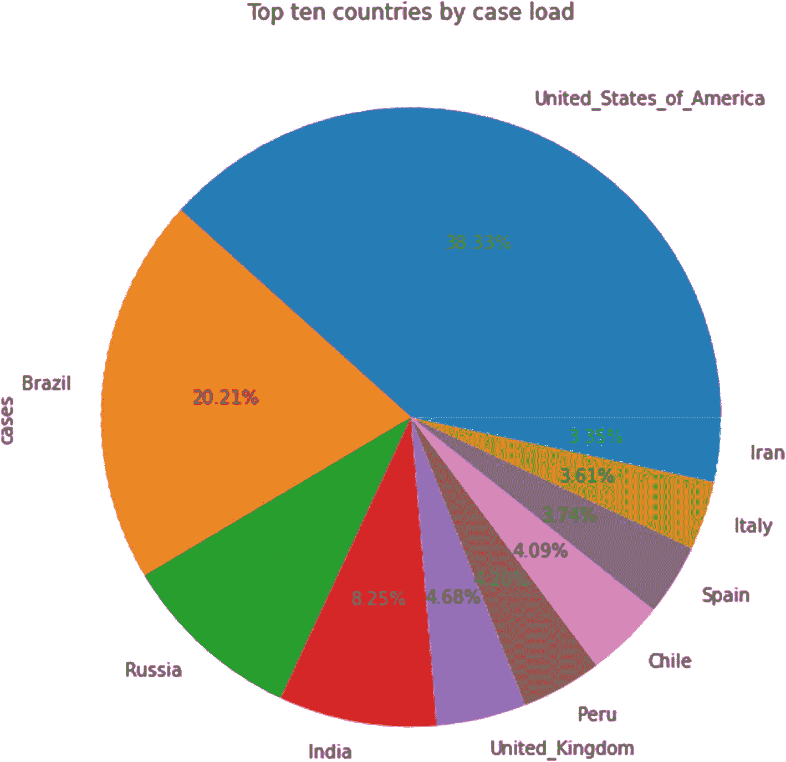

# 八、数据分析案例研究

在上一章中，我们看了各种基于 Python 的可视化库，以及如何使用这些库中的函数来绘制不同的图形。现在，我们的目标是借助案例研究来理解到目前为止我们所讨论的概念的实际应用。我们研究以下三个数据集:

*   非结构化数据分析:使用来自一个网页的数据，该网页提供了 2018 年法国票房最高的 50 部电影的信息

*   空气质量分析:来自新德里(印度)空气质量监测站的数据，提供了四种污染物的每日水平——二氧化硫(SO <sub>2</sub> )、氮氧化物如二氧化氮(NO <sub>2</sub> )、臭氧和细颗粒物(PM <sub>2.5</sub>

*   新冠肺炎趋势分析:获取 2020 年前六个月世界各国每日病例数和死亡数的数据集

## 技术要求

**外部文件**

对于第一个案例研究，您需要参考以下 Wikipedia URL(数据直接取自网页):

[T2`https://en.wikipedia.org/wiki/List_of_2018_box_office_number-one_films_in_France`](https://en.wikipedia.org/wiki/List_of_2018_box_office_number-one_films_in_France)

对于第二个案例研究，请从以下链接下载一个 CSV 文件:

[T2`https://github.com/DataRepo2019/Data-files/blob/master/NSIT%20Dwarka.csv`](https://github.com/DataRepo2019/Data-files/blob/master/NSIT%2520Dwarka.csv)

对于第三个案例研究，从以下链接下载一个 Excel 文件: [`https://github.com/DataRepo2019/Data-files/blob/master/COVID-19-geographic-disbtribution-worldwide-2020-06-29.xlsx`](https://github.com/DataRepo2019/Data-files/blob/master/COVID-19-geographic-disbtribution-worldwide-2020-06-29.xlsx)

**图书馆**

除了我们在前面章节中使用的模块和库(包括 Pandas、NumPy、Matplotlib 和 Seaborn)，我们在本章中使用 *requests* 模块向网站发出 HTTP 请求。

要使用本模块中包含的功能，请使用以下代码行将本模块导入您的 Jupyter 笔记本:

```py
import requests

```

如果没有安装 *requests* 模块，您可以在 Anaconda 提示符下使用下面的命令安装它。

```py
pip install requests

```

## 方法学

我们将在每个案例研究中使用以下方法:

1.  打开一个新的 Jupyter 笔记本，并执行以下步骤:
    *   导入分析所需的库和数据

    *   读取数据集并检查前五行(使用 *head* 方法)

    *   获取关于每列的数据类型和每列中非空值的数量的信息(使用 *info* 方法)以及数据集的维度(使用 *shape* 属性)

    *   获取每一列的汇总统计数据(使用 *describe* 方法),并获取计数、最小值、最大值、标准偏差和百分位数的值

2.  数据争论
    *   检查列的数据类型是否被正确识别(使用*信息*或*数据类型*方法)。如果没有，使用 *astype* 方法改变数据类型

    *   如有必要，使用*重命名*方法重命名列

    *   使用 *drop* 方法删除任何不必要或多余的列或行

    *   如果需要，通过使用*熔化*或*堆栈*方法重组数据，使数据变得整洁

    *   删除任何无关数据(空白值、特殊字符等)。)即不添加任何值，使用*替换*的方法

    *   使用 *isna* 方法检查是否存在空值，并使用 *dropna* 或 *fillna* 方法删除或填充空值

    *   如果一列能为您的分析增加价值，则添加该列

    *   如果数据为分解格式，则使用 groupby 方法聚合数据

3.  使用单变量、双变量和多变量图可视化数据

4.  根据你的分析总结你的见解，包括观察和建议

## 案例研究 8-1:法国票房最高的电影——分析非结构化数据

在这个案例研究中，数据是从 HTML 页面而不是传统的 CSV 文件中读取的。

我们将要使用的 URL 如下: [`https://en.wikipedia.org/wiki/List_of_2018_box_office_number-one_films_in_France`](https://en.wikipedia.org/wiki/List_of_2018_box_office_number-one_films_in_France)

该网页有一个表格，显示了 2018 年法国收入排名前 50 的电影的数据。我们使用请求库中的方法在 Pandas 中导入这些数据。Requests 是一个 Python 库，用于发出 HTTP 请求。它有助于从网页中提取 HTML 并与 API 接口。

我们想通过分析回答的问题:

1.  找出收入最高的五部电影

2.  排名前十的电影各自的百分比分成(收入)是多少？

3.  年内月均营收如何变化？

**步骤 1:导入数据并检查数据集的特征**

首先，导入库并使用必要的函数来检索数据。

代码:

```py
#importing the libraries
import requests
import pandas as pd
import seaborn as sns
import matplotlib.pyplot as plt
#Importing the data from the webpage into a DataFrame
url='https://en.wikipedia.org/wiki/List_of_2018_box_office_number-one_films_in_France'
req=requests.get(url)
data=pd.read_html(req.text)
df=data[0]

```

我们导入所有的库并将 URL 存储在一个变量中。然后，我们使用 get 方法向这个 URL 发出一个 HTTP 请求，从这个 web 页面中检索信息。requests 对象的 text 属性包含 HTML 数据，该数据被传递给函数 *pd.read_html* 。该函数返回一个 DataFrame 对象列表，其中包含网页上的各种表格。由于 web 页面上只有一个表，所以 DataFrame (df)只包含一个表。

检查前几条记录:

代码:

```py
df.head()

```

输出:


获取数据类型和缺失值:

代码:

```py
df.info()

```

输出:

```py
<class 'pandas.core.frame.DataFrame'>
RangeIndex: 50 entries, 0 to 49
Data columns (total 5 columns):
#        50 non-null int64
Date     50 non-null object
Film     50 non-null object
Gross    50 non-null object
Notes    50 non-null object
dtypes: int64(1), object(4)
memory usage: 2.0+ KB

```

正如我们所看到的，列的数据类型不是我们需要的格式。“毛”列表示总收入，这是一个数字列。但是，该列被分配了一个对象数据类型，因为它包含数字和非数字数据(如“、”和“$”符号等字符，以及“U”和“S”等字母)。下一步，我们处理诸如此类的问题。

**第二步:数据争论**

在这一步中，我们将:

1.  删除不必要的字符

2.  更改数据类型

3.  删除不需要的列

4.  从现有列创建新列

让我们从“总值”列中删除不需要的字符串，只保留数值:

代码:

```py
#removing unnecessary characters from the Gross column
df['Gross']=df['Gross'].str.replace(r"US\$","").str.replace(r",","")

```

在前面的语句中，我们使用一系列链式替换方法和正则表达式原则来替换非数字字符。第一个 replace 方法删除“US$ ”,第二个 replace 方法删除逗号。用空字符串("")替换字符相当于删除字符。

现在，让我们使用 *astype* 方法将该列的数据类型转换为 *int64* ，以便该列可以用于计算和可视化:

代码:

```py
#changing the data type of the Gross column to make the column numeric
df['Gross']=df['Gross'].astype('int64')

```

为了检查这些更改是否已经反映出来，我们检查该列的前几条记录并验证数据类型:

代码:

```py
df['Gross'].head(5)

```

输出:

```py
0     6557062
1     2127871
2     2006033
3     2771269
4    16604101
Name: Gross, dtype: int64

```

正如我们从输出中看到的，该列的数据类型已经更改，值不再包含字符串。

我们还需要提取日期的月份部分，我们将首先更改“date”列的数据类型，然后对其应用 *DatetimeIndex* 方法，如下所示。

代码:

```py
#changing the data type of the Date column to extract its components
df['Date']=df['Date'].astype('datetime64')
#creating a new column for the month
df['Month']=pd.DatetimeIndex(df['Date']).month

```

最后，我们使用下面的语句从数据帧中删除两个不必要的列。

代码:

```py
#dropping the unnecessary columns
df.drop(['#','Notes'],axis=1,inplace=True)

```

**第三步:可视化**

为了可视化我们的数据，首先我们创建另一个 DataFrame (df1 ),它包含原始 DataFrame (df)包含的列的子集。这个数据帧 df1 只包含两列——“电影”(电影的名字)和“总收入”(总收入)。然后，我们按降序对收入值进行排序。这显示在下面的步骤中。

代码:

```py
df1=df[['Film','Gross']].sort_values(ascending=False,by='Gross')

```

有一个不需要的列(“索引”)被添加到这个数据帧中，我们将在下一步中删除它。

代码:

```py
df1.drop(['index'],axis=1,inplace=True)

```

前五名电影:s

我们创建的第一个图是一个条形图，显示了收入排名前五的电影:(图 [8-1](#Fig1) )。

```py
#Plotting the top 5 films by revenue
#setting the figure size
plt.figure(figsize=(10,5))
#creating a bar plot
ax=sns.barplot(x='Film',y='Gross',data=df1.head(5))
#rotating the x axis labels
ax.set_xticklabels(labels=df1.head()['Film'],rotation=75)
#setting the title
ax.set_title("Top 5 Films per revenue")
#setting the Y-axis labels
ax.set_ylabel("Gross revenue")
#Labelling the bars in the bar graph
for p in ax.patches:
ax.annotate(p.get_height(),(p.get_x()+p.get_width()/2,p.get_height()),ha='center',va='bottom')

```

输出:


图 8-1

显示前五部电影各自份额百分比的饼图

为了描述前十部电影的份额(按收入)，我们创建了一个饼图(图 [8-2](#Fig2) )。

代码:

```py
#Pie chart showing the share of each of the top 10 films by percentage in the revenue
df1['Gross'].head(10).plot(kind='pie',autopct='%.2f%%',labels=df1['Film'],figsize=(10,5))

```

输出:


图 8-2

描绘前十部电影收入份额的饼图

我们首先创建另一个 DataFrame，通过计算每个月的平均值来聚合一个月的数据(图 [8-3](#Fig3) )。

代码:

```py
#Aggregating the revenues by month
df2=df.groupby('Month')['Gross'].mean()
#creating a line plot
df2.plot(kind='line',figsize=(10,5))

```

输出:


图 8-3

2018 年平均票房月收入(法国)

**步骤 4:基于分析和可视化得出推论**

1.  平均月收入差异很大，可能取决于电影上映的月份，这可能需要跨年度的进一步分析。

2.  2018 年法国票房最高的三部电影是*复仇者联盟*、*家族*和 *Les Tuche 3* 。

## 案例研究 8-2:利用数据分析进行空气质量管理

为了监测环境空气质量的状况，印度中央污染控制委员会(CPCB)在印度各地建立了一个庞大的监测站网络。定期监测的参数包括二氧化硫(SO <sub>2</sub> )、氮氧化物如二氧化氮(NO <sub>2</sub> )、臭氧、细颗粒物(PM <sub>2.5</sub> )。根据多年来的趋势，国家首都德里的空气质量已经成为公众关注的问题。接下来对每日空气质量数据进行逐步分析，以展示数据分析如何帮助规划空气质量管理中的干预措施。

注意:用于本案例研究的数据集的名称是:“Note 德瓦尔卡. csv `”.`,请参考技术描述部分，了解如何导入该数据集的详细信息。

我们想通过分析回答的问题:

1.  年平均水平:在四种污染物中，SO <sub>2</sub> 、NO <sub>2</sub> 、臭氧和 PM <sub>2.5</sub> ，它们的年平均水平经常超过规定的年度标准？

2.  每日标准:对于关注的污染物，每年有多少天超过每日标准？

3.  时间变化:哪些月份的污染水平在大多数日子里超过临界水平？

**步骤 1:导入数据并检查数据集的特征**

代码:

```py
import pandas as pd
import numpy as np
import seaborn as sns
import matplotlib.pyplot as plt
#aqdata is the name of the DataFrame, short for Air Quality Data.
aqdata=pd.read_csv('NSIT Dwarka.csv')
aqdata.head()

```

输出:


**检查** **:** 列的数据类型

代码:

```py
aqdata.info()

```

输出:

```py
<class 'pandas.core.frame.DataFrame'>
RangeIndex: 2192 entries, 0 to 2191
Data columns (total 6 columns):
From Date    2191 non-null object
To Date      2191 non-null object
PM2.5        2191 non-null object
SO2          2187 non-null object
Ozone        2187 non-null object
NO2          2190 non-null object
dtypes: object(6)
memory usage: 102.8+ KB

```

观察:尽管 SO <sub>2</sub> 、NO <sub>2</sub> 、臭氧和 PM <sub>2.5</sub> 的值是数字，但 Pandas 将这些列的数据类型读取为"*对象"*。为了使用这些列(例如，绘制图表、观察趋势、计算聚合值)，我们需要更改这些列的数据类型。此外，似乎还有一些遗漏的条目。

**第二步:数据争论**

根据上一步中的观察，在这一步中，我们将

1.  处理缺失值:我们可以选择删除空值或替换空值。

2.  更改列的数据类型。

**检查数据集中缺失的值:**

代码:

```py
aqdata.isna().sum()

```

输出:

```py
From Date    1
To Date      1
PM2.5        1
SO2          5
Ozone        5
NO2          2
dtype: int64

```

似乎没有很多缺失的价值，但这就是问题所在。当我们使用 head 语句检查前几行时，我们看到一些丢失的值在原始数据集中被表示为 *None* 。然而，Pandas 并不认为这些是空值。让我们用值 *np.nan* 替换值 *None* ，这样 Pandas 就可以将这些值视为空值:

代码:

```py
aqdata=aqdata.replace({'None':np.nan})

```

现在，如果我们计算空值的数量，我们会看到一个非常不同的画面，表明数据集中缺失值的出现率要高得多。

代码:

```py
aqdata.isna().sum()

```

输出:

```py
From Date      1
To Date        1
PM2.5        562
SO2           84
Ozone        106
NO2          105
dtype: int64

```

让我们检查列的当前数据类型:

代码:

```py
aqdata.info()

```

输出:

```py
<class 'pandas.core.frame.DataFrame'>
RangeIndex: 2192 entries, 0 to 2191
Data columns (total 6 columns):
From Date    2191 non-null object
To Date      2191 non-null object
PM2.5        1630 non-null object
SO2          2108 non-null object
Ozone        2086 non-null object
NO2          2087 non-null object
dtypes: object(6)
memory usage: 102.8+ KB

```

我们看到包含数值的列没有被识别为数值列，包含日期的列也没有被正确识别。具有不正确数据类型的列成为下一步的障碍，在下一步中，我们分析趋势并绘制图表；这一步要求列的数据类型采用适合 Pandas 阅读的格式。

在下面的代码行中，我们使用 *pd.to_datetime* 方法将“开始日期”和“结束日期”列的数据类型转换为 *datetime* 类型，这样可以更容易地分析日期的各个组成部分，如月和年。

代码:

```py
aqdata['From Date']=pd.to_datetime(aqdata['From Date'], format='%d-%m-%Y %H:%M')
aqdata['To Date']=pd.to_datetime(aqdata['To Date'], format='%d-%m-%Y %H:%M')
aqdata['SO2']=pd.to_numeric(aqdata['SO2'],errors='coerce')
aqdata['NO2']=pd.to_numeric(aqdata['NO2'],errors='coerce')
aqdata['Ozone']=pd.to_numeric(aqdata['Ozone'],errors='coerce')
aqdata['PM2.5']=pd.to_numeric(aqdata['PM2.5'],errors='coerce')

```

使用 *info* 方法检查数据类型是否已经改变。

代码:

```py
aqdata.info()

```

输出:

```py
<class 'pandas.core.frame.DataFrame'>
RangeIndex: 2192 entries, 0 to 2191
Data columns (total 6 columns):
From Date    2191 non-null datetime64[ns]
To Date      2191 non-null datetime64[ns]
PM2.5        1630 non-null float64
SO2          2108 non-null float64
Ozone        2086 non-null float64
NO2          2087 non-null float64
dtypes: datetime64[ns](2), float64(4)
memory usage: 102.8 KB

```

由于我们的大部分分析考虑的是年度数据，我们创建了一个新列来提取年份，使用的是 *pd。DatetimeIndex* 函数。

代码:

```py
aqdata['Year'] = pd.DatetimeIndex(aqdata['From Date']).year

```

现在，我们为每年创建单独的 DataFrame 对象，以便我们可以每年分析数据。

代码:

```py
#extracting the data for each year
aq2014=aqdata[aqdata['Year']==2014]
aq2015=aqdata[aqdata['Year']==2015]
aq2016=aqdata[aqdata['Year']==2016]
aq2017=aqdata[aqdata['Year']==2017]
aq2018=aqdata[aqdata['Year']==2018]
aq2019=aqdata[aqdata['Year']==2019]

```

现在，让我们看看每年数据中的空值数量:

代码:

```py
#checking the missing values in 2014
aq2014.isna().sum()

```

输出:

```py
From Date      0
To Date        0
PM2.5        365
SO2            8
Ozone          8
NO2            8
Year           0
dtype: int64

#checking the missing values in 2015
aq2015.isna().sum()

```

输出:

```py
From Date      0

To Date        0
PM2.5        117
SO2           12
Ozone         29
NO2           37
Year           0
dtype: int64

```

代码:

```py
#checking the missing values in 2016
aq2016.isna().sum()

```

输出:

```py
From Date     0
To Date       0
PM2.5        43
SO2          43
Ozone        47
NO2          42
Year          0
dtype: int64

#checking the missing values in 2017
aq2017.isna().sum()

```

输出:

```py
From Date     0
To Date       0
PM2.5        34
SO2          17
Ozone        17
NO2          12
Year          0
dtype: int64

```

代码:

```py
#checking the missing values in 2018
aq2018.isna().sum()

```

输出:

```py
From Date    0
To Date      0
PM2.5        2
SO2          2
Ozone        2
NO2          2
Year         0
dtype: int64

```

代码:

```py
#checking the missing values in 2019

aq2019.isna().sum()

```

输出:

```py
From Date    0
To Date      0
PM2.5        0
SO2          1
Ozone        2
NO2          3
Year         0
dtype: int64

```

从对每年的空值的分析中，我们看到 2014 年和 2015 年的数据具有大部分缺失值。因此，我们选择忽略 2014 年和 2015 年的数据，并分析 2016 年至 2019 年的 4 年数据。根据印度中央污染控制委员会制定的标准，我们需要至少 104 个每日监测值才能得出年平均值。

2016 年、2017 年、2018 年和 2019 年是分析空气质量数据的四年。在进入下一步之前，我们删除 2016 年至 2019 年每年缺失的值，而不是替换它们，因为我们有这四年中每一年的足够数据(超过 104 个读数)来计算年平均值，如下所示。

代码:

```py
#dropping the null values for the four years chosen for analysis
aq2016.dropna(inplace=True) # inplace=True makes changes in the original dataframe
aq2017.dropna(inplace=True)
aq2018.dropna(inplace=True)
aq2019.dropna(inplace=True)

```

**第三步:数据可视化**

*分析的第一部分:绘制污染物的年平均值*

根据监测到的 PM <sub>2.5</sub> 、SO <sub>2</sub> 、NO <sub>2</sub> 和臭氧(O <sub>3</sub> 的 24 小时平均环境空气浓度，绘制年平均值，以识别年平均值超过规定的国家环境空气质量标准的参数。

首先，我们计算每种污染物(PM <sub>2.5</sub> ，SO <sub>2</sub> ，NO <sub>2</sub> ，臭氧)的年平均值，如下所示:

代码:

```py
#Yearly averages for SO2 in each year
s16avg=round(aq2016['SO2'].mean(),2)
s17avg=round(aq2017['SO2'].mean(),2)
s18avg=round(aq2018['SO2'].mean(),2)
s19avg=round(aq2019['SO2'].mean(),2)
#Yearly averages for PM2.5 in each year
p16avg=round(aq2016['PM2.5'].mean(),2)
p17avg=round(aq2017['PM2.5'].mean(),2)
p18avg=round(aq2018['PM2.5'].mean(),2)
p19avg=round(aq2019['PM2.5'].mean(),2)
#Yearly averages for NO2 in each year
n16avg=round(aq2016['NO2'].mean(),2)
n17avg=round(aq2017['NO2'].mean(),2)
n18avg=round(aq2018['NO2'].mean(),2)
n19avg=round(aq2019['NO2'].mean(),2)

```

说明:代表污染物平均值的变量命名符号如下:污染物的第一个字母，年份，平均值的缩写“avg”。例如，s15avg 表示 2015 年 SO <sub>2</sub> 的平均水平。我们使用*均值*方法计算平均值，并使用 round 函数将平均值四舍五入到小数点后两位。我们不考虑臭氧，因为年度标准不适用于臭氧。

接下来，我们为每种污染物创建一个数据框架，每个数据框架有两列。其中一列表示年份，另一列显示该年的年平均水平。

代码:

```py
#Creating data frames with yearly averages for each pollutant
dfs=pd.DataFrame({'Yearly average':[s16avg,s17avg,s18avg,s19avg]},index=['2016','2017','2018','2019']) #dfs is for SO2
dfp=pd.DataFrame({'Yearly average':[p16avg,p17avg,p18avg,p19avg]},index=['2016','2017','2018','2019']) #dfp is for PM2.5
dfn=pd.DataFrame({'Yearly average':[n16avg,n17avg,n18avg,n19avg]},index=['2016','2017','2018','2019']) #dfn is for NO2

```

现在，我们准备绘制每种污染物年平均值的图表(图 [8-4](#Fig4) )。

代码:

```py
#Creating a figure with 3 subplots - 1 for each pollutant
fig,(ax1,ax2,ax3)=plt.subplots(1,3)
#Creating a DataFrame the yearly averages for NO2
dfn.plot(kind='bar',figsize=(20,5),ax=ax1)
#Setting the title for the first axes object
ax1.set_title("NO2", fontsize=18)
#Setting the X-axis label for the NO2 graph
ax1.set_xlabel("Years", fontsize=18)
ax1.legend().set_visible(False)
#Setting the Y-axis label
ax1.set_ylabel("Yearly average", fontsize=18)
#Creating a dashed line to indicate the annual standard
ax1.hlines(40, -.9,15, linestyles="dashed")
#Labelling this dashed line
ax1.annotate('Annual avg. standard for NO2',(-0.5,38))
#labelling the bars
for p in ax1.patches:
    ax1.annotate(p.get_height(),(p.get_x()+p.get_width()/2,p.get_height()), color="black", ha="left", va ='bottom',fontsize=12)

#Plotting the yearly averages similarly for PM2.5
dfp.plot(kind='bar',figsize=(20,5),ax=ax2)
ax2.set_title("PM2.5", fontsize=18)
ax2.hlines(40, -.9,15, linestyles="dashed")
ax2.annotate('Annual avg. standard for PM2.5',(-0.5,48))
ax2.legend().set_visible(False)
for p in ax2.patches:
    ax2.annotate(p.get_height(),(p.get_x()+p.get_width()/2,p.get_height()), color="black", ha="center", va ='bottom',fontsize=12)

#Plotting the yearly averages similarly for SO2

dfs.plot(kind='bar',figsize=(20,5),ax=ax3)
ax3.hlines(50, -.9,15, linestyles="dashed")
ax3.annotate('Annual avg. standard for SO2',(-0.5,48))
ax3.set_title("SO2", fontsize=18)
ax3.legend().set_visible(False)
for p in ax3.patches:
    ax3.annotate(p.get_height(),(p.get_x()+p.get_width()/2,p.get_height()), color="black", ha="center", va ='bottom',fontsize=12)

```

输出:


图 8-4

污染物(NO <sub>2</sub> ，PM <sub>2.5</sub> ，SO <sub>2</sub> )相对于其年平均标准的年平均水平

观察:很明显，仅 PM <sub>2.5</sub> 超过年平均值标准。对于 NO <sub>2</sub> ，观测值比较接近规定标准。对于 SO <sub>2</sub> ，观测值远小于年标准。因此，为了进一步分析，只考虑这两种污染物(NO <sub>2</sub> 和 PM <sub>2.5</sub> )。

*空气质量分析第二部分:绘制 PM* <sub>*2.5*</sub> *和 NO* <sub>*2*</sub> 每年 24 小时超标天数

虽然分析的第一步指出了空气质量管理和干预规划所关注的污染物，但在第二步中，我们显示了每年 24 小时数值超过标准的各种水平是如何分布的。在 PM <sub>2.5</sub> 的情况下，我们绘制了每年观察值落在以下范围内的天数。

1.  0 至 60 微克/立方米 <sup>3</sup>

2.  61 至 120 微克/立方米 <sup>3</sup>

3.  121 至 180 微克/立方米 <sup>3</sup>

4.  > 180 μg/m <sup>3</sup>

为了绘制这些数据，我们需要为 2016 年到 2019 年的每一年创建 DataFrame 对象，以捕获 PM <sub>2.5</sub> 水平落在这些间隔中的天数，如下所示:

代码:

```py
#Creating intervals for 2016 with the number of days with PM2.5 concentration falling in that interval
a2=aq2016[(aq2016['PM2.5']<=60)]['PM2.5'].count()
b2=aq2016[((aq2016['PM2.5']>60) & (aq2016['PM2.5']<=120))]['PM2.5'].count()
c2=aq2016[((aq2016['PM2.5']>120) & (aq2016['PM2.5']<=180))]['PM2.5'].count()
d2=aq2016[(aq2016['PM2.5']>180)]['PM2.5'].count()
dfpb2016=pd.DataFrame({'year':'2016','pm levels':['<60','between 61 and 120','between 121 and 180','greater than 180'],'number of critical days':[a2,b2,c2,d2]})
#Creating intervals for 2017 with the number of days with PM2.5 concentration falling in each interval
a3=aq2017[(aq2017['PM2.5']<=60)]['PM2.5'].count()
b3=aq2017[((aq2017['PM2.5']>60) & (aq2017['PM2.5']<=120))]['PM2.5'].count()
c3=aq2017[((aq2017['PM2.5']>120) & (aq2017['PM2.5']<=180))]['PM2.5'].count()
d3=aq2017[(aq2017['PM2.5']>180)]['PM2.5'].count()
dfpb2017=pd.DataFrame({'year':'2017','pm levels':['<60','between 61 and 120','between 121 and 180','greater than 180'],'number of critical days':[a3,b3,c3,d3]})
#Creating intervals for 2018 with the number of days with PM2.5 concentration falling in each interval

a4=aq2018[(aq2018['PM2.5']<=60)]['PM2.5'].count()
b4=aq2018[((aq2018['PM2.5']>60) & (aq2018['PM2.5']<=120))]['PM2.5'].count()
c4=aq2018[((aq2018['PM2.5']>120) & (aq2018['PM2.5']<=180))]['PM2.5'].count()
d4=aq2018[(aq2018['PM2.5']>180)]['PM2.5'].count()
dfpb2018=pd.DataFrame({'year':'2018','pm levels':['<60','between 61 and 120','between 121 and 180','greater than 180'],'number of critical days':[a4,b4,c4,d4]})
#Creating intervals for 2019 with the number of days with PM2.5 concentration falling in each interval
a5=aq2019[(aq2019['PM2.5']<=60)]['PM2.5'].count()
b5=aq2019[((aq2019['PM2.5']>60) & (aq2019['PM2.5']<=120))]['PM2.5'].count()
c5=aq2019[((aq2019['PM2.5']>120) & (aq2019['PM2.5']<=180))]['PM2.5'].count()
d5=aq2019[(aq2019['PM2.5']>180)]['PM2.5'].count()
dfpb2019=pd.DataFrame({'year':'2019','pm levels':['<60','between 61 and 120','between 121 and 180','greater than 180'],'number of critical days':[a5,b5,c5,d5]})

```

现在，我们用这些时间间隔为每年绘制一个堆积条形图。为此，我们需要创建如下数据透视表:

代码:

```py
dfpivot2019=dfpb2019.pivot(index='year',columns='pm levels',values='number of critical days')
dfpivot2018=dfpb2018.pivot(index='year',columns='pm levels',values='number of critical days')
dfpivot2017=dfpb2017.pivot(index='year',columns='pm levels',values='number of critical days')
dfpivot2016=dfpb2016.pivot(index='year',columns='pm levels',values='number of critical days')

```

使用这些数据透视表，我们创建如下堆叠条形图(图 [8-5](#Fig5) ):

代码:

```py
#Creating a figure with 4 sub-plots, one for each year from 2016-19
fig,(ax1,ax2,ax3,ax4)=plt.subplots(1,4)
fig.suptitle("Number of days per year in each interval")
cmp=plt.cm.get_cmap('RdBu')
#Plotting stacked horizontal bar charts for each year to represent intervals of PM2.5 levels
dfpivot2019.loc[:,['<60','between 61 and 120','between 121 and 180','greater than 180']].plot.barh(stacked=True, cmap=cmp,figsize=(15,5),ax=ax1)
dfpivot2018.loc[:,['<60','between 61 and 120','between 121 and 180','greater than 180']].plot.barh(stacked=True, cmap=cmp, figsize=(15,5),ax=ax2)
dfpivot2017.loc[:,['<60','between 61 and 120','between 121 and 180','greater than 180']].plot.barh(stacked=True, cmap=cmp, figsize=(15,5),ax=ax3)
dfpivot2016.loc[:,['<60','between 61 and 120','between 121 and 180','greater than 180']].plot.barh(stacked=True, cmap=cmp, figsize=(15,5),ax=ax4)
#Setting the properties - legend, yaxis and title
ax1.legend().set_visible(False)
ax2.legend().set_visible(False)
ax3.legend().set_visible(False)
ax4.legend(loc='center left',bbox_to_anchor=(1,0.5))
ax1.get_yaxis().set_visible(False)
ax2.get_yaxis().set_visible(False)
ax3.get_yaxis().set_visible(False)
ax4.get_yaxis().set_visible(False)
ax1.set_title('2019')
ax2.set_title('2018')
ax3.set_title('2017')
ax4.set_title('2016')

```

输出:


图 8-5

PM <sub>2.5</sub> 的每个间隔级别每年的天数

观察:

可以看出，每年都观察到 PM <sub>2.5</sub> 值超过 180 μg/m <sup>3</sup> ，因此，首先，对包括交通在内的主要污染活动的限制可以局限于此类别。

*否* <sub>*2*</sub> *逐区间标图*

同样，对于 NO <sub>2</sub> ，每年监测值超过 80 微克/立方米 <sup>3</sup> 的 24 小时标准的天数被绘制出来(图 [8-6](#Fig6) )。

首先，我们为编号为 <sub>2</sub> 的项目创建一个数据框，该数据框捕捉每年中数值高于 80 μg/m 的天数 <sup>3</sup> **，**，如下所示。

代码:

```py
#Calculating the number of days in each year with regard to critical days of NO2 concentration
a=aq2015[(aq2015['NO2']>=80)]['NO2'].count()
b=aq2016[(aq2016['NO2']>=80)]['NO2'].count()
c=aq2017[(aq2017['NO2']>=80)]['NO2'].count()
d=aq2018[(aq2018['NO2']>=80)]['NO2'].count()
e=aq2019[(aq2019['NO2']>=80)]['NO2'].count()
dfno=pd.DataFrame({'years':['2015','2016','2017','2018','2019'],'number of days with NO2>80 μg':[a,b,c,d,e]})
ax=dfno.plot(kind='bar',figsize=(10,5))
ax.set_xticklabels(['2015','2016','2017','2018','2019'])
ax.set_title("NO2 number of days in each year with critical levels of concentration")
for p in ax.patches:
    ax.annotate(p.get_height(), (p.get_x() + p.get_width() / 2, p.get_height()), ha = 'center', va = 'bottom')

```

输出:


图 8-6

每年 NO <sub>2</sub> 浓度达到临界水平的天数

推断:观察到的 24 小时 NO <sub>2</sub> 值在五年中只有三年出现超标。

由于观察到的 24 小时 NO <sub>2</sub> 值仅轻微超标，且仅持续几天，下一步仅限于对 PM <sub>2.5</sub> 的进一步分析。

*空气质量分析的第 3 部分:确定 PM* <sub>*2.5*</sub> *日值在大多数日子里超过临界水平的月份*

在对车辆交通和施工等显著增加环境 PM <sub>2.5</sub> 浓度的活动实施限制之前，有必要提供足够的通知，以避免对公众造成不便。因此，对于明显高于 180 微克/立方米的每日 PM <sub>2.5</sub> 值 <sup>3</sup> ，我们绘制了一年中每个月的时间变化图。为了做到这一点，在 12 个月中的每个月，我们捕捉每年 24 小时 PM <sub>2.5</sub> 值超过 180 微克/立方米 <sup>3</sup> 的严重空气污染天数。

首先，我们用每月 PM <sub>2.5</sub> 值超过 180 微克/立方米 <sup>3</sup> 的天数为每年创建数据帧，如下所示。

代码:

```py
#Creating a dataframe for 2016 with the number of days in each month where the PM2.5 concentration is >180
aq2016['Month']=pd.DatetimeIndex(aq2016['From Date']).month #extracting the month
aq2016['condition']=(aq2016['PM2.5']>=180 ) # creating a boolean column that is True when the PM2.5 value is greater than 180 and false when it is less than 180
aq2016['condition']=aq2016['condition'].replace({False:np.nan}) # replacing the False values with null values, so that the count method in the next statement only counts the True values or the values corresponding to PM 2.5>180
selection1=aq2016.groupby('Month')['condition'].count() #Using the groupby method to calculate the number of days for each month that satisfy the condition(PM2.5>180)
#Repeating the above process for 2017, creating a dataframe with the number of days in each month where the PM2.5 concentration is >180
aq2017['Month']=pd.DatetimeIndex(aq2017['From Date']).month
aq2017['condition']=(aq2017['PM2.5']>=180 )
aq2017['condition']=aq2017['condition'].replace({False:np.nan})
selection2=aq2017.groupby('Month')['condition'].count()
#Repeating the above process for 2018, creating a dataframe with the number of days in each month where the PM2.5 concentration is >180
aq2018['Month']=pd.DatetimeIndex(aq2018['From Date']).month
aq2018['condition']=(aq2018['PM2.5']>=180 )
aq2018['condition']=aq2018['condition'].replace({False:np.nan})
selection3=aq2018.groupby('Month')['condition'].count()
#Repeating the above process for 2019, creating a dataframe with the number of days in each month where the PM2.5 concentration is >180
aq2019['Month']=pd.DatetimeIndex(aq2019['From Date']).month
aq2019['condition']=(aq2019['PM2.5']>=180 )
aq2019['condition']=aq2019['condition'].replace({False:np.nan})
selection4=aq2019.groupby('Month')['condition'].count()

```

现在，我们将所有 DataFrame 对象连接成一个对象(我们称之为“selectionc”)，以获得 PM<sub>2.5</sub>>180μg/m<sup>3</sup>的每月天数的综合图，如下所示。

代码:

```py
#selectionc data frame is a consolidated dataframe showing month-wise critical values of PM2.5 for every year
selectionc=pd.concat([selection1,selection1,selection3,selection4],axis=1)
#renaming the columns
selectionc.columns=['2016','2017','2018','2019']
selectionc

```

输出:


从该表中我们可以看出，第 1 个月(1 月)、第 11 个月(11 月)和第 12 个月(12 月)是四年中最关键的月份，因为这些月份的 PM <sub>2.5</sub> > 180 微克/立方米 <sup>3</sup> 的天数最多。

现在我们已经有了所有的数据，让我们使用下面的代码来可视化 PM <sub>2.5</sub> (图 [8-7](#Fig7) )的关键日子。

代码:

```py
#creating a bar chart representing number of days with critical levels of PM2.5(>180) concentrations
ax=selectionc.plot(kind='bar',figsize=(20,7),width=0.7,align='center',colormap='Paired')
bars = ax.patches
#creating patterns to represent each year
patterns =('-','x','/','O')
#ax.legend(loc='upper left', borderpad=1.5, labelspacing=1.5)
ax.legend((patterns),('2016','2017','2018','2019'))
hatches = [p for p in patterns for i in range(len(selectionc))]
#setting a pattern for each bar
for bar, hatch in zip(bars, hatches):
    bar.set_hatch(hatch)
#Labelling the months, the X axis and Y axis
ax.set_xticklabels(['Jan','Feb','Mar','Apr','May','June','July','Aug','Sept','Oct','Nov','Dec'],rotation=30)
ax.set_xlabel('Month',fontsize=12)
ax.set_ylabel('Number of days with critical levels of PM2.5',fontsize=12)
#Labelling the bars
for i in ax.patches:
    ax.text(i.get_x()-.003, i.get_height()+.3,
            round(i.get_height(),2), fontsize=10,
                color='dimgrey')
ax.legend()
ax.set_title("Number of days with critical levels of PM2.5 in each month of years 2016-19")

```

输出:


图 8-7

PM<sub>2.5</sub>–每年每月达到临界水平的天数

**步骤 4:基于分析和可视化得出推论**

从上图可以看出，大多数严重污染的日子出现在 1 月、11 月和 12 月。因此，根据过去四年记录的 PM <sub>2.5</sub> 的日平均浓度，可能会在 1 月、11 月和 12 月对车辆交通、施工活动、柴油泵组的使用、从邻国进入德里的交通分流以及其他类似活动实施限制。为了对整个德里做出这样的决定，分析来自其他监测站的数据也是必要的。传播数据和分析上述内容将有助于人们提前为限制做好准备，并理解这些措施背后的基本原理。

前面演示的方法使用数据分析作为辅助空气质量管理的工具，使用位于德里 Netaji Subhas 技术研究所(NSIT)的一个监测站记录的数据。这一方法可以按照以下思路进行。

1.  对第 <sub>2</sub> 号重复上述步骤，以显示占大部分天数的关键月份，其中无 <sub>2</sub> 记录值超过 24 小时标准。做这个练习将再次帮助确定面临两个参数污染水平的月份，PM <sub>2.5</sub> 和 NO <sub>2</sub> 和计划。

2.  利用 NSIT 空气质量监测站的数据和其他监测站的类似数据，重复进行分析，以便可以对整个德里的干预措施进行规划。

## 案例研究 8-3:全球新冠肺炎案例分析

该数据集包含截至 2020 年 6 月 29 日<sup>日</sup>新冠肺炎病例的地理分布数据(来源:欧洲疾病控制中心，来源 URL: [`https://www.ecdc.europa.eu/en/publications-data/download-todays-data-geographic-distribution-covid-19-cases-worldwide`](https://www.ecdc.europa.eu/en/publications-data/download-todays-data-geographic-distribution-covid-19-cases-worldwide) )。请注意，此链接包含最新数据，但我们使用的是 6 月 29 日<sup>至</sup>的数据(本章开头的“技术要求”部分提供了数据集的链接)。

我们希望通过分析回答的问题包括:

1.  哪些国家的死亡率最高，病例最多，死亡人数最多？

2.  自疫情开始以来，每月的病例和死亡人数趋势如何？

3.  在一些国家，强制实行封锁是为了帮助拉平曲线。这项措施有助于减少病例数吗？

**步骤 1:导入数据并检查数据集的特征**

使用 *pd.read_excel* 函数读取数据集并检查前五行(使用 *head* 方法):

代码:

```py
df=pd.read_excel('COVID-19-geographic-distribution-worldwide-2020-06-29.xlsx')
df.head()

```

输出:


获取关于每列的数据类型和每列中非空值的数量的信息(使用 *info* 方法)。

代码:

```py
df.info()

```

输出:

```py
<class 'pandas.core.frame.DataFrame'>
RangeIndex: 26562 entries, 0 to 26561
Data columns (total 11 columns):
dateRep                    26562 non-null datetime64[ns]
day                        26562 non-null int64
month                      26562 non-null int64
year                       26562 non-null int64
cases                      26562 non-null int64
deaths                     26562 non-null int64
countriesAndTerritories    26562 non-null object
geoId                      26455 non-null object
countryterritoryCode       26498 non-null object
popData2019                26498 non-null float64
continentExp               26562 non-null object
dtypes: datetime64[ns](1), float64(1), int64(5), object(4)
memory usage: 2.2+ MB

```

获取每一列的汇总统计数据(使用 *describe* 方法)并获取 count、min、max、standard deviation 和 percentiles 的值:

代码:

```py
df.describe()

```

输出:


**第二步:数据争论**

在这一步中，我们将:

*   检查列的数据类型是否被准确识别。如果没有，更改数据类型:从 *info* 方法的输出中，我们看到所有列的数据类型都被正确地识别了。

*   如有必要，重命名列:在下面的代码中，我们将重命名 DataFrame 的列。

代码:

*   删除任何不必要的列或行:

    我们看到国家代码列在数据帧中出现了两次(具有两个不同的名称:“旧国家代码”和“国家代码”)，因此我们删除了其中一列(“旧国家代码”):

```py
#changing the column names
df.columns=['date','day','month','year','cases','deaths','country','old_country_code','country_code','population','continent']

```

代码:

*   删除不会增加任何价值的无关数据:

```py
#Dropping the redundant column name
df.drop(['old_country_code'],axis=1,inplace=True)

```

该数据帧中没有空格、特殊字符或任何其他无关字符。我们看到只有 2019 年 12 月一天的数据；因此，我们删除了本月的数据，并为剩余的 11 个月创建了一个新的数据框架(df1)。

代码:

*   使用 *isna* 或 *isnull* 方法检查是否有空值，如果有，则采用适当的方法处理:

```py
df1=df[df.month!=12]

```

计算空值的百分比:

代码:

```py
df1.isna().sum().sum()/len(df1)

```

输出:

```py
0.008794112096622004

```

由于空值的百分比小于 1%，我们在下面的步骤中删除空值。

代码:

*   如果数据为分解格式，则汇总数据:

```py
df1.dropna(inplace=True)

```

这个数据帧中的数据不是聚合格式，我们在这一步中使用 *groupby* 方法将其转换成这种格式。我们可以按国家、洲或日期分组。让我们按国名分组。

代码:

```py
#Aggregating the data by country name
df_by_country=df1.groupby('country')['cases','deaths'].sum()
df_by_country

```

输出(仅显示前九行):


前面的输出显示了每个国家的病例和死亡人数的综合情况。

让我们在这个汇总数据框架中添加另一列——死亡率，它是死亡人数与病例数的比率。

代码:

```py
#Adding a new column for the mortality rate which is the ratio of the number of deaths to cases
df_by_country['mortality_rate']=df_by_country['deaths']/df_by_country['cases']

```

**第三步:可视化数据**

在本案例研究的第一个可视化中，我们使用数据框架“df_by_country”中的聚合数据来显示死亡率最高的二十个国家(图 [8-8](#Fig8) )。

代码:

```py
#Sorting the values for the mortality rate in the descending order
plt.figure(figsize=(15,10))
ax=df_by_country['mortality_rate'].sort_values(ascending=False).head(20).plot(kind='bar')
ax.set_xticklabels(ax.get_xticklabels(), rotation=45, ha="right")
for p in ax.patches:
    ax.annotate(p.get_height().round(2),(p.get_x()+p.get_width()/2,p.get_height()),ha='center',va='bottom')
ax.set_xlabel("Country")
ax.set_ylabel("Mortality rate")
ax.set_title("Countries with highest mortality rates")

```

输出:


图 8-8

描述新冠肺炎死亡率最高的国家的条形图

在第二个视图中，我们使用饼图显示了新冠肺炎病例数量最多的十个国家，如图 [8-9](#Fig9) 所示。

代码:

```py
#Pie chart showing the countries with the highest number of COVID cases
df_cases=df_by_country['cases'].sort_values(ascending=False)
ax=df_cases.head(10).plot(kind='pie',autopct='%.2f%%',labels=df_cases.index,figsize=(12,8))
ax.set_title("Top ten countries by case load")

```

输出:



图 8-9

按新冠肺炎案例描绘前十个国家/地区份额的饼图

在接下来的可视化中，我们使用条形图(图 [8-10](#Fig10) )找出新冠肺炎疫情造成的人员伤亡最严重的五个国家。

代码:

```py
#sorting the number of deaths in the descending order
plt.figure(figsize=(10,6))
ax=df_by_country['deaths'].sort_values(ascending=False).head(5).plot(kind='bar')
ax.set_xticklabels(ax.get_xticklabels(), rotation=45, ha="right")
for p in ax.patches:
    ax.annotate(p.get_height(),(p.get_x()+p.get_width()/2,p.get_height()),ha='center',va='bottom')
ax.set_title("Countries suffering the most fatalities from COVID-19")
ax.set_xlabel("Countries")
ax.set_ylabel("Number of deaths")

```

输出:


图 8-10

描述死亡人数最多的五个国家的条形图

现在，我们绘制线形图来观察新冠肺炎病例和死亡人数的月趋势。

为了绘制折线图，我们首先按月汇总数据，然后并排绘制两个折线图，显示病例数和死亡数，如图 [8-11](#Fig11) 所示。

代码:

```py
df_by_month=df1.groupby('month')['cases','deaths'].sum()
fig=plt.figure(figsize=(15,10))
ax1=fig.add_subplot(1,2,1)
ax2=fig.add_subplot(1,2,2)
df_by_month['cases'].plot(kind='line',ax=ax1)
ax1.set_title("Total COVID-19 cases across months in 2020")
ax1.set_xlabel("Months in 2020")
ax1.set_ylabel("Number of cases(in million)")
df_by_month['deaths'].plot(kind='line',ax=ax2)
ax2.set_title("Total COVID-19 deaths across months in 2020")
ax2.set_xlabel("Months in 2020")
ax2.set_ylabel("Number of deaths")

```

输出:


图 8-11

锁定对平坦曲线的影响

许多国家实施了封锁，以遏制病例增加的趋势，并使曲线变平。我们现在来看看四个国家——印度、英国、意大利和德国——在三月份实施了封锁，看看这一措施是否达到了预期的效果。

首先，我们为每个国家创建 DataFrame 对象，按月汇总数据。

代码:

```py
#Creating DataFrames for each country
#Monthwise aggregated data for Germany
df_germany=df1[df1.country=='Germany']
df_germany_monthwise=df_germany.groupby('month')['cases','deaths'].sum()
df_germany_grouped=df_germany_monthwise.reset_index()
#Monthwise aggregated data for UK
df_uk=df1[df1.country=='United_Kingdom']
df_uk_monthwise=df_uk.groupby('month')['cases','deaths'].sum()
df_uk_grouped=df_uk_monthwise.reset_index()
#Monthwise aggregated data for India
df_india=df1[df1.country=='India']
df_india_monthwise=df_india.groupby('month')['cases','deaths'].sum()
df_india_grouped=df_india_monthwise.reset_index()
#Monthwise aggregated data for Italy
df_italy=df1[df1.country=='Italy']
df_italy_monthwise=df_italy.groupby('month')['cases','deaths'].sum()
df_italy_grouped=df_italy_monthwise.reset_index()

```

现在，我们使用在前面步骤中创建的 DataFrame 对象来绘制这些国家的折线图，以查看 2020 年各月的病例数，如图 [8-12](#Fig12) 所示。

代码:

```py
#Plotting the data for four countries (UK, India, Italy and Germany) where lockdowns were imposed
fig=plt.figure(figsize=(20,15))
ax1=fig.add_subplot(2,2,1)
df_uk_grouped.plot(kind='line',x='month',y='cases',ax=ax1)
ax1.set_title("Cases in UK across months")
ax2=fig.add_subplot(2,2,2)
df_india_grouped.plot(kind='line',x='month',y='cases',ax=ax2)
ax2.set_title("Cases in India across months")
ax3=fig.add_subplot(2,2,3)
df_italy_grouped.plot(kind='line',x='month',y='cases',ax=ax3)
ax3.set_title("Cases in Italy across months")
ax4=fig.add_subplot(2,2,4)
df_germany_grouped.plot(kind='line',x='month',y='cases',ax=ax4)
ax4.set_title("Cases in Germany across months")

```

输出:


图 8-12

2020 年前 6 个月英国、印度、德国和意大利的总病例数

**步骤 4:基于分析和可视化得出推论**

*   病例数:美国、巴西、俄罗斯、印度和英国的病例数最高。

*   死亡人数:美国、巴西、英国、意大利和法国的死亡人数最高。

*   死亡率:也门、圣马丁、法国、比利时和意大利的死亡率最高。

*   趋势:
    *   病例总数一直在稳步增加，而死亡总数在 4 月份后有所下降。

    *   封锁的影响:我们分析了四个国家——印度、英国、德国和意大利——三月份实施了封锁。除印度之外，所有这些国家在实施封锁后，病例都出现了总体下降。在英国和德国，病例最初有所上升(在封锁的早期阶段)，但在这次高峰之后开始下降。

## 摘要

*   在本章中，我们查看了从结构化和非结构化数据源导入数据的各种案例研究。Pandas 支持从多种格式中读取数据。

*   requests 模块的功能使我们能够向 web 页面发送 HTTP 请求，并将页面内容存储在对象中。

*   对案例进行典型的描述性或探索性数据分析，首先是构建我们希望通过分析回答的问题，并找出如何导入数据。在此之后，我们获得了关于数据的更多信息——各列的含义、度量单位、缺失值的数量、不同列的数据类型等等。

*   数据争论是描述性或探索性数据分析的关键，在数据争论中，我们准备、清理和组织数据以使其适合分析。典型的活动包括删除无关数据、处理空值、重命名列、聚合数据和更改数据类型。

*   一旦数据准备好并适合于分析，我们就使用 Matplotlib、Seaborn 和 Pandas 等库来可视化我们的数据，以帮助我们获得能够回答我们最初提出的问题的见解。

## 复习练习

**问题 1(小型案例研究)**

考虑下面网页上的第一个表格: [`https://en.wikipedia.org/wiki/Climate_of_South_Africa`](https://en.wikipedia.org/wiki/Climate_of_South_Africa) 。它包含南非各城市夏季和冬季的最高和最低温度(以摄氏度为单位)的数据。

*   使用 *requests* 模块中的适当方法向该 URL 发送一个 *get* 请求，并将该页面上第一个表中的数据存储在 Pandas DataFrame 中。

*   将列重命名为:“城市”、“夏季(最大值)”、“夏季(最小值)”、“冬季(最大值)”和“冬季(最小值)”。

*   将“Winter(min)”列第一行的负值替换为 0，并将该列的数据类型转换为 *int64* 。

*   绘制一个图表，显示南非夏季最热的城市(使用 Summer(max)列)。

*   绘制一个图表，显示南非冬季最冷的城市(使用冬季(分钟)列)。

**问题 2**

十名雇员(缩写为 A–J)的周薪如下:100，120，80，155，222，400，199，403，345，290。将每周工资存储在数据框架中。

*   绘制一个条形图，以降序显示工资

*   使用*注释*方法标记条形图中的每个条形

**问题 3**

<colgroup><col class="tcol1 align-left"> <col class="tcol2 align-left"></colgroup> 
| 1.用于发送 HTTP 请求的模块 | a.网页的 URL |
| 2.*获取*的方法 | b.请求文本 |
| 3.传递给 *get* 方法的参数 | c.使用给定的 URL 获取信息 |
| 4.包含 Unicode 内容的属性 | d.要求 |

**问题 4**

*read_html* Pandas 函数读取

1.  网页上的所有 HTML 内容

2.  网页中的 HTML 标签

3.  作为 DataFrame 对象列表的所有 HTML 表

4.  网页中的 HTML 列表

**答案**

**问题 1**

代码:

```py
import requests
import pandas as pd
import seaborn as sns
import matplotlib.pyplot as plt
%matplotlib inline
url='https://en.wikipedia.org/wiki/Climate_of_South_Africa'
#making a get request to the URL
req = requests.get(url)
#storing the HTML data in a DataFrame
data = pd.read_html(req.text)
#Reading the first table
df=data[0]
#Renaming the columns
df.columns=['City','Summer(max)','Summer(min)','Winter(max)','Winter(min)']
#Replacing the negative value with 0
df['Winter(min)']=df['Winter(min)'].str.replace(r"–2","0")
#Changing the data type from object to int64
df['Winter(min)']=df['Winter(min)'].astype('int64',errors='ignore')
#Using the city as the index to facilitate plotting
df1=df.set_index('City')
#Hottest five cities during Summer
df1['Summer(max)'].sort_values(ascending=False).head(5).plot(kind='bar')
#Coldest five cities during Winter
df1['Winter(min)'].sort_values().head(5).plot(kind='bar')

```

**问题 2**

代码:

```py
numbers=pd.Series([100,120,80,155,222,400,199,403,345,290])
#converting the data to a DataFrame
numbers.to_frame()
#labelling the index
numbers.index=list('ABCDEFGHIJ')
#labelling the column
numbers.columns=['Wages']
ax=numbers.sort_values(ascending=False).plot(kind='bar')
#labelling the bars
for p in ax.patches:
    ax.annotate(p.get_height(),(p.get_x()+p.get_width()/2,p.get_height()),ha='center',va='bottom')

```

**问题 3**

一维；2-c；3-a；4-b

**问题 4**

选项 3

网页上每个表格的内容都存储在单独的 DataFrame 对象中。