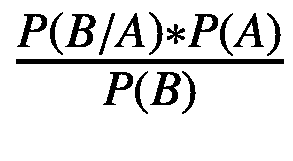
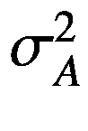
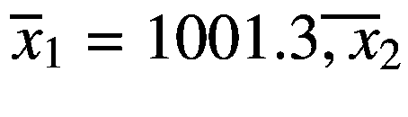
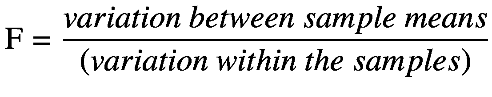
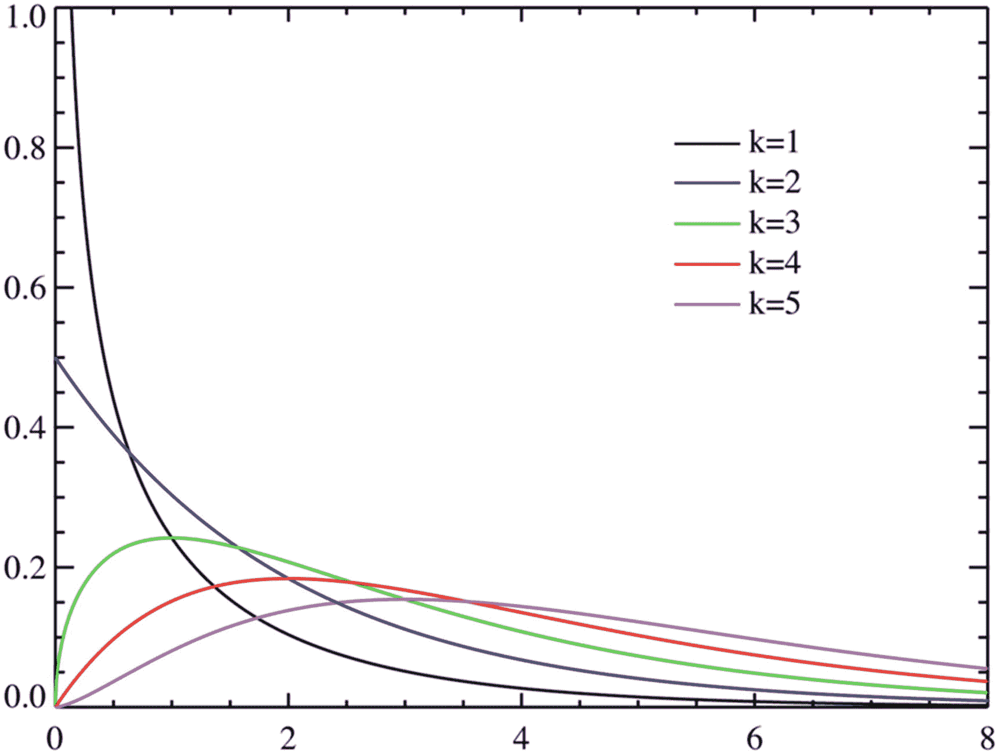

# 九、使用 Python 实现统计和概率

在前一章中，我们学习了如何通过解决一些案例研究来应用您的数据分析知识。

现在，在这本书的最后一部分，我们将学习统计和概率中的基本概念，并了解如何用 Python 解决统计问题。我们涵盖的主题包括排列和组合、概率、概率规则和贝叶斯定理、概率分布、集中趋势的度量、离差、偏度和峰度、抽样、中心极限定理和假设检验。我们还会查看置信水平、显著性水平、p 值、假设检验、参数检验(单样本和双样本 z 检验、单样本和双样本 t 检验、配对检验、方差分析[ANOVA])和非参数检验(卡方检验)。

## 排列和组合

让我们看一些定义、公式和例子，它们将帮助我们理解排列和组合的概念。

组合:我们可以选择一组对象的各种方式。

下面的公式给出了我们可以从给定数量的物体中形成的组合数量:


在前面的公式中， *n* 是从中抽取对象的较小子集的集合中对象的总数， *c* 是组合的数目， *r* 是子集中对象的数目。感叹号(！)表示一个数的阶乘。比如 x！是从 1 到 x 的所有整数的乘积。

(x！=x*(x-1) *(x-2) …。*1)

现在让我们解决一个涉及组合的简单问题。

问题:找出总共五种口味的冰淇淋圣代中包含三种口味的方法。

答:设五味为 A、B、C、D、e，手工解出这道题，可以得到以下组合:

*   A，B，C|B，C，D|A，C，D | B，D|C，D，E|B，D，E|A，B，E|A，B，E|A，D，E | A，C，E | E

如我们所见，有十种组合。如果我们应用 *nc* <sub>*r*</sub> 公式，其中 *n* 为 5， *r* 为 3，我们得到相同的答案(5 *C* <sub>3</sub> = 10)。

现在让我们看看什么是排列。

排列类似于组合，但在这里，对象排列的顺序很重要。

下面的公式给出了排列的个数:


考虑同样的冰淇淋例子，让我们看看我们能得到多少种排列，也就是说，从总共五种口味中选择和排列三种口味的方式的数量。

1.  ABC|CBA|BCA|ACB|CAB|BAC

2.  BCD|CDB|BDC|CBD|DBC|DCB

3.  ACD|ADC|DAC|DCA|CAD|CDA

4.  ABD|ADB|BAD|BDA|DAB|DBA

5.  CDE|CED|DCE|DEC|ECD|EDC

6.  bde | bed | dbe | deb |同上|EDB

7.  ABE|AEB|BEA|BAE|EAB|EBA

8.  ADE|AED|DAE|DEA|EAD|EDA

9.  ACE|AEC|CAE|CEA|EAC|ECA

10.  BCE|BEC|CBE|CEB|EBC|ECB

正如我们所看到的，我们可以得到每种组合的六种可能的排列。因此，排列总数= 10*6 = 60。公式(其中 *n* =5、 *r* =3)也给出了同样的答案(60)。

解决涉及排列问题的另一种方法如下:

1.  首先选择物品:用 5 种*C*T2】3 方式从五种口味中选择三种口味

2.  现在安排 3 中的三个项目！方法

3.  将步骤 1 和步骤 2 的结果相乘。排列总数= 5*C*<sub>3</sub>∫3！= 60

现在我们已经理解了排列和组合的概念，让我们看看概率的本质。

## 可能性

下面给出几个与概率相关的重要概念。

随机实验:这是导致确定结果的任何程序，可以在相同条件下重复任何次数。

结果:单一实验的结果。

样本空间:包含实验所有可能结果的详尽列表。

事件:事件可以包含单个结果或多个结果的组合。事件是样本空间的子集。

概率:对事件可能性的定量度量。任何事件的概率总是介于 0 和 1 之间。0 表示事件不可能发生，1 表示事件一定会发生。

如果字母 X 表示我们的事件，那么概率由符号 P(X)= N(X)/N(S)给出

其中 N(X)=事件 X 中的结果数

N(S)=样本空间中结果的总数

**求解示例:概率**

下面是一个简单的概率问题。

**问题**:一个实验中，一个骰子滚动两次。求两次投掷所得数字相加为 10 的概率。

**解决方案**:

事件 A:掷出第一个骰子。

事件 B:掷出第二个骰子。

样本空间:一个骰子包含 1 到 6 这几个数字，它们出现的概率是相等的。当掷出一个骰子时，结果的总数是六。因为事件“A”和“B”是独立的，所以这两个事件的结果总数= 6*6 = 36。

事件 X:两个数之和为 10。导致这个结果的可能结果包括{4，6}、{6，4}和{5，5 }；也就是说，三种可能的结果的总和是 10。

p(X)=获得和的概率 10 =事件中的结果数 X/总样本空间=3/36=0.0833

### 概率规则

让我们理解概率的各种规则，在表 [9-1](#Tab1) 中解释。

表 9-1

概率规则

<colgroup><col class="tcol1 align-left"> <col class="tcol2 align-left"> <col class="tcol3 align-left"> <col class="tcol4 align-left"></colgroup> 
| 

规则

 | 

描述

 | 

公式

 | 

维恩图

 |
| --- | --- | --- | --- |
| **加法法则** | 加法法则决定了两个事件发生的概率。 | P (A U B) = P(A)+P(B)-P (A ∩ B) |  |
| **特殊加法规则** | 这条规则适用于互斥事件。互斥事件是那些不能同时发生的事件。对于互斥事件，其中任何一个事件发生的概率就是每个事件发生的概率之和。 | P(A U B)= P(A)+P(B) |  |
| **乘法法则** | 乘法规则是提供两个事件同时发生的概率的一般规则。 | P(A ∩ B)=P(A)*P(B/A)P(B/A)是在事件 A 已经发生的情况下，事件 B 发生的*条件概率*。 |  |
| **特殊乘法法则** | 这条规则适用于独立事件。对于独立事件，事件一起发生的概率仅仅是事件概率的乘积。 | 页:1 |  |

注意，表 [9-1](#Tab1) 中列出的公式提供了两个事件的规则，但是这些规则可以扩展到任何数量的事件。

### 条件概率

条件概率包括在考虑到已经发生的另一个事件的概率之后，计算一个事件的概率。考虑图 [9-1](#Fig1) ，它说明了条件概率的原理。


图 9-1

条件概率

图 [9-1](#Fig1) 表明，如果事件“A”依赖于事件“B”，那么样本空间就是事件“B”本身。例如，假设客户从在线零售商处购买了一件产品。设事件的概率为 0.5。，或者换句话说，P(A)=0.5。

现在，假设 B 是客户打算购买的产品收到负面评价的事件。由于这种负面评价，客户购买该产品的可能性现在可能比以前小。假设现在他们购买该产品的可能性只有 30%。换句话说，P(A/B) =顾客在收到负面评价的情况下购买产品的概率= 0.3。

条件概率的公式是 P(A/B) =P (A ∩ B)/P(B)。

## 贝叶斯定理

贝叶斯定理是在给定一些与事件相关的证据的情况下，用于计算事件的条件概率的定理。贝叶斯定理在事件的概率和与之相关的条件的先验知识之间建立了一种数学关系。随着与事件相关的证据的积累，可以更准确地确定该事件的概率。

涉及贝叶斯定理的问题不同于常规的概率问题，我们一般是计算未来可能发生的事件的概率。例如，在一个简单的条件概率问题中，我们可能被要求计算一个人患糖尿病的概率，假设他们是肥胖的。在贝叶斯定理中，我们回溯并计算一个人肥胖的概率，假设他们患有糖尿病。也就是说，如果一个人的糖尿病测试呈阳性，贝叶斯定理将检验他是否肥胖的假设。贝叶斯定理的公式如下:

*P*(*A*/*B*)=

P(A/B)，也叫后验概率，是我们要计算的，也就是给定手头的数据，假设为真的概率。

P(B/A)是在给定假设的情况下，获得证据的概率。

P(A)是*先验概率*，即在我们有任何与之相关的数据之前，假设为真的概率。

P(B)是证据出现的一般概率，没有任何假设，也称为*归一化常数* *。*

贝叶斯定理的应用:下面给出了贝叶斯定理可以应用的几个领域。

*   医学诊断学

*   财务和风险评估

*   垃圾邮件分类

*   执法和犯罪侦查

*   投机

现在，让我们通过几个例子来理解贝叶斯定理在这些领域中的实际应用。

### 贝叶斯定理在医学诊断学中的应用

贝叶斯定理在医学诊断领域有应用，这可以借助下面的假设例子来理解。

问:考虑一个场景，一个人的疾病测试呈阳性。已知这种疾病在任何给定时间都会影响大约 1.2%的人口。对于患有这种疾病的人来说，这种诊断测试的准确率为 85%。对于没有患病的人来说，测试的准确率是 97%。假设这个人的测试结果是阳性，那么他患这种疾病的可能性有多大？

解决方案:

评估医学检验的准确性是贝叶斯定理的应用之一。

让我们首先定义这些事件:

答:人有疾病，也叫假设。

~答:人没有病。

b:这个人的疾病检测呈阳性，也叫证据。

P(A/B):假设这个人的测试结果为阳性，那么这个人患病的概率，也称为*后验概率*(这是我们需要计算的)。

P(B/A):假设患者患有该疾病，则该患者检测呈阳性的概率。该值为 0.85(如问题中给出的，该测试对患有该疾病的人具有 85%的准确性)。

P(A): *先验概率*或者这个人患病的概率，没有任何证据(比如医学测试)。该值为 0.012(如问题中给出的，该疾病影响 1.2%的人口)。

P(B):这个人的这种疾病检测呈阳性的概率。这个概率可以用下面的方式计算。

这个人有两种方法可以检测出阳性:

*   他们患有该疾病，并且测试呈阳性(真阳性)——这种情况发生的概率可以计算如下:

    P(B/A)*P(A)=0.85*0.012=0.0102。

*   他们没有患病，但测试不准确，他们的测试结果呈阳性(假阳性)——发生这种情况的概率可以计算如下:

    P(B/~ A)* P(~ A)=(1-0.97)*(1-0.012)= 0.02964。

    在这里，P(B/~A)指的是对于没有患病的人来说测试呈阳性的概率，即对于没有患病的人来说测试不准确的概率。

    由于这项测试对没有患这种疾病的人有 97%的准确性，它对 3%的病例不准确。

    换句话说，P(B/~A) = 1-0.97。

    同样，P(~A)指的是这个人没有患病的概率。由于我们得到的数据表明这种疾病的发病率为 1.2%，P(~A)为= 1-0.012。

贝叶斯定理方程中的分母 P(B)是前面两个概率的并集=(P(B/A)* P(A))+(P(B/~ A)* P(~ A))= 0.0102+0.2964 = 0.03984

我们现在可以通过在贝叶斯定理公式中插入分子和分母的值来计算我们的最终答案。

P(A/B)= P(B/A)* P(A)/P(B)= 0.85 * 0.012/0.03984 = 0.256

使用贝叶斯定理，我们现在可以得出结论，即使医学测试呈阳性，此人也只有 25.6%的机会患此病。

### 贝叶斯定理的另一个应用:垃圾邮件分类

让我们看看贝叶斯定理在垃圾邮件分类领域的另一个应用。在垃圾邮件过滤器时代之前，没有办法将未经请求的电子邮件与合法邮件分开。人们不得不手动筛选电子邮件来识别垃圾邮件。如今，垃圾邮件过滤器已经自动完成这项任务，并且在识别垃圾邮件和只保留垃圾邮件方面非常有效。贝叶斯方法形成了许多垃圾邮件过滤器背后的原理。考虑下面的例子:

**问题**:假设一封邮件包含单词“offer”，那么它是垃圾邮件的概率有多大？现有数据表明，50%的电子邮件是垃圾邮件。9%的垃圾邮件包含“提议”一词，0.4 %的垃圾邮件包含“提议”一词

**回答**:

将事件和概率定义如下:

答:电子邮件是“垃圾邮件”

~答:邮件是“火腿”

b:邮件里有“offer”这个词

P(A) = 0.5(假设 50%的电子邮件是垃圾邮件)

P(B/A) =包含单词“offer”的垃圾邮件的概率= 0.09 (9%)

P(B/~A) =包含单词“offer”的火腿邮件的概率= 0.004 (0.4%)

应用贝叶斯定理:

p(A/B)=(0.09 * 0.5)/(0.09 * 0.5)+(0.004)*(0.5)= 0.957

换句话说，给定具有单词“offer”的邮件是垃圾邮件的概率是 0.957。

## 科学图书馆

Scipy 是一个用于数学和科学计算的库，它包含了许多领域的函数和算法，包括图像处理、信号处理、聚类、微积分、矩阵和统计。在 SciPy 中，每个区域都有单独的子模块。我们在本章中使用了 *scipy.stats* 子模块，并将该子模块中的函数应用于统计测试和不同类型的分布。该模块还包含距离计算、相关性和列联表的功能。

延伸阅读:

阅读更多关于 *scipy.stats* 模块及其功能的信息:

[T2`https://docs.scipy.org/doc/scipy/reference/stats.html`](https://docs.scipy.org/doc/scipy/reference/stats.html)

## 概率分布

为了理解概率分布，让我们先来看看随机变量的概念，它是用来模拟概率分布的。

随机变量:其值等于与随机实验结果相关的数值的变量。

随机变量有两种类型:

1.  离散随机变量可以取有限的、可数的值。例如，用于调查和问卷以评估回答的李克特量表的随机变量可以取值为 1、2、3、4 和 5。与离散随机变量相关的*概率质量函数*或 *PMF* 是一个函数，它提供该变量恰好等于某个离散值的概率。

2.  连续随机变量可以取无限多的值。例子包括温度、身高和体重。对于连续变量，我们无法找到绝对概率。因此，我们对连续变量使用*概率密度函数*，或 *PDF* (相当于离散变量的 PMF)。PDF 是连续随机变量的值落在一个值范围内的概率。

    累积分布函数(CDF)给出了随机变量小于或等于给定值的概率。它是 PDF 的积分，给出了 PDF 定义的曲线下某一点的面积。

    在下一节中，我们将介绍离散随机变量的两种概率分布:二项式和泊松分布。

### 二项分布

在二项式实验中，有几个独立的试验，每个试验只有两种可能的结果。这些结果是二项离散随机变量的两个值。二项分布的一个基本例子是反复投掷硬币。每次投掷只有两种结果:正面或反面。

以下是二项式分布的特征:

1.  有 *n* 个相同的试验

2.  每次试验都只有两种可能的结果

3.  一项试验的结果不会影响其他试验的结果

4.  每次试验的成功概率( *p* )和失败概率( *q* )是相同的

5.  随机变量代表在这些 *n* 次试验中的成功次数，并且最多可以等于 *n*

6.  二项式分布的均值和方差如下:

    平均值= *n*p* (试验次数*成功概率)

    方差= *n*p*q* (试验次数*成功概率*失败概率)

PMF，或在实验的 *n* 次尝试中 *r* 成功的概率，由以下等式给出:

p(X = r)=<sup>n</sup>C<sub>r</sub>p<sup>r</sup>q<sup>n-r</sup>

其中 *p* 为成功概率， *q* 为失败概率， *n* 为试验次数

#### 二项式分布的形状

二项式分布类似于偏态分布，但随着 *n* 增加和 *p* 变小，它更接近对称，看起来像正态曲线，如图 [9-2](#Fig2) 所示。


图 9-2

不同值的二项式分布

问题:地铁公司对乘坐地铁的八位老年人进行了调查，询问他们对地铁引入的新安全功能的满意度。每个回答只有两个值:是或否。让我们假设基于历史调查，回答“是”的概率是 0.6，回答“否”的概率是 0.4。

计算…的概率

1.  正好有三个人对地铁的新安全功能感到满意

2.  不到五个人满意

解决方案:

1.  对于问题的第一部分:我们可以使用公式<sup>n</sup>C<sub>r</sub>p<sup>r</sup>q<sup>n-r</sup>或者使用 Scipy 函数( *stats.binom.pmf* )来求解，如下所示:

    CODE:

    ```py
    import scipy.stats as stats
    n,r,p=8,3,0.6
    stats.binom.pmf(r,n,p)

    ```

    输出:

    ```py
    0.12386304000000009

    ```

    说明:首先需要导入 *scipy.stats* 模块。然后我们定义三个变量——*n*(试验次数) *r* (成功次数) *p* (失败概率)。之后，调用二项式分布的 PMF(*stats.binom.pdf*)，我们依次传递三个参数- *r* 、 *n* 和 *p* 。使用 *pmf* 函数是因为我们正在计算一个离散变量的概率。

2.  对于问题的第二部分:由于我们需要计算少于五个人满意的概率，变量的极限值是 4。

    下面的等式给出了我们需要计算的概率:

    P(X < = 4)= P(X = 0)+P(X = 1)+P(X = 2)+P(X = 3)+P(X = 4)

    我们可以应用公式<sup>n</sup>C<sub>r</sub>p<sup>r</sup>q<sup>n-r</sup>来计算 *r* = 0、1、2、3 和 4 的值，或者使用 Scipy 中的 *stats.binom.cdf* 函数求解，如下所示:

    CODE:

    ```py
    import scipy.stats as stats
    n,r,p=8,4,0.6
    stats.binom.cdf(r,n,p)

    ```

    Output:

    ```py
    0.40591359999999976

    ```

    说明:当我们计算 x 的多个值的概率时，我们使用 CDF 函数。

### 泊松分布

泊松分布是对给定间隔(通常是时间间隔，但也可以是距离、面积或体积的间隔)内发生的事件数量进行建模的分布。需要知道事件的平均发生率。

泊松分布的 PMF 由以下等式给出:


其中 P(x=r)是事件发生 r 次的概率，r 是事件发生的次数， *λ* <sup>r</sup> 表示该事件发生的平均/预期次数。

泊松分布可用于计算给定时间段内发生的次数，例如:

*   每小时到达餐厅的人数

*   工厂一年内发生的工伤事故数量

*   呼叫中心一周内的客户投诉数量

**泊松分布的性质**:

1.  均值=方差= *λ* 。在泊松分布中，平均值和方差具有相同的数值。

2.  这些事件是独立的、随机的，不能同时发生。

3.  当 *n* 为> 20 并且 *p* 为< 0.1 时，泊松分布可以近似为二项式分布。这里我们用 *λ* = *np* 代替。

4.  当 *n* 的值较大， *p* 在 0.5 左右， *np* > 0.5 时，可以用正态分布来近似二项分布。

#### 泊松分布的形状

泊松分布在形状上是偏斜的，但随着均值( *λ* )的增加，开始类似正态分布，如图 [9-3](#Fig3) 所示。


图 9-3

泊松分布

**泊松分布求解示例:**

在地铁站，平均有两台自动售票机停止工作。假设停止运行的机器数量遵循泊松分布，计算给定时间点的概率:

1.  正好有三台机器停止运转

2.  两台以上的机器停止运转

解决方案:

1.  我们可以使用公式或者用 Python 求解，如下所示:

    CODE:

    ```py
    import scipy.stats as stats
    λ=2
    r=3
    stats.poisson.pmf(r,λ)

    ```

    输出:

    ```py
    0.18044704431548356

    ```

    说明:首先需要导入 *scipy.stats* 模块。然后我们定义两个变量——λ(平均值)和 *r* (事件发生的次数)。然后，泊松分布的 PMF(*stats . Poisson . PMF*)被调用，我们将两个参数传递给这个函数， *r* 和 *λ* ，按此顺序。

2.  由于我们需要计算两台以上机器发生故障的概率，因此我们需要计算以下概率:

    P(x>2)，或者(1-p(x=0)-p(x=1)-p(x=2))。

    这可以使用 *stats.poisson.cdf* 函数来计算，其中 r=2。

    CODE:

    ```py
    import scipy.stats as stats
    λ=2
    r=2
    1-stats.poisson.cdf(r,λ)

    ```

    Output:

    ```py
    0.3233235838169366

    ```

解释:我们遵循与问题第一部分类似的方法，但是使用 CDF 函数( *stats.poisson.cdf* )而不是 PMF ( *stats.poisson.pmf* )。

### 连续概率分布

有几种连续的概率分布，包括正态分布、学生的 T 分布、卡方分布和方差分析分布。在下一节中，我们将探讨正态分布。

### 正态分布

正态分布是一条对称的钟形曲线，由其均值( *μ* )和标准差( *σ* )定义，如图 [9-4](#Fig4) 所示。


图 9-4

正态分布

图 [9-4](#Fig4) 中的四条曲线都是正态分布。平均值用符号 *μ* (mu)表示，标准偏差用符号 *σ* (sigma)表示

正态分布的特征

1.  中心值( *μ* )也是正态分布的众数和中位数

2.  Checking for normality: In a normal distribution, the difference between the 75<sup>th</sup> percentile value (Q3) and the 50<sup>th</sup> percentile value (median or Q2) equals the difference between the median (Q2) and the 25<sup>th</sup> percentile. In other words,

    

如果分布是偏斜的，这个等式就不成立。

在右偏分布中，(*Q*<sub>3</sub>-*Q*<sub>2</sub>)>(*Q*<sub>*2*</sub>*-Q*<sub>*1*</sub>)

在左偏分布中，(*Q*<sub>*2*</sub>*-Q*<sub>*1*</sub>)>(*Q*<sub>*3*</sub>*-Q*<sub>*2*</sub>)

### 标准正态分布

为了标准化单位并比较具有不同均值和方差的分布，我们使用标准正态分布。

标准正态分布的性质:

*   标准正态分布是平均值为 0，标准差为 1 的正态分布。

*   使用以下公式可以将任何正态分布转换为标准正态分布:

    z= ，其中μ和σ为原正态分布的均值和方差。

*   在标准的正态分布中，
    *   68.2%的值位于平均值的 1 个标准偏差内

    *   95.4%的值位于平均值的两个标准偏差之间

    *   99.8%位于平均值的 3 个标准偏差内

数值分布如图 [9-5](#Fig5) 所示。


图 9-5

标准正态分布

*   任意两点之间的标准正态分布下的面积表示位于这两点之间的值的比例。例如，平均值两侧曲线下的面积为 0.5。换句话说，50%的值位于平均值的两边。

有两种类型的问题涉及正态分布:

1.  计算与变量值相对应的概率/比例:使用公式 z= 计算 z 值，然后将该 z 值作为参数传递给 *stats.norm.cdf* 函数

2.  计算给定概率对应的变量的值:首先，通过将概率值作为参数传递给 *stats.norm.ppf* 函数来获得 z 值。然后，我们通过在下面的公式中代入值来获得对应于 z 值的变量(x)的值:z= 

#### **求解实例:标准正态分布**

问题:一家软件公司的 IT 团队正在检查一些笔记本电脑。团队需要选择前 1%的笔记本电脑，标准是最快的启动时间。平均启动时间为 7 秒，标准偏差为 0.5 秒。选择所需的截止启动时间是多少？

解决方案:

步骤 1:由于标准是快速启动时间，感兴趣的启动时间位于分布的左下端，如图 [9-6](#Fig6) 所示。


图 9-6

低尾检验(标准正态分布)

这条尾巴右边的曲线面积是 0.99。我们使用 *stats.norm.ppf* 函数计算 z 值，对应于概率值 0.99:

代码:

```py
stats.norm.ppf(0.99)

```

输出:

```py
2.3263478740408408

```

由于这是一个低尾检验，我们将 z 的值取为–2.33(该值为负，因为它位于平均值的左侧)。我们还可以使用 z 表通过计算对应于概率 0.99 的 z 值来验证这一点。

第二步:应用下面的公式并计算 x

z=(x-μ)/σ

其中 *z =* -2.33， *μ =* 7， *σ =* 0.5。我们需要计算 x 的值:

代码:

```py
x=(-2.33*0.5)+7

```

产量:5.835

推论:所需的引导时间是 5.835 秒

示例 2(标准正态分布):

一家公司生产灯管，这些灯管的寿命(以小时计)遵循平均值为 900 小时、标准偏差为 150 小时的正态分布。计算以下内容:

1.  在最初的 750 小时内失败的管状灯的比例

2.  在 800 到 1100 小时之间失效的灯管比例

3.  多少小时后 20%的灯管灯会失效？

示例 2 的解决方案(标准正态分布):

1.  计算 X=750 对应的 z 值，并获得相应的概率:

    CODE:

    ```py
    x=750
    μ=900
    σ=150
    z=(x-μ)/σ
    z
    stats.norm.cdf(z)

    ```

    Output:

    ```py
    0.15865525393145707

    ```

    推论:15.8%的灯管灯在最初的 750 小时内出现故障。

2.  分别计算 x 值 800 和 1100 对应的 z 值，并减去这些 z 值对应的概率。

    CODE:

    ```py
    x1=800
    x2=1100
    μ=900
    σ=150
    z1=(x1-μ)/σ
    z2=(x2-μ)/σ
    p2=stats.norm.cdf(z2)
    p1=stats.norm.cdf(z1)
    p2-p1

    ```

    输出:

    ```py
    0.6562962427272092

    ```

    推断:大约 65.6%的灯管寿命在 800 到 1100 小时之间，会发生故障。

3.  计算对应于概率 0.2 的 z 值，并通过在公式 z= 中代入 z、 *μ* 和 *σ* 来计算 x

    CODE:

    ```py
    z=stats.norm.ppf(0.2)
    μ=900
    σ=150
    x=μ+σ*z
    x

    ```

    输出:

    ```py
    773.7568149640629

    ```

    推论:在大约 774 小时的寿命后，20%的灯管会失效。

## 集中趋势测量

集中趋势是对数据集中一组值的中心值的度量。以下是集中趋势的一些衡量标准:

*   **Mean** :这是数据集中值的平均值。

*   **Median** :这是数据集中的值按大小排列时的中间数。

*   **Mode** :离散值数据集中出现频率最高的值。

*   百分比:百分比是低于特定值的值的百分比的度量。中位数对应于第 50 百分位。

*   **四分位数**:四分位数是将有序数据集中的值分成四个相等组的值。Q1(或第一个四分位数)对应于第 25 个百分点，Q2 对应于中间值，Q3 对应于第 75 个百分点。

## 离差的度量

离差的度量给出了分布范围的定量度量。它们提供了分布中的值是位于中心值周围还是分散的概念。以下是常用的离差度量。

*   **范围**:范围是数据集中最低值和最高值之差的度量。

*   **四分位数间距**:衡量第三个四分位数和第一个四分位数之间的差异。这种方法受极端值的影响较小，因为它关注的是位于中间的值。四分位间距是有异常值的偏斜分布的一个很好的度量*。*四分位距由 IQR = Q3 - Q1 表示。

*   **方差**:这是对数据集中有多少值分散在平均值周围的度量。方差的值可以很好地表明平均值是否代表数据集中的值。较小的方差将表明平均值是集中趋势的适当度量。下面的公式给出了方差:

    

*   其中μ是平均值， *N* 是数据集中值的数量。

*   **标准差**:这个指标是通过取方差的平方根来计算的。方差与数据的单位不同，因为它是差值的平方；因此，对方差求平方根会使其达到与数据相同的单位。例如，在关于以厘米为单位的平均降雨量的数据集中，方差将给出以 *cm* <sup>2</sup> 为单位的值，这将是不可解释的，而以 cm 为单位的标准差将给出以厘米为单位的平均降雨量偏差的概念。

## 形状的度量

**偏斜度**:这度量了一个分布的不对称程度，如图 [9-7](#Fig7) 所示。


图 9-7

具有不同偏斜度的分布

从图 [9-7](#Fig7) 中我们可以观察到以下情况:

在正偏态分布中，平均值>中位数

在负偏态分布中，平均值

在完全对称的分布中，均值=中位数=众数

**峰度**

峰度是对给定的数据分布是曲线、尖峰还是平坦的一种度量。

中层顶分布有一条钟形曲线。薄峰分布是一种有明显峰值的分布。顾名思义，平顶分布有一条平坦的曲线。这些分布如图 [9-8](#Fig8) 所示。


图 9-8

峰度的表示

**求解示例:**

某小学 3-7 岁儿童体重(公斤)如下:19，23，19，18，25，16，17，19，15，23，21，23，21，11，6。让我们来计算集中趋势、离差、偏斜度和峰度。

创建 Pandas 系列对象:

代码:

```py
import pandas as pd
a=pd.Series([19,23,19,18,25,16,17,19,15,23,21,23,21,11,6])

```

Pandas *describe* 方法既可以用于 series 对象，也可以用于 DataFrame 对象，是一种在一行代码中获得大多数集中趋势度量的便捷方法。平均值为 18.4 千克，第一个四分位数(Q1 或第 25 个<sup>第</sup>百分位数)为 16.5 千克，中位数(第 50 个<sup>第</sup>百分位数)为 19 千克，第三个四分位数(第 75 个<sup>第</sup>百分位数)为 22 千克。

代码:

```py
a.describe()

```

输出:

```py
count    15.000000
mean     18.400000
std       4.997142
min       6.000000
25%      16.500000
50%      19.000000
75%      22.000000
max      25.000000
dtype: float64

```

使用*模式*方法获得模式:

代码:

```py
a.mode()

```

输出:

```py
0    19
1    23
dtype: int64

```

值 19 和 23 是最常出现的值。

**获得离散度的测量值**

可以使用*最大值*和*最小值*函数并取这两个值之间的差值来计算范围:

代码:

```py
range_a=max(a)-min(a)
range_a

```

输出:

```py
19

```

分别使用 *std* 和 *var* 方法获得标准差和方差:

代码:

```py
a.std()

```

输出:

```py
4.99714204034952

```

代码:

```py
a.var()

```

输出:

```py
24.97142857142857

```

**通过使用来自 *scipy.stats* 模块的*偏斜度*和*峰度*函数，获得偏斜度和峰度的度量值**:

代码:

```py
from scipy.stats import skew,kurtosis
stats.kurtosis(a)

```

输出:

```py
0.6995494033062934

```

峰度的正值意味着分布是细峰的。

偏斜度:

代码:

```py
stats.skew(a)

```

输出:

```py
-1.038344732097918

```

负的偏态值意味着分布是负偏态的，平均值小于中值。

注意事项:

1.  平均值受到异常值(极值)的影响。每当数据集中有异常值时，最好使用中位数。

2.  标准差和方差与平均值密切相关。因此，如果存在异常值，标准差和方差可能也不是代表性的度量。

3.  该模式通常用于离散数据，因为连续数据可能有多个模态值。

## 抽样

当我们试图了解一个群体时，从群体中的每一个受试者那里收集数据是不实际的。更可行的方法是抽取样本，根据样本数据对总体参数进行估计。样本的特征应该与总体的特征一致。以下是采集样本的主要方法。

### 概率抽样

概率抽样包括从人群中随机选择受试者。进行概率抽样有四种主要方法:

1.  简单随机抽样:受试者是随机选择的，没有任何偏好。群体中的每个受试者都有同等的被选中的可能性。

2.  分层随机抽样:将人群分为互斥(非重叠)的组，然后从每组中随机抽取受试者。例如:如果你正在调查评估一所学校对科目的偏好，你可以将学生分成男女两组，并从每组中随机选择科目。这种方法的优点是它代表了总体中的所有类别或组。

3.  系统随机抽样:定期选择受试者。例如:从 500 人中抽取 100 人作为样本，首先将 500 除以 100，等于 5。现在，每五个人中选一个作为我们的样本。它更容易执行，但可能无法代表群体中的所有受试者。

4.  整群抽样:在这里，总体被分成不重叠的群，群之间覆盖整个总体。从这些集群中，随机选择一些。要么选择所选聚类的所有成员(一阶段)，要么随机选择所选聚类的成员子集(两阶段)。这种方法的优点是成本更低，实施更方便。

### 非概率抽样

当由于缺乏现成可用的数据而无法使用概率抽样方法收集样本时，我们使用非概率抽样技术。在非概率抽样中，我们不知道受试者被选中进行研究的概率。

它分为以下几种类型:

1.  方便取样:在这种方法中选择容易接近或可用的受试者。例如，研究人员可以从他们的工作场所或他们工作的大学选择研究对象。这种方法很容易实现，但可能无法代表总体。

2.  目的性:根据取样的目的选择受试者。例如，如果正在进行一项调查以评估间歇性禁食的有效性，则需要考虑可以进行这种禁食的人群的年龄组，该调查可能只包括 25-50 岁的人。目的性抽样进一步分为
    *   配额抽样:采取配额的方式是在选择样本时考虑到人口的重要特征。如果人口中有 60%的白种人、20%的西班牙人和 20%的亚洲人，那么您选择的样本应该具有相同的百分比。

    *   滚雪球抽样:在这种方法中，研究人员找出他们认识的符合研究标准的人。然后，这个人把他可能认识的人介绍给其他人，这样，样本群体就通过口口相传而增长。该技术可用于缺乏可见性的人群，例如，对患有未被充分报道的疾病的人群的调查。

## 中心极限定理

中心极限定理指出，如果我们从总体中选择样本，样本的平均值是正态分布的，平均值为 *μ* ，标准差为

即使总体分布本身不是正态分布，样本均值的分布也类似于正态分布。随着样本量的增加，样本均值的分布变得更接近正态分布，如图 [9-9](#Fig9) 所示。


图 9-9

样本均值的分布。随着样本量的增加，样本均值的分布类似于正态分布

样本平均值用作总体平均值的估计值，但这种抽样分布的标准差(，与总体标准差，*∑*不同。样本标准差与总体标准差的关系如下:


被称为标准误差(样本分布的平均值)。随着样本量( *n* 增加，标准差趋近于 0，样本均值(趋近于总体均值( *μ* )。

### 估计值和置信区间

*   **点估计**:从样本中提取的单一统计量，用于估计未知总体参数。样本平均值用作总体平均值的点估计。

*   **区间估计**:总体参数所在的大范围数值。它表示估计总体参数的误差。

*   **置信区间**:总体均值所在的区间。对于从总体中抽取的大小为 *n* 和均值为的随机样本(标准偏差为 *σ* ，均值为 *μ* ，总体均值的置信区间由以下等式给出:
    *   :已知总体标准差*∑*

    *   :当总体标准差未知时(此方程中的 *s* 为样本标准差)

**求解示例:置信区间**

问题:样本(由 10 名受试者组成)取自某一学生群体。这些学生的平均绩点呈正态分布。总体标准偏差未知。基于以下样本值计算总体平均值(整个学生群体的平均绩点)的 95%置信区间:3.1、2.9、3.2、3.4、3.7、3.9、3.9、2.8、3.4、3.6。

解决方案:

以下代码计算总体平均值的 95%置信区间:

代码:

```py
import numpy as np
import scipy.stats as stats
grades = np.array([3.1,2.9,3.2,3.4,3.7,3.9,3.9,2.8,3.4,3.6])
stats.t.interval(0.95, len(grades)-1, loc=np.mean(grades), scale=stats.sem(grades))

```

输出:

```py
(3.1110006165952773, 3.668999383404722)

```

解释:学生群体的平均绩点有 95%的可能性落在 3.11 和 3.67 之间。

前面代码的解释:我们首先为样本观测值定义一个 NumPy 数组，然后调用 *stats.t.interval* 函数。我们向该函数传递以下参数:置信区间的值(0.05)、自由度(观察总数:1)、样本均值和标准误差(由函数 *stats.sem* 计算)。该函数返回两个值–置信区间下限(LCI)和置信区间上限(UCI)。请注意，使用 *stats.t.interval* 函数是因为总体标准偏差未知。如果它是已知的，我们将使用函数 *stats.norm.interval.*

## 抽样误差的类型

如果我们抽取一个样本，并根据这个样本对整个总体进行推断，那么不可避免地会出现误差。这些错误可以大致分类如下:

*   抽样误差:总体样本估计值与实际总体估计值之间的差异

*   覆盖误差:当人口没有被充分代表，一些群体被排除在外时发生

*   无应答错误:当我们未能纳入满足研究标准的无应答受试者，但由于他们没有回答调查问题而被排除在外时发生

*   测量误差:由于测量方法或工具的缺陷，没有测量出正确的参数

我们现在继续假设检验的概念。

## 假设检验

假设是给出未知变量或参数估计值的陈述。如果我们试图从这个人口中抽取一个样本来找出一个城市中的人的平均年龄，并且我们发现这个样本中的人的平均年龄是 34 岁，我们的假设陈述可以如下:“这个城市中的人的平均年龄是 34 岁。”

### **假设检验的基本概念**

在假设检验中，我们构建两个陈述，称为无效假设和交替假设。

*   **零假设**:用术语 *H* <sub>0</sub> 表示，这是需要检验的假设。它基于现状不变的原则。如果样本均值为 70，而历史总体均值为 90，则零假设将表明总体均值等于 90。

*   **备选假设**:用术语*H*T4】1 表示，如果原假设不成立，那么这个假设就是人们所相信的。另一个假设(使用前面的例子)是平均值大于、小于或不等于 90。

我们要么拒绝零假设，要么不能拒绝零假设。请注意，拒绝零假设并不意味着替代假设是正确的。假设检验的结果只是暗示或表明关于总体的一些情况，并不能最终证明或否定任何假设。

### **假设检验中使用的关键术语**

让我们看看假设检验中的一些常用术语:

**第一类错误，**或显著性的 l **水平**，用符号 ***α*** 表示，是当其为真时拒绝零假设的错误。它也可以定义为总体参数位于其置信区间之外的概率。如果置信区间为 95%，显著性水平为 0.05，或者总体参数有 5%的可能性不在根据样本计算的置信区间内。

第一类错误的例子:X 先生出了皮疹，他去医生那里做水痘测试。假设他没有这种疾病。医生基于一些错误的测试错误地做出了水痘的诊断，但事实是 X 先生并没有这种疾病。这是一个当零假设为真时拒绝零假设的典型例子，这就是 1 型错误。

**第二类误差**，用符号 *β* 表示，是零假设为假时不被拒绝时出现的误差。在前面的水痘例子中，如果 X 先生患有水痘，但医生没有诊断它，医生正在犯 2 型错误。

**单样本检验**:这是一种在考虑只有一个总体时使用的检验，取一个样本来观察从样本和总体参数计算的值之间是否有差异。

**双样本检验**:这是一种从两个不同人群中抽取样本的检验。这有助于根据样本参数评估总体参数是否不同。

**关键检验统计量**:决定是否拒绝零假设的样本检验统计量的极限值。在图 [9-10](#Fig10) 中，z=1.96 和 z=-1.96 为临界值。大于 1.96 且小于-1.96 的 z 值导致无效假设被拒绝。

**拒绝区域**:拒绝零假设的取值范围。接受区域是与零假设成立的极限相对应的区域。

拒绝和接受的区域如图 [9-10](#Fig10) 所示。


图 9-10

接受和拒绝的区域

**双尾检验**:拒绝区域位于分布的两个尾部。

双尾检验的例子:从一个有 50 名学生的班级中抽取 10 名学生的样本，以查看该班级的平均分数相对于其历史平均分数是否有变化。这是一个我们将进行双尾检验的例子，因为我们只是在检验均值的变化，我们不知道这种变化是正的还是负的。

**单尾测试**:拒绝区域位于右尾(上单尾)或左尾(下单尾)，但不在两条尾巴上。

一个 50 人的班级正在进行课外辅导以提高成绩。这些特殊的班级被认为提高了分数。为了检验这一假设，我们使用总体样本进行了单尾检验(上图),因为我们在检验平均分数是否增加了。拒绝区域将位于右尾。

低尾测试的例子:由于政治动荡，学生旷课的情况有所增加。据信，这些事件可能会对学生的成绩产生负面影响。为了检验这一假设，我们使用总体样本进行了单尾检验(下方),因为我们在检验平均分数是否降低了。排斥区位于左尾巴。

p 值 **(** 用字母 *p* **)** 表示假设零假设为真，获得一个至少与观测值一样极端的检验统计值的概率。p 值通常用于假设检验，以决定是否拒绝无效假设。p 值通常与 0.05 的显著性水平进行比较。

如果 *p < 0.05* ，这将意味着样本数据是随机的且不代表总体的概率非常低。在这种情况下，我们拒绝零假设。

如果 *p > 0.05* ，则该样本不代表总体的可能性较大。在这种情况下，我们不能拒绝零假设。

### 假设检验的步骤

1.  陈述无效假设和替代假设

2.  确定显著性水平，获得检验统计量的临界值

3.  选择适当的测试:

    Choose the test based on the following parameters:
    *   样本数目

    *   人口是否正态分布

    *   正在测试的统计数据

    *   样本量

    *   总体标准差是否已知

4.  获取相关的检验统计量(z 统计量/t 统计量/卡方统计量/f 统计量)或 p 值

5.  将关键测试统计数据与计算的测试静态数据进行比较，或将 p 值与 0.05 进行比较

    Reject the null hypothesis based on either the test statistic or the p-value:
    *   Using the test statistic:
        *   计算测试静态>临界测试统计(上尾测试)

        *   计算的测试静态

        运筹学

    *   如果 p<0.05，则使用 p 值(p)

6.  根据前面的比较得出一个推论

## 单样本 z 检验

当我们想要验证总体均值是否不同于其历史值或假设值时，使用该检验。

单样本 z 检验的标准:

*   从中抽取样本的总体是正态分布的

*   样本量大于 30

*   抽取一个样本

*   我们正在测试总体平均值

*   总体标准差是已知的

测试统计量的计算公式:，

其中为样本均值， *μ* 为总体均值， *σ* 为总体标准差， *n* 为样本量

**求解示例:单样本 z 检验**

问题:当地一家意大利餐厅的平均配送时间为 45 分钟，标准差为 5 分钟。餐厅收到了一些顾客的投诉，并决定分析最近的 40 份订单。这 40 份订单的平均交货时间为 48 分钟。在 5%的显著性水平上进行适当的测试，以确定交付时间是否增加了。

回答:

1.  陈述假设:

    设 *μ* 为餐厅的平均送货时间(总体平均值)

    零假设: *H* <sub>0</sub> : *μ* =45

    备选假设:*H*<sub>1</sub>:*μ*>45

2.  确定显著性水平: *α* =0.05

3.  Select the appropriate hypothesis test:
    *   样本数量:1

    *   样本量: *n* =40(大)

    *   我们要检验的是:样本均值( 48)和总体均值( *μ* =45)之间是否存在差异

    *   已知总体标准差( *σ* =5)

    我们根据前面的数据选择单样本 z 检验。

4.  Obtain the test statistic and p-value, with the help of the following equation:

    

    Substituting the values 48, *μ*=45, *σ* = 5, and *n*=40:

    ```py
    z=3.7947

    ```

    使用 *stats.norm.cdf* 函数计算与此 z 值对应的 p 值:

    CODE:

    ```py
    import scipy.stats as stats
    stats.norm.cdf(z)

    ```

    Output:

    ```py
    0.999

    ```

5.  比较 p 值和显著性水平(0.05):

    由于计算的 p 值是> *α* ，我们无法拒绝零假设。

6.  推论:

    在 0.05 的水平上，样本的平均交付时间和历史总体平均值之间没有显著差异。

## 双样本样本 z 检验

双样本 z 检验与单样本 z 检验相似，唯一的区别如下:

*   考虑两个群体/人群，我们从每个人群中抽取一个样本

*   两种总体分布都是正态分布

*   两个总体标准偏差都是已知的

*   计算检验统计量的公式:![$$ :z=\frac{\left({\overline{x}}_1-{\overline{x}}_2\right)}{\sqrt{\left[\frac{\sigma_1^2}{n_1}+\frac{\sigma_2^2}{n_2}\right]}} $$](img/498042_1_En_9_Chapter_TeX_IEq19.png)

**求解示例:双样本样本 z 检验**

某组织在 A 和 b 两个生产单元生产 LED 灯泡，质量控制团队认为 A 单元的生产质量优于 b 单元，质量是通过灯泡工作的时间来衡量的。该小组从两个单位提取样本进行测试。单元 A 和单元 B 的 LED 灯泡平均寿命分别为 1001.3 和 810.47。样品尺寸为 40 和 44。已知总体方差: =48127 和 =59173。

在 5%的显著性水平上进行适当的测试，以验证质量控制团队的声明。

解决方案:

1.  陈述假设:

    设 A、B 单元的 LED 灯泡平均寿命分别为 *μ* <sub>*A*</sub> *和μ* <sub>*B*</sub> 。

    零假设:*H*<sub>0</sub>:*μ*<sub>*A*</sub>≤*μ*<sub>*B*</sub>

    候补假设:*H*<sub>1</sub>:*μ*<sub>*A*</sub>>*μ*<sub>*B*</sub>

    这是一个单尾(上尾)测试

2.  确定显著性水平: *α* =0.05

3.  选择适当的假设检验:
    *   样本数量:2 个样本(从两个不同的人群中抽取样本)

    *   样本量:大( *n* <sub>*A*</sub> = 40，以及 *n* <sub>*B*</sub> = 44)

    *   我们测试的内容:比较单元 A 和单元 B 中 LED 灯泡的平均寿命

    *   人口特征:人口的分布是未知的，但人口方差是已知的

        因此，我们进行双样本 z 检验。

4.  计算检验统计量和 p 值

    Use the following equation:

    ![$$ z=\frac{\left({\overline{x}}_1-{\overline{x}}_2\right)}{\sqrt{\left[\frac{\sigma_1^2}{n_1}+\frac{\sigma_2^2}{n_2}\right]}} $$](img/498042_1_En_9_Chapter_TeX_Equi.png)

    将值 =810.47， *n* <sub> 1 </sub> = 40， *n* <sub> 2 </sub> = 44 以及方差(sigma)值 48127 和 59173 代入上式计算 *z* :

    CODE:

    ```py
    z=(1001.34-810.47)/(48127/40+59173/44)**0.5

    ```

    Output:

    ```py
    3.781260568723408

    ```

    使用 *stats.norm.cdf* 函数计算与此 z 值对应的 p 值:

    CODE:

    ```py
    import scipy.stats as stats
    p=1-stats.norm.cdf(z)
    p

    ```

    Output:

    ```py
    7.801812433294586e-05

    ```

    说明:由于这是一个上尾检验，我们需要计算右尾中值的面积/比例。因此，我们从 1 中减去计算的面积( *stats.norm.cdf* )。

5.  将计算的 p 值与显著性水平进行比较:

    由于计算出的 p 值(0.000078) < *α* (0.05)，我们拒绝零假设。

6.  推断:在单位 A 生产的 LED 灯泡比在单位 B 生产的 LED 灯泡有明显更长的寿命，在 5%的水平。

## 比例假设检验

比例检验用于名义数据，对于比较百分比或比例很有用。例如，从组织中的一个部门收集反馈的调查可能声称组织中 85%的人对其政策感到满意。历史上满意率一直是 82%。这里，我们将样本中的百分比或比例与总体中的百分比/比例进行比较。以下是比例抽样分布的一些特征:

*   从样本中取出的比例的抽样分布是近似正态的

*   本次抽样分布的均值( ) =人口比例( *p* )

*   Calculating the test statistic: The following equation gives the z-value

    

其中为样本比例， *p* 为总体比例， *n* 为样本量。

**求解示例:单样本比例 z 检验**

这里，我们使用一个已解决的示例来理解单样本比例 z 检验。

问:众所周知，40%的客户对移动服务中心提供的服务感到满意。该中心的客户服务部决定进行一项调查，以评估目前的客户满意率。它调查了 100 个客户，发现 100 个客户中只有 30 个对它的服务满意。在 5%的显著性水平上进行假设检验，以确定满意客户的百分比是否比最初的满意度(40%)有所下降。

解决方案:

1.  陈述无效假设和替代假设

    设平均顾客满意率为 *p*

    *H*<sub>T3o</sub>:*p*= 0 4

    *H*<sub>1</sub>:*p*T6】0 4

2.  确定显著性水平: *α* =0.05

3.  选择适当的测试:

    We choose the one-sample z-test for proportions since
    *   样本量很大(100)

    *   取一个样本

    *   我们正在测试人口比例的变化

4.  Obtain the relevant test statistic and p-value

    

    其中

    计算 z 和 p:

    CODE:

    ```py
    import scipy.stats as stats

    z=(0.3-0.4)/((0.4)*(1-0.4)/100)**0.5
    p=stats.norm.cdf(z)
    p

    ```

    Output:

    ```py
    0.02061341666858179

    ```

5.  决定是否拒绝零假设

    p 值(0.02)<0.05 →我们拒绝零假设

6.  推论:在 5%的显著性水平上，对服务中心的服务满意的顾客百分比降低了

### 总体比例的双样本 z 检验

这里，我们比较来自两个不同人群的两个独立样本的比例。下面的等式给出了临界测试统计量的公式:


在上式中，是来自第一个样本的比例，是来自第二个样本的比例。 *N* <sub>1</sub> 为第一个样本的样本量， *N* <sub>2</sub> 为第二个样本的样本量。

*p* <sub>*c*</sub> 为合并方差。

=；=；

在前面的公式中， *x* <sub>1</sub> 是第一个样本的成功次数， *x* <sub>2</sub> 是第二个样本的成功次数。

让我们借助一个例子来理解两样本比例检验。

问题:一家拼车公司正在调查其司机的投诉，即一些乘客(带着孩子旅行)不符合儿童安全指南(例如，没有带儿童座椅或没有使用安全带)。该公司在两个主要城市进行调查。调查是独立收集的，每个城市抽取一个样本。从收集的数据来看，城市 B 中的乘客似乎比城市 a 中的乘客更不合规。执法机构想知道这两个城市符合儿童安全指南的乘客比例是否不同。下表给出了这两个城市的数据:

<colgroup><col class="tcol1 align-left"> <col class="tcol2 align-left"> <col class="tcol3 align-left"></colgroup> 
|   | 

**A 城**

 | 

**城市 B**

 |
| --- | --- | --- |
| 调查总数 | Two hundred | Two hundred and thirty |
| 符合标准的人数 | One hundred and ten | One hundred and six |

在 5%的显著性水平上进行适当的测试，以检验假设。

解决方案:

1.  陈述假设:

    设 *p* <sub>*A*</sub> 为 A 市符合规范的人数比例 *p* <sub>*B*</sub> 为 B 市符合标准的人数比例。

    零假设:*H*<sub>0</sub>:*p*<sub>*A*</sub>=*p*<sub>*B*</sub>

    候补假设:*H*<sub>1</sub>:*p*<sub>*A*</sub>！=*p*T12*B*T15】

    这将是一个双尾检验，因为排斥区可能位于两侧。

2.  选择适当的假设检验:
    *   样本数量:2(从两个不同的城市取样)

    *   样本量:大( *N* <sub>1</sub> = 200， *N* <sub>2</sub> = 230)

    *   我们测试的是:两个城市符合儿童安全指南的乘客比例是否不同

    *   人口特征:人口分布未知；人口差异是未知的。由于样本量很大，我们选择了双样本 z 检验的比例。

3.  确定显著性水平: *α* =0.05

4.  计算检验统计量和 p 值

    Using the following equation:

    

    使用 *stats.norm.cdf* 函数计算与此 z 值对应的 p 值:

    CODE:

    ```py
    x1,n1,x2,n2=110,200,106,230
    p1=x1/n1
    p2=x2/n2
    pc=(x1+x2)/(n1+n2)
    z=(p1-p2)/(((pc*(1-pc)/n1)+(pc*(1-pc)/n2))**0.5)
    p=2*(1-stats.norm.cdf(z))
    p

    ```

    Output:

    ```py
    0.06521749465064053

    ```

5.  将 p 值与显著性水平进行比较:

    由于计算出的 p 值(0.065)> *α* (0.05)，我们未能拒绝零假设。

6.  推断:在 5%的显著性水平上，这些城市遵守儿童安全规范的乘客比例没有显著差异。

## t 分布

可能会出现总体标准差未知、样本量较小的情况。在这种情况下，我们使用 t 分布。这种分布也称为学生的 T 分布。“学生”一词在这里并不具有其字面意义。威廉·希利·戈塞在 1908 年首次发表了这个分布，他使用的笔名是“学生”，因此这个分布被广泛称为学生 T 分布。

以下是 t 分布的主要特征:

*   t 分布在形状上类似于正态分布，只是稍微平坦一些。

*   样本量较小，一般小于 30。

*   t 分布使用自由度的概念。自由度是统计测试中可以独立估计的观察值的数量。让我们用下面的例子来理解自由度的概念:

    假设我们有三个数字:a、b 和 c。我们不知道它们的值，但我们知道这三个数字的平均值，即 5。根据这个平均值，我们计算三个数字的和–15(平均值*值的数量，5*3)。

    我们能给这三个未知数赋值吗？没有；这三个数字中只有两个可以独立分配。假设我们随机地给 a 赋值 4，给 b 赋值 5。现在，c 只能是 6，因为总和必须是 15。因此，即使我们有三个数字，只有两个是自由变化的。

*   随着样本量的减少，自由度减少，换句话说，从样本参数预测总体参数的确定性降低。

    t 分布中的自由度( *df* )是样本数( *n* ) -1，或者换句话说， *df = n -* 1 *。*

单样本 t 检验中的关键检验统计量的公式由以下等式给出:


其中是样本均值， *μ* 是总体均值， *s* 是样本标准差， *n* 是样本量。

### 单一样本 t 检验

单样本 t 检验与单样本 z 检验相似，但有以下区别:

1.  样本量较小(< 30)。

2.  总体标准差未知；我们使用样本标准偏差来计算标准误差。

3.  The critical statistic here is the t-statistic, given by the following formula:

    

### **双样本 t 检验**

当我们从两个总体中抽取样本时，使用双样本 t 检验，这两个总体的样本量都小于 30，并且两个总体的标准差都是未知的。

公式:


其中是样本均值

自由度:df =*n*<sub>1</sub>+*n*T6】22

汇总方差:

### 成对样本的双样本 t 检验

该检验用于比较相互依赖的样本的总体均值，也就是说，使用同一个检验组对样本值进行两次测量。

该等式给出了配对双样本 t 检验的检验统计量的临界值:


其中是两个样本元素之差的平均值。两个样本大小相同， *n* 。

*S* =两个样本元素之差的标准差=


## 已解决的示例:使用 Scipy 函数进行 t 测试

Scipy 库为 t-test 提供了各种功能。在下面的例子中，我们来看看单样本 t 检验、双样本 t 检验和配对 t 检验的函数。

1.  **用 Scipy 进行单样本 t 检验**:

    问题:一家培训机构有 200 名学生，他们正在为学生准备考试，而学生在模拟考试中的平均成绩是 80 分。它抽取了 9 名学生的样本，并记录了他们的分数；好像现在平均分提高了。这是这十个学生的分数:80，87，80，75，79，78，89，84，88。

    在 5%的显著性水平上进行假设检验，以验证平均分是否有显著提高。

    解决方案:

    我们使用单样本 t 检验，因为样本量很小，总体标准偏差未知。让我们阐明无效假设和替代假设。

    *H* <sub>0</sub> : *μ* = 80

    *h*<sub>:*>80*</sub>

     *首先，用样本观察值创建一个 NumPy 数组:

    代码:

    ```py
    a=np.array([80,87,80,75,79,78,89,84,88])

    ```

    现在，调用 *stats.ttest_1samp* 函数，并传递这个数组和总体平均值。该函数返回 t 统计量和 p 值。

    CODE:

    ```py
    stats.ttest_1samp(a,80)

    ```

    Output:

    ```py
    Ttest_1sampResult(statistic=1.348399724926488,  pvalue=0.21445866072113726)

    ```

    决策:由于 p 值大于 0.05，我们无法拒绝零假设。因此，我们不能断定学生的平均分发生了变化。*
**   **双样本 t 检验(独立样本)**:

    问:一个教练学院在两个不同的城市有中心。它从每个中心抽取 10 名学生作为样本，记录他们的分数，如下所示:

    中心 A: 80，87，80，75，79，78，89，84，88

    中心 B: 81，74，70，73，76，73，81，82，84

    在 5%的显著性水平上进行假设检验，并验证这两个中心的学生的平均分是否有显著差异。

    解决方案:

    我们使用双样本 t 检验，因为我们从两个独立的组中抽取样本。样本量很小，总体的标准偏差未知。设这些中心每个学生的平均分分别为 *μ* <sub>1</sub> *和μ* <sub>2</sub> 。无效假设和替代假设如下:

    *h*<sub>【0】</sub>:

     ***h*<sub>:*！=*<sub>【2】</sub>**</sub>

     **为每个样本创建 NumPy 数组:

    CODE:

    ```py
    a=np.array([80,87,80,75,79,78,89,84,88])
    b=np.array([81,74,70,73,76,73,81,82,84])

    ```

    调用 *stats.ttest_ind* 函数进行双样本 t 检验，并将这些数组作为参数传递:

    CODE:

    ```py
    stats.ttest_ind(a,b)

    ```

    Output:

    ```py
    Ttest_indResult(statistic=2.1892354788555664, pvalue=0.04374951024120649)

    ```

    推论:我们可以得出结论，由于 p 值小于 0.05，教练学院两个中心的学生平均分存在显著差异。*******   **配对样本的 T 检验**:

    问题:教练学院正在开展一项特别计划来提高学生的表现。同一套学生的成绩在专项前后进行对比。在 5%的显著性水平上进行假设检验，以验证分数是否因为该计划而有所提高。

    解决方案:

    CODE:

    ```py
    a=np.array([80,87,80,75,79,78,89,84,88])
    b=np.array([81,89,83,81,79,82,90,82,90])

    ```

    调用 *stats.ttest_rel* 函数进行双样本 t 检验，并将这些数组作为参数传递:

    代码:

    ```py
    stats.ttest_rel(a,b)

    ```

    Output:

    ```py
    Ttest_relResult(statistic=-2.4473735525455615, pvalue=0.040100656419513776)

    ```

     ***

 **我们可以得出结论，在 5%的显著性水平上，由于 p 值小于 0.05，在实施特殊计划后，平均分有所提高。

## 方差分析

方差分析是一种用于比较两个以上群体平均值的方法。到目前为止，我们只考虑了单个群体或最多两个群体。方差分析中使用的统计分布是 f 分布，其特征如下:


图 9-11

f 分布的形状

1.  如图 [9-11](#Fig11) 所示，f 分布有一个单独的尾部(向右)，并且只包含正值。

1.  The F-statistic, which is the critical statistic in ANOVA, is the ratio of variation between the sample means to the variation within the sample. The formula is as follows.

    

2.  不同的人群被称为治疗。

3.  较高的 F 统计值意味着与样本内的差异相比，样本间的差异相当大。换句话说，从中抽取样本的人群或处理实际上是互不相同的。

4.  当样本内的差异相当大时，处理之间的随机差异更有可能发生。

**求解示例:方差分析**

**问题**:

一些农业研究科学家已经种植了一种叫做“AB 棉”的新品种棉花。他们使用了三种不同的肥料——A、B 和 C——用于这一品种的三块独立的土地。研究人员想弄清楚产量是否随着所用肥料的种类而变化。下表列出了每英亩蒲式耳的产量。在 5%的显著性水平上进行 ANOVA 测试，看看研究人员是否可以得出产量存在差异的结论。

<colgroup><col class="tcol1 align-left"> <col class="tcol2 align-left"> <col class="tcol3 align-left"></colgroup> 
| 

**肥料 A**

 | 

**肥料 B**

 | 

**肥料 C**

 |
| --- | --- | --- |
| Forty | Forty-five | Fifty-five |
| Thirty | Thirty-five | Forty |
| Thirty-five | Fifty-five | Thirty |
| Forty-five | Twenty-five | Twenty |

解决方案:

1.  陈述无效假设和替代假设:

    设三个群体的平均产量分别为*μ*<sub>1</sub>*μ*<sub>2</sub>*和μ* <sub>3</sub>

    零假设:*H*<sub>0</sub>:*μ*<sub>1</sub>=*μ*<sub>2</sub>=*μ*<sub>3</sub>

    备选假设:*H*<sub>1</sub>:*μ*<sub>1</sub>！=*μ*T10】2！=*μ*T14】3

2.  选择适当的测试:

    我们选择 ANOVA 检验是因为我们比较的是三个群体的平均值

3.  确定显著性水平: *α* =0.05

4.  计算临界测试统计值/p 值:

    *f_oneway* 函数为我们提供方差分析测试的统计量或 p 值。该函数的参数包括三个列表，其中包含每个组的样本值。

    CODE:

    ```py
    import scipy.stats as stats
    a=[40,30,35,45]
    b=[45,35,55,25]
    c=[55,40,30,20]
    stats.f_oneway(a,b,c)

    ```

    输出:

    ```py
    F_onewayResult(statistic=0.10144927536231883, pvalue=0.9045455407589628)

    ```

5.  由于计算的 p 值(0.904)>0.05，我们无法拒绝零假设。

6.  推论:在 5%的显著性水平上，三种处理之间没有显著差异。

## 关联的卡方检验

卡方检验是一种非参数检验，用于检验两个变量之间的关联。非参数检验是一种对样本总体的分布不做任何假设的检验。参数检验(包括 z 检验、t 检验、ANOVA)假设样本总体呈正态分布，并对从中抽取样本的总体的分布/形状做出假设。以下是卡方检验的一些特征。



图 9-12

不同自由度的卡方分布

*   关联卡方检验用于检验一个分类变量的出现频率是否与另一个分类变量的出现频率显著相关。

*   卡方检验统计量由下式给出:其中 *f* <sub>0</sub> 表示观察到的频率， *f* <sub>* e *</sub> 表示预期频率， *X* 是检验统计量。使用关联的卡方检验，我们可以评估频率之间的差异是否具有统计学意义。

*   列联表是变量频率列在不同栏下的表。卡方检验中的自由度公式如下:

    *df=(r-1)*)(c-1)* ，其中 *df* 为自由度个数， *r* 为列联表行数， *c* 为列联表列数。

*   卡方检验将一组变量的观察值与其期望值进行比较。它确定观察值和期望值之间的差异是否是由于随机因素(如抽样误差)，或者这些差异是否具有统计学意义。如果观察值和预期值之间只有很小的差异，这可能是由于采样中的误差。如果两者之间存在实质性差异，则可能表明变量之间存在关联。

*   图 [9-12](#Fig12) 显示了不同的 *k* (自由度)值的卡方分布形状。卡方分布的形状随自由度而变化(在图 [9-12](#Fig12) 中用 *k* 表示)。当自由度很少时，它看起来像一个 f 分布。它只有一条尾巴(向右)。随着自由度的增加，它看起来像一条正常的曲线。此外，自由度的增加表明观察值和期望值之间的差异可能是有意义的，而不仅仅是由于采样误差。

**求解示例:卡方检验**

问:职业咨询服务指导学生，帮助他们了解自己的优势和劣势，以便他们做出适当的职业选择。他们想评估学生的性别和他或她选择的职业之间是否有联系。下表显示了男性和女性的数量，以及职业(由职业 id 如 I001、I002 等给出)。)他们选择追求。

<colgroup><col class="tcol1 align-left"> <col class="tcol2 align-left"> <col class="tcol3 align-left"> <col class="tcol4 align-left"></colgroup> 
| 

**职业生涯**

 | 

**雄性**

 | 

**雌性**

 | 

**总计**

 |
| --- | --- | --- | --- |
| I001 | Forty-one | Seventy-nine | One hundred and twenty |
| I002 | Thirty-two | Twenty-eight | Sixty |
| I003 | Fifty-eight | seventy-eight | One hundred and thirty |
| I004 | Fifty-nine | Thirty-one | Ninety |

回答:

1.  陈述假设:
    *   零假设: *H* <sub>0</sub> :性别和职业偏好不相关

    *   替代假设: *H* <sub>1</sub> :性别和职业偏好相关

2.  Select the appropriate hypothesis test:
    *   变量数量:两个分类变量(性别和职业)

    *   我们在测试什么:职业和性别之间的联系

    我们根据前面的特征进行关联的卡方检验。

3.  确定显著性水平: *α* =0.05

4.  计算检验统计量和 p 值。 *chi2_contingency* 函数计算检验统计量和 p 值。该函数返回测试统计量、p 值、自由度和预期频率(以数组的形式)。该函数的参数是来自列联表的数组形式的观察值。每个数组代表列联表中的一行。

代码:

```py
import scipy.stats as stats
observations=np.array([[41,79],[32,28],[52,78],[59,31]])
chi2stat,pval,dof,expvalue=stats.chi2_contingency(observations)
print(chi2stat,pval,dof,expvalue)

```

输出:

```py
23.803453211665776 2.7454871071500803e-05 3 [[55.2 64.8]
 [27.6 32.4]
 [59.8 70.2]
 [41.4 48.6]]

```

前面输出中突出显示的值是该测试的 p 值。

1.  将 p 值与显著性水平进行比较:

由于计算出的 p 值(0.000027) < *α* (0.05)，我们拒绝零假设。

1.  推断:在 5%的显著性水平上，学生的性别和职业选择之间有显著的关联。

**使用 p 值时的警告**:

假设检验的功效是通过其产生具有统计意义的结果的能力来衡量的，用小于 0.05 的 p 值来表示。在医学和社会科学领域进行的许多研究试验和实验的结果使用 p 值表示。然而，p 值很难解释。它还取决于我们测量的样本大小和偏差大小。具有统计显著性的结果并不能决定性地否定原假设或证明替代假设。置信区间通常比使用 p 值更可取，因为它们更容易解释。

## 摘要

1.  组合是指我们可以选择项目的方式的数量，而排列是指我们可以排列它们的方式的数量。

2.  概率是事件发生的可能性。

    当一个事件的发生概率不影响另一个事件时，两个事件是独立的。独立事件遵循特殊的乘法法则，其中 P(A ∩ B)= P(A)*P(B)。

    互斥事件是那些不能同时发生的事件，这类事件遵循特殊的加法法则，其中 P(AUB)=P(A)+P(B)。

3.  贝叶斯定理计算事件的后验概率，或者换句话说，在给定一些相关证据的情况下，假设为真的概率。

4.  随机变量取与实验结果相关的值。有两种类型的随机变量:离散型(只取几个值)和连续型(可以取任意多个值)。

5.  离散变量可用于二项式分布(单个实验重复多次，每次试验有两种可能的结果)或泊松分布(在给定平均发生率的情况下，对一段时间内发生的次数进行建模)。

6.  The normal distribution is a symmetric bell-shaped curve, using a continuous random variable with most of its values centered around the mean. The standard normal distribution has a mean of 0 and a standard deviation of 1\. The formula used in standard normal distributions is as follows:

    

7.  连续分布有各种集中趋势(均值、中值、众数)、离散度(范围、方差、标准差)和形状(偏度是不对称的度量，而峰度是分布弯曲度的度量)。

8.  当无法收集大量人群中所有受试者的数据时，可以使用样本。收集样本的主要方法是概率抽样(从大量人群中随机选择受试者)和非概率抽样(当数据不容易获得时，根据可用性或可获得性进行抽样)。

9.  假设检验用于根据样本对总体进行推断，但它不能最终确定总体的任何情况。这只是暗示性的。对样本总体进行的两种估计是点估计(使用单个值)和区间估计(使用一系列值)。置信区间是总体均值所在的值的范围，是区间估计的一个例子。

10.  零假设表示什么都没有改变，而当我们有理由拒绝零假设时，就使用替代假设。当零假设为真时被错误地拒绝时，发生类型 1 错误。相比之下，当我们没有拒绝无效假设时，第二类错误就发生了。

11.  检验统计量(每个假设检验都不同)或 p 值都可以用来决定是否拒绝零假设。p 值衡量观察到的数据只是偶然出现的可能性。

12.  当我们检验总体参数是否不等于特定值时，使用双尾检验。相反，当总体参数大于或小于特定值时，使用单尾检验。

    单样本检验用于从总体中抽取一个样本，而双样本检验用于比较从不同总体中抽取的样本。

13.  假设检验可以是参数性的(当我们假设从中抽取样本的总体是正态分布时)或非参数性的(当我们不对总体分布做这样的假设时)。

14.  参数假设检验可用于比较使用 z 检验(当样本量较大且总体标准差已知时)或 t 检验(小样本量< 30 且总体标准差未知)的平均值。z 检验也可以用来比较比例。当我们需要比较两个以上总体的平均值时，就要使用 ANOVA 检验。卡方检验是一种常用的非参数检验，用于检验变量之间的关联性。

## 复习练习

**问题 1**

将 Scipy 函数(右栏)与适当的假设检验(左栏)配对。

<colgroup><col class="tcol1 align-left"> <col class="tcol2 align-left"></colgroup> 
| 

**假设检验**

 | 

**Scipy 功能**

 |
| --- | --- |
| 1.卡方检验 | a.`stats.ttest_rel` |
| 2.方差分析 | b.`stats.ttest_1samp` |
| 3.配对 t 检验 | c.`stats.f_oneway` |
| 4.单样本 t 检验 | d.`stats.chi2_contingency` |
| 5.双样本(独立)t 检验 | e.`stats.ttest_ind` |

**问题 2**

偏斜度衡量的是:

1.  散布

2.  集中趋势

3.  弯曲度

4.  不对称

**问题 3**

J 先生接受了一项疫情测试。医生作出临床诊断，J 先生没有这种病。后来，当进行血液测试时，结果呈阳性。医生犯了以下哪些错误？

1.  类型 0 错误

2.  类型 1 错误

3.  类型 2 错误

4.  未提交任何错误

**问题 4**

以下哪一项是正确的？

1.  正常曲线是中间曲线的一个例子

2.  玩耍的曲线是平的

3.  薄壳曲线有一个高峰

4.  上述全部

5.  以上都不是

**问题 5**

让我们假设您正在测试电子学习计划在提高学生分数方面的有效性。在引入电子学习计划之前和之后，测量学生的平均分数。使用假设检验比较平均值后，您获得的 p 值为 0.02。这意味着

1.  零假设为真的概率是 2%。

2.  您已经明确否定了零假设(即引入电子学习计划前后的平均分数没有差异)。

3.  有 2%的可能性得到与观察到的结果一样极端或更极端的结果。

4.  你已经明确证明了另一个假设。

**问题 6**

一种新的健康饮料声称有 100 卡路里。制造公司通过选择随机独立样本(100 卡路里)进行定期质量控制检查。这种饮料最近的 13 个样本显示了以下卡路里值:78，110，105，72，88，107，85，92，82，92，91，82，103。在 5%的显著性水平上，进行假设检验，看保健饮料的热值是否与最初声称的有所不同。

**问题 7**

Silver Gym 正在为其客户提供健身兼减肥计划，并声称该计划将在 30 天后导致至少 3 公斤的体重下降。为了验证这一说法，研究了 20 名参加这一项目的客户。他们的体重在进行这个项目前后进行了比较。

20 位客户在健身计划前后的体重如下:

*   before_weights=[56，95，78，67，59，81，60，56，70，78，84，71，90，101，54，60]

*   after_weights=[52，91，77，65，54，78，54，55，65，76，82，66，88，94，53，55]

进行适当的测试，以检验体重减轻 3 公斤的假设(假设人群的体重呈正态分布)。

**答案**

**问题 1**

一维；2-c；3-a；4-b；5-e

**问题 2**

选项 4:不对称(偏斜度是不对称的一种度量)

**问题 3**

选项 3:类型 2 错误

当无效假设不成立时，如果无效假设没有被拒绝，则犯下类型 2 错误。这里，无效假设是病人没有这种疾病。既然验血结果是阳性的，医生应该拒绝无效假设，并对这种疾病做出诊断。

**问题 4**

选项 4:以上所有选项

**问题 5**

选项 3

请记住，p 值只是给了我们获得与观察到的结果一样极端或更极端的结果的概率。它不证明或反驳任何假设。

**问题 6**

1.  陈述假设:

    设该饮料的平均卡路里值为 *μ*

    零假设:*H*<sub>0</sub>:*μ*= 100

    备选假设: *H* <sub>1</sub> : *μ* ！= 100

    这是一个双尾检验。

2.  选择适当的假设检验:

    We select the one-sample t-test based on the following characteristics:
    *   样本数量:一个样本

    *   样本量:小(n=13)

    *   我们测试的是:平均热值

    *   总体特征:总体呈正态分布，总体标准差未知

3.  确定显著性水平: *α* =0.05

4.  计算检验统计量和 p 值:

    代码:

    ```py
    import numpy as np
    import scipy.stats as stats
    values=np.array([78,110,105,72,88,107,85,92,82,92,91,82,103])
    stats.ttest_1samp(values,100)

    ```

    Output:

    ```py
    Ttest_1sampResult(statistic=-2.6371941582527527, pvalue=0.02168579243588164)

    ```

5.  比较:由于计算的 p 值< *α* ，我们拒绝零假设。

6.  推断:可以得出结论，在 5%的水平上，样本的热值和总体的热值之间存在显著差异。

**问题 7**

1.  陈述假设:

    设*<sub>*d*</sub>为该人群减肥计划前后体重的平均差值*

     *零假设:*H*<sub>0</sub>:*μ*<sub>*d*</sub><3

    备选假设:*<sub>*d*</sub>≥3*

     *单尾检验，因为在替代假设中有一个大于或等于号**
***   Select the appropriate hypothesis test:
    *   样本数量:两个样本(同一受试者取两个不同的样本)

    *   样本量:小(20)

    *   我们测试的是:测试体重减轻的平均差异

    *   人口特征:人口分布是正常的，但人口的变化是未知的。

    基于上述特征，并且由于样本彼此相关(考虑到我们正在比较相同客户的权重)，我们进行了配对双样本 t 检验。

     *   确定显著性水平: *α* =0.05

     *   计算 p 值:

    p 值可以使用如下代码所示的 *stats.ttest_rel* 等式来计算。

    CODE:

    ```py
    import scipy.stats as stats
    before_weights=[56,95,78,67,59,81,60,56,70,78,84,71,90,101,54,60]
    after_weights=[52,91,77,65,54,78,54,55,65,76,82,66,88,94,53,55]
    stats.ttest_rel(before_weights,after_weights)

    ```

    Output:

    ```py
    Ttest_relResult(statistic=7.120275558034701, pvalue=3.504936069662947e-06)

    ```

     *   结论/解释

     **

 **由于计算出的 p 值< *α* (0.05)，我们拒绝零假设。

可以得出结论，两组在减肥计划前后存在显著差异。

### 文献学

[T2`https://upload.wikimedia.org/wikipedia/commons/5/5b/Binomialverteilung2.png`](https://upload.wikimedia.org/wikipedia/commons/5/5b/Binomialverteilung2.png)

[T2`https://upload.wikimedia.org/wikipedia/commons/thumb/c/c1/Poisson_distribution_PMF.png/1200px-Poisson_distribution_PMF.png`](https://upload.wikimedia.org/wikipedia/commons/thumb/c/c1/Poisson_distribution_PMF.png/1200px-Poisson_distribution_PMF.png)

[T2`https://upload.wikimedia.org/wikipedia/commons/thumb/f/fb/Normal_distribution_pdf.svg/900px-Normal_distribution_pdf.svg.png`](https://upload.wikimedia.org/wikipedia/commons/thumb/f/fb/Normal_distribution_pdf.svg/900px-Normal_distribution_pdf.svg.png)

[T2`https://commons.wikimedia.org/wiki/File:Standard_deviation_diagram.svg`](https://commons.wikimedia.org/wiki/File:Standard_deviation_diagram.svg)

[T2`https://upload.wikimedia.org/wikipedia/commons/d/d8/Normal_distribution_curve_with_lower_tail_shaded.jpg`](https://upload.wikimedia.org/wikipedia/commons/d/d8/Normal_distribution_curve_with_lower_tail_shaded.jpg)

[T2`https://upload.wikimedia.org/wikipedia/commons/thumb/c/cc/Relationship_between_mean_and_median_under_different_skewness.png/1200px`](https://upload.wikimedia.org/wikipedia/commons/thumb/c/cc/Relationship_between_mean_and_median_under_different_skewness.png/1200px)

[T2`https://commons.wikimedia.org/wiki/File:Kurtosimailak_euskaraz.pdf`](https://commons.wikimedia.org/wiki/File:Kurtosimailak_euskaraz.pdf)

[T2`https://upload.wikimedia.org/wikipedia/commons/2/2d/Empirical_CLT_-_Figure_-_040711.jpg`](https://upload.wikimedia.org/wikipedia/commons/2/2d/Empirical_CLT_-_Figure_-_040711.jpg)

[T2`https://upload.wikimedia.org/wikipedia/commons/1/10/Region_of_rejections_or_acceptance.png`](https://upload.wikimedia.org/wikipedia/commons/1/10/Region_of_rejections_or_acceptance.png)

wikimedia common([`https://commons.wikimedia.org/wiki/File:Chi-square_distributionPDF.png`](https://commons.wikimedia.org/wiki/File:Chi-square_distributionPDF.png)****