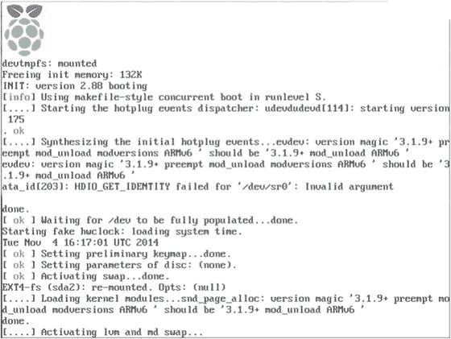

# 一、单板计算机和树莓派简介

我们将用 Raspberry Pi 开始我们探索超级计算和科学编程科学领域的激动人心的旅程。但是对于我们开始这个旅程，我们必须熟悉单板计算机和 Raspberry Pi 的基础知识。在这一章中，我们将学习单板计算机的定义、历史和原理。我们首先将它与普通计算机进行比较。然后，我们将继续讨论有史以来最受欢迎和最畅销的单板计算机 Raspberry Pi。到本章结束时，读者将有足够的知识来独立设置自己的树莓派。本章旨在让读者熟悉单板计算机的基本概念和 Raspberry Pi 的设置。

## 单板计算机

单板计算机(在整本书中，从下文开始将被称为 SBCs)是一个围绕单个印刷电路板构建的全功能计算机系统。SBC 具有微处理器、存储器、输入/输出和最小功能计算机所需的其它特征。与台式个人电脑(PC)不同，大多数 SBC 没有用于外围功能或扩展的扩展槽。因为所有组件，例如处理器、RAM、GPU 等。集成在一个 PCB 上，我们无法升级 SBC。

很少有单板机是为了系统扩展而插入底板的。SBC 有许多种类、大小、形状、外形和功能。由于电子和半导体技术的进步，大多数单板机的价格非常低。SBCs 最重要的特征之一是成本效益。每个价格约为 50 美元，我们手中有一个开发工具，适用于新的应用程序、黑客攻击、调试、测试、硬件开发和自动化系统。

单板机通常以下列形式制造:

*   Pico-ITX
*   虚拟仪器
*   Qseven
*   世界杯足球赛
*   总线技术
*   总线
*   先进电信运算架构
*   总线
*   嵌入式紧凑型扩展(ECX)
*   迷你 ITX
*   PC/104
*   工业计算机制造协会

### 单板机和普通计算机的区别

下面是 SBCs 和普通电脑的区别表(表 [1-1](#Tab1) )。

表 1-1。

Differences Between SBCs and Regular Computers

<colgroup><col> <col></colgroup> 
| 单板计算机 | 普通计算机 |
| --- | --- |
| 它不是模块化的。 | 它是模块化的。 |
| 其组件不能升级或更换。 | 它的组件可以升级或更换。 |
| 这是一个片上系统。 | 它不是片上系统。 |
| 它的外形尺寸很小。 | 它具有大的形状因子。 |
| 它是便携式的。 | 它大多是非便携式或半便携式的。 |
| 它消耗的能量更少。 | 它消耗更多的能量。 |
| 它比普通电脑便宜。 | 它比单板机贵。 |

### 片上系统

所有 SBC 主要是 SOC。片上系统或片上系统(SOC 或 SoC)是一种集成电路(IC ),它将计算机的所有组件都集成在一个芯片上。SOC 在移动电子设备中非常常见，因为它们具有低功耗和多功能性。SOC 广泛应用于手机、SBC 和嵌入式硬件中。SoC 拥有其运行所需的所有硬件和软件。

#### SoC 与常规 CPU

使用 SoC 的最大优势是它的尺寸。如果我们使用中央处理器，就很难制造出一台紧凑的计算机，这仅仅是因为我们需要在一块板上排列大量的单个芯片和其他组件。然而，使用 SOC，我们可以在智能手机和平板电脑中放置完整的特定应用计算系统，并且仍然有足够的空间来放置电池、天线和远程电话和数据通信所需的其他附件。

由于非常高的集成度和紧凑的尺寸，SoC 比常规 CPU 消耗的功率要少得多。对于移动和便携式系统，这是 SOC 的一大优势。此外，通过消除计算机电路板上的冗余 IC 来减少芯片数量，可实现紧凑的电路板尺寸。

### SBCs 的历史

Dyna-Micro 是第一款真正的 SBC。它基于英特尔 C8080A，并使用英特尔的第一个 EPROM，C1702A。dyna-micro 于 1976 年由康涅狄格州德比的 E&L Instruments 公司更名为 MMD 1 号(Mini-Micro Designer 1)。它作为微型计算机的主要例子而出名。在计算的早期，单板机非常流行，因为许多家用计算机实际上都是单板机。然而，随着个人电脑的兴起，单板机的受欢迎程度下降了。自 2010 年以来，由于 SBC 的生产成本较低，SBC 再次受到欢迎。

除了 MMD-1，以下是一些受欢迎的历史 SBC:

*   BBC Micro 是围绕运行在 2 MHz 的 MOS 技术 6502A 处理器构建的。
*   Ferguson Big Board II 是一台基于 Zilog Z80 的计算机，运行频率为 4MHz。
*   Nascom 是另一台基于 Zilog Z80 的计算机。

### 流行的 SBC 系列

基于制造商和设计师，SBC 分为系列、型号和代。一些受欢迎的 SBC 系列有

*   覆盆子酱基金会的覆盆子酱
*   香蕉派和香蕉派
*   英特尔爱迪生和伽利略
*   方块板
*   喙骨和喙板

## 树莓派

Raspberry Pi 是由 Raspberry Pi 基金会在英国开发的一系列信用卡大小的 SBC。树莓派基金会成立于 2009 年。开发 Raspberry Pi 的目的是通过提供一个低成本的计算平台来促进学校和发展中国家的基础计算机科学教学。

树莓派基金会的树莓派于 2012 年发布。这是一次巨大的成功，两年内售出了 200 多万台。随后，树莓派基金会修订了树莓派的版本。他们还发布了 Pi 的其他配件。

你可以在树莓派基金会的网站`(` [`www.raspberrypi.org`](https://www.raspberrypi.org) 找到更多关于树莓派基金会的信息。

树莓派目前生产型号和其他配件的产品页面为 [`www.raspberrypi.org/products`](https://www.raspberrypi.org/products) 。

我已经在 Raspberry Pi 模型 B+、2B 和 3B 上编写、执行和测试了本书的所有代码示例。树莓派 3 型号 B(也称为 3B)是树莓派 的最新型号。让我们看看树莓派 3 Model B 的规格(参考表 [1-2](#Tab2) )。

表 1-2。

Specifications of Raspberry Pi 3 Model B

<colgroup><col> <col></colgroup> 
| 出厂日期 | 2016 年 2 月 |
| 体系结构 | ARMv8 战斗机 |
| SoC Broadcom | BCM2837 |
| 中央处理器 | 1.2 GHz 64 位四核 ARM Cortex-A53 |
| 国家政治保卫局。参见 OGPU | Broadcom video core IV(300 MHz GPU 的 3D 部分，400 MHz GPU 的视频部分) |
| 记忆 | 1 GB(与 GPU 共享) |
| 通用串行总线 | 2.0 端口 4 |
| 视频输出 | HDMI 版本 1.3 和复合视频 RCA 插孔 |
| 车载存储 | 微型 SDHC 槽 |
| 车载网络 | 10/100 Mbps 以太网、蓝牙和 WiFi |
| 电源 | 5V 微型 USB 端口 |
| 额定功率 | 800 毫安(4W) |

下面(图 [1-1](#Fig1) )是树莓派 3 Model B 的俯视图。


图 1-1。

Raspberry Pi 3 Model B top view

下面(图 [1-2](#Fig2) )是树莓派 3 Model B 的仰视图。


图 1-2。

Raspberry Pi 3 Model B bottom view

我们可以通过访问其产品页面( [`www.raspberrypi.org/products/raspberry-pi-3-model-b`](http://www.raspberrypi.org/products/raspberry-pi-3-model-b) )获得更多关于树莓派 3 Model B 的信息。

下表(表 [1-3](#Tab3) )列出了树莓派 2 Model B 的规格。

表 1-3。

Specifications of Raspberry Pi 2 Model B

<colgroup><col> <col></colgroup> 
| 出厂日期 | 2015 年 2 月 |
| 体系结构 | ARMv7 战斗机 |
| SoC Broadcom | BCM2836 |
| 中央处理器 | 900 MHz 32 位四核 ARM Cortex-A7 |
| 国家政治保卫局。参见 OGPU | Broadcom 视频会议 IV @ 250 MHz |
| 记忆 | 1 GB(与 GPU 共享) |
| 通用串行总线 | 2.0 端口 4 |
| 视频输出 | HDMI 版本 1.3 和复合视频 RCA 插孔 |
| 车载存储 | 微型 SDHC 槽 |
| 车载网络 | 10/100 Mbps 以太网、蓝牙和 WiFi |
| 电源 | 5V 微型 USB 端口 |
| 额定功率 | 800 毫安(4W) |

我们可以通过访问其产品页面( [`www.raspberrypi.org/products/raspberry-pi-2-model-b/`](http://www.raspberrypi.org/products/raspberry-pi-2-model-b/) )获得更多关于树莓派 2 Model B 的信息。

下表(表 [1-4](#Tab4) )列出了树莓派 1Model B+的规格。

表 1-4。

Specifications of Raspberry Pi 1 Model B+

<colgroup><col> <col></colgroup> 
| 出厂日期 | 2014 年 7 月 |
| 体系结构 | ARMv6 战斗机 |
| SoC Broadcom | BCM2835 |
| 中央处理器 | 700 MHz 单核 ARM1176JZF-S |
| 国家政治保卫局。参见 OGPU | Broadcom 视频会议 IV @ 250 MHz |
| 记忆 | 512 MB(与 GPU 共享) |
| 通用串行总线 | 2.0 端口 4 |
| 视频输出 | HDMI 版本 1.3 和复合视频 RCA 插孔 |
| 车载存储 | 微型 SDHC 槽 |
| 车载网络 | 10/100 Mbps 以太网、蓝牙和 WiFi |
| 电源 | 5V 微型 USB 端口 |
| 额定功率 | 800 毫安(4W) |

我们可以通过访问其产品页面( [`www.raspberrypi.org/products/model-b-plus/`](http://www.raspberrypi.org/products/model-b-plus/) )获得更多关于树莓派 2 Model B 的信息。

## Raspberry Pi 设置

我们必须先设置树莓派，然后才能开始使用它进行探索和冒险。下面我们来详细看看如何设置。正如我前面提到的，我使用 Raspberry Pi 3 Model B 进行设置。树莓派 2 型号 B 和树莓派 1 型号 B+的设置过程完全相同。让我们来看看安装所需的硬件材料清单。

### Raspberry Pi 设置所需的硬件

安装需要下列硬件。

#### 树莓派

我们需要使用树莓派 3 模型 B 或树莓派 2 模型 B 或树莓派 1 模型 B+进行设置。

#### 计算机

需要一台带互联网连接的 Windows 电脑或笔记本电脑。我们需要使用计算机为 Pi 准备一个带有 Raspbian 操作系统映像的 microSD 卡。

#### 输入输出设备

需要一个标准 USB 键盘和一个 USB 鼠标。

#### 微型 sd 卡

需要一个存储容量至少为 8 GB 的 microSD 卡(例如参见图 [1-3](#Fig3) )。我们将使用该卡作为 Pi 的二级存储。建议使用等级 10 的卡，因为等级 10 的数据传输速度非常快。安全起见，我建议至少使用 8 GB 的卡。大多数情况下，选择 16 GB 的卡就足够了。


图 1-3。

Class 10 microSD card (image from [`www.flickr.com/photos/ssoosay/`](http://www.flickr.com/photos/ssoosay/) ) Note

在购买该卡之前，请务必访问链接 [`http://elinux.org/RPi_SD_cards`](http://elinux.org/RPi_SD_cards) 以检查该卡与树莓派的兼容性。

#### 电源

所有 Raspberry Pi 型号都需要 5V 微型 USB 电源装置(PSU)。树莓派 3 型 PSU 的推荐电流容量为 2.5 安培。对于所有其他型号 2 安培 PSU 是绰绰有余。

你可以在 [`https://thepihut.com/products/official-raspberry-pi-universal-power-supply`](https://thepihut.com/products/official-raspberry-pi-universal-power-supply) 找到树莓派的官方电源。

#### SD/microSD 读卡器

我们还需要一个读卡器。许多笔记本电脑都有内置的 SD 读卡器。

如果笔记本电脑或读卡器只能使用 SD 卡，那么我们需要一个额外的 microSD-to-SD 卡适配器。下图(图 [1-4](#Fig4) )显示了一个适配器。


图 1-4。

Card reader and microSD-to-SD adapter (image from [`www.flickr.com/photos/sparkfun/`](http://www.flickr.com/photos/sparkfun/) )

#### 班长

我们需要一个 HDMI 显示器或 VGA 显示器。

对于 HDMI 显示器，我们需要一根 HDMI 电缆(参见图 [1-5](#Fig5) )。它通常与 HDMI 显示器一起包装。


图 1-5。

HDMI male-to-male cable (image from [`www.flickr.com/photos/sparkfun/`](http://www.flickr.com/photos/sparkfun/) )

对于 VGA 显示器，我们需要一根 VGA 电缆(参见图 [1-6](#Fig6) )。这通常也与 VGA 显示器一起包装。


图 1-6。

VGA cable (image from [`www.flickr.com/photos/124242273@N07/`](http://www.flickr.com/photos/124242273@N07/) )

如果我们使用 VGA 显示器，我们将需要一个 HDMI-VGA 适配器，因为 Raspberry Pi 只有一个 HDMI 端口用于视频输出(图 [1-7](#Fig7) )。


图 1-7。

HDMI-to-VGA adapter (image from [`www.flickr.com/photos/sparkfun/`](http://www.flickr.com/photos/sparkfun/) )

### 树莓派 MicroSD 卡的手工制作

手动准备用于 Pi 的 microSD 卡是将操作系统安装到单板计算机的 microSD 卡中的最佳方式。许多用户(包括我)更喜欢它，因为它允许在用于启动之前手动修改 microSD 卡的内容(如果需要)。准备 microSD 的另一种方法是使用 NOOBS(新的开箱即用软件)，我在本书中没有使用过。

手动准备允许我们在启动前访问`/boot/config.txt`等配置文件。在启动 Pi 之前，我们可能必须在少数情况下修改配置文件(我们将很快讨论这一点)。默认的 Raspbian 映像有两个分区，`boot`和`system`。请为 Pi 使用至少 16 GB 的 microSD 卡，考虑到将来可能对操作系统进行的任何升级。

### 下载所需的免费软件

让我们下载所需的软件。

#### 下载加速器增强版

从其下载页面( [`www.speedbit.com/dap/download/downloading.asp`](http://www.speedbit.com/dap/download/downloading.asp) )下载下载加速器加安装程序。这个免费软件用于管理下载。这对于大型下载非常有用，因为我们可以暂停和继续下载。如果您的电脑突然关机或互联网中断，它会从最后一个检查点继续下载。下载并安装后，使用它来管理以下下载。

#### win32 diski manager

从其下载页面( [`https://sourceforge.net/projects/win32diskimager/files/latest/download`](https://sourceforge.net/projects/win32diskimager/files/latest/download) )下载 Win32DiskImager 安装程序。安装。

#### WinZip 或 WinRaR

我们需要一个文件提取工具。下载 WinZip ( [`http://www.winzip.com/win/en/index.htm`](http://www.winzip.com/win/en/index.htm) )或者 WinRaR ( [`http://www.win-rar.com/download.html`](http://www.win-rar.com/download.html) )。安装其中任何一个。

#### 下载并解压缩 Raspbian 操作系统映像

我们将使用 Raspbian 操作系统作为 Pi。我们将在本章的后半部分详细讨论 Raspbian。现在，从 [`www.raspberrypi.org/downloads/raspbian`](http://www.raspberrypi.org/downloads/raspbian) 下载 Raspbian 操作系统的最新压缩文件。用 WinZip 或 WinRaR 提取图像 zip 文件。

### 将 Raspbian 操作系统映像写入 MicroSD 卡

将 microSD 卡插入读卡器。如果您的电脑或笔记本电脑有内置读卡器，请将其插入。如果读卡器或您的电脑只有一个 SD 卡插槽，您可能必须使用 microSD-to-SD 卡适配器。

打开 Win32DiskImager。选择图像文件的位置，然后单击写入按钮。见下图 [1-8](#Fig8) 。


图 1-8。

Win32 Disk Imager

如果您看到以下警告消息(图 [1-9](#Fig9) ，则切换读卡器或 SD 卡适配器(或两者)的写保护槽。然后再次点按“写入”按钮。


图 1-9。

Write protection error message

将显示以下(图 [1-10](#Fig10) )警告信息。单击“是”按钮继续。


图 1-10。

Overwrite warning message

一旦操作系统映像被写入 SD 卡，将显示以下消息(图 [1-11](#Fig11) )。单击确定按钮。


图 1-11。

Write successful message

Raspbian 操作系统已经刷新到 microSD 卡。

### 更改 VGA 监视器的 config.txt 文件的内容

Note

如果你打算使用 VGA 显示器，这一步是必须的。如果您使用的是 HDMI 显示器，请跳过这一步。

对于 VGA 显示器，我们必须使用 HDMI 转 VGA 电缆。我们还需要更改`config.txt`的内容，以使 Pi 与 VGA 监视器一起工作。我们将在本章的后半部分了解更多关于`config.txt`的内容。

将 microSD 卡再次插入读卡器，并在 Windows 资源管理器中浏览。在 Windows 资源管理器中，它将被表示为标记为`boot`的可移动介质驱动器。

打开文件`config.txt`,对文件进行如下更改:

*   将`#disable_overscan=1`改为`disable_overscan=1`
*   将`#hdmi_force_hotplug=1`改为`hdmi_force_hotplug=1`
*   将`#hdmi_group=1`改为`hdmi_group=2`
*   将`#hdmi_mode=1`改为`hdmi_mode=16`
*   将`#hdmi_drive=2`改为`hdmi_drive=2`
*   将`#config_hdmi_boost=4`改为`config_hdmi_boost=4`

完成上述更改后，保存文件。

microSD 卡现在已准备好用于 Pi 和 VGA 监视器。

### 启动 Pi

让我们用准备好的 microSD 卡启动 Pi。其步骤如下:

1.  如果您使用的是 HDMI 显示器，请使用 HDMI 公对公电缆将显示器直接连接到 Pi 的 HDMI 端口。如果您使用的是 VGA 显示器，请使用 HDMI 转 VGA 适配器将 HDMI 信号转换为 VGA。
2.  将 microSD 卡插入 Pi 的 microSD 卡插槽。
3.  连接 USB 鼠标和 USB 键盘。
4.  此时，请确保电源已关闭。使用我们之前讨论过的微型 USB 电源线将 Pi 连接到电源。
5.  将显示器连接到电源。
6.  检查所有连接。打开 Pi 和监视器的电源。

此时，树莓派将启动。

对于所有配备单核处理器的 Raspberry Pi 机型，开机画面如下(图 [1-12](#Fig12) )。



图 1-12。

Single-core CPU RPi model boot screen

树莓派所有搭载四核处理器的机型，开机画面都会如下图(图 [1-13](#Fig13) )。


图 1-13。

Quad-core CPU RPi Model boot screen

一旦 Pi 启动，监视器显示如下的桌面(图 [1-14](#Fig14) )。


图 1-14。

Raspbian Desktop (as of February 2017)

### 配置 Pi

我们现在需要配置 Pi 以备将来使用。就这么办吧。

在桌面上，有一个任务栏。在任务栏中，我们发现了下面的图标(图 [1-15](#Fig15) )。


图 1-15。

LXTerminal icon

点击图标，LXTerminal 窗口(图 [1-16](#Fig16) )将会打开。


图 1-16。

LXTerminal Window

该终端是一个独立于桌面的基于 VTE 的 LXDE 终端模拟器，没有任何不必要的依赖。在提示符下键入`sudoraspi-config`并按回车键。`raspi-config`是树莓派 的配置工具。

导航至引导选项(在图 [1-17](#Fig17) 中突出显示)。


图 1-17。

raspi-config with boot options highlighted

将引导选项设置为桌面自动登录，如下图 [1-18](#Fig18) 所示。


图 1-18。

Desktop Autologin highlighted

在国际化选项中，更改时区和 Wi-Fi 国家(参见图 [1-19](#Fig19) )。把键盘布局改成美国。


图 1-19。

raspi-config internationalization options

完成后，返回主屏幕并选择完成，如下图所示(图 [1-20](#Fig20) )。


图 1-20。

Finish

它将要求重启(图 [1-21](#Fig21) )。选择是。


图 1-21。

Reboot Prompt

它将重新启动 Pi。

我们的工作还没有完成。我们需要学习如何将 Pi 连接到互联网，以及如何更新它。

## Raspbian

操作系统是使计算机工作的一组基本程序和实用程序。它是用户和计算机之间的接口。Raspbian 是一个基于流行的 Linux 发行版 Debian 的免费操作系统。Raspbian 针对 SBCs 的 Raspberry Pi 系列进行了优化。它甚至被移植到其他类似的单板机，如香蕉亲。

Raspbian 捆绑了超过 35，000 个软件包和预编译软件，便于在 Raspberry Pi 上安装和使用。Raspbian 的第一个版本于 2012 年 6 月完成。Raspbian 仍在积极开发中，并经常更新。访问 Raspbian 主页`(` [`www.raspbian.org`](https://www.raspbian.org) )和 Raspbian 文档页面`(` [`www.raspbian.org/RaspbianDocumentation`](https://www.raspbian.org/RaspbianDocumentation) )了解更多关于 Raspbian 的信息。

## 配置文件

Raspberry Pi 没有常规的 BIOS。BIOS(基本输入/输出系统)是计算机的微处理器用来启动计算机系统并在计算机通电后将操作系统加载到内存中的程序。它还管理计算机操作系统和连接的外围设备(如硬盘、视频适配器、键盘、鼠标和打印机)之间的数据流。

由于 Raspberry Pi 没有 BIOS，通常使用 BIOS 存储和修改的各种系统配置参数现在存储在名为`config.txt`的文本文件中。

树莓派 `config.txt`文件是树莓派 的`boot`分区上的文件。在 Linux 中，它通常可以作为`/boot/config.txt`访问。但是，在 Windows 和 Mac OS 中，它被视为 microSD 卡可访问部分中的文件。卡的可访问部分标记为`boot`。正如我们在本章前面已经了解到的，如果我们想将`/boot/config.txt`文件连接到 VGA 显示器，我们必须编辑它。

在 Raspberry Pi 上，我们可以在 LXTerminal 中使用以下命令编辑该文件:

```py
sudo nano /boot/config.txt

```

Note

nano 是一个简单易学的基于文本的 Linux 文本编辑器。访问其主页( [`www.nano-editor.org`](http://www.nano-editor.org) )了解更多信息。我发现它比`vi`或`vim`编辑器更容易使用。

要了解更多关于`config.txt`的信息，请访问 [`http://elinux.org/RPiconfig`](http://elinux.org/RPiconfig) 页面。此外，可以在 [`http://elinux.org/R-Pi_configuration_file`](http://elinux.org/R-Pi_configuration_file) 找到一个示例配置。

## 将 Raspberry Pi 连接到网络和互联网

要将 Pi 连接到任何网络，我们必须编辑`/etc/network/interfaces`文件。如果 Pi 连接的网络连接到 Internet，则 Pi 可以访问 Internet。

### 无线局域网（wireless fidelity 的缩写）

树莓派 3 型号 B 内置 WiFi。对于所有其他型号的 Pi，我们需要使用 USB WiFi 适配器。

将 USB WiFi 适配器连接到 Pi 后，使用以下命令备份/ `etc/network/interfaces`文件:

```py
sudo mv /etc/network/interfaces /etc/network/interfaces.bkp

```

原始的`/etc/network/interfaces`文件以这种方式是安全的，并且如果出现问题可以恢复。

现在创建一个新的`/etc/network/interfaces`文件。

```py
sudo nano /etc/network/interfaces

```

在其中键入以下行(列表 [1-1](#Par123) ):

```py
source-directory /etc/network/interfaces.d

auto lo
iface lo inet loopback

auto wlan0
allow-hotplug wlan0
iface wlan0 inet dhcp
wpa-ssid "ASHWIN"
wpa-psk "internet"

Listing 1-1./etc/network/interfaces

```

在上面的文件中(列表 [1-1](#Par123) )用你的 WiFi 网络的 ssid 替换`"ASHWIN"`，用你的 WiFi 网络的密码替换`"internet"`。通过按 CTRL+X 和 y 保存文件。

运行以下命令重新启动网络服务:

```py
sudo service networking restart

```

如果您正确执行了这些步骤，Pi 应该连接到 WiFi 网络和互联网(前提是 WiFi 网络已连接到互联网)。

要验证与互联网的连接，请使用以下命令:

```py
ping -c4 www.google.com

```

它应该显示类似下面的输出。

```py
PING www.google.com (216.58.197.68) 56(84) bytes of data.
64 bytes from maa03s21-in-f4.1e100.net (216.58.197.68): icmp_seq=1 ttl=55 time=755 ms
64 bytes from maa03s21-in-f4.1e100.net (216.58.197.68): icmp_seq=2 ttl=55 time=394 ms
64 bytes from maa03s21-in-f4.1e100.net (216.58.197.68): icmp_seq=3 ttl=55 time=391 ms
64 bytes from maa03s21-in-f4.1e100.net (216.58.197.68): icmp_seq=4 ttl=55 time=401 ms

--- www.google.com ping statistics ---
4 packets transmitted, 4 received, 0% packet loss, time 3003ms
rtt min/avg/max/mdev = 391.729/485.695/755.701/155.925 ms

```

像上面这样的输出意味着 Pi 连接到了互联网。

要查找 Pi 的 IP 地址，请使用 ifconfig 命令。在其输出中，检查`wlan0`部分。具体如下:

```py
wlan0     Link encap:Ethernet  HWaddr 7c:dd:90:00:e2:1e
          inet addr:192.168.0.122  Bcast:192.168.0.255  Mask:255.255.255.0
          inet6 addr: fe80::7edd:90ff:fe00:e21e/64 Scope:Link
          UP BROADCAST RUNNING MULTICAST  MTU:1500  Metric:1
          RX packets:1974 errors:0 dropped:0 overruns:0 frame:0
          TX packets:1275 errors:0 dropped:0 overruns:0 carrier:0
          collisions:0 txqueuelen:1000
          RX bytes:195049 (190.4 KiB)  TX bytes:1204336 (1.1 MiB)

```

在上面的输出中，`192.168.0.122`是 Pi 的 IP 地址。由于 IP 地址是使用 DHCP 协议分配的，因此根据 WiFi 网络设置的不同，IP 地址也会有所不同。

### 以太网

我们还可以将 Pi 连接到局域网。根据 LAN 交换机的设置，我们可以静态或动态地为 Pi 分配 IP 地址。

#### 静态 IP 地址

如果局域网静态分配 IP 地址，则按如下方式配置`/etc/network/interfaces`(列表 [1-2](#Par138) ):

```py
source-directory /etc/network/interfaces.d

auto lo
iface lo inet loopback

auto eth0
allow-hotplug eth0
iface eth0 inet static
# Your static IP
address 192.168.0.2
# Your gateway IP
gateway 192.168.0.1
netmask 255.255.255.0
# Your network address family
network 192.168.0.0
broadcast 192.168.0.255

Listing 1-2./etc/network/interfaces

```

在上面的文件中，参数`address`、`gateway`、`netmask`、`network`和`broadcast`基于局域网的配置。请查看局域网交换机或路由器的手册。如果您在组织中工作，请向网络管理员咨询这些参数。

#### 动态 IP 地址

这是一个简单的问题。如果局域网具有 DHCP 功能，则按如下方式配置`/etc/network/interfaces`(列表 [1-3](#Par141) ):

```py
source-directory /etc/network/interfaces.d

auto lo
iface lo inet loopback

auto eth0
allow-hotplug eth0
iface eth0 inet dhcp

Listing 1-3./etc/network/interfaces

```

这将配置 Pi 通过 DHCP 自动获取 IP 地址。

Note

在 Debian 及其衍生产品上设置网络所需的所有信息都可以在 [`https://wiki.debian.org/NetworkConfiguration`](https://wiki.debian.org/NetworkConfiguration) 上找到。

## 更新 Pi

为此，Pi 必须连接到互联网。

### 更新固件

固件是嵌入电子设备 ROM 芯片的软件。它提供对设备的控制和监控。要更新 Pi 的固件，运行`sudo rpi-update`。它将更新固件。

### 更新和升级 Raspbian

我们将为此使用 APT。APT 代表高级打包工具。这是一个处理 Debian 和其他 Debian 衍生软件的安装和删除的程序。APT 通过自动获取、配置和安装软件包，简化了在 Debian 系统上管理软件的过程。我们也需要一个互联网连接。

首先，通过在 LXTerminal 中输入以下命令来更新系统的程序包列表:

```py
sudo apt-get update

```

`apt-get update`从各自的远程存储库下载软件包列表，并在本地计算机上更新它们，以获取可用于安装和更新的最新版本软件包及其依赖项的信息。它应该在运行`install`或`upgrade`命令之前运行。

接下来，使用以下命令将所有已安装的软件包升级到最新版本:

```py
sudo apt-get dist-upgrade -y

```

`apt-get dist-upgrade`获取机器上标记为要在本地机器上升级的软件包的新版本。它还检测和安装依赖关系。它可能会删除过时的软件包。

定期这样做将使 Pi 上安装的 RaspbianOS 保持最新。输入这些命令后，需要一段时间来更新操作系统，因为这些命令会从远程存储库中获取数据和包。

Note

`sudo apt-get --help`将列出与`apt-get`相关的所有选项

### 更新 raspi-config

在`raspi-config`中，转到高级选项(参见图 [1-22](#Fig22) )并选择更新。


图 1-22。

Updating raspi-config

## 关闭和重新启动 Pi

我们可以用`sudo shutdown -h now`安全关闭 Pi。

我们可以用`sudo reboot -h now`重启 Pi。

## 结论

在本章中，我们介绍了 SBCs 的概念和原理。我们也开始使用 SBC 的一个流行系列，Raspberry Pi。现在我们可以满怀信心地进行进一步的探索。在下一章，我们将学习一些重要的 Linux 命令以及如何远程连接到 Pi。