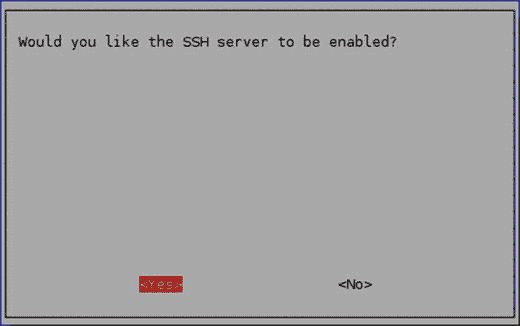

# 二、重要的 Linux 命令和远程连接

在上一章中，我们学习了单板计算机的基础知识以及如何设置 Pi。我们还学会了将 Pi 连接到互联网。我希望所有读者现在对这些基础知识都很熟悉了。完成这些后，我们将会更深入地挖掘一些基础知识。在这一章中，我们将学习一些对我们有用的重要的 Linux 命令。我们还将研究如何远程连接到 Pi。

## 重要而有用的 Linux 命令

在这一节中，我们将研究几个重要的 Linux 命令，这些命令将有助于我们理解将用于超级计算和并行编程的硬件环境(Pi)。

### 获得 Linux 命令的帮助

我们可以使用 man 命令或- help 选项来获取有关命令的更多信息。例如，如果我们想更多地了解 cat 命令的用法，那么我们可以发出命令 man cat 或 cat - help。

### 网络相关命令

以下与网络相关的命令有助于理解网络基础设施。

#### 命令

ifconfig 用于检查网络状态。我们可以使用 ifconfig eth0 或 ifconfig wlan0 分别检查 WiFi 或以太网的状态。

#### 尤克里里琴

我们可以使用 iwconfig 来检查无线网络状态。其输出如下:

```py
wlan0 IEEE 802.11bg ESSID:"ASHWIN"
Mode:Managed Frequency:2.412 GHz Access Point: A2:EC:80:FB:E2:66
Bit Rate=6 Mb/s Tx-Power=20 dBm
Retry short limit:7 RTS thr:off Fragment thr:off
Power Management:off
Link Quality=45/70 Signal level=-65 dBm
Rx invalid nwid:0 Rx invalid crypt:0 Rx invalid frag:0
Tx excessive retries:24 Invalid misc:6 Missed beacon:0

lo no wireless extensions.

eth0 no wireless extensions.

```

#### iwlist wlan0 扫描

iwlist wlan0 扫描显示所有可用无线网络的列表。

#### 砰

ping 测试两台设备之间的网络连通性。我们已经在第一章中看到了它检查互联网连接的用法。

### 系统信息命令

这些命令帮助我们更多地了解 Pi 上系统和硬件的状态。

#### CPU 相关信息

我们可以使用 cat /proc/cpuinfo 来查看关于 CPU 的信息。

要检查其他细节(即 CPU 的运行速度)，可以使用 lscpu 命令。lscpu 的输出如下:

```py
Architecture: armv7l
Byte Order: Little Endian
CPU(s): 4
On-line CPU(s) list: 0-3
Thread(s) per core: 1
Core(s) per socket: 4
Socket(s): 1
Model name: ARMv7 Processor rev 5 (v7l)
CPU max MHz: 900.0000
CPU min MHz: 600.0000

```

#### 记忆相关信息

我们可以使用 cat /proc/meminfo 来获得关于内存的细节。我们还可以使用 free 命令来查看有多少可用内存，如下所示:

```py
        total   used     free     shared   buffers  cached
Mem:    996476  210612   785864   7208     15152    113668
-/+ buffers/
cache:  81792   914684
Swap:   102396  0        102396

```

#### 系统和操作系统版本信息

uname -a 提供关于当前系统的信息如下:

```py
Linux raspberrypi 4.4.11-v7+ #888 SMP Mon May 23 20:10:33 BST 2016 armv7l GNU/Linux

```

要识别 Linux 版本，请运行命令 cat /proc/version。

#### 分区相关信息

df -h 以可读格式显示 microSD 卡分区相关信息，如下所示:

```py
Filesystem              Size    Used    Avail   Use%    Mounted on
/dev/root               15G     3.6G    11G     26%     /
devtmpfs                483M    0       483M    0%      /dev
tmpfs                   487M    0       487M    0%      /dev/shm
tmpfs                   487M    6.6M    480M    2%      /run
tmpfs                   5.0M    4.0K    5.0M    1%      /run/lock
tmpfs                   487M    0       487M    0%      /sys/fs/cgroup
/dev/mmcblk0p1          63M     21M     43M     33%     /boot
tmpfs                   98M     0       98M     0%      /run/user/1000

```

cat /proc/partitions 提供了分区块分配信息。

#### 其他有用的命令

hostname -I 显示了 IP 地址。

lsusb 显示连接到 Pi 的所有 usb 设备的列表。

vcgencmd measure_temp 显示 CPU 的温度。

vcgencmd get _ mem arm & & vcgencmd get _ mem gpu 显示 CPU 和 GPU 之间的内存分割。

## 从 raspi-config 为 SSH 启用 Pi

要远程连接到 Pi，我们需要从 raspi- config 启用 SSH 服务器。打开 LXTerminal 并运行命令 sudo raspi-config。

在 raspi-config 的主菜单中选择高级选项。在高级选项屏幕中，选择 A4 SSH，将出现以下屏幕(图 [2-1](#Fig1) )。



图 2-1。

Enabling the SSH server

选择是，将显示以下信息(图 [2-2](#Fig2) )。


图 2-2。

SSH server enable confirmation

按回车键。从 raspi-config 的主菜单中选择 Finish，并在提示重新启动时选择 Yes。一旦 Pi 重启，我们就可以远程访问了。

## 从 Windows 远程连接到 Raspberry Pi

如果我们用来连接 Raspberry Pi 的计算机也在同一个网络中(无论是物理上还是通过 VPN)，远程连接到 Pi 是可能的。为此，我们必须使用各种工具和实用程序。在本章中，我们将学习远程连接到 Pi。我们还将学习如何在 Pi 之间来回传输文件。当我们想在无头模式下使用 Pi 时，这一点很重要(“无头”只是指我们使用的 Pi 没有附加可视显示)。在我们没有显示器或者由于资源/空间限制而不想备用显示器的情况下，这很有用。例如，当我们创建一个 Pi 集群时，我们不能为集群中的每个 Pi 留出一个显示器。在这种情况下，无头模式非常有用。在本章的这一部分，我们将探索远程使用 Pi 的多种方法。

### 从另一台计算机检查与 Pi 的连接

我们计划连接到 Pi 的计算机必须在同一个网络中，这一点很重要。在其他计算机和 Pi 之间不应该有任何代理和防火墙限制。这种设置的最佳示例是 Pi 和另一台计算机连接在同一个路由器/网络交换机下。要检查连通性，我们可以使用 ping 实用程序。

1.  在计算机上打开 Windows 命令行 cmd。
2.  打开 Pi 并记下其 IP 地址。使用 ifconfig 命令查找其 IP 地址。假设是 192.168.0.2(不管是以太网还是 WiFi)。
3.  在 cmd 中，运行 ping 192.168.0.2 来检查连通性。

我们可以在任何装有 Linux 发行版或 macOS 的计算机上使用相同的 ping 命令，只要它们与 Pi 在同一个网络中。

### 油灰

PuTTY 是用于 Windows 和 Unix 平台的 SSH 和 Telnet 的一个免费实现，附带一个 xterm 终端仿真器。它主要由 Simon Tatham 编写和维护。你可以探索 PuTTY 主页( [`www.chiark.greenend.org.uk/~sgtatham/putty/`](http://www.chiark.greenend.org.uk/%7Esgtatham/putty/) )了解更多信息。

PuTTY 是开源软件，有源代码，由一个志愿者团队开发和支持。

现在让我们下载并安装 PuTTY。PuTTY 可以从其下载页面( [`www.chiark.greenend.org.uk/~sgtatham/putty/latest.html`](http://www.chiark.greenend.org.uk/%7Esgtatham/putty/latest.html) )下载。下载文件 PuTTY.exe。下载完成后，将其放在您选择的目录中，并为您创建一个桌面快捷方式(图 [2-3](#Fig3) )。


图 2-3。

PuTTY desktop shortcut

双击 putty 快捷方式，将会打开 PuTTY(图 [2-4](#Fig4) )窗口。


图 2-4。

PuTTY Window

在主机名(或 IP 地址)文本框中键入 IP 地址或主机名。确保选择 SSH 作为连接类型。为了将来使用，你可能想要保存设置(我通常这样做)。现在，单击打开按钮。它会打开一个终端风格的窗口。它会要求你输入用户名和密码，分别是 pi 和 raspberry。首次登录时，显示如下(图 [2-5](#Fig5) )消息对话框。单击是。


图 2-5。

PuTTY security alert

一旦我们登录，它会显示如下提示(图 [2-6](#Fig6) )。


图 2-6。

PuTTY remote connection window

我们现在可以远程使用 Pi 的命令提示符了。

### 远程访问 Raspberry Pi 桌面

树莓派 桌面是 LXDE(轻量级 X11 桌面环境)。我们可以使用 RDP(远程桌面协议)客户端从 Windows 计算机远程访问它。为此，我们需要在 Pi 上安装 xrdp。通过运行 sudo apt-get install xrdp 来安装它。安装后重新启动 Pi。

我们现在必须使用 Windows 远程桌面客户端来连接到 Pi。可以使用 Windows 中的搜索选项找到客户端。单击 Remote Desktop 客户端图标将其打开。

在下面的对话框中(图 [2-7](#Fig7) ，点击选项将其展开。


图 2-7。

Remote Desktop Connection

它展开并显示各种选项(图 [2-8](#Fig8) )。输入 pi 的 IP 地址和 Pi 作为用户名。单击复选框和保存按钮，保存相同的配置供将来使用。


图 2-8。

Remote Desktop Connection options

登录时会提示输入密码。输入密码。如果我们第一次使用 Windows 计算机连接到 Pi，那么它将显示以下对话框(图 [2-9](#Fig9) )。选中复选框，这样它就不会再询问我们，然后单击是。


图 2-9。

First time remote login

它将显示树莓派桌面。由于 Pi 通过网络传输桌面，操作速度会稍慢。然而，它工作得很好。

这就是我们如何使用 Windows 电脑/笔记本电脑访问 Pi 的桌面。然而，我们所学的方法都不允许我们在 Windows 计算机和 Pi 之间传输文件。我们将在本章的下一节学习如何去做。

### 温斯 CP

对于 Windows 计算机和 Raspberry Pi 之间的文件传输，我们将使用 WinSCP ( [`https://winscp.net/eng/index.php`](https://winscp.net/eng/index.php) )。WinSCP 是一个免费的 Windows 开源 SFTP 和 FTP 客户端。它的主要功能是本地和远程计算机之间的安全文件传输。

下载其设置( [`https://winscp.net/eng/download.php`](https://winscp.net/eng/download.php) )并安装。在 Windows 桌面上创建它的快捷方式。双击图标打开 WinSCP(图 [2-10](#Fig10) )。


图 2-10。

WinSCP window

在主机名文本框中输入 Pi 的 IP 地址。另外，输入 pi 作为用户名，输入 raspberry 作为密码。

我们还可以保存设置以备将来使用。保存会话(图 [2-11](#Fig11) )对话框如下。


图 2-11。

Save session

登录后，如果我们是第一次连接，则会显示以下对话框(图 [2-12](#Fig12) )。单击“添加”按钮继续。


图 2-12。

First time login dialog box

登录后，将显示以下窗口(图 [2-13](#Fig13) )。


图 2-13。

WinSCP file transfer window

本地 Windows 计算机的文件系统在左侧面板中，而 Raspberry Pi 的 Pi 用户的主目录即/home/pi 在右侧面板中。我们现在可以在两台计算机之间传输文件了。

## 使用 Linux 或 macOS 连接到 Raspberry Pi

让我们学习使用 Linux 计算机或 macOS 连接到 Pi。

### 使用 SSH 远程登录

SSH 内置于 Linux 发行版和 macOS 中。我们可以使用 SSH 从 Linux 计算机(也可能是另一个 Raspberry Pi)或 Mac 终端连接到 Pi，而无需安装额外的软件。

在 Linux 计算机或 Mac 中打开终端，并键入以下命令:

```py
ssh pi@192.168.0.2

```

192.168.0.2 是我 Pi 的 IP 地址。用您的 Pi 的 IP 地址替换它。一旦我们按下回车键，它将显示一个安全/真实性警告提示。键入 yes 继续。此警告仅在我们第一次连接时显示。

现在它会提示输入密码。输入 pi 用户的默认密码 raspberry。我们将看到 Raspberry Pi 提示符，它与 Raspberry Pi 上的提示符完全相同。

### 使用 SSH 转发

我们还可以通过 ssh 转发 X11 会话，以允许使用图形应用程序，方法是在 SSH 命令中使用-Y 标志，如下所示:

```py
ssh -Y pi@192.168.0.2

```

让我们远程访问像 scratch 这样的图形程序。运行以下命令，

```py
scratch &

```

它将在 Linux 计算机或 Mac 上的新窗口中启动 Pi 程序`scratch`的新 X11 会话。&使命令在后台运行。

### 用于文件传输的 SCP

在 Windows 中，我们使用 WinSCP 在 Windows 计算机和 Pi 之间进行文件传输。同样，我们可以在 Linux 计算机/Mac 和 Pi 之间传输文件。为此，我们需要使用 scp 实用程序。它内置于所有的 Linux 发行版和 macOS 中。

要将文件从 Pi 复制到 Linux 计算机或 Mac 上，我们必须在 Linux 计算机或 Mac 上的终端中运行以下命令:

```py
scp pi@192.168.0.2:/home/pi/test.txt /home/ashwin

```

上面的命令将 test.txt 从 pi 的/home/pi 目录复制到我们的 Linux 电脑或 Mac 的/home/ashwin 目录。

同样，我们可能希望将文件从 Linux 计算机或 Mac 计算机复制到 Pi。为此，在 Linux 计算机或 Mac 的终端中运行以下命令:

```py
scp /home/ashwin/test_again.txt pi@192.168.0.2:/home/pi

```

你可以在 [`www.computerhope.com/unix/scp.htm`](http://www.computerhope.com/unix/scp.htm) 上阅读更多关于 scp 命令的详细内容。

EXERCISE

完成下面的练习，更好地理解本章。

*   练习 man 命令。
*   练习各种 Linux 命令的- help 选项。
*   运行 iwlist wlan0 scan 命令。
*   运行 ping [`www.AshwinPajankar.com`](http://www.ashwinpajankar.com) 命令来检查与互联网的连接。
*   尝试查看本章中演示的所有系统相关命令的输出。
*   尝试用 VNC 远程访问树莓派桌面。

## 结论

在本章中，我们探讨了远程连接到 Pi 的各种方法。我们还学习了如何在 Pi 和其他使用 Linux、Windows 和 Mac 作为操作系统的计算机之间传输文件。