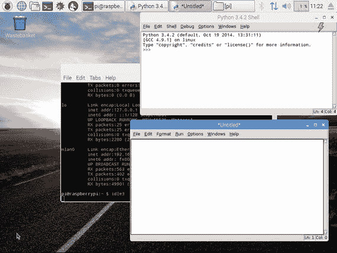
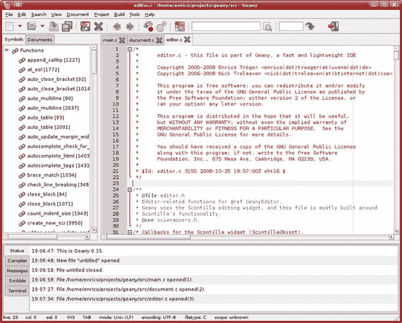
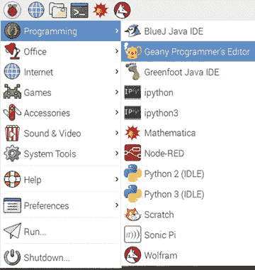
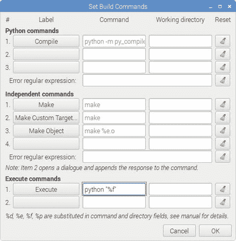

# 三、Python 简介

在上一章中，我们学习了重要的 Linux 命令，以及如何从其他计算机远程连接到 Raspberry Pi。我们还学习了如何在 Raspberry Pi 之间传输文件。

在这一章中，我们将开始学习 Python。

让我们从 Python 的介绍开始这一章。我个人觉得 Python 很神奇，已经被它迷住了。Python 是一种简单而强大的编程语言。当我们使用 Python 时，很容易关注给定问题的解决方案的实现，因为程序员不必担心编程语言的语法。Python 完美契合了 Raspberry Pi 的理念，即“为所有人编程”。这就是为什么 Python 是 Raspberry Pi 和许多其他 SBC 的首选编程平台。

## Python 的历史

Python 是在 20 世纪 80 年代末设计和构思的。1989 年底，荷兰国家数学和计算机科学研究所的吉多·范·罗苏姆开始了它的实际实施。Python 是 ABC 编程语言的继承者。ABC 编程语言本身受到了 SETL 的启发。1991 年 2 月，Van Rossum 向 alt.sources 新闻组公开发布了 Python 源代码。Python 这个名字的灵感来自电视节目《巨蟒剧团的飞行马戏团》。范·罗森是巨蟒剧团的忠实粉丝。

Van Rossum 是 Python 编程语言的主要作者。他在指导 Python 编程语言的开发、错误修复、增强和进一步发展方面起着核心作用。他拥有 Python 终身仁慈独裁者的称号。他目前(截至 2017 年 2 月)为 Dropbox 工作，并将几乎一半的时间用于 Python 编程语言的进一步开发。

Python 编程语言的核心哲学，Python 的禅，在 PEP-20 (PEP 代表 Python 增强提案)中有解释，可以在 [`www.python.org/dev/peps/pep-0020`](https://www.python.org/dev/peps/pep-0020) 找到。

它是 20 个软件原则的集合，其中 19 个已经被文档化。这些原则如下:

1.  漂亮总比难看好。
2.  显性比隐性好。
3.  简单比复杂好。
4.  复杂总比复杂好。
5.  扁平的比嵌套的好。
6.  疏比密好。
7.  可读性很重要。
8.  特例不足以特殊到打破规则。
9.  虽然实用性战胜了纯粹性。
10.  错误永远不会无声无息地过去。
11.  除非明确沉默。
12.  面对暧昧，拒绝猜测的诱惑。
13.  应该有一种——最好只有一种——显而易见的方法来做这件事。
14.  尽管这种方式一开始可能并不明显，除非你是荷兰人。
15.  现在总比没有好。
16.  虽然从来没有比现在更好。
17.  如果实现很难解释，这是一个坏主意。
18.  如果实现很容易解释，这可能是一个好主意。
19.  名称空间是一个非常棒的想法——让我们多做一些吧！

## Python 的特性

下面是 Python 的一些特性，正是这些特性让它在编程社区中变得流行和受欢迎。

### 简单的

Python 是一种简单的极简主义语言。阅读一个好的、写得好的 Python 程序会让我们觉得好像在阅读英文文本。

### 简单易学

由于其简单的、类似英语的语法，Python 对于初学者来说非常容易学习。这就是现在它作为第一编程语言被教授给学习编程入门和编程 101 课程的高中生和大学生的主要原因。新一代的程序员正在学习 Python 作为他们的第一门编程语言。

### 易于阅读

与其他高级编程语言不同，Python 没有提供太多混淆代码和使其不可读的措施。与用其他编程语言编写的代码相比，Python 代码类似英语的结构更容易阅读。这使得它比其他高级语言如 C 和 C++更容易理解和学习。

### 易于维护

由于 Python 代码易于阅读、理解和学习，任何维护代码的人都可以在相当短的时间内熟悉代码库。我可以从我维护和增强大型遗留代码库的个人经验中证明这一点，这些代码库是用 bash 和 Python 2 的组合编写的。

### 开放源码

Python 是一个开源项目。它的源代码是免费的。我们可以根据需要对它进行修改，并在应用程序中使用原始代码和修改后的代码。

### 高级语言

在编写 Python 程序时，我们不必管理低级别的细节，如内存管理、CPU 计时和调度过程。所有这些任务都由 Python 解释器管理。我们可以直接用易于理解的类似英语的语法编写代码。

### 轻便的

Python 解释器已经被移植到许多操作系统平台上。Python 代码也是可移植的。如果我们足够小心地避免任何依赖于系统的编码，所有的 Python 程序都可以在任何支持的平台上工作，而不需要做很多改变。

我们可以在 GNU/Linux、Windows、Android、FreeBSD、Mac OS、iOS、Solaris、OS/2、Amiga、Palm OS、QNX、VMS、AROS、AS/400、BeOS、OS/390、z/OS、psion、Acorn、PlayStation、sharp suzanrus、RISC OS、VxWorks、Windows CE 和 PocketPC 上使用 Python。

### 解释

Python 是一种解释型语言。让我们理解这是什么意思。用 C、C++和 Java 等高级编程语言编写的程序首先被编译。这意味着它们首先被转换成中间格式。当我们运行程序时，这个中间格式由链接器/加载器从辅助存储器(即硬盘)加载到内存(ram)中。所以 C，C++和 Java 有独立的编译器和链接器/加载器。Python 就不是这样了。Python 直接从源代码运行程序。我们不必费心编译和链接到适当的库。这使得 Python 程序具有真正的可移植性，因为我们可以将程序从一台计算机复制到另一台计算机，只要在目标计算机上安装了必要的库，程序就可以正常运行。

### 面向对象

Python 支持面向过程的编程以及面向对象的编程范例。

Python 支持面向对象的编程范例。所有面向对象的编程范例都是用 Python 实现的。在面向对象的编程语言中，程序是围绕结合数据和相关功能的对象构建的。Python 是一种非常简单但功能强大的面向对象编程语言。

### 可扩张的

Python 的一个特点就是我们可以从 Python 程序中调用 C 和 C++例程。如果我们希望应用程序的核心功能运行得更快，那么我们可以用 C/C++编写这部分代码，并在 Python 程序中调用它(C/C++程序通常比 Python 运行得更快)。

### 丰富的图书馆

Python 有一个广泛的标准库，它预装在 Python 中。标准库拥有现代编程语言的所有基本特性。它提供了数据库、单元测试(我们将在本书中探讨)、正则表达式、多线程、网络编程、计算机图形、图像处理、GUI 和其他实用程序。这是 Python“包含电池”哲学的一部分。

除了标准库之外，Python 还有大量且不断增长的第三方库。这些库的列表可以在 Python 包索引中找到。

### 粗野的

Python 通过处理错误的能力来提供健壮性。遇到的错误的完整栈跟踪是可用的，并使程序员的生活更可忍受。运行时错误被称为异常。允许处理这些错误的特性被称为异常处理机制。

### 快速原型

Python 被用作快速原型制作工具。正如我们前面看到的，Python 的特性是它有丰富的库，并且容易学习，所以许多软件架构师越来越多地使用它作为工具，在很短的时间内将他们的想法快速原型化为工作模型。

### 内存管理

在汇编语言和像 C 和 C++这样的编程语言中，内存管理是程序员的责任。这是手头任务之外的工作，给程序员带来了不必要的负担。在 Python 中，Python 解释器负责内存管理。这有助于程序员避开内存问题，专注于手头的任务。

### 强大的

Python 拥有现代编程语言所需的一切。它用于计算机视觉、超级计算、药物发现、科学计算、模拟和生物信息学等应用。全世界数百万程序员使用 Python。很多大品牌像 NASA，Google，SpaceX，思科(我在那里工作过！)将 Python 用于他们的应用程序和基础设施。

### 社区支持

我个人认为这是 Python 最吸引人的特性。正如我们所看到的，由于 Python 是开源的，并且在全世界拥有近百万程序员的社区(可能更多，因为今天的高中生也在学习 Python)，互联网上有大量的论坛来支持遇到任何障碍的程序员。我提出的与 Python 相关的问题没有一个是没有答案的。

## python3

Python 3 发布于 2008 年。Python 开发团队决定去掉 Python 语言的一些冗余特性，简化一些其他特性，纠正一些设计缺陷，并添加一些更急需的特性。

我们决定为此需要一个主要的修订版本号，并且最终发布的版本不会向后兼容。Python 2.x 和 3.x 应该并行共存，以便程序员社区有足够的时间将他们的代码和第三方库从 2.x 迁移到 3.x。在许多情况下，Python 2.x 代码不能按原样运行，因为 2.x 和 3.x 之间存在显著差异。

### Python 2 和 Python 3 的区别

以下是 Python 2 和 Python 3 之间几个最值得注意的差异，值得了解。我们将使用 Python 3 中与这些差异相关的许多特性。让我们简单地看一下它们:

*   print()函数这是 Python 2 和 Python 3 之间最明显的区别。Python 2 的 print 语句在 Python 3 中被 print()函数所取代。
*   整数除法产生浮点值为了数学正确性，整数除法的性质在 Python 3 中已经改变。在 Python 2 中，两个整数相除的结果是一个整数。然而，在 Python 3 中，它是一个浮点值，在数学上是正确的，对初学者来说更有意义。在大多数编程语言中，整数除法是一个整数。
*   移除 xrange()在 Python 2 中，为了创建可迭代对象，使用了 xrange()函数。在 Python 3 中，range()的实现类似于 xrange()。因此在 Python 3 中不再需要单独的 xrange()。在 Python 3 中使用 xrange()会引发 nameError 异常。
*   抛出异常在 Python 3 中，必须将异常参数(如果有的话)括在括号中，而在 Python 2 中，这是可选的。
*   处理异常在 Python 3 中，处理异常时，参数前的 as 关键字处理参数是必须的。在 Python 2 中，不需要。
*   新样式类 Python 2 支持旧样式类和新样式类，而 Python 3 只支持新样式类。Python 3 根本不支持旧的样式类。默认情况下，Python 3 中创建的所有类都是新的样式类。
*   Python 3 的新特性 Python 3 的以下新特性尚未移植到 Python 2。
    *   默认情况下，字符串是 Unicode 的
    *   清除 Unicode/字节分隔
    *   异常链接
    *   函数注释
    *   仅关键字参数的语法
    *   扩展元组解包
    *   非局部变量声明

根据上面的列表，我们将在本书的代码示例中广泛使用 print()方法、新型类、异常和异常处理机制。

Note

参见 Python Wiki 页面了解 Python 2 和 Python 3 的区别: [`https://wiki.python.org/moin/Python2orPython3`](https://wiki.python.org/moin/Python2orPython3)

### 为什么要用 Python 3？

根据上面的列表，我们将在本书的代码示例中频繁使用新的样式类和异常。

虽然许多 Python 专家仍在鼓吹 Python 2，但我完全不同意他们的观点。

Python Wiki ( [`https://wiki.python.org/moin/Python2orPython3`](https://wiki.python.org/moin/Python2orPython3) )上说:

> Python 2.x is the heritage, and Python 3.x is the present and future of language.

支持 Python 2 的一个主要理由是大量的文档、书籍和第三方库。然而，大多数开发人员已经在将他们的定制库移植到 Python 3 上了。几乎所有主要的第三方库都被移植并完全支持 Python 3。就书籍和文档而言，像我这样的作者正在大量编写 Python 3。久而久之，肯定会有更多 Python 3 的文档可用。

新一代程序员正在学习 Python 3 作为他们的第一门编程语言。当他们熟悉 Python 编程的概念和哲学时，他们会逐渐了解 Python 2。

大多数组织已经开始将代码库从 Python 2 迁移到 Python 3。Python 中几乎所有的新项目都在大量使用 Python 3。

我个人认为这些是使用 Python 3 的很好的理由。

## Raspbian 上的 Python 2 和 Python 3

Raspbian 是 Debian 的变体。Python 2 和 Python 3 解释器预装在 Raspbian 中。可以通过在 lxterminal 中运行命令 Python 来调用 Python 2 解释器。可以通过在 lxterminal 中运行 python3 命令来调用 Python 3 解释器。我们可以通过运行 python3 -V 或 python - version 来检查 Python 3 解释器的版本。我们可以通过在 lxterminal 运行 which python3 来检查 Python 3 二进制文件的位置。

## 运行 Python 程序和 Python 模式

我们现在已经为 Python 编程建立了环境。让我们从 Python 的一个简单概念开始。Python 有两种模式，普通模式和交互模式。让我们详细看看这些模式。

### 对话方式

Python 的交互模式是命令行 shell。它为每个执行的语句提供即时输出。它还将以前执行的语句的输出存储在活动内存中。当 Python 解释器执行新语句时，在评估当前输出时，会考虑之前执行的整个语句序列。我们必须在 lxterminal 中键入 python3 来调用 Python 3 解释器进入交互模式，如下所示:

```py
pi@raspberrypi:∼ $
Python 3.4.2 (default, Oct 19 2014, 13:31:11)
[GCC 4.9.1] on linux
Type "help", "copyright", "credits" or "license" for more information.
>>>

```

我们可以在这种交互模式下直接执行 Python 语句，就像从操作系统外壳/控制台运行命令一样，如下所示:

```py
>>>print ('Hello World!')
Hello World!
>>>

```

我们不会在本书中使用交互模式。然而，这是检查小代码片段(5 到 10 行)最快的方法。我们可以使用 exit()语句退出交互模式，如下所示:

```py
>>> exit()
pi@raspberrypi:∼ $

```

### 自然振荡

正常模式是 Python 脚本文件(。py)由 Python 解释器执行。

创建一个文件名为 test.py 的文件，并添加语句 print ('Hello World！')到文件。保存文件并使用 Python 3 解释器运行它，如下所示:

```py
pi@raspberrypi:∼ $ python3 test.py
HelloWorld!
pi@raspberrypi:∼ $

```

在上面的例子中，python3 是解释器，test.py 是文件名。如果 python test.py 文件不在调用 python3 解释器的同一个目录中，我们必须提供 python 文件的绝对路径。

## Python 的 ide

集成开发环境(IDE)是一个软件套件，它拥有编写和测试程序的所有基本工具。典型的 IDE 有一个编译器、一个调试器、一个代码编辑器和一个构建自动化工具。大多数编程语言都有各种 ide 让程序员的生活更美好。Python 也有许多 ide。让我们来看看 Python 的几个 ide。

### 闲置的

IDLE 代表集成开发环境。它与 Python 安装捆绑在一起。IDLE3 是针对 Python 3 的。很受 Python 初学者的欢迎。在 lxterminal 中运行 idle3 即可。下面是一个 IDLE3 代码编辑器的截图(图 [3-1](#Fig1) )和交互提示。



图 3-1。

IDLE3

### 盖尼

Geany 是一个使用 GTK+工具包的文本编辑器，具有集成开发环境的基本特性。它支持许多文件类型，并有一些不错的功能。详见 [`www.geany.org`](https://www.geany.org) 。下面(图 [3-2](#Fig2) )是 Geany 文本编辑器的截图。



图 3-2。

Geany

Geany 预装在最新版本的 Raspbian 中。如果您的 Raspbian 安装没有 Geany，那么可以在 lxterminal 中运行 sudo apt-get install geany 来安装它。安装后，可以在下面的截图(图 [3-3](#Fig3) )中找到 Raspbian 菜单➤编程➤安歌 y 程序员编辑器。



图 3-3。

Raspbian Menu

键入 print("Hello World！")并在/home/pi 目录下将文件另存为 test.py，点击菜单栏中的 Build，然后执行。我们也可以使用键盘快捷键 F5 来执行程序。程序将在 lxterminal 窗口中执行。我们必须按回车键来关闭执行窗口。Geany 的默认 Python 解释器是 Python 2。我们需要把它改成 Python 3。为此，请转到构建➤设置构建命令。将出现以下(图 [3-4](#Fig4) )窗口。



图 3-4。

Set Build Commands

在此窗口中，在“执行命令”部分下，将 Python“% f”(在上图中红色框中高亮显示)更改为 python3“% f”，以将 Python 3 解释器设置为默认解释器。之后，再次运行程序，以验证一切都做得正确。

EXERCISE

为了更好地理解 Python 3 背景，请完成以下练习。

*   访问并探索 Python 主页 [`www.python.org`](http://www.python.org)
*   访问并探索 Python 文档页面 [`https://docs.python.org/3/`](https://docs.python.org/3/)
*   在 [`https://docs.python.org/3/whatsnew/index.html`](https://docs.python.org/3/whatsnew/index.html) 查看 Python 最新版本的新特性
*   在网上搜索 Python 之禅的第 20 条未记载的原理。

## 结论

在这一章中，我们学习了 Python 的背景、历史和特性。我们还学习了 Python 2.x 和 Python 3.x 之间的重要区别。我们学习了在脚本和解释器模式下使用 Python 3。我们看了一些流行的 Python ide，并在 Pi 上为 Python 3 配置了 geany。在本书的后面部分，我们将使用 Python 3 和 mpi4py 为我们即将构建的小型超级计算机进行并行编程。在下一章，我们将学习超级计算的基础知识。