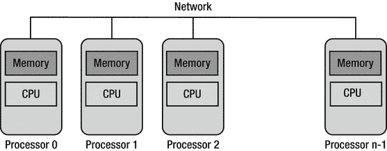
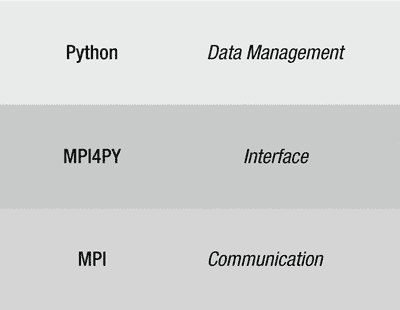

# 五、消息传递接口

在上一章中，我们学习了超级计算机的历史和哲学。我们还学习了与超级计算相关的重要概念。

在这简短的一章中，我们将开始在 Raspberry Pi 上安装必要的包和库。我们将安装 MPI4PY，这是一个用于 MPI 的 Python 库。最后，我们将安装用于节点发现的实用程序 nmap。

## 消息传递接口

消息传递接口标准(MPI)是基于 MPI 论坛建议的消息传递库标准。MPI 论坛在美国和欧洲有超过 40 个参与组织。消息传递接口的目标是为消息传递定义一个可移植的、有效的、灵活的标准，它将被广泛用于编写各种各样的消息传递程序。MPI 是第一个独立于供应商的消息传递库标准。使用 MPI 标准开发消息传递程序的优点是可移植性、效率和灵活性。尽管 MPI 不是 IEEE 或 ISO 标准，但它已经成为为高性能计算(HPC)、并行计算机、集群和分布式系统等各种平台编写消息传递程序的行业标准。MPI 标准定义了库例程的语法和语义，用于用 C、C++和 Fortran 编写可移植的消息传递程序。

与 MPI 相关的一些重要事实如下:

*   MPI 是库的规范。MPI 本身不是一个库。
*   MPI 的目标是消息传递标准应该实用、可移植、高效和灵活。
*   根据 MPI 标准的实现方式，实际的 MPI 库略有不同。
*   MPI 标准已经经历了几次修订。最新版本是 MPI-3.2。

Note

有关 MPI 论坛和标准的更多信息，请访问 MPI 论坛的主页( [`www.mpi-forum.org`](http://www.mpi-forum.org) )和 MPI 标准文档页面( [`www.mpi-forum.org/docs/docs.html`](http://www.mpi-forum.org/docs/docs.html) )。

### MPI 标准的历史和发展

1992 年 4 月 29-30 日，一个关于分布式内存环境中消息传递标准的研讨会在弗吉尼亚州的威廉斯堡召开。讨论了标准消息传递接口的基本特征，并成立了一个工作组来继续标准化进程。从那以后，MPI 的工作继续进行，工作组定期开会。MPI 标准草案在 1993 年 11 月的超级计算’93 会议上提出。经过一段时间的公众评议，MPI 标准发生了一些变化，1994 年 6 月发布了 MPI 1.0 版。这些会议和电子邮件讨论一起导致了 MPI 论坛的形成。来自美国和欧洲 40 个组织的大约 80 人参与了 MPI 标准化工作。到目前为止，MPI 的最新版本是 MPI-3.2，我们将使用它来构建集群。

### MPI 的特性

MPI 针对具有分布式内存和连接所有节点的网络的分布式系统进行了优化，如图 [5-1](#Fig1) 所示。



图 5-1。

Distributed memory system

以下是消息传递接口的功能:

*   简单性:MPI 范式的基础是传统的通信操作。
*   通用性:它可以在大多数基于并行架构的系统上实现。
*   性能:实现可以匹配底层硬件的速度。
*   可伸缩性:相同的程序可以部署在更大的系统上，而无需对其进行任何更改。

当我们开始学习如何用 MPI4PY 编码时，我们将研究 MPI 范例的更多细节。

### MPI 的实现

正如我们已经看到的，MPI 不是一个库，而是开发消息传递库的标准，有几种 MPI 实现。以下是最受欢迎的实现:

*   奥林匹克运动会
*   MP-MPICH (MP 代表多平台)
*   温姆皮奇
*   MPI BIP
*   惠普的 MPI
*   IBM 的 MPI
*   SGI 的 MPI
*   邮票
*   OpenMPI(开放原始码)

## MPI4PY

MPI4PY 代表 Python 的 MPI。MPI for Python 为 Python 提供了 MPI 绑定。这允许任何 Python 程序使用多处理器配置计算机。这个包是建立在 MPI-1/2/3 规范之上的。它为 Python 中的并行编程提供了面向对象的接口。它支持任何 Python 对象的点对点(发送和接收)和集体(广播、分散和收集)通信。

图 [5-2](#Fig2) 描绘了 MPI4PY 的概况。



图 5-2。

Philosophy of MPI4PY

### 为什么要使用 Python、MPI 和 MPI4PY 的组合？

Python 是 HPC(高性能计算)中三种最常用的编程语言之一。另外两个是 C 和 FORTRAN。正如我们前面看到的，Python 语法很容易理解和学习。MPI 是 HPC 和并行编程的事实上的标准。自 1994 年左右(20 多年)以来，它就一直存在。MPI4PY 是一个广受好评的、干净的、高效的 Python MPI 实现。它涵盖了大部分 MPI-2 标准。这就是为什么我们要在树莓派 上使用 Python 3 配合 MPI4PY 进行并行编程。

### 在 Raspbian 上为 Python3 安装 MPI4PY

在 Raspbian 上安装 Python 3 的 MPI4PY 非常简单。用户只需在 lxterminal 中运行以下命令:

```py
sudo apt-get install python3-mpi4py -y

```

为 Python 3 安装 MPI4PY 需要几分钟时间。

要检查它是否已安装，请运行以下命令:

```py
mpirun hostname

```

它应该输出主机名 raspberrypi。

运行以下命令启动多个进程:

```py
mpirun -np 3 hostanme

```

输出如下所示:

```py
raspberrypi
raspberrypi
raspberrypi

```

我们还可以运行以下命令来检查系统上安装的 MPI 版本:

```py
mpirun -V

```

这样我们就可以安装、运行和验证 MPI4PY。

Note

有关更多详细信息，请访问 mpirun 手册页( [`www.open-mpi.org/doc/v1.8/man1/mpirun.1.php`](http://www.open-mpi.org/doc/v1.8/man1/mpirun.1.php) )。在本书的后半部分，我们将在 Python 3 中广泛使用 mpirun，在那里我们将详细研究它。

## 正在安装 nmap

nmap 是一个网络安全扫描器。我们将使用它来发现我们的 Pi 的 IP 地址。我们将在下一章使用它。现在，只需通过运行以下命令来安装 nmap:

```py
sudo apt-get install nmap

```

## 结论

在本章中，我们学习了通过安装 MPI4PY 为超级计算准备一个 Pi。在下一章中，我们将通过连接多个 pi 来构建一台超级计算机。