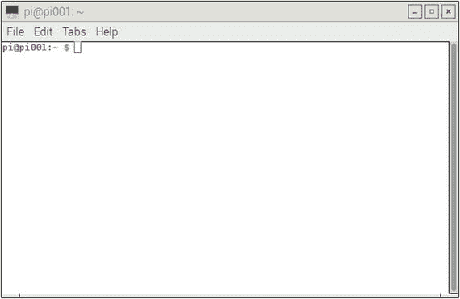

# 六、构建超级计算机

在前一章中，我们通过安装必要的库、框架和工具为超级计算准备了 Pi。在本章中，我们将学习创建一个由多个 pi 组成的网络，并使用它来并行运行各种命令。

## 制作 MicroSD 卡的备份

一旦我们配置了 Pi，更新了它，并安装了必要的软件包和实用程序，我们就应该备份 microSD 卡。这是必要的，因为(上帝禁止！)如果 microSD 卡或 Pi 被损坏或丢失，那么我们可以用备份来继续我们的工作。建议始终备份一个安装并更新了 Raspbian 操作系统的 microSD 卡。此外，在安装了项目所需的必要包、工具和实用程序之后进行备份也是一个好主意，我总是遵循这个好主意。

要备份 microSD 卡，首先将其从 Pi 中取出，并将其插入 SD 读卡器。将 SD 读卡器连接到安装了 Win32DiskImager 的 Windows 计算机。打开 Win32DiskImager 并选择一个位置。为备份文件选择一个合适的名称。追加扩展名。img 或者。文件名后的 IMG。的。img 或者。IMG 扩展用于原始存储磁盘映像。见下图(图 [6-1](#Fig1) )截图举例。


图 6-1。

Taking the microSD card backup

然后点击阅读按钮。一旦完成，将显示如下(图 [6-2](#Fig2) )对话框。


图 6-2。

Backup completed

Raspbian OS、MPICH 和 MPI4PY 安装的更新版本的映像文件现在保存在硬盘上。我们可以使用这个图像为超级计算机的其余节点准备其他 microSD 卡。要做到这一点，我们只需要用 Win32DiskImager 把这个镜像写到其他 microSD 卡上。

## 准备超级计算机的节点

使用我们在上一节中准备的操作系统映像，我们将准备超级计算机的其他节点。使用 Win32DiskImager 将此操作系统映像写入其他 microSD 卡。一旦所有的 microSD 卡都准备好了，就把它们插入 Pis。每个 Pi 应该有一个唯一的主机名。我们可以用 raspi-config 更改 Pi 的主机名。转到高级选项并选择 A2 主机名。更改主机名，如下图截图所示(图 [6-3](#Fig3) )。


图 6-3。

Changing the hostname

主机名更改后，lxterminal 中的提示会出现在下面的截图中(图 [6-4](#Fig4) )。



图 6-4。

The lxterminal prompt after changing the hostname

如您所见，提示符和 lxterminal 窗口标题中的主机名`raspberrypi`被替换为`pi001`。

对所有 pi 执行相同的步骤，并将它们的主机名更改为`pi002`、`pi003`等等。

## Pis 联网

这是一个有点棘手的部分。我们可以通过许多方式将 pi 连接在一起。选择取决于基础设施和可用的预算。让我们探索几个简单易行的方法。

### 使用 DHCP 的局域网

此选项适用于受管理的网络交换机和 WiFi 路由器。访问受控交换机或 WiFi 路由器的管理控制台。登录到管理控制台后，将有选项来设置 DHCP 的地址范围。修改该范围，因为我们将向其中添加更多设备。

对于 WiFi 路由器来说，管理控制台通常是一个网页。可以通过连接到 WiFi，然后在浏览器中键入其 IP 地址来访问它。它通常以用户名和密码的形式进行验证，通常在 WiFi 路由器手册中列出。每个 WiFi 路由器都有用于有线局域网的以太网端口，如下图所示(图 [6-5](#Fig5) )。


图 6-5。

Rear side of a WiFi router (image from [`https://www.flickr.com/photos/smemon/`](https://www.flickr.com/photos/smemon/) )

更新`/etc/network/interfaces`中的网络设置，作为 IP 地址分配方案自动连接到 LAN 和 DHCP。以下是一个示例`/etc/network/interfaces`文件:

```py
source-directory /etc/network/interfaces.d

auto lo
iface lo inet loopback

auto eth0
iface eth0 inet dhcp

```

### WiFi 网络

我们知道 Pi 3 之前的所有型号的 Pi 都需要 USB WiFi 适配器。最好的选择是如果你有一个 WiFi 路由器和许多 Pi 3s。如果 Pis 的型号早于 Pi 3，您将不得不投资购买 USB WiFi 适配器。在为相关型号的 Pi 配备 USB WiFi 适配器后，更新`/etc/network/interfaces`中的网络设置，以便自动连接到 WiFi。

下面是一个示例`/etc/network/interfaces`文件。

```py
source-directory /etc/network/interfaces.d

auto lo
iface lo inet loopback

auto wlan0
iface wlan0 inet dhcp
wpa-ssid "ASHWIN"
wpa-psk "internet"

```

将`ASHWIN`替换为您 WiFi 网络的 ssid，将`internet`替换为您 WiFi 网络的密码。

### 具有静态 IP 地址的局域网

这是我的首选方法。所有被管理的网络交换机和 WiFi 路由器都有一个静态 IP 地址范围。为集群中的节点选择几个地址，然后更新`/etc/network/interfaces`文件。使用受管网络交换机或 WiFi 路由器的 IP 地址作为网关的值。

使用低成本的非托管网络交换机可能是最便宜的选择。“未被管理”意味着它们没有管理控制台。只需用以太网电缆将 pi 连接到交换机，并按如下方式更新`/etc/network/interfaces`:

```py
source-directory /etc/network/interfaces.d

auto lo
iface lo inet loopback

auto eth0
iface eth0 inet static

# Your static IP
address 192.168.0.2

# Your gateway IP
gateway 192.168.0.1
netmask 255.255.255.0

# Your network address family
network 192.168.0.0
broadcast 192.168.0.255

```

对于所有 pi，网络设置(除了 IP 地址)将与上述相同。IP 地址将是唯一的。此外，由于交换机不受管理，我们通过使用与网关相同的值(在上例中为 192.168.0.1)为其手动分配 IP 地址。所有 pi 的网关值必须相同。

更改网络设置后重新启动 Pis。

以下是几款低成本非托管交换机及其各自的产品页面。

*   [T2`www.dlink.ru/mn/products/1`](http://www.dlink.ru/mn/products/1)
*   [T2`www.dlink.lt/en/products/1/1857.html`](http://www.dlink.lt/en/products/1/1857.html)
*   [T2`www.dlink.ru/mn/products/1/2110.html`](http://www.dlink.ru/mn/products/1/2110.html)

## 使用 nmap 查找 Pis 的 IP 地址

不管网络类型(以太网或 WiFi)和 IP 地址分配方案(静态或动态)，我们都需要知道网络中所有 pi 的 IP 地址，以便将 pi 的网络用作集群。在前一章中，我们安装了`nmap`实用程序。我们现在将使用它来查找网络中 pi 的 IP 地址。

将显示器、键盘和鼠标连接到`pi001`。我们将使用`pi001`作为主节点。我们将在`pi001`使用 lxterminal 为超级计算机运行命令和并行程序。

将所有 pi 连接到网络。我们不需要将任何显示器或 I/O 设备连接到其他 pi。

启动所有 Pis。一旦所有 pi 启动，用`nmap`扫描网络。

以下是扫描网络的命令:

```py
sudo nmap -sn 192.168.0.*

```

在上面的命令中，`192.168.0.*`中的前三个字节对应于我的网络的 IP 地址。用网络标识符的前三个字节替换它们，并在`pi001`上的 lxterminal 中运行命令。

输出如下所示:

```py
Starting Nmap 6.47 ( http://nmap.org ) at 2016-09-15 18:02 IST
mass_dns: warning: Unable to determine any DNS servers. Reverse DNS is disabled.\
Try using --system-dns or specify valid servers with --dns-servers
Nmap scan report for 192.168.0.2
Host is up (0.0020s latency).
Nmap scan report for 192.168.0.3
Host is up (0.0018s latency).
Nmap scan report for 192.168.0.4
Host is up (0.0016s latency).
Nmap scan report for 192.168.0.5
Host is up (0.0014s latency).
Nmap done: 256 IP addresses (4 hosts up) scanned in 2.70 seconds

```

记下网络中所有覆盆子 pi 的 IP 地址。在这种情况下，IP 地址是 192.168.0.2、192.168.0.3、192.168.0.4 和 192.168.0.5。

## 使用 mpirun 在多个 pi 上运行 hostname 命令

在`pi001`上，通过运行以下命令导航到`/home/pi`:

```py
cd ∼

```

创建一个名为`myhostfile`的新文件。将之前记下的所有 IP 地址添加到`myhostfile`中，如下所示:

```py
192.168.0.2
192.168.0.3
192.168.0.4
192.168.0.5

```

现在运行以下命令:

```py
mpirun -hostfile myhostfile -np 4 hostname

```

它将显示一个带有错误的输出，并且命令`hostname`不会在文件`myhostfile`中列出的所有主机上运行。

这是因为我们试图在`pi002`、`pi003`和`pi004`上远程运行来自`pi001`的命令。我们没有这方面的认证。

### 为自动认证交换 ssh-keygen 密钥

`ssh-keygen`实用程序用于生成认证密钥。要在任意两台 Linux 计算机之间建立身份验证，请执行以下步骤:

1.  使用`ssh-keygen.`为两台主机生成密钥
2.  通过远程复制密钥，在主机之间交换密钥。
3.  将密钥添加到授权主机列表中。

完成后，我们可以在没有密码的情况下执行以下操作，因为在密钥交换后，不会再次提示输入密码。

1.  登录到远程主机。
2.  在远程主机上执行 shell 命令。

我们还可以在 shell 脚本中使用`ssh`命令来自动化远程主机中的任务。我们使用`pi001`作为主节点，所以我们希望从其他节点上的`pi001`远程运行命令，反之亦然。我已经建立了一个包含四个节点的集群，因此用于密钥交换的主机对是(`pi001,pi002`)、(`pi001,pi003`)和(`pi001,pi004`)。

让我们交换钥匙。打开 lxterminal 并转到`pi001`的主目录。

```py
cd ∼

```

运行`ssh-keygen`命令生成密钥。只要在每次提示输入时按下回车键。以下是 lxterminal 上的输出:

```py
Generating public/private rsa key pair.
Enter file in which to save the key (/home/pi/.ssh/id_rsa):
Enter passphrase (empty for no passphrase):
Enter same passphrase again:
Your identification has been saved in /home/pi/.ssh/id_rsa.
Your public key has been saved in /home/pi/.ssh/id_rsa.pub.
The key fingerprint is:
03:bc:3f:5a:28:88:b7:ac:6c:50:f0:81:5e:f9:6d:5f pi@pi001
The key's randomart image is:
+---[RSA 2048]----+
| . .             |
|o .o .           |
|.o... +          |
| .o . = E        |
| . o S .         |
|.. . o o         |
|o o . . +        |
|.+ . . o .       |
|ooo .            |
+-----------------+

```

请注意，由于每次执行生成的密钥不同，命令提示符上显示的图像每次都会不同。

上面的执行在 Pi 的主目录中创建了一个隐藏目录`.ssh`。转到`.ssh`目录。

```py
cd .ssh

```

通过运行`ls`命令检查`.ssh`目录的内容，如下所示:

```py
pi@pi001:∼/.ssh $ ls
id_rsa id_rsa.pub

```

在上面的输出中，`id_rsa`是私钥，`id_rsa.pub`是主机`pi001`的公钥。我们必须将公钥复制到我们想要远程登录和执行命令的主机上。

为了保持有序，我们将公钥`id_rsa.pub`复制到一个新文件`pi01`。

```py
cp id_rsa.pub pi01

```

我们需要将这个`pi01`文件的内容添加到其他主机的`authorized_keys`文件中，以便在没有身份验证的情况下实现远程访问。

现在使用以下命令登录到`pi002`:

```py
ssh pi@192.168.0.3

```

系统会提示我们输入`pi002`的密码。输入密码。

像我们在`pi001`上做的那样，在`pi002`上运行以下命令来生成公钥:

```py
ssh-keygen
cd .ssh
cp id_rsa.pub pi02

```

现在我们需要使用`scp`将`pi001`的公钥文件复制到`pi002`。

```py
scp 192.168.0.2:/home/pi/.ssh/pi01 .

```

通过运行以下命令，将`pi01`的内容添加到`authorized_keys`中:

```py
cat pi01>>authorized_keys

```

最后，使用注销命令从`pi002`注销。

对于`pi003`，我们又要按照同样的步骤。

登录到`pi003`。

```py
ssh pi@192.168.0.4

```

在`pi003`上运行以下命令序列:

```py
ssh-keygen
cd .ssh
cp id_rsa.pub pi03
scp 192.168.0.2:/home/pi/.ssh/pi01 .
cat pi01>>authorized_keys
logout

```

对于`pi004`，我们又要按照同样的步骤。

登录到`pi004`。

```py
ssh pi@192.168.0.5

```

在`pi004`上运行以下命令序列:

```py
ssh-keygen
cd .ssh
cp id_rsa.pub pi04
scp 192.168.0.2:/home/pi/.ssh/pi01 .
cat pi01>>authorized_keys
logout

```

在`pi001`中，运行以下命令序列，将`pi002`、`pi003`和`pi004`的公钥复制到`pi001`。

```py
cd /home/pi/.ssh
scp 192.168.0.3:/home/pi/.ssh/pi02 .
scp 192.168.0.4:/home/pi/.ssh/pi03 .
scp 192.168.0.5:/home/pi/.ssh/pi04 .

```

然后运行以下命令，将这些公钥添加到`pi001`的授权密钥列表中:

```py
cat pi02>>authorized_keys
cat pi03>>authorized_keys
cat pi04>>authorized_keys

```

这就完成了集群的设置。要测试设置，在`pi001`上运行以下命令:

```py
mpirun -hostfile myhostfile -np 4 hostname

```

上面命令的输出应该如下所示:

```py
pi001
pi002
pi003
pi004

```

恭喜你。我们已经建立了自己的小型超级计算机集群。在下一节中，我们将学习如何在一个漂亮的栈中组织我们的集群。

## 在集群中组织 pi

当我建立我的第一个集群时，我想到了创建一个定制的丙烯酸案件；然而，估计的费用超出了我的预算。我还想到通过 3D 打印为集群创建一个定制案例，但 3D 打印承包商也为此报出了一笔天文数字。所以我决定尝试一种更具成本效益的方法来组织集群中的 pi。我使用 M3 六角间隔垫片来创建一个 Pis 栈。我们需要两种类型的对峙，男性对女性和女性对女性。我们现在将使用这些来创建一个栈。重要的是，支架的长度必须至少为 25 毫米，以避免 Raspberry Pi PCBs 相互接触。

Note

在谷歌上搜索 M3 六角支架垫片。

如下图所示(图 [6-6](#Fig6) )，取四个凸对凹支架，并将它们连接到一个 Pi 上。


图 6-6。

Attaching male-to-male standoffs to the Pi

之后，取四个凹对凹支座，将它们连接到 Pi 的底部，如下图所示(图 [6-7](#Fig7) )。


图 6-7。

Attaching female-to-female standoffs to the cluster base

现在将第二个 Pi 连接到此处，如下图所示(图 [6-8](#Fig8) )。


图 6-8。

Adding second Pi to the stack

最后，将剩余的两个 pi 添加到此之后，集群栈看起来如下图所示(图 [6-9](#Fig9) )。


图 6-9。

Raspberry Pi Supercomputer stack

## 结论

在本章中，我们学习了如何将几个 pi 连接在一起，构建一个超低成本的迷你超级计算机集群。我们还了解了如何在一个方便的栈中组织集群。在下一章中，我们将学习如何超频 Pi 的各种模型，以增加集群中 Pi 的计算能力，而无需额外的成本。