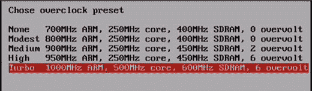
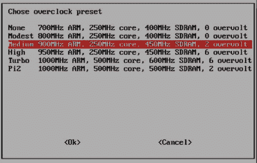

# 七、超频树莓派

在这一章中，我们将学习如何通过超频这台神奇的小计算机的各种组件来增加各种型号的 Raspberry Pi 的计算能力。我们将通过`raspi-config`和通过改变`config.txt`的内容来研究如何超频。

超频意味着配置计算机的硬件部件以比原始制造商认证的速度更快的速度运行。器件的工作速率通常用时钟频率来表示，如 MHz、GHz 等。通常超频组件的工作电压也会增加，这有助于在加速时保持组件的工作稳定性。然而，超频的缺点是，给定的半导体器件在比常规设置更高的频率和电压下工作时会产生和散发更多的热量，因此大多数超频尝试也会增加功耗和散热。为了减轻超频组件中增加的散热，我们通常必须安装散热器和冷却系统。

让我们从超频 Raspberry Pi 的基础开始。在本章中，我们将详细探讨如何安装被动散热器以及如何超频各种型号的 Raspberry Pi。

## 树莓派 超频的风险

超频 Raspberry Pi 使我们能够充分利用它。然而，我们不应该在不了解风险的情况下这样做。非常重要的一点是，我们要明白我们将要面对的是什么。

这里有一些我们必须注意的超频风险:

*   寿命缩短:部件可能会很快失效。
*   发热:以更高的速度运行会产生和散发更多的热量。
*   文件损坏:许多超频者在未优化的超频设置下观察到文件损坏。
*   保修失效:强制过电压将使保修失效。

## 在 Pi 上安装散热器

散热器是用于吸收多余热量的装置或物质。如果您计划超频您的 Pi，那么建议在处理器、内存和图形处理器上安装散热器。

大多数散热器上都粘有不干胶。用它们在 Pi 的芯片上安装散热片。大多数人只在使用 Raspberry Pi 时使用被动散热器，因为像液体冷却和/或散热器这样的主动散热机制对 Raspberry Pi 来说太过了。

### 采购散热器

许多经销商在网上销售散热器。你可以谷歌一下关键词树莓派散热器。

以下是销售散热器的各个经销商的网站链接:

*   [T2`www.sparkfun.com/products/121`](http://www.sparkfun.com/products/121)
*   [T2`www.adafruit.com/categories/151`](http://www.adafruit.com/categories/151)
*   [T2`https://shop.pimoroni.com/products/heatsink`](https://shop.pimoroni.com/products/heatsink)
*   [T2`www.modmypi.com/raspberry-pi/accessories/heat-sinks-and-cooling/raspberry-pi-heat-sink-kit-black`](http://www.modmypi.com/raspberry-pi/accessories/heat-sinks-and-cooling/raspberry-pi-heat-sink-kit-black)

## 使用 raspi-config 超频 Pi

我们可以使用`raspi-config`工具中的超频选项对 Pi 进行超频。

下面(图 [7-1](#Fig1) )是 Pi B 和 Pi B+中的超频选项截图。



图 7-1。

Overclock options in Pi B and Pi B+

下面(图 [7-2](#Fig2) )是 Pi 2 中超频选项的截图。



图 7-2。

Overclock options in Pi 2

## 使用/boot/config.txt 对 Pi 进行超频

我们已经学会了如何用`raspi-config`超频；但是，它不允许对将要超频的 Pi 进行微调。还有一种超频 Pi 的方法，我们可以通过改变`/boot/config.txt`中的几个参数来手动实现。

### /boot/config.txt 中的选项

我们可以在`/boot/config.txt`文件中添加或更改选项。如果你已经使用了`raspi-config`工具进行超频和/或内存分割，那么你会发现这些选项中的许多已经出现在了`/boot/config.txt`文件中。

*   `arm_freq`:ARM 内核的频率，单位为 MHz。
*   `core_freq`:GPU 处理器内核的频率，单位为 MHz。
*   `h264_freq`:硬件视频块的频率，单位为 MHz。
*   `isp_freq`:图像传感器流水线块的频率，单位为 MHz。
*   `v3d_freq`:3D 块的频率，单位为 MHz。
*   `avoid_pwm_pll`:不要将 pll 专用于 PWM 音频。这将略微降低模拟音频质量。备用 PLL 允许 core_freq 独立于 GPU 的其余部分设置，从而对超频进行更多控制。
*   `dram_freq`:SDRAM 的频率，单位为 MHz。
*   `over_voltage` : ARM/GPU 核心电压调整。
*   `over_voltage_sdram_c` : SDRAM 控制器电压调整。
*   `over_voltage_sdram_i` : SDRAM I/O 电压调整。
*   `over_voltage_sdram_p` : SDRAM phy 电压调整。
*   `force_turbo`:禁用动态 cpufreq 驱动程序和以下最低设置。启用 H.264/V3D/ISP 超频选项。可以设置保修位。
*   `temp_limit`:过热保护。当 SoC 达到该摄氏度值时，将时钟和电压设置为默认值。设置高于默认值会使保修失效。
*   `gpu_mem` : GPU 内存，单位兆字节。设置 ARM 和 GPU 之间的内存分配。ARM 获得剩余的内存。如果已经使用 raspiconfig 设置了该值，则无需进行设置。

## 各种型号 Pi 的/boot/config.txt 选项

每个圆周率都是唯一的。必须为单个 Pi 定制`/boot/config.txt`中超频 Pi 的选项值。这些选项没有一套最适合所有 pi 的值。我通过反复试验学到了这一点。如果您为超频选项设置的值不是最合适的，Pi 将会不稳定或根本无法启动。在这些情况下，您可以尝试使用其他计算机更改 microSD 卡上`config.txt`中的超频选项值，然后使用同一张卡启动 Pi。这样做，直到你得到一组稳定的和最优的 Pi 值。一般来说，对于任何类型的硬件(如 CPU 和 RAM)，超频设置取决于单个 IC。

我们可以在 eLinux RPi 配置页面( [`http://elinux.org/RPiconfig`](http://elinux.org/RPiconfig) )找到上述选项的详细解释。

### Pi B 和 Pi B+的选项

以下是 Pi B 和 Pi B+的超频选项值:

```py
arm_freq=950
core_freq=450
sdram_freq=500
gpu_mem=16

```

### Pi 2 的选项

以下是 Pi 2 的超频选项值:

```py
arm_freq=1100
over_voltage=4
core_freq=550
sdram_freq=483
over_voltage_sdram_p=0
over_voltage_sdram_i=0
over_voltage_sdram_c=0
gpu_mem=16
force_turbo=1
avoid_pwm_pll=1
v3d_freq=450
h264_freq=0
isp_freq=0
avoid_safe_mode=1

```

### Pi 3 的选项

以下是 Pi 3 的超频选项值:

```py
arm_freq=1350
over_voltage=6
temp_limit=80
core_freq=500
h264_freq=333
avoid_pwm_pll=1
gpu_mem=450
v3d_freq=550
sdram_freq=588
sdram_schmoo=0x02000020
over_voltage_sdram_p=6
over_voltage_sdram_i=4
over_voltage_sdram_c=4
force_turbo=1

```

如果您的 Pi 无法启动或变得不稳定，请尝试调整这些值以获得最佳设置。

我们无法涵盖稳定超频的所有可能的工作设置组合。浏览以下网站链接，了解超频相关信息:

[T2`http://linuxonflash.blogspot.in/2015/02/a-look-at-raspberry-pi-2-performance.html`](http://linuxonflash.blogspot.in/2015/02/a-look-at-raspberry-pi-2-performance.html)

[T2`https://github.com/retropie/retropie-setup/wiki/Overclocking`](https://github.com/retropie/retropie-setup/wiki/Overclocking)

超频后，使用`cat /proc/cpuinfo`命令检查所有型号的处理器速度。

Note

不要将超频 Pi 的 microSD 卡插入另一个 Pi。记住！每件硬件都有独特的超频设置。如果要将一个超频 Pi 的 microSD 卡用于另一个 Pi，请禁用/boot/config.txt 中的超频设置，然后将其用于另一个 Pi。

Exercise

超频所有你打算用来构建小型超级计算机集群的 Raspberry Pis。这将在运行时方面提高个人和整体的性能。

## 结论

在这一章中，我们学习了如何超频各种型号的树莓派。从下一章开始，我们将开始研究如何利用我们构建的集群的计算能力。我们将使用 MPI4PY 用 Python 3 编写代码，演示 MPI 和并行编程中的概念。