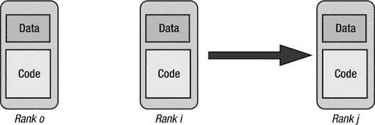
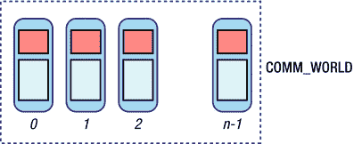
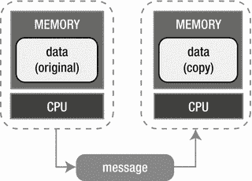

# 八、Python 3 中的并行编程

在上一章中，我们学习了如何对各种型号的 Raspberry Pi 进行超频，以增加其计算能力。在本章中，我们将学习如何用 Python 和 MPI4PY 编写并行程序。我更喜欢 Python，因为它简单，而且 Python 中的代码不那么吓人。我们将探索 MPI 概念，并用 MPI4PY 在 Python 中实现这些概念。

我们将研究和实现的 MPI 概念如下:

*   MPI 等级和流程
*   发送和接收数据
*   数据标记
*   广播数据
*   分散和收集数据

## MPI4PY 的基础知识

在本书的前面部分，我们学习了一些 MPI 概念。这一章我们再研究几个。

MPI 使用单程序多数据`(` SPMD `)`的概念。以下是 SPMD 建筑的要点:

*   所有进程(称为等级)运行相同的代码，每个进程访问不同的数据部分。
*   所有进程同时启动。

并行程序被分解成单独的进程，称为等级。每个列都有自己的地址空间，这需要跨列划分数据。每个等级在自己的私有内存中保存一部分程序数据。等级按从 0 到 n-1 的顺序编号。下图(图 [8-1](#Fig1) )描述了同时运行的多个队列。



图 8-1。

Multiple ranks running simeltaneously

在下一节中，我们将看到一个带有等级的基本程序。

## MPI4PY 入门

让我们从简单的 Hello World 开始吧！用 MPI4PY 用 Python 编程。

```py
from mpi4py import MPI
import sys

comm = MPI.COMM_WORLD
name = MPI.Get_processor_name()

sys.stdout.write("Hello World!")
sys.stdout.write(" Name: %s, My rank is %d\n" % (name, comm.rank))

Listing 8-1.prog01.py

```

在上面的代码(清单 [8-1](#Par15) )中，语句`from mpi4py import MPI`导入所需的 MPI4PY 库。在第 6 章中，我们学习了 MPI 中通信者的概念。`MPI.COMM_WORLD`是传播者。它用于运行在集群进程上的进程之间的所有 MPI 通信。`Get_processor_name()`返回当前进程运行的主机名。`comm.rank`是当前流程的等级。下图(图 [8-2](#Fig2) )描绘了`COMM_WORLD`。



图 8-2。

COMM_WORLD

你可能已经注意到我们正在控制台上使用`sys.stdout.write()`进行打印。这是因为我希望代码兼容 Python 编程语言的两种解释器，`python`(Python 2 的解释器)和`python3`。在本书中，我们不会使用任何特定于任一解释器的特性或编程结构。因此，代码可以使用两种解释器运行。

这一章我们已经开始编码了，后面的章节有很多代码样例和练习。将代码和数据组织在单独的目录中是一个好主意。在 lxterminal 中逐一运行以下命令:

```py
mpirun -hostfile myhostfile -np 4 mkdir /home/pi/book
mpirun -hostfile myhostfile -np 4 mkdir /home/pi/book/code
mpirun -hostfile myhostfile -np 4 mkdir /home/pi/book/code/chapter08

```

这将在小型超级计算机的所有节点上创建相同的目录结构。现在将上面的代码保存在`∼/book/code/chapter08`目录下一个名为`prog01.py`的文件中。使用`scp as`将代码文件复制到所有节点上的那个目录，如下所示:

```py
scp book/code/chapter08/prog01.py 192.168.0.2:/home/pi/book/code/chapter08/
scp book/code/chapter08/prog01.py 192.168.0.3:/home/pi/book/code/chapter08/
scp book/code/chapter08/prog01.py 192.168.0.4:/home/pi/book/code/chapter08/

```

最后，在`pi001`上运行`mpirun`,如下所示:

```py
mpirun -hostfile myhostfile -np 4 python3 ∼/book/code/chapter08/prog01.py

```

以下是输出:

```py
Hello World! Name: pi001, My rank is 0
Hello World! Name: pi002, My rank is 1
Hello World! Name: pi004, My rank is 3
Hello World! Name: pi003, My rank is 2

```

对于我们将在本章剩余部分讨论的所有其他代码示例，我们必须遵循相同的步骤。让我简单重复一遍:在`chapter08`目录下创建一个 Python 代码文件，将该文件复制到集群所有节点的`chapter08`目录下，最后使用`mpirun`和 Python 解释器来执行代码。

## 条件语句

我们可以在 MPI4PY 代码中使用如下条件语句(清单 [8-2](#Par28) ):

```py
from mpi4py import MPI
import sys

comm = MPI.COMM_WORLD
sys.stdout.write("My rank is: %d\n" % (comm.rank))

if comm.rank == 0:
    sys.stdout.write("Doing the task of Rank 0\n")

if comm.rank == 1:
    sys.stdout.write("Doing the task of Rank 1\n")

Listing 8-2.prog02.py

```

在这段代码中，我们检查进程等级是 0 还是 1，然后将更多消息打印到控制台。用`mpiexec`运行程序如下:

```py
mpirun -hostfile myhostfile -np 4 python3 ∼/book/code/chapter08/prog02.py

```

上面的程序(清单 [8-2](#Par28) )的输出如下:

```py
My rank is: 0
Doing the task of Rank 0
My rank is: 1
Doing the task of Rank 1
My rank is: 3
My rank is: 2

```

## 检查流程的数量

让我们编写代码(清单 [8-3](#Par34) )来显示 MPI 进程的等级和数量。

```py
from mpi4py import MPI
import sys

comm = MPI.COMM_WORLD
rank = comm.rank
size = comm.size

sys.stdout.write("Rank: %d," % rank)
sys.stdout.write(" Process Count: %d\n" % size)

Listing 8-3.prog03.py

```

在上面的代码中，`comm.size`给出了在集群中运行的 MPI 进程的数量。使用`mpiexec`运行上面的代码，如下所示:

```py
mpirun -hostfile myhostfile -np 4 python3 ∼/book/code/chapter08/prog03.py

```

输出如下所示:

```py
Rank: 0, Process Count: 4
Rank: 1, Process Count: 4
Rank: 2, Process Count: 4
Rank: 3, Process Count: 4

```

## 发送和接收数据

使用`send()`和`receive()`进行进程间的数据传输是进程间最简单的通信形式。我们可以用这个实现一对一的交流。下图(图 [8-3](#Fig3) )清楚地解释了这一点。



图 8-3。

One-to-one communication

让我们来看看代码示例(清单 [8-4](#Par41) )的相同之处。

```py
from mpi4py import MPI
import time
import sys

comm = MPI.COMM_WORLD

rank = comm.rank
size = comm.size
name = MPI.Get_processor_name()

shared = 3.14

if rank == 0:
    data = shared
    comm.send(data, dest=1)
    comm.send(data, dest=2)
    sys.stdout.write("From rank %s, we sent %f\n" % (name, data))
    time.sleep(5)

elif rank == 1:
    data = comm.recv(source=0)
    sys.stdout.write("On rank %s, we received %f\n" % (name, data))

elif rank == 2:
    data = comm.recv(source=0)
    sys.stdout.write("On rank %s, we received %f\n" % (name, data))

Listing 8-4.prog04.py

```

在上面的代码示例中，我们从等级为 0 的流程中发送数据。等级为 1 和 2 的进程正在接收数据。

让我们运行程序。

```py
mpirun -hostfile myhostfile -np 4 python3 ∼/book/code/chapter08/prog04.py

```

上面的程序(清单 [8-4](#Par41) )的输出如下:

```py
On rank pi002, we received 3.140000
On rank pi003, we received 3.140000
From rank pi001, we sent 3.140000

```

## 动态发送和接收数据

到目前为止，我们已经为发送和接收数据的过程编写了条件语句。然而，在大型分布式网络中，由于进程数量的不断变化，这种类型的数据传输并不总是可能的。此外，用户可能不想手工编写条件语句。

下面的例子(清单 [8-5](#Par49) )展示了动态数据传输的概念。

```py
from mpi4py import MPI
import sys

comm = MPI.COMM_WORLD
rank = comm.rank
size = comm.size
name = MPI.Get_processor_name()

shared = (rank+1)*(rank+1)

comm.send(shared, dest=(rank+1) % size)
data = comm.recv(source=(rank-1) % size)

sys.stdout.write("Name: %s\n" % name)
sys.stdout.write("Rank: %d\n" % rank)
sys.stdout.write("Data %d came from rank: %d\n" % (data, (rank-1) % size))

Listing 8-5.prog05.py

```

在上面的代码(清单 [8-5](#Par49) )中，每个进程都从前面的进程接收数据。这种情况一直持续到结束并循环，这样第一个进程从最后一个进程接收数据。

让我们运行代码。

```py
mpirun -hostfile myhostfile -np 4 python3 ∼/book/code/chapter08/prog05.py

```

代码的输出如下所示:

```py
Name: pi001
Rank: 0
Data 16 came from rank: 3
Name: pi002
Rank: 1
Data 1 came from rank: 0
Name: pi003
Rank: 2
Data 4 came from rank: 1
Name: pi004
Rank: 3
Data 9 came from rank: 2

```

如前所述，等级为 0 的进程(第一个进程)从等级为 3 的进程(最后一个进程)接收数据。

## 数据标记

在前面的例子(清单 [8-5](#Par49) )中，我们研究了如何用 MPI 发送和接收数据。这给好奇的程序员提出了一个基本问题:我们如何在进程间交换多个数据项？我们可以将多个数据项从一个进程发送到另一个进程。然而，在接收端，我们会遇到区分不同数据项的问题。解决这个问题的方法是标记。看看下面的代码示例(清单 [8-6](#Par57) )。

```py
from mpi4py import MPI
import sys

comm = MPI.COMM_WORLD
rank = comm.rank
size = comm.size
name = MPI.Get_processor_name()

if rank == 0:
    shared1 = {'d1': 55, 'd2': 42}
    comm.send(shared1, dest=1, tag=1)

    shared2 = {'d3': 25, 'd4': 22}
    comm.send(shared2, dest=1, tag=2)

if rank == 1:
    receive1 = comm.recv(source=0, tag=1)
    sys.stdout.write("d1: %d, d2: %d\n" % (receive1['d1'], receive1['d2']))
    receive2 = comm.recv(source=0, tag=2)
    sys.stdout.write("d3: %d, d4: %d\n" % (receive2['d3'], receive2['d4']))

Listing 8-6.prog06.py

```

在上面的例子中，我们将两个不同的字典`shared1`和`shared2`从等级为 0 的进程发送到等级为 1 的进程。在源端，`shared1`被标记为 1，`shared2`被标记为 2。在目的地，我们可以从与它们相关联的标签中区分不同的数据项。

用下面的命令运行上面的代码(清单 [8-6](#Par57) ):

```py
mpirun -hostfile myhostfile -np 4 python3 ∼/book/code/chapter08/prog06.py

```

输出如下所示:

```py
d1: 55, d2: 42
d3: 25, d4: 22

```

数据标记使程序员能够更好地控制数据流。当多个数据在流程之间交换时，数据标记是必须的。

## 数据广播

当数据从一个进程发送到所有其他进程时，就称为广播。考虑下面的代码(清单 [8-7](#Par65) ):

```py
from mpi4py import MPI
import sys

comm = MPI.COMM_WORLD
rank = comm.rank

if rank == 0:
    data = {'a': 1, 'b': 2, 'c': 3}
else:
    data = None

data = comm.bcast(data, root=0)
sys.stdout.write("Rank: %d, Data: %d, %d, %d\n"
                 % (rank, data['a'], data['b'], data['c']))

Listing 8-7.prog07.py

```

在上面的代码(清单 [8-7](#Par65) )中，在`if`语句中，只有当进程的等级为 0 时，我们才给数据分配一个字典。`bcast()`向所有进程广播数据。

运行程序。

```py
mpirun -hostfile myhostfile -np 4 python3 ∼/book/code/chapter08/prog07.py

```

输出如下所示:

```py
Rank: 0, Data: 1, 2, 3
Rank: 1, Data: 1, 2, 3
Rank: 2, Data: 1, 2, 3
Rank: 3, Data: 1, 2, 3

```

## 数据分散

在广播中，我们向所有进程发送相同的数据。在分散中，我们将不同的数据块发送给所有进程。例如，我们有一个包含四个项目的列表。在广播中，我们将所有这四个项目发送给所有进程，而在分散中，我们将列表中的项目发送给进程，这样每个进程都从列表中接收一个项目。下面的程序(清单 [8-8](#Par72) )演示了这一点。

```py
from mpi4py import MPI
import sys

comm = MPI.COMM_WORLD
size = comm.Get_size()
rank = comm.Get_rank()

if rank == 0:
    data = [x for x in range(0,size)]
    sys.stdout.write("We will be scattering: ")
    sys.stdout.write(" ".join(str(x) for x in data))
    sys.stdout.write("\n")
else:
    data = None

data = comm.scatter(data, root=0)
sys.stdout.write("Rank: %d has data: %d\n" % (rank, data))

Listing 8-8.prog08.py

```

在上面的代码(清单 [8-8](#Par72) )中，我们创建了一个名为 data 的列表，它的元素数量等于集群中的进程数。`scatter()`用于将数据分散到所有进程中。

运行代码。

```py
mpirun -hostfile myhostfile -np 4 python3 ∼/book/code/chapter08/prog08.py

```

以下是输出:

```py
Rank: 1 has data: 1
We will be scattering: 0 1 2 3
Rank: 0 has data: 0
Rank: 2 has data: 2
Rank: 3 has data: 3

```

正如我们所看到的，每个进程从列表中接收一个项目。`scatter()`的限制是我们分散的数据列表的大小不能超过进程的数量。

## 数据采集

收集数据的想法与分散相反。主进程收集由其他进程处理的所有数据。

下面的程序(列表 [8-9](#Par81) )演示了`gather()`方法。

```py
from mpi4py import MPI
import sys

comm = MPI.COMM_WORLD
size = comm.Get_size()
rank = comm.Get_rank()

if rank == 0:
    data = [x for x in range(0,size)]
    sys.stdout.write("We will be scattering: ")
    sys.stdout.write(" ".join(str(x) for x in data))
    sys.stdout.write("\n")
else:
    data = None

data = comm.scatter(data, root=0)
sys.stdout.write("Rank: %d has data: %d\n" % (rank, data))
data *= data

newData = comm.gather(data, root=0)

if rank == 0:
    sys.stdout.write("We have gathered: ")
    sys.stdout.write(" ".join(str(x) for x in newData))
    sys.stdout.write("\n")

Listing 8-9.prog09.py

```

在上面的程序(列表 [8-9](#Par81) )中，主进程分散数字列表。所有 MPI 进程都从列表中接收一个元素(列表的大小等于 MPI 进程的数量)。每个进程执行它接收的元素的一个操作。在我们的例子中，它是数字平方的计算。然而，在现实世界的超级计算中，操作可能相当复杂。

一旦操作完成，主进程将所有已处理的元素收集到一个新列表中。

运行代码。

```py
mpirun -hostfile myhostfile -np 4 python3 ∼/book/code/chapter08/prog09.py

```

输出如下所示:

```py
Rank: 1 has data: 1
Rank: 3 has data: 3
We will be scattering: 0 1 2 3
Rank: 0 has data: 0
We have gathered: 0 1 4 9
Rank: 2 has data: 2

```

## 结论

在本章中，我们介绍了 Python 的 MPI4PY 库。我们用 MPI4PY 学习并实验了并行编程中各种有趣的概念。在下一章中，我们将开始使用 Python 3 中带有 Raspberry Pi 的 SciPy 栈。