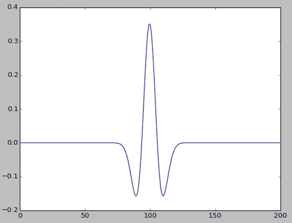

# 十二、SciPy 信号处理

在上一章中，我们学习了如何用 SciPy 进行科学计算。我们了解了 SciPy 库的几个模块。在本章中，我们将探索一个重要的科学领域，即信号处理，并且我们将学习`SciPy.signal`模块中的方法。让我们从 SciPy 中的信号处理开始吧。这将是一个简短的章节，只有几个代码示例，让您对信号处理领域的一些基础知识有所了解。

## 波形

让我们从波形发生器功能开始。在`∼/book/code`目录下新建一个目录`chapter` `12`。运行以下命令启动 Jupyter 笔记本应用程序:

```py
jupyter notebook

```

将当前笔记本重命名为`Chapter12_Practice`。和前面的章节一样，在同一个笔记本中运行本章的所有代码。先导入 NumPy 和 matplotlib。

```py
import numpy as np
import matplotlib.pyplot as plt

```

我们要研究的第一个例子是锯齿波发生器功能。

```py
from scipy import signal
t = np.linspace(0, 2, 5000)
plt.plot(t, signal.sawtooth(2 * np.pi * 4 * t))
plt.show()

```

该函数接受信号的时序和宽度，并生成三角形或锯齿形连续信号。以下(图 [12-1](#Fig1) )为输出，


图 12-1。

Sawtooth wave signal

让我们来看一个方波发生器，它接受时间序列和占空比作为输入。

```py
t = np.linspace(0, 1, 400)
plt.plot(t, signal.square(2 * np.pi * 4 * t))
plt.ylim(-2, 2)
plt.title('Square Wave')
plt.show()

```

输出如下所示:


图 12-2。

Square wave signal

脉宽调制方波正弦波可以如下所示:

```py
sig = np.sin(2 * np.pi * t)
pwm = signal.square(2 * np.pi * 30 * t, duty=(sig +1)/2)
plt.subplot(2, 1, 1)
plt.plot(t, sig)
plt.title('Sine Wave')
plt.subplot(2, 1, 2)
plt.plot(t, pwm)
plt.title('PWM')
plt.ylim(-1.5, 1.5)
plt.show()

```

输出(图 [12-3](#Fig3) )如下:


图 12-3。

Modulated wave

## 窗口功能

窗口函数是一种数学函数，在特定区间外为零。我们现在来看看三种不同的窗口函数。第一个是汉明窗函数。我们必须将输出窗口中的点数作为参数传递给所有函数。

```py
window = signal.hamming(101)
plt.plot(window)
plt.title('Hamming Window Function')
plt.xlabel('Sample')
plt.ylabel('Amplitude')
plt.show()

```

输出(图 [12-4](#Fig4) )如下:


图 12-4。

Hamming window demo

汉宁窗函数如下:

```py
window = signal.hanning(101)
plt.plot(window)
plt.title('Hanning Window Function')
plt.xlabel('Sample')
plt.ylabel('Amplitude')
plt.show()

```

输出(图 [12-5](#Fig5) )如下:


图 12-5。

Hanning window demo

凯泽窗函数如下:

```py
window = signal.kaiser(51, beta=20)
plt.plot(window)
plt.title('Kaiser Window Function Beta = 20')
plt.xlabel('Sample')
plt.ylabel('Amplitude')
plt.show()

```

输出(图 [12-6](#Fig6) )如下:


图 12-6。

Kaiser window demo

### 墨西哥帽小波

通过将点数和振幅作为参数传递，我们可以使用 Ricker 函数生成一个墨西哥帽小波，如下所示:

```py
plt.plot(signal.ricker(200, 6.0))
plt.show()

```

墨西哥帽小波是连续小波族中的一个特例。它用于过滤和平均光谱信号。输出如下所示:



图 12-7。

Mexican hat wavelet

### 盘旋

我们可以用`convolve()`方法卷积两个 N 维数组，如下所示:

```py
sig = np.repeat([0., 1., 0.], 100)
win = signal.hann(50)
filtered = signal.convolve(sig, win, mode='same') / sum(win)
plt.subplot(3, 1, 1)
plt.plot(sig)
plt.ylim(-0.2, 1.2)
plt.title('Original Pulse')
plt.subplot(3, 1, 2)
plt.plot(win)
plt.ylim(-0.2, 1.2)
plt.title('Filter Impulse Response')
plt.subplot(3, 1, 3)
plt.plot(filtered)
plt.ylim(-0.2, 1.2)
plt.title('Filtered Signal')
plt.show()

```

信号、窗口及其卷积如图 [12-8](#Fig8) 所示。两个信号的卷积提供了两个信号的组合以形成第三个信号。它是信号处理中一种非常重要的信号合并技术。如果信号代表图像或音频数据，我们可以基于卷积度获得改进的图像或音频。如果您还没有注意到，我们正在使用 NumPy 的`repeat()`方法，它把要重复的模式和重复次数作为参数。在本例中，我们生成一个样本大小为 300 的信号。


图 12-8。

Convolution

## 结论

在这简短的一章中，我们介绍了 SciPy 的`scipy.signal`模块中的几个重要的方法类。在下一章，我们将探索图像处理领域。