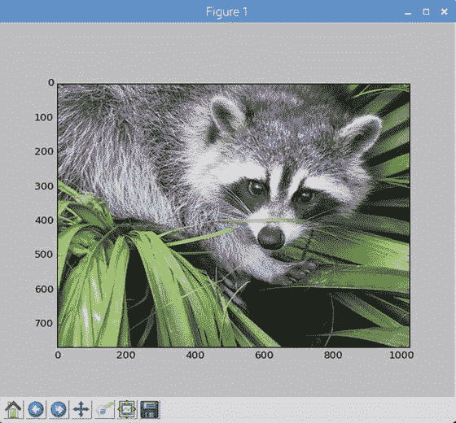
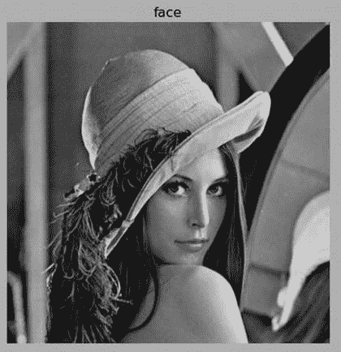
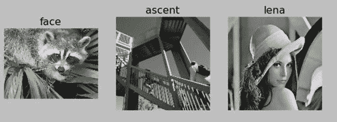
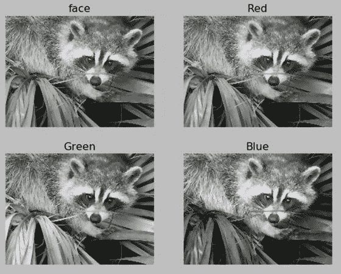

# 十三、SciPy 图像处理

在上一章中，我们用 SciPy 研究了信号处理。我们研究了 SciPy 提供的几个主要函数类，合并在`scipy.signal`下。在这一章中，我们将学习一个 SciPy 包，`scipy.misc`，以及一些使用它进行图像处理的例子。

## 第一图像处理程序

`scipy.misc`模块用于基本的图像处理操作。创建一个名为`Dataset`的目录来存储我们将要使用的所有样本图像。

```py
cd ∼/book
mkdir Dataset

```

样本图像数据集可以在本书的页面上的在线下载部分获得。同样，为图书代码创建一个目录`chapter` `13`，如下所示:

```py
cd ∼/book/code
mkdir chapter13
cd chapter13

```

让我们看一个读取和显示图像的基本例子(清单 [13-1](#Par7) )。

```py
from scipy import misc

img = misc.imread('/home/pi/book/Dataset/4.2.01.tiff')

misc.imshow(img)

Listing 13-1.prog01.py

```

代码(清单 [13-1](#Par7) 将从`imread()`方法提供的路径中读取一个图像，并且`imshow()`方法将使用`xlib`显示它。

`scipy.misc`有三个内置图像。这些可以如下使用(列表 [13-2](#Par10) ):

```py
from scipy import misc

img1 = misc.face()
img2 = misc.lena()
img3 = misc.ascent()

misc.imshow(img1)
misc.imshow(img2)
misc.imshow(img3)

Listing 13-2.prog02.py

```

`face()`是浣熊的脸，`lena()`是标准测试图像，`ascent()`是灰度图像。

## 简单的图像处理

`scipy.misc`有三种简单操作的方法。`scipy.imfilter()`对图像应用各种滤镜。以下(清单 [13-3](#Par13) )是一个例子:

```py
from scipy import misc

misc.imshow(misc.imfilter(misc.face(), 'edge_enhance_more'))

Listing 13-3.prog03.py

```

在上面的代码中(清单 [13-3](#Par13) ，我没有使用任何中间变量来存储图像。我通过传递给`imshow()`方法来直接显示它。方法`imfilter()`接受两个参数。

*   第一个是要过滤的图像。
*   第二个是要应用的预定义过滤器的类型。

过滤器类型的允许值为`'blur', 'contour', 'detail', 'edge_enhance', 'edge_enhance_more', 'emboss', 'find_edges', 'smooth', 'smooth_more', 'sharpen'`。

我们可以将图像的大小调整为 50%，如下所示(清单 [13-4](#Par19) ):

```py
from scipy import misc
misc.imshow(misc.imresize(misc.face(), 50))
Listing 13-4.prog04.py

```

我们也可以将图像旋转一定角度，如下所示(列表 [13-5](#Par21) ):

```py
from scipy import misc
misc.imshow(misc.imrotate(misc.face(), 45))
Listing 13-5.prog05.py

```

## 用于图像处理的 NumPy 简介

让我们从使用 NumPy 库进行图像处理的基础开始。考虑以下(列表 [13-6](#Par23) )代码:

```py
from scipy import misc

img = misc.face()

print(type(img))

Listing 13-6.prog06.py

```

上述程序(清单 [13-6](#Par23) )的输出如下:

```py
<class 'numpy.ndarray'>

```

这意味着图像的数据类型是 NumPy 中的`ndarray`。我们需要理解一些重要的`ndarray`属性，这将帮助我们理解它所代表的图像的重要属性。

考虑下面的代码(清单 [13-7](#Par28) ):

```py
from scipy import misc

img = misc.face()

print(img.dtype)
print(img.shape)
print(img.ndim)
print(img.size)

Listing 13-7.prog07.py

```

输出如下所示:

```py
uint8
(768, 1024, 3)
3
2359296

```

让我们来了解一下其中每一项的含义。

*   `dtype`属性用于表示图像的元素的数据类型。在这种情况下，它是`uint8`，表示无符号的 8 位整数。这意味着它可以有 256 个不同的值。
*   `shape`表示图像的尺寸。在这种情况下，它是一个彩色图像。它的分辨率为 1024x768，有三个颜色通道，分别对应于红色、绿色和蓝色。每个像素的每个通道可以有 256 个可能值中的一个。因此，这些的组合可以为每个像素产生 256*256*256 种不同的颜色。您可以将彩色图像想象为三个二维平面的排列。灰度图像是灰度值的单一平面。
*   `ndim`代表尺寸。彩色图像具有三维，而灰度图像具有二维。
*   `size`代表数组中元素的总数。它可以通过乘以尺寸值来计算。在本例中，它是 768*1024*3=2359296。

我们可以看到对应于单个像素的 RGB 值如下(列表 [13-8](#Par37) ):

```py
from scipy import misc

img = misc.face()

print(img[10, 10]))

Listing 13-8.prog08.py

```

在上面的代码中(清单 [13-8](#Par37) ，我们正在访问位于(10，10)的像素值。输出为`[172 169 188]`。

这些是 NumPy 用于图像处理的基础。在本章中，我们将在需要时学习更多关于 NumPy 的知识。

## 用于图像处理的 Matplotlib

我们使用了`misc.imshow()`方法来显示图像。虽然该方法对于简单的应用程序很有用，但它是原始的。我们需要使用更先进的科学应用框架。我们知道 matplotlib 就是为此服务的。这是一个用于 Python 的 MATLAB 风格的绘图和数据可视化库，我们在安装 SciPy 栈时安装了它。我们在前面的章节中也使用过它。在这一章和下一章，我们将使用它来显示图像。它是 SciPy 栈不可或缺的一部分。就像 NumPy 一样，matplotlib 对于一本书来说是一个太大的主题，值得再写一本书。我们将只使用 matplotlib 中的`pyplot`模块来满足我们的图像处理需求。让我们看一个简单的图像处理程序(列表 [13-9](#Par41) )如下:

```py
import scipy.misc as misc
import matplotlib.pyplot as plt

img = misc.face()

plt.imshow(img)
plt.show()

Listing 13-9.prog09.py

```

在上面的代码中(清单 [13-9](#Par41) ，我们正在导入`pyplot`模块。`imshow()`方法用于将图像添加到绘图窗口。`show()`方法显示绘图窗口。输出(图 [13-1](#Fig1) )如下:



图 13-1。

pyplot imshow() demo for color image

我们还可以关闭轴(或标尺)并给图像添加一个标题，如下所示(清单 [13-10](#Par44) ):

```py
import scipy.misc as misc
import matplotlib.pyplot as plt

img = misc.lena()

plt.imshow(img, cmap='gray')
plt.axis('off')
plt.title('face')
plt.show()

Listing 13-10.prog10.py

```

由于图像是灰度图像，我们必须在`imshow()`方法中选择一个`gray`色彩映射表，以便图像的色彩空间正确显示在绘图窗口中。`axis('off')`用于关闭斧子。`title()`方法用于指定图像的标题。输出(图 [13-2](#Fig2) )如下:



图 13-2。

Lena image with title and axis off

我们可以使用`imshow()`将多个图像推送到绘图窗口中的图像网格(参见清单 [13-11](#Par47) )，如下所示:

```py
import scipy.misc as misc
import matplotlib.pyplot as plt

img1 = misc.face()
img2 = misc.ascent()
img3 = misc.lena()

titles = ['face', 'ascent', 'lena']
images = [img1, img2, img3]

plt.subplot(1, 3, 1)
plt.imshow(images[0])
plt.axis('off')
plt.title(titles[0])

plt.subplot(1, 3, 2)
plt.imshow(images[1], cmap='gray')
plt.axis('off')
plt.title(titles[1])

plt.subplot(1, 3, 3)
plt.imshow(images[2], cmap='gray')
plt.axis('off')
plt.title(titles[2])

plt.show()

Listing 13-11.prog11.py

```

在`imshow()`之前我们已经用过`subplot()`的方法了。`subplot()`方法的前两个参数指定网格的尺寸，第三个参数指定图像在网格中的位置。网格中图像的位置编号从左上角开始。左上位置是第一个位置，下一个位置是第二个位置，依此类推。让我们看看输出(图 [13-3](#Fig3) ):



图 13-3。

Multiple image grid

## 图像通道

我们可以分离多通道图像的图像通道。代码(列表 [13-12](#Par50) )如下:

```py
import scipy.misc as misc
import matplotlib.pyplot as plt

img = misc.face()

r = img[:, :, 0]
g = img[:, :, 1]
b = img[:, :, 2]

titles = ['face', 'Red', 'Green', 'Blue']
images = [img, r, g, b]

plt.subplot(2, 2, 1)
plt.imshow(images[0])
plt.axis('off')
plt.title(titles[0])

plt.subplot(2, 2, 2)
plt.imshow(images[1], cmap='gray')
plt.axis('off')
plt.title(titles[1])

plt.subplot(2, 2, 3)
plt.imshow(images[2], cmap='gray')
plt.axis('off')
plt.title(titles[2])

plt.subplot(2, 2, 4)
plt.imshow(images[3], cmap='gray')
plt.axis('off')
plt.title(titles[3])

plt.show()

Listing 13-12.Prog12.py

```

代码(清单 [13-12](#Par50) )的输出(图 [13-4](#Fig4) )如下:



图 13-4。

Separate image channels

我们可以使用`np.dstack()`方法合并所有通道来创建原始图像，如下所示(列表 [13-13](#Par53) ):

```py
import scipy.misc as misc
import matplotlib.pyplot as plt
import numpy as np

img = misc.face()

r = img[:, :, 0]
g = img[:, :, 1]
b = img[:, :, 2]

output = np.dstack((r, g, b))

plt.imshow(output)
plt.axis('off')
plt.title('Combined')
plt.show()

Listing 13-13.prog13.py

```

运行上面的代码(清单 [13-13](#Par53) ，亲自看看`np.dstack()`是如何工作的。

Note

我写过一本关于用 Raspberry Pi 进行图像处理的详细书籍。可以在[www . a press . com/us/book/9781484227305](http://www.apress.com/us/book/9781484227305)购买。

## 结论

在本章中，我们了解了使用 SciPy 进行图像处理的世界。我们还学习了如何使用 NumPy `ndarray`表示图像。我们学习了用`scipy.misc`包对图像执行一些基本操作。下一章，我们将学习 matplotlib 的数据表示和处理。