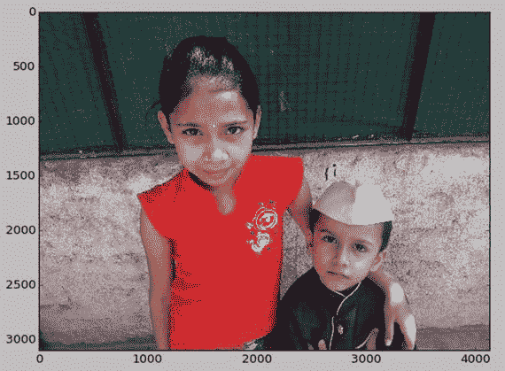
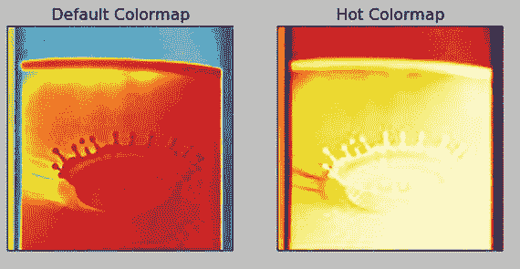
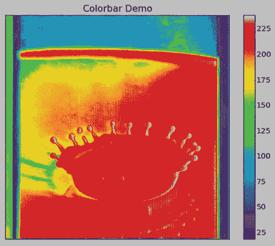
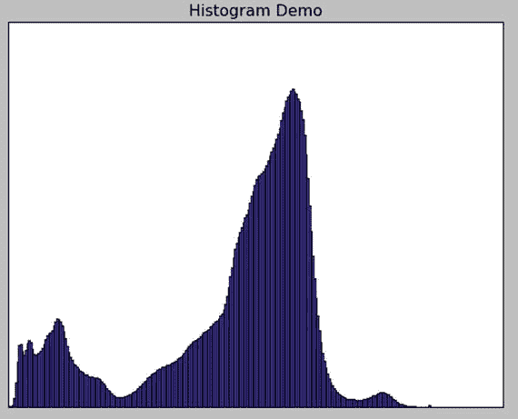
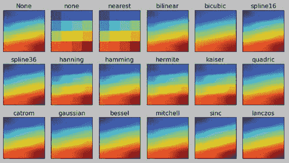

# 十四、Matplotlib

在最后一章中，我们用 SciPy 研究了数字图像处理。我们研究了 SciPy 为数字图像处理提供的几个主要功能类别，合并在`scipy.misc`下。在这一章中，我们将学习更多的使用 matplotlib 的图像处理和数据表示技术。我们已经在前面的章节中使用 matplotlib 来绘制和显示图像。如前几章所述，matplotlib 是一个 MATLAB 风格的数据可视化库。数据处理和挖掘是一个庞大的主题，超出了本书的范围；但是，我们可以使用图像作为方便的数据源来演示 matplotlib 的一些数据处理功能。所以让我们开始吧。

## 读取图像

为代码样本创建一个目录`chapter` `14`。以下代码(清单 [14-1](#Par3) )演示了如何读取和显示图像:

```py
import matplotlib.pyplot as plt
import matplotlib.image as mpimg
import numpy as np
img = mpimg.imread('/home/pi/book/Dataset/Sample01.jpg')
plt.imshow(img)
plt.show()
Listing 14-1.prog01.py

```

输出(图 [14-1](#Fig1) )如下:



图 14-1。

Reading and displaying an image

## 颜色贴图

色彩映射表用于将颜色应用于数据集。灰度图像会自动应用默认色彩映射表。我们甚至可以为图像设置色彩映射表。为了正确显示灰度图像，我们需要像在前面章节中所做的那样，将色图设置为灰度值。在下面的例子中(清单 [14-2](#Par6) ，我们将使用默认的色彩映射表显示图像的一个通道。然后，我们将应用另一个色图到通道。

```py
import matplotlib.pyplot as plt
import matplotlib.image as mpimg
import numpy as np

img = mpimg.imread('/home/pi/book/Dataset/4.2.01.tiff')
img_ch = img[:, :, 0]

plt.subplot(1, 2, 1)
plt.imshow(img_ch)
plt.title('Default Colormap')
plt.xticks([]), plt.yticks([])

plt.subplot(1, 2, 2)
plt.imshow(img_ch, cmap='hot')
plt.title('Hot Colormap')
plt.xticks([]), plt.yticks([])

plt.show()

Listing 14-2.prog02.py

```

输出(图 [14-2](#Fig2) )如下:



图 14-2。

Colormaps

## 彩色的

我们还可以显示彩条，让观众知道图像中的相对强度值。以下代码(清单 [14-3](#Par9) )演示了:

```py
import matplotlib.pyplot as plt
import matplotlib.image as mpimg
import numpy as np

img = mpimg.imread('/home/pi/book/Dataset/4.2.01.tiff')
img_ch = img[:, :, 0]

plt.imshow(img_ch, cmap='nipy_spectral')
plt.title('Colorbar Demo')
plt.colorbar()
plt.xticks([]), plt.yticks([])

plt.show()

Listing 14-3.prog03.py

```

输出(图 [14-3](#Fig3) )如下:



图 14-3。

Colorbar demo

## 用于图像处理的 Matplotlib

直方图是统计中频率表的图形表示。它是数据集中每个值出现次数的图表。我们还可以使用 matplotlib 中的`plt.hist()`方法来绘制单通道或灰度图像的直方图。以下(清单 [14-4](#Par12) )是一个例子:

```py
import matplotlib.pyplot as plt
import matplotlib.image as mpimg
import numpy as np

img = mpimg.imread('/home/pi/book/Dataset/Sample03.jpg')
img_ch = img[:, :, 0]

plt.hist(img_ch.ravel(), 256, [0, 256])
plt.title('Histogram Demo')
plt.xticks([]), plt.yticks([])

plt.show()

Listing 14-4.prog04.py

```

输出(图 [14-4](#Fig4) )如下:



图 14-4。

Histogram demo

## 插值方法

`plt.imshow()`中有多种插补类型。插值类型决定图像的显示方式。理解它们如何工作的最好方法是在渐变图像上使用它们。以下(清单 [14-5](#Par15) )代码示例很好地演示了这一点:

```py
import matplotlib.pyplot as plt
import numpy as np

methods = [None, 'none', 'nearest', 'bilinear', 'bicubic', 'spline16',
           'spline36', 'hanning', 'hamming', 'hermite', 'kaiser', 'quadric',
           'catrom', 'gaussian', 'bessel', 'mitchell', 'sinc', 'lanczos']

grid = np.arange(16).reshape(4, 4)

fig, axes = plt.subplots(3, 6, figsize=(12, 6),
subplot_kw={'xticks': [], 'yticks': []})

fig.subplots_adjust(hspace=0.3, wspace=0.05)

for ax, interp_method in zip(axes.flat, methods):
    ax.imshow(grid, interpolation=interp_method)
    ax.set_title(interp_method)

plt.show()

Listing 14-5.prog05.py

```

输出(图 [14-5](#Fig5) )如下:



图 14-5。

Interpolation demo

## 结论

在本章中，我们学习了如何用 matplotlib 表示数据。我们研究了色图、彩条和直方图。我们还学习了插值的概念。我们可以这样使用 matplotlib 来表示数据、图像和信号。

## 这本书的概要

在本书中，我们从 Raspberry Pi 和单板计算机的基础知识开始。我们学习了如何设置树莓派 并将其连接到互联网。我们还学会了通过网络访问它。

然后我们继续学习超级计算和并行编程的基础知识。我们准备了 Pis 的节点，并通过一个网络将它们连接在一起，作为一个集群。我们还利用 MPI4PY 开发了集群的功能。

然后我们用 Python 学习了符号计算。我们还研究了用于数值计算的 NumPy 库。然后，我们探索了科学计算库 SciPy 及其在信号和图像处理中的应用。

最后，我们研究了如何用 matplotlib 库表示图像数据和计算直方图。

然而，这并不是结束。这仅仅是你在科学计算的神奇世界中旅程的开始。您可以进一步探索 matplotlib、OpenCV 和 Scientific Kit (SciKit)库。对于想尝试 OS 编程的人来说，他们可以在 Raspberry Pi 上用 C 语言探索 pthread 和 POSIX 库。有了树莓派，可能性是无穷无尽的。我祝你在开始这个神奇的探索之旅时一切顺利。