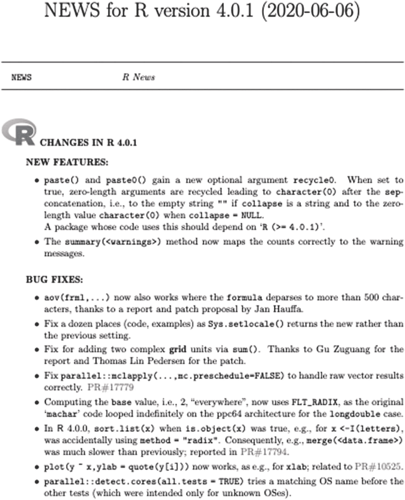

# 一、`plot()`、`qplot()`和`ggplot()`，以及其它

r 提供了许多可视化数据的方法。R 语言中的图形是由函数生成的。有些功能几乎可以立即创建有用的可视化效果。其他功能组合在一起创建高度编码的复杂图像。这本书向您展示了如何生成这两种类型的对象。

在本书的第一部分，我们将详细介绍 `plot()`函数——这是最基本也是最通用的绘图函数。还描述了函数 par()、layout()和 split.screen()，它们设置全局绘图参数和布局选项，以及图形设备。

第二部分介绍了 ggplot2 包中的函数，从 qplot()和 ggplot()开始。函数 qplot()和 ggplot()在许多方面比早期的 R 函数更容易使用。事实上，ggplot2 包中使用的语法需要很长的名称和参数字符串，但是 RStudio 中的自动完成功能使得代码输入非常容易。

本书的第三部分包括六个附录，包含图形和统计软件包中的预设绘图功能。附录按要显示的对象类型排序。

## 1.1 plot()、par()、layout()和 split.screen()

函数 plot()获取一个或多个对象，并根据对象的类别创建图像。plot()有许多影响图像外观的参数。可以在对 plot()的调用中给定参数值，或者可以使用函数 par()对许多参数进行全局赋值。在最初调用 plot()之后，有几个辅助函数可以用来添加到图像中。如果用户的目标是在一个页面上有多个绘图，可以使用函数 par()、layout()或 split.screen()来设置多个绘图的格式。

在第 [2](02.html) 章中，我们描述了 `plot()`函数的基础。在第 3 章中，对 plot()的各种参数进行了分类。绘图()的辅助函数在第 [4 章](04.html)中介绍。在第 [5](05.html) 章中，介绍了定义绘图()的方法(绘图类型)。在第 [6](06.html) 章中，描述了函数 par()的可能参数，并给出了使用 par()、layout()或 split.screen()设置多个图的方法。此外，图形设备也包括在内。

## 1.2 qplot()和 ggplot()

ggplot2 包中的函数 qplot()和 ggplot()提供了 plot()的替代方法。qplot()和 ggplot()生成的默认图看起来比 plot()生成的默认图更好。对于简单的绘图，qplot()足以给出一个看起来很优雅的图形。函数 ggplot()提供了比 qplot()更多的绘图选项。ggplot2 包中使用的一些语法在标准 r。

在 ggplot2 中，可以使用 theme()或以“theme_”开头的预设主题函数来定义图形的主题。要绘制的对象是“映射”,并在 aes()函数中指定。要显示的图像类型是几何图形或统计数据，由以“geom_”或“stat_”开头的函数指定。可以使用 aes()、aes_ "函数、geom_ "函数、stat_ "函数和/或其他格式化函数来更改图形的外观。可以使用不止一种美学、几何学和统计学来创建图像。可以通过从另一个函数中运行格式化函数或者通过单独运行格式化函数来改变图像的外观。

在第 [7](07.html) 章中，我们来看看 qplot()、ggplot()和 ggplot2 包的语法。第 8 章[介绍了主题()、“主题 _”和“元素 _”函数，以及 aes()和“aes_”函数。在第 9 章](08.html)[中，描述了几何、统计、注释和 borders()函数。第](09.html) [10 章](10.html)讲述了 ggplot2 包中的各种功能，这些功能也改变了图像的外观。

## 1.3 附录

除了基本包和 ggplot2 包中的 plot()、qplot()和 ggplot()之外，graphics 和 stats 包中还有许多绘图函数。这些函数对于数据清理、数据探索和/或模型拟合非常有用。对于许多函数，plot()使用的图形参数是可以赋值的。本书末尾的附录中给出了专门的绘图函数，以及这些函数的用途和使用方法的简要说明。

附录 A 列出了与列联表一起使用的函数。附录 B 给出了连续变量的函数。附录 C 列出了生成多个图的函数。附录 D 给出了平滑数据的函数。附录 E 给出了时间序列分析中使用的绘图函数。附录 F 列出了 stats 和 graphics 包中的绘图函数，这些函数在前五个附录中没有涉及。

## 1.4 本书中使用的软件版本和硬件

本书使用的 R 的版本是 R 4.0.1 和 R 4 . 0 . 3；RStudio 的版本是 1.3.595 和 1.3.1093。由于 R 和 RStudio 不断变化，综合 R 档案网(CRAN)提供 R 的变化新闻，R 4.0.1 和 R 4.0.0 的新闻可以在 [`https://cran.r-project.org/doc/manuals/r-release/NEWS.pdf`](https://cran.r-project.org/doc/manuals/r-release/NEWS.pdf) 找到。该新闻 pdf 的开头如图 [1-1](#Fig1) 所示。

图 1-1

r 新闻截图

用于示例的计算机是运行 macOS Catalina 版本 10.15.5 的 MacBook Air。

## 1.5 图形设备

r 在图形设备中打开图形对象。默认情况下，R 在计算机屏幕上打开图形对象，但是可以使用几种图像格式之一将该对象写入文件。第 6.1 节介绍了图形设备。

r 和 RStudio 通过选择两个程序菜单中的链接，提供了将图形对象保存到图像文件的方法。使用链接时，r 会自动打开和关闭相关设备。

要通过代码使用图形设备，请参阅第 6.1 节或“设备”和 dev.cur()的 R 帮助页。第 6.1.1 节和“设备”的帮助页面都列出了设备上用于打开图形设备以创建特定类型图像文件的功能。第 6.1.2 节和 dev.cur()的帮助页面给出了管理图形设备的功能列表。