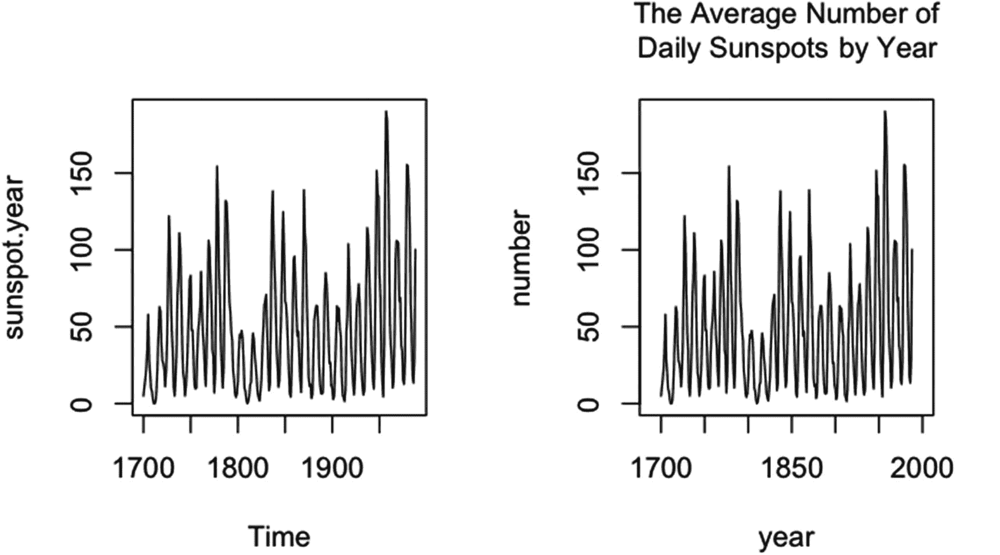

# 二、`plot()`函数

R 中的 `plot()`函数从特定 R 类的对象中创建一个图形。调用 plot()得到的图形可以包含文本、线、点和/或图像，图形区域可以用颜色或图案填充。显示的图形种类取决于要显示的对象的类别。例如，单个时间序列(ts 类的对象)给出了一个随时间绘制的线图。

## 2.1 参数和默认值

默认情况下，图形通常有黑线和文本，以及预设的线条、点和文本大小和粗细。可以在 plot()中设置更改图形的图形属性的参数。一些参数用于改变线条、点或文本的颜色；到线条宽度或样式；以磅或文本大小；到策划人物；到文本的样式和字体粗细；并填充颜色或图案。

其他参数为轴标签设置可选文本，或者为图形提供主标题和副标题。可以更改标题或标签中文本的方向、样式和粗细。

轴可以包含或不包含在 plot()创建的图形中。如果最初包含轴，轴的颜色和刻度线的颜色可以通过 plot()中的参数来更改。可以更改轴线宽度、刻度线长度和刻度线间距。

可以在对 plot()的调用中分配轴刻度标签。可以更改轴刻度标签的颜色、大小和方向。如有必要，可用 plot()生成一个空白图形对象。在第 [3](03.html) 章中，我们仔细观察了可用于绘图()的参数。

## 2.2 辅助函数

在最初调用 plot()之后，可以使用辅助函数将图形信息添加到原始图形中。这些功能用于在原始图上覆盖其他图，并向图添加注释。例如，可以向散点图添加回归线，或者在图中包含图例。

有几个辅助函数。可以使用辅助函数 title()来添加标题和轴标签，而不是在原始的 plot()调用中包含标题和轴标签。如果在对 plot()的调用中抑制了轴，则可以使用函数 axis()添加轴。回归线可以添加到图形中(有几种方法)。

大部分辅助函数都是同名的，比如文本()、点()、线()、段()和箭头()。其他的不是，比如 polypath()或者 clip()。在第 [4](04.html) 章中，我们列出了图形和统计软件包中的辅助函数，并展示了每个函数的用法。

## 2.3 方法

函数的方法是为其定义函数的那些对象类。在图形和统计软件包中，为 plot()定义了 29 种方法。

在第 3 章[第 3 章](03.html)和第 4 章[第 3 章](04.html)中，我们通常使用 plot()的版本，该版本将一个 x，也可能是一个 y 作为要绘制的对象，并绘制一个 x 对索引值或 y 对 x 的散点图。该函数的实际名称是 plot.default()。

但是，由于 R 在运行 plot()时会自动确定要使用的方法。default”扩展在对 plot()的调用中不是必需的。对于 plot.default()，x 和 y 需要是长度相等的向量，可以强制为数字。第 [5](05.html) 章给出了 plot()的方法，以及每个方法创建的内容。

## 2.4 图形设备和函数 par()、layout()和 split.screen()

r 图在图形设备中创建。图形设备可以在计算机屏幕上打开，也可以在 r 外部的文件中打开。(有些图形设备是特定于给定的操作系统的。)第 1 部分中涉及的绘图函数所使用的参数可以在 `plot()`函数和辅助函数中指定。当在绘图函数中赋值时，参数将在指定参数的特定函数中使用。要全局分配参数，可以在 par()函数中分配参数。

par()函数包含 plot()的许多参数和辅助函数使用的默认值。par()的默认参数可以通过调用 par()来更改——对于给定的 R 会话或在函数调用中。par()中的大多数参数与 plot()中影响图形外观的参数相同。par()中的某些参数只能在 par()中设置。

r 允许在一个图形中放置多个图。可以使用 par()的两个参数之一创建多个图的网格。par()创建的网格每行都有相同数量的列。或者，可以使用函数 layout()来创建更灵活的设计，每行中的列数不同。split.screen()函数允许在图形设备的不同位置放置绘图。

在第 [6](06.html) 章中，列出了图形设备的类型以及使用图形设备的方法。更多关于 par()、layout()和 split.screen()的内容也可以在第六章[中找到。](06.html)

## 2.5 一个例子

在图 [2-1](#Fig1) 中，给出了一个使用默认参数绘制太阳黑子年时间序列图(来自数据集包)的示例，以及使用一些参数集绘制的相同图。这两块地绘制在一张图中。

图 2-1

黑子.年时间序列图(可在 R。第一个图使用图()中的默认参数设置。在第二个绘图中，设定了一些论点。

太阳黑子. year 的类别是 ts，因此时间序列中的值是相对于时间绘制的。默认的轴标签是 x 轴上的时间和 y 轴上绘制的对象名称。默认情况下，不打印标题或副标题。

对于上图，函数 par()用于将一行中的两个图放入一个图中。在 plot()运行两次后，通过再次运行 par()将每个图形的绘图数改回 1。对 par()的更改在整个 R 会话中保持有效，除非进行了更改。