# 三、`plot()`参数

plot()中可以使用许多参数。在这一章中，我们将讨论这些论点。这些参数按类别分组–影响整体外观、线条和点的外观以及细节的参数。我们通过使用来自 R 数据集的数据的例子来看对图形外观的影响。在本章中，示例中使用了绘制散点图的函数 plot.default()。虽然本章中的大多数参数可用于所有或大多数版本的 plot()，但也有一些参数是 plot.default()所特有的。

## 3.1 数据集

在本节中，我们使用数据集包中的`LifeCycleSavings`数据集。由于在 RStudio 中默认加载数据集包，因此对于大多数用户来说，数据集是可以访问的。要将数据集带入工作空间以便查看内容，请在 R 提示符下输入以下内容:

```r
data( "LifeCycleSavings" )

```

要在 RStudio 中查看数据集，请双击“LifeCycleSavings”(在右上方窗格的环境窗口的数据部分)。将显示控制台(左下窗口)

```r
> force(LifeCycleSavings)
                  sr pop15 pop75     dpi  ddpi
Australia      11.43 29.35  2.87 2329.68  2.87
Austria        12.07 23.32  4.41 1507.99  3.93

```

(这里只显示前两个观察值。)数据集也将出现在源(左上角)窗口中。

R 文档中对数据集的描述如下:

<colgroup><col class="tcol1 align-left"> <col class="tcol2 align-left"> <col class="tcol3 align-left"> <col class="tcol4 align-left"></colgroup> 
| 

*[，1]*

 | 

*先生*

 | 

*数字*

 | 

*个人储蓄总额*

 |
| --- | --- | --- | --- |
| *[，2]* | *pop15* | *数字* | *% 15 岁以下人口* |
| *[，3]* | *pop75* | *数字* | *% 75 岁以上人口* |
| *[，4]* | *dpi* | *数字* | *实际人均可支配收入* |
| *[，5]* | ddpi | *数字* | *% dpi 增长率* |

*   *国家间生命周期储蓄数据*

*   *描述*

*   1960-1970 年储蓄率的数据。

*   用法

*   *生命周期飞行器*

*   *格式*

*   *对 5 个变量进行 50 次观察的数据框架。*

*   *详情*

*   根据弗朗哥·莫迪利阿尼提出的生命周期储蓄假说，储蓄率(个人储蓄总额除以可支配收入)由人均可支配收入、人均可支配收入的变化率以及两个人口变量来解释:15 岁以下人口的百分比和 75 岁以上人口的百分比。这些数据是对 1960 年至 1970 年这十年的平均值，以去除商业周期或其他短期波动。

*   *来源*

*   *这些数据来自贝尔斯利、库赫和韦尔施(1980 年)。他们又从 Sterling (1977)获得了数据。*

*   *参考文献*

*   Sterling，Arnie (1977)未发表的学士论文。麻省理工学院。

*   贝尔斯利，地方检察官，Kuh。e .和 Welsch，R. E. (1980 年)回归诊断。纽约:威利。

—R 数据集包的文档

数据集中的五个变量是个人储蓄总额(sr)、15 岁以下人口的百分比(pop15)、75 岁以上人口的百分比(pop75)、实际人均可支配收入(dpi)和实际人均可支配收入的百分比增长率(ddpi)。变量值是 1960-1970 年间的平均值，是 50 个国家的平均值。

## 3.2 更改图中的整体外观( )

plot()的第一个参数总是 x——一个适当类的 R 对象。如果 x(或 x 和 y)是数值类的 vector 对象，plot()绘制散点图。(对于散点图，可以包括与 x 长度相同的数字向量 y，但这不是必需的。)第一个示例是使用 plot()参数默认值的散点图。

在清单 [3-1](#PC3) 中，给出了绘制默认散点图的代码。散点图是 15 岁以下人口百分比(y)与 75 岁以上人口百分比(x)的关系图，两者均来自生命周期储蓄数据集。

对于数据框，数据框中的变量可通过数据框名称后接美元符号再接变量名来访问。例如，LifeCycleSavings $ pop75 访问 life cycles savings 数据框中的 pop75 变量。

```r
plot(
  LifeCycleSavings$pop75,
  LifeCycleSavings$pop15
)

Listing 3-1The code for a default scatterplot

```

该图如图 [3-1](#Fig1) 所示。

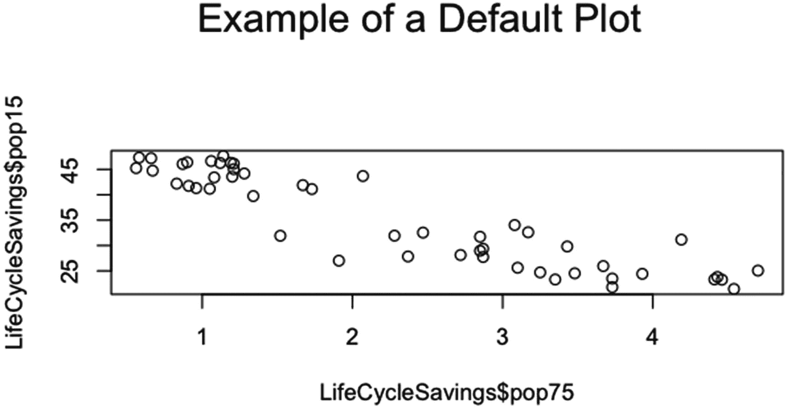

图 3-1

生命周期保存数据集中两个变量的默认散点图

请注意，第一个参数在 x 轴(水平轴)上，第二个参数在 y 轴(垂直轴)上。此外，图形不包含标题或副标题，轴标签包含数据集中变量的名称。这些点是分散的，因此最极端的点靠近轴。在这一章中，我们将展示如何通过设置参数来改变这个绘图的外观。

### 标签和轴限制

标题和副标题可以添加到绘图中，轴标签也可以更改。要添加标题，我们使用 main 参数。标题将显示在图的上方。要添加副标题，我们使用参数 sub。副标题将显示在 x 轴标签下方。为了指定 x 和 y 轴标签，我们使用参数 xlab 和 ylab。将任一项设置为“”都将隐藏标签。对于所有这四个参数，值都是一个字符向量，长度通常为一个元素。

可以通过在字符串中的换行符位置包含“\n”来向字符串添加换行符。或者，包含多个元素的字符向量将每个元素放在单独的一行上(除了参数 sub)。

轴限制是轴开始和结束的值。起始值大于结束值是可接受的选项。为了设置绘图的 x 轴和 y 轴界限，我们使用参数 xlim 和 ylim。这两个参数的格式是长度为 2 的数字向量，其中第一个数字是开始限制，第二个数字是结束限制。默认情况下，不打印超出限制的点。

清单 [3-2](#PC4) 给出了一个设置标签和轴参数的例子。

```r
plot(
  LifeCycleSavings$pop75,
  LifeCycleSavings$pop15,
  main="Percentage under 15 versus Percentage over 75\nfor 50 Countries",
  sub="More Under 15 Means Less Over 75 on Average",
  xlab="Percentage over 75",
  ylab="Percentage under 15",
  xlim=c( 0, 5.25 ),
  ylim=c( 18, 52 )
)

Listing 3-2Code to plot a scatterplot where the title, subtitle, x axis label, y axis label, x limits, and y limits have been set

```

在图 [3-2](#Fig2) 中，代码已经运行。

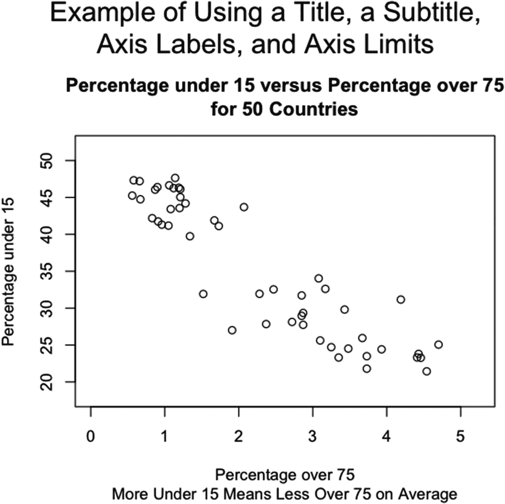

图 3-2

使用参数 main、sub、xlab、ylab、xlim 和 ylim 绘制的散点图

### 3.2.2 框类型、纵横比、注释和扩展绘图

可以更改是否包括边框、要包括的边框类型以及地块的纵横比。此外，可以关闭注释，并且可以在绘图范围之外绘制点。相关的参数是 frame.plot(用于包含边框)、bty(用于框类型)、asp(用于纵横比)、ann(用于注释)和 xpd(用于扩展绘图)。

参数 frame.plot 是一个逻辑单值参数，它告诉 R 是否在绘图周围放置一个框架。如果参数是长度大于 1 的向量，则只使用第一个值，并给出警告。默认值为 TRUE。

如果 frame.plot 为 TRUE，则参数 bty 描述框的类型。该参数采用字符值，并且可以采用值“o”、“l”、“7”、“c”、“u”、“a”、“]”和“n”。值“o”是默认值，表示一个四边框。前六个值(字母的大写字母)看起来像该值创建的盒子的形状。

值“l”绘制左轴和底轴；值“7”绘制右轴和顶轴；值“c”绘制了顶部、左侧和底部轴；值“u”绘制左、下和右轴；值“]”表示底部、右侧和顶部轴。值“n”表示不绘制方框。图 [3-3](#Fig3) 显示了除默认选项“o”之外的六个选项。

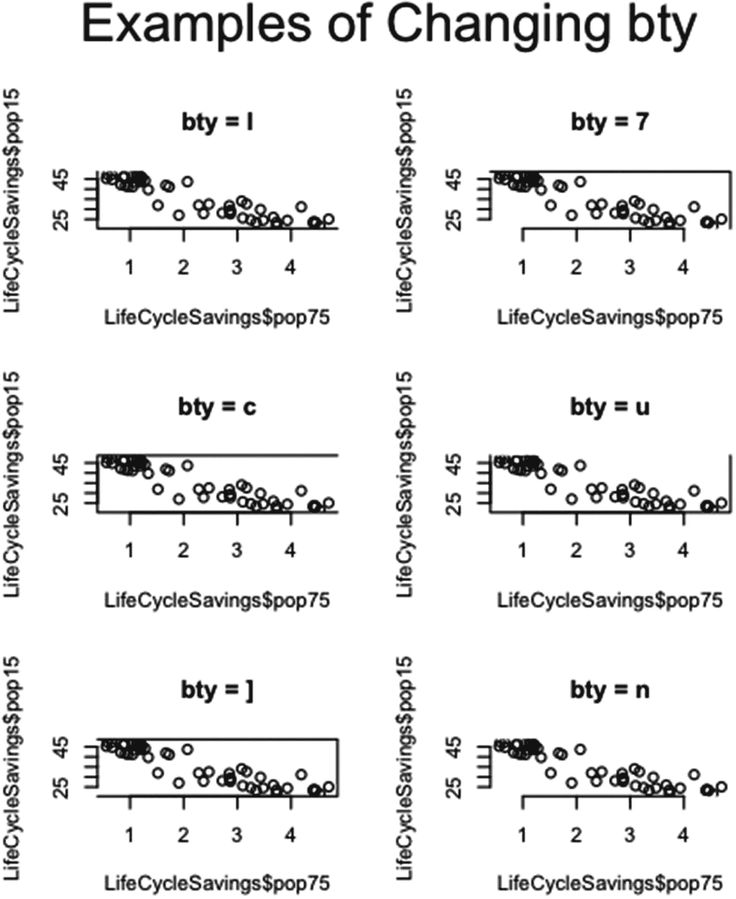

图 3-3

bty 等于“l”、“7”、“c”、“u”、“]”和“n”的框样式示例

以下代码创建了图 [3-3](#Fig3) 中的六个图。

```r
plot( LifeCycleSavings$pop75, LifeCycleSavings$pop15, bty="l", main="bty = l" )
plot( LifeCycleSavings$pop75, LifeCycleSavings$pop15, bty="7", main="bty = 7" )
plot( LifeCycleSavings$pop75, LifeCycleSavings$pop15, bty="c", main="bty = c" )
plot( LifeCycleSavings$pop75, LifeCycleSavings$pop15, bty="u", main="bty = u" )
plot( LifeCycleSavings$pop75, LifeCycleSavings$pop15, bty="]", main="bty = ]" )
plot( LifeCycleSavings$pop75, LifeCycleSavings$pop15, bty="n", main="bty = n" )

Listing 3-3Plotting with bty set to six different values

```

在图[中，3-3](#Fig3) 是由清单 [3-3](#PC5) 中的代码生成的图。

要更改绘图的纵横比，我们将 asp 设置为设备上显示的绘图大小所需的宽度单位与高度单位的比率。

r 取图上 y 轴的一个单位的长度，用长宽比乘以该单位，得到图上 x 轴的一个单位的长度。考虑了绘图尺寸的比率。

在 RStudio 中，可以通过改变图形绘制窗口的大小来调整图形的高宽比。更改窗口大小的最简单方法是指向并拖动绘图窗口(RStudio 中的右下窗口)的边缘，使用每个窗口边缘中心的手柄。RStudio 菜单中的视图还提供了使用窗格的选项。将图像保存到文件或剪贴板时，RStudio 提供了更改绘图尺寸的选项，方法是分别调整 x 轴和 y 轴的尺寸。

直接处理图形是一种选择。在 RStudio 中，可以缩放绘图，然后通过指向绘图边缘中心或角落的手柄并拖动进行调整。在 R 中，绘图在石英窗口中打开，可以通过指向和拖动来调整。

图 [3-4](#Fig4) 中的示例显示了调整图 [3-1](#Fig1) 的纵横比的效果。在图 [3-1](#Fig1) 中，x 轴上的单位从 0.5 到 5，y 轴上的单位从 20 到 50。x 轴的宽度是 y 轴高度的 4.5 倍。未设置参数 asp，但从尺寸来看，它是 x 轴上的 4.5 个单位除以 y 轴上的 30 个单位，然后该量除以 4.5(x 轴的物理长度除以 y 轴的物理长度)，即 0.033。

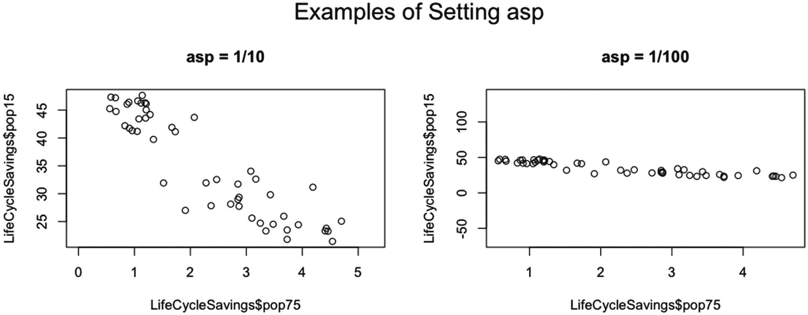

图 3-4

设置 asp 的两个例子；asp 等于 0.1，asp 等于 0.01

图 [3-4](#Fig4) 中的曲线显示了设置 asp 的两个例子。创建图中地块的代码如下(列表 [3-4](#PC6) )。

```r
plot(
  LifeCycleSavings$pop75, LifeCycleSavings$pop15,
  asp=0.1,
  main="asp = 1/10"
)
plot(
  LifeCycleSavings$pop75, LifeCycleSavings$pop15,
  asp=0.01,
  main="asp = 1/100"
)

Listing 3-4The code to demonstrate setting asp in plot()

```

运行代码的结果如图 [3-4](#Fig4) 所示。

在第一个图中，asp 设置为 0.1。从图 [3-4](#Fig4) 中，对于第一个图，y 轴从 20°到 48.4°，x 轴从-0.18°到 5.50°。对于两个轴，图都以 x 和 y 平均值为中心。这块地的大小比例是 1:2(宽是高的两倍。)y 轴的范围 28.4 乘以 0.1 得 2.84；2.84 乘以 2 等于 5.68，x 轴的范围。每单位 x 对应 10 单位 y。

对于第二个图，asp 等于 0.01。地块尺寸的比例仍然是 1:2。y 轴从-80 到 146，而 x 轴从 0.5 到 5.02。将 y 轴的范围 226 乘以 0.01 得到 2.26；而 2.26 乘以 2 就是 4.52，x 轴的范围。每单位 x 有 100 个 y 单位。

参数 ann 告诉 R 是否包含轴标签(或者标题或副标题)。默认值为 TRUE。将 ann 设置为 FALSE 会抑制标签–如图 [3-5](#Fig5) 所示。

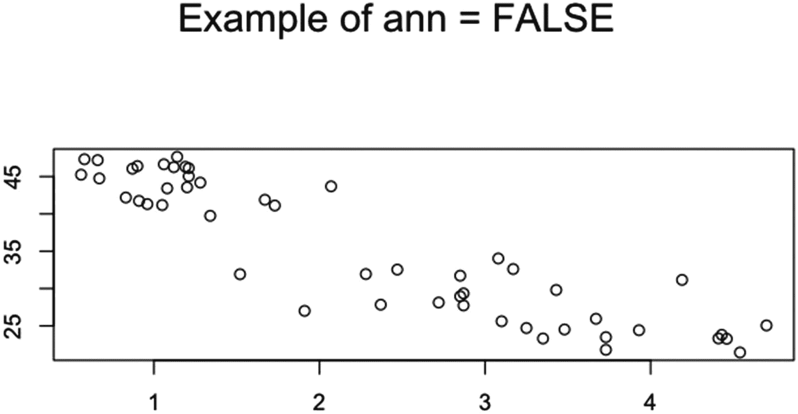

图 3-5

安设定为假的绘图

图 [3-5](#Fig5) 的代码如下(列表 [3-5](#PC7) )。

```r
plot(
  LifeCycleSavings$pop75, LifeCycleSavings$pop15,
  ann=FALSE
)

Listing 3-5The code for plotting with ann set to FALSE

```

代码产生的图如图 [3-5](#Fig5) 所示。

通过使用参数 xpd，可以在绘图限制之外绘制点(和线)。xpd 的默认值为 FALSE–不绘制超出绘图限制的点。将 xpd 设置为“真”会绘制出超出绘图限制但在绘图区域内的任何点。将 xpd 设置为 NA 将打印图形显示区域内超出绘图限制的任何点。图 [3-6](#Fig6) 显示了三个选项，图上的 x 极限设置为 2 和 3。

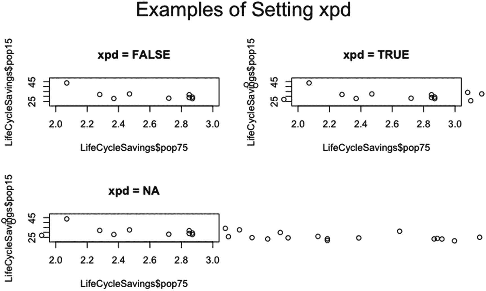

图 3-6

设置 xpd 的示例

图 [3-6](#Fig6) 中的地块代码如下(列表 [3-6](#PC8) )。

```r
plot(
  LifeCycleSavings$pop75, LifeCycleSavings$pop15, xlim=c( 2, 3 ),
  xpd=FALSE,
  main="xpd = FALSE"
)

plot(
  LifeCycleSavings$pop75, LifeCycleSavings$pop15, xlim=c( 2, 3 ),
  xpd=TRUE,
  main="xpd = TRUE"
)

plot(
  LifeCycleSavings$pop75, LifeCycleSavings$pop15, xlim=c( 2, 3 ),
  xpd=NA,
  main="xpd = NA"
)

Listing 3-6Code for the examples of the argument xpd in Figure 3-6

```

参见下面图 [3-6](#Fig6) 中运行清单 [3-6](#PC8) 中的代码得到的曲线图。

## 3.3 点和线

r 图在大多数情况下由点和线组成——尽管可以添加文本和图像，或者可以作为某些类别对象的默认图的一部分。使用绘图字符绘制点。任何只有一个字符的字符串都可以用作点的绘图字符，在大多数设备上也可以是许多符号。

线条可以绘制为实线，也可以绘制为许多虚线图案中的一种。在本节中，我们来看看点和线的一些选项。

### 3.3.1 地块类型

函数 plot()允许九种绘图类型，由参数类型设置。在 plot()的 R 帮助页面中，参数类型可以采用值“p”表示点，“l”表示线，“b”表示两者，“c”表示“b”的线部分，“o”表示线在点上绘制的点和线，“h”表示垂直线(在数据点的高度)，“S”表示从水平到垂直的阶跃函数，“S”表示从垂直到水平的阶跃函数，“n”表示不绘制。

图 [3-7](#Fig7) 中给出了设置为“l”、“b”、“c”和“o”的类型示例。清单 [3-7](#PC9) 中的代码产生了这些绘图。(使用了我们一直在绘制的相同数据点，但是首先对 pop75 数据进行排序，排序用于对 pop15 数据点进行排序。这样的话，线条就很有条理了。)

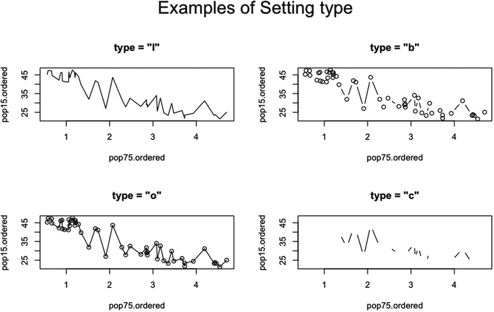

图 3-7

类型等于“l”、“b”、“o”和“c”的图的示例

由于用于给图 [3-7](#Fig7) 中的图命名的字符串包含字符串值，转义字符“\”允许引号显示在标题内。

```r
ord = order(
  LifeCycleSavings$pop75
)
pop75.ordered = LifeCycleSavings$pop75[ ord ]
pop15.ordered = LifeCycleSavings$pop15[ ord ]

plot(
  pop75.ordered, pop15.ordered

,
  type="l",
  main="type = \"l\""
)
plot(
  pop75.ordered, pop15.ordered,
  type="b",
  main="type = \"b\""
)
plot(
  pop75.ordered, pop15.ordered,
  type="o",
  main="type = \"o\""
)
plot(
  pop75.ordered, pop15.ordered,
  type="c",
  main="type = \"c\""
)

Listing 3-7Code to create ordered points and to create plots for type set equal to “l”, “b”, “o”, and “c”

```

图 [3-7](#Fig7) 如下。

在图 [3-8](#Fig8) 中，给出了类型“h”、“S”、“S”和“n”的选项示例。先给出代码(列出 [3-8](#Fig8) )。

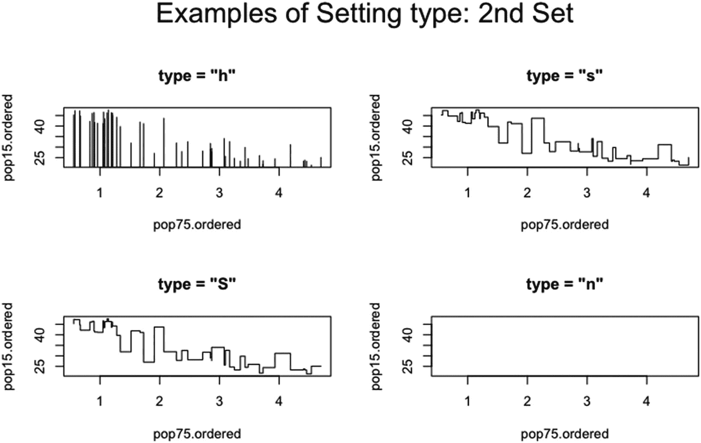

图 3-8

类型设置为“h”、“S”、“S”和“n”的图示例

```r
plot(
  pop75.ordered, pop15.ordered,
  type="h",
  main="type = \"h\""
)
plot(
  pop75.ordered, pop15.ordered,
  type="s",
  main="type = \"s\""
)
plot(
  pop75.ordered,  pop15.ordered,
  type="S",
  main="type = \"S\""
)
plot(
  pop75.ordered, pop15.ordered,
  type="n",
  main="type = \"n\""
)

Listing 3-8Code for plots in Figure 3-8

```

图 [3-8](#Fig8) 如下。

### 3.3.2 参数 pch 和 lty

为了设置绘图字符，我们使用参数 pch。参数 pch 可以设置为用户设备上 R 可用的任何单字符值或单字符值集合(参见第 3.4 节)。此外，整数 0–25 可用于绘制 R 中可用的符号。如果 pch 设置为等于值的集合，则在绘制点时 R 会循环遍历这些值。在列表 [3-9](#PC11) 和图 [3-9](#Fig9) 中，为图 [3-1](#Fig1) 中的一些点绘制了 26 个符号。

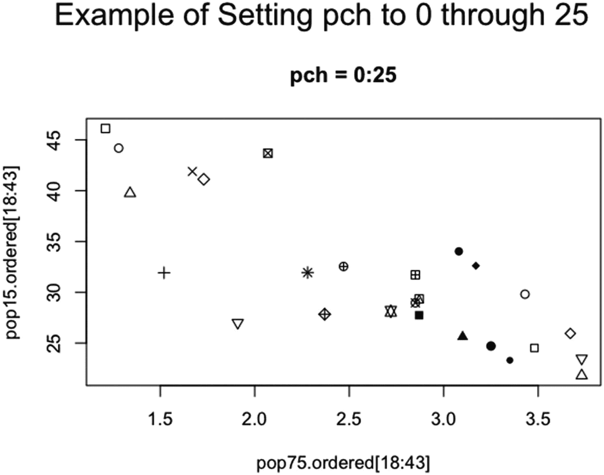

图 3-9

使用 R 符号作为绘图字符的示例

```r
plot(
  pop75.ordered[18:43],
  pop15.ordered[18:43],
  main="pch = 0:25",
  pch=0:25
)

Listing 3-9Code for the example of pch using the R symbols

```

线条由实线或点线和/或虚线组成。线的类型由参数 lty 指定。在 par()的 R 帮助页面中，参数可以采用数值，0 表示无线条，1 表示实线，2 表示虚线，3 表示虚线，4 表示点划线，5 表示带长破折号的线条，6 表示双破折号。该参数还可以采用字符串“空白”、“实心”、“虚线”、“点划线”、“点划线”、“长划线”和“双划线”，它们给出的结果与数字相同。

用户可以创建由 2、4、6 或 8 个十六进制数字的字符串组成的自定义模式。第一个数字是线的第一部分的单位长度的数量，第二个数字是多少个单位长度留为空白，等等。对于大多数设备，单位长度是 1/96 英寸。例如，将 lty 设置为“626565”会拼出“米米·米……”用莫尔斯电码。lty 等于“626565”的线见清单 [3-10](#PC12) 和图 [3-10](#Fig10) 。

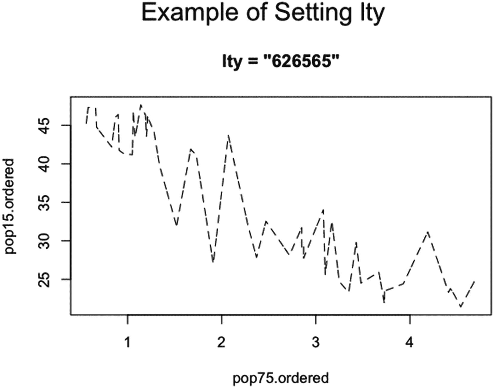

图 3-10

自定义线条样式的示例

```r
plot(
  pop75.ordered, pop15.ordered,
  type="l",
  lty="626565",
  main="lty = \"626565\""
)

Listing 3-10Case of setting a custom line style

```

图 [3-10](#Fig10) 如下。

## 3.4 细节

本节涵盖了在 plot()中可以更改的无数小细节。这些部分包括颜色、字符字体样式和粗细、字符大小、线条质量、轴样式和使用对数刻度。

### 3.4.1 颜色

plot()中生成的任何内容都可以被指定一种颜色。有七个与颜色相关的参数:col、col.main、col.sub、col.lab、col.axis、bg 和 fg。参数 col 设置绘制内容的颜色。参数 col.main、col.sub、col.lab 和 col.axis 分别设置标题、副标题、标签和轴的颜色。在 plot()中，fg 设置绘图周围方框的颜色，bg 设置 pch 的 21–25 的填充颜色，否则没有效果。

col.main、col.sub、col.lab、col.axis 和 fg 的值必须是一个元素颜色指示符。col 和 bg 的值可以是颜色指示器的多元向量。对于绘图类型“p”、“b”、“c”和“h”中的点，颜色将在这些点之间循环。对于绘图类型“l”、“b”、“c”、“S”和“S”中的线条，线条采用 col 中第一个值的颜色。

#### 3.4.1.1 用字符串分配颜色

R 中的颜色可以用字符串、正整数或函数来指定。R 中有 657 种已定义的颜色，每种颜色都有一个名称——比如“浅蓝色”。通过运行 colors()函数列出名称集合。颜色“透明”可用于填充颜色。

颜色也可以由包含十六进制颜色代码的字符串来指定。十六进制代码的形式为“#RRGGBBAA”，其中 RR、GG 和 BB 是两位十六进制数，表示颜色中的红色、绿色和蓝色，AA 是可选的，是两位十六进制数，表示颜色的透明度。

对于颜色，值 00 是最暗的色调，值 FF 是最亮的色调。对于透明度，值 00 表示绘图字符完全透明，值 FF 表示绘图字符不透明。如果不包括 AA，透明度级别将设置为 FF。

值“#000000”绘制黑色，值“#FFFFFF”绘制白色。可以通过更改“#000000”的透明度来创建灰度。但是，由 running colors()生成的集合中索引值为 152–253 和 260–361 的元素是颜色“灰色”、“灰色 0”、“灰色 100”和“灰色”、“灰色 0”、“灰色 100”。

灰色和灰色是相同颜色的不同名称，称为别名。颜色“灰色”和“灰色”是浅灰色，而“灰色 0”/“灰色 0”到“灰色 100”/“灰色 100”是从深灰色到浅灰色的灰度。也可以使用 gray()/grey()或 gray.colors()/grey.colors()函数创建灰度。

#### 3.4.1.2 用整数分配颜色

可以使用整数来指定颜色。对于给定的数字，与该数字相关联的颜色由功能调色板()指定。不带参数运行 palette()会给出当前调色板中的颜色——这些颜色按顺序与从 1 开始的整数相关联。运行带参数的 palette()会重置调色板。调色板中的颜色循环，因此 col 的任何正整数值都将返回一种颜色。

palette()中只能设置一个参数。参数可以是包含内置调色板名称的单元素字符向量，也可以是调色板中包含的颜色名称和/或十六进制代码的多元素字符向量。

要查看内置调色板的名称，请运行 palette.pals()。一旦选择了一个调色板，该调色板将一直有效，直到选择了另一个调色板。要返回默认调色板，请运行 palette( "default ")。目前，默认调色板是“R4”。

大多数调色板只有少量的颜色，但是最多可以分配 1024 种颜色。例如，要用 colors()中的 657 种颜色创建调色板，可以运行 palette( colors())。

要选择调色板的子集，请使用函数 palette.colors()。函数 palette.colors()有四个参数。第一个参数是 n，它是一个正整数，告诉 R 选择调色板的前 n 种颜色。如果设置为 NULL(默认值),则使用所有颜色。第二个参数是包含调色板名称的字符串。

第三个参数是 alpha，它设置调色板的不透明度，可以取 0 到 1 之间的值。并非所有设备都支持参数 alpha。零表示完全透明，一表示完全不透明。第四个参数是 recycle，它告诉 R 如果 n 大于调色板中的颜色数，就回收颜色。recycle 的默认值为 FALSE。如果 recycle 为 FALSE，并且 n 大于颜色数，则返回所有颜色并给出警告。

#### 3.4.1.3 用函数分配颜色

有一些函数可以生成颜色代码。函数 hsv()、hcl()、hcl.colors()、rgb()、rainbow()、heat.colors()、terrain.colors()、topo.colors()、cm.colors()、gray()和 gray.colors()生成十六进制代码来指定颜色。

函数 hsv()根据颜色的色调、饱和度和值生成代码。该函数有三个参数，h、s 和 v，分别代表色调、饱和度和值。这三个参数采用介于 0 和 1 之间的数值向量。向量不需要具有相同的长度，并且向量循环。

不是在 hsv()中输入三个单独的向量，而是可以输入一个具有三列的矩阵，其中第一列给出 h 的值，第二列给出 s 的值，第三列给出 v 的值。

参数 h 给出颜色的色调，0 表示红色，1 表示紫红色，阴影从红色到橙色到黄色到绿色到蓝色到紫色到紫色到紫红色。参数 s 给出了颜色的深度，0 表示没有颜色(如果 v 等于 0 则为黑色，如果 v 等于 1 则为空白)，1 表示最强的颜色。参数 v 给出了颜色中黑色的数量，0 表示黑色，1 表示没有黑色的颜色。

函数 hcl()根据颜色的色调、色度和亮度创建十六进制颜色代码。该函数有五个参数:h 代表色调，默认为 0；c 为色度，默认为 32；l 表示亮度，默认为 85；α，它没有默认值；和修正，这在默认情况下是正确的。并非所有设备都支持参数 alpha。

参数 h 可以采用从 0 到 360 的数值。零是红色，120 是绿色，240 是蓝色。数字之间的色调阴影——在一个圆圈中。参数 c 相当于 hsv()函数中的饱和度，但可以取任何非负值。但是，如果该值大于 360，色调会发生变化。

参数 l 的操作类似于 hsv()函数中的 value 参数，但它采用 0 到 100 之间的数值。参数 alpha 设置颜色的透明度级别，0 表示完全透明，1 表示不透明。参数 fixup 如果设置为 TRUE，将把非法的颜色代码更改为合法的代码。

函数 hcl.colors()为给定的 hcl 调色板生成十六进制代码。通过运行 hcl.pals()列出 hcl 调色板集合。函数 hcl.pals()接受一个参数——类型。默认情况下，type 等于 NULL–为此列出所有 hcl 调色板。类型的其他选项有“定性”、“连续”、“发散”和“发散 x”。有关在何处使用这四种类型的讨论，请参见 hcl.pals()的帮助页面。

hcl.colors()的参数是 n，表示要选择的颜色数量；调色板，用于 hcl 调色板名称；α，为透明度水平；rev，反转颜色的顺序；和修正，用于修正非法的颜色规范。自变量 n 是正整数；调色板是一个 hcl 调色板名称，默认为“Viridis”；alpha 如 hsv()描述中所述，默认为 NULLrev 是一个一元逻辑向量，默认值为 FALSE 而 fixup 是一个单元素逻辑向量，默认值为 TRUE。

函数 rgb()根据颜色中的红色、绿色和蓝色级别生成十六进制颜色代码。该函数接受六个参数:红色、绿色、蓝色和 alpha，并非所有设备都支持；名称，默认为空；和 maxColorValue，默认为 1。maxColorValue 的值是红色、绿色、蓝色和 alpha 可以采用的最大值。根据 rgb()的帮助页面，如果 maxColorValue 设置为等于 255，则红色、绿色、蓝色和 alpha 将被强制为 0 到 255 之间的整数值，并且该算法是最有效的。但是，任何正数都可以用作 maxColorValue。参数 names 为颜色指定名称，但没有其他作用。

函数 rainbow()创建了一个十六进制颜色代码的光谱。该函数采用参数 n，表示要生成的代码数量；s，为饱和度；v，为价值层面；开始，为开始的色调；end，为结尾色调；alpha，表示透明度(并非所有设备都支持)；rev，反转颜色。

参数 s、v、start、end 和 alpha 是单元素数值向量，必须介于 0 和 1 之间，包括 0 和 1。对于 s 和 v，默认值为 1。对于 start，默认值为 0。对于 end，默认值是 max(1，n-1)/n。随着色调从 0 到 1，颜色从红色到橙色到黄色到绿色到蓝色到紫色到紫色到紫红色。参数 rev 是一个逻辑变量，默认值为 FALSE。

函数 heat.colors()、terrain.colors()、topo.colors()和 cm.colors()都采用相同的三个参数——n、alpha 和 rev，其定义与 rainbow()中的相同。(cm.colors()中的 cm 代表青色洋红色。)

gray()/grey()函数为灰色渐变创建十六进制颜色代码。该函数的参数是 level 和 alpha。参数级别是一个数值向量，取 0 到 1 之间的值，给出颜色灰度的色调，0 表示黑色，1 表示白色。参数 alpha 是透明度，取值范围从 0 到 1，0 表示透明，1 表示不透明。参数 level 和 alpha 没有默认值。

在清单 [3-11](#PC13) 和图 [3-11](#Fig11) 中，生成并绘制了十六进制颜色代码。

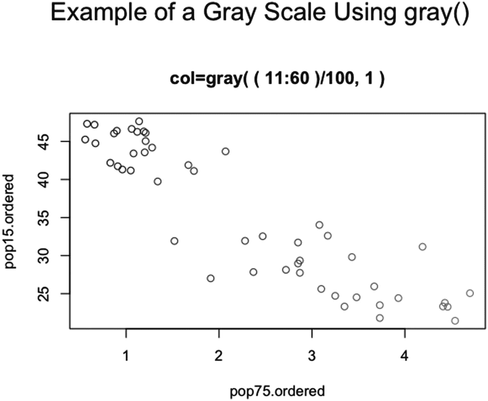

图 3-11

使用 gray()将灰度分配给 col 的示例

```r
> gray(
+     ( 11:60 )/100,
+     1
+ )[1:7]
[1] "#1C1C1CFF" "#1F1F1FFF" "#212121FF" "#242424FF" "#262626FF"
[6] "#292929FF" "#2B2B2BFF"

> plot(
+     pop75.ordered, pop15.ordered,
+     main="col=gray( ( 11:60 )/100, 1 )",
+     col=gray( ( 11:60 )/100, 1 )
+ )

Listing 3-11Code to demonstrate generating and plotting hex color codes on the gray scale

```

图 [3-11](#Fig11) 如下。

函数 gray.colors()/grey.colors()比 gray()/grey()更容易使用，也更灵活。该函数有六个参数。前三个是 n 代表颜色的数量；start 为灰度的开始级别，默认为 0.3；和 end 为结束灰度级，默认为 0.9。参数 start 和 end 必须介于 0 和 1 之间，并且 n 必须是正整数。

第四个参数是 gamma——代表非线性梯度。自变量 gamma 是起点和终点的指数。较小的值可以是负值，梯度较小。将 gamma 设定为 1 会产生线性渐变。参数必须是长度能被 n 整除的数值向量。参数循环，默认值为 2.2。

最后两个参数是透明度的 alpha 是透明的，1 是不透明的(不是所有设备都支持)rev 告诉 R 如果设置为 TRUE 就反转颜色的顺序，默认情况下是 FALSE。参数 alpha 必须介于 0 和 1 之间，包括 0 和 1。

有两个函数可以在 rgb、字符串和 hsv 规范之间进行转换。函数 col2rgb()将字符串颜色规格转换为 rgb 代码。该函数有两个参数:col(在 plot()中可用作 col 参数值的任何对象)和 alpha(指示是否返回 alpha 级别的逻辑变量，默认情况下为 FALSE)。在清单[中，3-12](#PC14) 是该函数的一个例子。

```r
> col2rgb(
+     list( "#ffffff", "gray", 1, 3 ),
+     alpha=TRUE
+ )
      [,1] [,2] [,3] [,4]
red    255  190    0   97
green  255  190    0  208
blue   255  190    0   79
alpha  255  255  255  255

Listing 3-12Example of the function col2rgb()

```

函数 rgb2hsv()将红色、绿色和蓝色级别转换为色调、饱和度和值级别。该函数有四个参数——r、g、b 和 maxColorValue——如 rgb()描述中所述。

在清单 [3-13](#PC15) 中，给出了 rgb2hsv()的两个例子。

```r
> rgb2hsv(
+     200,
+     200,
+     0,
+     maxColorValue = 255
+ )
       [,1]
h 0.1666667
s 1.0000000
v 0.7843137

> rgb2hsv(
+     1,
+     1,
+     0,
+     maxColorValue = 1.275
+ )
       [,1]
h 0.1666667
s 1.0000000
v 0.7843137

Listing 3-13Two examples of rgb2hsv()

```

注意，对 rgb2hsv()的两次调用给出了相同的结果。

根据 R 中的帮助页，不同的操作系统使用不同的色基。请参阅 colorConvert()和 colorConverter()的帮助页面，了解有关在基底之间进行转换的更多信息。此外，要创建色彩空间，请参阅 make.rgb()的帮助页面。

### 3.4.2 字体和字体系列

字体是图形中显示的文本样式。字体有族，有粗细。家族给出了字体的设计。粗细给出了字体的深度和倾斜度。R 可用的字体系列主要取决于显示图形的设备，尽管 Hershey 矢量字体内置于 R 中。对于大多数系列，粗细可以是普通、粗体、斜体或粗斜体。

#### 3.4.2.1 字体系列和在绘图中指定字体系列( )

在 plot()中，显示文本的字体系列由参数系列指定。该参数采用一个包含字体名称的单元素字符向量。family 的值会影响标题、副标题、轴标签、轴刻度标签和绘图字符。

在 par()的帮助页中，参数必须最多为 200 个字节。可以使用显示图形的设备上可用的任何字体系列，以及 Hershey vector 字体。家庭的名字必须与所列的完全一致。

family 的默认值是“”，它告诉 r 使用设备的默认字体——在我的设备上是“Arial Unicode”(在 Finder ➤ Go ➤计算机➤ Macintosh HD ➤库➤字体中查找。)通过访问制造商的帮助页面，或者对于台式机和笔记本电脑，通过打开 pages 或 Word 等程序并查看可用字体，可以找到制造商设备上可用的系列。

在 R 中，Hershey 矢量字体系列是内置的。因为字体是由矢量(直线)组成的，所以开发字体是为了在绘图时使用，并在旋转和调整大小时保持形状。在 R 中的 Hershey 帮助页面中，有八个 Hershey 字体系列可供 plot()使用:“HersheySerif”、“HersheySans”、“HersheyScript”、“HersheyGothicEnglish”、“HersheyGothicGerman”、“HersheyGothicItalian”、“HersheySymbol”和“HersheySansSymbol”。

要查看 Hershey 系列可用的非标准字符，请在 R 或 RStudio 中运行 demo( Hershey)。在下面给出的内容中，转义符是告诉 R 绘制给定的非标准字符的代码。该演示列出了以下内容:

1.  可用的族样式和线宽(西里尔族和 EUC 族不能通过 plot()获得)

2.  符号族的转义签名

3.  非 ASCII Latin-1 字符的转义签名–可用于除 symbol 系列之外的所有 Hershey 系列

4.  特殊转义签名–主要用于占星符号，但也有一些其他符号，可用于任何可与 plot()一起使用的好时家族

5.  西里尔八进制代码–无法通过 plot()获得

6.  两页原始转义符–可用于在 plot()中指定的任何族

对于原始代码和特殊代码，该系列不影响打印的字符。

要在 plot()中使用字体系列，请将系列设置为字体系列的名称。转义符可以直接在字符串中使用。r 将正确解释转义符。

在清单 [3-14](#PC16) 中，给出了将“HersheySerif”设置为字体族并在标题中为花盆使用转义签名的代码。

```r
plot(
  pop75.ordered, pop15.ordered,
  family="HersheySerif",
  main="The Young   \\#H0864   The Old"
)

Listing 3-14Code to set the HersheySerif family as the font family in plot() and to use the escape signature for a flower pot in the title

```

在图 [3-12](#Fig12) 中，生成了图。

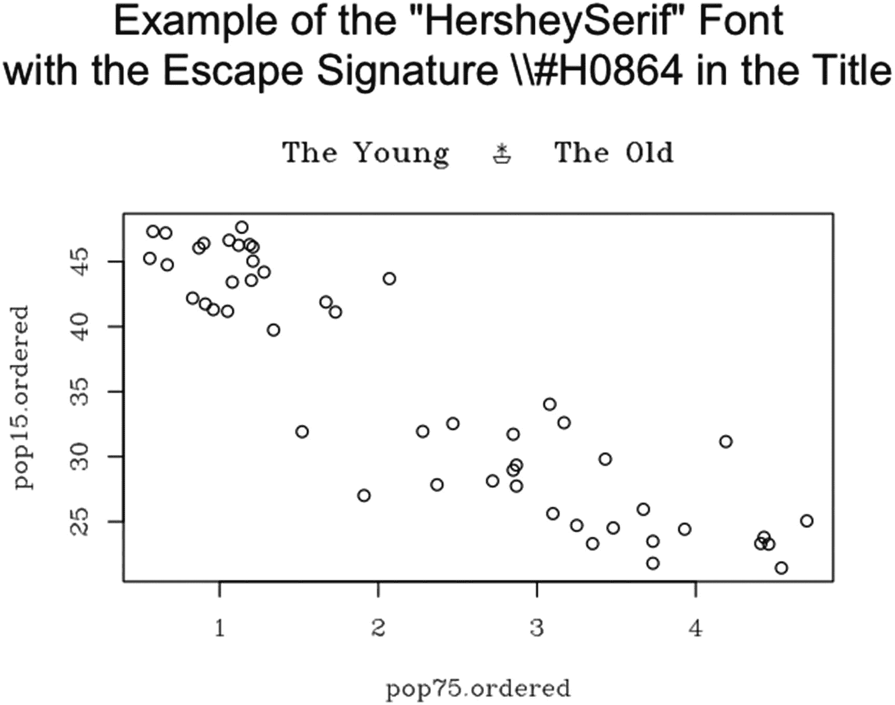

图 3-12

HersheySerif 字体系列的示例，标题中有花盆的转义签名

#### 绘图中的 3.4.2.2 字体粗细( )

字体粗细由参数 Font、font.main、font.sub、font.lab 和 font.axis 设置，分别用于绘图字符、标题、副标题、轴标签和轴刻度标签。参数采用 1–4 的整数值。一些字体系列允许更大的整数，例如“HersheySerif”中的 5、6 和 7。通常，将字体设置为 1 会给出纯文本；将字体设置为 2 会给出粗体文本；将字体设置为 3 会产生斜体文本；将字体设置为 4 会给出粗体和斜体文本。然而，给出的效果并不总是成立的。

在清单 [3-15](#PC17) 中，显示了设置字体权重的代码，其中字体参数被设置为 1–7。

```r
plot(
  pop75.ordered, pop15.ordered,
  main="font.main = 4, font = 2, font.axis = 1",
  sub="font.sub = 3",
  xlab="font.lab = 2",
  ylab=" font.lab = 2",
  pch="2",
  font=2,
  font.main=4,
  font.sub=3,
  font.lab=2,
  font.axis=1
)

plot(
  pop75.ordered, pop15.ordered,
  main="font.main = 5, font.axis = 2",
  sub="font.sub = 6",
  xlab="font.lab = 7",
  ylab=" font.lab = 7",
  pch="1",
  font.main=5,
  font.sub=6,
  font.lab=7,
  font.axis=2
)

Listing 3-15Code for an example of font arguments set equal to 1–7

```

运行清单 [3-15](#PC17) 中代码的结果如图 [3-13](#Fig13) 所示。

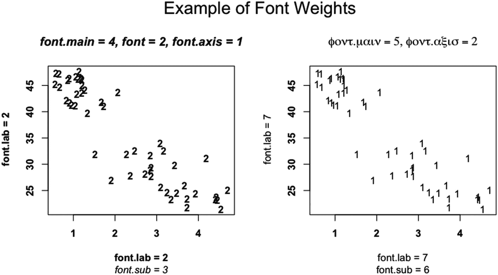

图 3-13

更改权重参数的示例:在第一个图中，font=2，font.main=4，font.sub=3，font.lab=2，font.axis=1。在第二个图中，未设置 font，font.main=5，font.sub=6，font.lab=7，font.axis=2

请注意，如果给定了 font，轴刻度上的标签是 font 参数的权重。

### 3.4.3 图中的字符大小( )

默认字符大小由 r 设置。要确定绘图字符的默认字符大小，有四个只读(不能设置，但可以读取)变量提供字符大小:cin、cra、csi 和 cxy。

参数 cin 是以英寸为单位的字符的宽度和高度；如果像素对设备有意义，cra 是以像素为单位的字符的宽度和高度(否则，通常约为 1/72 英寸)；csi 是以英寸为单位的字符高度；cxy 应该是 cin 的两个元素除以参数 pin 的两个元素，参数 pin 是一个可设置的参数，是以英寸为单位的绘图区域的尺寸。

参数 cin、cra、csi 和 cxy 可以通过使用函数 par()读取——参见清单 [3-16](#PC18) 中的代码。

```r
> par( "cin", "cra", "csi", "cxy", "pin" )
$cin
[1] 0.15 0.20

$cra
[1] 10.8 14.4

$csi
[1] 0.2

$cxy
[1] 0.1621959 4.0434891

$pin
[1] 4.135000 1.399583

Listing 3-16The read-only character size arguments, cin, cra, csi, and cxy, and the settable variable pin

```

对于 cxy，如果绘图区域尚未调整，则元素等于预期值。然而，如果绘图区域改变，那么 cxy 的值不等于应该的值。参见清单 [3-17](#PC19) 和 [3-18](#PC20) 。

```r
> par( pin = c( 3, 1.5 )  )

> par( "cin", "cxy", "pin" )
$cin
[1] 0.15 0.20

$cxy
[1] 0.22356 3.77280

$pin
[1] 3.0 1.5

> par( "cin" )/par( "pin" )
[1] 0.0500000 0.1333333

Listing 3-18Setting

the value of pin and the values of cin, cxy, pin, and cin/pin after the change

```

```r
> par( "pin" )
[1] 4.135000 1.399583

> par( "cin" )/par( "pin" )
[1] 0.0362757 0.1428997

> par( "cxy" )
[1] 0.0362757 0.1428997

Listing 3-17The values of pin, cin/pin, and cxy when the plotting region has not been adjusted

```

有关更多信息，请参见 par()的帮助页面。

绘图中的字符大小由参数 cex、cex.main、cex.sub、cex.lab 和 cex.axis 设置，这些参数分别改变绘图字符以及标题、副标题、轴标签和轴刻度标签中的字符的大小。对于所有的参数，默认的字符大小都是相对于 cex 值的。但是，更改 plot()中的 cex 不会影响其他图形元素的大小。(参数 cex 可以在 par()中更改——这会影响其他图形元素。)

默认情况下，cex 参数的值为 1，这意味着字符的大小由 cin 的值给出。cex.main 的默认值是 1.2。cex.sub、cex.lab 和 cex.axis 的缺省值都是 1。设置任何 cex 参数的值都会将默认字符大小乘以该参数的值。

关于使用 cex、cex.main、cex.sub、cex.lab 和 cex.axis 的示例，请参见清单 [3-19](#PC21) 和图 [3-14](#Fig14)

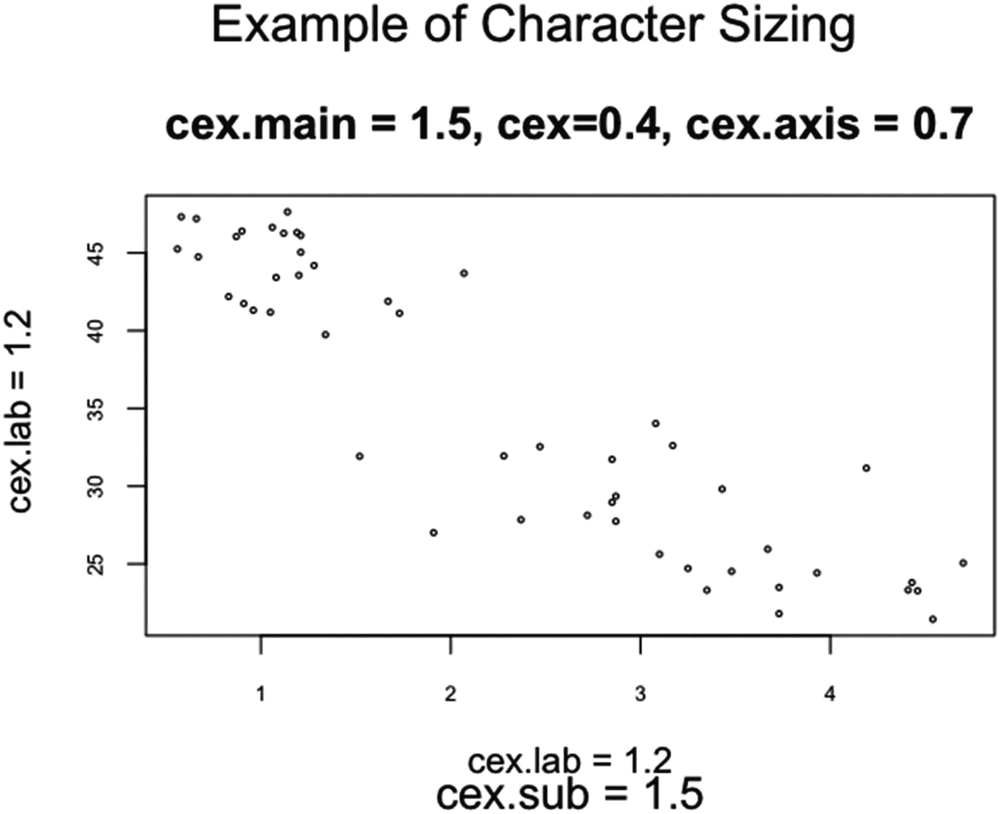

图 3-14

更改 cex、cex.main、cex.sub、cex.lab 和 cex.axis 的示例

```r
plot(
  pop75.ordered, pop15.ordered,
  main="cex.main = 1.5, cex=0.4, cex.axis = 0.7",
  sub="cex.sub = 1.5",
  xlab="cex.lab = 1.2",
  ylab="cex.lab = 1.2",
  cex=.4,
  cex.main=1.5,
  cex.sub=1.5,
  cex.lab=1.2,
  cex.axis=0.7
)

Listing 3-19Code of the example of using the five cex arguments

```

运行清单 [3-19](#PC21) 中代码的结果如图 [3-14](#Fig14) 所示。

### 3.4.4 线路详细信息:lwd、lend、ljoin 和 lmitre

可以设置 plot 生成的线的样式。线宽可以设置；对于线端和线接头的样式，有几个选项。影响线条的四个参数是 lwd、lend、ljoin 和 lmitre。

参数 lwd 影响线条的宽度。该参数可以设置为任何正数，默认值为 1。根据 par()的帮助页面，lwd 的图形解释取决于绘制图形的设备，因此设备之间的效果可能不一致。

参数 lend 描述了行尾的样式。该参数可以是整数值 0、1 或 2，也可以是字符值“round”、“butt”或“square”。默认值为 0 或“四舍五入”。

在清单 [3-20](#PC22) 和图 [3-15](#Fig15) 中，给出了 lwd 和 lend 的示例。

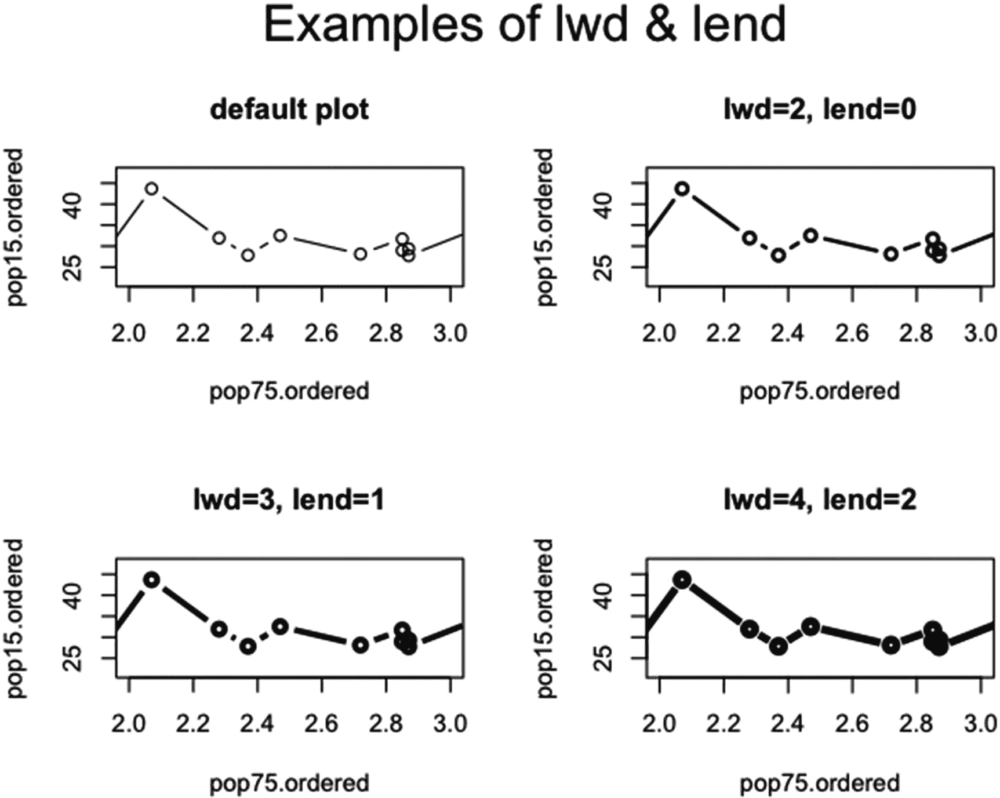

图 3-15

更改 lwd 和 lend 的示例——分别使用默认图(lwd=1 和 lend=0)以及 lwd=2、3 和 4 和 lend=0、1 和 2 的图

```r
plot(
  pop75.ordered, pop15.ordered, type="b",
  main="default plot",
  xlim=c( 2, 3 )
)

plot(
  pop75.ordered, pop15.ordered, type="b",
  main="lwd=2, lend=0",
  lwd=2,
  xlim=c( 2, 3 )
)

plot(
  pop75.ordered, pop15.ordered, type="b",
  main="lwd=3, lend=1",
  lwd=3,
  lend=1,
  xlim=c( 2, 3 )
)

plot(
  pop75.ordered, pop15.ordered, type="b",
  main="lwd=4, lend=2",
  lwd=4,
  lend=2,
  xlim=c( 2, 3 )
)

Listing 3-20Code for the example of the arguments lwd and lend

```

图 [3-15](#Fig15) 如下。

参数 ljoin 影响线条的连接方式。ljoin 有三种可能，也可以是数字或字符串:0 或“圆”，1 或“斜”，2 或“斜角”。如果选择了 1 或“斜接”,那么可以设置参数 lmitre 来控制斜接变成斜接的位置。(从 par()的帮助页面，有些设备不受斜接的影响。)ljoin 的默认值为 0 或“round”；lmitre 的默认值是 10；并且 lmitre 必须大于或等于 1。

见图 [3-16](#Fig16) 中斜接以及圆形和斜面连接的示例。在清单 [3-21](#PC23) 中，给出了展示 ljoin 和 lmitre 的四个图的代码。

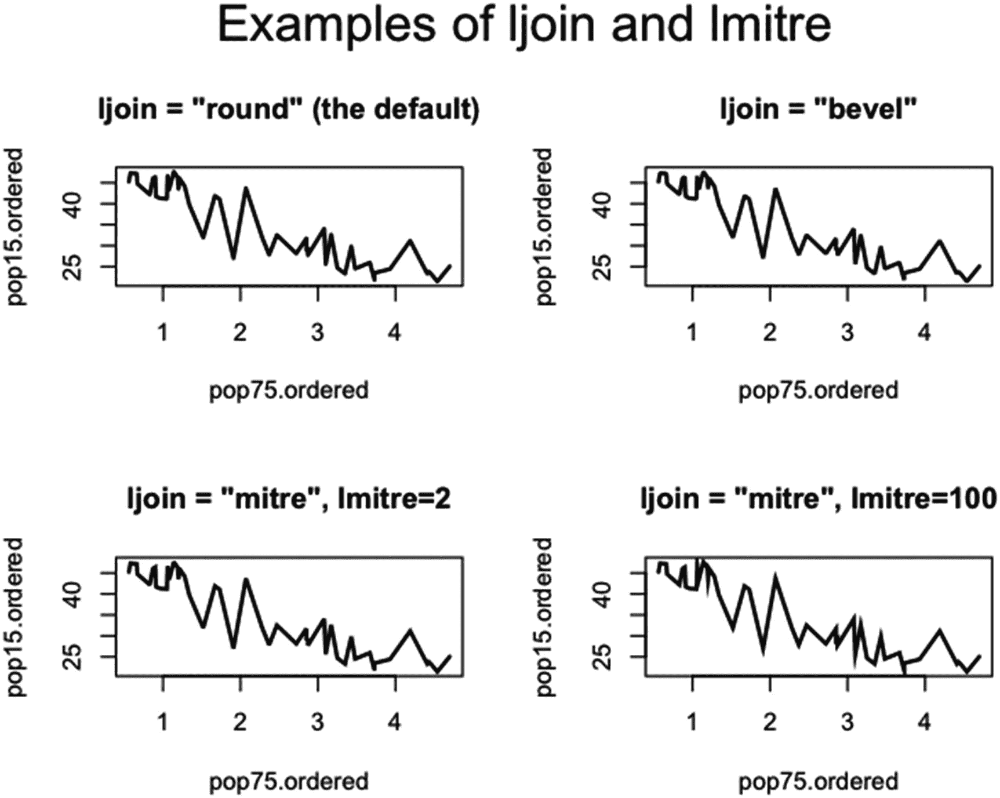

图 3-16

设置 ljoin 和 lmitre 的示例

```r
plot(
  pop75.ordered, pop15.ordered, type="l", lwd=2,
  main="ljoin = \"round\" (the default)"
)

plot(
  pop75.ordered, pop15.ordered, type="l", lwd=2,
  main="ljoin = \"bevel\"",
  ljoin="bevel"
)

plot(
  pop75.ordered, pop15.ordered, type="l", lwd=2,
  main="ljoin = \"mitre\", lmitre=2",
  ljoin=1,
  lmitre=2
)

plot(
  pop75.ordered, pop15.ordered, type="l", lwd=2,
  main="ljoin = \"mitre\", lmitre=100",
  ljoin=1,
  lmitre=100
)

Listing 3-21Code for the plots showing the effect of ljoin and lmitre

```

在图 [3-16](#Fig16) 中，给出了运行代码的结果图。

### 3.4.5 更改轴

在对 plot()的调用中，有多种方法可以更改轴刻度和轴刻度标签。可以更改轴刻度标签相对于轴的方向。可以将记号设置为从图的边缘或图内一小段距离开始。可以关闭轴刻度和轴刻度标签的绘制。只要小心，刻度的值和间距是可以控制的。可以设置记号的长度和方向。

轴刻度标签的方向由参数 las 设置，它可以取值 0，表示平行于轴；1、为始终水平；2、对于垂直于轴线的；第三，永远垂直。默认值为 0。

在清单 [3-22](#PC24) 中，给出了说明四个轴刻度标签样式的四个图的代码。

```r
plot(
  pop75.ordered, pop15.ordered,
  las=0,
  main="las = 0"
)
plot(
  pop75.ordered, pop15.ordered,
  las=1,
  main="las = 1"
)
plot(
  pop75.ordered, pop15.ordered,
  las=2,
  main="las = 2"
)
plot(
  pop75.ordered, pop15.ordered,
  las=3,
  main="las = 3"
)

Listing 3-22Code for the example of las set to 0, 1, 2, and 3

```

在图 [3-17](#Fig17) 中，生成了图形。

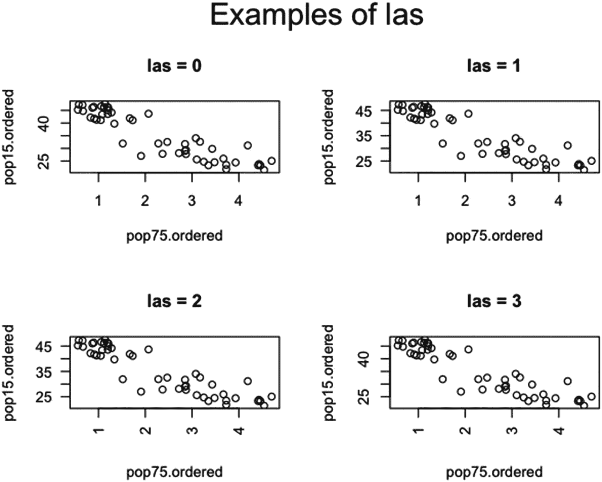

图 3-17

将轴刻度标签方向参数 las 设置为 0、1、2 和 3 的示例

参数 xaxs 和 yaxs 决定是否在 x 和/或 y 轴的两端放置 4%的轴范围的空间。可能的参数是“r”和“I”。值“r”是默认值，表示使用 4%的空间。值“I”表示没有空格。

在清单 [3-23](#PC25) 中，给出了使用 xaxs 和 yaxs 的示例代码。

```r
plot(
  pop75.ordered, pop15.ordered,
  main="xaxs = \"r\", yaxs = \"r\"",
  xaxs="r",
  yaxs="r"
)

plot(
  pop75.ordered, pop15.ordered,
  main="xaxs = \"i\", yaxs = \"i\"",
  xaxs="i",
  yaxs="i"
)

Listing 3-23Code for setting the edge space in a plot

```

在图 [3-18](#Fig18) 中，显示了来自清单 [3-23](#PC25) 的图。

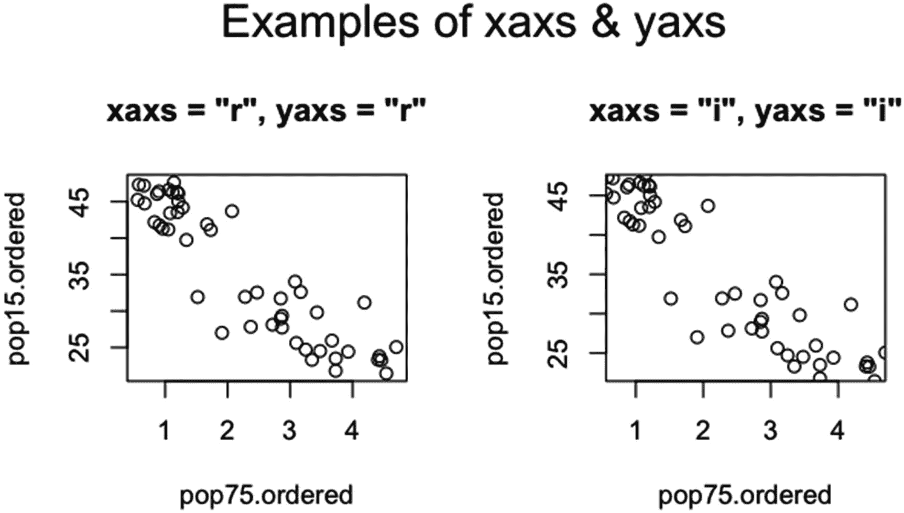

图 3-18

设置边缘有和没有空间的地块的示例

使用参数 axes、xaxt 和 yaxt 可以选择不使用轴记号和轴记号标签对绘图进行注释。自变量 axes 是一个长度为 1 的逻辑自变量，它告诉 R 是否包含轴。默认值为 TRUE–包括轴。

参数 xaxt 和 yaxt 对单个轴也是如此，但它们是长度为 1 的字符向量。将 xaxt 和/或 yaxt 设置为“s”、“l”或“t”会在 x 和/或 y 轴上绘制标准轴。将 xaxt 和/或 yaxt 设置为“n”会抑制轴记号和轴记号标签注释。

清单 [3-24](#PC26) 给出了显示 xaxt 和 yaxt 效果的图的代码。

```r
plot(
  pop75.ordered, pop15.ordered,
  main="xaxt = \"n\", yaxt = \"s\"",
  xaxt="n",
  yaxt="s"
)

Listing 3-24Code for the example of setting xaxt and yaxt

```

在图 [3-19](#Fig19) 中，给出了显示设置 xaxt 和 yaxt 的影响的曲线图。

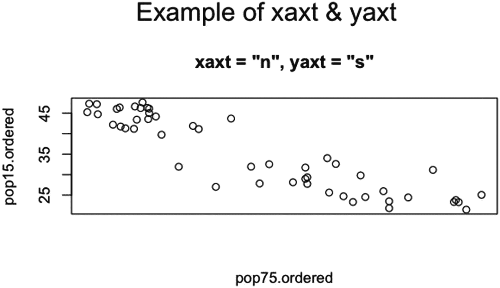

图 3-19

使用 xaxt 抑制 x 轴上的轴刻度和轴刻度标签的示例

控制刻度间距有点棘手。设置间距的参数是 lab 来设置两个轴的间距，xaxp 和/或 yaxp 来分别设置轴的间距。然而，R 使用 las、xasp 和/或 yasp 给出的间距作为指导，但是选择可能遵循或可能不遵循该指导的“漂亮”间隔。设置 xlim 和/或 ylim 以及 lab、xaxp 和/或 yaxp 会有所帮助。

参数 lab 采用一个三元素整数向量。第一个元素设置 x 轴上的刻度数，第二个元素设置 y 轴上的刻度数，第三个元素没有使用。默认值为 c( 5，5，7)。在清单 [3-25](#PC27) 中，给出了使用 las 的两个示例图的代码。

```r
plot(
  pop75.ordered, pop15.ordered,
  main="lab = c( 10, 7, 7 )",
  lab=c( 10, 7, 7 )
)

plot(
  pop75.ordered, pop15.ordered,
  main="lab = c( 10, 7, 7 )\nxlim=c( 0.5, 5 ), ylim=c( 20, 50 )",
  lab=c( 10, 7, 7 ),
  xlim=c( 0.5, 5),
  ylim=c( 20, 50 )
)

Listing 3-25Examples of setting las with and without xlim and ylim

```

在图 [3-20](#Fig20) 中，清单 [3-25](#PC27) 中的代码已经运行。

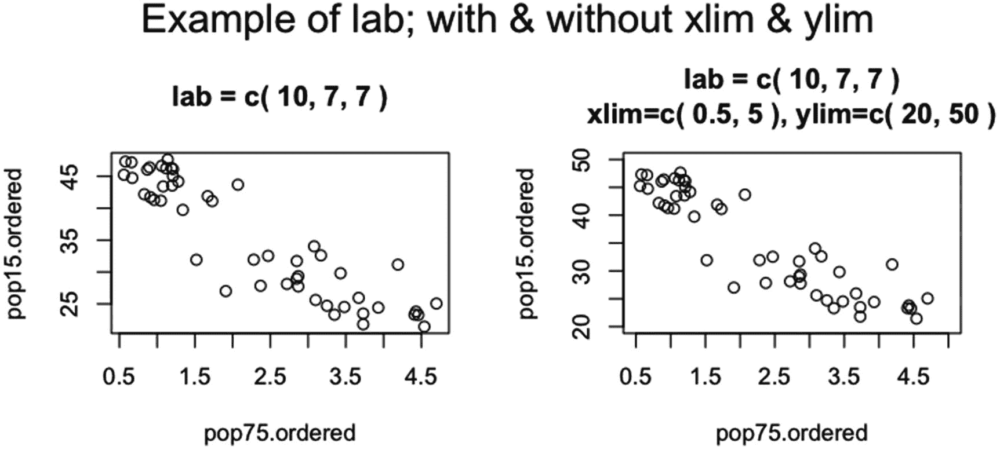

图 3-20

在设置 xlim 和 ylim 的情况下和不设置 xlim 的情况下对刻度间距使用 las 的示例

请注意，在第一个图中，x 轴上有 9 个刻度，y 轴上有 5 个刻度，尽管 las 要求 x 轴上有 10 个刻度，y 轴上有 7 个刻度。在第二个图中，x 轴上有 10 个刻度，y 轴上有 7 个刻度，由 las 设置。

要将刻度放在应该放置刻度的位置，从右(上)轴限制中减去左(下)轴限制，并将差值除以刻度间隔，然后将结果加 1。使用刻度数的结果值。在图 [3-20](#Fig20) 中，例如(5.0–0.5)/0.5+1 = 10 和(50–20)/5+1 = 7，所以 las 设置为等于 c( 10，7，7)，其中第三个数可以是任意非负数。

参数 xaxp 和 yaxp 可用于独立设置每个轴的间距。两个参数都采用三元素数值向量。第一个元素是轴的下限，第二个元素是轴的上限，第三个数字是刻度间距的个数。再次，论点是一个指南，但 R 会选择一个“漂亮”的间距。

在清单 [3-26](#PC28) 中，给出了使用 xaxp 和 yaxp 的示例代码。

```r
plot(
  pop75.ordered, pop15.ordered,
  main="xaxp = c( 0.5, 5, 9 )\nyaxp = c( 20, 50, 6 )",
  xaxp=c( 0.5, 5, 9 ),
  yaxp=c( 20, 50, 6 )
)

plot(
  pop75.ordered, pop15.ordered,
  main="xaxp = c( 0.5, 5, 9 ), xlim = c( 0.5, 5 )\nyaxp = c( 20, 50, 6 ),
  ylim = c( 20, 50 )",
  xaxp=c( 0.5, 5, 9 ),
  yaxp=c( 20, 50, 6 ),
  xlim=c( 0.5, 5),
  ylim=c( 20, 50 )
)

Listing 3-26Code to demonstrate xaxp and yaxp with and without setting xlim and ylim

```

在图 [3-21](#Fig21) 中，生成了图形。

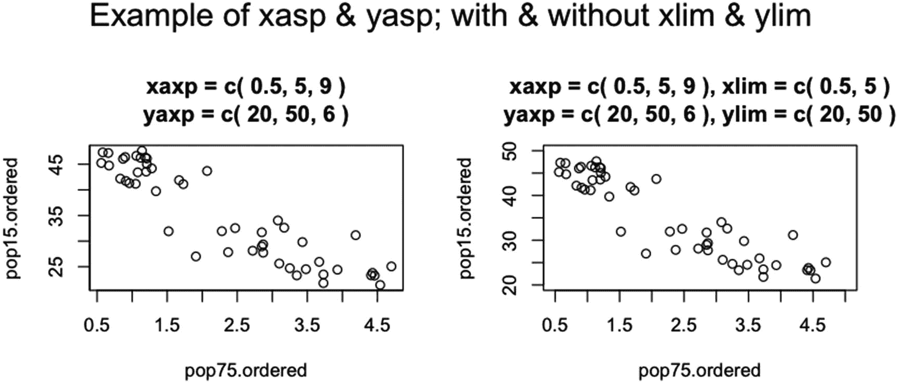

图 3-21

使用和不使用 xlim 和 ylim 设置 xaxp 和 yaxp 的示例

同样，第一个图中的空格不是 xaxp 和 yaxp 的空格；空间是第二个图中 xaxp 和 yaxp 的空间。请注意，空格数比刻度数少 1。

记号的长度和方向由参数 tck 和 tcl 设置。两个参数都采用长度为 1 的数字向量。

如果没有设置 tcl，参数 tck 给出刻度线的长度和方向。如果该值为正值，刻度线将绘制到绘图中；如果为负数，刻度线将远离绘图。如果 tck 设置为 1，则绘制网格线。

如果 tck 的绝对值大于 0.5 且小于或等于 1，则绘制在两个轴上的长度是 tck 的绝对值乘以垂直于刻度轴的轴的长度。如果 tck 介于-0.5 和 0.5 之间，则两个轴上的长度是 tck 的绝对值乘以较短轴的长度。tck 的值也可以大于 1，此时网格线延伸到图的边缘之外。tck 的默认值为 NA。

如果 tcl 被置位，那么 R 忽略 tck。一个刻度的长度是字符的行高的 tcl 倍。与 tck 一样，负值指向远离图的方向，正值指向图内。tcl 的默认值是-0.5。在 par()的帮助页面中，如果 tcl 设置为 NA，则 tck 设置为-0.01。

在清单 [3-27](#PC29) 中，给出了设置 tck 和 tcl 的两个例子的代码。

```r
plot(
  pop75.ordered, pop15.ordered,
  main="tck = 1",
  tck=1
)

plot(
  pop75.ordered, pop15.ordered,
  main="tck = NA, tcl=0.5",
  tck=NA,
  tcl=0.5
)

Listing 3-27Code to generate two plots with tck and tcl set

```

在图 [3-22](#Fig22) 中，运行清单 [3-27](#PC29) 中两个地块的代码。

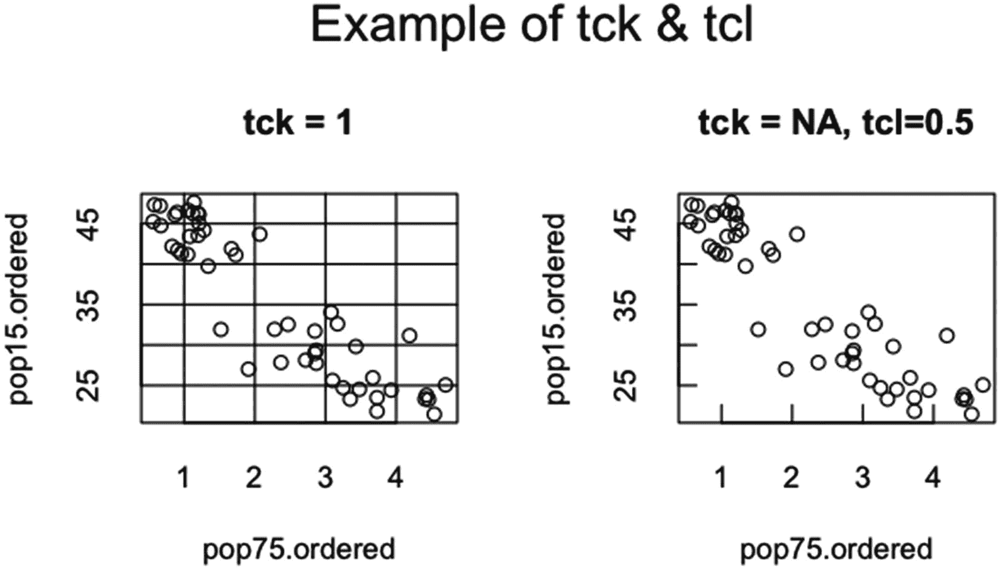

图 3-22

设置 tck 和 tcl 的示例

### 使用对数秤

有时，如果在一个或两个轴上使用对数标度，绘图会更清晰。对数刻度是指 x 或 y 值以 10 为底的对数中的轴刻度间距是线性的，而不是值的线性。但是，刻度线的标签以 x 或 y 值为单位。要设置对数刻度，使用参数 log。要注释比例尺，可以使用 xaxp 和 yaxp。与线性秤一样，xaxp 和 yaxp 只是指南。r 将创建“漂亮的”轴符号。

参数日志接受一个长度为 1 的字符向量作为值。可能的值是“x”，表示 x 轴上的对数刻度；“y”，表示 y 轴上的对数刻度；和“xy”或“yx ”,表示两个轴上的对数刻度。对于参数 xaxp 和 yaxp，轴上使用对数刻度的符号由 xaxp 和/或 yaxp 的第三个值控制。

可以使用三个值:1、2 或 3。根据 par()的帮助页面，xaxp 和/或 yaxp 的下限和上限必须是 10 的幂。在这种情况下，当 xaxp 和/或 yaxp 的第三个值设置为 1 时，只标注 10 的幂。对于 2，注释了 10 的 1 次和 5 次幂。对于 3、1、2 和 5 倍的 10 次方被注释。然而，在我的例子中，第一个图的 y 极限不等于 10 的幂；在我的设备上，R 很好地处理了这些限制。

来自生命周期储蓄数据集的变量 dpi(实际人均可支配收入)适用于对数标度的演示，并在清单 [3-28](#PC30) 和图 [3-23](#Fig23) 中使用。用于创建图 [3-23](#Fig23) 中的图的代码见清单 [3-28](#PC30) 。

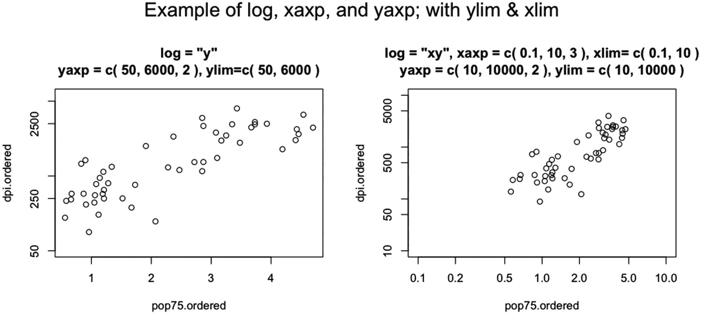

图 3-23

使用 log、xaxp 和 yaxp 创建对数刻度的示例

```r
dpi.ordered = LifeCycleSavings$dpi[ ord ]

plot(
  pop75.ordered, dpi.ordered,
  main="log = \"y\"\nyaxp = c( 50, 6000, 2 ), ylim=c( 50, 6000 )",
  log="y",
  yaxp=c( 50, 6000, 2 ),
  ylim=c( 50, 6000 )
)

plot(
  pop75.ordered, dpi.ordered,
  main="log = \"xy\", xaxp = c( 0.1, 10, 3 ), xlim= c( 0.1, 10)\nyaxp = c( 10, 10000, 2 ), ylim = c( 10, 10000 )",
  log="xy",
  xaxp=c( 0.1, 10, 3 ),
  yaxp=c( 10, 10000, 2 ),
  xlim=c( 0.1, 10 ),
  ylim=c( 10, 10000 )
)

Listing 3-28Code to create the variable dpi.ordered and plot the example plots for log, xaxp, and yaxp

```

在图 [3-23](#Fig23) 中，给出了示例中的图。