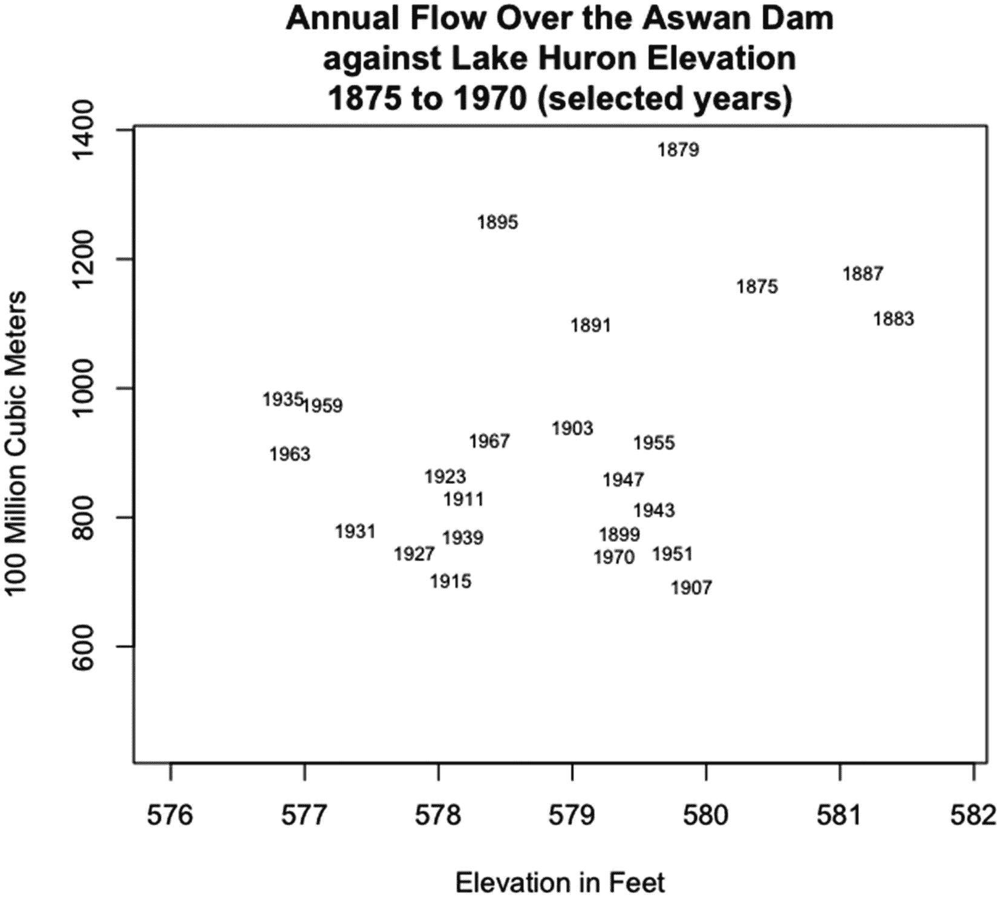

# 四、`plot()`的方法

对于 plot()这样的函数，函数的方法是应用于特定对象类的函数版本，例如数值向量类或时间序列对象类。在本章中，我们将介绍图形和统计包中的 plot()方法，而不是 plot.default()。(函数 plot.default()是第三章的主题。)在 graphics 包中有八个 plot()方法，在 stats 包中有二十个。

## 5.1 方法

运行 plot()时，plot()会找到第一个参数的类，并根据该类选择要使用的 plot()方法。第一个参数是调用中列出的第一个参数——除非在调用中的其他地方有一个分配给 x 的对象(如果方法是 formula，则为 formula ),然后它成为第一个参数。如果 plot()有对象的方法，则创建一个或多个图。创建的图形基于方法，并随对象的类别而变化。

要在使用 RStudio 时查看 R 包中的 plot()方法列表，请打开右下窗格中的 Packages 选项卡并滚动到该包。打开包(单击名称)并向下滚动到 plot 在内容的字母顺序中所处的位置。plot()的方法以`plot.`开始，并有一个描述方法的扩展名——例如 plot.ts。

并不是所有名为`plot.`后跟扩展名的函数都是 plot()的方法。如果函数是一种方法，在函数的帮助页面中，在**用法、**下，将出现表达式图(…)(括号内的内容因方法而异)。有些帮助页面包含不止一个功能，所以在**用法**下可能有比 plot()更多的功能。

在 R 中，转到菜单中的 Packages & Data 选项卡，然后选择 Package Manager。向下滚动到包，打开包，然后向下滚动到绘图。并非所有包都有 plot()方法。

假设 plot()有一个对象类的方法，那么对 plot()的调用不一定包括扩展。对于某些方法，可以包含扩展。对于其他方法，包含扩展名会导致错误。在本章中，函数被称为 plot()或 plot。 *ext* ()，其中 ext 是方法的名称。但是，关于编码，运行图。 *ext* ( …)有时会出错。

plot()的参数随着方法的变化而变化。在方法的 R 帮助页面上，特定于该方法的参数位于`plot`后的括号内。有的和 plot.default()的参数不一样，有的只是缺省值不一样。在第 5.2 和 5.3 节中，描述了帮助页面上指定的参数，并给出了参数取值的种类。每种方法都有一个或多个图形示例。

## 5.2 图形包中 plot()的方法

图形包是默认加载的 R 包之一。该软件包包含许多创建地块的函数和一些用于创建地块的函数。表 5-1 中给出了图形包中 plot()的方法——来自 RStudio。

表 5-1

图形包中 plot()的方法

<colgroup><col class="tcol1 align-left"> <col class="tcol2 align-left"></colgroup> 
| 

功能

 | 

描述

 |
| --- | --- |
| *"plot.data.frame* | *数据帧的绘制方法* |
| *"plot.default* | *默认散点图功能* |
| *"绘图因素* | *标绘因子变量* |
| *"图.公式* | *散点图的公式符号* |
| *"绘图功能* | *绘制函数图* |
| *"绘图.直方图* | *绘制直方图* |
| 绘图.格线 | *绘制光栅图像* |
| *"绘图.表格* | *表格对象的绘图方法* |

—R 中图形包的帮助页面

### 数据框架法

第一个方法是 data.frame 方法，用于数据框类的对象。数据框类似于矩阵，只是列可以是不同的原子模式。由 plot.data.frame()绘制的数据框应该是带有数字列的数据框-但非数字列会转换为数字列。(数据框的模式是列表，因为矩阵不能跨列混合模式。)

根据 plot.data.frame()的帮助页面，首先使用 data.matrix()将数据框转换为数值矩阵。对于数据框中的非数值列，这些列将转换为数值列。原始数据被转换为数值，逻辑值被转换为 0 表示假，1 表示真，复数被赋予实部的值，字符值被转换为具有数值的因子。

可以使用索引选择数据框中的数字列。例如，xx[，c( 1，5，3 ) ]创建一个包含数据帧 xx 的第一、第五和第三列的数据帧。选择单个列不会生成数据框，但是通过使用仅包含一个矢量值的函数 data.frame()，数据框可以仅包含一列。例如，data.frame( xx[，2 ])将从 xx 的第二列创建一个单列数据帧。

将数据框转换为数值矩阵后，函数对()用于绘制数据框，除非数据框仅包含一列。当数据框仅包含一列时，plot()使用函数 stripchart()绘制数据框。

唯一指定的参数是 x，表示 data.frame 类的对象。x 没有默认值。

plot.data.frame()可以使用的参数是 plot.default()和 pairs()使用的参数，如果数据框包含单个列，stripchart()也可以使用这些参数。

在清单 5-1 中，给出了使用生命周期保存数据帧演示 plot.data.frame()的代码。

```r
plot(
  LifeCycleSavings[ , 2:4 ],
  log=3,
  cex=0.5,
  main="Example of plot.data.frame()"
)

Listing 5-1Code for the example of using the data.frame method of plot given in Figure 5-1

```

在图 5-1 中，给出了一个在 plot()中使用数据框的例子。


图 5-1。

对数据框生命周期的中间三列运行 plot()的示例保存

从完整的生命周期保存数据集中选择了三列。请注意，第三个变量 dpi 使用对数标度。有关如何设置对数刻度的信息，请参见 pairs 的帮助页面()。

第一行中的图是 pop15 (y 轴)对 pop75 (x 轴)和 pop15 对 dpi。在第二行中，pop75 相对于 pop15 和 dpi 绘制。在第三行中，相对于 pop15 和 pop75 绘制 dpi。通过将 cex 设置为等于 0.5 来减小绘制圆的尺寸。

### 因素法

r 属于因子类的数据是其值分组的数据——通常这些值是设计实验中不同因子水平的名称。这些值通常是字符串，但不是必须的。factor 方法绘制的数据的参数 x 是 factor 类的向量、两列矩阵或第一列属于 factor 类的数据框。参数 y 的值是一个可选的向量，可以是 factor 或 numeric 类。

如果没有提供 y，而 x 是一个向量，则该向量被绘制成条形图，其中条形的长度是每个因子的计数(观察值的数量)。

如果 x 是矩阵，x 的第二列是数值类的向量，y 为空，则 x 的第二列是针对 x 的第一列绘制的，如果 x 是矩阵，y 是数值类的向量，则 y 是针对 x 的第一列绘制的，如果 x 是向量，y 是数值类的向量， 在所有三种情况下，如果 x 是向量，则为 x 的每个因子生成箱线图，如果 x 是矩阵，则为 x 的第一列生成箱线图。 用于箱线图的数值是与 x 的第二列或 y 中的向量相关联的值——如果 y 是给定的数值。

如果 y 是因子类的向量，或者 y 为空，并且 x 是两列都是因子类的矩阵，则两个因子向量(x 和 y，x 和 y 的第一列，或者 x 的第一列和第二列)在样条图中彼此相对绘制。样条图将第一个因子向量放在 x 轴上，将第二个放在 y 轴上。

在样条图中，对于 x 轴上的每个因子，赋予该因子的沿轴长度取决于分配给该因子的观察值的比例。在 y 轴上，对于每个 y 轴因子级别，为该因子分配一种颜色。然后在每个 x 轴因子的垂直上方绘制颜色，颜色的高度基于 y 轴因子在 x 轴因子类中的比例。

plot.factor()的指定参数是 x，对于 factor 对象(如果是矩阵，第二列可以是数值向量)；y，代表可选的数字或因子向量；和 legend.text 来标记 y 轴上的因子，如果向函数提供了两个因子向量，则忽略该参数。

参数 x 可以是因子类的向量，也可以是具有两列的矩阵或数据框，其中第一列必须是因子类，第二列必须是数值或因子类。x 没有默认值。

参数 y 可以是 NULL、factor 类的向量或 numeric 类的向量。如果是向量，向量的长度必须与 x(或者 x 的行数，如果 x 是矩阵)相同。如果提供了 y 且 x 是矩阵，则只有 x 的第一列用于绘图。y 的默认值为空。

参数 legend.text 采用任意长度的字符向量(或可以强制为字符的向量)。如果 y 是一个因子，向量中的字符串循环到 y 中的因子数。如果 y 为空，x 为矩阵，x 的第二个变量为因子，则 legend.text 循环到 x 的第二个变量中的因子数。legend.text 的默认值是 y 或 x 的第二列的因子名的向量

该函数还接受 plot.default()使用的参数，以及 boxplot()、barplot()和 splineplot()的参数。

在清单 5-2 中，给出了图 5-2 中使用 plot.factor()绘制条形图、箱线图和样条图的示例代码。


图 5-2

使用 plot.factor()创建条形图、箱线图和样条图的示例

```r
LCS = data.frame(
  dpi=dpi.ordered,
  pop75.f=cut(
    pop75.ordered,
    3,
    labels=c( "L", "M", "H" )
  ),
  pop15.f=cut(
    pop15.ordered,
    4
  ),
  sr=LifeCycleSavings$sr[ ord ]
)

plot(
  x=LCS[ ,2 ],
  y=LCS[ ,1 ],
  main="boxplot()",
  xlab="pop75 factor classes",
  ylab="dpi"
)

plot(
  x=LCS[ , 2 ],
  main="barplot()",
  xlab="pop75 factor classes",
  ylab="count"
)

plot(
  x=LCS[ , 2:3 ],
  legend.text=c("L", "ML", "MH", "H" ),
  main="splineplot()",
  xlab="pop75 factor classes",
  ylab="pop15 factor classes"
)

Listing 5-2The code to demonstrate the use of plot.factor() to create a bar plot, a boxplot, and a spline plot

```

在图 5-2 中，运行清单 5-2 中的代码。

请注意，函数 cut()用于将 15 岁以下人口百分比和 75 岁以上人口百分比的变量放入类中。超过 75%的百分比的标签在剪切功能中分配。使用参数 legend.text 分配 15 岁以下百分比的标签。

### 5.2.3 公式法

plot()的 formula 方法为 formula 类的对象创建图。formula 类的对象由函数 formula()和 as.formula()创建，或者通过显式写出公式来创建。公式中的因变量相对于公式中的每个自变量绘制，每个自变量绘制在单独的图上。绘图的类型取决于因变量的类别和自变量的类别。

该函数接受五个指定的参数以及该函数调用的任何其他方法使用的参数，如 plot.default()。五个指定的参数是 formula，用于 formula 类或显式公式的对象；数据，用于数据帧，如果使用的话；子集，用于要绘制的观察值集(在行内)；ylab，代表垂直轴上的标签；并询问，如果有多个自变量，是否在进入下一个图之前暂停。

按照论点的顺序，论点…排在第三位。一般来说，在参数顺序中……之后的参数不能以缩写形式引用。

公式参数采用公式或公式类的对象。在最简单的参数形式中，公式以因变量名称开始，后跟一个波浪号，再后跟由加号分隔的自变量名称。如需更复杂的公式，请参阅公式()的说明页面。公式没有默认值。

数据参数采用矩阵、数据框或环境。如果参数是矩阵，则矩阵将被转换为数据框。然后，可以通过数据框中的变量名在公式中引用数据框中的变量。数据的默认值是 parent.frame()，在我的设备上就是会话环境。

subset 参数采用指数值的数值向量——用于绘制观察值的指数。只有子集中的观察值用于图中。子集没有默认值。

ylab 参数采用一个单元素字符向量(或可以强制为字符的向量)。ylab 的默认值是 varnames[response]–在我的设备上，它使用因变量的变量名。

ask 参数采用任意长度的逻辑向量(或者可以强制为逻辑向量)。仅使用第一个值。ask 的缺省值是 dev . interactive()–在我的设备上，它的值为 TRUE，因为我可以与我的设备进行交互。

在清单 5-3 中，给出了使用 plot.formula()的示例代码。使用了所有五个参数，以及参数 l as 和 xlab。

```r
 plot(
  dpi ~ .,
  data=LCS,
  subset=11:40,
  ylab="Disposable Income",
  ask=FALSE,
  las=3,
  xlab=""
)

Listing 5-3Code to demonstrate plot.formula() using formula, data, subset, ylab, ask, las, and xlab

```

在图 5-3 中，运行清单 5-3 中的代码。


图 5-3

在 plot()中使用公式、数据、子集、ylab、ask、las 和 xlab 的示例

自变量公式采用`dpi ~ .`的形式。因为参数数据被设置为 LCS，所以波浪号后的句点告诉 R，除了被分配的因变量之外，LCS 中的所有变量都将被用作自变量。

因为子集等于`11:40`，所以只绘制了中间的 30 个观察值。y 轴标签已更改为“可支配收入”。参数 ask 被设置为 FALSE，因为这些图被一起绘制在一个图形中(这是通过在 par()中设置 mfrow 来完成的，将在第 6.2.1 节中介绍)。请注意，x 标签已被取消，x 轴刻度标签垂直绘制。

这三幅图分别对应 75 岁以上人口的百分比、15 岁以下人口的百分比以及个人储蓄总额与可支配收入的比率。由于前两个变量是数据框 LCS 中的因子变量，因此前两个图包含箱线图。

### 5.2.4 函数法

plot()的 function 方法绘制 function 类的对象。function 类的对象要么是固定的 R 函数，要么是用 function()函数创建的。函数 plot.function()类似于函数 curve()，两个函数共享同一个帮助页面。plot.function()的参数比函数 curve()的参数简单一些，但该方法给出的结果基本相同。

plot.function()函数接受六个指定的参数以及 curve()的参数，但 curve()中的参数 expr 除外(有关 curve()参数的讨论，请参见第 4.3.2 节)。plot.function()的六个指定参数是 x，用于函数定义或函数名；y，为输入到函数中变量的起始值；to，为输入到函数中变量的结束值；from，y 的别名；xlim，代表图中 x 轴上的限值；y 轴上的标签。

x 参数可以是一个书面的函数定义(如`function( z ) z +1`)或一个函数的名称——包括用户定义的函数。该函数必须只有一个参数，并且必须为输入变量的每个值只返回一个值。x 没有默认值。

y、to 和 from 参数采用任意长度的逻辑、数值、复数或字符向量。向量被强制为数值模式，并且只使用第一个值。如果指定了 from，则 from 优先于 y。y 的默认值为 0，to 的默认值为 1，from 的默认值为 y。(如果在对 plot()的调用中将 from 指定为等于 y，则 plot()会在工作区中查找 y 的值；如果找不到 y，则给出一个错误。)

xlim 参数采用原始、逻辑、数值或字符模式的两元素向量。如果不是数值，向量将转换为数值模式。如果未指定 y 和 to，而 xlim 为，则 xlim 中的值用于 y 和 to。xlim 的默认值为空，即使用 y 和 to 的(可能是默认值)值作为 x 限值。

ylab 参数采用任意长度的字符向量(或可以强制为字符的向量)。ylab 的元素绘制在绘图页边空白的连续行上，从用于轴标签的默认行开始。ylab 的缺省值是 NULL–它将参数 x 的值绘制为 y 标签。

在清单 5-4 中，给出了在 plot.function()中使用 x(作为函数定义)、y、to、xlim 和 xlab 的示例代码。

```r
plot(
  x=function( z ) z² + 2*z + 1,
  y=-5,
  to=5,
  xlim=c( -5.5, 5.5 ),
  xlab="z",
  main="Example of using x, y, to,\nxlim, & xlab in plot.function()"
)

Listing 5-4Code to demonstrate the use of x, y, to, xlim, and xlab in plot() when x is a function definition

```

在图 5-4 中，运行清单 5-4 中的代码。


图 5-4

在 plot()中使用 x、y、to、xlim 和 xlab 的示例，其中 x 是函数定义

请注意，y 轴标签是函数定义，因为变量 z 用于函数定义，所以 x 轴标签已更改为“z”。默认情况下，x 轴标签为“x”。xlim 的范围比 y 和 to 的范围更宽，因此抛物线不会绘制到 x 轴的极限。

### 直方图法

直方图是数值向量范围内落入数值类的观察值数量的图，通常宽度相等。数值变量可以在水平轴或垂直轴上。当 x 被设置为等于 histogram 类的对象或者被设置为等于具有正确直方图结构的列表时，plot()的 histogram 方法绘制直方图。histogram 类的对象是通过调用 hist()创建的。

plot.histogram()函数接受 17 个指定的参数和许多未指定的图形参数。在指定的参数中，只有三个值特定于 plot.histogram()。

前七个参数是 x，表示包含直方图规格的列表；freq，用于是否绘制频率或概率密度函数；密度，直方图矩形中每英寸的线条数，如果矩形用线条填充；角度，直方图矩形中线条的角度；col，用于直方图矩形的颜色；border，用于矩形边框的颜色；和 lty，用于矩形边界的线型。

参数 x 接受一个包含六个元素的列表。第一个元素名为 breaks，包含直方图矩形断点的递增数字向量。比矩形多一个断点。

第二个元素名为 counts，是一个数值向量，包含落在两个断点之间的观察值的数量。每个矩形应该有一个值。

第三个元素名为 density，是一个数值向量，每个矩形的值给出了矩形的高度。R 为密度计算的值是矩形的计数除以这个量:观察的总数乘以矩形的宽度。这些值具有矩形面积总和为 1 的属性，这是概率密度的一个基本属性。

第四个元素是 mids，这是矩形 x 轴中点的数值向量。第五个元素是 xname，它是一个单元素字符向量，包含为其绘制直方图的对象的名称。

第六个元素是 equidist，是一个一元逻辑向量。如果矩形的宽度都相同，则该值应为 TRUE。否则，该值应为 FALSE。

可以通过调用函数 hist()来生成 x 的适当列表，例如，通过将 x 设置为等于`hist( pop75.ordered, plot=FALSE ).`

第二个参数 freq 采用单元素逻辑向量。如果设置为 TRUE，计数值将用于直方图高度。如果为 FALSE，则使用密度值。

第三个到第七个参数 density、angle、col、border 和 lty 与辅助函数 rect()中的一样。更多信息见 4.3.4.1 章节。

除了标签之外，最后十个参数是 plot.default()中的标准参数，但有些参数具有特定于 plot.histogram()的默认值。对于标题、副标题、x 轴标签和 y 轴标签，参数是 main、sub、xlab 和 ylabxlim 和 ylim，用于 x 和 y 轴的限制；坐标轴，用于是否绘制坐标轴；标签，用于是否绘制以及在直方图矩形上方放置什么标签；添加，用于是否添加到现有地块；以及 ann，是否绘制标题和轴标签。有关详细信息，请参阅第 3.2.1、3.2.2 和 4.1 节或 plot.default()、title()和 axis()的帮助页面。

main 的默认值是`paste( "Histogram of", paste( x$xname, collapse="\n" ) )`。xlab 的默认值是`x$xname`。xlim 的默认值是`range( x$breaks )`。axes、add 和 ann 的默认值分别为 TRUE、FALSE 和 TRUE。

标签参数可以是逻辑的，也可以是任意长度的字符向量。如果设置为 TRUE 并且 freq 也设置为 TRUE，则落在矩形类中的观测值的数量(计数)将绘制在矩形的上方。

如果设置为 TRUE，freq 设置为 FALSE，则绘制在矩形上方的是矩形中的计数除以数量:观察的总数乘以矩形的宽度。结果最多保留到小数点后三位，具体取决于矩形的宽度。如果 labels 为 FALSE，则不绘制任何标签。

如果 labels 是一个字符向量，并且 labels 的长度小于矩形的数量，那么 labels 的元素循环到最后一个矩形。如果标签的长度等于或大于矩形的数量，则元素将继续在矩形中循环，直到到达标签的末尾，随着循环的继续，将已经在矩形上方的标签过度绘制。标签的默认值为 FALSE。

在清单 5-5 中，给出了运行 plot()的示例代码，其中直方图列表作为 x 的值。

```r
pop75=hist(
  pop75.ordered,
  plot=FALSE
)

> pop75
$breaks
 [1] 0.5 1.0 1.5 2.0 2.5 3.0 3.5 4.0 4.5 5.0

$counts
[1]  9 11  4  4  5  7  4  4  2

$density
[1] 0.36 0.44 0.16 0.16 0.20 0.28 0.16 0.16 0.08

$mids
[1] 0.75 1.25 1.75 2.25 2.75 3.25 3.75 4.25 4.75

$xname
[1] "pop75.ordered"

$equidist
[1] TRUE

attr(,"class")
[1] "histogram"

plot(
  x=pop75,
  freq=FALSE,
  labels=c( "nine", "eleven", "four", "four", "five", "seven", "four",
    "four", "two" ),
  ylim=c( 0, 0.5 ),
  main="Example of using\nx, freq, labels & ylim in plot.histogram()"
)

box(
  bty="l"
)

Listing 5-5Code and output for an example of using x, freq, labels, and ylim in plot.histogram()

```

在图 5-5 中，运行清单 5-5 中的代码。


图 5-5

在 plot.histogram()中使用 x、freq、labels 和 ylim 的示例

注意，y 轴被延长了，因为 eleven 中 el 的顶部被截断，缺省值为 ylim。此外，标签以字母形式标出数字。标签的大小由内部决定。y 轴上的值是概率密度。一个 L 形的盒子被添加到绘图中。

### 光栅法

栅格对象用于绘制图像，由矩形网格创建，以 r 中颜色值的矢量或矩阵的形式。函数 plot()绘制栅格类的对象。raster 类的对象由函数 as.raster()创建。函数 as.raster()接受一个向量或矩阵，并根据对象中的值分配颜色值。默认情况下，as.raster()为栅格对象提供灰度。(有关详细信息，请参阅 as.raster()的帮助页面。)

使用 plot.raster()时，要绘制的矩阵或矢量必须属于栅格类。否则，什么都不会发生。在对 plot()的调用中不能进行任何注释，但是可以通过使用辅助函数来添加注释。

plot.raster()函数采用八个指定的参数，加上 plot.default()和 rasterImage()使用的未指定参数(参见第三章和第 4.2.4.2 节)。参数是 x，代表栅格对象；y，忽略不计；xlim 和 ylim，用于 x 和 y 轴的限制；xaxs 和 yaxs，用于 x 和 y 轴上的边缘间距样式；asp，为长宽比；和添加，以确定是否添加到现有地块。

x 参数接受栅格类的一个对象。x 没有默认值。

xlim 和 ylim 参数给出了绘制栅格对象的绘制区域的限制。通常 plot()只用一个；其他限值由 plot()在内部计算。轴限制可用于选择图像的一部分、调整图像的大小和/或将图像放置在图形的特定位置。xlim 和 ylim 的默认值是`c( 0, ncol( x ) )`和`c( 0, nrow( x ) )`。

xaxs 和 yaxs 参数如第 3.4.5 节所示。默认情况下，xaxs 和 yaxs 等于“I”，即图的边缘和图的界限之间没有边距。

asp 参数给出了 y 轴上的单位与 x 轴上的单位之比。默认情况下，asp 等于 1。也就是说，y 轴上一个单元的实际长度等于 x 轴上一个单元的长度。

add 参数告诉 plot()是添加到现有图还是创建新图。默认值为 FALSE，即创建一个新的地块。

如果光栅对象是矢量，则对象总是垂直打印。如果对象是具有一行或一列的矩阵，则垂直绘制对象。如果对象是具有一行或一列的矩阵，并且被转置，则对象被水平绘制。

用于定位栅格矩阵像元的值(x 和 y 坐标)是行和列索引值减二分之一。也就是说，对于 nr 乘 nc 光栅矩阵，图像在 x 轴上从零到 nc 绘制，在 y 轴上从零到 nr 绘制。可以设置参数 xlim 和 ylim 来影响图像在绘图区域中的位置。

绘图区域的大小由 par()的 pin 参数设置。pin 参数是一个两元素数值向量，包含绘图区域的边长(以英寸为单位)-首先给出水平边的长度，然后给出垂直边的长度。参数 pin 只能通过调用 par()来设置(参见第六章，第 6.2.1.3 节)。

光栅图像的打印方式取决于矩阵(或向量)的行和列尺寸，以及打印区域的宽度和高度之比。函数 plot()根据给定的另一个轴的界限是否在绘图区域内，计算 xlim 或 ylim 中的哪一个延伸到绘图区域的水平或垂直界限。

假设 xlim 用于 x 轴的极限。为了找到 y 轴的界限，将 x 轴的范围除以 2，然后乘以绘图区域的高度与绘图区域的宽度之比。然后将结果从 ylim 的平均值中减去并加到其上。这两个结果给出了 y 轴的极限。也就是说，y 轴上的极限等于`mean( ylim )`减去和加上`( max( xlim ) - min( xlim ) ) / 2 * par( "pin" )[ 2 ] / par( "pin" )[ 1 ].`，该过程给出了以 ylim 的平均值为中心的图像。

如果扩展了 ylim，y 轴限制由 ylim 设置。然后 x 轴极限值为`mean( xlim )`减和加`( max( ylim ) - min( ylim ) ) / 2 * par( "pin" )[ 1 ] / par( "pin" )[ 2 ]`。图像的位置也取决于参数 asp。

例如，火山数据集是一个 87 行 61 列的矩阵。每行为一个单位，每列为一个单位。假设绘图区域使得图像的顶部和底部位于绘图的边缘。也就是说，纵轴从 0 到 87。假设对于绘图区域，垂直与水平之比为 0.86。然后 87 除以 0.86 得到水平轴极限的范围。范围将是 101 个单位。对于 xlim ( `c( 0, 61))`)的默认值，xlim 的平均值是 30.5，因此图像在 x 轴上以 30.5 为中心，这给出了 x 轴上的下限-20 和上限 81。如果 asp 等于 1，图像不会填充到绘图的左右边缘。

为了绘制火山数据集，以便图像完全填充绘制区域，下面的代码可以工作:`plot( as.raster( 250-volcano, max=195 ), asp=( par( "pin" )[ 2 ]/87 )/( par( "pin" )[ 1 ]/61 ) )`。参数 asp 等于 y 轴上的单位英寸数除以 x 轴上的单位英寸数。假设绘图区域的高宽比是 0.86，对于前面的 asp 值，y 轴上的单位大约是 x 轴上的单位的大小的 0.6 倍。

在清单 5-6 中，给出了不设置和设置 asp 的示例代码。

```r
plot(
  as.raster(
    250-volcano,
    max=195
  )
)

{ box(); axis(1); axis(2) }

title(
  "Default Plot"
)

plot(
  as.raster(
    250-volcano,
    max=195
  ),
  asp=
    ( par( "pin" )[ 2 ]/87 )/
    ( par( "pin" )[ 1 ]/61 )
)

{ box(); axis(1); axis(2) }

title(
  "asp Set"
)

mtext(
  "Default Plot & Plot with asp Set",
  outer=TRUE,
  font=1,
  side=3
)

Listing 5-6Code to plot the volcano dataset with and without setting asp in plot.raster()

```

在图 5-6 中，运行清单 5-6 中的代码。


图 5-6

使用 plot()绘制火山矩阵光栅图像的示例，不使用和使用 asp 设置

请注意，已将轴和框添加到绘图中，以阐明绘图在 plot.raster()中的工作方式。函数 plot.raster()绘制不带轴或注释的光栅图像。因为各个绘图区域的宽度和高度不同，所以第二个绘图没有按照矩阵的比例绘制。

图 5-7 展示了如何绘制光栅矩阵。图 5-7 的代号在清单 5-7 中给出。


图 5-7。

在 matrix volcano 上使用 plot.raster()的示例，其中 as.raster()运行 volano 的函数

```r
plot(
  as.raster(
    1-( volcano[ 87:1, 61:1 ] - 76 )/140
  ),
  interpolate=FALSE
)

title(
  main="Example of Using plot.raster()",
  line=2.6
)

title(
  sub="The Maungawhau Volcano Data\nRows and Columns in Reverse Order",
  line=3.6,
  font=2
)

mtext(

  "S\ntop of volcano matrix",
  side=1,
  line=1
)

mtext(
  "right side\nof volano matrix",
  side=2,
  las=1,
  line=-5.9
)

mtext(
  "W",
  side=2, ,
  las=1,
  line=-7
)

mtext(
  "bottom of volcano matrix\nN",
  side=3
)

mtext(
  "left side\nof volano matrix",
  side=4,
  las=1,
  line=-5.9
)

mtext(
  "E",
  side=4,
  las=1,
  line=-7
)

Listing 5-7Code for the demonstration of plotting a raster matrix in Figure 5-7

```

在图 5-7 中，运行清单 5-7 中的代码。

在图 5-7 中，volcano 数据集中的矩阵已经按行和列的相反顺序排列，然后进行绘制。所以标绘矩阵的顶部是原矩阵的底部，标绘矩阵的左边是原矩阵的右边。反转是为了把北放在上面，西放在左边。

### 表法

表格对列中的数据进行制表或交叉制表。一个表包含数据集列内每组的观察值数量。如果有多个列，则将这些列相互交叉以找到唯一的组。表格的单元格可以包含零。表格通常与包含观测值的属性的存在、不存在或类别的测量值的数据一起使用。

plot()的 table 方法绘制 table 类的对象。table 类的对象可以通过对分类数据使用 table()函数或对数值向量、矩阵或数组使用 as.table()函数来创建。函数 table()创建一个列联表，as.table()给出一个数值模式的对象(带有非负值)table 类。

如果表格基于一个变量，函数 plot.table()会为每个类中的计数绘制条形。如果表格基于多个变量，函数将绘制变量的镶嵌图。

该函数有七个指定的变量，并接受 plot.default()使用的许多参数。参数是 x，代表表类的对象；type，为地块的类型；ylim，为 y 轴的极限；lwd，标绘线的宽度；xlab 和 ylab，用于 x 和 y 轴上的标签；和 frame.plot，用于是否在地块周围放置一个框。参数 type、ylim、lwd 和 plot.frame 仅影响单个变量的图，而不影响镶嵌图。

参数 x 可以是 table 类的任何对象。该参数没有默认值。

参数类型是 plot.default()中的标准参数，可以取值“p”、“l”、“b”、“c”、“o”、“h”、“S”、“S”和“n”。(更多信息见第 3.3.1 节。)plot.table()中 type 的默认值为“h”。

参数 ylim、lwd、xlab 和 ylab 是 plot.default()中的标准参数。(关于 ylim、xlab 和 ylab，请参见第 3.2.1 节；关于 lwd，请参见第 3.4.4 节。)ylim 的默认值等于`c( 0, max( x ) )`。lwd 的默认值等于 2。xlab 和 ylab 的默认值等于 NULL。

参数 frame.plot 采用任意长度的逻辑向量(或者可以强制为逻辑向量)。仅使用第一个值。如果设置为 TRUE，且图为条形，参数 bty 可用于设置方框类型(参见第 3.2.2 节)。frame.plot 的默认值是 is . num–当变量名可以强制为数字时，该值为 TRUE。否则，该值为 FALSE。

在清单 5-8 中，给出了使用 x、ylim、lwd、lend、main、xlab、ylab、frame.plot 和 bty 绘制单变量和双变量列联表的示例代码。

```r
LCSf = data.frame(
  apply(
    LifeCycleSavings,
    2,
    cut,
    breaks=3,
    labels=c( "few", "half", "many" )
  )
)

plot(
  table( LCSf$pop15 ),
  lwd=10,
  lend=1,
  ylim=c( 0, 25 ),
  frame.plot=TRUE,
  bty="l",
  main="One Variable",
  xlab="pop15 factors",
  ylab="count"
)

plot(
  table(
    LCSf$pop15,
    LCSf$pop75
  ),
  main="Two Variables",
  xlab="pop15 factors",
  ylab="pop75 factors"
)

mtext(
   "Example of using x, lwd, ylim,\nframe.plot, bty, main, xlab, and ylab in plot.table()",
   outer=TRUE,
   side=3
)

Listing 5-8Code for the example, in Figure 5-8, of plotting single-variable and two-variable contingency tables with plot(), using x, ylim, lwd, lend, main, xlab, ylab, frame.plot, and bty

```

在图 5-8 中，运行清单 5-8 中的代码。


图 5-8

在对 plot.table()的两次调用中使用 x、ylim、lwd、lend、main、xlab、ylab、frame.plot 和 bty 的示例

请注意，在第一个图中，条形和轴之间有一个空间。将 xaxs 设置为“I”会将轴向上移动到 0°并消除间隙。此外，对于条形，lwd 设置为 10，lend 设置为方形线端。默认情况下会给出圆形线端。由于 frame.plot 在第一个绘图中被设置为 TRUE，所以对于 L 形的盒子，盒子类型被设置为“L”。

## 5.3 stats 包中 plot()的方法

stats 包中的 `plot()`函数的方法用于绘制用于统计分析的各种函数的输出。例如，有线性回归、树状图和主成分分析的方法。stats 包中总共有 20 种方法用于 plot()。

表 5-2 中给出了 stats 包中 plot()的方法。该表来自 r。

表 5-2

R stats 包中 plot()的方法

<colgroup><col class="tcol1 align-left"> <col class="tcol2 align-left"></colgroup> 
| 

功能

 | 

描述

 |
| --- | --- |
| *"plot.acf* | *绘制自协方差和自相关函数* |
| *"plot.decomposed.ts* | *通过移动平均线进行传统季节性分解* |
| *"plot.dendrogram* | *一般树形结构* |
| *"图幅密度* | *核密度估计的绘图方法* |
| *"plot.ecdf* | *经验累积分布函数* |
| *"plot.hclust* | *层次聚类* |
| 绘图。HoltWinters | *霍尔特温特斯对象的绘图函数* |
| *绘图. isoreg* | *iso reg 对象的绘图方法* |
| *"剧情* | *绘制 lm 对象的诊断图"* |
| *绘图. ppr* | *为投影寻踪回归拟合绘制脊函数* |
| *"plot.prcomp* | *主成分分析* |
| *"绘图.原理组件* | *主成分分析* |
| *"plot.profile.nls* | *绘制一个 profile.nls 对象"* |
| *"plot.spec* | *绘制光谱密度"* |
| *" plot . spec . coherence* | *绘制光谱密度"* |
| *绘图。stepfun* | *绘图步骤功能* |
| *"plot.stl* | *STL 对象的方法* |
| *"剧情* | *绘制时间序列对象* |
| 绘图. tskernel | *平滑内核对象"* |

—R 中 stats 包的帮助页面

本章涵盖了表中的每种方法。给出了方法的实例。

### acf 方法

自相关和自协方差图以及部分自相关和部分自协方差图(或互相关和互协方差图)用于时间序列分析，以直观地评估数字向量内的自相关量(或两个向量的互相关)。通常，向量包含在时间或空间上等距的观测值。

plot()的 acf 方法绘制 acf 类的对象。acf 类的对象是由函数 acf()、pacf()和 ccf()创建的。函数 acf()、pacf()和 ccf()计算并绘制数字(通常是时间序列)向量或矩阵(即数字类或模式(通常是 ts 类)的对象)的自相关和自方差(acf())、部分自相关和部分自方差(pacf())以及互相关和互协方差(ccf())。

plot.acf()函数接受 17 个指定的参数，加上 plot.default()接受的许多参数。前九个参数是 x，表示 acf 类的对象；ci，表示绘制的置信区间的置信水平；type，为绘图类型；xlab 和 ylab，用于 x 和 y 轴上的标签；ylim，代表 y 轴上的极限；main，为剧情标题；ci.col，用于置信区间颜色；ci.type 表示置信区间的类型。

x 参数接受 acf 类的一个对象。x 没有默认值。

ci 参数采用一个数值向量，其元素大于或等于零且小于一。为每个值绘制置信区间。值 0 抑制置信区间。ci 的默认值为 0.95。

类型参数是 plot.default()中的标准参数(参见第 3.3.1 节)。类型的默认值是“h”。

xlab、ylab、ylim 和主参数是第 3.2.1 节中的标准参数。xlab 的默认值为“滞后”。ylab、ylim 和 main 的默认值为空。

ci.col 参数采用任意长度的颜色值向量(参见第 3.4.1 节)。颜色按以下方式循环:第一种颜色被分配给零线上的第一条置信水平线。第二条到第二条置信水平线。依此类推，直到零以上的所有线条都被赋予一种颜色。然后，从最接近零的行开始，为低于零的行分配颜色。ci.col 的默认值是“蓝色”。

ci.type 参数采用 NULL 或一个单元素字符向量，该向量可以采用值“white”或“ma”。值 NULL 和“白色”告诉 plot 使用误差是白噪声的假设来生成置信区间，多个区间不会导致问题。

值“ma”告诉 plot()假设一个移动平均时间序列，该时间序列的阶数比正在计算的滞后小一(请参阅 plot.acf()的帮助页)。如果 ci.type 等于“ma ”,则只能计算一个间隔。ci.type 的默认值为`c("white", "ma")`，即使用“白色”。

第 10 到第 16 个参数用于简化具有多个时间序列的 acf 对象的绘制。这些参数无法更改——至少在我的设备上无法更改。

七个参数分别是 max . m flow，告诉 plot()如果有多个系列，一页要绘制多少个系列；ask，告诉 plot()在进入新的绘图页面之前是否要求用户做出响应；mar，用于设置图的边距；oma，用于设置页面的外部边距；mgp，用于设置轴标签和字幕绘制的行；xpd，用于是否扩展绘图区域；和 cex.main，用于打印标题的字符大小。包含这些参数是因为这些参数在 plot.acf()中具有特殊的默认值。

对于 max . m flow，该值为 6，每页最多 36 个图–6 行 6 列。(mfrow 参数包含在 6.2.1.5 一节中。)

对于 ask，默认值为`Npgs > 1 && dev.interactive()`，即如果页面不止一个，且设备允许与用户交互，那么 ask 设置为 TRUE。否则，问的就是假的。

对于 mar、oma 和 mgp，如果时间序列的数量少于 3，则参数采用 par()中的相应值。否则，相应的值为`c(3, 2, 2, 0.8)`、`c(1, 1.2, 1, 1)`和`c(1.5, 0.6, 0)`。mar 和 oma 包含在 6.2.1.1 和 6.2.1.2 章节中，mgp 包含在第 4.1 节和第 4.2.1 节中。

参数 xpd 采用 par()中 xpd 的值。如果时间序列的数量大于 2，则参数 cex.main 的值为 1。否则，cex.main 在 par()中具有 cex.main 的值。

第 17 个参数是 verbose，表示要返回的信息的级别。缺省值是 options()中 verbose 的值——在我的设备上是 FALSE(通过运行`getOption( "verbose" )`找到)。

第三章中 plot.default()的大部分参数都可以设置。但是，不能设置 font.main、col.main 和 cex.main。

对于图 5-9 中的示例，使用数据集包中的数据集黑子.年。这些数据从 1700 年到 1988 年，是一年中每日太阳黑子数的平均值。目前，其来源是比利时皇家天文台的 WDC-SILSO。


图 5-9

使用 plot()绘制 acf()、pacf()和 ccf()输出的示例。第一个图是 acf()的输出，第二个是 pacf()的输出，第三个是 ccf()的输出。设置了参数 x、ci、type、ci.col、ci.type 和 main

在清单 5-9 中，给出了 plot()示例中使用的代码，使用了 acf()、pacf()和 ccf()的输出。

```r
par(
  oma=c( 1, 1, 3, 1),
  mfrow=c( 3, 1 )
)

acf.m=acf(
  sunspot.year,
  lag=150
)

pacf.m=pacf(
  sunspot.year

,
  lag=10
)

ccf.m=ccf(
  sunspot.year[ 1:278 ],
  sunspot.year[ 12:289 ],
  lag=150
)

plot(
  acf.m,
  ci=c( 0.966 ),
  type="l",
  ci.col=grey( 0.4 ),
  ci.type="ma",
  main="ci=c(0.966), type=\"l\", ci.col=grey(0.4), ci.type=\"ma\""
)

plot(
  pacf.m,
  ci=c( 0.8, 0.966 ),
  type="h",
  ci.col=grey(
    c(0.4, 0.6)
  ),
  ci.type="white",
  main="ci=c(0.8,0.966), type=\"h\", ci.col=grey(c(0.4,0.6),  ci.type=\"white\""
)

plot(
  ccf.m, ci=c( 0.8, 0.966 ),
  type="h",
  ci.col=grey(
    c( 0.4, 0.6 )
  ),
  ci.type="white",
  main="ci=c(0.8,0.966), type=\"h\", ci.col=grey(c(0.4,0.6)), ci.type=\"white\""
)

mtext(
  "Examples of Using ci, type, ci.col, and ci.type in plot.acf()",
  outer=TRUE,
  line=1
)

par(
  oma=c( 0, 0, 0, 0 ),
  mfrow=c( 1, 1 )
)

Listing 5-9Code for the examples of plotting output from acf(), pacf(), and ccf() using plot(). The arguments x, ci, type, ci.col, ci.type, and main are set

```

在图 5-9 中，运行清单 5-9 中的代码。

太阳黑子的已知周期略小于 11 年。在第三张图中，给出了滞后 11 年的太阳黑子系列和当前太阳黑子系列之间的交叉相关性——这只是一个例子。注意，对于第一个和第三个图，滞后超过 150 年，对于第二个图，滞后超过 10 年。

对于第一个图，类型设置为“l”——对于线形图。在第二个和第三个图中，类型设置为“h”——对于直方图(默认值)。对于第一个图，ci.type 设置为“ma”，代表移动平均，因此只能计算一个置信区间。在第二个和第三个图中，ci.type 取值“white ”,表示白噪声，因此可以计算两个置信区间。

### 5.3.2 分解. ts 方法

对于具有趋势的季节性时间序列数据，可以将时间序列分解为三个时间序列。这三个时间序列给出了数据中的趋势、基于时间序列的给定频率的数据的季节成分，以及通过从原始序列中减去组合的趋势和季节成分而得到的残差。

plot()的分解的. ts 方法绘制分解的. ts 类的对象。分解. ts 类的对象是由分解()函数创建的。decompose()函数使用自回归方法，根据时间序列的频率对时间序列进行分解。

该分解返回一个列表，其中包含原始数据、数据趋势、数据的季节性成分、数据的随机成分以及分解类型。函数 plot()将列表的前四个元素绘制在四个单独的图中，并在标题中给出了分解类型。

plot.decomposed.ts()的帮助页面和 decompose 的帮助页面是同一个页面。但是在帮助页面的**用法**下没有函数 plot()，所以没有设置具体的绘图参数。

对于时间序列，函数 decompose()接受三个参数 x；type，为分解的类型；和筛选器，手动输入数值以筛选季节性组件。

x 参数是时间序列，并接受 ts 类的一个对象。时间序列的频率必须大于或等于 2。x 的值可以包含多个时间序列，但 plot()在多个时间序列的情况下性能不佳。x 没有默认值。

类型参数采用一个值为“加法”或“乘法”的单元素字符向量。如果类型等于“加法”，则使用加法模型。如果 type 等于“乘法”，则使用乘法模型。(字符串“加法”和“乘法”可以被缩短，但仍然可以被分解()识别。)type 的默认值为`c("additive", "multiplicative")`，即使用加法方法。

filter 参数采用长度小于以下量的数值向量:2 加上时间序列的长度减去时间序列的频率。过滤器应该与时间顺序相反。如果 filter 的值为 NULL，则使用对称移动平均模型来查找季节性成分。过滤器的默认值为空。

对于由 decompose()创建的对象，不能在对 plot()的调用中对 main、sub 和 ylab 进行更改，但可以设置 xlab。第三章的其他大部分参数都可以设置。但是，不能设置绘图字符的字体粗细。可以设置 family 参数和其他字体参数。辅助函数 mtext()可用于将关于绘图的信息放到图形上。

有关更多信息，请参见分解()的帮助页面。在清单 5-10 中，给出了图 5-10 中一起使用 plot()和 decompose()的示例代码，设置了 lwd、lty、col 和 xlab。


图 5-10

一起使用 plot()和 decompose()的示例。设置 plot()、lwd、lty、col 和 xlab 的参数

```r
plot(
  decompose(
    ts(
      sunspot.year,
      freq=11
    ),
    type="mult"
  ),
  lwd=2,
  lty=3,
  col=grey( 0.25 ),
  xlab="Eleven Year Cycles"
)

mtext(
  "The sunspot.year Dataset - Yearly Data: 1700 to 1988",
  side=1,
  line=3.7,
  font=3
)

Listing 5-10Code for the example of running plot() and decompose() together – lwd=2, lty=3, col=grey( 0.25 ), and xlab=”Eleven Year Cycles”

```

在图 5-10 中，运行清单 5-10 中的代码。

请注意，只有 x 轴标签可以更改，而 mtext()用于包含有关数据集的信息。使用线宽 2 和线型“虚线”。图中的颜色是灰色(0.25)。分解的方法是乘法。

### 树状图法

树状图是一种对数据集进行聚类的方法。数据集中的观察值根据数据集中变量的值分组在一起。数据集的行通常被命名为。plot()的树状图方法绘制树状图类的对象。引用 R

> *中树状图的帮助页面，树状图直接表示为嵌套列表，其中每个组件对应于树的一个分支。*
> 
> —R 中树状图的帮助页面

在树状图的帮助页面中给出了具有树状图类的列表结构。通过运行 as.dendrogram()，可以将适当结构的对象(例如，hclust()的输出)转换为 dendrogram 类。

树状图是由分支成新线条的线条组成的。线条分支的地方就是节点。最后的树枝是叶子。节点和叶子都可以被标记。

plot.dendrogram()函数接受 16 个指定的参数和 plot.default()使用的许多参数。前八个参数采用特定于该方法的值。八个参数是 x，代表树图类的对象；type，表示要绘制的树状图的类型；中心，表示沿分支起始线的节点位置；edge.root，用于是否在第一行之上放置分支；nodePar，用于节点的属性；edgePar，用于组成树的线条的属性和用于标记节点的任何文本；leaflab，用于是否绘图以及如何定位叶子的标签；以及 dLeaf，用于树和叶标签之间的距离。

x 参数接受一个 dendrogram 类的对象。x 没有默认值。

类型参数是一个字符向量，可以取两个值之一，即“矩形”或“三角形”。选择“矩形”绘制矩形树。选择“三角形”绘制三角形树。默认值是`c( "rectangle", "triangle" ),`,它给出了一个矩形树。

中心参数采用单元素逻辑向量(或者可以强制为逻辑向量)。值 TRUE 告诉 plot()使用叶子的位置来定位线上的节点。值 FALSE 告诉 plot()将节点定位在包含该节点的直线的中心。TRUE 的选择给出了一个更窄的绘图。默认值为 FALSE。

edge.root 参数采用一个元素逻辑向量(或可以强制为逻辑向量的向量)。TRUE 值告诉 plot()在第一行绘制分支。值 FALSE 告诉 plot()不要绘制分支。默认值为`is.leaf(x) || !is.null( attr(x, "edge.text" ) )`。

nodePar 参数接受一个列表(如果使用的话),否则接受 NULL 值。参数告诉 plot()在节点和叶子上绘制什么。列表中最多可以有五个元素，分别命名为以下之一:pch、col、cex、xpd 或 BG–标绘字符、标绘字符的轮廓颜色、字符大小、扩展选项以及标绘字符 21–25 的填充颜色(参见第 3.2、3.3 和 3.4 节)。

列表的元素可以有一个或两个值。如果一个值为 long，则该属性将应用于节点和叶子。如果有第二个值，第一个值影响节点，第二个值影响叶子。nodePar 的缺省值是 NULL，也就是说，不要注释节点。

如果使用了 edgePar，则 edgePar 参数接受一个列表，否则接受 NULL 值。该列表最多有七个元素，每个元素都被命名为下列之一——col、lty、lwd、p.col、p.lty、p.lwd 和 t.col。

每个元素可以有一个或两个值。如果只提供了一个值，根据该值的名称，该设置将应用于所有线、节点标签多边形或节点标签。如果提供了两个值，第一个值应用于所有节点，一直到叶子的线，而第二个值应用于叶子和叶子的线。

名为 col、lty 和 lwd 的值应用于构成树的线，并且是 plot.default()的标准 col、lty 和 lwd。名为 p.col、p.lty 和 p.lwd 的值会影响围绕节点标签绘制的多边形(如果节点已被标记),其作用类似于标准的 col、lty 和 lwd。

如果节点被标记并接受颜色值，则名为 t.col 的值给出文本的颜色。edgePar 的默认值是 list()-即线段和多边形是黑色的，实线宽度为 1，文本是黑色的。

leaflab 参数采用一个字符向量，该向量具有三个可能值之一:“垂直”、“类文本”或“无”。如果值为“垂直”，则垂直于树绘制叶标签。如果 leaflab 设置为“textlike ”,叶子标签将平行于树以多边形绘制。如果设置为“无”，则不打印标签。leaflab 的默认值是 c(“垂直”、“类文本”、“无”)，即垂直绘制标签。

dLeaf 参数采用任意长度的数字向量。如果 dLeaf 大于 1，则每个标签被绘制 n 次，其中 n 是 dLeaf 的长度，每次绘制的距离由 dLeaf 中的相应值给出。通常，在 dLeaf 中只使用一个值。要看到 dLeaf 的效果，需要一个较大的值(如 100)。dLeaf 的缺省值是 NULL–这在垂直于阅读的方向上给出了大约四分之三字符大小的空间(平行于树的文本的高度和垂直于树的文本的宽度)。

plot.dendrogram()的第九到第十六个参数是 xlab 和 ylab，用于 x 和 y 轴标签；xaxt 和 yaxt，用于 x 和 y 轴类型；horiz，为树的方位；frame.plot，用于是否框住绘图；和 y 轴极限的 xlim 和 ylim。大多数参数都是 plot.default()的标准参数，但具有与 plot.default()不同的默认值。

xlab 和 ylab 参数接受任意长度的字符向量。参数的默认值是“”。

xaxt 和 yaxt 参数接受任意长度的字符向量。仅使用第一个元素，其值必须为“s”、“l”、“t”或“n”。前三个值给出了相同的结果-标准轴。值“n”抑制轴。xaxt 的默认值是“n ”, yaxt 的默认值是“s”。

horiz 参数采用任意长度的逻辑向量(或者可以强制为逻辑向量)。如果长度大于 1，则会给出警告，并且只使用第一个值。如果设置为 TRUE，则绘制水平方向的树。如果为 FALSE，则绘制垂直方向的树。默认值为 FALSE。

frame.plot 参数是任意长度的逻辑向量(或者可以强制为逻辑向量)。如果 frame.plot 的值长于一个元素，则仅使用第一个元素并给出警告。如果设置为 TRUE，将在树周围绘制一个框。如果设置为 FALSE，则不绘制任何框。默认值为 FALSE。

xlim 和 ylim 参数接受长度为 2 的数值向量。x 和 y 的最大值是通过在 R 提示符下输入树状图找到的。给出了最大值。例如:

```r
> as.dendrogram( hclust( dist( LifeCycleSavings[ , 2:4 ] ) ) )
'dendrogram' with 2 branches and 50 members total, at height 3912.968.

```

例如，有 50 片叶子，叶子的 x 值从 1 到 50。还有，给定的身高是 3912.968，所以 y 的最大值是 3912.968。y 的最小值是 0。xlim 和 ylim 没有缺省值，R 选择合适的值。

在清单 5-11 中，给出了图 5-11 中使用 plot()绘制树状图类对象的示例代码。dist()、hclust()和 as.dendrogram()中使用了默认值。plot()中设置的唯一参数是轴。


图 5-11

使用 dist()、hclust()和 as.dendrogram()的默认值创建和绘制树状图的示例。plot()参数轴设置为 FALSE

```r
par(
  mar=c( 7, 0, 4, 0 ) + 0.1
)

plot(
  as.dendrogram(
    hclust(
      dist(
        LifeCycleSavings[ , 2:4 ]
      )
    )
  ),
  axes=FALSE
)

title(
  main="50 Countries: Average Over Years 1960 to 1970 of
Disposable Income, Population Under 15, and Population Over 75
Euclidean Distance used in dist()",
  font.main=1
)

par(
  mar=c( 5, 4, 4, 2 ) + 0.1
)

Listing 5-11Code for the example of using plot() to plot an object of the dendrogram class. The argument axes is set to FALSE

```

在图 5-11 中，运行清单 5-11 中的代码。

图的底部边缘增加了两行，以容纳叶子上的标签。绘图的左右边距减少到 0.1 行宽。绘图后，页边距被重置为默认值。左轴被抑制。

### 密度法

概率分布函数，也称为概率密度，是推断统计学的基础。有许多基于数学函数的概率密度。通过估计数学函数的参数来估计密度。密度函数也可以直接从数据中估计出来。plot()的密度方法绘制直接从数据估计的概率密度。概率密度具有曲线下的面积等于 1 的性质。

plot()的 density 方法绘制密度类的对象。density 类的对象由 density()函数创建。density()函数使用密度估计的核方法来估计概率密度。

plot.density()函数接受六个指定的参数以及 plot.default()使用的许多参数。六个参数是 x，代表 density()的输出；main、xlab 和 ylab，用于标题以及 x 和 y 轴标签；type，为绘图类型；以及 zero.line，用于确定是否在 y 等于零处绘制一条线。

x 参数接受密度类的对象。x 没有默认值。

main、xlab 和 ylab 参数接受任意长度的字符向量。main 的默认值为 NULL，plot()将 x 的值绘制为标题。对于 xlab，缺省值是 NULL，观察的数量和内核带宽被绘制为 x 轴的标签。对于 ylab，默认值为“密度”。

type 参数是 plot.default()中的标准参数。在 plot.density()中，默认值为“l”，即绘制一条线。

zero.line 参数采用任意长度的逻辑向量(或者可以强制为逻辑向量)。如果长度超过一个元素，则只使用第一个元素并给出警告。如果设置为 TRUE，plot()应在 y 等于 0 处画一条线。在我的设备上，没有绘制线。默认值为 TRUE。

在列表 5-12 中，代码给出了一个在 plot.density()和 density()中使用默认值的例子。

```r
plot(
  density(
    pop75.ordered
  )
)

Listing 5-12Code for the example given in Figure 5-12 of using the defaults in plot.density() and density() to plot an estimated probability density of the variable pop75.ordered

```

在图 5-12 中，运行清单 5-12 中的代码。


图 5-12

使用 plot.density()和 density()的默认值绘制变量 pop75.ordered 的估计概率密度的示例

请注意，即使 zero.line 的默认值为 TRUE，也不会在 y 等于 0 的位置绘制直线。

### ecdf 方法

相对于 x 绘制的累积分布函数是概率密度函数从负无穷大到 x 的积分。累积分布函数的值从零到一，并且该函数不递减。(根据概率密度的潜在度量，在真实线和计数度量的某种组合上进行积分。)

plot()的 ecdf 方法绘制 ecdf 类的对象。ecdf 类的对象是由 ecdf()函数创建的。ecdf()函数从一个数字向量中创建一个经验累积密度函数。经验累积密度函数是一个非减函数，在数据范围内从 0 到 1 步进。该函数在有数据点的地方逐步增加。

在 ecdf()中，数据是一个数值向量(或者是一个可以被强制为数值向量的对象)，并且在创建 step 函数之前在内部进行排序。有关更多信息，请参见 ecdf()的帮助页面。

plot.ecdf()函数接受五个指定的参数以及 plot.stepfun()函数使用的参数。五个指定的参数是 x，表示 ecdf 类的对象；ylab，为 y 轴标签；垂直，用于是否绘制步骤的垂直部分；col.01line，用于 y 等于 0 和 1 的线条颜色；和 pch，用于每步顶部的绘图字符。按照参数的顺序，…是第二个参数。

x 参数接受 ecdf()类的一个对象。x 没有默认值。

ylab 参数是 plot.default()中的标准参数。plot.ecdf()中 ylab 的默认值是“Fn(x)”。

verticals 参数采用任意长度的逻辑向量(或者可以强制为逻辑向量)。如果长度超过一个元素，则只使用第一个元素并给出警告。如果设置为 TRUE，将绘制台阶的垂直部分。如果为 FALSE，则不绘制垂直部分。verticals 的默认值为 FALSE。

col.01line 参数采用任意长度的颜色值向量(参见第 3.4.1 节了解颜色值的种类)。如果 col.01line 的长度大于 2，则仅使用第一个和第二个值。如果只有一种颜色，零线和单线都是给定的颜色。否则，零线取第一种颜色，单线取第二种颜色。ecdf()中的默认值是“gray70”。

pch 参数采用任意长度的绘图字符值向量(见第 3.3.2 节),是 plot.default()中使用的标准参数。pch 值在绘制的点上循环。在 plot.ecdf()中，pch 的默认值是 19。

在清单 5-13 中，针对图 5-13 中的例子给出了一行代码。使用 ecdf 对象运行函数 plot()，并设置参数 verticals、col.01line、pch 和 cex。


图 5-13

运行 plot.ecdf()和 ecdf()的示例，verticals=TRUE，col.01line=grey( c( 2，4 )/10)，pch= "。"，并且在 plot.ecdf()中 cex=4

```r
plot(
  ecdf(
    pop75.ordered
  ),
  verticals=TRUE,
  col.01line=grey(
    c( 2, 6 )/10
  ),
  pch=".",
  cex=4
)

Listing 5-13Code to demonstrate plot.ecdf() with verticals, col.01line, pch, and cex set

```

在图 5-13 中，运行清单 5-13 中的代码。

请注意，1 处的线条比 0 处的线条更亮。此外，实线从 y 等于 0 时的分布延伸到左侧，从 y 等于 1 时的分布延伸到右侧。将 pch 设置为“”。增加 cex 是一种绘制小点的有效方法——如图所示。

### 5 . 3 . 6 hclust 方法

分层聚类是一种根据与观察值相关的变量数据集将观察值归入聚类的方法。plot()的 hclust 方法绘制 hclust 类的对象。hclust 类的对象由 hclust()函数创建，或者通过在具有适当结构的对象上运行 as.hclust()来创建。(hclust()和 as.hclust()的帮助页面提供了结构和其他信息。)函数 hclust()进行层次聚类。

plot.hclust()函数接受 11 个指定的参数以及 plot.default()使用的许多参数。指定的参数是 x，代表 hclust 类的对象；标签，用于树上叶子的标签；挂，为树枝的长度，即树枝到叶子的长度；check，检查 x 是否具有有效的格式；以及来自 plot.default()的标准轴、frame.plot、ann、main、sub、xlab 和 ylab–具有特定于 plot.hclust()的默认值。

x 参数接受 hclust 类的一个对象。x 没有默认值。

labels 参数采用一个字符向量(或可以强制为字符的向量),该向量必须为 NULL、FALSE 或长度等于被聚类的观察值的数量。如果 labels 等于 NULL，plot.hclust()使用观察的行名作为标签(如果行名存在)，否则使用观察的索引号。如果 labels 等于 FALSE，则不绘制任何标签。否则，将绘制给定的标签。标签的默认值为空。

hang 参数采用任意长度的数字向量。仅使用第一个值。“悬挂”的负值会导致所有叶子在零线处结束，并且所有标签在零线下方的恒定距离处排成一行。

值 0 告诉 plot()使用零长度的叶子。最终的叶子位置可以在不同的高度。随着悬挂的增加，叶子的长度与悬挂的大小成比例增加。当 hang 等于 1 时，树叶的长度加上从树叶末端到标签的距离等于 y 轴的长度。悬挂的默认值为 0.1。

check 参数采用任意长度的逻辑向量(或者可以强制为逻辑向量)。仅使用第一个值。如果设置为 TRUE，plot.hclust()检查 x 的结构是否是有效的 hclust 类结构。如果设置为 FALSE，则该函数不进行检查。默认值为 TRUE(有关更多信息，请参见 hclust()的帮助页面)。

轴的默认值为 TRUE，即绘制轴。frame.plot 的默认值为 FALSE，即在绘图区域周围不绘制任何框。ann 的默认值为 TRUE，即绘制标题和轴标签。main 的默认值是“聚类树状图”。sub 和 xlab 的默认值为 NULL。ylab 的默认值是“高度”。

在清单 5-14 中，给出了使用 plot()和 hclust 类 x 值的示例代码。设置了参数 labels 和 hang。

```r
plot(
  hclust(
    dist(
      pop75.ordered
    )
  ),
  labels=row.names( LifeCycleSavings )[ ord ],
  hang=0
)

Listing 5-14Code for the example in Figure 5-14 of using plot() with an hclust class x value. The arguments labels and hang are set

```

在图 5-14 中，运行清单 5-14 中的代码。


图 5-14

使用 plot.hclust()、hclust()和 dist()的示例，标签和悬挂在 plot.hclust()中设置，默认值在 hclust()和 dist()中使用。数据来源是 R datasets 包中的 LifeCycleSavings 数据集

请注意，该聚类不同于第 5.3.3 节中的树状图聚类。在图 5-14 中仅使用了生命周期节约数据集的一列，而在图 5-11 中使用了三列。在前面的图中，hang 设置为 0，因此树叶的长度为零。

### 霍尔特温特斯法

霍尔特-温特斯滤波是一种用于时间序列数据建模的技术。plot()的 HoltWinters 方法绘制 HoltWinters 类的对象。HoltWinters 类的对象是通过运行函数 HoltWinters()创建的。函数 HoltWinters()对频率大于或等于 2 的时间序列对象执行 Holt-Winters 过滤。Holt-Winters 模型的观察值和拟合值绘制成图()。预测未来的值也可以绘制出来，有或没有置信区间。

函数图。HoltWinters()接受 15 个指定的参数，以及 plot.default()的许多参数。前四个参数是 x，表示要绘制的 HoltWinters 类的对象；预测值，用于绘制未来的预测值；区间，用于计算预测值时是否包括置信区间；和分隔符，用于是否在图的观察值和拟合值部分与图的预测值和置信区间部分之间绘制垂直线。

x 参数接受 HoltWinters 类的一个对象。x 没有默认值。

predicted.values 参数可以接受两种值，NA 或 predict()函数的输出，其中 HoltWinters 类的对象是 predict()中的模型。要查找的未来时间段数必须包含在对 predict()的调用中。如果要绘制置信区间，则必须在 predict()中设置是否包含置信区间。(参见预测的帮助页面。HoltWinters()了解更多信息。)predicted.values 的默认值为 NA，即不绘制预测值或分隔线。

intervals 参数采用任意长度的逻辑向量(或者可以强制为逻辑向量)。仅使用第一个值。如果 intervals 设置为 TRUE，并且已经计算了预测值并使用置信区间进行了计算，则绘制置信区间。否则，不会绘制置信区间。间隔的默认值为 TRUE。

separator 参数采用任意长度的逻辑向量(或者可以强制为逻辑向量)。仅使用第一个值。如果设置为 TRUE 并且已经计算出预测值，则绘制分隔线。否则，不会绘制任何线。separator 的默认值为 TRUE。

第五到第十二个参数是 col、col.predicted、col.intervals、col.separator、lty、lty.predicted、lty.intervals 和 lty.separator。前四个参数分别指定观察线、拟合值线、预测值线和分隔线的颜色。这四个参数采用任意长度的颜色值向量。仅使用第一个值。各自的默认值为 1、2、4 和 1。(颜色值格式见第 3.4.1 节。)

后四个参数指定观察线、拟合值和预测值线、置信区间线和分隔线的线型。参数采用任意长度的线型参数向量。仅使用第一个值。各自的默认值为 1(或“实线”)、1、1 和 3(或“虚线”)。(有关线型格式的信息，请参见第 3.3.2 节。)

第 13 到第 15 个参数是标准的 ylab、main 和 ylim(有关更多信息，请参见 3.2.1 节)。ylab 的默认值为“观察/拟合”，main 的默认值为“霍尔特-温特斯滤波”。根据帮助页面进行绘图。HoltWinters()，如果 ylim 设置为 NULL，则该函数选择包含观测值、拟合值和预测值的限制。对于置信区间，默认限制可能不够大。ylim 的默认值为 NULL。

在清单 5-15 中，给出了图 5-15 中示例的一行代码。该示例使用 plot()，x 等于 HoltWinters 类的一个对象。


图 5-15

在 HoltWinters 类的对象上使用 plot()的示例。运行函数 ts()、predict()、HoltWinters()和 plot()

```r
HW = HoltWinters(
  ts(
    sunspot.year,
    freq=11
  )
)

plot(
  HW,
  predict(
    HW,
    100,
    prediction.interval=TRUE
  ),
  col="grey60",
  col.predicted="grey40",
  col.intervals = "grey70",
  ylim=c( -300, 700 )
)

Listing 5-15Code for the example in Figure 5-15 is given. The functions plot(), HoltWinters(), predict(), and ts() are used. The frequency is set in ts(); the number of time periods to predict and to calculate prediction intervals is set in predict(); and col, col.predicted, col.intervals, and ylim are set in plot()

```

在图 5-15 中，运行清单 5-15 中的代码。

请注意，在 ts()中时间序列的频率被设置为 11，这是创建时间序列对象的函数。预测值的数量在 predict()中设置为 100。观察值以中灰色绘制，拟合值和预测值以深灰色绘制，置信区间以浅灰色绘制。

y 轴限值设置为-300 和 700，以便两个置信区间都包含在图中。由于 0 是该数据集 y 的最小可能值，因此置信下限是不合理的。

### isoreg 方法

保序回归是两个正相关变量的非参数回归的一种形式。plot()的 isoreg 方法绘制 isoreg 类的对象。isoreg 类的对象是由函数 isoreg()创建的。在 isoreg()的帮助页面中，该函数执行保序回归——这是一种非参数技术，可拟合一系列单调递增的水平线(端点由垂直线连接)。

isoreg()函数通过查找最小化残差平方和的模型来拟合回归模型。数据可以是一个数字向量，它适合索引值，也可以是两个数字向量，第二个向量适合第一个向量。如果数据趋向于减少而不是增加，那么只有一条水平线是合适的-y 值等于 y 值的平均值。

plot.isoreg()函数接受 10 个指定的参数以及 plot.default()接受的许多参数。前两个参数是 x，代表 isoreg 类的对象；和 plot.type，表示要绘制的页面类型。

x 参数接受 isoreg 类的一个对象。x 没有默认值。

plot.type 参数采用一个单元素字符向量，该向量可以有三个可能的值。这些值为“单个”、“按行”或“按列”。值“single”告诉 plot()绘制一个包含数据和回归拟合的单个图。

对于“行方向”和“列方向”,绘制了第二个图——累积数据和拟合。对于“row.wise ”,两个图在两行中。对于“col.wise ”,这两个图位于两列中。(参数的值可以缩短为唯一的标识符，例如，“col”而不是“col.wise”。)plot.type 的默认值是 c(“single”、“row.wise”、“col.wise”)，它告诉 plot()绘制一个单独的图。

第三至第六个参数是 main，用于回归图的标题；main2 表示累积数据图的标题，如果包含该图；xlab 代表图上的 x 轴标签；第一个图中 y 轴标签的 ylab 和第二个图中 y 轴标签的一部分——如果包括第二个图的话。

四个参数采用的值的类型是 plot.default()中 main、xlab 和 ylab 的标准类型(参见第 3.2.1 节)。).main 的缺省值是 paste("保序回归"，deparse( x$call))，main2 的缺省值是"累积数据和凸 Minorant "，xlab 的缺省值是" x0 "，ylab 的缺省值是" x$y "。

第七个到第十个参数是 par.fit，用于格式化回归线和点；mar，为地块边距的大小；mgp，用于在页边距内放置轴标签、轴刻度标签和轴线；和 grid，用于是否在第一个图中绘制一个网格，在第二个图中绘制一些垂直线。

par.fit 参数接受一个任意长度的列表。函数 plot.isoreg()将忽略任何未命名为 col、cex、pch 或 lwd 的元素。这些元素是 plot.default()的标准 col、cex、pch 和 lwd，但应用于回归线和回归线上的点，而不是数据点。所有的都可以有多个值，并且都通过线和点循环。par.fit 的默认值是`list(col = "red", cex = 1, pch = 13, lwd = 1.5)`。

mar 参数(在 6.2.1.2 小节中介绍)以边距线为单位给出了四个边距的大小。该参数采用长度为 4 的数字向量。par()中的默认值是`c( 5.1, 4.1, 4.1, 3.1 )`。在 plot.isoreg()中，默认值为`if (both) c(3.5, 2.1, 1, 1) else par("mar")`。

mgp 参数采用三个元素的数值向量。在 par()中，默认值是`c(3, 1, 0)`。在 plot.isoreg()中，默认值为`if (both) c(1.6, 0.7, 0) else par("mgp")`。

如果运行两个图，par()中的 mar、mgp 和 mfrow 的值会改变。要将默认值返回到 par()，请在 R 提示符下输入`par( mar=c( 5, 4, 4 , 2 ) + 0.1, mgp=c( 3, 1, 0 ), mfrow=c( 1, 1 ) )`。

grid 参数采用任意长度的逻辑向量(或者可以强制为逻辑向量)。如果大于 1，则只使用第一个值并给出警告。如果设置为 TRUE，则在回归步骤的第一个图上绘制浅灰色网格，在第二个图上绘制浅灰色垂直线(有关详细信息，请参阅 plot.isoreg()的帮助页)。如果设置为 FALSE，则不绘制网格或线。网格的默认值是`length( x$x) < 12.`

在清单 5-16 中，给出了图 5-16 中使用 isoreg 类的对象运行 plot()的示例代码。


图 5-16

在 isoreg 类的对象上运行 plot 的示例

```r
plot(
  isoreg(
    pop75.ordered,
    dpi.ordered
  ),
  par.fit = list(
    col=1,
    cex=1,
    pch=23,
    lwd=1.2
  ),
  col=grey( 0.5 ),
  plot.type="row",
  cex=0.75,
  grid=TRUE
)

par(
  mar=c( 5, 4, 4 ,2 ) + 0.1,
  mgp=c( 3, 1, 0 ),
  mfrow=c( 1, 1 )
)

Listing 5-16Code for the example of using an object of the isoreg class in plot(). The arguments par.fit, col, plot.type, cex, and grid are set

```

在图 5-16 中，运行清单 5-16 中的代码。

请注意，在第二个图中，浅灰色垂直线绘制在第一个图中出现台阶的位置。对于回归线的样式，col 设置为 1，cex 设置为 1，pch 设置为 23，lwd 设置为 1.2。对于观察的样式，col 设置为`grey( 0.5 )`，cex 设置为 0.75。绘图类型设置为“行”,网格设置为 TRUE。

### lm 方法

线性模型是因变量设置为自变量之和乘以常数的模型，例如 y=b0 + b1 x1 + b2 x2。在线性回归模型中，会添加一个误差项，以使线性模型对数据精确。

plot()的 lm 方法绘制 lm 类的对象。stats 包中创建 lm 类对象的函数有 lm()、glm()和 aov()。lm()、glm()和 aov()函数适合线性模型，也就是说，基于线性模型，一个变量 y 适合多个 x 变量，可以只是一个 x 变量。通常，截距是合适的。

lm()函数适合普通的最小二乘模型。glm()函数通过各种方法拟合二项式、高斯、伽玛、逆高斯、泊松、拟、拟二项式和拟泊松模型(有关详细信息，请参阅 family 的帮助页面)。aov()函数适合方差分析模型。

当 x 的值属于 lm 类时，`plot()`函数最多返回六个图。这六个图是残差与拟合值的图、观察分位数与基于正态分布的理论分位数的图、学生化皮尔逊残差的平方根与拟合值的图、库克距离与观察值的图、学生化皮尔逊残差与杠杆的图，以及库克距离与杠杆除以 1 减去杠杆的图。

`plot()`函数采用 17 个指定的参数加上 plot.default()的许多参数。参数…是参数顺序中的第八个参数。列出的参数总数为 18，如果...包括在内。

前七个参数是 x，代表 lm 类的对象；哪家，为哪家出谋划策；标题，用于地块上的标题；面板，用于确定是否在某些图中包含平滑线；sub.caption，用于绘图上的副标题(如果绘图是单独绘制的，则所有绘图都是相同的——否则，如果在一页上绘制了多个绘图，则标题位于第三条边的外边距中，并且第三条边的外边距大于零，但如果有多页，则仅位于最后一页)；main，用于在所有地块上绘制标题；和询问，用于在打印多页时是否要求在页面之间继续。

x 参数接受 lm 类的一个对象。x 没有默认值。

which 参数采用任意长度的数字向量。这些元素可以取 1 到 6 之间的值，包括 1 和 6。如果元素的值不是整数，则该值会向下舍入为整数。如果多个元素向下舍入到同一个整数，则与该整数相关联的图只绘制一次。无论分配给哪个的值的顺序如何，图总是以相同的顺序绘制。默认值为`c(1, 2, 3, 5)`。

caption 参数接受一系列单元素字符向量(或可强制转换为字符的单元素向量)或可强制转换为字符的单个向量。列表和单个向量的长度可以是任意的。(列表元素的长度也可以大于 1，但是如果长度大于 1，则字符向量的每个新元素都绘制在前一个元素之上。)只使用了前六个元素。

根据在其中选择的图，使用相应的标题，其中每个标题放置在正确的图上方。标题的默认值为`list( "Residuals vs Fitted", "Normal Q-Q", "Scale-Location", "Cook's distance", "Residuals vs Leverage", expression("Cook's dist vs Leverage. " * h[ii] / (1 – h[ii]))).`

panel 参数接受 function 类的一个对象。可以使用两个可能的函数，panel.smooth()和 points()。如果参数设置为 panel.smooth，则在图 1、图 3、图 5 和图 6 中绘制一条平滑线，默认为红色(可通过改变调色板来改变颜色)。如果设置为点，则不会打印平滑线。panel 的默认值为`if(add.smooth) function(x, y, ...) panel.smooth(x, y, iter=iter.smooth, ...) else points`，即如果 add.smooth 为 TRUE，则添加平滑线，否则不添加。对于这两个选项，都绘制了点。

sub.caption 参数采用一个可以强制转换为字符的任意长度的向量。如果一页上有多个图，则子标题绘制在最后一页的顶部；如果一页上只有一个图，则子标题绘制在 x 轴标签的下方。(par()中的参数 mfrow 和 mfcol 控制一页上的绘图数量，在 6.2.1.5 一节中介绍。)

如果 sub.caption 的值中有多个元素，则这些元素会在同一行上重叠。对于有多行的文本，字符串中的最低行将绘制在 x 轴标签下方的行上。(字符串中的文本“\n”会导致换行，可用于上下移动元素中的文本。)sub.caption 的默认值为 NULL，即`deparse(x$call) is plotted`的(可能)缩略版。

主参数采用一个向量，该向量可以被强制转换为字符，并且可以是任意长度。所有地块上标题上方的主地块的值。对于具有多个元素的向量，向量的每个元素都绘制在不同的线上。main 的默认值为“”，即不打印标题。

ask 参数采用任意长度的逻辑向量(或者可以强制为逻辑向量)。如果超过一个值，则只使用第一个值并给出警告。TRUE 值告诉 plot()在转到新页面之前询问是否绘制了多个页面。如果值为 FALSE，则不暂停所有绘图。ask 的默认值为`prod(mfcol) < length(which) && dev.interactive()`，即如果一页的出图数小于待出图数，则询问是否转到下一页。请注意，如果包含重复项，默认逻辑可能会失败。

plot.lm()的第九到第十八个参数是 id.n，用于标注极值点的个数；labels.id，用于分配给观察值的标签；cex.id，用于标签中使用的字符大小；qqline，用于是否在分位数-分位数图上绘制 45 度线；cook.levels，用于绘制等高线的 cook 距离值；add.smooth，用于是否在图 1、3、5 和 6 上绘制平滑线；iter.smooth，如果 panel 等于 panel.smooth，则 iter 的值将提供给函数 panel . smooth()；label.pos，表示前三个图中标签的位置；cex.caption，用于标题中使用的字符大小；和 cex.oma.main，如果一页上有多个绘图，则用于子标题中的字符大小。

id.n 参数采用任意长度的数值向量。如果超过一个元素，则只使用第一个元素并给出警告。参数必须大于-1 且小于或等于观察次数。如果介于-1 和 1 之间且不等于其中任何一个，则不绘制标签。如果大于 1 且不是整数，则该数字向下舍入到下一个最小的整数。id.n 的默认值是 3。

labels.id 参数采用 NULL 值或任何可以强制转换为字符模式的向量，并且可以是任意长度。如果 labels.id 等于 NULL，则观察值的索引值被指定为标签。如果 labels.id 的值大于观测值的数量，则仅使用索引达到观测值数量的标签。如果短于观察值的数量，那么如果观察值是极端的，则只有那些索引达到 labels.id 长度的观察值被给予标签。labels.id 的默认值是`names(residuals(x))`。

cex.id 参数采用一个数字向量。如果绘制第五个图，向量的长度必须为 1。否则，向量可以是任意长度；并且极值上的标签可以具有不同的大小，其中赋值的顺序基于极值的顺序。cex.id 的默认值是 0.75。

qqline 参数采用任意长度的逻辑向量(或者可以强制为逻辑向量)。如果长度超过一个元素，则只使用第一个元素并给出警告。如果设置为 TRUE，则在分位数-分位数图(第二个图)中绘制线条。如果为 FALSE，则不绘制线条。默认值为 TRUE。

cook.levels 参数采用任意长度的非负数值向量。如果等高线在图的界限内，则为 cook.levels 中的每个值绘制等高线。cook.levels 的默认值是`c(0.5, 1.0)`。

add.smooth 参数采用任意长度的逻辑向量(或可以强制为逻辑向量的向量)。如果长度超过一个元素，则只使用第一个元素并给出警告。如果设置为 TRUE，该参数告诉 plot()根据平滑后的 y 值添加一条线(在图 1、3、5 和 6 中)。如果为 FALSE，则不绘制线条。默认值为`getOption("add.smooth"), which on my device has a value of TRUE`。(options()中的第一个选项是 add.smooth。)

iter.smooth 参数采用任意长度的数值向量。仅使用第一个值。iter.smooth 的默认值为`if(isGlm) 0 else 3`，即如果 x 是 glm()函数的结果，那么将 iter.smooth 设置为 0。否则，将 iter.smooth 设置为 3。

label.pos 参数采用一个长度大于 1 的数字向量(或可以强制为数字的字符向量)。仅使用前两个值；这些值只能取数字 1、2、3 或 4。第一个值给出了相对于奇数标签点的位置，第二个值给出了偶数标签点的位置。值 1 表示标注位于点的下方，值 2 表示标注位于点的左侧，值 3 表示标注位于点的上方，值 4 表示标注位于点的右侧。label.pos 的默认值为 c(4，2)，也就是说，标注绘制在索引值为奇数的点的右侧，索引值为偶数的点的左侧。

cex.caption 参数采用任意长度的数字或逻辑向量。逻辑向量被强制为数字。该值给出了标题中使用的字符大小。如果为 cex.caption 设置了多个值，则每个值的标题都绘制在相同的位置。所以只使用一个值是最有意义的。cex.caption 的默认值是 1。

cex.oma.main 参数采用任意长度的数字或逻辑向量。逻辑值被强制为数字。仅当绘制了多个图，并且第 3 边的外部边距设置为大于 0 时，该参数才有效(更大的值取决于用于副标题的字符大小)。然后 cex.oma.main 像 cex.caption 操作字幕一样操作子字幕。cex.caption 的默认值是 1.25。

在清单 5-17 中，给出了生成图 5-17 的代码。示例是在 lm 类的对象上使用 plot()。在运行 plot()之前，调色板更改为灰度，oma 和 mfrow 在 par()中更改。运行 plot 后，调色板、oma 和 mfrow 将变回默认值。


图 5-17

使用 lm 类的对象运行 plot()的示例。设置的参数是 x、caption、which、labels.id、sub.caption、main、id.n、cex.id、cook.levels、iter.smooth、label.pos、cex.caption 和 cex.oma.main

```r
palette(
  grey(
    0:10/14
  )
)

par(
  mfrow=c( 2, 2 ),
  oma=c( 2, 2, 2, 2 )
)

plot(
  glm(
    sr ~ .,
    data=LifeCycleSavings
  ),
  caption=paste( "plot", 1:6 ),
  which=c( 1, 2, 4, 5 ),
  labels.id=NULL,
  sub.caption="sub.caption",
  main="main",
  id.n=2,
  cex.id=0.9,
  cook.levels= c( 0.33, 0.67, 1 ),
  iter.smooth=5,
  label.pos=c( 4, 4 ),
  cex.caption=1.15,
  cex.oma.main=1.4
)

par(
   mfrow=c( 1, 1 ),
   oma=c( 0, 0, 0, 0 )
)

palette(
  "default"
)

Listing 5-17Code for the example of using plot() on an object of the lm class. The arguments x, caption, which, labels.id, sub.caption, main, cex.id, cook.levels, iter.smooth, label.pos, cex.caption, and cex.oma.main are set

```

在图 5-17 中，运行清单 5-17 中的代码。

在该示例中，仅绘制了六个可能的图中的四个。六个地块上的标题被赋值为“地块 1”、“地块 2”、“地块 6”。labels 参数设置为 NULL，因此索引值用于标签。在图 5-17 中，由于页面上有多个图且只有一个页面，副标题出现在图的上方。参数 main 的值“main”标在每个图的标题上方。

因为 id.n 被设置为 2，所以为每个图中的两个最极端的 y 值绘制了两个标签。标签的字符大小设置为 0.9。库克距离有三个等高线级别，绘制了六条等高线。由于 iter.smooth 设置为 5，因此平滑效果很强。因为两个 lab.pos 值都设置为等于 4，所以两个标签都绘制在点的右侧。字幕的字符大小为 1.15，副标题的字符大小为 1.4。

为了在一页上绘制四个图，在 par()中将参数 mfrow 设置为 c( 2，2)。绘图完成后，将 mfrow 设置回 c( 1，1 ),将 R 重置为在页面上绘制一个图。通过在 par()中将 oma 设置为 c( 2，2，2，2)将外部边距设置为两行深，然后在绘图完成后，通过将 oma 设置为 c( 0，0，0，0)将宽度设置回零。为了将默认情况下为红色的线条和文本更改为灰色，调色板被更改为灰度。运行 plot()后，调色板被改回默认调色板。(有关 par()和一页上多个图的信息，请参见第 6.2 节。)

### ppr 方法

投影寻踪回归是回归的一种形式。回归使用一个或多个自变量来估计一个或多个因变量的模型。plot.ppr()的 ppr 方法绘制 ppr 类的对象。ppr 类的对象是由函数 ppr()创建的。函数 ppr()对 x 上的 y 进行投影寻踪回归，其中任何一个都可以是矩阵或向量，并且都具有相同的长度和/或行数。这些图是为 ppr()中的每个项绘制的，并且是这些项的脊函数。有关更多信息，请参见 ppr()的帮助页面。

plot.ppr()函数接受七个指定的参数，加上 plot.default()使用的许多参数。所有参数都是 plot.default()的标准参数，但在 plot.ppr()中有不同的默认值。参数是 x，表示 ppr 类的对象；问，为是否在策划新的绘图前问；类型，为绘图的种类；cex，为标绘字符的字符大小；main，为剧情标题；和 y 轴标签的 xlab 和 ylab。有关 ask 的信息，请参见 6.2.1.5 部分；第 3.3.1 节为类型；cex 的第 3.4.3 节；以及第 3.2.1 节的 main、xlab 和 ylab。

x 参数接受 ppr 类的一个对象。x 没有默认值。

ask 参数默认采用 par()中 ask 的值，在我的设备上是 FALSE。

默认情况下，类型参数采用值“o ”,即在点上绘制直线。

默认情况下，cex 参数的值为。相对于 par()中 cex 的值。

主参数采用值引号(bquote(" term "]。I]* " I "--hat(beta[。我]) ==。(bet.i)))默认。

xlab 参数采用默认值`quote(bquote(bold(alpha)[.(i)]^T * bold(x))).`

y 参数采用默认值`"".`

在清单 5-18 中，给出了图 5-18 中运行 plot()的示例代码，其中 x 设置为 ppr 类的对象。绘制了四个脊函数图。


图 5-18

在 plot()中使用 ppr 类对象的示例

```r
par(
  mfrow=c( 2, 2 ),
  oma=c( 1, 1, 3, 1 )
)

plot(
  ppr(
    x=LifeCycleSavings[ , 2:5 ],
    y=LifeCycleSavings[ , 1 ],
    nterms=4,
    max=5
  )
)

mtext(
  "Example

of Using a ppr Class Object in plot()\nPlots of the Ridge Functions",
  side=3,
  font=1,
  outer=TRUE
)

par(
  mfrow=c( 1, 1 ),
  oma=c( 0, 0, 0, 0 )
)

Listing 5-18Code for an example of using an object of the ppr class in plot(). Four terms are used in ppr()

```

在图 5-18 中，运行清单 5-18 中的代码。

请注意，项数为 4(n terms = 4)，因此绘制了四个脊函数图。在 main 和 xlab 中，quote()和 bquote()函数允许改变每个图的索引。在 bquote()中，表达式。(I)返回函数中 I 的当前值。

### prcomp 和 princomp 方法

主成分是矩阵的性质。给定一个矩阵，在列中包含原始矩阵的主分量的矩阵，当与左边的原始矩阵相乘时，创建一个新矩阵，它具有与原始矩阵相同的信息，但是对于它，矩阵的列是线性独立的。主成分分析有时用于数据建模，以降低相关变量的维数。主成分分析的另一个主要用途是对数据集中的观察值进行聚类。

plot()的 prcomp 和 princomp 方法绘制 prcomp 和 princomp 类的对象。prcomp 和 princomp 类的对象是由函数 prcomp()和 princomp()创建的。这两个函数都对数值矩阵或数据框进行主成分分析。这些函数的不同之处在于计算中使用的 R 函数以及包含数据的矩阵或数据帧的协方差矩阵的除数。

对于 prcomp()，使用奇异值分解，即使用 svd()函数，找到特征值和特征向量。此外，在协方差的估计中——如果完成的话——协方差矩阵的除数是观察数减 1。

对于 princomp()，通过将函数 cor()的输出输入到函数 eigen()中，可以找到特征值和特征向量。如果在计算中使用协方差矩阵，则协方差矩阵的除数是观测值的数量，而不是观测值的数量减 1。根据 prcomp()和 princomp()的帮助页面，prcomp()使用的方法是首选的计算方法。

函数 plot()从两个函数的输出中创建一个 scree 图。scree 图描绘了每个主成分包含的总方差的量。如果用标准化变量做分析，那么标准化原始矩阵每一列的方差都是 1，那么总方差就是列数。

如果 x 是 prcomp 或 princomp 类的对象，则 plot()没有除 x 之外的指定参数。(函数 plot.prcomp()和 plot.princomp()都采用 screeplot()采用的参数。)

在清单 5-19 中，给出了在 prcomp 和 princomp 类的对象上使用 plot()的示例代码。

```r
par(
  mfrow=c( 1, 2 ),
  oma=c( 2, 0, 3, 0 )
)

plot(
  prcomp(
    LifeCycleSavings,
    scale=TRUE
  ),
  main="prcomp()"
)

plot(
  princomp(
    LifeCycleSavings,
    cor=TRUE
  ),
  main="princomp()"
)

mtext(
  "Example of Using plot() on Output\nfrom prcomp() and princomp()",
  side=3,
  outer=TRUE
)
mtext(
  "2 Scree Plots",
  side=1,
  outer=TRUE
)

par(
  mfrow=c( 1, 1 ),
  oma=c( 0, 0, 0, 0 )
)

Listing 5-19Code for the example, in Figure 5-19, of using plot() on objects of the prcomp and princomp classes

```

在图 5-19 中，运行清单 5-19 中的代码。


图 5-19

Scree 图，当 x 设置为等于 prcomp 和 princomp 类的对象时，由 plot()生成

注意，绘图非常相似。唯一的主要区别是，对于 prcomp()的输出，缺省情况下不绘制条形标签，而 princomp()的输出缺省情况下绘制条形标签。

### profile.nls 方法

非线性最小二乘建模是一种用于用模型对数据向量建模的方法，其中独立变量之间的关系是非线性的。最小平方标准用于评估模型与数据的拟合程度。

plot()的 profile.nls 方法绘制 profile.nls 类的对象。profile.nls 类的对象是通过对 nls()创建的对象运行 profile()来创建的。nls()函数对非线性模型进行最小二乘拟合。

函数创建诊断图。根据该函数的帮助页面，图的垂直轴上是统计量τ–它是残差平方和的变化的平方根除以残差的标准误差。(残差平方和的值随着在拟合过程中被估计的系数值的改变而改变。)在水平轴上是当系数的大小改变时系数取的值。可以为每个被估计的系数或系数的子集生成图。

plot.profile.nls()函数采用六个指定的参数，加上 plot.default()的许多参数。但是，根据该函数的帮助页，不能设置参数 xlab、xlim、ylim 和 type。为 profile.nls 类的对象指定的参数是 x。水平，用于以τ为单位测量的置信轮廓的水平；conf，用于在置信水平中测量的置信轮廓水平；absVal，用于是否在剧情中使用τ的绝对值；lty，用于置信轮廓的线型和估计系数处的垂直线；y 轴上的标签。

x 参数采用 profile.nls 类的对象。x 没有默认值。

levels 参数采用任意长度的数值向量。这些值应该是τ的合理值。级别没有默认值。

conf 参数采用任意长度的数字向量。这些值必须介于 0 和 1 之间，但不能等于任何一个值。(如果同时设置了级别和配置，则使用级别。)conf 的默认值是`c(99, 95, 90, 80, 50)/100`。

absVal 参数采用任意长度的逻辑向量(或者可以强制为逻辑向量)。如果超过一个，则只使用第一个元素并给出警告。如果设置为 TRUE，则绘制τ的绝对值。如果为假，τ的负值将被绘制为负值。absVal 的默认值为 TRUE。

lty 参数采用任意长度的线型向量(参见第 3.3.2 节)。仅使用第一个值。lty 的默认值为 2，即虚线。

图中的颜色基于调色板中的颜色值(参见第 3.4.1.3 节)。根据 plot.profile.nls()的帮助页面，轴的颜色基于调色板的第一个元素。在我的设备上，设置调色板的第一个元素不会影响轴的颜色——轴用黑色绘制。

参数估计值处垂直线的颜色基于调色板中的第三个元素。代表 tau 的线条颜色基于第四个元素。置信轮廓的颜色基于第六个元素。

plot.profile.nls()中没有元素来告诉函数选择哪些参数进行绘图。在轮廓()中生成的所有轮廓都被绘制。profile()中的 which 参数控制生成哪些配置文件。

在清单 5-20 中，给出了图 5-20 中示例的代码。该示例演示了如何使用函数 palette()、par()、mtext()、nls()和 profile()以及参数 levels、lty 和 ylab。


图 5-20

在 profile.nls 类的对象上使用 plot()的示例。运行函数 par()、mtext()、plot()、nls()、profile()和 palette()。在 plot()中，设置了参数 levels、lty 和 ylab

```r
palette(
  grey(
    c( 7, 0, 3, 0, 0, 6 )/8
  )
)
par(
   mfrow=c( 2, 2 ),
   oma=c( 0, 0, 4, 0 ) + 0.1
)

sr.ordered=LifeCycleSavings$sr[ ord ]

plot(
  profile(
    nls(
      sr.ordered ~ y_center +
        y_scale*cos( pi/angle_divisor*( pop15.ordered + angle_shift ) ),
      start=list(
        y_center=10,
        y_scale=3

,
        angle_divisor=20,
        angle_shift=-20
      )
    )
  ),
  levels=c( 0.5, 1, 1.5, 2 ),
  lty=5,
  ylab="| tau |"
)

mtext(
  "Example of a profile.nls Class Object in plot()\nTau Plots for 4 Parameters",
  side=3,
  outer=TRUE,
  line=1
)

par(
   mfrow=c( 1, 1 ),
   oma=c( 0, 0, 0, 0 )
)

palette(
   "default"
)

Listing 5-20Code for the example of running plot() on an object of the profile.nls class

```

在图 5-20 中，运行清单 5-20 中的代码。

请注意，x 标签是参数的名称。此外，还绘制了所有参数的曲线图。没有设置 profile()中的 which 参数，因此使用默认值(为所有参数生成配置文件)。

plot()中的参数 levels、lty 和 ylab 分别设置为 c( 0.5、1、1.5、2)、5 和“| tau |”。通过运行设置了灰度级颜色的 palette()，调色板中的颜色将变为灰度级上的颜色。置信度等值线在 tau 标度上均匀分布。当 type 设置为 5 时，线型为长破折号。

### 5.3.13 规格、规格一致性和规格相位方法

在时间序列分析中，两种常见的方法是时域方法和频域方法。时域方法通过观察一段时间内的时间序列图来寻找在时间上重复的模式(例如观察一段时间内太阳黑子数据的 11 年周期)。第 5.3.1、5.3.2、5.3.7、5.3.15 和 5.3.16 节中的方法是在时域中。

频域包括绘制数据与频率的关系，而不是与时间的关系，以寻找周期发生的频率。函数 spectrum()创建数据与频率的关系图。用于创建 spectrum()给出的图的方法是基于计算周期图，或者基于原始数据，或者基于自回归模型的拟合。

在太阳黑子数据中，大约每 11 年有一个周期。使用频谱()，在数据对频率的曲线图中，在 0.091 处有一个峰值。(0.091 的值是 1/11。因为黑子. year 对象中的频率是 1，而不是 11，所以 1 除以 0.091 的值给出了以年为单位的周期。)

spec 类的 plot() plot 对象的 spec、spec.coherency 和 spec.phase 方法。spec 类的对象从函数 spectrum()中输出。函数 spectrum()拟合数据的周期图或数据的自动拟合的周期图，其中数据是时间序列对象。(对于多个时间序列，自回归模型尚未建立和运行。)

在 spectrum()中，方法参数告诉 spectrum()要么从原始数据创建周期图，要么首先拟合自回归模型。如果选择第一种方法，可以绘制原始周期图，或者对周期图进行平滑。如果进行了平滑，根据 spectrum()的帮助页面，参数 spans 设置平滑宽度，并且使用修改的 Daniell 平滑器进行平滑。第二种方法不会对周期图进行平滑处理。

三种类型的绘图由 plot.spec()的三个版本生成。第一种是边际图，它绘制时间序列的边际周期图。第二种类型绘制多个时间序列之间的一致性，一次两个。第三种类型绘制多个系列之间的相移，一次两个。

plot.spec()函数接受 11 个指定的参数，加上 plot.default()的许多参数。参数是 x，表示 spec 类的对象；添加，用于是绘制新的地块还是添加到现有地块；ci，为置信区间的水平；log，表示 y 轴上的刻度类型；xlab 和 ylab，用于 x 和 y 轴上的标签；type，为地块的类型；ci.col，用于置信轮廓的颜色；ci.lty，用于置信轮廓的线型；主副，为剧情的标题和副标题；和 plot.type，表示要为三种绘图类型中的哪一种绘图。

x 参数接受 spec 类的一个对象。x 没有默认值。

add 参数采用任意长度的逻辑向量(或者可以强制为逻辑向量)。该参数似乎不会影响我的设备上的绘图。add 的默认值为 FALSE，即开始新的绘图。

ci 参数采用长度为 1 的数字向量。ci 的值必须介于 0 和 1 之间(不含 0 和 1 ),并给出置信区间的级别。仅为平滑相干性或相位图绘制置信区间。

log 参数采用长度为 1 的字符向量，根据 plot.spec()的帮助页面，只有当图是边缘图时，它才会影响图。不接受逻辑向量(与 plot.spec()的帮助页面上所写的不同)。log 的四个可能值是“否”，对于 y 轴上的线性标度；“dB”，对数标度，以十为基数的幂作为 y 轴上的标签；“是”，对于对数标度，y 轴上的标签为 10 的 1、2、5 次幂；和 NULL，结果与“是”相同。log 的默认值为`c("yes", "dB", "no")`，即使用的值为“yes”。

xlab、ylab 和 type 参数是 plot.default()中的标准参数(参见第 3.2.1 节和第 3.3.1 节)。plot.spec()中边际图的默认值是 xlab 的“频率”, ylab 的 NULL，以及 type 的“l”。对于相干图，值为“频率”、“相干平方”和“l”。对于相位图，值为“频率”、“相位”和“l”。

ci.col 和 ci.lty 参数采用任意长度的颜色和线型向量(参见 3.4.1 和 3.3.2 节了解值的种类)。对于这两个参数，只使用第一个值。ci.col 的默认值为“蓝色”, ci.lty 的默认值为 3(虚线)。

主参数和子参数是来自 plot.default()的标准参数(参见第 3.2.1 节)。对于这两个参数，plot.spec()中的默认值都为 NULL。

plot.type 参数采用长度为 1 的字符向量。对于三种类型的绘图，plot.type 的可能值是“边际”、“相干性”和“相位”。(这些值可以缩写为“m”、“c”和“p”。)如果 x 包含单个时间序列,“相干性”和“相位”的值会产生误差。plot.type 的默认值为`c("marginal", "coherency", "phase")`，即绘制一个边际图。

相干图和相位图都采用不同于 plot.default()的缺省 ylim。默认情况下，相干图采用 ylim 等于`c(0, 1)`。默认情况下，相位图将 ylim 设为等于`c(-pi, pi)`。(有关 ylim 的信息，请参见第 3.2.1 节。)

假设方法和跨度在 spectrum()中可以变化，并且 plot.spec 函数生成三种类型的图，则 plot.spec 类对象的可能基本图形数为 7。对于图 5-21 中的例子，在 spectrum()中，method 被设置为“pg ram ”, spans 被设置为 3，在 plot.spec()中，ci 被设置为 0.966，plot.type 被设置为“coherency”。


图 5-21

使用 spec 类的对象运行 plot()的示例。在 spectrum()中，设置了方法和跨度。在 plot()中，设置了 plot.type 和 ci。频率是每 11 年一个周期

示例中使用的时间序列是 lkhu，来自 LakeHuron 数据集；尼罗河，来自尼罗河数据集；和 snpt，来自太阳黑子年数据集。LakeHuron、Nile 和黑子. year 数据集位于数据集包中，大多数用户都可以访问，因为数据集包在 r 中是默认加载的。1875-1970 年是通过使用函数窗口()从三个数据集中选择的。

在清单 5-21 中，给出了图 5-21 中示例的代码。

```r
snpt = window(
  sunspot.year,
  start=1875,
  end=1970,
  freq=1
)

nile =  window(
  Nile,
  start=1875,
  end=1970,
  freq=1
)

lkhu = window(
  LakeHuron,
  start=1875,
  end=1970,
  freq=1
)

plot(
  spectrum(
    ts(
      cbind(
        lkhu,
        nile,
        snpt
      ),
      start=1,
      freq=11
    ),
    method="pgram",
    spans=3
  ),
  plot.type="coherency",
  ci=0.966
)

Listing 5-21Code for an example of using an object of the spec.coherency class in plot(). The method and spans arguments are set in spectrum(), and the ci and plot.type arguments are set in plot.spec()

```

在图 5-21 中，运行清单 5-21 中的代码。

请注意，图中使用了平滑的周期图，因为 spectrum()中的方法设置为“pgram ”,跨度设置为 3。由于 plot.type 在 plot()中设置为“coherence ”, ci 设置为 0.966，因此绘制了每对周期图之间的一致性以及 96.6%的置信区间。ts()中设置的频率是 11。

(请注意，x 轴刻度上的标签给出了时间序列对象除以从 0 到 0.5 的序列的频率。也就是说，如果时间序列对象的频率等于 11，那么 x 轴上的频率从 0 到 5.5。此外，x 轴和 y 轴标签是时间序列的名称。)

### stepfun 方法

阶跃函数图是一种从点到点创建阶跃的图。plot()的 stepfun 方法绘制 stepfun 类的对象。stepfun 类的对象是由函数 stepfun()和 as.stepfun()创建的。stepfun 类的一个对象是一个列表，其中包含绘制 step 函数所需的信息(有关列表的组件，请参见 stepfun()的帮助页面)。函数——作为 plot.stepfun()运行——也将数值向量绘制为阶跃函数。(plot.ecdf()函数从一个数字向量中绘制出一种特殊的阶跃函数。)

应用于 stepfun 类对象的函数 plot()接受 18 个指定的参数，加上 plot.default()的许多参数。参数是 x，代表 stepfun 类的对象；xval，用于查找和绘制 y 的 x 值；xlim 和 ylim，用于 x 和 y 轴的限制；xlab、ylab 和 main 用于 x 和 y 轴上的标签和绘图的标题；添加，用于是否添加到现有地块；verticals，用于是否绘制步骤的垂直部分；do.points，用于是否在一个点上绘制一个绘图字符；pch 和 col，用于绘制字符和线条的绘制字符和颜色；col.points 和 cex.points，如果 do.points 为真，则用于标绘字符的颜色和大小；col.hor 和 col.ver，用于台阶的水平和垂直部分的颜色；以及 lty 和 lwd，用于线的线型和线宽。

x 参数接受 stepfun 类的一个对象。stepfun 没有默认值。

xval 参数接受任意长度的数字向量。对于 xval 中的每个 x，在 y 轴上画一个点。如果 xval 的长度大于 x 的长度，y 中的一些点会被多次使用。如果小于 x 的长度，则使用与 x 和下一个更大的 x 之间的中间值相关联的 y。xval 没有默认值。

参数 xlim 和 ylim 是 plot.default()中的标准参数(参见第 3.2.1 节)。xlim 没有默认值。ylim 的默认值是`range(c(y, Fn.kn))`。

xlab、ylab 和 main 参数是 plot.default()中的标准参数(参见第 3.2.1 节)。xlab 的默认值是“x”，ylab 的默认值是“f(x)”，main 的默认值是 NULL。

add 参数采用任意长度的逻辑向量(或者可以强制为逻辑向量)。如果大于 1，则只使用第一个值并给出警告。如果设置为 TRUE，该图将被添加到上一个图中。如果为 FALSE，则打开一个新的地块。add 的默认值为 FALSE。

verticals 参数采用任意长度的逻辑向量(或者可以强制为逻辑向量)。如果大于 1，则只使用第一个值并给出警告。如果设置为 TRUE，则在台阶处绘制垂直线。如果为 FALSE，则不绘制垂直线。verticals 的默认值为 TRUE。

do.points 参数采用任意长度的逻辑向量(或者可以强制为逻辑向量)。如果大于 1，则只使用第一个值并给出警告。如果设置为 TRUE，则绘制点。如果为 FALSE，则不绘制点。do.points 的默认值为`(n < 1000)`，即点数小于 1000 为真，否则为假。

col.hor 和 col.ver 参数采用任意长度的颜色向量(有关可能的颜色值，请参见第 3.4.1 节)。当函数经过这些点时，颜色向量循环。col.hor 和 col.ver 的默认值是由 col 设置的颜色。

lty 和 lwd 参数是 plot.default()中的标准参数(参见第 3.3.2 和 3.4.4 节)。lty 和 lwd 的默认值是我的设备上 lty 和 lwd 的 par()中的值-“黑色”和 1。

在清单 5-22 中，给出了对 stepfun()的输出使用 plot()的代码。设置了 xval、verticals、pch、col.points、cex.points 和 lwd 参数。

```r
plot(
  stepfun(
    1:50,
    c(
      pop15.ordered[1],
      pop15.ordered
    )
  ),
  xval=1:100/2,
  verticals=FALSE,
  pch=23,
  col.points=grey( 0.4 ),
  cex.points=0.9,
  lwd=2.5
)

Listing 5-22Code for the example in Figure 5-22 for using plot() on an object of the stepfun class. The xval, verticals, pch, col.points, cex.points, and lwd arguments are set

```

在图 5-22 中，运行清单 5-22 中的代码。


图 5-22

在 plot()中使用 stepfun 类的对象的示例。设置了 xval、verticals、pch、col.points、cex.points 和 lwd 参数

在 stepfun()中，绘制在 x 轴上的值必须是一个递增的向量(图 5-22 中的 1:50 就是这个向量)。注意，对于 y，pop15.ordered 的第一个元素是重复的。要在正确的位置绘制点，必须在 y 轴的起点添加一个点。由于阶跃函数从 x 轴的起点开始，因此将 y 轴的第一个和第二个值设置为要绘制的向量的第一个值具有很好的图形意义。

xval 参数被设置为 1 到 50 之间宽度为 1/2 的偶数步长。每个点在 pop15.ordered 的相应元素的高度上绘制两次。步骤绘制在点的右侧。(方向可以在 stepfun()里改变。)

绘图字符是 23-一个开放的菱形-并以 0.9 字符宽度大小的中灰色绘图。台阶的线宽为 2.5。台阶的垂直部分没有画出。

### stl 方法

季节性时间序列分解可以使用黄土法而不是自回归法来完成。本节中的绘图与第 3.3.2 节中的绘图非常相似，但在本节中，查找绘图中使用的值的方法有所不同——使用黄土法。

plot()的 stl 方法绘制 stl 类的对象。stl 类的对象是由 stl()函数创建的。stl()函数使用黄土法进行季节性时间序列分解，与使用自回归法进行季节性时间序列分解的函数()相反(自回归法的图见第 3.3.2 节)。

plot.stl()函数接受六个指定的参数，其中一个接受四个子参数，加上 plot.default()的许多参数。…参数在参数顺序中位于第六位，因此最后一个参数不能缩短。指定的参数是 x，代表 stl 类的对象；标签，用于组件的四个图的 y 轴标签；set.pars，用于设置绘图的参数(包含 mar、oma、tck 和 mfrow，它们是 par()的参数)；主要的，为标题超过四个绘图；range.bars，用于确定是否放置一个代表绘图的 y 刻度的标准尺寸度量的条；和 col.range，表示范围栏的颜色。

x 参数接受 stl 类的一个对象。x 没有默认值。

labels 参数接受任意长度的字符向量(或可以强制为字符的向量)。如果有四个以上的元素，则只使用前四个。如果小于 4，元素不会循环。没有标签的图不会被赋予标签。标签的默认值为`colnames(X)`，即顶部图的“数据”，下一个图的“季节”，第三个图的“趋势”，以及底部图的“余数”。

set.pars 参数设置 mar、oma、tck 和 mfrow 的参数(除 tck 之外的所有参数都包含在 6.2 节中；tck 包含在第 3.4.5 节中)。参数的默认值为:mar 的`c(0, 6, 0, 6)`、oma 的`c(6, 0, 4, 0)`、tck 的`-0.01`和 mfrow 的`c(nplot, 1)`。

主参数是来自 plot.default()的标准参数(参见第 3.2.1 节)。在 plot.stl()中，main 的缺省值为 NULL，即不打印任何标题。

range.bars 参数采用任意长度的逻辑向量(或者可以强制为逻辑向量)。如果超过一个，则只使用第一个元素并给出警告。如果设置为 TRUE，则绘制范围栏。如果为 FALSE，则不绘制范围栏。range.bars 的默认值为 TRUE。

col.range 参数采用任意长度的颜色值向量(参见第 3.4.1 节了解颜色值的种类)。如果大于 1，则只使用第一个值。col.range 的默认值是“浅灰色”。

在清单 5-23 中，给出了图 5-23 中使用 plot()中 stl 类对象的示例代码。


图 5-23

在 plot()中使用 stl 类对象的示例。设置参数 labels、main 和 col.range。该数据集是来自 R

```r
plot(
  stl(
    ts(
      sunspot.year,
      start=1,
      freq=11
    ),
    "per"
  ),
  labels=c( "DATA", "SEASONAL", "TREND", "REMAINDER" ),
  main="Example of Using a stl Class Object in plot()",
  col.range="grey70"
)

Listing 5-23Code for the example of using an object of the stl class in plot. The arguments labels, main, and col.range are set

```

在图 5-23 中，运行清单 5-23 中的代码。

注意，四个图上的标签从小写字母变成了大写字母。使用标题的默认打印设置将标题添加到打印中。范围栏的颜色从“浅灰色”变为“灰色 70”。

数据和剩余数据在 y 轴上的刻度范围远大于趋势和季节分量的刻度范围，如范围条所示。用于绘图的数据集与用于分解的. ts 方法的示例中使用的数据集相同(参见第 3.3.2 节)，因此可以直接比较绘图。

### ts 方法

时间序列是一种特定形式的数据。对于时间序列，观测是在均匀间隔的时间或位置进行的。在 R 中，时间序列可以用开始(和可选的结束)时间和给定的频率来创建。

plot()的 ts 方法绘制 ts 类的对象。ts 类的对象是由 ts()和 as.ts()函数创建的。ts 函数从一个向量或矩阵中创建一个时间序列。ts 类的对象具有周期中的开始位置和周期中的结束位置以及与系列相关联的周期频率，以及系列中的数据。函数的作用是:返回一个时序类对象的开始、结束和频率。)使用非时间序列的向量或矩阵运行全名 plot.ts()绘制时间序列图，其中起始值为 1，频率为 1。

plot.ts()函数采用十个指定的参数加上 plot.default()的许多参数。指定的参数是 x，表示 ts 类的第一个对象；y，用于 ts 类的第二个对象，如果包括一个的话；xy.labels 和 xy.lines，用于在给定 y 的情况下，是否以及用哪些标签和/或线来绘制 x 对 y 的图；面板，用于在绘制多个图时绘制图中数据的功能(似乎不会影响我的设备上的图)；nc，表示用于多个图的列数；yax.flip，用于在绘制多个图时，是否将 y 轴标签、轴刻度标签和刻度线放在交替图上的右侧而不是左侧；mar.multi 和 oma.multi，用于绘图上的边距大小和外部边距大小，如果绘制了多个绘图，也是如此；和轴，用于是否绘制轴。

x 参数接受一个任意长度的 ts 类数值向量或矩阵。对于矩阵，数列在列中，观察值在行中。x 没有默认值。

y 参数接受 NULL 值或数值向量。如果是一个矢量，根据 plot.ts()的帮助页，x 也必须是一个矢量，而且 x 和 y 的长度必须相同。然后，该函数绘制 y 相对于 x 的散点图。y 的默认值为空，即 x 相对于时间绘制。

plot.type 参数采用长度为 1 的字符向量。当 x 是矩阵时，自变量会影响图。该参数可以取值“multiple”或“single”，以便为每个时间序列创建单独的图，或者在一个图上绘制多个时间序列。

xy.labels 参数接受任意长度的逻辑向量或字符向量。如果是逻辑元素且长度大于 1，则只使用第一个元素并给出警告。如果字符长度小于 x 和 y 的长度，则值循环到 x 和 y 的末端。如果长度大于 x 和 y，则忽略超出的值。xy.labels 没有默认值，即 x 和 y 的时间值绘制在这些点上。

xy.lines 参数采用任意长度的逻辑向量。如果超过一个，则只使用第一个元素并给出警告。如果设置为 TRUE，则绘制“c”类型的线(参见第 3.3.1 节)。如果设置为 FALSE，则不绘制任何线。xy.lines 没有默认值，也就是说，根据 plot.ts()的帮助页，如果 xy.labels 是逻辑值，xy.lines 将采用相同的值。如果 xy.labels 是 character，则 xy.lines 设置为 TRUE。

panel 参数以函数名作为值。争论对我的设备没有影响。面板的默认值是线条。

nc 参数接受一个长度为 1 的正数值向量。如果不是整数，该值将向下舍入为整数，但介于 1.5 和 2 之间的值除外，这些值可能会出现异常情况。nc 没有默认值，即根据 plot.ts()的帮助页面，如果时序个数小于等于四，则使用一列，否则使用两列。

yax.flip 参数采用任意长度的逻辑向量(或者可以强制为逻辑向量)。如果超过一个，则只使用第一个元素并给出警告。如果设置为 TRUE，y 轴标签、轴刻度标签和刻度标记将在交替图上翻转到右侧。如果为 FALSE，y 轴注释不会翻转。yax.flip 的默认值为 FALSE。

mar.multi 和 oma.multi 参数采用长度为 4 的非负数值向量，给出下、左、上和右边距的线宽数。mar.multi 的默认值为`c(0, 5.1, 0, if (yax.flip) 5.1 else 2.1)`。oma.multi 的默认值是`c(6, 0, 5, 0)`。

axes 参数采用任意长度的逻辑向量(或者可以强制为逻辑向量)。如果超过一个，则只使用第一个元素并给出警告。如果设置为 TRUE，则绘制轴。如果为 FALSE，则不绘制轴。轴的默认值为 TRUE。

在清单 5-24 中，给出了使用 x 和 y 的两个时间序列向量运行 plot()的示例。数据来自 R 包数据集中的黑子、年份、尼罗河和莱克休伦数据集。

```r
snpt = window(
  sunspot.year,
  start=1875,
  end=1970,
  freq=1
)
nile  = window(
  Nile,
  start=1875,
  end=1970,
  freq=1
)
lkhu = window(
  LakeHuron,
  start=1875,
  end=1970,
  freq=1
)

labels=1875
for ( i in seq( 1879, 1971, 4 ) ) labels=c( labels, rep( NA, 3 ), i )
labels=c( labels[ 1:95 ], 1970 )
labels[45]=NA

plot(
  x=lkhu,
  y=nile,
  xy.labels=as.character( labels ),
  xy.lines=FALSE,
  cex=0.68,
  main="Annual Flow Over the Aswan Dam\nagainst Lake Huron Elevation\n1875 to 1970 (selected years)",
  xlab="Elevation in Feet",
  ylab="100 Million Cubic Meters"
)

Listing 5-24Code to demonstrate using x and y time series vectors in plot()

```

在图 5-24 中，运行清单 5-24 中的代码。



图 5-24

运行 plot()的示例，其中 x 和 y 设置为等于 ts 类的向量

请注意，只绘制了选定的年份。选择是在 plot()调用外部完成的。此外，xy.lines 设置为 FALSE，因此不绘制任何线。

在清单 5-25 中，给出了在 ts 类的矩阵上运行 plot()的示例代码，其中 plot.type 设置为“single”。

```r
plot(
  as.ts(
    cbind(
      lkhu,
      nile,
      snpt
    )
  ),
  plot.type="single"
)

title(
  main=c(
    "Example of Setting plot.type to \"single\"",
    "Aswan Flow, Lake Huron Elevation, and Sunspot Numbers"
  )
)

Listing 5-25Code for the example of using plot() on a time series matrix with plot.type set to “single”

```

在图 5-25 中，运行清单 5-25 中的代码。


图 5-25

在 plot.type 设置为“single”的 ts 类矩阵上使用 plot()的示例

请注意，对于 y 轴上的比例，休伦湖的海拔变化很小，因此数据看起来像一条直线。x 轴和 y 轴上的标签是默认绘制的标签-时间和 x 参数的值。

在清单 5-26 中，给出了在 ts 类矩阵上运行 plot()的示例代码，plot.type 等于`"multiple"`，mar 等于`c( 0.3, 5.1, 0.3, 5.1 )`(参见第 6.2.1.2 节)。

```r
plot(
  as.ts(
    cbind(
      lkhu,
      nile,
      snpt
    )
  ),
  plot.type="multiple",
  yax.flip=TRUE,
  mar.multi=c( 0.3, 5.1, 0.3, 5.1 )
)

Listing 5-26Code for the example, in Figure 5-26, of setting plot.type to “multiple” in plot.ts(). The argument mar.multi is also set

```

在图 5-26 中，运行清单 5-26 中的代码。


图 5-26

在 ts 类的矩阵上运行 plot()的示例，其中 plot.type 设置为“multiple ”, mar . multi 设置为

请注意，绘图类型为“多重”(默认)。参数 yax.flip 已设置为 TRUE，因此 y 轴注释位于第二个图的右侧。通过将 mar.multi 的第一个和第三个值设置为 0.3，在图之间增加了一个小的边距。

无法更改 y 轴标签–标签被设置为等于 x 中时间序列的名称。标题是默认标题，是参数 x 的值。

### 茨克内尔方法

核用于平滑数字向量，通常是数据在空间或时间上均匀分布的向量。核由用于在平滑过程中加权连续数据点的数字向量组成。这些数字是由特定的过程产生的。

plot()的 tskernel 方法绘制 tskernel 类的对象。tskernel 类的对象是由 kernel()函数创建的。kernel()函数创建可用于平滑时间序列的内核。

plot.tskernel()函数接受五个指定的参数以及 plot.default()使用的许多参数。指定的参数是 x，用于 tskernel 类的对象，以及标准类型 xlab、ylab 和来自 plot.default()的 main(参见第 3.2.1 节和第 3.3.1 节)。

对于直方图，type 的默认值为“h ”;xlab 的是“k”；ylab 的是“W[k]”；而 main 的是 attr(x，“name”)。

在清单 5-27 中，给出了图 5-27 中绘制时间序列内核的示例代码。


图 5-27

对 tskernel 类的对象运行 plot()的示例。绘制了 m 等于 5 的丹尼尔核

```r
par(
  oma=c( 1, 1, 2, 1 )
)

exa=kernel(
  "daniell",
  m=5,
  name="exa"
)

plot(
  exa
)

mtext(
  "Example of Using plot() on an Object of the tskernel Class",
  outer=TRUE
)

Listing 5-27Code for the example of plotting a time series kernel

```

在图 5-27 中，运行清单 5-27 中的代码。

注意，Daniell 内核给出的内核宽度是 m 的两倍加一，并且内核中的每个权重都具有相同的值。内核权重总和为 1。(前面的内核适用于每年的太阳黑子数据，因为内核的宽度为 11。)