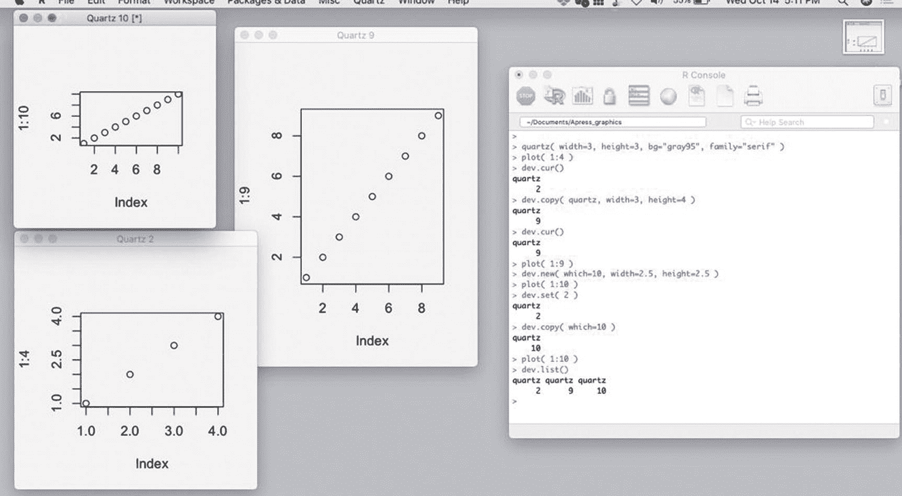
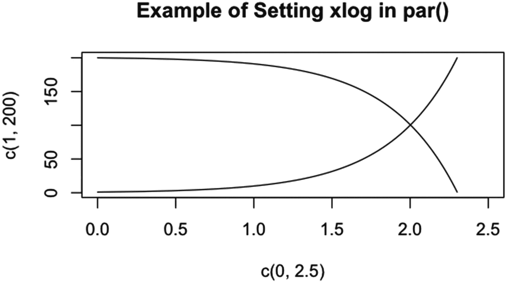
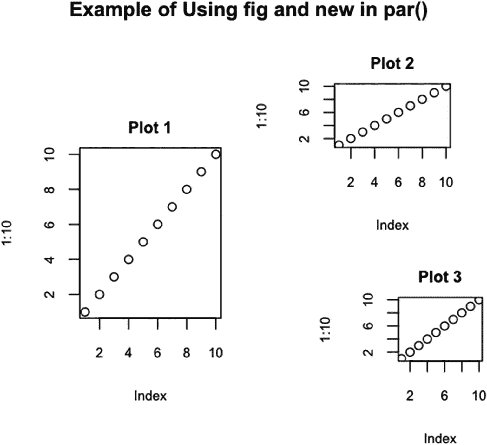
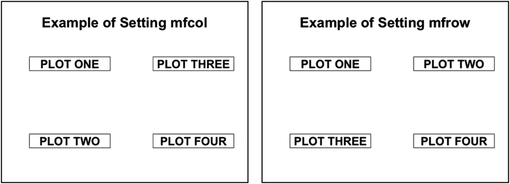
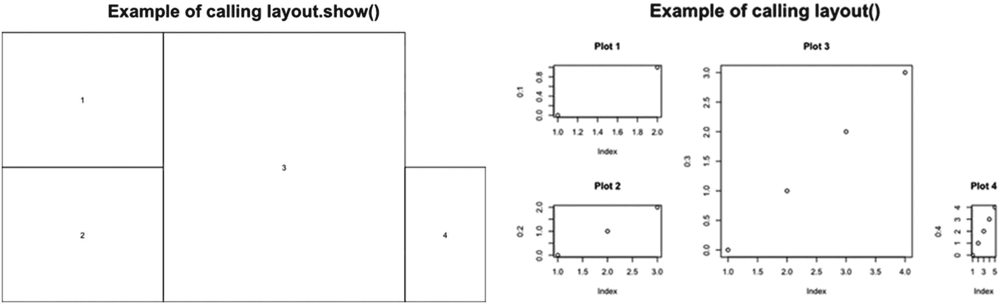
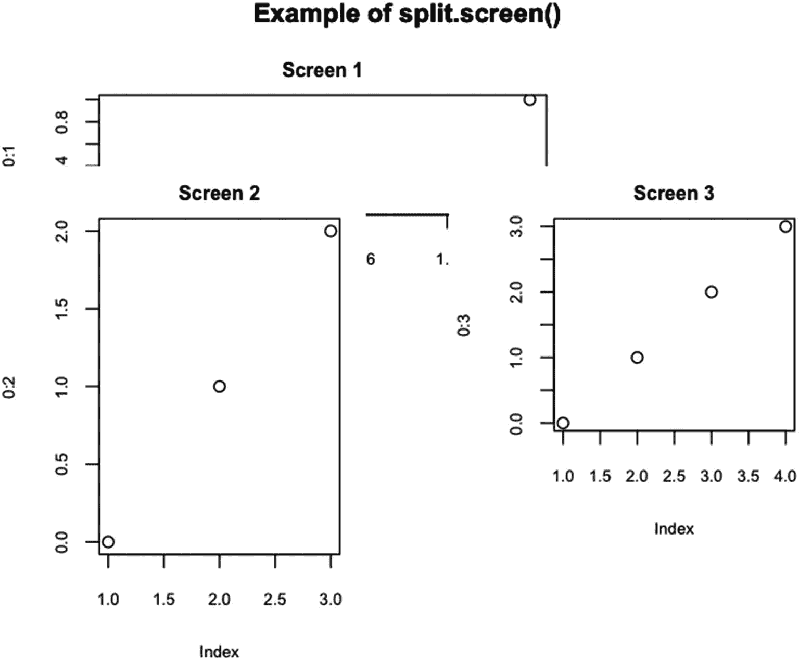

# 六、图形设备和布局图

在 R 中，绘图是在图形设备上绘制的。假设选择了图形设备，可以在该设备上绘制具有多个绘图的图形。在这一章中，我们列出了图形设备，并给出了一些与设备一起工作的函数。然后，我们给出几种方法来设置图形设备，通过使用 par()、layout()或 split.screen()在一个图形中绘制多个图。前面章节中没有涉及的 par()的任何参数都包括在内，其中大部分都与设备区域、图形区域、绘图区域、边距和多个绘图布局有关。

## 6.1 图形设备和使用图形设备

r 中有几种可用的图形设备，有些是依赖于操作系统的。有些以标准打印格式创建文件。有些是 RStudio 内部的。例如，一些可用的设备是 Microsoft Windows 的标准设备、创建 pdf 文件的设备以及 Apple MacBook 上的默认 RStudio 设备。在第 6.1.1 节中，描述了 R 中目前可用的各种设备。第 6.1.2 节给出了使用设备的方法。

### 图形设备

图形设备指定创建打印的位置。一些图形设备在计算机的屏幕上打开，而其他的打开一个文件(或多个文件),当设备关闭时，该文件被写入一个位置。该位置可以是 URL、计算机上的文件夹、管道、套接字或打印机。

默认图形设备是在调用绘图功能时打开的图形设备，但图形设备尚未专门打开。当在 R 控制台输入`options("device")`时，默认设备由返回值给出。(在我电脑上的 RStudio 中，图形设备是`"RStudioGD"`，设备在 RStudio 的右下窗口打开一个地块。)

到图形设备的链接，除了默认的，都列在设备的帮助页面上。列出了打开图形设备的 14 个函数的链接。一些链接包括一个以上的功能。一些图形设备依赖于操作系统。其他依赖于 Ghostscript 网站(pdf 文件和 PostScript 语言的解释器)的存在或对 X Window 系统服务器的访问。其他一些要求 R 已经用 cairo(图形程序库)或 X Window System (X11)支持编译。

依赖于操作系统的函数是 windows()(也称为 win.graph()、win.metafile()和 win.print())，用于 MS Windows 系统；quartz()(和 quartz.save())，用于当前的 OS X 系统；x11()(或 X11())，用于使用 X Window 系统图形的系统(包括 MS Windows 和类似 UNIX 的系统，例如 UNIX、LINUX 和早期的 OS X 系统)。函数 windows()、X11()和 quartz()在计算机屏幕上打开图形设备窗口。

应该在任何系统上运行并创建外部文件的函数有 pdf()，用于可移植文档格式文件，以及 postscript()，用于 PostScript 文件。此外，函数 xfig()以 Xfig 使用的格式创建文件，pictex()创建 TeX/PicTeX 文件。函数 bitmap()(也叫 dev2bitmap())使用 Ghostscript 接口并创建 bmp 文件。

如果 R 已经用 cairo 编译过运行的函数有 cairo.pdf()，对于 pdf 文件；cairo.ps()，用于 PostScript 文件；和 svg()，用于可缩放的矢量图形文件。我的 R 版本——2020 年中期加载时的最新默认版本——不运行 cairo 函数。

位图文件的 bmp()函数、联合图像专家组文件的 jpeg()函数、可移植网络图形文件的 png()函数和标记图像文件的 tiff()函数运行在支持 cairo、X11 或 Quartz 的系统上，这些系统是大多数系统。默认情况下，该函数首先检查 cairo 是否可用。如果没有，该函数将检查 X11。如果 X11 不可用，该函数将检查石英窗口是否可用。使用哪个选项可以在函数调用中设置。我的 R 版本运行四个函数。

### 使用图形设备

在本节中，我们将介绍如何使用图形设备，包括默认的绘图设备。大多数管理图形设备并与之交互的功能都是从 *dev 开始的。*，以及以 *dev 开头的函数。*所有影响图形设备。影响图形设备的另一个函数是 graphics.off()。

在 RStudio 中，默认图形设备在绘图窗口中打开一个绘图(在右下窗口的绘图选项卡下)。给定一个已经打开的图，对于如何处理该图有许多选项。

可以通过拖动窗口的左侧和/或顶部手柄来调整窗口的大小。(当悬停在左侧或顶侧的中心时，手柄显示为双箭头。如果窗口没有扩展到最大高度，箭头只会出现在顶部。)

通过选择图上方的*缩放*选项卡，可将窗口缩放至屏幕上的独立窗口。然后可以通过拖动手柄来调整绘图的大小。(如果窗口最大化到全屏，手柄不会出现。否则，会出现顶部、底部、左侧、右侧和角部手柄。)

该图可以导出到图像文件中。要导出到图像文件，在绘图窗口中选择绘图上方的*导出*选项卡，然后选择*另存为图像…* 。在打开的窗口中，选择*更新预览*查看绘图。

给出了改变绘图大小的选择。如果宽度和/或高度改变，通过选择*更新预览*更新绘图。(否则，窗口会关闭。)图像文件的格式有六种选择:PNG、JPEG、TIFF、BMP、SVG 和 EPS。保存文件时，文件扩展名会自动添加到文件名中。

要导出为 pdf 文件，选择*导出*选项卡，然后选择*另存为 PDF …* 。pdf 格式的选择包括方向(纵向或横向)和大小(英寸)。尺寸选项包括*美国字母*、*美国法定*和 *A4* 。要预览生成的 pdf，选择*预览*。选择*保存*按钮保存绘图。文件扩展名 pdf 会自动添加到文件名中。

要将绘图复制到剪贴板，选择导出，然后选择*复制到剪贴板*。选项与*另存为图像…* 相同，只是没有指定文件名。复制的图像是 tiff 格式的。

右键单击该图，可以保存或复制该图。扩展名必须手动添加，可以是 bmp、jpeg、png 或 tiff。

如果生成了多个图，使用*缩放*选项卡左侧的箭头在图中向前或向后移动。通过选择*导出*选项卡右侧红色圆圈中的白色十字，可以从绘图窗格中移除一个绘图。要清除所有打开的地块，请选择红色圆圈中白色十字右侧的小扫帚。

在 RStudio 程序的顶部菜单中，有一个选项卡*绘制*。在*图*选项卡下的选择与图窗格中的选择相同。

在我的 MacBook Air 上的 R 中，默认情况下，绘图在石英窗口中打开。要将图保存到文件中，可以在创建图后运行 quartz.save()函数。分配给文件的名称必须在 quartz.save()中设置。在 windows()的帮助页面中，函数 win.metafile()和 win.print()与 quartz.save()相似，只是这些函数适用于 MS Windows 操作系统。

打开的设备被分配名称，并按顺序编号(在我的设备上，编号 3-8 被跳过)。编号为 1 的设备是空设备，未被使用。开放设备的编号从 2 开始，最大可达 63。设备通过编号来引用。

函数的作用是:返回当前设备的名称和编号。函数的作用是:列出所有打开的设备的名称和数量。

dev.next()和 dev.prev()函数返回下一个或上一个设备的名称和编号。这两个函数有一个参数，它是从哪个设备开始查找下一个或上一个设备的编号。(参数的默认值是 dev.cur()。)设备周期数，不包括设备 1。如果没有打开的设备，dev.next()和 dev.prev()分别返回*空设备*和 *1* 。

函数告诉 R 哪个设备是当前设备。该函数有一个参数，用于将设备的编号设置为当前值。其默认值是 dev.next()。

函数的作用是:关闭一个设备。该函数有一个参数，表示要关闭的设备的编号。默认值是 dev.cur()，即当前设备。函数的作用是:关闭所有打开的设备。

函数的作用是:打开一个新的设备。该函数采用一个指定的参数加上几个未指定的绘图参数，这些参数将应用于打开的设备。一个指定的参数是 noRStudioGD，用于在 RStudioGD 是默认设备的情况下是否使用设备 RStudioGD。(默认设备是`getOption("device")`的值。)noRStudioGD 的默认值为 FALSE，即如果 RStudioGD 是默认设备，则使用 RStudioGD。

函数的作用是:将当前设备的设置和内容复制到一个新的设备上。复制后，如果更改了绘图，大多数设置不会受到影响。虽然复制了原始设备的大部分参数，但宽度和高度没有复制。

该函数有两个指定的参数——device 和 which——但只接受其中一个，而不是两个。参数设备采用绘图函数的名称。只需输入函数的名称。函数的参数按名称添加，并以逗号与其他参数和 device 值分隔开。

接受长度为 1 的数字向量的自变量。参数的值是一个设备号。当前设备的内容被复制到由。设备必须在复制完成前打开，并且设备不能复制到自身。

除了两个可能的指定参数之外，如果已经设置了 device，还可以设置由 device 设置的函数的参数。如果设置了，则可以设置正在复制的设备的参数。复制设备后，设置和内容复制到的设备将成为当前设备。

dev.copy2pdf()和 dev.copy2eps()函数将设备的内容复制到 pdf、Quartz、cairo 或 PostScript 文件中。有关更多信息，请参见 dev.copy()的帮助页面。

dev.print()函数将图形设备的内容复制到打印机，默认为 PostScript 格式。文件被发送到与运行 R 的计算机相连的默认打印机。有关更多信息，请参见 dev.copy()的帮助页面。

如果内存是一个问题，并且绘图从不调整大小，那么运行`dev.control(displaylist="inhibit")`使用较少的内存。有关更多信息，请参见 dev.copy()的帮助页面。

图 [6-1](#Fig1) 中给出了一个使用 quartz()、dev.cur()、dev.copy()、dev.set()和 dev.list()的例子。请注意，设备的编号在图上方的标题中。



图 6-1

R 的控制台截图，带有使用 dev.cur()、dev.copy()、dev.new()、dev.set()和 dev.list()的示例

dev.capabilities()、dev.interactive()和 dev.size()函数查询当前图形设备。dev.capabilities()函数返回设备的功能，其行为类似于函数 options()。dev.interactive()函数返回设备是否交互。dev.size()函数以英寸为单位返回设备的大小。

有五种设备功能:transparentBackground(值为“否”、“完全”和“半”)、rasterImage(值为“否”、“是”和“非图像”)、capture(逻辑，如果图形设备可以捕获光栅图像，则为 TRUE)、locator(逻辑，如果支持 locator()和 identify()函数，则为 TRUE)和 events(可能值为“MouseDown”、“MouseMove”、“MouseUp”和“Keybd”)。)

orNone 参数(取值 TRUE 和 FALSE)由 dev.interactive()使用。如果设置为真，该函数还检查`getOption("device")`的值是否是交互式的。可以在 dev.size()中设置单位参数(可能的值为“in”、“cm”和“px”，分别表示英寸、厘米和像素)。

dev.capture()函数从图形设备的内容中创建一个光栅图像。并非所有图形设备都支持光栅图像的创建；如果不是，当 dev.capture()运行时，图形设备返回 NULL。

该函数采用一个参数 native。该参数采用长度为 1 的逻辑向量。如果设置为 FALSE，则返回颜色值矩阵。如果设置为 TRUE，则返回 nativeRaster 类的对象。

如果图形设备有一个保持级别堆栈，可以使用函数 dev.hold()和 dev.flush()。该函数有一个参数 level，它应该是一个非负整数。有关更多信息，请参见 dev.hold()的帮助页面。

## 6.2 par()、layout()和 split.screen()函数

par()函数设置绘图参数。par()的帮助页面上列出了 72 个参数。第 [3](03.html) 章已经介绍了大部分参数。本节介绍的是只能在 par()中设置的参数，只能查询的参数，以及在 par()中与在 `plot()`函数中具有不同效果的参数。

par()函数、layout()函数和 split.screen()函数的一些参数允许在图形页面上绘制多个图。第 6.2.1 节介绍了 par()的参数，这些参数在 par()中设置时表现不同，或者在第 [3](03.html) 章中没有涉及。第 6.2.2 节介绍了功能布局()。第 6.2.3 节描述了 split.screen()函数。

### par()函数

plot()和其他绘图函数使用的许多参数都从 par()的参数中获取默认值。通过使用 par()，可以为整个绘图会话设置参数，而不是在每个绘图的调用中设置参数。

par()中的参数可以通过在对 par()的调用中的括号内输入用引号括起来的参数名称来查询，参数名称之间用逗号分隔。例如，运行`par( "bg", "fg" )`会返回`$bg [1] "white"`和`$fg [1] "black"`。如果不带参数调用 par()，将返回所有 72 个参数以及参数的值。

要在 par()中设置参数，请将参数设置为与要设置的值相等，用逗号分隔。例如，`par( lwd=2, lty="dotted" )`将线宽设置为 2，将线型设置为虚线。

图形设备分为三个部分:设备、设备中的图形和图形中的绘图。可以设置设备边缘和图形之间的边距大小。每个图形都有环绕图形的边距。可以设置图周围的边距大小。

本节分为五小节。这些子部分涵盖了设备区域、图形区域、绘图区域、字符属性和页面上的多个绘图。

#### 6.2.1.1 设备区域

查询或设置控制图形设备区域的值的 par()的参数是 din、oma、omi、omd 和 bg。din 参数是一个只能查询而不能设置的参数。该参数以英寸为单位给出了图形设备的宽度和高度。

oma、omi 和 omd 参数只能在 par()中设置，它们使用三种不同类型的单位来设置外部边距的大小。oma 参数接受一个长度为 4 的数字向量，并以行宽度给出边距的大小。这四个值分别用于下边距、左边距、上边距和右边距。oma 的默认值是`c(0,0,0,0)`，即没有外边距。

omi 参数类似于 oma，只是单位是英寸。omi 的默认值也是`c(0,0,0,0)`。

omd 参数以标准化设备坐标(NDC)单位设置设备区域的内角。该参数采用一个四元素数值向量，其中的值介于 0 和 1 之间，包括 0 和 1。

第一个数字是图形设备左侧和图形区域左侧之间的距离，以图形设备底部的比例(即，在标准化设备坐标中)来测量。第二个数字是从图形设备左侧到图形区域右侧的距离，以标准化设备坐标测量。

第三个数字是从图形设备底部到图形区域底部的距离，用标准化设备坐标测量。第四个数字是从图形设备底部到图形区域顶部的距离，以标准化设备坐标度量。omd 的默认值是`c(0,1,0,1), that is, no margins`。

bg 参数给出了图形设备的背景颜色。颜色覆盖整个设备。(参数在 par()中的行为不同于在创建绘图的函数中的行为。)根据 par()的帮助页面，如果在 par 中设置了 bg，那么新的自变量被设置为 FALSE(参见 6.2.1.5 节的最后一部分)。bg 的默认值是“透明”或“白色”(更多信息请参见 par()的帮助页)。

#### 6.2.1.2 图形区域

在外部边界的内部界限内可以有一个或多个图形。在这一节中，我们只讨论一个图形的情况。6.2.1.5 一节涵盖了多个数字。

图形区域是一个区域，在该区域中绘制了图形，通常还绘制了图形的注释。在图形区域内，绘图区域周围通常有一个边距(位于外部图形界限和绘图区域之间)。默认情况下，打印注释位于图形边距内。

影响图形区域和图形区域边距的参数有 fig、fin、mar 和 mai。参数只能在 par()中设置。

fig 参数给出了绘图区域的左侧、右侧、底部和顶部相对于标准化图形区域坐标(参照图形区域的外侧)的位置。该参数采用四元素数值向量，值介于 0 和 1 之间，包括 0 和 1。对于单个图，fig 的默认值为`c(0,1,0,1)`。

fin 参数以英寸为单位给出图形区域的大小。该参数采用两个元素的数值向量。第一个值给出图形区域的宽度，第二个值给出高度。对于单个图，fin 的默认值是 din 的值。

mar 参数给出了以线宽度量的图形边距的大小。该参数采用一个四元素的数值向量，给出了下、左、上、右边距的大小。mar 的默认值为`c(5.1, 4.1, 4.1, 2.1)`。

mai 参数给出了以英寸为单位的数字边距的大小——底部、左侧、顶部和右侧。mai 的默认值为`c(1.02, 0.82, 0.82, 0.42)`。

#### 6.2.1.3 绘图区

绘图区域包含绘图。影响绘图区域和绘图的参数有 pty、plt、usr、pin、xlog、ylog、ylbias 和 fg。除了 fg 之外的都只能在 par()中设置。

pty 参数给出了要使用的绘图区域形状的类型。该参数采用一个单元素字符向量。可能的值是“m”和“s”。值“m”告诉 R 在图形区域的边界内最大化绘图。值“s”告诉 R 使用正方形绘图区域。pty 的默认值是“m”。

plt 参数以标准化设备坐标(x1、x2、y1 和 y2)给出绘图区域的左侧、右侧、底部和顶部的位置，以图形区域为参考。该参数采用长度为 4 的数值向量，值介于 0 和 1 之间，包括 0 和 1。对于单个图，plt 的默认值取决于图的纵横比。

usr 参数以绘图单位(用户单位)给出绘图区域的左侧、右侧、底部和顶部的位置。例如，如果图的 x 轴从 0 到 10，y 轴从 0 到 5，在默认条件下，usr 的值将是`c( -0.4, 10.4, -0.2, 5.2 )`。

要获得图限，将 0.04 乘以 10，然后从 x 下限中减去，再加到 x 上限中，同时从 y 下限中减去 0.04 乘以 5，再加到 y 上限中。(更多信息参见第 3.4.5 节中对 xaxs 和 yaxs 的描述。)在给定数据和轴限制的情况下，usr 的值是恒定的，也就是说，usr 不取决于图形的纵横比或大小。

pin 参数以英寸为单位给出绘图区域的大小。该参数采用两个元素的正数值向量，给出宽度和高度。pin 的默认值取决于图形区域和边距的大小。par( "pin" )[1]的值加上 par( "mai" )[ c( 2，4 ) ]的和得到 par( "fin" )[1]。同样，par( "pin" )[2]加到 par( "mai" )[ c( 1，3 ) ]的和上，得到 par( "fin" )[2]。

xlog 和 ylog 参数用于将 x 轴和 y 轴设置为对数刻度，而不是线性刻度。(对数标度是以 10 为基数，而不是以 *e* 为基数。)如果设置为 TRUE，默认情况下，不创建新图的所有函数都使用各自的对数刻度。但是，如果调用新的绘图，xlog 的值将设置为 FALSE。xlog 和 ylog 的默认值是 FALSE。在清单 [6-1](#PC1) 中，给出了使用 xlog 的示例代码。

```r
> par( xlog=TRUE )
> par( "xlog" )
[1] TRUE
> plot( c( 0, 2.5 ), c( 1, 200 ), type="n" )
> par( "xlog" )
[1] FALSE
> par( xlog=TRUE )
> lines( 1:200, 1:200 )
> lines( 1:200, 200:1 )
> title( main="Example of Setting xlog in par()")

Listing 6-1An example of changing xlog to TRUE in par()

```

在图 [6-2](#Fig2) 中，给出了清单 [6-1](#PC1) 中代码的结果。



图 6-2

在 par()中设置 xlog 的示例

ylbias 参数给出了通过 axis()或 mtext()输入的文本的偏移量。对于底部和顶部的文本，ylbias 的较小值绘制在较大值绘制的下方。对于左侧和右侧的文本，ylbias 的较小值绘制在较大值绘制位置的右侧。ylbias 的默认值为 0.2。

如果在 par()中设置 fg 参数，并且如果在 par()中未设置 col，则 fg 参数给出刻度线、轴、点、线和文本的颜色。(如果 fg 和 col 都在 par()中设置，则刻度线是 fg 给定的颜色，轴、点、线和文本是 col 给定的颜色。)该参数采用颜色值的单元素向量(有关颜色值的信息，请参见第 3.4.1 节)。fg 的默认值通常是“黑色”，这取决于打开的设备的种类。

#### 6.2.1.4 文本和线宽参数

本节中的参数与字符的大小和字符所在行的高度有关。本节包含七个参数:cra，表示栅格中的字符大小；cin，表示字符大小，单位为英寸；csi，为字符的高度，单位为英寸；cxy，为用户坐标中的字符大小；mex，表示页边距中从线宽到英寸的转换级别；lheight，为多行文本使用的行高；和 ps，表示文本的磅值。只能查询而不能设置 cra、cin、csi 和 cxy 参数。mex、lheight 和 ps 参数只能在 par()中设置。

cra、cin 和 cxy 参数的值是两个元素的数值向量。第一个元素给出字符的宽度，分别以栅格、英寸和用户坐标为单位，第二个元素给出高度。csi 参数是一个单元素数值向量。csi 的值给出了以英寸为单位的字符高度。

栅格是用颜色填充的正方形。图形图像由栅格组成。根据 par()的帮助页面，如果像素对设备有意义，R 栅格中的像素就是像素。否则，栅格通常为 1/72 英寸。

在我的设备上，cra 的值是`c( 10.8, 14.4 )`，cin 的值是`c( 0.15, 0.20 )`，csi 的值是`c( 0.2 )`。cxy 的值取决于图形的长宽比和大小。

mex 参数采用单元素数值向量。该值是绘图页边空白中的线宽从缺省值“无调整”扩展的量。该参数不影响轴标签和轴刻度标签的大小，但会影响刻度的长度。如果线宽增加，R 将缩小绘图以适应更大的边距。mex 的默认值是 1。

lheight 参数采用一个单元素数值向量。该值是 text()生成的文本的行高(根据 par()的帮助页面，由 strheight()测量)。lheight 的默认值是 1。该参数仅在调用 plot()和调用 text()之间设置时有效。

ps 参数以栅格形式给出轴标签、轴刻度标签和标题中文本的磅值，以及函数 text()生成的文本。对于点，绘图字符的大小不受影响。ps 的默认值是 12。

#### 6.2.1.5 使用 par()生成多个地块

par()函数可用于设置图形设备来绘制多个图。使用 mfcol 或 mfrow 参数设置包含绘图的网格。每个图都绘制在网格的一个正方形中。

在查看 par()中的相关参数之前，先讨论一下 plot.new()。创建独立图的函数，如 plot()或 curve()，有时会调用函数 plot.new()。函数 plot.new()关闭前一个图并打开一个新图。该函数不接受任何参数。当处理多个图时，使用 plot.new()有时是有意义的。例如，通过设置 mfcol 或 mfrow 生成多个绘图时，调用 plot.new()而不添加绘图将跳过绘图网格的一个块。

多个图的参数如图所示(来自第 6.2.1.2 节)；mfcol，表示图网格中的行数和列数，其中图首先沿列向下绘制；mfrow，与 mfcol 相同，不同之处在于图首先跨行绘制；mfg，当设置了 mfcol 或 mfrow 时，表示上一个图的绘制位置或下一个图的绘制位置；page，用于在下次调用 plot.new()时是否绘制新页面；询问，在打开新页面时是否暂停，并在进入下一页之前询问响应；和新，用于是打开新地块还是过度绘制现有地块。参数页只能查询，不能设置。其他参数只能在 par()中设置。

fig 参数可用于在图形设备上绘制多个图。Setting fig 是一个四元素向量，它以规范化的设备坐标给出图形在图形设备上的位置，将图形放在图形设备上的有限位置。通过用一个新的位置调用 par()，并在 par()中将 new 设置为 TRUE(参见 6.2.1.5 一节的最后一部分)，可以绘制更多的图形。在清单 [6-2](#PC2) 中，给出了在图形设备上绘制三个图形的示例代码。

```r
par(
  ps=9,
  mar=c( 4, 4, 2, 1 ),
  oma=c( 0, 0, 2, 0 )
)

par(
  fig=c( 0.1, 0.49, 0.1, 0.8 )
)

plot(
  1:10,
  main="Plot 1"
)

par(
  fig=c( 0.5, 0.85, 0.5, 0.95 ),
  new=TRUE
)

plot(
  1:10,
  main="Plot 2"
)

par(
  fig=c( 0.6, 0.9, 0.0, 0.45 ),
  new=TRUE
)

plot(
  1:10,
  main="Plot 3"
)

mtext(
  "Example of Using fig and new in par()",
  outer=TRUE,
  cex=1.5,
  font=2
)

Listing 6-2Code for an example of plotting three figures on a graphics device using fig and new in par()

```

在图 [6-3](#Fig3) 中，运行清单 [6-2](#PC2) 中的代码。



图 6-3

使用 fig 和 new in par()在页面上放置多个图的示例

请注意，在本例中，磅值已减少到 9，并且下边距已减少到 4 行宽，左边距减少到 4 行宽，上边距减少到 2 行宽，右边距减少到 1 行宽。以上述方式绘制多个图形时，图形可能会重叠。

mfcol 和 mfrow 参数采用两个元素的整数向量，第一个元素设置为等于绘图网格中的行数，第二个元素设置为等于列数。两者只设置一个。mfcol 和 mfrow 的默认值都是`c(1, 1)`。

在清单 [6-3](#PC3) 中，给出了图 [6-4](#Fig4) 中设置 mfcol 和 mfrow 的示例代码。



图 6-4

在 par()中设置 mfcol 和 mfrow 的示例

```r
plotter = function( words ) {
  plot(
    c( 0, 1 ),
    c( 0, 1 ),
    type="n",
    ann=FALSE,
    axes=FALSE,
    frame=TRUE
   )

   text(
     0.5,
     0.5,
     words,
     cex=2,
     font=2
   )
}

par(
  oma=c( 0, 0, 4, 0 ),
  mfcol=c( 2, 2 )
)

plotter(
  "PLOT ONE"
)
plotter(
  "PLOT TWO"
)
plotter(
  "PLOT THREE"
)
plotter(
  "PLOT FOUR"
)

mtext(
  "Example of Setting mfcol",
  outer=TRUE,
  font=2,    cex=2
)

box(
  which="outer",
  lwd=4
)

par(
  mfrow=c( 2, 2 )
)

plotter(
  "PLOT ONE"
)
plotter(
  "PLOT TWO"
)
plotter(
  "PLOT THREE"
)
plotter(
  "PLOT FOUR"
)

mtext(
  "Example of Setting mfrow",
  outer=TRUE,
  font=2,
  cex=2
)

box(
  which="outer",
  lwd=4
)

Listing 6-3Code for the examples of setting mfcol and mfrow

```

在图 [6-4](#Fig4) 中，显示了清单 [6-3](#PC3) 中的代码生成的两个图。

mfg 参数采用两个或四个元素的整数向量。如果查询(`par( "mfg" )`)，则返回最后绘制的绘图的行和列，以及绘图网格中的行数和列数。如果设置，则设置下一个图的行和列。两个数字都必须包括在内。可选地，可以包括绘图网格中的行数和列数。例如，对于设置为等于`c( 3, 2 )`的 mfrow，要将下一个图输入到网格的第 2 行第 1 列，mfg 将在对 par()的调用中设置为`c( 2, 1 )`或`c( 2, 1, 3, 2`。

该参数仅影响在绘制了网格中的第一个图之后绘制的图的位置，无论 mfg 的值是多少，它总是被放置在矩阵的第一个单元中。如果矩阵的最后一个单元格中没有最后一个图，则在绘制新的图时不会打开新的页面。相反，R 按照从使用的最后一个单元到矩阵中的最后一个单元的顺序超量绘制单元。mfg 的默认值是`c(1, 1, 1, 1)`。

页面参数是长度为 1 的逻辑向量。如果该值为 FALSE，则下一次调用 plot.new()不会打开新的绘图。如果该值为 TRUE，则在下次调用 plot.new()时会打开一个新的绘图。如前所述，只能查询页面。

ask 参数采用长度为 1 的逻辑向量。如果设置为 TRUE，当打印新页面时，R 要求在继续之前继续下一页。如果设置为 FALSE，R 不会询问。根据 par()的帮助页面，参数 ask 已被弃用，应由 devAskNewPage()函数替换。ask 的默认值为 FALSE。

新参数采用长度为 1 的逻辑向量。如果设置为 TRUE，当发生对 plot.new()的新调用时，R 不会转到新页面。如果设置为 FALSE，调用 plot.new()将重置页面。new 的默认值为 FALSE。

### 6 . 2 . 2 layout()、layout.show()和 lcm()函数

layout()函数提供了另一种创建包含多个图的页面的方法。这些图被放置在由具有网格尺寸的矩阵建立的网格中。与使用 mfcol 和 mfrow 的主要区别在于，一个图可以分布在矩阵的多个单元上。

在调用 layout()之后，可以使用 layout.show()函数来显示单元格的结构。lcm()函数可以在 layout()中使用，以厘米为单位给出单元格的绝对尺寸。

layout()函数有四个参数。自变量是 mat，对于包含网格的矩阵；宽度，用于列的宽度；高度，为行的高度；并尊重水平和垂直刻度是否相关或如何相关。

mat 参数采用一个整数矩阵，其结构与绘图网格的结构相同。如果网格中要绘制 n 个图，则单元格必须包含从 1 到 n 的所有整数。

矩阵的单元格中也可以包含 0，因为单元格中没有绘制任何图。此外，多个单元格可以包含相同的数字。如果单元格是相邻的，则绘图会扩展以填充单元格。mat 没有默认值。

widths 参数给出了单元格的宽度，并接受一个长度等于 matrix mat 中列数的数值向量。除非在设置宽度值时使用 lcm()，否则宽度与图形设备的大小相关。宽度的默认值是`rep.int(1, ncol(mat))`。

heights 参数类似于 widths，但它给出的是单元格的高度值，而不是宽度值。高度的默认值为`rep.int(1, nrow(mat))`。

“尊重”参数用于限制网格在水平和垂直方向的缩放。该参数可以采用单元素逻辑向量，也可以采用与 mat 大小相同且包含 0 和 1 的矩阵。

如果“尊重”设置为 FALSE，水平方向的单位不一定与垂直方向的单位具有相同的比例。如果设置为 TRUE，单位的缩放比例相同。

如果将“尊重”设置为矩阵，并将某行设置为 0，则在缩放绘图时，该行可以自由缩放。如果行包含 1，则行的小数位数和列的小数位数之间的关系是固定的。在列中设置全 0 的行为与在行中的行为相同，只是允许列自由缩放。尊重的默认值是假的。

layout.show()函数有一个参数 n——表示布局中要显示轮廓的单元格数量。该参数采用单元素整数向量，可以是 1 到绘图数之间的任何值，包括 1 和绘图数。n 的默认值为 1，即显示包含第一个图的单元格的轮廓。

lcm()函数有一个参数 x——表示要转换为厘米的值。该参数采用一个以厘米为单位的数值向量。该函数返回一个包含长度和字母“cm”的字符向量。比如运行`lcm( c( 1, 1.5, 0.5 ) )`给出`[1] "1 cm" "1.5 cm" "0.5 cm"`。x 没有默认值。

在清单 [6-4](#PC4) 中，给出了图 [6-5](#Fig5) 中使用函数 layout()和 layout.show()的示例代码。



图 6-5

调用 layout()和 layout.show()的示例。参数 mat、widths、heights 和 respect 在 layout()中设置

```r
par( oma=c( 0, 0, 4, 0 ) )

layout(
  matrix(
    c(
      1, 3, 0,
      2, 3, 4
    ),
    2,
    3,
    byrow=TRUE
  ),
  width=c( 1, 1.5, 0.5 ),
  height=c( 1, 1 ),
  respect=FALSE
)

layout.show(
  4
)

mtext(
  "Example of calling layout.show()",
  cex=1.5,
  font=2,
  line=1.5,
  outer=TRUE
)

plot(
  0:1,
  main="Plot 1"
)
plot(
  0:2,
  main="Plot 2"
)
plot(
  0:3,
  main="Plot 3"
)
plot(
  0:4,
  main="Plot 4"
)

mtext(
  "Example of calling layout()",
  cex=1.5,
  font=2,
  line=0.8,
  outer=TRUE
)

Listing 6-4The code for the example in Figure 6-5 of using the functions layout() and layout.show()

```

图 [6-5](#Fig5) 中给出了调用 layout()和 layout.show()的例子。

注意，绘制了四个图。网格矩阵有两行和三列。mat 的第二列中的数字都是 3，所以第三个图跨越了两行。第一行和第三列中的数字为 0，因此在与第一行和第三列相关的单元格中不会绘制任何图。两行的高度相同，但列的宽度不同。

### 6 . 2 . 3 split . screen()、screen()、erase.screen()和 close.screen()函数

split.screen()函数查询图形设备或屏幕，或者将图形设备或屏幕分割成屏幕(区域和子区域)。就绘图而言，每个后续屏幕都是单独处理的。如果在 split.screen()运行之前没有打开图形设备，split.screen()将打开 R 或 RStudio 的默认图形设备。

在 split.screen()设置屏幕后，screen()、erase.screen()和 close.screen()函数与屏幕一起工作。函数的作用是:设置或返回当前屏幕，也就是完成绘图的屏幕。函数的作用是:删除屏幕上的内容。函数的作用是:关闭屏幕。关闭屏幕后，不能再对屏幕内容进行任何更改。关闭所有屏幕后，split.screen()会话结束。

根据 split.screen()的帮助页，该函数不能与 par()或 layout()中的 mfcol 或 mfrow 一起使用。但是，par()的大多数参数都是可以设置的。(使用不同于默认值的 par()值设计图形时，每次运行 split.plot()时都运行 par()有助于减少该过程的挫折。)

如果不带参数运行，函数 split.screen()返回所有打开的屏幕的编号，如果没有打开的屏幕，则返回 FALSE。如果带参数运行，该函数将为屏幕设置和分配编号名称。

该函数有三个参数。论据是无花果，为分割屏幕的方式；屏幕，为哪个屏幕拆分；和擦除，用于是否擦除由自变量屏幕选择的屏幕。

figs 参数采用两元素数值向量或四列数值矩阵。如果 figs 是一个向量，这两个元素给出了绘图网格的行数和列数。如果 figs 是一个矩阵，那么对于矩阵中的每一行，四个元素按照给定的顺序给出了屏幕左侧和右侧(在 x 轴上)以及屏幕底部和顶部(在 y 轴上)的位置。图没有默认值。

如果将 figs 设置为矩阵，则矩阵的值采用标准化设备坐标单位(取 0 和 1 之间的值，包括 0 和 1)。)单位是相对于所选屏幕测量的。每个屏幕有一行。屏幕可以重叠。

由 screen 参数指定的数字是要拆分的屏幕的编号。如果没有设置屏幕，则图形设备被拆分。

该参数采用一个元素的整数向量。对于 split.screen()的第一次调用，screen 参数没有设置为值(或者 screen 可以设置为 0)。第一次调用后，该号码必须在已分配给屏幕的号码范围内，默认值是当前屏幕的号码。

erase 参数采用单元素逻辑向量。如果设置为 TRUE，当屏幕打开时，屏幕内容将被删除。如果为 FALSE，则不会删除内容。erase 的默认值为 TRUE。

(根据 split.screen()、screen()和 erase.screen()中 split.screen()的帮助页面，擦除内容包括将屏幕设置为 par()中 bg 值给定的颜色，默认情况下通常是“透明的”。在 bg 的默认值为“透明”的情况下，如果 bg 没有被手动设置为除“透明”之外的颜色，则屏幕内容保持可见。)

screen()函数查询或设置当前屏幕(绘图函数创建绘图的屏幕)。如果不带参数运行，该函数将返回当前屏幕的编号。如果新屏幕被设置为当前屏幕，则返回该屏幕的编号。如果没有打开的屏幕，screen()返回 FALSE。

该函数有两个参数。参数为 n，表示要设置为当前屏幕的屏幕编号，以及 new–表示在将屏幕设置为当前屏幕时是否清除屏幕内容。

n 参数接受一个一元正整数向量。该值必须是打开屏幕的编号；否则，会出现错误。n 的默认值是当前屏幕的编号。

新参数采用单元素逻辑向量。如果设置为 TRUE，当某个屏幕被设置为当前屏幕时，该屏幕的内容将被删除(请参阅前面的文本)。如果设置为 FALSE，则内容被过量绘制。new 的默认值为 TRUE。

erase.screen()函数告诉 R 删除屏幕上的内容(参见前面的内容)。该函数采用一个参数 n——要擦除的屏幕编号。

n 参数接受一个一元非负整数向量。如果在 erase.screen()中设置了 n，则该值必须是打开屏幕的编号或为 0。如果有打开的屏幕，并且 erase.screen()在没有参数的情况下运行，该函数将擦除当前屏幕。运行 erase.screen()并将 n 设置为 0 会擦除所有屏幕(如果有任何屏幕是打开的)。如果没有打开的屏幕，erase.screen()返回 FALSE。n 的默认值是当前屏幕的编号。

函数的作用是:关闭屏幕。如果所有屏幕都单独或一起关闭，split.screen()会话将结束。不带参数调用 close.screen()没有任何效果，但会返回保持打开状态的屏幕数量。如果没有打开的屏幕，close.screen()返回 FALSE。

该函数有两个参数:n 表示要关闭的屏幕数量，all.screens 表示是否关闭所有屏幕。

n 参数接受一个正整数向量，该向量可以是合理的任意长度。向量中的数字可以重复，并且可以包括分配给封闭屏幕的数字。如果包括分配给开放屏幕的号码，则大于最大屏幕号码的号码可以在向量中。n 没有默认值。

all.screens 参数采用长度为 1 的逻辑向量。如果设置为 TRUE，则关闭所有打开的屏幕，split.screen()会话结束。如果为 FALSE，则 n 的值控制关闭哪些屏幕。all.screens 的默认值为 FALSE。

在清单 [6-5](#PC5) 中，针对图 [6-6](#Fig6) 中的示例给出了代码，使用图 1-3 的矩阵形式。



图 6-6

使用 split.screen()设置三个屏幕并绘制到三个屏幕的示例

```r
# A function to do the actual plotting

plotter3 = function(
  id=1:3
){
    for ( i in id ) {

      par( oma=c( 0, 0, 3, 0 ) )

      screen( i )

      plot(
        0:i,
        main=paste( "Screen", i ),
        ylab=paste0( "0:", i )
      )

      mtext(
        "Example of split.screen()",
        outer=TRUE,
        cex=1.6,
        font=2,
        line=0.6
      )
    }
}

# Running par(), split.screen(), and plotter3()

par(
  ps=8,
  mar=c( 4, 4, 2, 1),
  oma=c( 0, 0, 3, 0 ),
  mex=0.9,
  bg="white"
)

split.screen(
  matrix(
    c(
      0.00, 0.70, 0.55, 1.00,
      0.00, 0.45, 0.00, 0.80,
      0.55, 1.00, 0.20, 0.80
    ),
    nr=3,
    nc=4,
    byrow=TRUE
  )
)

plotter3(
)

close.screen(
  all.screens=TRUE
)

Listing 6-5Code for the example in Figure 6-6 of using a matrix for the value of figs in split.screen()

```

在图 [6-6](#Fig6) 中，运行清单 [6-5](#PC5) 中的代码。

请注意，屏幕是随意放置在图形设备周围的。在图中，屏幕 2 和屏幕 3 都与屏幕 1 重叠。函数 par()用于减小磅值、边距宽度和边距中的线宽。此外，在 par()中将背景的颜色设置为白色，并在绘图的顶部添加了一个三线外边距。请注意，每个屏幕都必须设置外部边距。