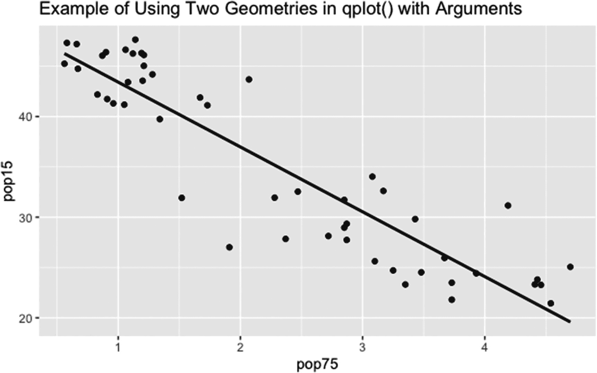
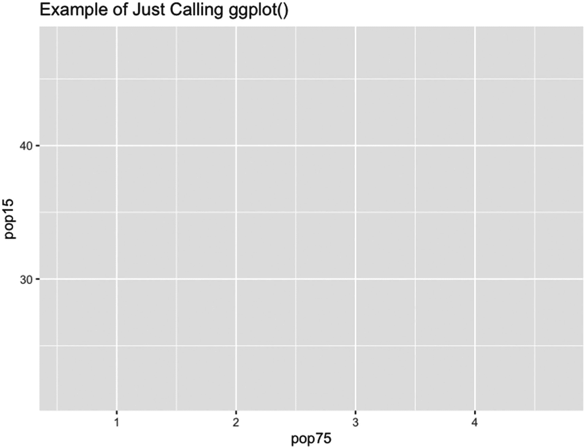

# 七、`ggplot2`包的图形：简介

R 中的 ggplot2 包提供了一种比用 plot()和 plot()的辅助函数生成图形更简单的创建图形的方法。与使用 plot()时默认绘制的图相比，ggplot2 中的函数生成的默认图也具有更复杂的外观。此外，plot()中需要几个步骤的一些任务可以通过 ggplot2 包中可用的函数轻松编码。

ggplot2 中启动绘图的两个函数是 qplot()和 ggplot()。函数 qplot()是 plot()的 ggplot2 版本。该函数是一个独立的函数。gg`plot()`函数使用非传统的 R 语法将*层*添加到 ggplot()。使用加号运算符将创建和格式化图层的函数添加到 ggplot()中。图层生成了地块的内容。

ggplot2 软件包不是 r 中的缺省软件包。必须先安装该软件包，然后才能使用该软件包。这仅执行一次——尽管在更新发生时应该更新包。ggplot2 也不是 r 中默认加载的包。要在会话期间使用该包，必须手动加载该包。在 R 会话中，只需要加载一次包。

要在 RStudio 中安装 ggplot2 软件包，请选择右下方窗口中的 Packages 选项卡。选择标签下方横幅中的安装。安装在左侧。然后在打开的表单中输入 ggplot2。此外，确保选中“安装依赖项”框。r 将安装必要的软件包。

在 R 窗口上方的菜单中，选择 Packages & Data 选项卡。然后在 Packages & Data 选项卡下打开的下拉菜单中选择 Package Installer。将打开一个窗口，其中包含安装软件包的选项。选择“获取列表”按钮。列表打开后，右侧的搜索框可用于搜索 ggplot2。在列表中选择 ggplot2 名称，然后在列表的右下方找到 Install Packages 按钮。在按钮下方，选中“安装依赖项”框。然后选择 Install Packages 按钮(高亮显示)。将安装 ggplot2 软件包及其依赖项。

本章分为三个部分——对 ggplot2 软件包使用的语言和语法的描述，对 q`plot()`函数的描述，以及对 ggplot()的概述。关于 ggplot()更详细的信息可以在第 [8](08.html) 、 [9](09.html) 和 [10](10.html) 章节中找到。

## 7.1 gg plot 2 包中使用的语言和语法

ggplot2 包中使用的语言和语法与传统 r 略有不同，ggplot2 的语言使用了概念*美学*和*几何*或*统计*。对于 ggplot()，图是内置层。对于 qplot()，对 qplot()的调用是独立的，但是可以绘制多个层。

美学是要绘制的数据，以及如何呈现这些数据的说明。比如 x，y，点的颜色，线条的宽度都是审美，都是可以设置的。数据框通常用于包含美学。

几何和统计提供了绘制数据的函数。例如，点几何绘制散点图。

图层是在图上创建特定输出的函数和参数的组合。散点图中的点由点的几何图形绘制。使用平滑几何的新图层可以在散点图上绘制回归线。

关于语法，对 ggplot()的调用后面是操作符`+`，后面是对一个或多个函数的调用，每两个函数之间也由操作符`+`分隔。注意，根据+下的帮助页面。gg，如果层中的数据框是从 ggplot()中设置的数据框改变的，必须使用而不是`+, %+%`(由于 R 中的优先级问题)。

## 7.2 q`plot()`函数

qplot()(也称为 quickplot())函数是 `plot()`函数的 ggplot2 版本。与 ggplot()不同，qplot()不使用加号运算符来添加层。绘图指令是在函数调用中设置的。

该函数接受 15 个指定的参数，加上美学函数将使用的参数以及所选几何图形使用的任何参数。函数定义中的前三个参数是 x、y 和…，分别代表 x 变量、y 变量和任何其他美学参数，以及 qplot()调用的几何函数使用的任何几何参数。

par()的很多论点都可以作为 qplot()中的美学论点。但是，在赋值时，这些值必须包含在函数 I()中，因为 aes()是一个引用函数。(有关更多信息，请参见 qplot()的帮助页面。)例如，可以通过在对 qplot()的调用中设置`pch=I( 1:25 )`来绘制 25 个绘制字符符号。

第三个到第六个指定的参数是数据，用于在其中找到一些美学变量的数据框；facets，如果使用了 facet 函数，则使用 facet 函数；边距，用于在刻面完成时是否绘制边缘刻面；和 geom，用几何学来描绘美学。

第七到第十三个指定参数是第三章[中常见的 xlim、ylim、log、main、xlab、ylab 和 asp。第 14 个和第 15 个指定的参数是 stat 和 position，这两个参数都不推荐使用——所以不在此讨论。](03.html)

如果需要的话，美学参数 x、y 和任何其他要使用的美学变量，以及几何图形和小平面使用的变量都被赋值。为了美观，通常 x 和 y 是长度相同的数值向量。有时，只有 x 或 y 被设置为一个值。有时两者都没有被分配。在 qplot()中，x 和 y 都没有默认值。

对于除 x 和/或 y 之外的美学，参数值必须是长度为 1 或等于 x 长度的向量。对于几何，参数的名称和格式取决于 geom 的值(设置几何的参数)。

因为…在 qplot()的参数顺序中出现在第三位，所以第三个到第十五个指定的参数必须被赋予完整的参数名。data 参数接受 data.frame 类的一个对象，并给出一些美学参数从中取值的数据框。根据 qplot()的帮助页面，如果没有提供数据框，则 qplot()会根据分配的变量创建一个数据框。(分配的变量必须位于运行 qplot()的环境中，或者在参数的赋值中生成。如果要分配的对象在环境或数据框中不存在，则会出现错误。)数据没有默认值。

facets 参数接受 NULL 值或长度为 1 的字符向量。这意味着用于刻面的对象或表达式必须用引号括起来，即使对象必须是长度等于 x 的多元向量，或者是由波浪符号分隔的两个这样的向量。例如`facets= "z"`，其中 z 是数据帧中的变量，或者`facets="rep( 1:2, 12 ) ~ rep( 1:3, each=8 )"`，其中 x 的长度是 24。

多方面的论点有一些限制。如果 facets 分配了一个对象，则该对象必须位于分配给参数数据的数据框中。如果为 facets 分配了一个表达式而不是一个对象，则必须为 data 参数分配一个具有正确行数的数据框。否则，将为所有面绘制所有点。(数据帧的内容可以是任意的。)facets 的默认值为 NULL，即不进行分面。

margins 参数采用单元素逻辑向量。如果设置为 TRUE 并且设置了 facets，则 x 的边际分布图将绘制在 facet 图的下方。否则，不会绘制边际图。边距的默认值为 FALSE。

几何图形告诉 qplot()要绘制什么。geom 参数采用任意长度的字符向量。(geom 参数中可以包含多个几何图形。)vector 包含 qplot()要使用的几何图形的名称——用引号括起来。对于由几何图形调用的函数的参数，参数在 qplot()中设置。也就是说，在对 qplot()的调用中为参数赋值。

在表 [7-1](#Tab1) 中，给出了几何图形的名称，以及几何图形绘制的内容。参见清单 [7-1](#PC1) 和图 [7-1](#Fig1) 中运行带有两个几何图形的 qplot()的示例。



图 7-1

将两个几何图形与 qplot()一起使用的示例。对于“平滑”几何图形，平滑方法设置为简单线性回归，并且不绘制置信带。点和线的颜色设置为黑色，并且不打印颜色键

表 7-1

q`plot()`函数使用的几何图形及其描述

<colgroup><col class="tcol1 align-left"> <col class="tcol2 align-left"></colgroup> 
| 

几何图形名称

 | 

描述

 |
| --- | --- |
| 建立一个 | 使用斜率和截距的向量绘制线–参数名为斜率和截距。 |
| -泥 | 用 y 的矢量画水平线。 |
| 非织造布 | 用 x 的向量画垂直线。 |
| 区域 | 绘制面积图–必须设置 x 和 y。 |
| 带状物 | 绘制带状图–必须设置 x、ymin 和 ymax 或 y、xmin 和 xmax。 |
| 酒吧 | 绘制一个条形图，显示每个 x 值或每个 y 值都相同的观察值的数量–可以设置 x 或 y，但不能同时设置两者。 |
| 山口 | 为每个 x 值绘制一个 y 中观察值总和的条形图–必须设置 x 和 y。 |
| bin2d | 创建 x 和 y 都相同的观察数量的热图-x 和 y 都必须设置。 |
| 空白的 | 不绘制任何内容–可用于设置轴上的比例。 |
| 箱线图 | 图 Tukey 样式的箱线图–可以设置 x(对于水平箱线图)或 y(对于垂直箱线图),但不能同时设置两者。参数组可用于创建箱线图，组中的每个值对应一个箱线图。 |
| 轮廓 | 绘制密度 z 的等值线，其中 z 为每个观察值，观察值的 x 和 y 值用于轴——必须设置 x、y 和 z。 |
| 轮廓 _ 填充 | 绘制与等高线相同的等高线，但等高线之间的区域用渐变颜色填充。 |
| 数数 | 绘制 y 与 x 的关系图，其中绘制字符的大小取决于 x 和 y 值相同的观察值的数量–必须设置 x 和 y。 |
| 横木 | 对于 x 的每个值，在存在数据的 y 层绘制一条水平线，线的宽度由参数 width 设置。此外，在直线周围画出方框，方框的高度由矢量 ymin 和 ymax 给出。 |
| 误差线 | 对于每个 x 值，在存在数据的 y 值处画一条垂直线，长度用矢量 ymin 和 ymax 输入。此外，水平线绘制在垂直线的顶部和底部，宽度由参数 width 给出。 |
| 误差线 | 对于 x 的每个值，在存在数据的 y 处画一条水平线，宽度用向量 xmin 和 xmax 输入。此外，垂直线绘制在水平线的左端和右端，线的高度由参数 height 给出。 |
| 线路范围 | 对于 x 的每个值，在存在数据的 y 处画一条垂直线，其长度由矢量 ymin 和 ymax 设置。 |
| 点范围 | 对于 x 的每个值，在存在数据的 y 处绘制一个点和一条垂直线，其中线的长度由向量 ymin 和 ymax 设置。 |
| 曲线 | 从赋给参数 x 和 y 的向量坐标到赋给参数 xend 和 yend 的向量坐标绘制曲线，曲率由参数 curvature 给出。负值给出凸图，正值给出凹图-如果曲线的方向是从左到右-否则，反之亦然。绝对值越大，曲率越大。必须设置参数 x、y、xend 和 yend，并且可以设置曲率。 |
| 段 | 与曲线相同，只是绘制的是线段而不是曲线。 |
| 密度 | 画出估计的内核密度——可以设置 x 或 y，但不能同时设置两者。 |
| 密度 2d 或密度 _2d | 绘制二维估计内核密度等值线–必须设置 x 和 y。 |
| 多特普图 | 绘制点状图–必须设置 x，不得设置 y。 |
| 频率聚合 | 绘制连接相同大小的箱内的观察数量的线图–可以设置 x 或 y，但不能同时设置两者。参数 bin 给出了要将数据装入其中的 bin 的数量；这些线在绘图的开始和结束时变为零。 |
| 柱状图 | 在相同大小的箱内绘制观察数量的直方图–可以设置 x 或 y，但不能同时设置两者。bin 的数量由自变量 bin 设置。 |
| 十六进制 | 绘制一个六边形的观察点计数的热图，该热图是通过将 x 和 y 的类进行交叉而形成的——必须设置 x 和 y，并且可以通过自变量 bin 来设置 bin 的数量。 |
| 振动 | 绘制抖动点–必须设置 x 和 y。 |
| 标签 | 在由 x 和 y 给出的坐标处的框中绘制标签–必须设置 x 和 y。此外，必须设置参数标签，并且应该包含标签。 |
| 文本 | 与标签相同，除了没有盒子。 |
| 线条 | 画一条连接 x 和 y 坐标的线；x 在绘图前排序，顺序用于对 y 重新排序–必须设置 x 和 y。 |
| 小路 | 与行相同，只是 x 不排序，y 不重新排序。 |
| 步骤 | 绘制 x 和 y 的步长图，其中，与 line 一样，x 是排序的，y 是按 x 的顺序排序的–必须设置参数 x 和 y。 |
| 地图 | 基于参考地图绘制多边形–必须设置参数地图。 |
| 要点 | 绘制 y 与 x 的散点图–必须设置 x 和 y。 |
| 多边形 | 使用多边形绘制矢量 x 和 y 之间的关系–必须设置 x 和 y。 |
| 即时通信软件 | 绘制分位数/分位数图–必须设置参数 sample(sample 的值是要与概率分布进行比较的数据向量)，并且不设置参数 x 和 y。 |
| 腾讯视频 | 绘制分位数/分位数线–参数是 qq 的参数。 |
| 分位点 | 使用分位数回归绘制指定分位数的回归线–必须设置 x 和 y。此外，可以设置参数分位数。 |
| 光栅 | 在 x 和 y 给定的坐标上绘制大小相等的矩形——必须设置参数 x 和 y。此外，参数 fill 可用于设置填充颜色。 |
| 矩形 | 给定矩形左侧、右侧、底部和顶部的坐标，绘制矩形——参数为 xmin、xmax、ymin 和 ymax。此外，还可以设置填充。 |
| 瓷砖 | 给定中心坐标、宽度和高度，绘制矩形–必须设置参数 x、y、宽度和高度。此外，还可以设置填充。 |
| 小地毯 | 在地块边缘绘制地毯–必须为要绘制的地毯设置 x 和/或 y。 |
| 旧金山 | 绘制简单特征对象–参见 [`https://cran.r-project.org/web/packages/sf/vignettes/sf1.html`](https://cran.r-project.org/web/packages/sf/vignettes/sf1.html) 。 |
| sf_label | 简单要素对象的地块标签。 |
| 制作软件 | 简单要素对象的打印文本。 |
| 光滑的 | 绘制平滑的散点图——必须设置 x 和 y，并且可以设置方法。 |
| 说 | 基于位置、角度和半径绘制线段–必须设置 x、y、角度和半径。 |
| 小提琴 | 绘制小提琴图–必须设置 x 和 y，并且可以设置组。 |

关于几何图形的更多信息可以通过查看 ggplot2 包的内容找到。以 *geom_* 开头的函数是几何图形。函数名的第二部分给出了几何图形的名称。

```r
qplot(
  x=pop75,
  y=pop15,
  data=LifeCycleSavings,
  geom=c( "point", "smooth" ),
  method="lm",
  se=FALSE,
  show.legend=FALSE,
  col=I(1),
  main="Example of Using Two Geometries in qplot() with Arguments"
)

Listing 7-1Code for the example in Figure 7-1 of using two geometries in qplot() and setting two arguments for the second geometry

```

在图 [7-1](#Fig1) 中，运行清单 [7-1](#PC1) 中的代码。

注意，点和回归线都是在对 qplot()的一次调用中绘制的。绘制点是因为值“点”是分配给 geom 的向量的一个元素。绘制回归线是因为值“smooth”是分配给 geom 的向量的一个元素，并且因为 method 在调用中设置为“lm”。通过在调用中将“se”设置为 FALSE 来抑制默认绘制的回归线的置信带。

通过将 col 设置为`I(1)`，将点和线的颜色设置为黑色(col 是 par()的参数)。通过将 show.legend 设置为`FALSE`来抑制设置 col 时默认绘制的颜色键图例。该图具有 ggplot2 包中使用的默认背景和网格-灰色带白色网格线。

对于 xlim、ylim、log、main、xlab、ylab 和 asp 参数，参数 xlim、ylim、main、xlab 和 ylab 包含在 3.2.1 节中。第 3.4.6 节介绍了参数日志。参数 asp 包含在 3.2.2 节中。

## 7.3 gg `plot()`函数概述

函数 ggplot()打开图形设备，并根据 ggplot()中设置的参数，绘制图形的背景和图形的轴。其他函数绘制绘图的内容。

对于 ggplot()，函数中只有两个参数正在使用，即数据和映射参数。数据参数指定绘图的整体数据框(可在给定图层中指定不同的数据框)。如果未设置数据框，R 将在本地环境(调用 ggplot()的环境)中查找对象。

映射参数指定要绘制的数据以及与数据一起使用的其他美学。(美学不一定在对 ggplot()的调用中设置。)

数据参数采用 NULL 值或 data.frame 类的对象。默认值为`NULL`。

参数映射调用函数 aes()。函数 aes()创建一个美学映射。(通过使用加号运算符添加 aes()函数，可以在调用 ggplot()之外设置美观性。)映射的默认值是`aes()`，也就是一个空的美学映射。

如果设置了映射，并且在 aes()中设置了值 x 和 y，则调用 ggplot()会打开一个具有默认背景以及 x 和 y 比例设置的图形设备。但是，审美不是图出来的。

在清单 [7-2](#PC2) 中，代码给出了四种方式来设置基本相同的背景。第一个和第三个图与第二个和第四个图之间的区别是不同的轴标签。

```r
#1
ggplot(
  data=LifeCycleSavings,
  mapping=aes(
    pop75,
    pop15
  )
)

#2
ggplot(
  mapping=aes(
    LifeCycleSavings$pop75,
    LifeCycleSavings$pop15
  )
)

#3
ggplot(
  data=LifeCycleSavings
) +

aes(
  pop75,
  pop15
)

#4
ggplot(
) +

aes(
  LifeCycleSavings$pop75,
  LifeCycleSavings$pop15
)

Listing 7-2Code for four ways to get essentially the same background

```

运行清单 [7-2](#PC2) 中第一个代码的结果如图 [7-2](#Fig2) 所示。通过在第一个 gg`plot()`函数中添加`labs( title="Example of Just Calling ggplot()")`来添加标题。



图 7-2

调用 ggplot()而不使用其他图层的示例

请注意，没有绘制任何数据。轴上的标签是绘制的变量的名称。轴上的刻度基于 x 和 y 向量中的值。

在调用 ggplot()之后，最高层的函数种类是生成*主题*、*美学*、*几何*、*统计*和*注释*的函数，还有用于地图的*边界()*函数。

主题功能设置了绘图的整体外观。美学函数设置要绘制或在绘制中使用的任何变量，以及影响绘制内容外观的参数。

几何和统计函数给出绘图函数，该函数将被应用于由美学函数设置的变量(例如，在 x 和 y 已经由美学函数设置之后，告诉 R 绘制散点图)。调用几何或统计函数时，会打开一个新图层。(也可以通过调用函数图层()并在调用中指定几何或统计来打开新的几何或统计图层。)

根据 annotate()的帮助页面，注释功能也创建一个层，是一种特殊的几何图形。注释层用于将网格图形对象(grob 类的对象–参见网格包中函数 grob()的帮助页)添加到绘图中。borders()函数将地图边界图层从地图边界的形状文件添加到绘图中。

使用加号运算符将上述函数添加到 ggplot()中。(美学函数也可以添加到对 ggplot()的调用中，如前所述。)根据+下的帮助页面。gg，还有三种函数可以用加号运算符添加到对 ggplot()的调用中。这三种函数是比例函数、坐标函数和多面函数。还可以添加一些其他功能，详见第 [10](10.html) 章。

比例函数影响 ggplot()创建的图中的图层，就像 par()的参数影响 plot()创建的图一样。比如 par()中的 cex 参数是 aes()中的 *scale_size_* 函数，par()中的 pch 参数是 aes()中的 *scale_shape_* 函数。其他比例功能可以反转轴上的比例或设置线型，以及对绘图外观进行其他更改。

坐标函数影响 ggplot()使用的坐标系类型。例如，ggplot()可以从笛卡尔坐标切换到极坐标，或者可以使 x 和 y 轴上的单位相对于一个轴上的单位大小和另一个轴上的单位大小具有固定的比率。

facet 函数 t ell ggplot()创建一个绘图向量或一个绘图网格。多个图的轴和背景是相同的，但是每个图中绘制的点、线、标签和/或文本取决于一个或两个分类变量。例如，给定男孩和女孩的身高和体重数据，以及给出儿童性别的指标变量，可以使用分面函数来分别绘制女孩和男孩的数据，但比例相同。

在第 [8](08.html) 、 [9](09.html) 和 [10](10.html) 章中，更详细地介绍了 ggplot()用于创建和格式化图的函数。在第 [8](08.html) 章中，描述了美学和主题功能。在第 [9](09.html) 章中，涵盖了分层功能——几何、统计、注释和边界()。第 [10](10.html) 章描述了比例、坐标和刻面功能，以及其他地方未涉及的功能。