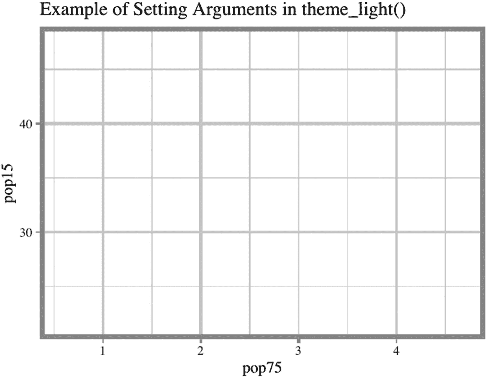
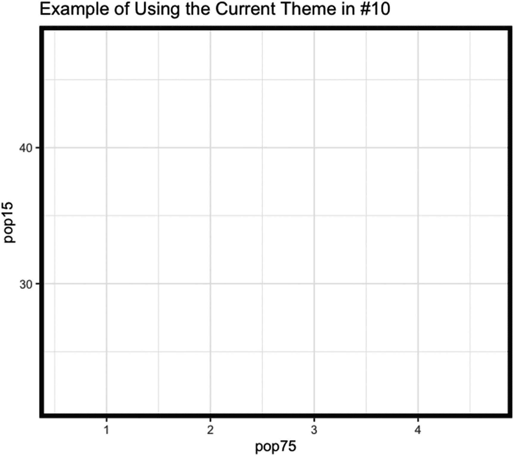
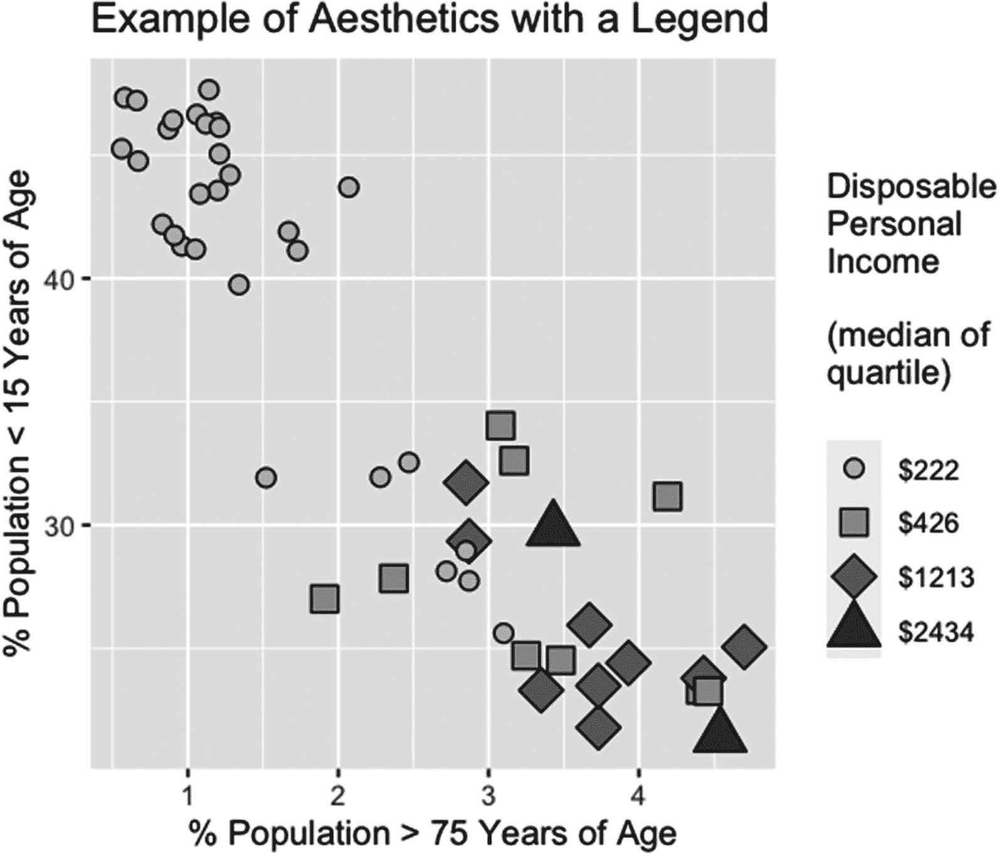

# 八、使用`ggplot()`函数：主题和美学

本章涵盖了控制绘图背景和绘图内容外观的功能-主题功能和美学功能。主题功能为绘图背景的外观设置参数，但不为绘图内容设置参数。美学功能设置内容外观的参数。第 8.1 节描述了主题功能。第 8.2 节描述了美学功能。

## 8.1 主题功能

主题功能分为三种。第一种是函数 theme()，用于设置主题。theme()有 94 个指定的参数，加上一些没有指定的参数。第二类由预设主题组成，共有十种。第三种功能与主题一起工作——查看主题的内容并修改预设的主题。在本节中，我们将分别研究每一种类型。

### 主题( )函数

theme()函数设置绘图背景的属性。也就是说，theme()设置构成绘图背景的线条的属性、在绘图背景中绘制的矩形的属性、作为绘图背景的一部分绘制的文本的属性(包括标题)以及绘图的纵横比。函数 theme()还设置图例的属性(而不是内容)。

第 93 个参数是`...`，给出了任何可以被 theme()使用的参数，但不是 ggplot2 包中函数的参数。(根据主题()的帮助页面，必须通过在函数 register_theme_elements()中设置参数 element_tree 来注册参数。)theme()的第 93 个和第 94 个指定参数给 R 的信息是:theme()生成的主题是否是完整的主题，以及运行 theme()时是否检查主题是否有效。

#### 8.1.1.1 主位( )的前五个论元和 ggplot2 的主位元函数

theme()的前五个参数是 line，用于设置线条的属性；rect，用于设置矩形的属性；文本，用于设置文本的属性；title，用于设置主标题和轴标签的属性；和 aspect.ratio，用于设置绘图的 y 与 x 的比率。

line 参数接受对 element_line()函数的调用值。影响线条外观的参数在 element_line()中设置。

rect 参数接受对 element_rect()函数的调用值。影响矩形外观的参数在 element_rect()中设置。

文本参数接受对 element_text()函数的调用值。title 参数采用对 element_text()函数的不同调用的值。影响图例和标题中文本外观的参数是在对 element_text()函数的调用中设置的。

aspect.ratio 参数采用一个长度为 1 的正数值向量(是 y 轴上一个单位在 x 轴上的单位数)。任何其他类型的值都会产生错误。

##### 函数的作用是

element_line()函数有七个参数。参数是 color(或 color ),代表线条的颜色；size，为线的大小；线型，表示要打印的线的类型；lineend，表示要使用的线端样式；箭头，用于箭头的规格(如果绘制了箭头);和 inherit.blank，如果 element_blank()出现在继承行中，则确定是否从函数 element_blank()继承(请参见下面的注释)。从 element_blank()继承，返回一个空的命名列表，告诉 R 不要绘制 line 参数。

颜色(或色彩)参数采用颜色值的矢量(可能的颜色值在第 3.4.1 节或`ggplot2-specs`插图中有所介绍)。向量可以是任意长度，并且值循环(但是首先按字母顺序排序)。对于网格，顺序从网格的底部开始，然后在绘制水平线之后，从网格的左侧开始。默认值通常是“黑色”。

size 参数接受任意长度的非负数值的向量。向量循环的元素。size 的值给出了以毫米为单位的线条宽度。

linetype 参数采用任意长度的向量，其值与 plot()中 lty 使用的值相同(有关设置，请参见第 3.3.2 节)。向量循环的元素。线型的默认值为 1 或“实心”。

lineend 参数接受任意长度的字符向量。论证类似于 par()中的 lend(见 3.4.4 节)。在 ggplot2 包中，lineend 可以取值“butt”、“square”和“round”。默认值为“对接”。

arrow 参数接受对 arrow()函数的调用值。arrow()函数在网格包中，有四个参数。这些参数是箭头臂相对于箭头轴的角度、箭头臂长度的长度、轴上箭头位置的端点以及开放或封闭箭头的类型。所有的参数都采用一个任意长度和周期的向量——但是元素是如何循环的还不清楚。

arrow()的角度参数采用一个数值向量。角度以度为单位。默认值为 30。

arrow()的 length 参数接受对 unit()函数的调用值，其中一个非负的数字向量被输入到 unit()中。unit()函数位于网格包中，用于设置数值矢量的单位。长度的默认值为 0.25 英寸。

arrow()的 ends 参数采用一个字符向量，该向量带有一个或多个值为“open”或“closed”的元素。如果设置为“打开”，箭头有两臂。如果设置为闭合，箭头为三角形。默认值为“打开”。

arrow()的类型参数采用带有一个或多个元素的字符向量，这些元素的值可以是“first”、“last”或“both”。如果设置为“第一个”，箭头位于直线的起点。如果是“最后”，箭头位于线的末端。如果为“both ”,箭头将绘制在线的两端。默认值为“最后”。

element_line()的 inherit.blank 参数采用任意长度的逻辑向量(请参见前面的文本)。默认值为 FALSE。

##### 函数的作用是

element_rect()函数有六个参数:填充矩形的颜色、颜色、大小、线型和 inherit.blank。请注意，在 element_rect()中，参数颜色、大小和线型影响矩形的边框，并且只能为边框设置一种颜色、大小和线型。也就是说，每个都将长度为 1 的向量作为值。有关参数 color、colour、size、linetype 和 inherit.blank 的说明，请参见前面对 element_line()的说明。

在 element_rect()中，参数 fill 采用任意长度的颜色矢量(参见第 3.4.1 节或`ggplot2-specs`插图)。如果在 theme()中设置了参数 panel.border，则该值是对 element_rect()的调用。在调用中，fill 的值应该设置为“transparent ”,或者设置为透明度值小于 1 的颜色值。否则，网格(如果设置了网格)和绘图的内容会被填充颜色覆盖而看不到。

##### element_text()和 margin()函数

element_text()函数有 12 个参数。参数是 family，表示要使用的字体系列；face，为要使用的字体粗细；color(或 color)，为文本的颜色；size，为文本的大小；hjust 和 vjust，用于文本远离中心的水平和垂直放置；角度，为文本的角度；lineheight，表示文本行的高度；margin，表示文本周围的边距大小；调试，针对是否使用专门的工具进行可视化调试；和 inherit . blank–请参见前面的文本。

family 参数采用包含字体系列名称的任意长度的字符向量(参见第 3.4.2 节)。对于标题，只使用第一个值，如果长度大于 1，则会给出警告。对于轴刻度标签，元素会循环，但如果长度超过 1，仍会给出警告。根据`ggplot2-specs`插图，只有字体系列“sans”、“serif”和“mono”在计算平台上始终可用。

face 参数采用任意长度的数值向量。对于 title，只使用第一个值，如果长度大于 1，则会给出警告。对于轴刻度标签，元素会循环，但如果长度大于 1，则会给出警告。合法值是字体在 par()中可以取的值(参见第 3.4.2 节)。

颜色(或色彩)参数采用任意长度的颜色值向量(见第 3.4.1 节或`ggplot2-specs`插图)。对于标题，只使用第一个值。如果长度大于 1，则会给出警告。对于轴刻度标签，向量的元素在标签中循环，但会给出警告。

size 参数采用任意长度的非负数值向量或运行 rel()函数的非负向量。如果 vector 不是 rel()的参数，则数值给出文本的磅值，例如，10 磅文本为 10 磅。如果由 rel()操作，这些值相对于标准字符大小，也就是说，这些值相对于 1，其中值 1 给出标准字符大小。

hjust 和 vjust 参数接受任意长度的数值向量。这两个参数的行为类似于函数 axis()中的 hadj 和 padj(参见 4.1.2.1 节)。

角度参数采用长度为 1 的数字向量。对于 x 轴上的文本，该值以相对于水平方向的度数表示，对于 y 轴上的文本，该值以相对于垂直方向的度数表示。

lineheight 参数采用长度应为 1 的数值向量。虽然更长的向量只会给出警告，但只使用第一个值。

margin 参数调用 margin()函数。函数 margin()有五个参数:t、r、b 和 l——表示文本上、右、下和左的边距大小——以及 unit，表示 t、r、b 和 l 值的单位。

t、r、b 和 l 参数采用任意长度的数字向量。仅使用第一个值。t、r、b 和 l 的默认值为 0。

单位参数采用任意长度的字符向量。仅使用第一个值。单位的一些值是“pt”、“cm”和“inches”(有关更多类型的单位，请参见网格包中单位()的帮助页)。单位的默认值是“pt”，即点。

调试参数采用长度为 1 的逻辑向量。如果长度超过一个元素，则函数不会调试。这是一个有用的论点，可以看出您的更改会产生什么效果。debug 的默认值为 FALSE。

inherit.blank 参数采用长度为 1 的逻辑向量。如需详细资讯，请参阅上述文字中 element_line()下的。

#### 8.1.1.2 第六篇至第九十四篇指定主题的论证( )和一个例子

接下来的 87 个参数细化了轴、图例、面板、绘图区域以及在刻面完成时绘图外部周围的条带的绘图指令。这 87 个参数包含影响轴的 35 个参数、影响图例的 21 个参数、影响面板的 13 个参数(如果不进行分面，则影响绘图区域；如果进行分面，则影响绘图和绘图区域之间的分布)、影响整个图形的 9 个参数，以及使用分面时影响绘图周围的条带的 9 个参数。

87 个参数的名称以单词 axis、legend、panel、plot 或 strip 开头。这个词后面是一个句号，后面是另一个词，有时是更多的词，用句号隔开。例如，参数`axis.ticks.y.right`设置绘图右侧 y 轴刻度线的属性。

在 theme()的论点中，句号划定了层次。在每个级别，未设置的参数采用下一个更高级别的值。也就是说，如果没有设置`axis.ticks.y.right`，那么自变量被设置为`axis.ticks.y`的值。如果没有设置`axis.ticks.y`，那么`axis.ticks.y.right`取`axis.ticks`的值。如果未设置`axis.ticks`，则`axis.ticks.y.right`被设置为自变量`line`的值。这个过程叫做继承——`axis.ticks.y.right`继承`axis.ticks.y`，继承`axis.ticks`，继承`line`。

这 87 个参数中的大多数都采用 element_line()、element_rect()、element_text()或 margin()作为值。(这四个函数和函数 rel()共享一个帮助页面。)大多数其他参数从 grid()包中获取函数单元()作为值。主题()的帮助页面提供了关于 87 个参数所取值的更多信息。

最后两个参数 complete 和 validate 采用长度为 1 的逻辑向量。缺省值 complete 为 FALSE，validate 为 TRUE。

在清单 [8-1](#PC1) 中，给出了设置主题的示例代码。

```r
ord = order(
  LifeCycleSavings$pop75
)

library(
  ggplot2
)

ggplot(
  LifeCycleSavings[ ord, ],
  aes(
    pop75,
    pop15
  )
) +

theme(

  panel.border=element_rect(
    color="grey40",
    fill="transparent",
    size=2
  ),

  panel.background=element_rect(
    fill="grey85"
  ),

  panel.grid.major=element_line(
    size=0.75,
    color="grey45"
  ),

  panel.grid.minor=element_line(
    size=0.5,
    color="grey60"
  ),

  title=element_text(
    color="grey45",
    face=4,
    family="serif",
    size=14,
    angle=3
  ),

  plot.title=element_text(
    hjust=0.5,
    vjust=0.5,
    lineheight=1.1,
    margin=margin(
    0,
    0,
    0.3,
    0,
    "cm"
    )
  ),

  axis.text=element_text(
    color="grey50",
    face=2,
    family="serif",
    size=rel( 1.1 ),
    hjust=1,
    vjust=1
  )
) +

labs(
  title="Example of \nSetting \nArguments in theme()"
)

Listing 8-1Code for the example in Figure 8-1 of setting arguments in theme()

```

在图 [8-1](#Fig1) 中，运行清单 [8-1](#PC1) 中的代码。


图 8-1

在 theme()中设置几个参数的例子。没有绘制数据

请注意，ggplot()是在数据框和为 x 和 y 设置的值的情况下运行的。在主题()中，首先设置绘图区域边界。颜色设置为中间灰度，边框宽度设置为 2 毫米。边框内的区域设置为透明。

接下来，绘图区域的背景设置为浅灰色。然后，主要网格线的宽度为 0.75 毫米，灰色略浅于边框。然后，次要网格线被赋予 0.75 毫米的宽度和更浅的灰色。

然后，标题和轴标签的格式化就完成了。标题和标签的颜色设置为与主要网格线相同的颜色。字体粗细设置为粗体和斜体，字体外观设置为衬线字体。文本的大小被设置为 14 磅，并且文本被赋予了远离轴三度的倾斜度。

然后，完成标题的特定格式。第一，标题在纵横两个方向居中。行高设置为 1.1。最后，文本和轴之间的边距增加了 0.3 厘米。

最后完成轴刻度标签的格式化。颜色设置为比标题略浅的灰色。字体粗细设置为粗体，但不是斜体，字体系列设置为衬线字体。文本的大小增加了 10%，当相对于轴查看时，标签绘制在刻度线的左侧，更靠近轴。

labs()函数是清单中的最后一个函数。该函数绘制标题。轴上的标签包含变量名。

### 8.1.2 预设主题功能

ggplot2 包中有十个预设主题。除了 theme_grey()和 theme_gray()函数相同之外，绘图背景的外观因函数而异。所有十个都采用相同的四个参数；而且，在所有函数中，参数都有相同的默认值。下面，首先描述四个论点，然后是十个主题()。

四个参数是 base_size，当没有对字体大小进行调整时用于字体大小；base_family，供字体系列使用；base_line_size，为要使用的线宽；和 base_rect_size，用于矩形中线条的宽度。

base_size 参数采用任意长度的数字向量。只使用第一个元素，如果长度大于 1，就会给出警告。基本字符大小以磅为单位。base_size 的默认值是 11。

base_family 参数采用任意长度的字符向量。这些值必须是操作系统可识别的字体系列。(更多信息见第 3.4.2 节。)base_family 的默认值是" "。

base_line_size 和 base_rect_size 参数都采用任意长度的非负数值向量。线宽以毫米为单位。价值观循环往复。两者的默认值都是 base_size 除以 22。

theme_grey()(或 theme_gray())函数是 ggplot()和 qplot()的默认背景。绘图背景是浅灰色；网格线是白色的。字体系列是操作系统的默认系列(在我的系统上是 Arial Unicode)。完整的设置列表可以通过在 R 提示符下输入 theme_gray 或者在没有其他函数的情况下调用 theme_grey()来找到(对本节中的任何函数使用相同的方法)。

theme_bw()函数给出了黑色的文本和绘图边框，边框的线宽为 0.5 毫米，面板背景为白色，网格线为浅灰色。字体系列与 theme_grey()中的字体系列相同。

theme_linedraw()函数严格地以黑色和白色绘制。主题和 theme_bw()是一样的，除了网格线是通过减小线条的宽度而不是将线条的颜色变成灰色来变亮的。对于 theme_linedraw()，主要网格线的宽度为 0.1 毫米，次要网格线的宽度为 0.05 毫米。

函数给出了一个白色的背景，灰色的边框和网格线。文本与 theme_grey()相同。

theme_dark()函数给出了深灰色的绘图背景和更深灰色的网格线。没有绘制边界。文本与 theme_grey()相同。

函数的作用是:给出一个没有设置背景和边框的图。绘制浅灰色网格线，文本与 theme_grey()相同。

函数的作用是:隐藏边框和网格线。但是，由于绘制了 y 轴和 x 轴，因此在图中可以看到一个 L 形框。背景设置为白色，文字与 theme_grey()相同。

theme_void()函数给出了一个没有边框的绘图，没有绘图页边空白——除了标题、副标题、题注和标签的页边空白(如果调用了 labs ),并且只为设置的参数——没有网格线。调用 xlab()和 ylab()没有效果。背景颜色是白色。但是，如果运行几何图形，则会打印几何图形。

theme_test()函数给出了一个与 theme_linedraw()相同的绘图，只是没有绘制网格。根据 theme_test()的帮助页面，该函数对于测试参数的新值非常有用。

在清单 [8-2](#PC2) 中，给出了图 [8-2](#Fig2) 的代码，一个在 theme_light()中设置四个参数的例子。



图 8-2

在 theme_light()中设置 base_size、base_family、base_line_size 和 base_rect_size 的示例

```r
ggplot(
  LifeCycleSavings[ ord, ],
  aes(
    pop75,
    pop15
  )
) +

theme_light(
  base_size=14,
  base_family="serif",
  base_line_size=1:3,
  base_rect_size=4
) +

labs(
  title="Example of Setting Arguments in theme_light()"
)

Listing 8-2Code for the example in Figure 8-2 of setting base_size, base_family, base_line_size, and base_rect_size in theme_light()

```

在图 [8-2](#Fig2) 中，运行清单 [8-2](#PC2) 中的代码。

文本大小设置为 14 磅，文本系列设置为 serif。网格线的宽度设置为 1、2 和 3 毫米；宽度在网格线中循环——从次要网格线开始，然后循环到主要网格线(有点)。水平线和垂直线似乎分别循环。线条的顺序从最左边或最低的次要线条开始，到最右边或最高的主要线条结束。边框线宽度设置为 4 毫米。

### 使用主题

当 R 会话启动时，*当前主题*——qplot()使用的主题和 ggplot()使用的主题(如果在对 ggplot()的调用中没有设置主题的话)——是 theme_gray()(默认主题)。运行在 R 环境层的函数可以改变当前主题的参数。

在运行 ggplot()或 qplot()之前，可以将当前主题设置为新主题、更新或替换。有一个返回当前主题的函数和一个设置当前主题的函数。更改当前主题中的一些设置或更改当前主题中的所有设置是通过另外两个函数完成的。

当运行 ggplot()时，有时一个主题中的大多数设置都适合该图，而少数设置应该更改。在对 ggplot()的调用中更改主题是通过两个操作符完成的。一个话务员更新通话中的主题，另一个话务员替换通话中的主题。

对于开发人员来说，为正在开发的包创建一个新的主题可以通过 ggplot2 包中的四个函数来完成。第 8.1.3 节的第一小节介绍了主题的设置和更改。第二小节涵盖了开发人员使用的一些功能。

#### 8.1.3.1 主题获取( )、主题设置( )、主题更新( )和主题替换( )函数以及+和%+替换%运算符

设置和修改主题的函数和操作符要么使用当前主题，要么使用添加到 ggplot()调用中的函数。函数 theme_get()和 theme_set()获取并设置当前主题。函数 theme_update()和 theme replace()改变或替换当前主题。运算符+和%+replace%更新或替换调用中的主题。

theme_get()函数不带参数，返回当前主题()的内容。该函数返回一个包含 93 个元素的列表，这些元素是影响绘图外观的 92 个参数，在 theme()的帮助页面上列出，加上第 93 个元素，`strip.text.y.left`。参数 complete 和 validate 是列表的属性。

函数的作用是:将当前主题设置为一个新主题。该函数接受一个新主题的参数 new。新参数接受一个包含构成主题的参数的列表，通常是对主题函数的调用。

函数使用对元素函数的命名调用来更新当前主题。元素函数被赋予要改变的主题()参数的名称，并包含要应用于主题的改变。每两个元素函数之间用逗号分隔。

函数的作用是:替换当前的主题。对于调用 theme_replace()时出现的参数，参数被设置为给定的值。theme()的其他参数被 theme_replace()设置为 NULL。函数 theme_replace()接受与 theme_update()相同类型的参数。

要在运行 ggplot()时更新预设主题，请使用+运算符。设置了更改参数的 theme()函数被添加到预设主题中。效果与使用 theme_update()相同。

要在 ggplot()运行时替换预设主题，可以使用%+replace%运算符添加 theme()函数。效果与使用 theme_replace()相同。

在清单 [8-3](#PC3) 中，给出了使用前面四个函数和两个运算符的例子。

```r
#   First, two objects are defined using the operators
#   %+% and %+replace%.

#    1
#    The object to.update.theme is given the value theme_bw()
#     plus an update to the theme using the operator +.

#     The change to the theme is printed out.
#     The argument color is “grey20” in theme_bw().

> to.update.theme <- theme_bw() +
theme( panel.border=element_rect( size=3, fill="transparent" ) )

> to.update.theme$panel.border
List of 5
 $ fill         : chr "transparent"
 $ colour       : chr "grey20"
 $ size         : num 3
 $ linetype     : NULL
 $ inherit.blank: logi FALSE
 - attr(*, "class")= chr [1:2] "element_rect" "element"

#    2
#    The object to.replace.theme is given the value theme_bw()
#    plus changes to the theme using the operator %+replace%.

#     The change to the theme is printed out.
#     The argument colour is now NULL.

> to.replace.theme <- theme_bw() %+replace%
theme( panel.border=element_rect( size=3, fill="transparent" ) )

> to.replace.theme$panel.border
List of 5
 $ fill         : chr "transparent"
 $ colour       : NULL
 $ size         : num 3
 $ linetype     : NULL
 $ inherit.blank: logi FALSE
 - attr(*, "class")= chr [1:2] "element_rect" "element"

#   The objects to.update.theme and to.replace.theme are now
#   used in theme_set(), theme_update() and theme_replace().

#   The functions theme_get() and theme_set() are run
#   a number of times.

#    3
#    The panel.border argument of the current theme is printed out.
#    The value is an empty list – that is, all values are NULL.

> theme_get()$panel.border
 list()
 - attr(*, "class")= chr [1:2] "element_blank" "element"

#    4
#    The current theme is set to the theme in to.update.theme
#    using theme_set().  The panel.border argument is printed out.

#    The current theme now has a transparent background,
#    a border colored “grey20”, and a border 3 millimeters wide.

> theme_set( to.update.theme )

> theme_get()$panel.border
List of 5
 $ fill         : chr "transparent"
 $ colour       : chr "grey20"
 $ size         : num 3
 $ linetype     : NULL
 $ inherit.blank: logi FALSE
 - attr(*, "class")= chr [1:2] "element_rect" "element"

#    5
#    The current theme is set back to theme_grey() and
#    and panel.border is printed out.

> theme_set( theme_grey() )

> theme_get()$panel.border
 list()
 - attr(*, "class")= chr [1:2] "element_blank" "element"

#     6
#     The current theme is set to the value of to.replace.theme,
#     using theme_replace(), then printed out.

 #    Only the color and size are not NULL.

> theme_set( to.replace.theme )

> theme_get()$panel.border
List of 5
 $ fill         : chr "transparent"
 $ colour       : NULL
 $ size         : num 3
 $ linetype     : NULL
 $ inherit.blank: logi FALSE
 - attr(*, "class")= chr [1:2] "element_rect" "element"

#    7
#    The current theme is set to theme_bw() and
#    and panel.border is printed out.

> theme_set( theme_bw() )

> theme_get()$panel.border
List of 5
 $ fill         : logi NA
 $ colour       : chr "grey20"
 $ size         : NULL
 $ linetype     : NULL
 $ inherit.blank: logi TRUE
 - attr(*, "class")= chr [1:2] "element_rect" "element"

#    8
#    The function theme_update() sets the current theme to
#    the theme in #’s 1 & 4.

> theme_update( panel.border=element_rect( size=3,
fill="transparent" ) )

> theme_get()$panel.border
List of 5
 $ fill         : chr "transparent"
 $ colour       : chr "grey20"
 $ size         : num 3
 $ linetype     : NULL
 $ inherit.blank: logi FALSE
 - attr(*, "class")= chr [1:2] "element_rect" "element"

#    9
#    The current theme is set back to theme_bw()

> theme_set( theme_bw() )

> theme_get()$panel.border
List of 5
 $ fill         : logi NA
 $ colour       : chr "grey20"
 $ size         : NULL
 $ linetype     : NULL
 $ inherit.blank: logi TRUE
 - attr(*, "class")= chr [1:2] "element_rect" "element"

#    10
#    The function theme_replace() is run to replace the
#    current theme.  The theme is set to the theme of #’s 2 & 6

> theme_replace( panel.border=element_rect( size=3, fill="transparent" ) )

> theme_get()$panel.border
List of 5
 $ fill         : chr "transparent"
 $ colour       : NULL
 $ size         : num 3
 $ linetype     : NULL
 $ inherit.blank: logi FALSE
 - attr(*, "class")= chr [1:2] "element_rect" "element"

#    11
#    ggplot() is run with the current theme - given in #10.

> ggplot( data=LifeCycleSavings, aes( pop75, pop15 ) ) +
labs( title="Example of Using the Current Theme in #10" )

Listing 8-3Output from R of the various ways of changing all or part of a theme. The functions theme_get(), theme_set(), theme_update(), and theme_replace() are demonstrated, as well as the operators + and %+replace%

```

图 [8-3](#Fig3) 显示了使用清单 [8-3](#PC3) 的第 10 部分中设置的当前主题运行 ggplot()的示例。主题在第 9 部分中设置为 theme_bw()，主题的 panel.border 元素在第 10 部分中被替换。



图 8-3

将当前主题设置为 theme_bw()并使用 theme_replace()更改主题的 panel.border 参数中的两个参数的示例–这将其他参数设置为 NULL

注意，图的边界是黑色而不是深灰色，边界的宽度是 3 毫米。因为填充是透明的，所以网格线会显示出来。

#### 8.1.3.2 创建并注册了一个新主题

当开发人员开发一个新的包时，有时开发人员希望在 theme()中加入一个新的参数。函数 theme()允许在第 93 个参数(也就是…)加入新元素。要全局使用，当新包的库打开时，必须在 ggplot2 包中注册元素。

有四个函数管理在第 93 个参数处向 theme()添加元素。这些函数是 register_theme_elements()、reset_theme_settings()、get_element_tree()和 el_def()。

函数的作用是:注册 ggplot2 中的元素。函数的作用是:将一个会话的当前主题重置为默认主题，并删除任何新元素。

函数的作用是:返回当前的元素树。(元素树是包含 ggplot2 中已注册元素的列表。)函数 el.def()是定义新元素的函数。

register_theme_elements()函数有三个参数，…，element_tree 和 complete。新元素，包括名称和逗号分隔的，是第一个参数。参数 element_tree 采用列表类型的向量，其中列表的每个元素都包含与元素定义相同的元素名称集。参数 complete 需要一个逻辑向量。如果设置为 TRUE，缺少的主题参数将设置为 NULL。如果设置为 FALSE，参数不一定从空列表继承。默认值为 TRUE。

reset_theme_settings()函数有一个参数 reset_current。这个论点需要一个逻辑向量。如果设置为 TRUE，当前主题将重置为默认主题。如果设置为 FALSE，则仅删除添加的元素。

get_element_tree()函数没有参数。该函数返回元素树。元素树是主题()的元素(参数)的两级列表。元素的名称位于顶层。对于每个元素，元素的类、元素的继承路径和元素的描述(可以为空)都在第二层。对于我在 RStudio 中的当前会话，元素树的长度是 98。

函数的作用是:定义元素。该函数接受三个参数，class，表示元素的类；inherit，为继承路径；和 description，用于元素的描述(通常为空)。

class 参数接受一个字符向量。我的电脑上的当前元素列表中的值是“边距”、“element_line”、“element_rect”、“element_text”、“unit”、“character”和“logical”。

根据 el_def()的帮助页面，字符串“character”和“margin”是保留字。“字符”的含义是一个字符或数字向量。“margin”的含义是一个四元素向量，就像函数 margin()创建的那些向量一样。

同样，“element_line”、“element_rect”、“element_text”分别具有运行 element_line()、element_rect()和 element_text()的结果的形式。“unit”类以调用网格包中的函数 unit()的形式出现。

参数 inherit 接受 NULL 值或一个字符向量，给出新定义的元素所继承的元素。参数描述采用 NULL 值或包含新定义元素描述的字符向量。

## 8.2 审美功能

审美功能影响绘图的内容。有四个函数可以设置美学–AES()、aes_()、aes_q()和 aes_string()。aes_()、aes_q()和 aes_string()函数共享一个帮助页面，并被描述为引用美学变量，以使变量编程更容易。我们这里只讲 aes()。有关这三个函数的更多信息，请参见其他函数的帮助页面。

在 ggplot()和添加的函数中，要绘制的变量作为美学输入。描述符(像点大小和颜色)也可以作为美学输入。可以通过三种方式调用 aes()函数-在调用 ggplot()时，在调用 ggplot()后添加一个+运算符(在任何层)，或者在几何或统计函数中设置。在 ggplot()、几何函数或统计函数中设置时，aes()所赋的参数名是 mapping。

aes()函数接受两个指定的参数 x 和 y，以及所绘制的特定函数所需的任何其他变量。此外，描述性参数可以包含在对 aes()的调用中，如前所述。

虽然 x 和 y 在 aes()函数调用中首先列出，并且通常不按名称分配，但必须为其他参数分配正在绘制的函数所使用的名称。参数的长度必须为 1 或等于要绘制的变量的长度，通常是 x 和 y 的长度。(有时 x 和/或 y 没有设置，这取决于要绘制的函数。如果 x 和 y 都未设置，则绘制由正在绘制的函数指定的另一个变量。)

根据 aes()的帮助页面，函数 aes()是一个引用函数。由于 ggplot2 中的函数通常用于数据框，因此数据框中的各种变量不需要属于同一原子类。通过引用变量，所有变量都具有相同的类型(字符)，这使得使用变量更加容易。

在 aes()的帮助页面中，请参阅 rlang 包中 nse-force 的帮助页面和 dplyr::programming vignette，以了解有关使用 quasiquotation 编程的信息，如果变量是使用 quoting 函数创建的，则必须使用 quasi quotation。此外，在 aes()的帮助页面中，当从另一个函数中调用 ggplot()和其他相关函数时，引用变量会出现问题。另一个功能叫做包装器。有关包装器的更多讨论和一些示例，请参见帮助页面。

r 有四个描述美学组的帮助页面。此外，R 还有一个小插图，描述了许多美学的可能价值。(对于晕影，在 R 提示符下输入`vignette("ggplot2-specs")`。)

第一个帮助页面是`aes_colour_fill_alpha`–关于颜色、填充和 alpha 美感。请参阅第 3.4.1 节、前面的帮助页或前面的插图中有关颜色、填充和 alpha 所取值种类的描述。

第二个帮助页面是`aes_linetype_size_shape`，关于线型、尺寸和外形美观。请参见第 3.3.2 和 3.4.3 节、前面的帮助页或前面的插图中对 lty、cex 和 pch 的描述，了解线型、尺寸和形状所采用的值的种类。

第三个帮助页面是`aes_position`，用于给出图中位置的参数。这些参数是 x、y、xend、yend、xmin、ymin、xmax 和 ymax。x 和 y 参数给出了点的 x 和 y 位置，在大多数图中使用(一个或另一个或两个)。x 和 y 通常没有默认值。

xend 和 yend 参数给出了曲线和线段的端点。曲线和线段从 x 和 y 位置开始，在 xend 和 yend 位置结束。xend 的长度必须是 1 或 x 的长度，这同样适用于 y 和 yend 的长度。xend 和 yend 没有默认值。

xmin、ymin、xmax 和 ymax 参数给出了要在图上绘制的矩形的角或要放在图上的图像的角。参数采用长度为 1 或等于 x 和 y 长度的数值向量。这两种可能的长度可以在四个参数之间混合。

如果一个或多个角超出绘图限制，在 aes()内设置四个参数会导致绘图限制扩大。将四个参数设置在 aes()之外不会扩大绘图限制。相反，矩形或图像在轴上被切断。

xmin、xmax、ymin 和 ymax 没有默认值。有关定位参数的更多信息，请参见帮助页或插图。

第四个帮助页面是`aes_group_order`，用于创建图或按组设置图的特性。在 plot()中，by 参数告诉 plot()按变量组进行绘制。例如，箱线图可以根据分配给的变量值绘制在单独的图中。在 ggplot2 包中，类似的变量是审美参数组。

因为组是一个美学参数，所以组的长度必须是 1 或要绘制的对象的长度。根据帮助页面，组的默认值是分配给数据的数据框中的离散变量的相互作用。有关组参数的更多信息，请参见帮助页或插图。

对于其他描述性论点，可以基于组来分配不同的审美价值。可以将描述性参数设置为长度等于要绘制的对象长度的变量。变量将包含对描述性参数合法的值组。然后，绘图函数将根据 vector 中的组分配参数的特征(就像函数 plot()对 par()中的许多参数所做的那样)。根据`aes_group_order,`的帮助页面，可根据变量值设置为不同值的美学有 x、y、颜色、填充、alpha、形状、大小和线型。

在 par()中称为 adj、str、col、fg、bg、lty、lwd、cex 和 pch 的描述符可以作为美学输入到 ggplot2 中，其名称特定于 ggplot2。相应的名称是 hjust、angle、color(或 color)、color(或 color)、fill、linetype、size、size 和 shape。(如果在引号内输入 par()名称，函数 aes_all()显示从 ggplot2 名称到 par()名称的转换。)

par()中的 col 和 fg 参数在 ggplot2 函数中都被命名为 color(或 color)。哪个绘图属性将由颜色参数着色取决于设置颜色的函数的类型。类似地，par()中的 lwd 和 cex 所引用的属性的大小取决于 size 参数所在的函数类型。

所有的美学都可以在调用 aes()之外的几何函数中输入，并且不在指定的数据帧中。但是，在 aes()之外设置的参数必须分配给运行 R 的环境中的对象或表达式。在 aes()函数之外设置的参数无权访问分配给数据的数据框。

如果在对 aes()的调用中输入了描述性参数，则会为分配给该描述性参数的变量中的不同组创建一个图例。如果未在对 aes()的调用中设置，则不会创建图例。通过将一些描述性参数放在对 aes()的调用中，将其他参数放在调用之外，可以选择使用哪种美学来创建图例。为 aes()调用中的每个参数绘制一个图例。请注意，在 aes()中设置的描述性参数的行为并不总是与在 aes()之外设置变量的行为相同。

在清单 [8-4](#PC4) 中，给出了在几何函数 geom_point()中使用美学的示例代码。函数 geom_point()包含在第 [9](09.html) 章中。功能 scale_size()和 guide_legend()用于改变图例，在第 [10 章](10.html)中有所介绍。

```r
gray.scale=gray(
  c( 80, 70, 55, 35 )/100
)

cdpi = (21:24)[
  cut( LifeCycleSavings$dpi, 4 )
]

dpi.quantiles=floor(
  quantile(
    LifeCycleSavings$dpi,
    c(
      12.5, 37.5, 62.5, 87.5
    )/100
  )
)

ggplot(
  data=data.frame(
    LifeCycleSavings,
    size=cdpi-18.5
  ),
  aes(
    pop75,
    pop15,
    size
  )
) +

theme(
  plot.margin=margin( 0.5, 0.5, 0.5, 0.5, "inches" )
) +

geom_point(
  aes(
    size=size
  ),
  fill=gray.scale[ cdpi-20 ],
  shape=cdpi
) +

scale_size(
  breaks=c( 2, 3, 4, 5 )+0.5,
  label=paste0( "$", dpi.quantiles ),
  guide=guide_legend(
    override.aes=list(
      shape=21:24,
      fill=gray.scale
    )
  ),
  name=
      "Disposable\nPersonal\nIncome\n\n(median of\nquartile)\n",
  range=c( 2.5, 5.5 )
) +

labs(
  title="Example of Aesthetics with a Legend"
) +

xlab(
  "% Population > 75 Years of Age"
) +

ylab(
  "% Population < 15 Years of Age"
)

Listing 8-4Code for the example of using aesthetic arguments in geom_point()

```

在图 [8-4](#Fig4) 中，运行清单 [8-4](#PC4) 中的代码。使用生命周期保存数据集中的 pop75、pop15 和 dpi 变量给出了一个图(参见第 3.1 节)。



图 8-4

在几何图形 geom_point()中使用美学尺寸、形状和填充的示例

请注意，该图周围有 0.5 英寸的边距。此外，参数大小是在对 aes()的调用中设置的，而 shape 和 fill 是在调用之外，因此只绘制一个图例。函数 scale_size()用于改变图例项的形状和填充颜色，以及图例项的标签和标题。