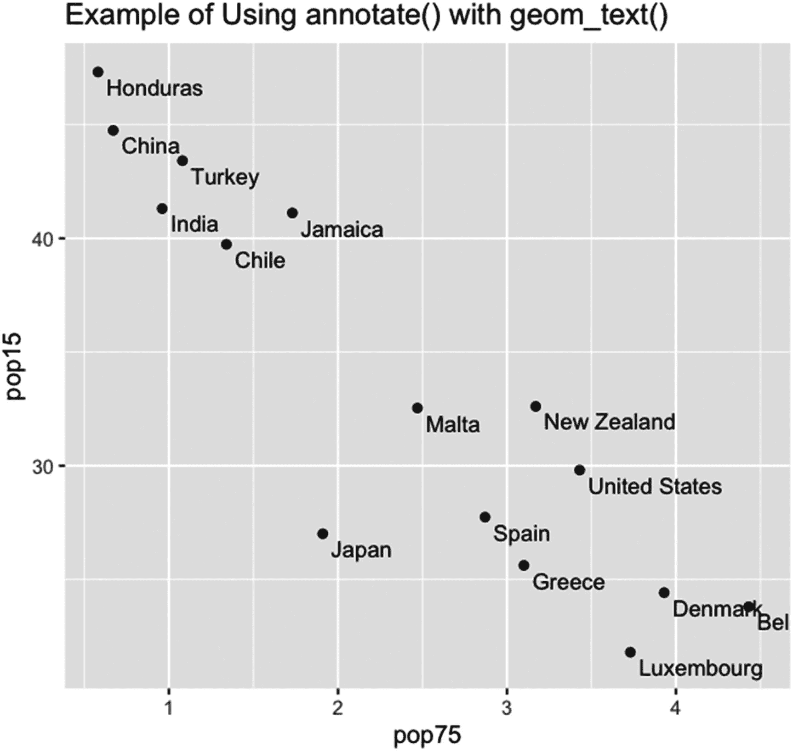
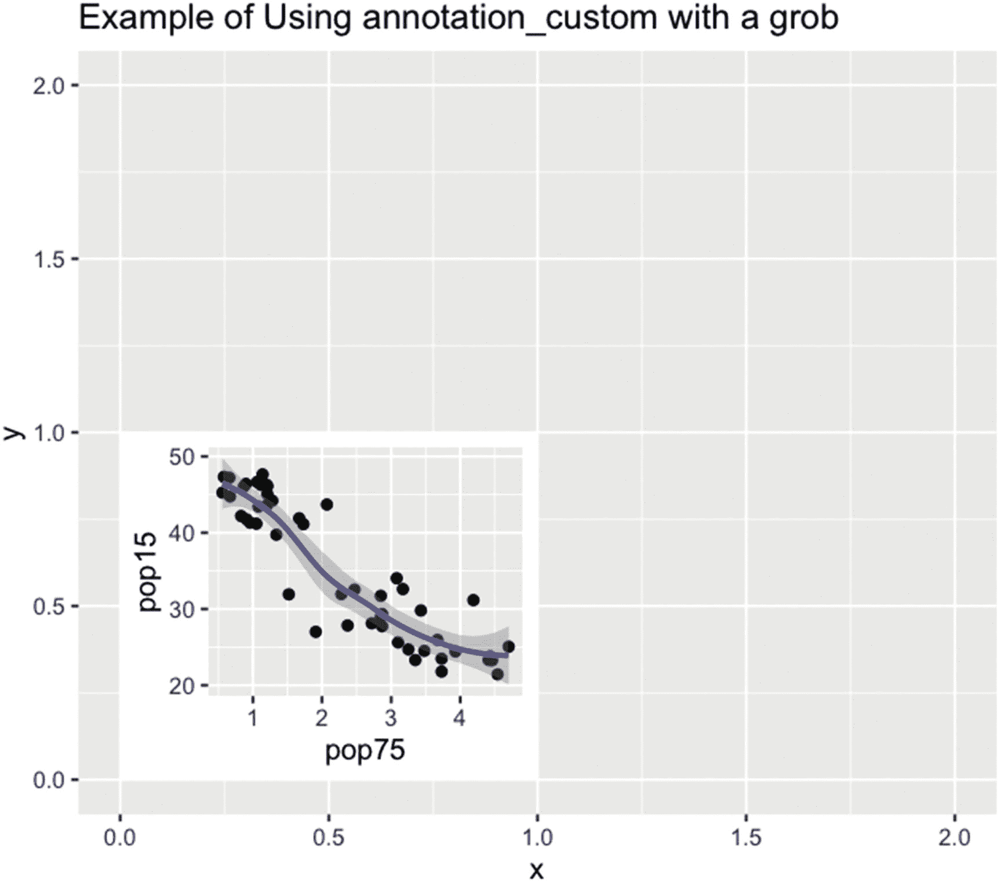
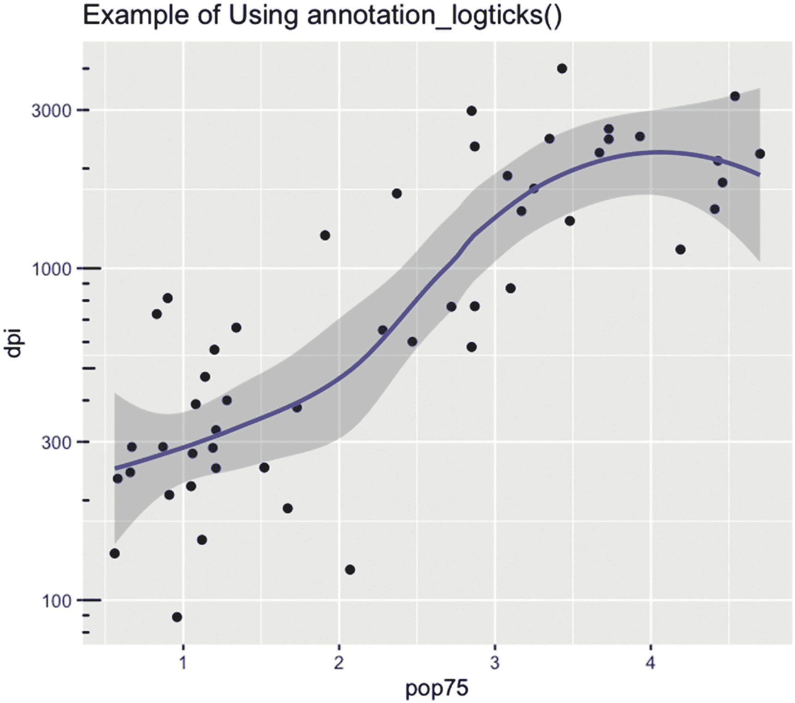
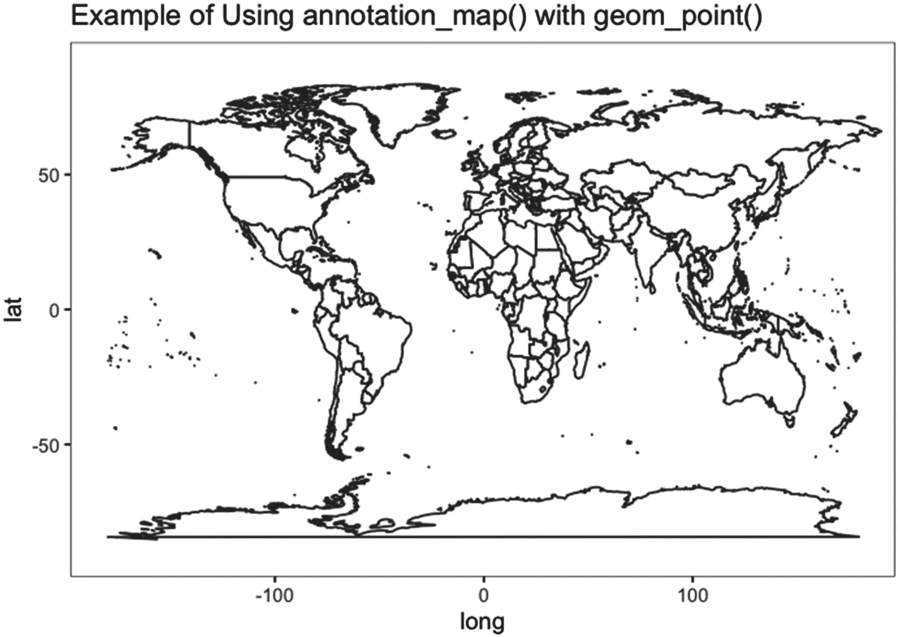
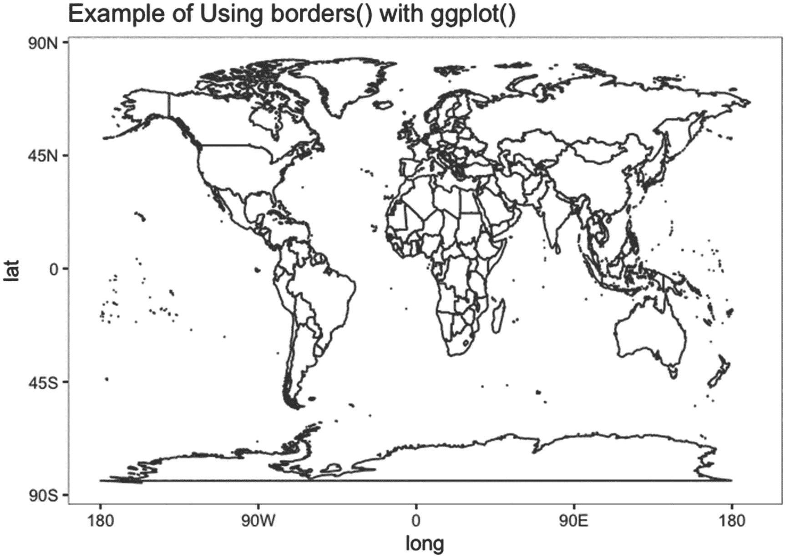

# 九、几何、统计、标注和`borders()`函数

几何、统计、标注和`borders()`函数创建绘图内容。这些函数在图形上打开新图层并绘制新信息。所有以 *geom_* 开头的几何函数，创建了许多可以用 ggplot2 包创建的绘图类型中的大多数。统计函数都以 *stat_* 开始，创建和添加图形。这些函数在绘图前以统计方式减少数据。注释函数，即函数 annotate()或以 *annotation_* 开始，提供了一种简单的方法来注释用 ggplot()创建的图。borders()函数为格式正确的地图对象添加边框。

本章有四节。第一部分介绍几何函数，第二部分介绍统计函数，第三部分介绍注记函数，第四部分介绍 borders()函数。

## 9.1 几何函数

几何函数是 ggplot2 包中最基本的绘图函数。几何函数被格式化为 geom_ *扩展*()，其中*扩展*是几何的名称(例如，几何 _abline()用于 abline 几何)。几何函数的名称描述了该函数绘制的内容。表 7-1 列出了 48 个几何函数的扩展名，以及这些函数的功能描述。

几何函数通过+运算符或%+%运算符添加到绘图函数中(参见第 7.1.1 节)。本节给出了关于几何函数和几何函数帮助页面的一般信息。

如果已在 ggplot()中分配了数据和映射参数，并且 ggplot()中的映射包含几何函数所需的所有参数，则几何函数可以使用 ggplot()调用中的数据和映射信息。然后可以不带参数调用几何函数。

然而，所有几何函数的前两个参数是映射和数据，用于美学和数据框架。默认情况下，除了三个简单的要素几何函数之外，这两个函数都为空。对于 geom_sf()、geom_sf_label()和 geom_sf_text()，映射的值是 aes()。

大多数几何函数都有一个名为 stat 的参数，该参数被赋予一个统计函数的名称，该名称用引号括起来。例如，名称`"identity"`用于 stat_identity()函数(有关统计函数的信息，请参见第 9.2 节)。因为不止一个几何图形具有相同的 stat 值，所以使用 static 函数可能会减少对几何图形函数进行编码的工作量。两个几何函数 geom_qq()和 geom_qq_line()具有参数 geom–在这种情况下，geom 为 geom_path()几何函数取值“path”。

大多数几何函数也有一个名为 position 的参数。位置参数采用长度为 1 的字符向量。向量包含位置函数的名称，通常是“身份”。位置函数的命名方式与统计和几何函数相同——前缀为 *position* _ 后跟名称。位置函数告诉 R 如何在图上放置由几何函数生成的信息。位置的可能值为“减淡”、“减淡 2”、“填充”、“标识”、“抖动”、“抖动减淡”、“微移”和“堆叠”。

大多数几何函数采用参数 na.rm、show.legend 和 inherit . AES。na . RM 参数告诉 R 当程序删除丢失的值时是否警告用户。该参数采用长度为 1 的逻辑向量。如果设置为 FALSE，则会给出警告。如果设置为 TRUE，则不会给出警告。如果参数存在于参数列表中，则默认值为 FALSE。

show.legend 参数告诉 R 是否将几何函数打开的图层包括在绘图的图例中。如果设置为 NA，则在几何函数中使用美学函数时会包括该层。如果设置为 FALSE，则不包括该层。如果设置为 TRUE，则始终包括该图层。如果在几何函数内调用的 aes()函数中包含多个美学变量，则逻辑向量的长度可以大于 1。每个逻辑值必须用要包含或不包含的参数的名称来命名。当 show.legend 包含在参数列表中时，show.legend 的默认值为 NA。

inherit.aes 参数告诉 R 是添加到 aes()的 ggplot()调用中定义的美学变量列表中，还是在 geometry 函数中设置一组新的变量。如果设置为 TRUE，几何函数美学与 ggplot()美学相结合。如果设置为 FALSE，将建立一个新的美学。当参数包含在参数列表中时，inherit.aes 的默认值为 TRUE。

其他指定的参数随几何函数而变化。例如，在 geom_abline()中，存在参数 slope 和 intercept，但没有默认值。必须为参数赋值，函数才能运行。前面文本中没有列出的一些指定参数在许多函数中使用，但是除了前面文本中列出的参数之外，大多数函数中都没有指定的参数。

变元…用于美学变元以及未具体列出的几何函数的任何参数。所有的几何函数都有…参数。

可用于几何功能的美学在该功能的帮助页面上列出，或者在从几何功能的帮助页面链接的帮助页面上给出。例如，对于 geom_abline()，可能的美学变量是 alpha、颜色、线型、大小、坡度和截距。有时候，只列出一些可能的审美。

对于大多数帮助页面，美学以项目符号列表的形式列出，必须提供的美学以粗体字体列出。对于许多帮助页面来说，页面涵盖了不止一个功能。通常，美学列表名义上只针对一个功能。假设，在只给出一个函数名的情况下，美学适用于帮助页面上的所有函数。大多数帮助页面还提供了由几何函数计算的各种值。

## 9.2 统计功能

统计函数对数据集执行统计归约并绘制结果。统计函数的行为与几何函数非常相似。ggplot2 包中列出了 33 个统计函数(有几个被弃用、删除或重复)。

与几何函数一样，统计函数的前两个参数是映射和数据。对于所有的统计函数，除了简单特征函数 stat_sf_coordinates()的映射值之外，映射和数据的默认值都是 NULL。对于 stat_sf_coordinates()，映射默认采用值 aes()。

所有统计函数都有一个名为 geom 的参数，这是几何函数的名称。geom 的值是几何函数的名称扩展的引用值。例如，对于几何函数 geom_bar()，geom 被设置为等于“bar”。不同的统计函数可以具有相同的 geom 值。

大多数统计函数都采用 position、na.rm、show.legend 和 inherit.aes 参数。position 参数与几何函数具有相同的含义，并采用相同类型的值。na.rm、show.legend 和 inherit.aes 参数采用与几何函数中相同的类型和默认值。

统计函数的帮助页面描述并不总是给出函数可能使用的美学列表。通常，几何函数和统计函数共享同一个帮助页面，并且只列出了几何函数的美学参数。据推测，相应的统计函数也可以使用这些参数。美学函数的行为方式与几何函数的行为方式相同。

在表 [9-1](#Tab1) 中，列出了统计函数及其描述。原始表来自 ggplot2 包的函数列表。

表 9-1

ggplot2 包中的统计函数及其说明

<colgroup><col class="tcol1 align-left"> <col class="tcol2 align-left"></colgroup> 
| 

统计函数

 | 

描述

 |
| --- | --- |
| stat_bin （ ） | 查找落在由 x 或 y 变量构造的箱中的观察值的数量或标准化数量。只能设置 x 和 y 中的一个。计数被标绘。 |
| stat_bin2d （ ） | stat_bin_2d 的旧名称。 |
| stat_bin_2d （ ） | 查找落在由交叉的 x 和 y 变量构建的条柱中的观测值的数量。必须设置 x 和 y。在箱的中间绘制正方形。正方形根据箱中的观察数量进行着色。不绘制没有观测值的条柱。 |
| stat_binhex（ ） | stat_bin_hex()的旧名称。 |
| stat_bin_hex（ ） | 与 stat_bin_2d 相同，只是使用了六边形而不是正方形作为容器。 |
| stat_boxplot（ ） | 查找箱线图使用的值并绘制箱线图。x 或者 y 都可以装箱。应设置 x 或 y，但不能同时设置两者。使用 Tukey 使用的方法。 |
| stat_contour() | 在二维图上绘制等高线。必须设置美学 x、y 和 z。分配给 z 的值在分配时必须命名为 z。变量 x 和 y 应该(至少近似地)等间距递增。绘制了 z 值的等高线。 |
| stat_contour_filled() | 与 stat_contour()相同，只是等高线之间的区域用渐变颜色填充。 |
| stat_count() | 查找并绘制变量 x 或 y 中共享一个值的观察值的数量。创建条形图。只使用 x 和 y 中的一个。 |
| 统计密度( ) | 查找并绘制 x 或 y 的核密度估计值–只能有一个在 aes()的 ggplot()中。如果 x 存在，密度在 x 轴上。对于 y，密度在 y 轴上。 |
| stat_density2d() | stat_density_2d()的旧名称。 |
| stat_density2d_filled() | stat_density_2d_filled()的旧名称。 |
| stat_density_2d() | 绘制基于 x 和 y 值的内核密度估计值的等值线图，这两个值都必须设置。 |
| stat_density_2d_filled() | 与 stat_density_2d()相同，只是轮廓之间的区域用渐变颜色填充。 |
| stat_ecdf() | 绘制分配给 x 的向量的经验累积密度函数。如果设置了 y，y 轴将被命名为分配给 y 的变量的名称，但 y 没有其他作用。必须设置参数 x。可以设置参数 y。 |
| stat_ellipse（ ） | 围绕二维数据绘制置信椭圆。必须设置 x 和 y。 |
| stat_function() | 绘制一个变量的 R 函数。该函数必须是一对一的映射。参数 x 和 y 可以在 stat_function()或 ggplot()中设置。如果两者都设置了，x 将用作函数的输入。参数 fun 可以是函数名或函数定义，必须给出。赋值 fun=cos，fun="cos "和 fun=function(x) cos(x)都给出相同的结果。该功能可以由用户定义。 |
| 统计标识( ) | 绘制几何函数。默认情况下，会绘制散点图，并且必须设置 x 和 y。参数 x 和 y 不会被转换。 |
| stat_qq（ ） | 绘制数据向量相对于分布分位数的分位数图(默认为标准正态)。唯一必须设置的参数是 sample——用于将数据向量与分布进行比较。 |
| stat_qq_line() | 绘制分位数-分位数线。可以设置分布函数，但默认为 qnorm()(在 stats 包中)。必须设置数据向量样本。 |
| stat_quantile （ ） | 绘制 x 和 y 上的分位数回归结果。x 和 y 都必须设置。 |
| stat_sf（ ） | 打开一个带有 sf(简单要素)类对象坐标和统一背景的图形。sf 对象的美学参数名称是 geometry。由 geom_sf()用于打印 sf(简单要素)类的对象。 |
| 统计坐标( ) | 打印 sf(简单要素)类对象的要素坐标。sf 对象的美学参数名称是 geometry。 |
| stat_smooth() | 在 x 和 y 坐标上绘制点的平滑版本。必须设置 x 和 y。用于平滑的方法由 method 参数设置。 |
| stat_spoke() | 此函数已被否决。使用 geom_spoke()。 |
| stat_sum() | 在 x 和 y 坐标上绘制点，其中绘制内容的特性取决于特定点处的观察次数。必须设置 x 和 y。默认情况下，会绘制黑色圆，并且这些圆的大小各不相同。还绘制了一个图例，其中包含属性的键。 |
| 统计摘要( ) | 对于每个 x 值，绘制与 x 值相关的 y 值的函数。x 和 y 都必须设置。参数 fun 设置函数(默认情况下，绘制平均值加上和减去平均值的标准误差)。 |
| stat_summary_bin() | 与 stat_summary()相同，只是 x 值被聚合到箱中。必须设置 x 和 y。bin 的数量由参数 bin 设置，默认值为 30。 |
| stat_summary2d() | stat_summary_2d()的旧名称。r 要求使用函数 stat_summary_2d。 |
| 统计 _ 汇总 _ 二维( ) | 为 x 和 y 点的每个箱绘制一个正方形，正方形的颜色基于应用于箱中 z 值的函数。必须设置 x、y 和 z。为应用于 z 的函数值绘制图例。(使用参数 bin 或 binwidth，根据水平和垂直坐标将绘制区域分割成多个条柱。函数由自变量 fun 给出。) |
| stat_summary_hex() | 与 stat_summary_2d()相同，只是箱子是六边形而不是正方形。 |
| stat _ 唯一( ) | 绘制 x 和 y 中唯一值的散点图。x 和 y 都必须设置。 |
| 统计密度( ) | 策划一场小提琴阴谋。必须设置参数 x 和 y。参数组可以设置为按组绘图。 |

关于统计函数的更多信息可以在函数的帮助页面中找到。请注意，有些参数是美学参数，必须输入到美学函数中，有些参数是绘图函数的参数，但不包括在美学函数中，有些参数可以是两者都有。

只能设置在参数或美学列表(除了一些不完整的美学列表)中的帮助页面上定义的参数，但是在运行 ggplot()的环境中使用参数的表达式可以在赋值的右侧使用。

## 9.3 注释功能

批注函数 annotate()、annotation_custom()、annotation_logticks()、annotation_map()和 annotation_raster()将批注放置在绘图上。annotate()函数使用几何函数，并从环境而非指定的数据框中获取几何函数的数据。运行几何函数的结果被放置在图上 annotate()中指定的位置。

annotation_custom()函数获取一个网格图形对象(grob——本质上是一个完全指定的绘图),并将该对象放在现有绘图的指定位置。annotation_logticks()函数在一个或两个轴上放置对数刻度。函数的作用是:在一个存在的图上绘制一个地图边界。annotation_raster()函数在绘图上的指定位置绘制光栅图像。

本节分为四小节。这些小节首先涵盖了 annotate()函数；二、annotation_custom()函数；三、annotation_logticks()函数；第四，annotation_map()和 annotation_raster()函数。

### annotate()函数

annotate()函数使用几何函数在现有地块上创建新地块。如果新图的位置超出或部分超出原始图的限制，annotate()会扩展原始图的轴以包含两个图。几何函数使用的美学参数可以在 annotate()中使用。除了 x 和 y，美学参数只影响新的绘图，不影响任何现有的图例(根据 annotate()的帮助页面)。

新地块的位置单位是原始地块的单位。例如，如果 x 轴从 0 到 5，y 轴从 20 到 50，则新图的 x 轴相对于 0 到 5 放置，而新图的 y 轴相对于 20 到 50 放置。

annotate()函数接受十个指定的参数加上未指定的美学参数以及 geometry 函数使用的任何参数。分配给参数的值可以从运行 R 的环境中获取，但不能从分配的数据帧中获取。十个参数是 geom，用于几何函数；x 和 y，用于几何函数使用的 x 和 y 坐标；xmin、xmax、ymin 和 ymax，表示放置地块的位置；xend 和 yend，如果几何函数是 geom_curve()或 geom_segment()，用于曲线和线段的端点；和 na.r，用于在缺失点被移除时是否给出警告。第十个参数是…，用于未指定的美学参数和几何函数使用的参数。

geom 参数采用长度为 1 的字符向量。向量包含用引号括起来的几何图形的名称。例如，设置 geom 等于“点”以使用 geom_point()，或者设置 geom 等于 gg 且 gg 等于“文本”以使用几何函数 geom_text()。geom 没有默认值。

x、y、xmin、xmax、ymin、ymax、xend 和 yend 参数在 8.2 节中介绍。根据 annotate()的帮助页面，必须至少设置一个参数。参数的默认值都是 NULL。

其他的美学观点也在第 8.2 节中讨论。annotate()使用的几何函数的参数在第 7.2、9.1 和 9.2 节中介绍。

na.rm 参数采用长度为 1 的逻辑向量。如果设置为 TRUE，则在由于丢失数据而删除观察时不会给出警告。如果设置为 FALSE，则会给出警告。na.rm 的默认值为 FALSE。

在清单 [9-1](#PC1) 中，给出了用 geom_text()函数调用 annotation()的例子中使用的代码。随机方法用于选择数据集生命周期中的哪些观察值需要绘制。

```r
sel = sample(
   1:50,
   15
)

ggplot(
  LifeCycleSavings[ sel, ],
  aes( pop75, pop15 )
) +

geom_point(
) +

annotate(
  "text",
  x=LifeCycleSavings$pop75[ sel ]+0.05,
  y=LifeCycleSavings$pop15[ sel ]-0.3,
  label=rownames(
    LifeCycleSavings
  )[ sel ],
  hjust=0,
  vjust=1,
  size=3.5
) +

labs(
  title="Example of Using annotate() with geom_text()"
)

Listing 9-1Code to annotate a plot with point labels using annotate() with geom_text()

```

在图 [9-1](#Fig1) 中，运行清单 [9-1](#PC1) 中的代码。请注意，代码运行了几次，直到产生可接受的数据选择。



图 9-1

使用几何函数 geom_text()调用 annotate()以在 50 个观测值中随机选择的 15 个观测值上放置标注的示例

请注意，标注绘制在点的右下方不远处，因为 hjust 设置为 0，vjust 设置为 1，偏移 0.05 添加到 x 位置，偏移 0.3 从 y 位置减去。另请注意，x 和 y 的值包括数据框名称，因为 annotate 不使用任何 aes()调用中的美学设置。文本大小设置为 3.5-文本大小为 3.5 毫米。

### 9 . 3 . 2 annotation _ custom()和 ggplotGrob()函数

函数的作用是:在指定的位置绘制一个网格图形对象。网格图形对象包含创建完整绘图图形的指令。该对象是通过运行 ggplotGrob()函数创建的。

annotation_custom()函数接受五个指定的参数，没有未指定的参数。参数是 grob——代表网格图形对象——以及 xmin、xmax、ymin 和 ymax，代表放置 grob 值的角。

grob 参数获取调用 ggplotGrob()的输出。ggplotGrob()函数接受一个参数——使用 ggplot()和附加函数的完整绘图调用，例如`ggplotGrob( ggplot( LifeCycleSavings, aes( pop75, pop15 ) ) + geom_point() + geom_smooth() )`。grob 没有默认值。

xmin、xmax、ymin 和 ymax 参数采用值-Inf 或 Inf 或单元素数值向量。值-Inf 和 Inf 指示 x 轴的左侧和右侧或者 y 轴的底部和顶部(网格图形对象被绘制在其上的图)。

xmin 的值不需要小于 xmax，因为如果两者的顺序错误，annotation_custom()会将两者颠倒。ymin 和 ymax 也是如此。如果 x 和 y 限制部分或全部落在绘制网格图形对象的图的限制之外，则轴不会扩展。xmin 和 ymin 的默认值是-Inf，而 xmax 和 ymax 的默认值是 Inf。

在清单 [9-2](#PC2) 中，给出了图 [9-2](#Fig2) 的代码，这是一个创建和绘制网格图形对象的例子。



图 9-2

在 annotation_custom()中设置网格图形对象的示例

```r
ggplot(
  data.frame(
    x=0:2,
    y=0:2
  ),
  aes(
    x=x,
    y=y
  )
) +

geom_point(
  color="transparent"
) +

labs(
  title="Example of Using annotation_custom with a grob"
) +

annotation_custom(

  grob=ggplotGrob(

    ggplot(
      LifeCycleSavings,
      aes(
        pop75,
        pop15
      )
    ) +

    geom_point(
    ) +

    geom_smooth(
    )
  ),

  xmin=0,
  xmax=1,
  ymin=0,
  ymax=1
)

Listing 9-2Code for the example of running annotation_custom() that is in Figure 9-2

```

在图 [9-2](#Fig2) 中，运行清单 [9-2](#PC2) 中的代码。annotation_custom()函数用于由调用 ggplot()和两个几何函数组成的网格图形对象。

请注意，网格图形对象上的单位不同于背景图的单位。在背景图中，颜色设置为“透明”，因此设置轴比例的三个点不可见。还要注意，网格图形对象在 x 轴和 y 轴上的位置被 xmin、xmax、ymin 和 ymax 设置为 0 到 1 之间。在这两个图中，都使用了默认主题。对于两个几何图形，也使用默认值。

### 9 . 3 . 3 annotation _ log ticks()函数

annotation_logticks()函数将对数刻度的刻度线放在绘图上。对数刻度可以放在图的任何一个或所有四个边上。可以在一侧绘制三个不同大小的刻度线，用于三个不同的间隔级别。该函数可以与函数 scale_x_log10()、scale_y_log10()和 coord_trans()一起使用。

annotation_logticks()函数接受 12 个指定的参数和一些未指定的美学参数。…参数是参数顺序中的最后一个参数。前 12 个参数是 base，表示对数的底数；侧边，用对数刻度标注哪一侧(哪些侧边);外部，用于将刻度线绘制到地块内还是远离地块；缩放，表示在创建图之前数据是否已进行对数缩放；短、中和长，用于三个间隔级别的刻度线的长度；以及标准的颜色、大小、线型、alpha 和颜色美学参数。

基本参数采用长度为 1 的正数值向量。base 的默认值是 10。

sides 参数接受长度为 1 的字符向量。该值必须是字母 b、l、t 和 r 的组合，代表图的底部、左侧、顶部和右侧。例如，使用“bl”在底部和左侧放置一个对数刻度。边的默认值是“bl”。

外部参数采用长度为 1 的逻辑向量。任何其他长度都会给出警告。如果设置为 TRUE，并且在 coord_cartesian()中将 clip 设置为“关”，则记号将远离绘图绘制。如果设置为 FALSE，刻度将绘制到绘图中。outside 的默认值为 FALSE。

缩放参数采用长度为 1 的逻辑向量。根据 annotation_logticks()的帮助页面，如果通过对变量运行 log10()在绘图前转换具有对数刻度的变量，或者如果调用 scale_x_log10()和/或 scale_y_log10()，则 scaled 设置为 TRUE。如果调用 coord_trans()时 x 和/或 y 设置为“log10 ”,则 scaled 应设置为 FALSE。scaled 的默认值为 TRUE。

short、mid 和 long 参数分别从对 unit()函数的单次调用中获取输出，该函数位于网格包中。(最短的刻度线与标尺上最小的宽度划分间隔相关联；具有中间宽度划分间隔的中音；并且最长的具有最大的宽度分割间隔。)short、mid 和 long 的默认值分别是单位(0.1，“厘米”)、单位(0.2，“厘米”)和单位(0.3，“厘米”)。

color(或 colour)参数采用长度为 1 的颜色向量(参见 3.4.1 节了解颜色向量的种类)。颜色的默认值是“黑色”。

size 参数接受一个长度为 1 的非负数值向量。该值以毫米为单位给出刻度线的线宽。大小的默认值为 0.5。

线型参数采用长度为 1 的线型向量(参见第 3.3.2 节和线型值参数 lty)。线型的默认值为 1(对于实线)。

alpha 参数采用一个长度为 1 的数值向量，该向量必须介于 0 和 1 之间(包括 0 和 1)(有关如何使用 alpha 的说明，请参见 3.4.1.2 一节)。alpha 的默认值为 1，即刻度线是不透明的。

在清单 [9-3](#PC3) 中，给出了使用 annotation_logticks()和 scale_y_log10()的示例代码。

```r
ggplot(
  LifeCycleSavings,
  aes(
    pop75,
    dpi
  )
) +

scale_y_log10(
) +

geom_point(

) +

geom_smooth(
) +

labs(
  title="Example of Using annotation_logticks()"
) +

annotation_logticks(
  side="l"
)

Listing 9-3Code for the example in Figure 9-3 of using annotation_logticks() with scale_y_log10()

```

在图 [9-3](#Fig3) 中，运行清单 [9-3](#PC3) 中的代码。运行 geom_point()和 geom_smooth()。



图 9-3

将 annotation_logticks()与 scale_y_log10()、geom_point()和 geom_smooth()一起使用的示例

请注意，geom_point()和 geom_smooth()都运行。如果通过运行 coord_trans( y="log10 ")并在 annotation_logticks()中将 scaled 设置为 TRUE 来设置对数比例，则 geom_smooth()会给出一个错误。

根据 coord_trans()的帮助页面，scale_y_log10()在转换要打印的对象以进行打印之前运行，而 coord_trans()在转换之后运行。(参见帮助页面的示例部分，了解 ggplot2 中三种日志转换变量的方式。)

### 9 . 3 . 4 annotation _ map()和 annotation_raster()函数

annotation_map()函数将地图与几何和/或统计函数一起放在绘图上。annotation_raster()函数将栅格对象放置在绘图的给定位置。annotation_map()函数需要正确格式的数据框。annotation_raster()函数需要一个栅格对象或一个值介于 0 和 1 之间(包括 0 和 1)的对象。

annotation_map()函数接受一个指定的参数和一个未指定的美学参数。一个参数是 map——用于标注地块的地图。参数值必须采用正确的格式。annotation_map()的正确格式可以通过函数 map_data()来完成。

也可以打印计算机文件夹中的形状文件或空间文件。通过使用 readOGR()函数将文件读入 R，可以将文件转换成 map_data()的正确格式，该函数在 rgdal 包中。

可以在 annotation_map()中使用的其他参数是描述性美学参数。请参见第 8.2 节了解美学观点的描述。

在清单 [9-4](#PC4) 中，给出了生成图 [9-4](#Fig4) 中的图的代码。世界地图在地图包里。



图 9-4

将 annotation_map()与 geom_point()一起使用的示例，其中不绘制点

```r
library( maps )

full_world = map_data(
  "world"
)

ggplot(
  data.frame(
    long=c(
      -180,
      179
    ),
    lat=c(
      -90,
      90
    )
  ),
  aes(
    x = long,
    y = lat
  )
) +

theme_classic(

) +

theme(
  panel.border=element_rect(
    color="black",
    fill="transparent",
    size=0.3
  ),
  axis.line=element_line(
    size=0
  )
) +

geom_point(
  color="transparent"
) +

labs(
  title="Example of Using annotation_map() with geom_point()"
) +

annotation_map(
  full_world,
  colour="grey30",
  fill="white"
)

Listing 9-4Code for the example in Figure 9-4 of using annotation_map() to put a map on a plot

```

在图 [9-4](#Fig4) 中，运行清单 [9-4](#PC4) 中的代码。必须加载地图包才能运行代码。

请注意，该地图是地图包中的世界地图。在 ggplot()中，要绘制的经度和纬度范围是在对 data.frame()的调用中设置的。ggplot()中的 aes()函数将 x 设置为经度变量，将 y 设置为纬度变量。

主题设置为 theme_classic()，没有网格，背景为白色。在添加到对 theme_classic()的调用中的对 theme()的调用中，添加了边框，删除了轴线。

使用 geom_point()打印会创建在其上打印 annotation_map()的背景。轴被设置为透明，由 geom_point()绘制的点也是如此。在对 annotation_map()的调用中，地块线的颜色设置为深灰色，地图的填充颜色设置为白色。

annotation_raster()函数接受六个指定的参数，没有未指定的参数。六个参数是 raster，用于栅格对象；xmin、xmax、ymin 和 ymax，用于光栅图像的角；和插值，用于在打印光栅对象时是否插值。

raster 参数采用 raster 或 nativeRaster 类的向量、矩阵或数组，或者取值在 0 和 1 之间(包括 0 和 1)的数值向量、矩阵或数组。栅格没有默认值。如果 raster 是一个数组，而不是一个矩阵，则该数组必须是三维的，并且第三维的长度必须是 3 或 4。前两个维度包含要绘制的三个或四个矩阵。

raster 类的对象包含颜色字符串值，例如，“#FFFFFF”或“black”。nativeRaster 类的对象的值也包含透明度级别，例如，“#FFFFFFAA”，其中“AA”给出透明度级别。(有关颜色字符串和透明度的更多信息，请参见 3.4.1.1 部分。)

xmin、xmax、ymin 和 ymax 参数的行为类似于 annotation_custom()中的相同参数(参见第 9.3.2 节)。xmin、xmax、ymin 和 ymax 没有默认值。

interpolate 参数采用逻辑向量。如果设置为 TRUE，则在绘制矩阵单元时进行插值。如果为 FALSE，这些单元格将被视为颜色不变的单元格。插值的默认值为 FALSE。

## 9.4 borders()函数

borders()函数是打开图层的最后一个函数。ggplot()打开一个图后，borders()可用于在图上放置地图。不需要附带的几何、统计或注释功能。borders()函数绘制地图包中的地图或类似对象。(要查看地图包的内容，请在 RStudio 的右下方窗口中单击 Packages 选项卡下的地图链接，或者在 R 控制台的 R 提示符下输入`help( package="maps" )`。必须首先安装软件包。)

borders()函数采用六个指定的参数加上 geom_polygon()的参数(参见 7.2 和 9.1 节)。六个指定的参数是 database，供数据库使用；区域，用于绘制数据库的区域；填充，用于填充地图的颜色；颜色，用于边框的颜色；以及 xlim 和 ylim，用于绘图要使用的经度和纬度范围。

数据库参数采用单元素字符向量。字符串通常是地图包中数据库的名称，用引号括起来。不过其他 R 包里有地图数据库。要访问另一个包中的数据库，请在带引号的字符串中包含包名(包名和数据库名之间有两个冒号)。database 的默认值是“world”，表示世界各国的数据库。

regions 参数采用一个包含要绘制的区域名称的字符向量。要查看可用区域，请运行 map()函数，将数据库名称和参数 namesonly 设置为 TRUE，将 plot 设置为 FALSE。对于子区域，包含区域名称作为第二个参数。例如，要查看美国华盛顿州的子区域，运行`map( "state", "washington", namesonly=TRUE, plot=FALSE )`。区域的默认值是“.”，即数据库中的所有区域。

填充和颜色(不使用颜色)参数采用一个单元素颜色值向量(参见第 3.4.1 节)。对于可能的颜色值)。填充的默认值是 NA，颜色的默认值是“灰色 50”。

xlim 和 ylim 参数采用两个元素的数值向量。不需要设置参数。xlim 和 ylim 的缺省值是 NULL，即 borders()函数生成良好的限制。

在清单 [9-5](#PC5) 中，给出了图 [9-5](#Fig5) 中使用 borders()和 ggplot()的示例代码。



图 9-5

在调用 ggplot()后调用 borders()并在地图包中选择世界数据库的所有区域的示例

```r
library( maps )

full_world = map_data(
  "world"
)

ggplot(
  full_world,
  aes(
    long,
    lat
  )
) +

theme_classic(
) +

theme(
  axis.line=element_line(
    size=0
  ),
  panel.border=element_rect(
    color="black",
    fill="transparent",
    size=0.25
  )
) +

borders(
  "world",
  ".",
  fill="white",
  colour="grey40"
) +

scale_x_continuous(
  breaks=c( -180, -90, 0, 90, 180 ),
  labels=c( "180", "90W", "0", "90E", "180")
) +

scale_y_continuous(
   breaks=c( -90, -45, 0, 45, 90 ),
   labels=c( "90S", "45S", "0", "45N", "90N")
) +

labs(
  title="Example of Using borders() with ggplot()"
)

Listing 9-5Code for the example, in Figure 9-5, of using borders() with ggplot()

```

在图 [9-5](#Fig5) 中，运行清单 [9-5](#PC5) 中的代码。使用世界数据库，并选择所有区域。

请注意，世界数据库通过函数 map_data()转换为数据框，该数据框用作 ggplot()中数据的值。

美学参数 x 和 y 的变量是 long 和 lat(经度和纬度)。主题 theme_classic()给出了一个简单的背景，但是移除了轴，并添加了一个边框，同时调用了 theme()(用于更新 theme_classic())。

在对 borders()的调用中，设置了世界数据库，并绘制了所有区域边界(通过将数据库设置为“世界”并将区域设置为)。”).填充颜色设置为白色，边框颜色设置为深灰色。

scale_x_continuous()和 scale_y_continuous()(见第 [10 章](10.html))用于在轴上放置漂亮的断点和标签。默认断点包括经度 200，这是没有意义的。