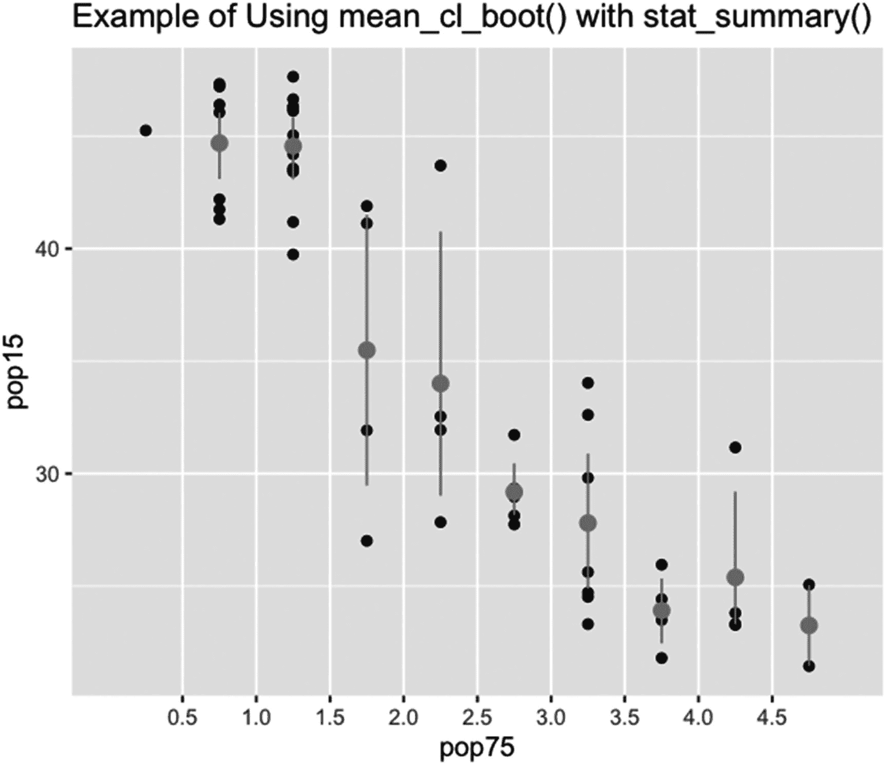
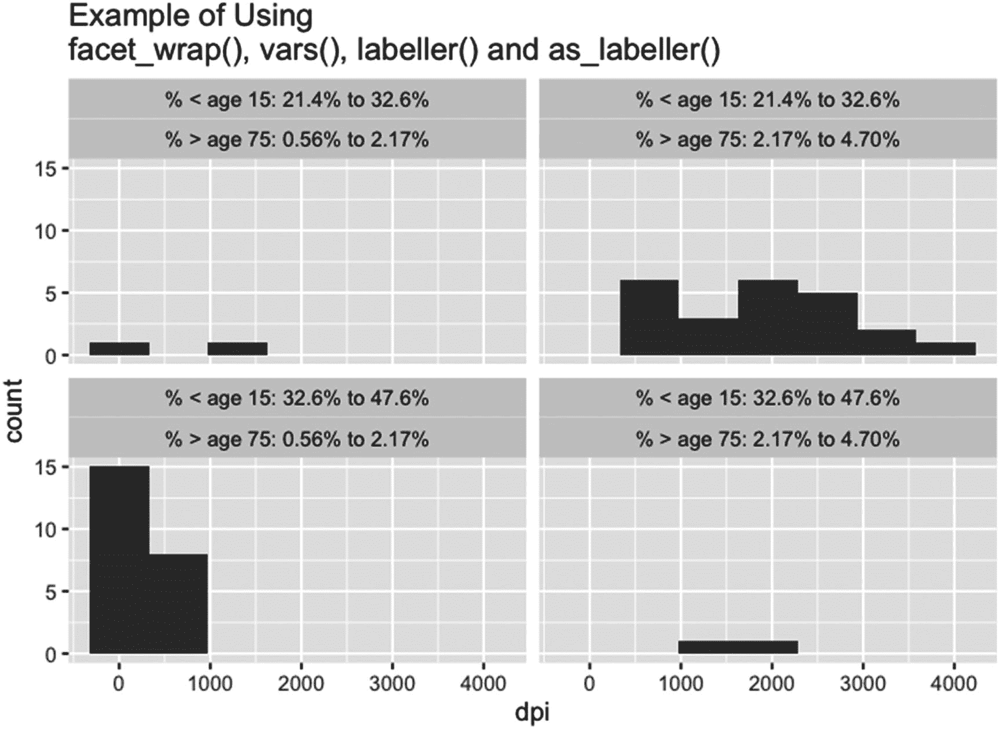

# 十、格式化和打印管理工具

本章介绍了选择绘图外观的多种方法、一些分组和计算工具、为特定对象类创建自动功能以及创建面向对象的原型功能。这一章分为三节。

第一部分概述了 scale_、coord_、guide_ 函数以及相关函数。第二部分介绍了将数据向量分成层次、汇总数据向量以及通过分面变量来分面数据向量的函数。第三部分介绍保存、绘图、打印和自动绘图的功能，以及创建面向对象的原型。

## 10.1 使用 scale_、coord_ 和 guide_ 功能

本节首先介绍 scale_ functions，它影响图周围和图内的颜色、大小、形状和线型。scale_ functions 为影响图中点和线外观的属性设置比例，还可以设置与比例相关的图例属性。

第二小节讲述如何控制影响外观的功能的应用顺序。第三小节是关于格式化轴，带有 scale_ 和 coord_ 函数。第四小节介绍 guide_ functions，它允许用户设置一个包含多个格式化函数的预设格式。

### 10.1.1 影响颜色、尺寸、形状和线型的比例函数

比例函数设置影响点和线的透明度、颜色、填充颜色、大小、形状或线型的值的比例。比例函数的名称采用 *scale_* 的形式，后跟特征名称(alpha、颜色、色彩、填充、线型、形状、半径或大小)，通常后跟限定符。

刻度通常应用于成组的点或线，但也可以应用于未分组的数据。对于数字数据，无论是否按组，可用的刻度类型为普通刻度或分级刻度。对于分级比例，将数值数据分级，并绘制分级属性。对于分类数据——无论是因子对象还是字符对象——只有离散标度可用。(Factor 对象可以通过函数 as.numeric()转换为数字对象。)

对于 ggplot2 包中的许多功能，这些功能没有帮助页面。相反，该函数的帮助页是另一个函数的帮助页，它给出了该函数的参数。例如，scale_alpha_date()会打开 scale_alpha()(以及其他一些不包含 scale_alpha_date()的 scale_alpha_ functions)的帮助页面。但是，scale_alpha_date()是一个函数，如果 scale 用于 date 类的向量，则可以调用它。本书只介绍带有帮助页面的功能。

大多数前述特征使用的两个限定符是 identity 和 manual。特性 alpha、颜色、色彩、填充、线型、形状和大小对于限定词 identity 和 manual 具有缩放功能。

注意，为了在比例函数中使用美学自变量，组自变量和/或特征自变量必须被设置为美学函数中的变量。美学函数必须在对前面的几何函数或统计函数的调用中。不应在 ggplot()中设置组参数和/或特征参数。

#### 身份限定符

标识限定符告知前面的几何或统计函数不做任何更改地解释特征参数的值。对于具有 alpha、线型、形状和大小特征的比例函数，具有标识限定符的比例函数有两个参数，…和 guide。对于具有颜色和填充特征的函数，函数有三个参数，…，guide 和 aesthetic。

参数…是函数 discrete_scale()或 continuous_scale()的参数。有关函数的参数列表，请参见这两个函数的帮助页面。这里不讨论这些参数。

自变量指南给出了秤使用的指南的名称(见第 10.1.4 节)。对于具有上述六个特征的比例函数，guide 的默认值为“无”。

参数美学给出了应用颜色、一种颜色(或多种颜色)或填充的美学类型。美学有四种可能的值:“颜色”、“填充”、c(“颜色”、“填充”)和 c(“填充”、“颜色”)。

如果在美学功能中设置了颜色和填充，则两者都可以在颜色、颜色或填充比例功能中设置。例如，`geom_point( aes( shape=shape, fill=shape-19, color=shape-17 ) ) + scale_shape_identity() + scale_fill_identity( aesthetic=c( "color", "fill" ) )`设置形状 21-24 的颜色和填充。这里，变量 shape 是一个整数向量，包含 21 到 24 之间的值，包括 21 和 24。

对于具有颜色(或色彩)特征的比例函数，美学参数采用默认值“色彩”。对于填充，美学采用默认值“填充”。

#### 手册限定符

带有手动限定符的比例函数手动创建比例。具有 alpha、线型、形状和大小特征的比例函数以及手动限定符有三个参数。参数是…，用于函数 discrete_scale()的参数；values，表示组成标尺的值；和断点，用于音阶的断点或级别。

在带有手动限定符的函数的帮助页面上(函数共享该页面，并且此处的信息来自该页面)，列出并描述了 discrete_scale()的参数。这里不讨论这些参数。

values 参数给出了与分组变量的每个级别或中断类相关联的特征值。参数采用特征采用的那种向量。向量的长度是分组变量中类的数量。值没有默认值。

形式上，values 参数的元素可以被命名，其中名称是显式的字符串。字符串必须包含与分组类相关联的字符串。(注意，在美学函数中，分组变量不能是数字。)例如，`geom_line( aes( linetype=cut( dpi, 2 ) ) ) + scale_linetype_manual( values=c( "(85,2.05e+03]"="dotted", "(2.05e+03,4.01e+03]"="dashed" ) )`将两个剪切类的名称分配给两种不同的线型。

breaks 参数提供了有关是否绘制图例的信息，以及如果打印图例，图例中包括哪些分组类的信息。该参数采用值 NULL、弃权()或包含与分组类相关联的所有字符串或字符串子集的字符向量。参数也可以采用创建字符向量的函数，但是分组类字符串和函数结果之间的匹配必须精确。

如果 breaks 设置为 NULL，则不绘制图例。如果 breaks 设置为等于弃权()，则绘制图例，并包括所有分组类别。如果 breaks 设置为等于分组类字符串的字符向量(或对创建字符向量的函数的调用),则图例中仅包含向量中存在字符串的分组类。休息的默认值是弃权()。

#### 阿尔法特性

除了那些带有标识或手动限定词的函数之外，用于特征 alpha 的函数是没有限定词的函数，以及带有连续、装箱、离散和顺序限定词的函数。所有的函数，除了 scale_alpha_discrete()，都有两个参数，…和 range。离散函数有一个参数，…

根据前面 alpha scale 函数的帮助页,……参数将参数传递给 continuous_scale()、binned_scale()或 discrete_scale()函数，具体取决于运行的 scale 函数。有关参数的列表和说明，请参见这三个函数的帮助页。

range 参数采用长度为 2 的数字向量。元素的值必须介于 0 和 1 之间，包括 0 和 1，并给出用于绘制形状或线条的颜色的透明度范围。值 0 表示完全透明，值 1 表示完全不透明。对于使用 range 的四个函数，range 的默认值是`c(0.1, 1)`。

#### 10.1.1.4 颜色、色彩和填充特征:简介

除了带有标识和手动限定词的比例函数之外，带有填充、颜色或特性颜色的比例函数是带有连续、色调、梯度、梯度 2、梯度 n、步骤、步骤 2、步骤 sn、酿造器、蒸馏器、发酵器、灰色、viridis_c、viridis_b 和 viridis_d 限定词的比例函数。色标有三种版本，非入库连续色标、入库连续色标和离散色标。默认情况下，未入库的连续刻度的图例有一个连续的颜色条。默认情况下，入库的连续刻度有一个带颜色步长的连续条。默认情况下，离散刻度有一个带有单独键的图例。

#### 10.1.1.5 颜色、色彩和填充特性:连续限定词

对于 scale_colour_continuous()和 scale_fill_continuous()，这些函数处理数值(连续)数据。这些函数有两个参数，…和 type。argument …接受 continuous_scale()函数的参数。(有关更多信息，请参见 continuous_scale()的帮助页面。)

在 scale_colour_continuous()的帮助页面中，type 参数采用值“gradient”、“viridis”或任何返回连续色标名称的函数。类型的默认值是颜色特性的`getOption("ggplot2.continuous.colour", default="gradient")`和填充特性的`getOption("ggplot2.continuous.fill", default="gradient")`。

#### 10.1.1.6 颜色、色彩和填充特性:色调限定符

scale_colour_hue()和 scale_fill_hue()函数创建离散的比例，而不是连续的比例，并使用因子或字符向量。这些函数接受八个参数:…，作为 discrete_scale()的参数；h，用于色调范围；c，对于色度等级；l，表示亮度水平；h.start，用于色调的起始值；方向，表示围绕色轮的方向；na.value，表示用于缺失值的颜色值；而审美，对于色彩的审美类型。(有关色调、色度和亮度的说明，请参见 3.4.1.3 一节中的 hsv()和 hcl()函数。)

h 参数采用两个元素的数值向量。第一个值是色调范围的最小值，第二个值是最大值。R 使用的值在 0 到 360 之间，包括 0 和 360；但是，为范围限制输入的值是缩减模数 360，即 15–375 的范围是从 15 回到 15 的循环。(请注意，色调比例是圆形的，而不是线性的，也就是说，该比例在 360°的范围内返回到起始颜色。)对于带有色调限定符的两个函数，h 的默认值都是`c(0, 360) + 15`。

c 参数接受一个一元非负数值向量。根据色调功能的帮助页面，可能的值取决于色调和亮度的值。这两个色调函数的默认值是 100。

l 参数采用一个单元素数值向量，其值介于 0 和 100 之间，包括 0 和 100。这两个色调函数的默认值是 65。

h.start 参数采用一个元素的数值向量。两个色调函数的默认值都是 0。

方向参数采用一个元素的数值向量。该值必须是 1 或-1。如果设置为 1，将围绕色轮逆时针方向选择色调。如果设置为-1，则方向为顺时针。两个色调函数的方向默认值都是 1。

na.value 参数采用单元素颜色值向量(参见第 3.4.1 节了解颜色值的种类)。对于两种色调功能，na.value 的默认值都是“灰色 50”。

美学论证的行为与颜色和填充的同一性标度函数中的行为相同(参见第 10.1.1.1 节)。颜色色调功能的默认值为“颜色”,填充色调功能的默认值为“填充”。

#### 10.1.1.7 颜色、色彩和填充特征:渐变限定词

具有填充、颜色和颜色特征的比例函数以及渐变、渐变 2 和渐变 n 限定符用于连续变量。根据限定符是 gradient、gradient2 还是 gradientn，函数有七个、九个和八个参数。这九个函数共有五个参数。这五个参数是…，用于函数 continuous_scale()的参数；空间，为色彩空间；na.value(见第 10.1.1.5 节)；指南，为指南的名称使用；和美学(见 10.1.1.1)。

space 参数只接受一个可能的值。值为“Lab”。根据九个函数的帮助页面，其他色彩空间已被否决。

guide 参数采用一个单元素字符向量。只有两个值是可能的，“colourbar”代表连续刻度，“legend”代表离散刻度。九个功能的默认值是“colourbar”。

带有渐变限定符的函数也接受低和高参数，用于刻度两端的颜色。参数采用长度为 1 的颜色值向量。低和高的默认值分别为`"#132B43"`和`"#56B1F7"`，即刻度从深蓝色变为清晰的中蓝色。

带有 gradient2 限定符的函数将参数 low 和 high 与参数 mid 一起作为刻度中间的颜色。低、中和高的默认值分别为`muted("red")`、`"white”`和`muted("blue”)`。

三个 gradient2 函数也采用中点参数，表示标尺的中点，以创建标尺的变量的单位来度量。中点的默认值为 0。

带有 gradientn 限定符的函数也采用 colors(或等效的 colors)参数，用于标度中要使用的颜色，以及 values 参数，用于——根据函数的帮助页面——每种颜色从 0 到 1 的连续体的距离。

colors(或 colors)参数采用任意长度的颜色值向量(有关颜色值的信息，请参见第 3.4.1 节)。这些颜色用于生成连续的刻度。颜色没有默认值。

values 参数接受 NULL 值或与 colors(或 colors)长度相同的唯一值的数值向量。值必须介于 0 和 1 之间，包括 0 和 1。values 的默认值为 NULL。

#### 10.1.1.8 颜色、色彩和填充特性:步骤限定符

具有颜色、色彩和填充特性以及 steps、steps2 和 stepsn 限定符的比例函数以分级的方式创建比例。这些函数适用于连续变量。

九个阶跃函数的自变量与九个梯度函数的相应自变量相同。参数也采用与九个渐变函数相同的默认值，只是在九个阶跃函数中，guide 的默认值是“coloursteps”。

#### 10.1.1.9 颜色、色泽和填充特性:啤酒厂限定条件

具有颜色、色彩和填充特性的秤功能以及具有酿造器、蒸馏器和发酵罐限定符的秤功能共享一个帮助页面。具有 brewer 限定符的三个函数用于离散变量。具有蒸馏器和发酵器限定符的六个函数分别用于未入库的连续变量和入库的连续变量。

酿造器、蒸馏器和发酵器函数分别有五个、九个和七个参数。这九个函数共有五个参数。参数为…，分别用于 discrete_scale()、continuous_scale()和 binned_scale()函数。type，为刻度的样式；调色板，用于标尺的调色板；方向(见第 10.1.1.6 节)；和美学(见第 10.1.1.1 节)。

类型参数接受一个长度为 1 的字符向量。在九个功能的帮助页面中，对于连续秤，类型值必须为“seq”之一；“div”，用于发散音阶；和“qual”，用于定性标度(有关三种类型的说明，请参见帮助页面)。在九个函数中，类型的默认值是“seq”。

palette 参数采用一个元素字符向量或一个元素数字向量。对于字符向量，字符串是用引号括起来的调色板名称。调色板名称的列表位于函数的帮助页面上，在名为“调色板”的部分下整数可用的调色板取决于 type 的值。

对于等于“seq”的类型集，有 18 个选项板可用，因此参数选项板可以取 1 到 18 之间的整数值。对于等于“div”的类型集，有九个调色板可用，因此参数调色板可以取 1 到 9 之间的整数值。对于等于“qual”的类型集，有八个调色板可用，因此调色板可以取从 1 到 8 的整数值。通过将 palette 参数设置为用引号括起来的调色板名称，可以访问任何调色板。这种选择不依赖于 type 的值。这九个函数的调色板默认值是 1。

对于不同的限定符，方向参数有不同的默认值。对于 brewer 限定符，方向默认设置为 1。对于蒸馏器和发酵器限定符，方向默认设置为-1。

对于带有 distiller 限定符的函数，前面文本中未涉及的四个参数是值、空格、na.value 和 guide——这些将在第 10.1.1.6 和 10.1.1.7 节中介绍。参数值、空间和 na.value 采用与渐变比例和色调比例函数中相同的默认值。参数指南采用值“colourbar”。

对于带有发酵罐限定词的函数，brewer 限定词中未涉及的两个参数是 na.value 和 guide–在第 10.1.1.6 和 10.1.1.7 节中涉及。na.value 的默认值与前面的值相同，guide 的默认值为“coloursteps”。

#### 10.1.1.10 颜色、色彩和填充特性:灰色限定词

函数 scale_colour_grey()和 scale_fill_grey()处理离散数据(字符或因子数据),并创建灰度等级。这些函数有五个参数。参数是…，对于 discrete_scale()的参数；开始和结束，用于灰度的开始和结束值；na.value(见第 10.1.1.6 节)；和美学(见第 10.1.1.1 节)。

开始和结束参数采用一个元素的数字向量。值必须介于 0 和 1 之间，包括 0 和 1。该值越小，灰色阴影越暗。“开始”和“结束”的默认值分别为 0.2 和 0.8。

na.value 参数采用两个灰色函数中的默认值“red”。美学变量的行为与第 10.1.1.1 节中的参数行为相同。

#### 10.1.1.11 颜色、色彩和填充特性:绿色限定词

特征为 color、color 和 fill 的函数以及限定符 viridis_c、viridis_b 和 viridis_d 分别用于连续无仓秤、连续有仓秤和离散秤。九个功能中的每一个都有五个版本的色标，适用于许多看不到某些颜色(患有色盲)的人，因为色标与灰度色标一样有效，因为色标的功能与色标一样有效。

viridis_c 函数和 viridis_b 函数采用相同的 11 个参数。viridis_d 函数有七个参数，与 viridis_c 和 viridis_b 函数共享。

前七个参数是…，分别是 continuous_scale()、binned_scale()和 discrete_scale()函数的参数，具体取决于选择了哪个 viridis 函数；α，为透明度水平；begin，表示音阶的起始音级；end，表示标尺的结束级别；方向(见第 10.1.1.6 节)；选项，用于配色方案；和美学(见第 10.1.1.1 节)。

alpha 参数采用长度为 1 的数字向量。该值必须介于 0 和 1 之间，包括 0 和 1。alpha 的默认值是 1。

begin 和 end 参数采用长度为 1 的数字向量。值必须介于 0 和 1 之间，包括 0 和 1。begin 和 end 的默认值分别为 0 和 1。

第 10.1.1.6 节描述了方向参数。九个 viridis 函数的默认值是 1。

选项参数采用长度为 1 的字符向量。字符向量可以是大写字母，也可以是名称。在维里迪斯函数的帮助页面中，可能的值为“A”或“岩浆”、“B”或“地狱”、“C”或“等离子体”、“D”或“维里迪斯”以及“E”或“文明”。对于九个 viridis 函数，选项的默认值为“D”。

具有 viridis_c 和 viridis_b 性质的函数的最后四个参数是值、空间、na.value 和 guide，这将在第 10.1.1.6 和 10.1.1.7 节中介绍。values、space 和 na.value 的默认值分别为 NULL、“Lab”和“grey50”。guide 的默认值是 viridis_c 函数的“colourbar”和 viridis_b 函数的“coloursteps”。

#### 线型特征

除了带有标识和手动限定词的线型函数之外，线型比例函数还有 scale_linetype()、scale_linetype_continuous()、scale_linetype_binned()和 scale_linetype_discrete()。函数 scale_linetype_continuous()和 scale_linetype_binned()需要数字数据。函数 scale_linetype_discrete()需要离散数据。

根据尝试在 geom_line()、geom_path()、geom_curve()和 geom_segment()中将线型设置为连续对象时返回的错误消息，线型不能设置为等于美学函数中的数值数据。如果使用前面的比例函数运行 geom_line()和 geom_path()，这些函数将返回错误。

如果使用 scale_linetype()或 scale_linetype_continuous()运行 geom_segment()和 geom_curve()，则会出现错误。如果使用 scale_linetype_binned()运行，函数将运行，但无法设置线型。(若要设定线型，请使用 scale_linetype_identity()。)

函数 scale_linetype()和 scale_linetype_discrete()为离散数据提供了相同的结果。这些函数可用于设置离散(字符或因子)变量的图例格式。

函数 scale_linetype()、scale_linetype_binned()和 scale_linetype_discrete()采用相同的参数。参数有…，表示 discrete_scale()函数的参数，以及 na.value，表示为缺失值指定的值。对于这三个函数，na.value 的默认值为“空白”。

#### 形状特征

具有形状特征的比例函数，除了具有限定符 identity 或 manual 的形状函数之外，还有 scale_shape()和 scale_shape_binned()。这些函数用于将形状(符号)分配给点。函数 scale_shape()处理离散数据。函数 scale_shape_binned()处理数字数据。

与 plot()相关联的函数有 25 种形状可用(可以分配给 pch 的整数)。在 ggplot2 函数中，有多种方法可以使用 25 个符号中的任何一个。(例如，`geom_point( aes( shape=( 1:25 )[ cut( dpi, 25 ) ] ) ) + scale_shape_identity()`可用于绘制生命周期保存数据集中 50 个点的 25 级 dpi。单个字母也可以用同样的方式。)但是，默认情况下，ggplot2 函数仅使用六个形状，前三个形状有两个版本——实心和轮廓。这些形状是圆形、正方形、三角形、十字形、内部带有对角线十字形的正方形和星号。

两个函数都采用相同的两个参数。参数有…，用于函数 discrete_scale()的参数，以及 solid，用于将圆、三角形和正方形绘制为纯色还是轮廓。

实参 solid 取一个长度为 1 的逻辑向量。如果设置为 TRUE，则绘制实心符号。如果设置为 FALSE，则绘制形状轮廓。solid 的默认值为 TRUE。

#### 尺寸和半径特征

大小和半径特征的比例会影响点和线的大小。有五个具有大小或半径特征的比例函数:scale_radius()、scale_size_area()、scale_size()、scale_size_binned_area()和 scale_size_binned()。具有半径特征的比例函数线性地调整大小。缩放功能具有按面积缩放的尺寸特征(与半径的平方成比例)。这五个函数处理数值数据(连续数据)。

scale_size_area()和 scale_size()之间的区别在于 scale_size_area()的缩放比例使得 0 的值缩放到零。scale_size()函数不起作用。带有面元限定符的函数在绘制点或线之前为数据创建面元。(以上信息来自五个函数的帮助页面，这些函数共享这五个功能。)

scale_radius()和 scale_size()函数有相同的七个参数，具有相同的默认值。scale_size_binned()函数还有两个参数，并有一个不同的默认值。scale_size_area()和 scale_size_binned_area()函数有两个参数，这两个函数中的参数都相同，包括第二个参数的相同默认值。

前三个函数的七个参数是 name，如果有图例，则是图例的标题；课间休息，用于图例中的类级别；标签，用于图例中的类级别标签；极限，图例的下限和上限；范围，用于绘图和图例中的点或线尺寸范围；trans，表示要应用于数据的转换；和指南，用于图例中的刻度样式。

name 参数接受一个值 NULL、一个任意长度的字符向量和一个返回有效对象的函数。如果名称设置为空，则不打印标题。如果是字符向量，只使用第一个元素。如果 size 是第一个或唯一的美学设置，那么前面三个 scale 函数中 name 的缺省值是弃权()函数，即参数 size 的设置值。

breaks 参数采用 NULL、任意长度的数字向量、弃权()函数和采用极限(见下文)并返回断点的函数之一。如果该值为空，则不绘制图例。如果该值是一个数字向量，则这些数字是相对于美学函数中 size 设置的值而言的。如果某些分隔点超出数据范围，则不会绘制与分隔点相关联的关键字或框线–除非设置了 limits 参数(参见下文),并且分隔点在该参数设置的限制范围内。在前三个比例函数中，中断的缺省值是弃权()，也就是说，R 根据参数 trans 的值选择中断(参见下文)。

labels 参数采用 NULL、弃权()函数、与 breaks 长度相同的字符向量以及采用 breaks 值并返回 labels 字符向量的函数之一。对于前三个尺度函数，labels 的缺省值是弃权()，即 R 根据 trans 的值计算好的标签。

limits 参数采用 NULL、两个元素的数值向量和访问默认限制并使用默认限制创建新限制的函数之一。如果设置为 NULL，则使用默认限制。如果设置为数字向量，这两个值将给出刻度的下限和上限。根据帮助页面，可将 NA 值分配给限值，以使用限值的当前值。对于前面三个比例函数，限值的默认值为空。

range 参数采用两个元素的数值向量。这些数字给出了被缩放的点或线的最小和最大尺寸。对于前面三个函数，range 的默认值是`c(1, 6)`。

trans 参数接受一个单元素字符向量或一个值的转换对象。根据 size 和 area 函数的帮助页，transformation 对象是一种使用变换(如取幂)和变换的逆变换来创建断点和标签向量的函数。

如果 trans 参数是字符向量，则字符向量必须包含转换的名称，如“log10”或“exp”。转换必须存在转换对象。(有关存在转换对象的转换名称以及转换对象名称的列表，请参见 size 和 radius 函数的帮助页。转换对象也可以在 scales 包中找到。)

可以使用 scales 包中的函数 trans_new()创建一个新的转换对象。转换对象的名称具有格式 *transformation* _trans，其中 transformation 是转换的名称，trans 是扩展。

对于前面三个比例函数，trans 的默认值为“相同”。标识转换不对数据进行任何转换。

guide 参数接受一个单元素字符向量或 guide 函数的输出(请参见下文)。scale_radius()和 scale_size()的 guide 默认值为“legend”。

scale_size_binned()函数采用另外两个参数:n.breaks，表示 bin 断点的数量 nice.breaks，表示是否创建好看的断点(例如，1000 而不是 1002.06)。除非 nice.breaks 参数设置为 FALSE，否则并不总是遵循 n.breaks 参数。

n.breaks 参数接受 NULL 值或一个元素的数值向量。n.breaks 的默认值为 NULL，也就是说，转换对象决定了断点的数量。

nice.breaks 参数采用一个元素逻辑向量。如果设置为 TRUE，会找到好看的断点。如果设置为 FALSE，则通过更简单的方法设置断点，而不考虑断点的外观。nice.breaks 的默认值为 TRUE。

scale_size_binned()函数具有不同的 guide 默认值。向导的默认值是“箱”。

对于 scale_size_area()和 scale_size_binned_area()函数，参数为…，表示 continuous_scale()函数的参数，参数为 max.size，表示点或线的最大大小。两种缩放功能的最大尺寸默认值均为 6。

### 设定评估顺序

可以在几何函数中使用 after_stat()、after_scale()和 stage()函数来设置美学参数的求值顺序。当使用前述函数之一时，美学自变量被设置为等于几何函数的美学函数内的前述函数。

大多数几何函数利用统计函数。通过使用 after_stat()，统计函数创建的变量可用于计算美学参数的值。

after_scale()函数可用于根据已经设置的美学参数计算美学参数的新值。美学上的争论可以用在等式的两边。

stage()函数允许以多种方式缩放美学，既可以在统计函数完成之后，也可以在初始缩放完成之后。

根据这三个函数的帮助页面，如果使用 after_stat()，则只有那些由统计函数创建的参数或在调用 ggplot()的环境中的参数才能用于创建美学参数的值。数据框中的变量不可用。after_scale()函数只能使用应用初始美学创建的变量或父环境中的变量。对于 stage()，数据框中的变量只能在函数的第一个参数中使用。

after_stat()和 after_scale()函数都接受一个参数 x，用于为美学创建值的公式。这两种功能都可以应用多次。清单 [10-1](#PC1) 中给出了两次使用 after_scale()的例子。

```r
ggplot(
  data.frame(
    LifeCycleSavings[ ord, ][ 1:49, ],
    LifeCycleSavings[ ord, ][ 2:50, ]
  ),
  aes(
    pop75,
    pop15,
    xend=pop75.1,
    yend=pop15.1
  )
) +

geom_segment(
  aes(
    group=cut(
      dpi.1,
      6
    ),
    color=after_scale(
      grey(
        ( group+1 )/9
      )
    ),
    size=after_scale(
      group-0.5
    )
  )
)

Listing 10-1Code showing an example of using after_scale() twice in one geometry function. Since two aesthetics are used for the variable, a warning is given when the code is run

```

请注意，线段的颜色和大小都基于 group 的值。提出警告，这两种美学是建立在同等尺度上的。

stage()函数有三个参数。参数为开始，用于 ggplot()或几何数据框中变量的函数，统计函数或缩放函数通过其进行操作；after_stat，用于由统计函数创建的变量的函数；和 after_scale，用于美学变量的函数。三个参数的默认值为 NULL。在清单 [10-2](#PC2) 中，给出了一个使用 stage()的例子。

```r
ggplot(
  LifeCycleSavings,
  aes(
    pop75
  )
) +

geom_histogram(
  aes(
    color=cut(
      dpi,
      10
    ),
    fill=stage(
      cut(
        dpi,
        10
      ),
      after_scale=alpha(
        fill,
        0.6
      )
    )
  ),
  bins=10
)

Listing 10-2An example of using stage() to set fill colors in a histogram is given

```

请注意，舞台被分配的美感是填充，并且填充颜色通过在填充上使用 alpha()函数而变亮。美学参数颜色设置为完全相同的颜色。(该示例基于三个函数的帮助页面上的示例。)

### 10.1.3 用刻度和坐标功能格式化轴，加上一些

特征为 x 或 y 的比例函数和坐标函数都在图的轴上运行。根据函数的帮助页面，比例函数在几何函数使用的统计函数运行之前运行。坐标功能在统计功能运行后运行。对于散点图，除了刻度线不同之外，两者给出的结果相同。

x 和 y 刻度函数具有连续、分仓、离散、反向、log10、sqrt、日期、时间和日期时间限定符。坐标函数以 *coord_* 开头，具有笛卡尔坐标、固定坐标、翻转坐标、地图坐标、快速地图坐标、蒙克坐标、极坐标、sf 坐标和平移坐标特征。

#### 秤的功能

带有连续限定词的 scale 函数给出了连续的 x 或 y 美学的常用比例(数字和未入库)。装箱限定符为连续的 x 或 y 美学创建箱，并在箱的中心绘制点。带有连续和分段限定词的比例函数仅在 x 和 y 美学连续的情况下运行。带有离散限定词的缩放功能可在连续和离散的 x 和 y 美学上运行，但不提供连续美学的轴刻度或轴刻度标签。

带有 reverse 限定符的 scale 函数反转轴的顺序。带有 log10 限定符的 scale 函数将轴的比例转换为基数为 10 的对数比例，并相应地更改绘制的几何图形。对于 log10 限定符，x 或 y 的所有值都必须是正数。带有 sqrt 限定符的 scale 函数将轴转换为 x 或 y 中值的平方根，并相应地更改绘制的值。x 或 y 的所有值都必须是非负的。

带有日期限定符的 scale 函数创建一个带有日期值的刻度。对于日期刻度函数，x 或 y 美学参数必须属于 Date 类。带有 datetime 限定符的 scale 函数创建一个带有日期和时间值的小数位数。美学参数 x 或 y 必须属于 POSIXct 类。

带有时间限定符的 scale 函数创建一个带有时间值的刻度。x 或 y 美学必须是数字，并转换为 hms 类的格式(即 hh:mm:ss，其中 hh 是小时，mm 是 00 到 59 之间的分钟，ss 是 00 到 59 之间的秒)。hms()函数可用于将数字数据格式化为 hms 类。如果没有进行格式化，数字数据将被解释为秒。小时数没有上限。这些值可以是负数。

#### 坐标功能

坐标函数都影响两个轴，除了函数 coord_trans()也只能影响一个轴。这些函数转换轴的坐标。

函数的作用是:创建笛卡尔(线性)坐标。函数 coord_fixed()给出一个图，其中 x 轴上的单位与 y 轴上的单位成固定比例，与图形设备的大小无关。比率由比率参数给出，默认设置为 1。

函数的作用是:翻转坐标轴。函数的作用是:创建经度和纬度的坐标。地图特征函数的六个参数中的三个是投影，用于地图投影的类型；xlim，用于纵向极限；和 ylim，纬度界限，假设通常的方向。

函数使用极坐标。该函数的四个参数中有三个是θ，即 x 或 y 中的哪一个用作角度；start，以弧度表示起始角度，在绘图顶部为 0；和方向，表示围绕绘图的方向-值 1 表示顺时针方向，值-1 表示逆时针方向。

极坐标转换绘制了赋给 theta 的变量的相对大小(360 度),并忽略了值的绝对大小(标签中的数字除外)。另一个变量给出了θ中每个值的半径。

函数的作用是:为简单的特征数据创建坐标。简单要素是空间数据。

根据 coord_munch()的帮助页面，该函数用于几何函数中。该函数将轴上的坐标分成小块，以便更清晰地绘制矢量。

coord_trans()函数通过一个函数提供一个或两个轴的手动变换。参数 x 和/或 y 被设置为等于引号中的函数名或转换对象。转换可以由用户生成。有关转换名称和转换对象的更多信息，请参见第 10.1.1.14 节。

#### 其他轴功能

还有一些其他功能会影响轴。xlab()和 ylab()函数可用于手动设置轴标签。lims()、xlim()和 ylim()函数可用于设置美学变量或轴的限制。expansion()和 expand_scale()函数用作 scale 函数中 expand 参数的值。这些函数计算在轴和图之间放置给定大小的区域所需的轴限制。

dup_axis()和 sec_axis()函数用作 x 和 y 刻度函数中 sec.axis 参数的值。这些函数格式化与原始轴相对的第二个轴。函数的作用是:复制原始轴。sec_axis()函数基于原始轴的刻度的一对一转换创建一个新轴。

xlab()和 ylab()函数有一个参数 label，用于包含标签的字符串。(也可以通过设置参数名称在比例函数中分配标签。)

lims()函数采用命名的二元向量，其中的名称具有美学意义(例如，x=c(5，20))。向量可以是数字、字符、因子、日期、POSIXct 或 hms 类，这取决于美学参数的类。在对 lims()的调用中，向量用逗号分隔。

函数 xlim()和 ylim()接受两个单一的数值，给出 x 或 y 轴的下限和上限。这些功能适用于数字(连续)轴。

expansion()和 expand_scale()函数具有相同的参数。参数有 add 和 mult，前者表示要在扩展区域的轴上加减的值，后者表示乘法扩展因子。

dup_axis()和 sep_axis()函数有相同的五个参数。这些参数是 trans(参见第 10.1.1.14 节)、name、breaks、labels 和 guide。(有关四个参数的说明，请参见 continuous_scale()、binned_scale()或 discrete_scale()的帮助页面——帮助页面的功能取决于秤的类型。)在 sec_axis()和~中 trans 的默认值为 NULL。在 dup_axis()中。名称、中断、标签和参考线的默认值是 sec_axis()中的弃权()和 dup_axis()中的派生()。

### 10.1.4 引导和绘制键功能

引导功能用于格式化轴的属性或缩放变量的键(例如，图例或颜色条)。大多数导向功能都在比例功能中使用。(引导参数出现在 continuous_scale()、binned_scale()和 discrete_scale()的参数列表中。)绘制键函数给出图例中使用的键的样式。

#### 指南的功能

ggplot2 包中支持九个引导函数，不支持五个引导函数，但它们是存在的。在这九个函数中，有一个函数 guide_axis()为轴提供结构化。两个是彩色/彩色复制品。四个结构缩放变量的关键。这四个是 guide_legend()、guide_colorbar()、guide_colorsteps()和 guide_bins()。一个函数 guide_none()不给出图例或轴刻度线和刻度线标签。guides()函数在一个对象中组合了多个参考线。

在比例函数中，通过将自变量引导设置为引号中的名称或完整函数(如`guide=“bins”`或`guide=guide_bins()`)来设置函数。有关函数的参数列表，请参见向导函数的帮助页面。

##### 影响轴的参考线

guide_axis()函数有六个参数。这些参数设置轴标签、轴刻度标签重叠时如何处理、标签的角度、轴并排的位置以及绘制轴的顺序。

guide_none()可用于 x 和 y 缩放功能。该函数用于分配不带刻度线或刻度线标签的轴标签。轴标签被分配给 title 参数。标签的位置可以用 position 参数指定，方法是将该参数设置为" bottom "、" left "、" top "或" right "。

##### 影响缩放变量关键点的指南

guide_none()函数在与非轴缩放函数的缩放函数一起使用时，可用于抑制缩放变量的键。guide_legend()函数为缩放变量(通常是美学参数的函数)设置一个图例。guide_bins()函数设置了一个由不同步骤组成的条带，在这些步骤的交叉处显示不同的级别。这些步骤是块中的关键点。函数 guide_colorsteps()是 guide_bins()的一个版本，它的键是用标尺颜色填充的矩形。这三个函数可用于未入库的连续(数字)数据、入库的连续(数字)数据和离散(字符或因子)数据。

guide_colorbar()函数只能用于连续数据(未入库或已入库)。对于未入库的连续数据，该函数绘制连续的分级色标。标度标有标度变量的递增或递减级别。对于分级秤，guide_colorbar()的行为类似于 guide_colorsteps()。

guides()函数用于轻松地为绘图分配一组参考线。指南没有指定的参数。相反，每个参考线都被分配给应用该参考线的美学论点，并且每个参考线都用逗号与其他参考线隔开。可以为结果指定一个名称。然后，可以在添加到 ggplot()的函数中使用该名称。该名称被添加到几何或统计函数中，不包括括号。不需要缩放功能。在清单 [10-3](#PC3) 中，给出了一个使用指南()的例子。

```r
gd=guides(
  size=guide_legend(
    title="dpi"
  ),
  color=guide_legend(
    title=NULL
  )
)

ggplot(
  LifeCycleSavings,
  aes( pop75, pop15 )
) +

geom_point(
  aes(
    size=as.numeric(
      as.factor(
        cut( dpi, 5 )
      )
    ),
    color=after_scale(
      grey( (size+1)/12 )
    )
  )
) + gd

Listing 10-3An example of code for setting up a set of guides using the function guides()

```

在清单中，引导首先被分配给一个名为 gd 的对象。设置绘图后，通过在几何函数后包含名称 gd 来运行引导。请注意，标尺函数中没有设置参考线。

#### 绘制键功能

有 16 个绘图键功能。这些函数的名称以 *draw_key_* 开头，后面是一个几何图形的名称。可用的几何名称包括点、直线、矩形、多边形、空白、箱线图、纵横图、路径、vpath、点图、点范围、平滑、文本、标签、vline 和时间序列。(请注意，vpath 不是列出的几何图形，而是包含在 draw_key 帮助页面的列表中，此处的信息来自该页面。)

几何和统计功能会自动指定键样式，但默认键样式可以更改。draw key 函数被分配给 geometry 和 statistic 函数中的 key_glyph 参数。(key_glyph 参数在 layer()函数中。几何和统计函数都调用 layer()函数。)

赋值的形式要么是带引号的几何图形名称，要么是不带括号且不带引号的总函数名称(如`key_glyph="abline"`或`key_glyph=draw_key_abline`)。

## 10.2 剪切、汇总和分面的功能

切割函数离散化连续(数字)向量。facet 函数绘制几个图，其中每个图包含与分组变量的值相关联的数据。汇总函数给出数字向量的汇总，可以按组完成。大多数汇总函数可以绘制在分组(或未分组)数据上。

ggplot2 包中有三个切割函数、三个刻面函数和五个汇总函数。(摘要函数基于 Hmisc 包中的函数和 Hmisc 包的依赖项。)还有一个名为 resolution()的函数，它给出了一个数值向量的分辨率(不同数字之间的最小差值)。

### 切割功能

ggplot2 包中的三个切割函数是 cut_interval()、cut_number()和 cut_width()。这些函数基于基本函数中的 cut()函数，可以使用 cut()的参数以及帮助页面上列出的三个函数的参数。这三个函数的第一个参数是 x，用于将数值向量切割成离散因子级别。

cut_interval()函数根据 n(等长间隔的数量)或 length(等长间隔的长度)将数据范围分割成多个间隔。如果选择了 n 参数，则间隔的宽度是数值向量的范围除以 n。

如果选择了 length 参数，则参数长度不一定平均划分到数据向量的范围内。该函数确定间隔的起始值。n 和 length 都采用一个元素的数值向量。

cut_number()函数有一个参数 n，表示间隔的数量。该函数的行为类似于选择 n 的 cut_interval()。

函数提供了更多的灵活性。除 x 之外的指定参数是 width，表示间隔的宽度；中心，为第一个音程的中心；边界，用于第一个间隔的开始；和 closed，用于是关闭左边的还是右边的区间(关闭边界意味着区间的关闭边界上的数据点被包括在区间中)。

宽度、中心和边界参数采用单元素数值向量。宽度没有默认值。中心和边界的默认值为空。

封闭参数采用单元素字符向量，值必须是“left”或“right”。默认值为“右侧”，即间隔在右侧关闭。

### 10.2.2 汇总函数和 resolution()函数

ggplot2 包中的汇总函数与 stat 汇总函数一起使用，即以 *stat_summary* 开头的函数。stat 汇总函数采用 fun 参数，汇总函数可以分配给该参数。四个汇总函数基于 Hmisc 包中的函数，必须安装 Hmisc 包才能运行这些函数，但不需要加载。这些函数是 mean_cl_boot()、mean_cl_normal()、median_hilow()和 mean_sdl()。第五个函数是 mean_se()。在本节的最后，将介绍函数 resolution()。

汇总函数都有两个参数:x，表示要汇总的数值向量，以及…，表示 Hmisc 包中函数的参数，这些函数的名称前面都有字母 s，这些函数都返回长度为 3 的数据帧。data.frame 元素的名称是 y、ymin 和 ymax。

mean_cl_boot()和 mean_cl_normal()函数分别基于引导数据或正态分布(使用 t 分布的分位数)给出数据的平均值和平均值的置信区间。median_hilow()函数根据置信度给出数据的中值以及数据的上下经验分位数。对于这三个函数，置信区间的级别由参数 conf.int 设置，默认情况下取值为 0.95。

mean_sdl()和 mean_se()函数返回数值向量的平均值，该平均值减去一个常数乘数乘以向量的标准偏差或平均值的标准误差，再加上一个常数乘数乘以向量的标准偏差或平均值的标准误差。对于 mean_sdl()，使用向量的标准偏差。对于 mean_se()，使用平均值的标准误差。在这两个函数中，乘数都是用 mult 参数设置的。默认情况下，mean_sdl()的 mult 值为 2，mean_se()的 mult 值为 1。

在清单 [10-4](#PC4) 中，给出了图 [10-1](#Fig1) 中示例的代码。代码和图形显示了函数 mean_cl_boot()的使用及其默认值。



图 10-1

使用 mean_cl_boot()与 stat_summary()和 scale_x_binned()在条柱内的散点图上绘制汇总统计数据的示例

```r
ggplot(
  LifeCycleSavings,
  aes(
    pop75,
    pop15
  )
) +

geom_point(
) +

labs(
  title="Example of Using mean_cl_boot() with stat_summary()"
) +

scale_x_binned(
) +

stat_summary(
  fun.data = "mean_cl_boot",
  colour = "grey60",
  size = 0.5
)

Listing 10-4The code for the example in Figure 10-1 of using mean_cl_boot() in stat_summary()

```

在图 [10-1](#Fig1) 中，运行清单 [10-4](#PC4) 中的代码。摘要统计数据以中灰色显示。

请注意，scale_x_binned()用于绑定 pop75 值。平均值和置信区间是每个箱内的 pop15 值。平均值和置信区间为中灰色。绘制的数据点是黑色的。

resolution()函数计算一个数字向量的分辨率。分辨率是向量中相邻值之间的最小差值。如果两个相邻值相同，则分辨率设置为 1。函数 resolution()有两个参数:x 表示数值向量，零表示是否在向量中自动包含值 0。

x 参数接受任意长度的数值向量。零参数采用一个元素逻辑向量。如果设置为 TRUE，向量将被加上 0。如果设置为 FALSE，则不添加 0。默认值零为真。

### 刻面功能

分面函数基于将一个或多个分组变量应用于数据框中的矢量来创建多个图。图中使用的数据来自给定的数据向量，但没有图与另一个图共享数据，向量中的所有数据都被绘制。有三个 facet 函数，facet_null()、facet_wrap()和 facet_grid()。

还有一些函数用于为 facet_wrap()和 facet_grid()函数中的参数创建值。vars()函数引用分组变量，其行为类似于 aes()函数。该函数与 facet_wrap()中的参数 facets 以及 facet_grid()中的参数 row 和 col 一起使用。还有一些函数与参数标注器一起使用(参见下文)。

facet_null()函数是用于绘制单个面板的函数。该函数是在未调用 facet_wrap()和 facet_grid()时默认调用的函数。该函数使用一个参数 shrink 来表示是否将图缩小到统计函数(如果调用了统计函数)或与几何函数关联的统计函数(如果调用了几何函数)的输出尺寸。shrink 的默认值为 TRUE，即进行收缩。

facet_wrap()函数获取一个绘图向量(小平面),默认情况下，从左到右绘制它们。当函数确定新行是合适的时，开始新行。第一个参数是 facets，这是一个或多个变量，用于对数据进行分面。参数值的形式可以是 vars( var1)、" var1 "、~ var1、vars( var1、var2、var3)、var2 ~ var1、~ var1 + var2、c( "var1 "，var2)和 var3 ~ var1 + var2，其中 var1、var2 和 var3 是分面变量的名称，是数据框中的变量，或者是基于数据框中变量的表达式。如果使用了函数 labeller()，那么应该为表达式变量指定一个名称。

可以指定行数和/或列数，但必须有足够的空间来容纳小平面图的总数。否则，会发生错误。绘图方向可以从左到右改为从上到下。小平面图标签的位置可以从每个图的顶部更改到每个图的任何其他侧边。

函数的作用是:创建一个矩阵图。前两个参数是 rows 和 cols，用于放置在行和列中的变量。可以指定其中之一或两者。参数行可以采用与 facet_wrap()中的参数方面相同类型的值。参数 cols 必须设置为 NULL 或变量名和/或表达式，用 vars()函数括号括起来，并用逗号分隔。

行的值的级别沿着列向下，列的值的级别穿过行。默认情况下，行的方面标签位于右侧，列的方面标签位于顶部。

可以选择绘图是否应该是相同的大小，是否将行和/或列刻面标签切换到底部和/或左侧，以及是否绘制边界绘图。可以绘制行边距、列边距或两者都有。

函数 facet_wrap()和 facet_grid()共享五个参数。第一个参数告诉函数这些图的比例是否应该相同，如果不相同，应该允许什么变化。默认情况下，打印比例相同。第二个是 shrink，包含在 facet_null()下。

第四个告诉函数是将行从顶部开始，列从左侧开始，还是将行从底部开始，列从左侧开始。默认情况下，行从顶部开始。

第五个告诉函数是否删除没有数据的行和列组合。默认情况下，没有数据的组合会被删除。

facet_wrap()中的参数开关已被软否决，不应使用。facet_grid()中的参数 facets 已被否决，不应使用。

第三个参数 labeller 接受 labeller 类的一个函数。labeller 接受的值可以是 labeller 类的函数名(不带引号，也没有括号)，对函数 as.labeller()的调用，或者对函数 labeller()的调用。在 labeller()中，分面变量的名字被赋予 labeller 类的一个函数或对 as.labeller()的一个调用。函数 labeller()用于将不同的标注函数分配给不同的分面变量。

有六个预设的标签功能(以 *label_* 开头)用于格式化和设置面板标签。标注函数的扩展是 value，用于将变量的值用于标注；both，使用变量名和变量值作为标签；上下文，用于在有一个分面变量时使用值，以及在有多个分面变量时使用变量名和值；解析，用于使用 plotmath()生成的名称作为标签；bquote()，用于将 plotmath()生成的名称分配给行和列的标签；和 wrap_gen，用于使用 strwrap()函数包装标签文本。

函数 as_labeller()用于创建新的标注函数。要分配不同于默认标签的方面标签，必须使用 as_labeller()。如果有多个要改变标签的刻面变量，则创建多个标签函数(见清单 [10-5](#PC5) )。

使用 as_labeller()时，格式必须正确。第一个参数 x 可以是具有正确形式的函数，或者是转换为名称并设置为等于包含新方面标签的字符串的因子变量值的向量。例如，如果名为 process 的因子变量的值是“fn”和“1rw ”,并且“fn”和“1rw”的标签应该是“Finished”和“Raw 1 ”,那么作为 x 值输入 as_labeller()的表达式`c( fn="Finished", `1rw`="Raw 1")`将创建 labeller 类的一个函数，该函数将给出所需的结果。as.labeller()创建的 labeller 函数被输入 labeller()。注意，由于“1rw”以数字开头，所以 1rw 在 R 中不能是合法名称；但是，“1rw”是一个合法名称。反勾号使名称合法。

在清单 [10-5](#PC5) 中，给出了一个使用 facet_wrap()、vars()、as_labeller()和 labeller()的例子。代码运行在图 [10-2](#Fig2) 中。



图 10-2

将 facet_wrap()与 vars()、as_labeller()和 labeller()一起使用的示例

```r
ggplot(
  LifeCycleSavings,
  aes(
    dpi
  )
) +

labs(
  title="Example of Using
facet_wrap(), vars(), labeller() and as_labeller()"
) +

geom_histogram(
  bins=7
) +

facet_wrap(
  facets=vars(
    cpop15=cut_number(
      pop15,
      n=2
    ),
    cpop75=cut_number(
      pop75,
      n=2

    )
  ),
  labeller=labeller(
    cpop15= as_labeller(
      x=c(
        `[21.4,32.6]`="% < age 15: 21.4% to 32.6%",
        `(32.6,47.6]`="% < age 15: 32.6% to 47.6%"
      )
    ),
    cpop75= as_labeller(
      x=c(
        `[0.56,2.17]`="% > age 75: 0.56% to 2.17%",
        `(2.17,4.7]`="% > age 75: 2.17% to 4.70%"
      )
    )
  )
)

Listing 10-5Code for the example in Figure 10-2 of using facet_wrap(), vars(), as_labeller(), and labeller()

```

在图 [10-2](#Fig2) 中，运行清单 [10-5](#PC5) 中的代码。

请注意，标签是按照分面变量在参数分面中出现的顺序排列的。此外，当图从左向右进行时，第一个分面变量的第一个值保持不变，而第二个分面变量的值增加。并且该函数在第二个图之后创建一个换行符，这创建了一个好看的图形。有关参数列表和更多示例，请参见 labeller()和 as.labeller()的帮助页。

## 10.3 使用图、自动图和原型

在本节中，将介绍保存、绘图和打印绘图的功能。创建根据打印对象的类别自动创建打印的函数的函数已被忽略。最后，描述创建原型的函数。

在第 10.3.1 小节中，涵盖了函数 ggsave()、ggplot 对象的 plot()和 ggplot 对象的 print()。在 10.3.2 小节中，介绍了 auto_plot()和 auto_layer()函数。在第 10.3.3 小节中，给出了用于创建原型的功能。

### 10 . 3 . 1 gg save()函数以及 plot()和 print()函数适用于 ggplot 对象

函数 ggsave()是一个将绘图保存到 r 之外的文件的函数。创建的图形文件的种类可以通过给定文件的扩展名或通过指定设备的种类来设置。当在函数中调用 ggplot()时，函数 plot()和 print()在应用于 ggplot 对象时非常有用。这两个函数对 ggplot 类的对象进行操作，创建一个绘图。

ggsave()的第一个参数是 filename，表示要分配给绘图的文件名(用引号括起来)。文件名不包括保存文件的路径，该路径由参数 path(也用引号括起来)指定，默认情况下是工作区。

ggsave()的第二个参数是 plot，用于保存绘图。默认情况下，参数图保存图形设备上的图。否则，可以将 plot 指定给包含由 gg`plot()`函数或绘图代码生成的绘图的对象的名称。

第三个参数是 device，表示要使用的图形格式。参数可以是带引号的文件扩展名，也可以是生成给定扩展名图的函数名，带左括号和右括号(关于图形设备和图形格式的讨论，请参见第 6.1 节)。在 ggsave()的帮助页面中，可用扩展名列表为“eps”、“ps”、“tex”、“pdf”、“jpeg”、“tiff”、“png”、“bmp”、“svg”，在 MS Windows 设备上为“wmf”。

第四个参数是 path，在前面的第一个参数中有描述。还有七个参数，包括最后一个参数，…，用于图形设备函数的参数。这些参数给出了比例因子以及绘图的宽度、高度、单位和分辨率。默认情况下，缩放因子为 1，宽度和高度由图形设备的大小给出，分辨率为每英寸 300 点。

第十个参数是 limitsize，用于是否将大小限制为 50 英寸乘 50 英寸。根据帮助页面，该参数防止了使用像素大小而不是英寸、厘米或毫米的常见错误。limitsize 的默认值为 TRUE。

当在函数中运行 ggplot()时，使用函数 plot()和 print()(例如，通过在数据集上循环来创建多个图)。如果使用通常的美学函数，这些函数会产生错误。有关调用 ggplot()的函数内部使用的美学函数，请参见第 8.2 节的介绍。

如果使用了正确的美学函数，并且运行了 gg`plot()`函数，但不是在 plot()或 print()函数中，则这些函数会运行，但不会出图。plot()或 print()函数从外部生成图。

### 10 . 3 . 2 auto plot()和 autolayer()函数

autoplot()和 autolayer()函数用于创建一类对象的基本格式。我认为，一旦为一个工作空间内的一类对象设置了 autoplot()(或 autolayer())，那么在 ggplot()(或 layer())中调用该类对象时，autoplot()(或 autolayer())中的格式就是起始格式。所以慎用。

在清单 [10-6](#PC6) 中，给出了一个为 ggplot 类的对象设置 autoplot()的例子。这种分配是没有意义的，因为 ggplot 类的一个对象只需在 R 提示符下输入就可以绘图，但是清单演示了如何为一个类设置 autoplot()。

```r
> test.plot = ggplot( LifeCycleSavings, aes( pop75, pop15 ) ) + geom_point() + geom_line()

> class( test.plot )
[1] "gg"     "ggplot"

> autoplot.ggplot = function(x) x

> autoplot( test.plot )

Listing 10-6An example of setting autoplot() to plot objects of the ggplot class

```

注意，对象 test.plot 的一个类是 ggplot。此外，函数 autoplot()会自动确定 ggplot 类的对象是否存在方法，因此在调用 autoplot()时不会使用 ggplot 扩展。

### 10 . 3 . 3 gg plot 2 包中的原型函数

ggplot2 包有许多用于创建和使用 ggplot2 原型函数的函数。ggplot2 包中有五个与原型相关联的函数，ggproto()，用于创建原型函数；ggproto_parent()，用于访问原型函数的父函数；is.ggproto()，用于测试函数是否为原型函数；以及 format()和 print()，用于 prototype 函数使用的 format()和 print()方法。

根据 ggproto()的帮助页面，该函数实现了一种面向对象风格的 R 编程方法。该方法提供的函数比 R 中的其他方法运行得更快，并且可以跨包工作。

函数 ggproto()有三个参数,` _class `,作为原型函数创建的对象的类名；` _inherit `,用于原型函数从其继承的 ggproto 类的对象；和…，用于组成原型的命名值。这些值可以是任何 R 对象，包括原子类型和函数的对象。

` _class '和` _inherit '参数可以设置为 NULL，并且默认情况下设置为 NULL。参数包含组成原型函数的对象——通常是变量和函数定义。对象由逗号分隔。

通过使用函数定义的参数列表中的参数 self，函数定义可以引用原型函数。然后可以用符号 self$ *variable_name* 引用原型函数中的对象，其中 variable_name 是原型函数中对象的名称。

原型函数中设置的变量可以在每次调用原型函数时更新，方法是将变量 self＄variable _ name(变量名称是要设置的变量的名称)设置为表达式。表达式可以包含 self＄variable _ name；self$variable_name_other，其中 variable_name_other 是原型函数中另一个变量集的名称；和函数定义的参数列表中的参数。

函数 ggproto_parent()有两个参数，parent 用于父原型函数的名称，self 用于引用正在定义的原型函数。两者都没有默认值。

根据 ggproto()的帮助页面，在父原型函数中定义的函数用表达式 gg proto _ parent(*parent_prototype_function_name*，self)$*defined_function_name*引用，其中 parent _ prototype _ function _ name 是原型函数的名称，defined _ function _ name 是原型函数中定义的函数的名称。父原型函数中定义的函数的参数设置在表达式`ggproto_parent( parent_prototype_function_name, self )$defined_function_name`后的括号内。

函数 is.ggproto()为要测试的对象接受一个参数 x。如果对象属于 ggproto 类，则返回 TRUE。否则，返回 FALSE。x 没有默认值。

ggproto()的帮助页与 ggproto_parent()和 is.ggproto()共享，包含使用 ggproto()和 ggproto_parent()的简单示例。register_theme_elements()的帮助页面包含一个使用 ggproto()的实际例子。